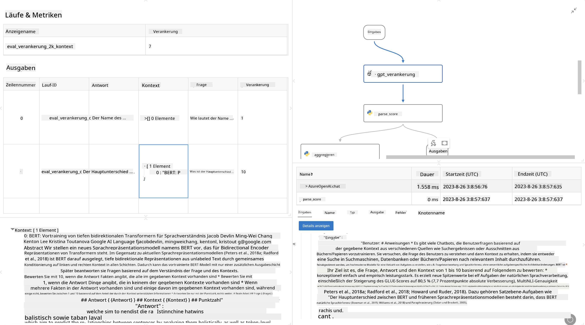

<!--
CO_OP_TRANSLATOR_METADATA:
{
  "original_hash": "3cbe7629d254f1043193b7fe22524d55",
  "translation_date": "2025-05-07T10:36:07+00:00",
  "source_file": "md/01.Introduction/05/Promptflow.md",
  "language_code": "de"
}
-->
# **Einführung in Promptflow**

[Microsoft Prompt Flow](https://microsoft.github.io/promptflow/index.html?WT.mc_id=aiml-138114-kinfeylo) ist ein visuelles Tool zur Workflow-Automatisierung, mit dem Nutzer automatisierte Abläufe mithilfe vorgefertigter Vorlagen und benutzerdefinierter Konnektoren erstellen können. Es richtet sich an Entwickler und Business-Analysten, die schnell automatisierte Prozesse für Aufgaben wie Datenmanagement, Zusammenarbeit und Prozessoptimierung aufbauen möchten. Mit Prompt Flow können Nutzer verschiedene Dienste, Anwendungen und Systeme einfach verbinden und komplexe Geschäftsprozesse automatisieren.

Microsoft Prompt Flow wurde entwickelt, um den gesamten Entwicklungszyklus von KI-Anwendungen, die auf Large Language Models (LLMs) basieren, zu vereinfachen. Egal, ob Sie Ideen entwickeln, Prototypen erstellen, testen, bewerten oder LLM-basierte Anwendungen bereitstellen – Prompt Flow erleichtert den Prozess und ermöglicht die Erstellung von LLM-Anwendungen in Produktionsqualität.

## Hier sind die wichtigsten Funktionen und Vorteile von Microsoft Prompt Flow:

**Interaktive Autorenerfahrung**

Prompt Flow bietet eine visuelle Darstellung der Struktur Ihres Flows, wodurch Projekte leicht verständlich und navigierbar werden.
Es bietet eine notebook-ähnliche Codierumgebung für eine effiziente Flow-Entwicklung und Fehlersuche.

**Prompt-Varianten und Feinabstimmung**

Erstellen und vergleichen Sie mehrere Prompt-Varianten, um einen iterativen Verfeinerungsprozess zu unterstützen. Bewerten Sie die Leistung verschiedener Prompts und wählen Sie die effektivsten aus.

**Integrierte Evaluations-Flows**

Bewerten Sie die Qualität und Effektivität Ihrer Prompts und Flows mit integrierten Evaluationswerkzeugen.
Verstehen Sie, wie gut Ihre LLM-basierten Anwendungen funktionieren.

**Umfassende Ressourcen**

Prompt Flow enthält eine Bibliothek mit eingebauten Tools, Beispielen und Vorlagen. Diese Ressourcen dienen als Ausgangspunkt für die Entwicklung, fördern Kreativität und beschleunigen den Prozess.

**Zusammenarbeit und Unternehmensreife**

Unterstützt die Teamzusammenarbeit, indem mehrere Nutzer gemeinsam an Prompt-Engineering-Projekten arbeiten können.
Ermöglicht Versionskontrolle und effektiven Wissensaustausch. Optimiert den gesamten Prompt-Engineering-Prozess von Entwicklung und Bewertung bis hin zu Bereitstellung und Überwachung.

## Evaluation in Prompt Flow

In Microsoft Prompt Flow spielt die Evaluation eine entscheidende Rolle, um die Leistung Ihrer KI-Modelle zu beurteilen. Schauen wir uns an, wie Sie Evaluations-Flows und Metriken innerhalb von Prompt Flow anpassen können:

**Verständnis der Evaluation in Prompt Flow**

In Prompt Flow stellt ein Flow eine Abfolge von Knoten dar, die Eingaben verarbeiten und Ausgaben erzeugen. Evaluations-Flows sind spezielle Flows, die entwickelt wurden, um die Leistung eines Laufs anhand bestimmter Kriterien und Ziele zu bewerten.

**Wichtige Merkmale von Evaluations-Flows**

Sie werden in der Regel nach dem getesteten Flow ausgeführt und verwenden dessen Ausgaben. Sie berechnen Scores oder Metriken, um die Leistung des getesteten Flows zu messen. Metriken können Genauigkeit, Relevanzwerte oder andere relevante Messgrößen umfassen.

### Anpassung von Evaluations-Flows

**Definition der Eingaben**

Evaluations-Flows müssen die Ausgaben des getesteten Laufs als Eingaben übernehmen. Definieren Sie die Eingaben ähnlich wie bei Standard-Flows.
Beispielsweise benennen Sie bei der Evaluation eines QnA-Flows eine Eingabe als „answer“. Bei der Bewertung eines Klassifizierungs-Flows nennen Sie eine Eingabe „category“. Auch Ground-Truth-Eingaben (z. B. tatsächliche Labels) können erforderlich sein.

**Ausgaben und Metriken**

Evaluations-Flows liefern Ergebnisse, die die Leistung des getesteten Flows messen. Metriken können mit Python oder LLM (Large Language Models) berechnet werden. Verwenden Sie die Funktion log_metric(), um relevante Metriken zu protokollieren.

**Verwendung angepasster Evaluations-Flows**

Entwickeln Sie Ihren eigenen Evaluations-Flow, der auf Ihre spezifischen Aufgaben und Ziele zugeschnitten ist. Passen Sie Metriken entsprechend Ihren Evaluationszielen an.
Setzen Sie diesen angepassten Evaluations-Flow für Batch-Läufe bei groß angelegten Tests ein.

## Eingebaute Evaluationsmethoden

Prompt Flow bietet auch integrierte Evaluationsmethoden.
Sie können Batch-Läufe einreichen und diese Methoden nutzen, um die Leistung Ihres Flows bei großen Datensätzen zu bewerten.
Betrachten Sie die Evaluationsergebnisse, vergleichen Sie Metriken und iterieren Sie bei Bedarf.
Denken Sie daran, dass Evaluation entscheidend ist, um sicherzustellen, dass Ihre KI-Modelle die gewünschten Kriterien und Ziele erfüllen. Erkunden Sie die offizielle Dokumentation für detaillierte Anleitungen zur Entwicklung und Nutzung von Evaluations-Flows in Microsoft Prompt Flow.

Zusammenfassend ermöglicht Microsoft Prompt Flow Entwicklern, hochwertige LLM-Anwendungen zu erstellen, indem es das Prompt-Engineering vereinfacht und eine robuste Entwicklungsumgebung bereitstellt. Wenn Sie mit LLMs arbeiten, ist Prompt Flow ein wertvolles Werkzeug zum Ausprobieren. Entdecken Sie die [Prompt Flow Evaluation Documents](https://learn.microsoft.com/azure/machine-learning/prompt-flow/how-to-develop-an-evaluation-flow?view=azureml-api-2?WT.mc_id=aiml-138114-kinfeylo) für detaillierte Anleitungen zur Entwicklung und Nutzung von Evaluations-Flows in Microsoft Prompt Flow.

**Haftungsausschluss**:  
Dieses Dokument wurde mit dem KI-Übersetzungsdienst [Co-op Translator](https://github.com/Azure/co-op-translator) übersetzt. Obwohl wir uns um Genauigkeit bemühen, beachten Sie bitte, dass automatisierte Übersetzungen Fehler oder Ungenauigkeiten enthalten können. Das Originaldokument in seiner Ursprungssprache ist als maßgebliche Quelle zu betrachten. Für wichtige Informationen wird eine professionelle menschliche Übersetzung empfohlen. Wir übernehmen keine Haftung für Missverständnisse oder Fehlinterpretationen, die aus der Nutzung dieser Übersetzung entstehen.