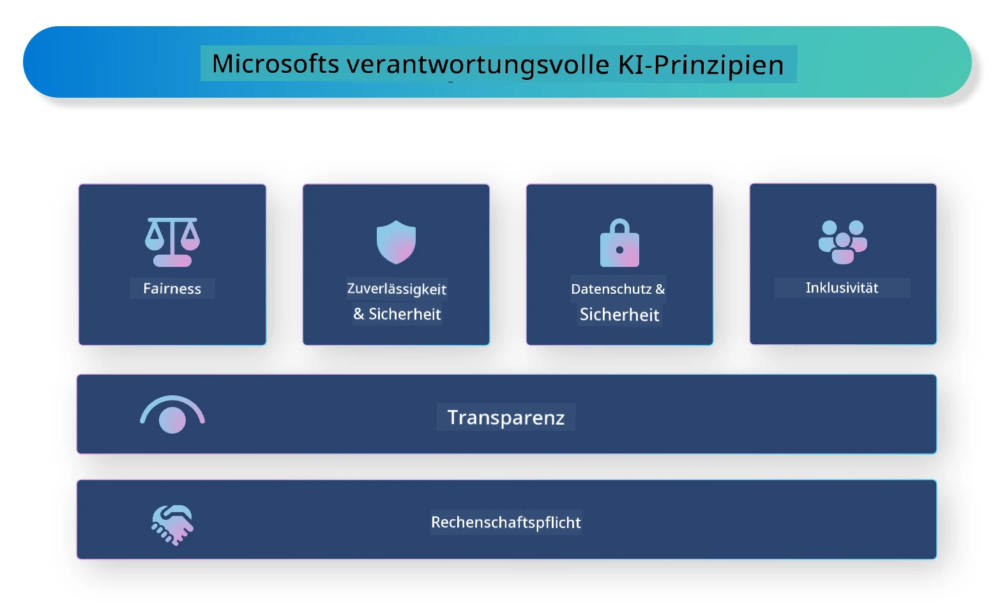

# **Einführung in Responsible AI**

[Microsoft Responsible AI](https://www.microsoft.com/ai/responsible-ai?WT.mc_id=aiml-138114-kinfeylo) ist eine Initiative, die Entwickler und Organisationen dabei unterstützt, KI-Systeme zu entwickeln, die transparent, vertrauenswürdig und verantwortungsvoll sind. Die Initiative bietet Leitlinien und Ressourcen zur Entwicklung verantwortungsvoller KI-Lösungen, die mit ethischen Grundsätzen wie Datenschutz, Fairness und Transparenz im Einklang stehen. Außerdem werden wir einige der Herausforderungen und bewährten Verfahren im Zusammenhang mit dem Aufbau verantwortungsvoller KI-Systeme betrachten.

## Überblick über Microsoft Responsible AI

**Ethische Grundsätze**

Microsoft Responsible AI orientiert sich an einer Reihe ethischer Grundsätze wie Datenschutz, Fairness, Transparenz, Verantwortlichkeit und Sicherheit. Diese Prinzipien sollen sicherstellen, dass KI-Systeme auf ethische und verantwortungsvolle Weise entwickelt werden.

**Transparente KI**

Microsoft Responsible AI legt großen Wert auf Transparenz in KI-Systemen. Dazu gehört, klare Erklärungen darüber zu liefern, wie KI-Modelle funktionieren, sowie sicherzustellen, dass Datenquellen und Algorithmen öffentlich zugänglich sind.

**Verantwortliche KI**

[Microsoft Responsible AI](https://www.microsoft.com/ai/responsible-ai?WT.mc_id=aiml-138114-kinfeylo) fördert die Entwicklung verantwortlicher KI-Systeme, die Einblicke darin geben können, wie KI-Modelle Entscheidungen treffen. Dies hilft Nutzern, die Ergebnisse von KI-Systemen besser zu verstehen und ihnen zu vertrauen.

**Inklusivität**

KI-Systeme sollten so gestaltet sein, dass sie allen zugutekommen. Microsoft strebt danach, inklusive KI zu schaffen, die unterschiedliche Perspektiven berücksichtigt und Vorurteile oder Diskriminierung vermeidet.

**Zuverlässigkeit und Sicherheit**

Die Gewährleistung, dass KI-Systeme zuverlässig und sicher sind, ist entscheidend. Microsoft konzentriert sich darauf, robuste Modelle zu entwickeln, die konsistent arbeiten und schädliche Folgen vermeiden.

**Fairness in der KI**

Microsoft Responsible AI erkennt an, dass KI-Systeme Vorurteile verstärken können, wenn sie mit voreingenommenen Daten oder Algorithmen trainiert werden. Die Initiative bietet Leitlinien zur Entwicklung fairer KI-Systeme, die nicht aufgrund von Faktoren wie Rasse, Geschlecht oder Alter diskriminieren.

**Datenschutz und Sicherheit**

Microsoft Responsible AI betont die Bedeutung des Schutzes der Privatsphäre der Nutzer und der Datensicherheit in KI-Systemen. Dazu gehört die Implementierung starker Datenverschlüsselung und Zugangskontrollen sowie regelmäßige Überprüfungen der KI-Systeme auf Schwachstellen.

**Verantwortlichkeit und Haftung**

Microsoft Responsible AI fördert Verantwortlichkeit und Haftung bei der Entwicklung und dem Einsatz von KI. Dazu gehört, dass Entwickler und Organisationen sich der potenziellen Risiken von KI-Systemen bewusst sind und Maßnahmen ergreifen, um diese Risiken zu minimieren.

## Bewährte Verfahren für den Aufbau verantwortungsvoller KI-Systeme

**Entwickeln Sie KI-Modelle mit vielfältigen Datensätzen**

Um Vorurteile in KI-Systemen zu vermeiden, ist es wichtig, vielfältige Datensätze zu verwenden, die unterschiedliche Perspektiven und Erfahrungen abbilden.

**Verwenden Sie erklärbare KI-Techniken**

Erklärbare KI-Techniken helfen Nutzern zu verstehen, wie KI-Modelle Entscheidungen treffen, was das Vertrauen in das System erhöhen kann.

**Führen Sie regelmäßige Überprüfungen der KI-Systeme auf Schwachstellen durch**

Regelmäßige Audits von KI-Systemen helfen, potenzielle Risiken und Schwachstellen zu erkennen, die behoben werden müssen.

**Implementieren Sie starke Datenverschlüsselung und Zugangskontrollen**

Datenverschlüsselung und Zugangskontrollen schützen die Privatsphäre und Sicherheit der Nutzer in KI-Systemen.

**Folgen Sie ethischen Grundsätzen bei der KI-Entwicklung**

Die Einhaltung ethischer Grundsätze wie Fairness, Transparenz und Verantwortlichkeit trägt dazu bei, Vertrauen in KI-Systeme aufzubauen und sicherzustellen, dass sie verantwortungsvoll entwickelt werden.

## Verwendung von AI Foundry für Responsible AI

[Azure AI Foundry](https://ai.azure.com?WT.mc_id=aiml-138114-kinfeylo) ist eine leistungsstarke Plattform, die Entwicklern und Organisationen ermöglicht, schnell intelligente, moderne, marktreife und verantwortungsvolle Anwendungen zu erstellen. Hier sind einige wichtige Funktionen und Möglichkeiten von Azure AI Foundry:

**Fertige APIs und Modelle**

Azure AI Foundry bietet vorgefertigte und anpassbare APIs und Modelle. Diese decken eine breite Palette von KI-Aufgaben ab, darunter generative KI, natürliche Sprachverarbeitung für Konversationen, Suche, Überwachung, Übersetzung, Sprache, Bildverarbeitung und Entscheidungsfindung.

**Prompt Flow**

Prompt Flow in Azure AI Foundry ermöglicht es, konversationelle KI-Erlebnisse zu erstellen. Es erlaubt die Gestaltung und Verwaltung von Gesprächsabläufen, was den Aufbau von Chatbots, virtuellen Assistenten und anderen interaktiven Anwendungen erleichtert.

**Retrieval Augmented Generation (RAG)**

RAG ist eine Technik, die retrieval-basierte und generative Ansätze kombiniert. Sie verbessert die Qualität der generierten Antworten, indem sie sowohl auf vorhandenes Wissen (Retrieval) als auch auf kreative Generierung (Generation) zurückgreift.

**Bewertungs- und Überwachungsmetriken für generative KI**

Azure AI Foundry stellt Werkzeuge zur Bewertung und Überwachung generativer KI-Modelle bereit. Sie können deren Leistung, Fairness und andere wichtige Kennzahlen beurteilen, um eine verantwortungsvolle Nutzung sicherzustellen. Wenn Sie ein Dashboard erstellt haben, können Sie die No-Code-Benutzeroberfläche im Azure Machine Learning Studio nutzen, um ein Responsible AI Dashboard und eine zugehörige Scorecard basierend auf den [Responsible AI Toolbox](https://responsibleaitoolbox.ai/?WT.mc_id=aiml-138114-kinfeylo) Python-Bibliotheken anzupassen und zu erstellen. Diese Scorecard hilft dabei, wichtige Erkenntnisse zu Fairness, Merkmalsbedeutung und weiteren Aspekten der verantwortungsvollen Nutzung sowohl technischen als auch nicht-technischen Stakeholdern zu vermitteln.

Um AI Foundry mit Responsible AI zu nutzen, können Sie folgende bewährte Verfahren befolgen:

**Definieren Sie das Problem und die Ziele Ihres KI-Systems**

Bevor Sie mit der Entwicklung beginnen, ist es wichtig, das Problem oder Ziel, das Ihr KI-System lösen soll, klar zu definieren. Das hilft Ihnen, die benötigten Daten, Algorithmen und Ressourcen zu identifizieren, um ein effektives Modell zu erstellen.

**Sammeln und bereiten Sie relevante Daten auf**

Die Qualität und Quantität der für das Training verwendeten Daten haben großen Einfluss auf die Leistung eines KI-Systems. Daher ist es wichtig, relevante Daten zu sammeln, zu bereinigen, vorzubereiten und sicherzustellen, dass sie die Zielgruppe oder das zu lösende Problem repräsentieren.

**Wählen Sie geeignete Evaluationsmethoden**

Es gibt verschiedene Evaluationsalgorithmen. Wählen Sie den passendsten Algorithmus basierend auf Ihren Daten und dem Problem aus.

**Bewerten und interpretieren Sie das Modell**

Nachdem Sie ein KI-Modell erstellt haben, ist es wichtig, dessen Leistung mit geeigneten Metriken zu bewerten und die Ergebnisse transparent zu interpretieren. So können Sie eventuelle Vorurteile oder Einschränkungen im Modell erkennen und bei Bedarf Verbesserungen vornehmen.

**Sorgen Sie für Transparenz und Erklärbarkeit**

KI-Systeme sollten transparent und erklärbar sein, damit Nutzer verstehen, wie sie funktionieren und wie Entscheidungen getroffen werden. Das ist besonders wichtig bei Anwendungen mit erheblichen Auswirkungen auf Menschen, wie im Gesundheitswesen, Finanzwesen oder Rechtssystem.

**Überwachen und aktualisieren Sie das Modell**

KI-Systeme sollten kontinuierlich überwacht und aktualisiert werden, um ihre Genauigkeit und Effektivität im Laufe der Zeit zu gewährleisten. Das erfordert laufende Wartung, Tests und Nachtrainieren des Modells.

Abschließend lässt sich sagen, dass Microsoft Responsible AI eine Initiative ist, die Entwickler und Organisationen dabei unterstützt, KI-Systeme zu schaffen, die transparent, vertrauenswürdig und verantwortungsvoll sind. Die Umsetzung von Responsible AI ist entscheidend, und Azure AI Foundry soll dies für Organisationen praktikabel machen. Indem wir ethische Grundsätze und bewährte Verfahren befolgen, können wir sicherstellen, dass KI-Systeme verantwortungsvoll entwickelt und eingesetzt werden – zum Nutzen der gesamten Gesellschaft.

**Haftungsausschluss**:  
Dieses Dokument wurde mit dem KI-Übersetzungsdienst [Co-op Translator](https://github.com/Azure/co-op-translator) übersetzt. Obwohl wir uns um Genauigkeit bemühen, beachten Sie bitte, dass automatisierte Übersetzungen Fehler oder Ungenauigkeiten enthalten können. Das Originaldokument in seiner Ursprungssprache ist als maßgebliche Quelle zu betrachten. Für wichtige Informationen wird eine professionelle menschliche Übersetzung empfohlen. Wir übernehmen keine Haftung für Missverständnisse oder Fehlinterpretationen, die aus der Nutzung dieser Übersetzung entstehen.