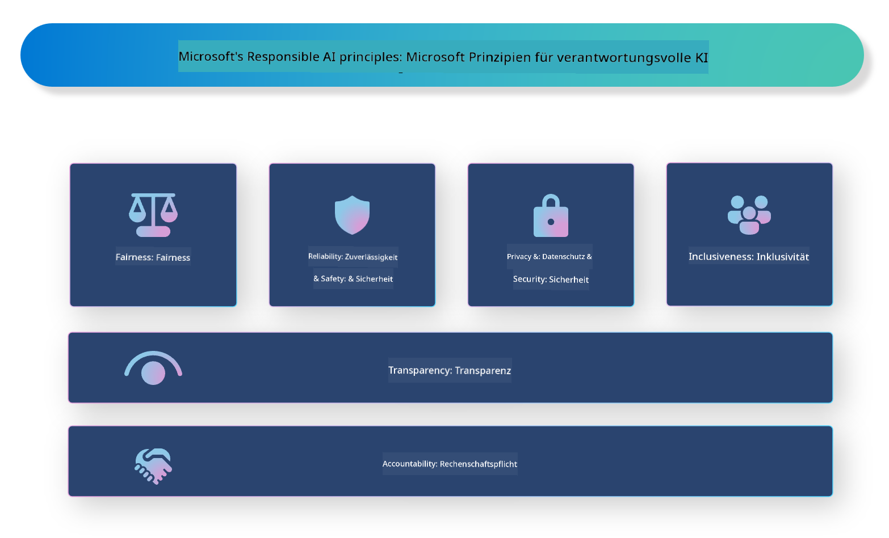

<!--
CO_OP_TRANSLATOR_METADATA:
{
  "original_hash": "805b96b20152936d8f4c587d90d6e06e",
  "translation_date": "2025-05-07T10:35:27+00:00",
  "source_file": "md/01.Introduction/05/ResponsibleAI.md",
  "language_code": "de"
}
-->
# **Einführung in Responsible AI**

[Microsoft Responsible AI](https://www.microsoft.com/ai/responsible-ai?WT.mc_id=aiml-138114-kinfeylo) ist eine Initiative, die Entwickler und Organisationen dabei unterstützt, KI-Systeme zu entwickeln, die transparent, vertrauenswürdig und verantwortungsvoll sind. Die Initiative bietet Leitlinien und Ressourcen zur Entwicklung verantwortungsvoller KI-Lösungen, die mit ethischen Grundsätzen wie Datenschutz, Fairness und Transparenz übereinstimmen. Wir werden auch einige der Herausforderungen und bewährten Praktiken im Zusammenhang mit dem Aufbau verantwortungsvoller KI-Systeme betrachten.

## Überblick über Microsoft Responsible AI

**Ethische Grundsätze**

Microsoft Responsible AI orientiert sich an einer Reihe ethischer Grundsätze wie Datenschutz, Fairness, Transparenz, Verantwortlichkeit und Sicherheit. Diese Prinzipien sollen sicherstellen, dass KI-Systeme auf ethische und verantwortungsvolle Weise entwickelt werden.

**Transparente KI**

Microsoft Responsible AI legt großen Wert auf Transparenz in KI-Systemen. Das bedeutet, dass klar erklärt wird, wie KI-Modelle funktionieren, und dass Datenquellen sowie Algorithmen öffentlich zugänglich sind.

**Verantwortliche KI**

[Microsoft Responsible AI](https://www.microsoft.com/ai/responsible-ai?WT.mc_id=aiml-138114-kinfeylo) fördert die Entwicklung verantwortlicher KI-Systeme, die Einblicke geben, wie KI-Modelle Entscheidungen treffen. Dies hilft den Nutzern, die Ergebnisse der KI-Systeme besser zu verstehen und ihnen zu vertrauen.

**Inklusivität**

KI-Systeme sollten so gestaltet sein, dass sie allen zugutekommen. Microsoft strebt danach, inklusive KI zu schaffen, die unterschiedliche Perspektiven berücksichtigt und Vorurteile oder Diskriminierung vermeidet.

**Zuverlässigkeit und Sicherheit**

Es ist entscheidend, dass KI-Systeme zuverlässig und sicher sind. Microsoft konzentriert sich darauf, robuste Modelle zu entwickeln, die konstant gute Leistungen erbringen und schädliche Ergebnisse vermeiden.

**Fairness in der KI**

Microsoft Responsible AI erkennt an, dass KI-Systeme Vorurteile verstärken können, wenn sie mit voreingenommenen Daten oder Algorithmen trainiert werden. Die Initiative bietet Leitlinien zur Entwicklung fairer KI-Systeme, die nicht aufgrund von Faktoren wie Rasse, Geschlecht oder Alter diskriminieren.

**Datenschutz und Sicherheit**

Microsoft Responsible AI betont die Bedeutung des Schutzes der Privatsphäre und der Datensicherheit in KI-Systemen. Dazu gehört die Implementierung starker Datenverschlüsselung und Zugangskontrollen sowie regelmäßige Prüfungen der KI-Systeme auf Schwachstellen.

**Verantwortlichkeit und Haftung**

Microsoft Responsible AI fördert Verantwortung und Haftung bei der Entwicklung und dem Einsatz von KI. Das bedeutet, dass Entwickler und Organisationen sich der potenziellen Risiken bewusst sind und Maßnahmen ergreifen, um diese zu minimieren.

## Bewährte Praktiken für den Aufbau verantwortungsvoller KI-Systeme

**Entwicklung von KI-Modellen mit vielfältigen Datensätzen**

Um Vorurteile in KI-Systemen zu vermeiden, ist es wichtig, vielfältige Datensätze zu verwenden, die unterschiedliche Perspektiven und Erfahrungen abbilden.

**Verwendung erklärbarer KI-Techniken**

Erklärbare KI-Techniken helfen Nutzern zu verstehen, wie KI-Modelle Entscheidungen treffen, was das Vertrauen in das System stärkt.

**Regelmäßige Überprüfung der KI-Systeme auf Schwachstellen**

Regelmäßige Audits helfen, potenzielle Risiken und Schwachstellen zu erkennen, die behoben werden müssen.

**Implementierung starker Datenverschlüsselung und Zugangskontrollen**

Datenverschlüsselung und Zugangskontrollen schützen die Privatsphäre und Sicherheit der Nutzer in KI-Systemen.

**Einhaltung ethischer Grundsätze bei der KI-Entwicklung**

Die Beachtung ethischer Prinzipien wie Fairness, Transparenz und Verantwortlichkeit trägt dazu bei, Vertrauen in KI-Systeme aufzubauen und sicherzustellen, dass sie verantwortungsvoll entwickelt werden.

## Verwendung von AI Foundry für Responsible AI

[Azure AI Foundry](https://ai.azure.com?WT.mc_id=aiml-138114-kinfeylo) ist eine leistungsstarke Plattform, die Entwicklern und Organisationen ermöglicht, schnell intelligente, moderne, marktreife und verantwortungsvolle Anwendungen zu erstellen. Hier sind einige wichtige Funktionen und Möglichkeiten von Azure AI Foundry:

**Fertige APIs und Modelle**

Azure AI Foundry bietet vorgefertigte und anpassbare APIs und Modelle. Diese decken eine breite Palette von KI-Aufgaben ab, darunter generative KI, natürliche Sprachverarbeitung für Konversationen, Suche, Überwachung, Übersetzung, Sprache, Bildverarbeitung und Entscheidungsfindung.

**Prompt Flow**

Mit Prompt Flow in Azure AI Foundry lassen sich konversationelle KI-Erlebnisse erstellen. Es ermöglicht die Gestaltung und Verwaltung von Gesprächsabläufen, was den Aufbau von Chatbots, virtuellen Assistenten und anderen interaktiven Anwendungen erleichtert.

**Retrieval Augmented Generation (RAG)**

RAG ist eine Technik, die retrieval-basierte und generative Ansätze kombiniert. Dadurch wird die Qualität der generierten Antworten verbessert, indem sowohl vorhandenes Wissen (Retrieval) als auch kreative Generierung (Generation) genutzt werden.

**Evaluations- und Überwachungsmetriken für generative KI**

Azure AI Foundry stellt Werkzeuge zur Verfügung, um generative KI-Modelle zu bewerten und zu überwachen. So können Leistung, Fairness und andere wichtige Kennzahlen überprüft werden, um eine verantwortungsvolle Nutzung sicherzustellen. Außerdem lässt sich mit dem No-Code-UI im Azure Machine Learning Studio ein Responsible AI Dashboard und ein zugehöriges Scorecard basierend auf den [Responsible AI Toolbox](https://responsibleaitoolbox.ai/?WT.mc_id=aiml-138114-kinfeylo) Python-Bibliotheken erstellen. Dieses Scorecard hilft dabei, wichtige Erkenntnisse zu Fairness, Merkmalbedeutung und anderen Aspekten verantwortungsvoller Bereitstellung sowohl technischen als auch nicht-technischen Stakeholdern zu vermitteln.

Um AI Foundry verantwortungsvoll zu nutzen, können Sie folgende bewährte Praktiken beachten:

**Definieren Sie das Problem und die Ziele Ihres KI-Systems**

Bevor Sie mit der Entwicklung beginnen, sollten Sie klar das Problem oder Ziel definieren, das Ihr KI-System lösen soll. Das hilft, die benötigten Daten, Algorithmen und Ressourcen zu identifizieren.

**Sammeln und bereiten Sie relevante Daten auf**

Die Qualität und Quantität der Trainingsdaten beeinflussen die Leistung eines KI-Systems maßgeblich. Daher ist es wichtig, relevante Daten zu sammeln, zu bereinigen, vorzubereiten und sicherzustellen, dass sie die Zielgruppe oder das Problem angemessen repräsentieren.

**Wählen Sie die passende Evaluierungsmethode**

Es gibt verschiedene Evaluierungsalgorithmen. Wählen Sie denjenigen aus, der am besten zu Ihren Daten und Ihrem Problem passt.

**Bewerten und interpretieren Sie das Modell**

Nach dem Aufbau eines KI-Modells sollten Sie dessen Leistung mit geeigneten Metriken bewerten und die Ergebnisse transparent interpretieren. So können Sie mögliche Verzerrungen oder Einschränkungen erkennen und Verbesserungen vornehmen.

**Sichern Sie Transparenz und Erklärbarkeit**

KI-Systeme sollten transparent und erklärbar sein, damit Nutzer verstehen, wie sie funktionieren und wie Entscheidungen zustande kommen. Das ist besonders wichtig bei Anwendungen mit großen Auswirkungen auf Menschen, etwa im Gesundheitswesen, Finanzwesen oder Rechtssystem.

**Überwachen und aktualisieren Sie das Modell**

KI-Systeme müssen kontinuierlich überwacht und aktualisiert werden, um ihre Genauigkeit und Wirksamkeit langfristig zu gewährleisten. Das erfordert fortlaufende Wartung, Tests und Nachtrainings.

Abschließend lässt sich sagen, dass Microsoft Responsible AI eine Initiative ist, die Entwickler und Organisationen dabei unterstützt, KI-Systeme zu schaffen, die transparent, vertrauenswürdig und verantwortungsvoll sind. Die Umsetzung von Responsible AI ist entscheidend, und Azure AI Foundry soll dies für Organisationen praktikabel machen. Durch die Beachtung ethischer Grundsätze und bewährter Praktiken können wir sicherstellen, dass KI-Systeme verantwortungsvoll entwickelt und eingesetzt werden und der Gesellschaft insgesamt zugutekommen.

**Haftungsausschluss**:  
Dieses Dokument wurde mit dem KI-Übersetzungsdienst [Co-op Translator](https://github.com/Azure/co-op-translator) übersetzt. Obwohl wir uns um Genauigkeit bemühen, beachten Sie bitte, dass automatisierte Übersetzungen Fehler oder Ungenauigkeiten enthalten können. Das Originaldokument in seiner Ursprungssprache gilt als maßgebliche Quelle. Für wichtige Informationen wird eine professionelle menschliche Übersetzung empfohlen. Wir übernehmen keine Haftung für Missverständnisse oder Fehlinterpretationen, die aus der Verwendung dieser Übersetzung entstehen.