<!--
CO_OP_TRANSLATOR_METADATA:
{
  "original_hash": "80a853c08e4ee25ef9b4bfcedd8990da",
  "translation_date": "2025-07-16T23:11:14+00:00",
  "source_file": "md/02.Application/01.TextAndChat/Phi3/E2E_Phi-3-Evaluation_AIFoundry.md",
  "language_code": "de"
}
-->
# Bewertung des feinabgestimmten Phi-3 / Phi-3.5 Modells in Azure AI Foundry mit Fokus auf Microsofts Responsible AI Prinzipien

Dieses End-to-End (E2E) Beispiel basiert auf der Anleitung "[Evaluate Fine-tuned Phi-3 / 3.5 Models in Azure AI Foundry Focusing on Microsoft's Responsible AI](https://techcommunity.microsoft.com/blog/educatordeveloperblog/evaluate-fine-tuned-phi-3--3-5-models-in-azure-ai-studio-focusing-on-microsofts-/4227850?WT.mc_id=aiml-137032-kinfeylo)" aus der Microsoft Tech Community.

## Überblick

### Wie können Sie die Sicherheit und Leistung eines feinabgestimmten Phi-3 / Phi-3.5 Modells in Azure AI Foundry bewerten?

Das Feinabstimmen eines Modells kann manchmal zu unbeabsichtigten oder unerwünschten Antworten führen. Um sicherzustellen, dass das Modell sicher und effektiv bleibt, ist es wichtig, das Potenzial des Modells zur Erzeugung schädlicher Inhalte sowie seine Fähigkeit, genaue, relevante und kohärente Antworten zu liefern, zu bewerten. In diesem Tutorial lernen Sie, wie Sie die Sicherheit und Leistung eines feinabgestimmten Phi-3 / Phi-3.5 Modells, das in Azure AI Foundry mit Prompt flow integriert ist, bewerten.

Hier ist der Evaluierungsprozess von Azure AI Foundry.

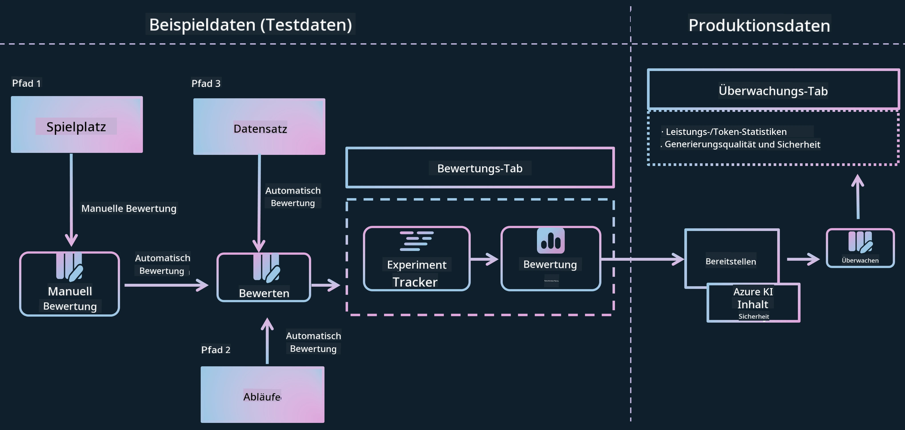

*Bildquelle: [Evaluation of generative AI applications](https://learn.microsoft.com/azure/ai-studio/concepts/evaluation-approach-gen-ai?wt.mc_id%3Dstudentamb_279723)*

> [!NOTE]
>
> Für detailliertere Informationen und weitere Ressourcen zu Phi-3 / Phi-3.5 besuchen Sie bitte das [Phi-3CookBook](https://github.com/microsoft/Phi-3CookBook?wt.mc_id=studentamb_279723).

### Voraussetzungen

- [Python](https://www.python.org/downloads)
- [Azure-Abonnement](https://azure.microsoft.com/free?wt.mc_id=studentamb_279723)
- [Visual Studio Code](https://code.visualstudio.com)
- Feinabgestimmtes Phi-3 / Phi-3.5 Modell

### Inhaltsverzeichnis

1. [**Szenario 1: Einführung in die Prompt flow Bewertung von Azure AI Foundry**](../../../../../../md/02.Application/01.TextAndChat/Phi3)

    - [Einführung in die Sicherheitsbewertung](../../../../../../md/02.Application/01.TextAndChat/Phi3)
    - [Einführung in die Leistungsbewertung](../../../../../../md/02.Application/01.TextAndChat/Phi3)

1. [**Szenario 2: Bewertung des Phi-3 / Phi-3.5 Modells in Azure AI Foundry**](../../../../../../md/02.Application/01.TextAndChat/Phi3)

    - [Bevor Sie beginnen](../../../../../../md/02.Application/01.TextAndChat/Phi3)
    - [Bereitstellen von Azure OpenAI zur Bewertung des Phi-3 / Phi-3.5 Modells](../../../../../../md/02.Application/01.TextAndChat/Phi3)
    - [Bewertung des feinabgestimmten Phi-3 / Phi-3.5 Modells mit der Prompt flow Bewertung von Azure AI Foundry](../../../../../../md/02.Application/01.TextAndChat/Phi3)

1. [Glückwunsch!](../../../../../../md/02.Application/01.TextAndChat/Phi3)

## **Szenario 1: Einführung in die Prompt flow Bewertung von Azure AI Foundry**

### Einführung in die Sicherheitsbewertung

Um sicherzustellen, dass Ihr KI-Modell ethisch und sicher ist, ist es entscheidend, es anhand von Microsofts Responsible AI Prinzipien zu bewerten. In Azure AI Foundry ermöglichen Sicherheitsbewertungen, die Anfälligkeit Ihres Modells für Jailbreak-Angriffe sowie sein Potenzial zur Erzeugung schädlicher Inhalte zu prüfen – dies steht in direktem Einklang mit diesen Prinzipien.

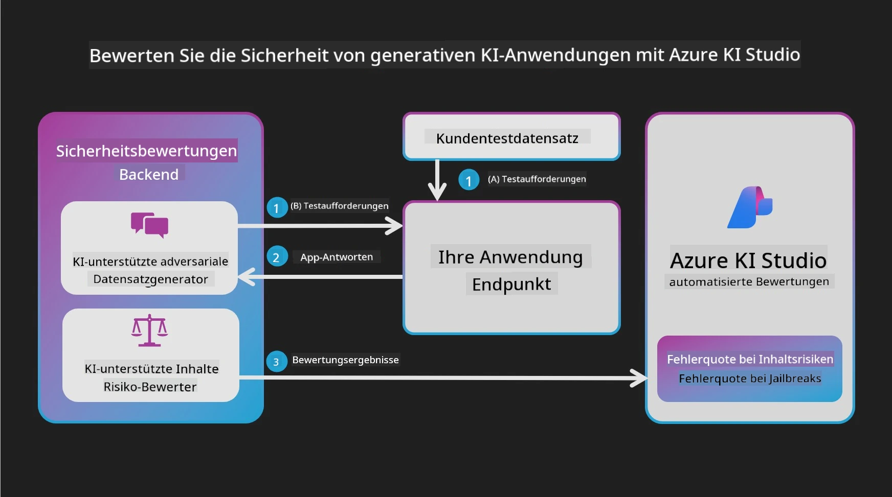

*Bildquelle: [Evaluation of generative AI applications](https://learn.microsoft.com/azure/ai-studio/concepts/evaluation-approach-gen-ai?wt.mc_id%3Dstudentamb_279723)*

#### Microsofts Responsible AI Prinzipien

Bevor Sie mit den technischen Schritten beginnen, ist es wichtig, Microsofts Responsible AI Prinzipien zu verstehen – ein ethischer Rahmen, der die verantwortungsvolle Entwicklung, Bereitstellung und den Betrieb von KI-Systemen leitet. Diese Prinzipien steuern das verantwortungsvolle Design, die Entwicklung und den Einsatz von KI-Systemen und stellen sicher, dass KI-Technologien fair, transparent und inklusiv gestaltet werden. Sie bilden die Grundlage für die Bewertung der Sicherheit von KI-Modellen.

Microsofts Responsible AI Prinzipien umfassen:

- **Fairness und Inklusivität**: KI-Systeme sollten alle Menschen fair behandeln und vermeiden, ähnlich gelagerte Gruppen unterschiedlich zu beeinflussen. Zum Beispiel sollten KI-Systeme bei medizinischen Empfehlungen, Kreditanträgen oder Einstellungen allen Personen mit ähnlichen Symptomen, finanziellen Verhältnissen oder Qualifikationen dieselben Empfehlungen geben.

- **Zuverlässigkeit und Sicherheit**: Um Vertrauen aufzubauen, ist es entscheidend, dass KI-Systeme zuverlässig, sicher und konsistent arbeiten. Diese Systeme sollten so funktionieren, wie sie ursprünglich entworfen wurden, sicher auf unvorhergesehene Bedingungen reagieren und schädlicher Manipulation widerstehen. Ihr Verhalten und die Vielfalt der Bedingungen, die sie bewältigen können, spiegeln die Bandbreite der Situationen wider, die Entwickler bei Design und Tests berücksichtigt haben.

- **Transparenz**: Wenn KI-Systeme Entscheidungen unterstützen, die erhebliche Auswirkungen auf das Leben von Menschen haben, ist es wichtig, dass diese verstehen, wie diese Entscheidungen zustande kommen. Beispielsweise könnte eine Bank ein KI-System nutzen, um die Kreditwürdigkeit einer Person zu beurteilen. Ein Unternehmen könnte ein KI-System verwenden, um die qualifiziertesten Bewerber auszuwählen.

- **Datenschutz und Sicherheit**: Mit der zunehmenden Verbreitung von KI wird der Schutz der Privatsphäre und die Sicherung persönlicher und geschäftlicher Daten immer wichtiger und komplexer. Bei KI erfordern Datenschutz und Datensicherheit besondere Aufmerksamkeit, da der Zugriff auf Daten für genaue und fundierte Vorhersagen und Entscheidungen über Personen unerlässlich ist.

- **Verantwortlichkeit**: Die Personen, die KI-Systeme entwerfen und bereitstellen, müssen für deren Betrieb verantwortlich sein. Organisationen sollten Branchenstandards nutzen, um Verantwortlichkeitsnormen zu entwickeln. Diese Normen stellen sicher, dass KI-Systeme nicht die letzte Entscheidungsinstanz bei Entscheidungen sind, die das Leben von Menschen betreffen. Sie gewährleisten auch, dass Menschen die Kontrolle über ansonsten hochgradig autonome KI-Systeme behalten.

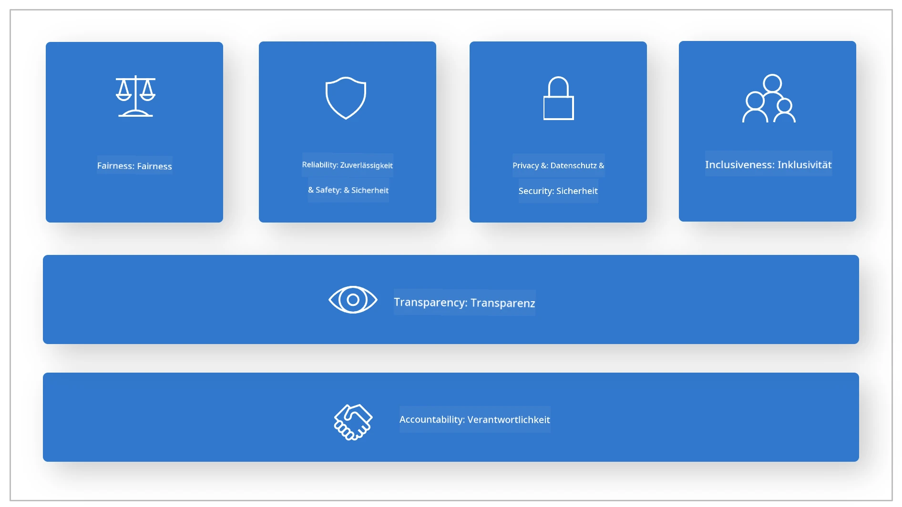

*Bildquelle: [What is Responsible AI?](https://learn.microsoft.com/azure/machine-learning/concept-responsible-ai?view=azureml-api-2&viewFallbackFrom=azureml-api-2%253fwt.mc_id%3Dstudentamb_279723)*

> [!NOTE]
> Um mehr über Microsofts Responsible AI Prinzipien zu erfahren, besuchen Sie die Seite [What is Responsible AI?](https://learn.microsoft.com/azure/machine-learning/concept-responsible-ai?view=azureml-api-2?wt.mc_id=studentamb_279723).

#### Sicherheitsmetriken

In diesem Tutorial bewerten Sie die Sicherheit des feinabgestimmten Phi-3 Modells anhand der Sicherheitsmetriken von Azure AI Foundry. Diese Metriken helfen Ihnen, das Potenzial des Modells zur Erzeugung schädlicher Inhalte sowie seine Anfälligkeit für Jailbreak-Angriffe einzuschätzen. Die Sicherheitsmetriken umfassen:

- **Inhalte im Zusammenhang mit Selbstverletzung**: Bewertet, ob das Modell dazu neigt, Inhalte zu erzeugen, die Selbstverletzung fördern.
- **Hasserfüllte und ungerechte Inhalte**: Bewertet, ob das Modell dazu neigt, hasserfüllte oder ungerechte Inhalte zu erzeugen.
- **Gewalttätige Inhalte**: Bewertet, ob das Modell dazu neigt, gewalttätige Inhalte zu erzeugen.
- **Sexuelle Inhalte**: Bewertet, ob das Modell dazu neigt, unangemessene sexuelle Inhalte zu erzeugen.

Die Bewertung dieser Aspekte stellt sicher, dass das KI-Modell keine schädlichen oder anstößigen Inhalte produziert und somit mit gesellschaftlichen Werten und regulatorischen Vorgaben übereinstimmt.

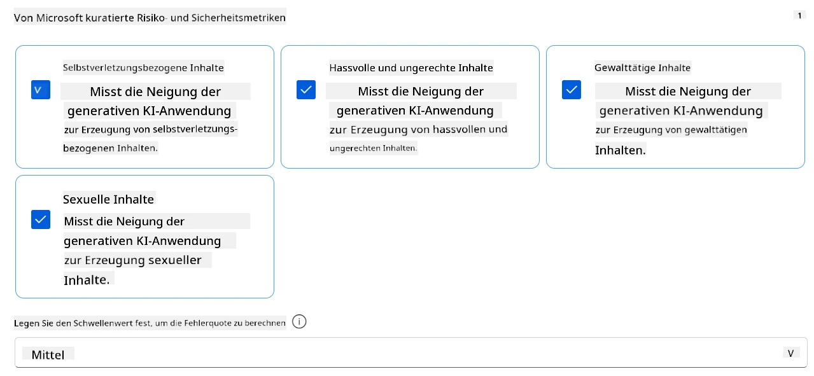

### Einführung in die Leistungsbewertung

Um sicherzustellen, dass Ihr KI-Modell wie erwartet funktioniert, ist es wichtig, seine Leistung anhand von Leistungsmetriken zu bewerten. In Azure AI Foundry ermöglichen Leistungsbewertungen, die Effektivität Ihres Modells bei der Erzeugung genauer, relevanter und kohärenter Antworten zu prüfen.

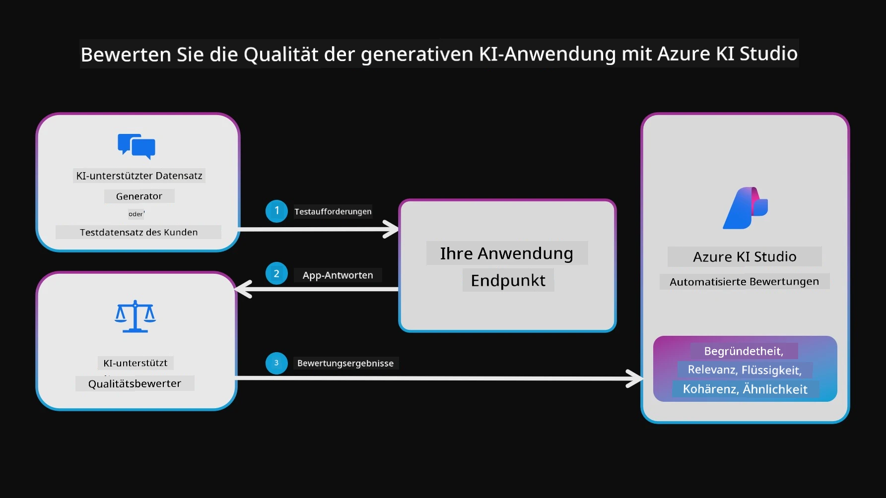

*Bildquelle: [Evaluation of generative AI applications](https://learn.microsoft.com/azure/ai-studio/concepts/evaluation-approach-gen-ai?wt.mc_id%3Dstudentamb_279723)*

#### Leistungsmetriken

In diesem Tutorial bewerten Sie die Leistung des feinabgestimmten Phi-3 / Phi-3.5 Modells anhand der Leistungsmetriken von Azure AI Foundry. Diese Metriken helfen Ihnen, die Effektivität des Modells bei der Erzeugung genauer, relevanter und kohärenter Antworten einzuschätzen. Die Leistungsmetriken umfassen:

- **Groundedness**: Bewertet, wie gut die generierten Antworten mit den Informationen aus der Eingabequelle übereinstimmen.
- **Relevanz**: Bewertet die Relevanz der generierten Antworten in Bezug auf die gestellten Fragen.
- **Kohärenz**: Bewertet, wie flüssig der generierte Text ist, ob er natürlich wirkt und menschenähnliche Sprache widerspiegelt.
- **Flüssigkeit**: Bewertet die sprachliche Qualität des generierten Textes.
- **GPT-Ähnlichkeit**: Vergleicht die generierte Antwort mit der Ground Truth hinsichtlich der Ähnlichkeit.
- **F1-Score**: Berechnet das Verhältnis der gemeinsamen Wörter zwischen der generierten Antwort und den Quelldaten.

Diese Metriken helfen Ihnen, die Effektivität des Modells bei der Erzeugung genauer, relevanter und kohärenter Antworten zu bewerten.

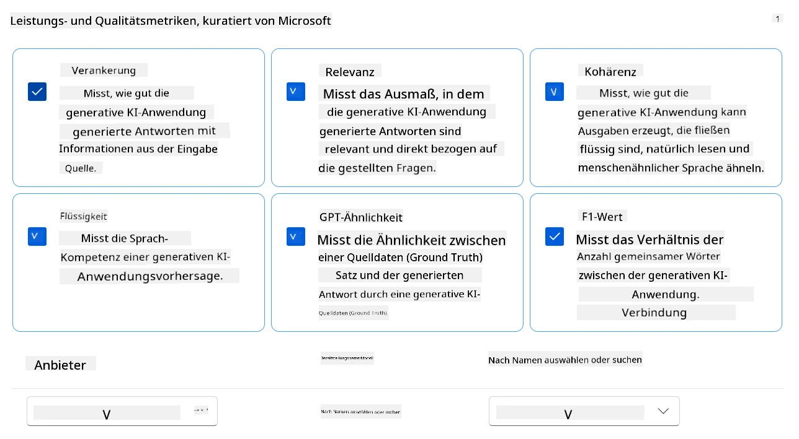

## **Szenario 2: Bewertung des Phi-3 / Phi-3.5 Modells in Azure AI Foundry**

### Bevor Sie beginnen

Dieses Tutorial baut auf den vorherigen Blogbeiträgen "[Fine-Tune and Integrate Custom Phi-3 Models with Prompt Flow: Step-by-Step Guide](https://techcommunity.microsoft.com/t5/educator-developer-blog/fine-tune-and-integrate-custom-phi-3-models-with-prompt-flow/ba-p/4178612?wt.mc_id=studentamb_279723)" und "[Fine-Tune and Integrate Custom Phi-3 Models with Prompt Flow in Azure AI Foundry](https://techcommunity.microsoft.com/t5/educator-developer-blog/fine-tune-and-integrate-custom-phi-3-models-with-prompt-flow-in/ba-p/4191726?wt.mc_id=studentamb_279723)" auf. In diesen Beiträgen haben wir den Prozess des Feinabstimmens eines Phi-3 / Phi-3.5 Modells in Azure AI Foundry und dessen Integration mit Prompt flow durchlaufen.

In diesem Tutorial werden Sie ein Azure OpenAI Modell als Evaluator in Azure AI Foundry bereitstellen und es verwenden, um Ihr feinabgestimmtes Phi-3 / Phi-3.5 Modell zu bewerten.

Bevor Sie mit diesem Tutorial beginnen, stellen Sie sicher, dass Sie die folgenden Voraussetzungen erfüllen, wie in den vorherigen Tutorials beschrieben:

1. Ein vorbereitetes Datenset zur Bewertung des feinabgestimmten Phi-3 / Phi-3.5 Modells.
1. Ein Phi-3 / Phi-3.5 Modell, das feinabgestimmt und in Azure Machine Learning bereitgestellt wurde.
1. Ein mit Ihrem feinabgestimmten Phi-3 / Phi-3.5 Modell in Azure AI Foundry integrierter Prompt flow.

> [!NOTE]
> Sie verwenden die Datei *test_data.jsonl*, die sich im Datenordner des **ULTRACHAT_200k** Datensatzes befindet, der in den vorherigen Blogbeiträgen heruntergeladen wurde, als Datensatz zur Bewertung des feinabgestimmten Phi-3 / Phi-3.5 Modells.

#### Integration des benutzerdefinierten Phi-3 / Phi-3.5 Modells mit Prompt flow in Azure AI Foundry (Code-first-Ansatz)
> [!NOTE]  
> Wenn Sie dem Low-Code-Ansatz gefolgt sind, der in "[Fine-Tune and Integrate Custom Phi-3 Models with Prompt Flow in Azure AI Foundry](https://techcommunity.microsoft.com/t5/educator-developer-blog/fine-tune-and-integrate-custom-phi-3-models-with-prompt-flow-in/ba-p/4191726?wt.mc_id=studentamb_279723)" beschrieben wird, können Sie diese Übung überspringen und mit der nächsten fortfahren.  
> Wenn Sie jedoch dem Code-First-Ansatz gefolgt sind, der in "[Fine-Tune and Integrate Custom Phi-3 Models with Prompt Flow: Step-by-Step Guide](https://techcommunity.microsoft.com/t5/educator-developer-blog/fine-tune-and-integrate-custom-phi-3-models-with-prompt-flow/ba-p/4178612?wt.mc_id=studentamb_279723)" beschrieben wird, um Ihr Phi-3 / Phi-3.5 Modell zu fine-tunen und bereitzustellen, ist der Prozess, Ihr Modell mit Prompt Flow zu verbinden, etwas anders. Diesen Prozess lernen Sie in dieser Übung kennen.
Um fortzufahren, müssen Sie Ihr feinabgestimmtes Phi-3 / Phi-3.5 Modell in Prompt flow in Azure AI Foundry integrieren.

#### Azure AI Foundry Hub erstellen

Sie müssen einen Hub erstellen, bevor Sie ein Projekt anlegen. Ein Hub fungiert wie eine Ressourcengruppe und ermöglicht es Ihnen, mehrere Projekte innerhalb von Azure AI Foundry zu organisieren und zu verwalten.

1. Melden Sie sich bei [Azure AI Foundry](https://ai.azure.com/?wt.mc_id=studentamb_279723) an.

1. Wählen Sie im linken Seitenmenü **All hubs** aus.

1. Wählen Sie im Navigationsmenü **+ New hub** aus.

    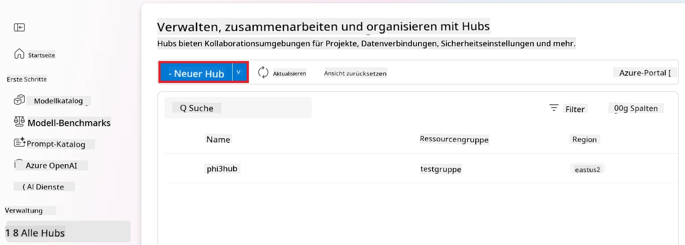

1. Führen Sie die folgenden Schritte aus:

    - Geben Sie einen **Hub name** ein. Dieser muss eindeutig sein.
    - Wählen Sie Ihr Azure **Subscription** aus.
    - Wählen Sie die **Resource group** aus, die Sie verwenden möchten (erstellen Sie bei Bedarf eine neue).
    - Wählen Sie den gewünschten **Location** aus.
    - Wählen Sie die **Connect Azure AI Services** aus, die Sie verwenden möchten (erstellen Sie bei Bedarf eine neue).
    - Wählen Sie bei **Connect Azure AI Search** die Option **Skip connecting**.

    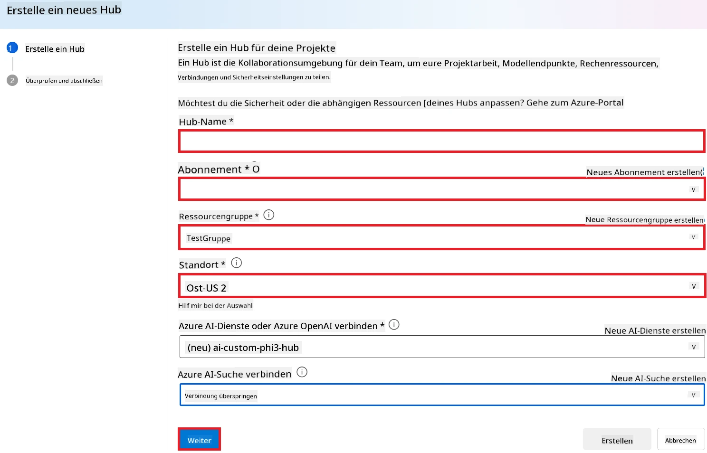

1. Wählen Sie **Next**.

#### Azure AI Foundry Projekt erstellen

1. Wählen Sie im erstellten Hub im linken Seitenmenü **All projects** aus.

1. Wählen Sie im Navigationsmenü **+ New project** aus.

    

1. Geben Sie einen **Project name** ein. Dieser muss eindeutig sein.

    

1. Wählen Sie **Create a project**.

#### Benutzerdefinierte Verbindung für das feinabgestimmte Phi-3 / Phi-3.5 Modell hinzufügen

Um Ihr benutzerdefiniertes Phi-3 / Phi-3.5 Modell mit Prompt flow zu integrieren, müssen Sie den Endpunkt und den Schlüssel des Modells in einer benutzerdefinierten Verbindung speichern. Diese Einrichtung stellt sicher, dass Sie in Prompt flow auf Ihr benutzerdefiniertes Phi-3 / Phi-3.5 Modell zugreifen können.

#### API-Schlüssel und Endpunkt-URI des feinabgestimmten Phi-3 / Phi-3.5 Modells festlegen

1. Besuchen Sie [Azure ML Studio](https://ml.azure.com/home?wt.mc_id=studentamb_279723).

1. Navigieren Sie zum Azure Machine Learning Workspace, den Sie erstellt haben.

1. Wählen Sie im linken Seitenmenü **Endpoints** aus.

    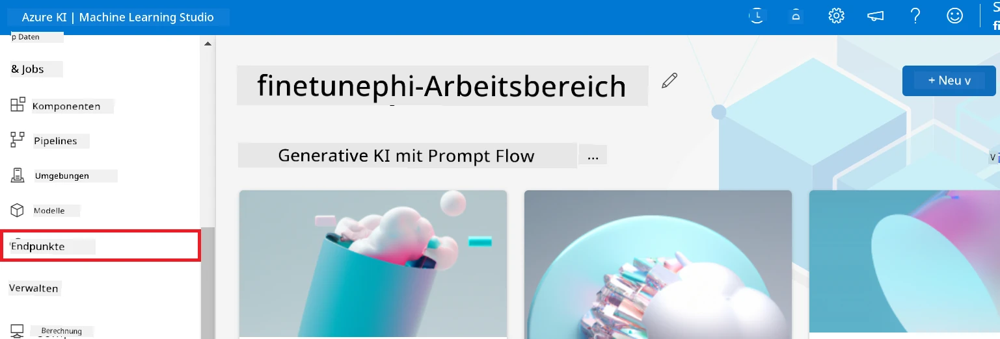

1. Wählen Sie den von Ihnen erstellten Endpunkt aus.

    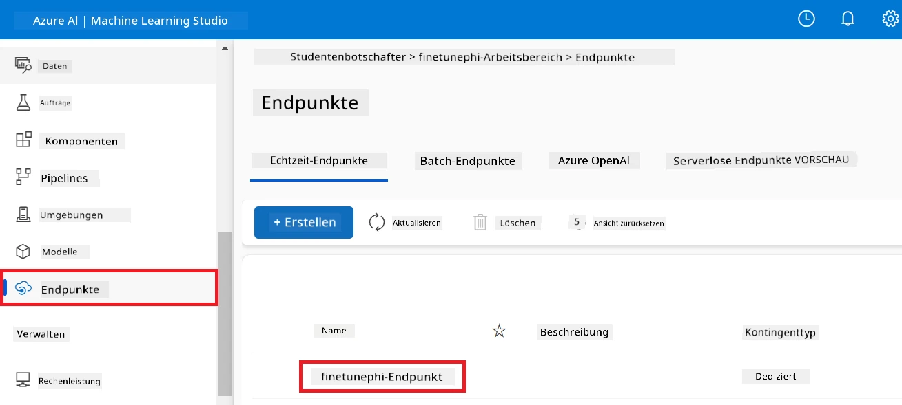

1. Wählen Sie im Navigationsmenü **Consume** aus.

1. Kopieren Sie Ihren **REST endpoint** und den **Primary key**.

    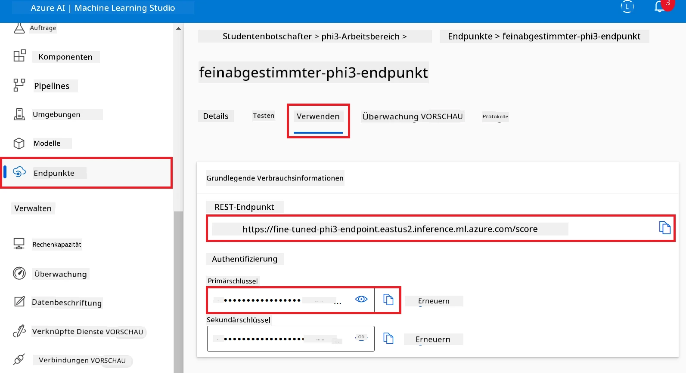

#### Benutzerdefinierte Verbindung hinzufügen

1. Besuchen Sie [Azure AI Foundry](https://ai.azure.com/?wt.mc_id=studentamb_279723).

1. Navigieren Sie zum Azure AI Foundry Projekt, das Sie erstellt haben.

1. Wählen Sie im Projekt im linken Seitenmenü **Settings** aus.

1. Wählen Sie **+ New connection**.

    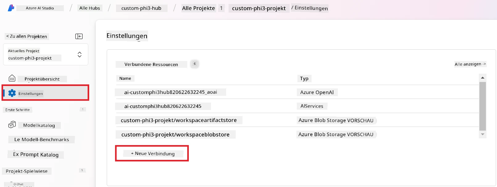

1. Wählen Sie im Navigationsmenü **Custom keys** aus.

    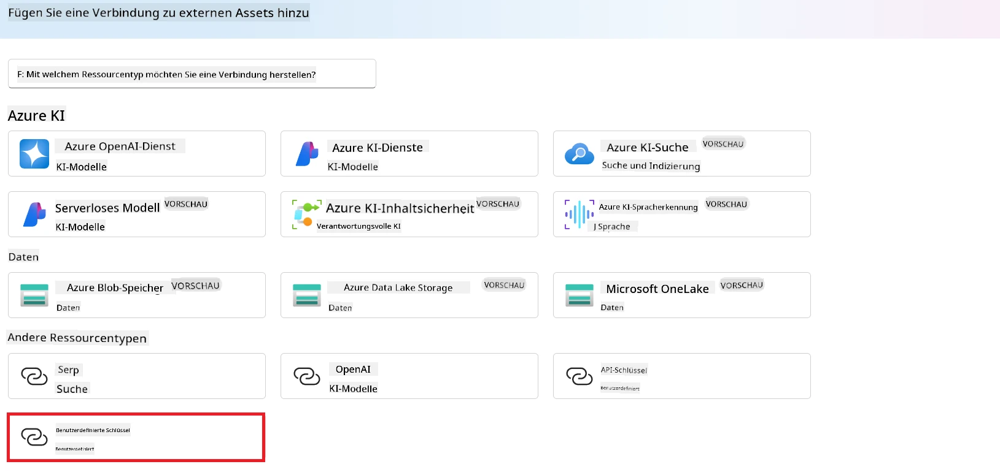

1. Führen Sie die folgenden Schritte aus:

    - Wählen Sie **+ Add key value pairs**.
    - Geben Sie als Schlüsselname **endpoint** ein und fügen Sie den kopierten Endpunkt aus Azure ML Studio in das Wertfeld ein.
    - Wählen Sie erneut **+ Add key value pairs**.
    - Geben Sie als Schlüsselname **key** ein und fügen Sie den kopierten Schlüssel aus Azure ML Studio in das Wertfeld ein.
    - Nach dem Hinzufügen der Schlüssel aktivieren Sie **is secret**, um zu verhindern, dass der Schlüssel offengelegt wird.

    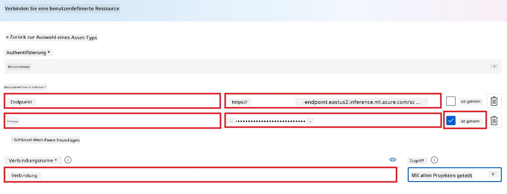

1. Wählen Sie **Add connection**.

#### Prompt flow erstellen

Sie haben eine benutzerdefinierte Verbindung in Azure AI Foundry hinzugefügt. Nun erstellen wir einen Prompt flow mit den folgenden Schritten. Anschließend verbinden Sie diesen Prompt flow mit der benutzerdefinierten Verbindung, um das feinabgestimmte Modell innerhalb des Prompt flows zu verwenden.

1. Navigieren Sie zum Azure AI Foundry Projekt, das Sie erstellt haben.

1. Wählen Sie im linken Seitenmenü **Prompt flow** aus.

1. Wählen Sie im Navigationsmenü **+ Create** aus.

    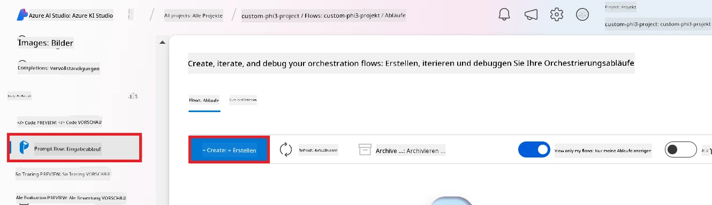

1. Wählen Sie im Navigationsmenü **Chat flow** aus.

    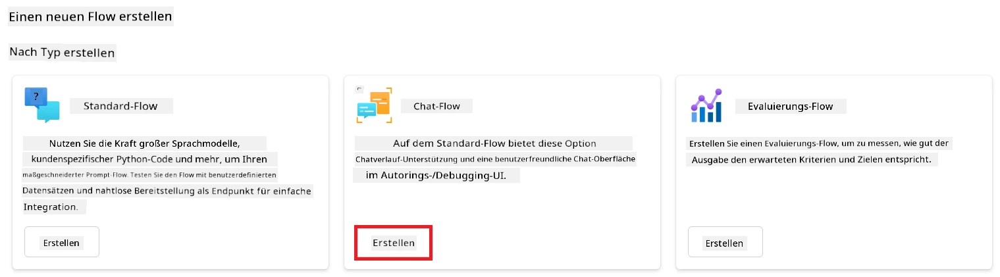

1. Geben Sie den **Folder name** ein, den Sie verwenden möchten.

    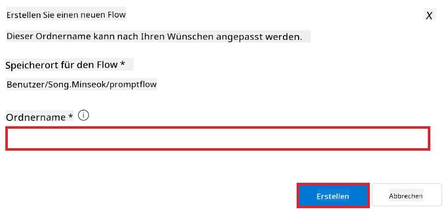

1. Wählen Sie **Create**.

#### Prompt flow einrichten, um mit Ihrem benutzerdefinierten Phi-3 / Phi-3.5 Modell zu chatten

Sie müssen das feinabgestimmte Phi-3 / Phi-3.5 Modell in einen Prompt flow integrieren. Der vorhandene Prompt flow ist jedoch nicht für diesen Zweck ausgelegt. Daher müssen Sie den Prompt flow neu gestalten, um die Integration des benutzerdefinierten Modells zu ermöglichen.

1. Führen Sie im Prompt flow die folgenden Schritte aus, um den bestehenden Flow neu aufzubauen:

    - Wählen Sie **Raw file mode**.
    - Löschen Sie den gesamten vorhandenen Code in der Datei *flow.dag.yml*.
    - Fügen Sie den folgenden Code in *flow.dag.yml* ein.

        ```yml
        inputs:
          input_data:
            type: string
            default: "Who founded Microsoft?"

        outputs:
          answer:
            type: string
            reference: ${integrate_with_promptflow.output}

        nodes:
        - name: integrate_with_promptflow
          type: python
          source:
            type: code
            path: integrate_with_promptflow.py
          inputs:
            input_data: ${inputs.input_data}
        ```

    - Wählen Sie **Save**.

    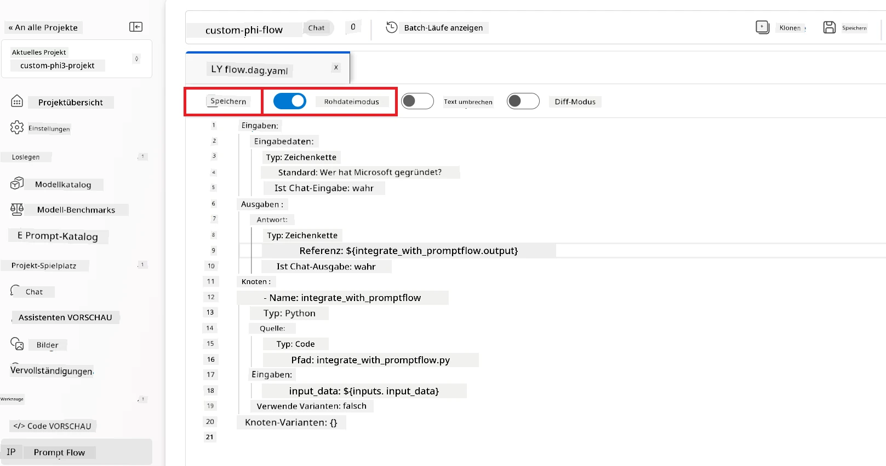

1. Fügen Sie den folgenden Code in *integrate_with_promptflow.py* ein, um das benutzerdefinierte Phi-3 / Phi-3.5 Modell im Prompt flow zu verwenden.

    ```python
    import logging
    import requests
    from promptflow import tool
    from promptflow.connections import CustomConnection

    # Logging setup
    logging.basicConfig(
        format="%(asctime)s - %(levelname)s - %(name)s - %(message)s",
        datefmt="%Y-%m-%d %H:%M:%S",
        level=logging.DEBUG
    )
    logger = logging.getLogger(__name__)

    def query_phi3_model(input_data: str, connection: CustomConnection) -> str:
        """
        Send a request to the Phi-3 / Phi-3.5 model endpoint with the given input data using Custom Connection.
        """

        # "connection" is the name of the Custom Connection, "endpoint", "key" are the keys in the Custom Connection
        endpoint_url = connection.endpoint
        api_key = connection.key

        headers = {
            "Content-Type": "application/json",
            "Authorization": f"Bearer {api_key}"
        }
    data = {
        "input_data": [input_data],
        "params": {
            "temperature": 0.7,
            "max_new_tokens": 128,
            "do_sample": True,
            "return_full_text": True
            }
        }
        try:
            response = requests.post(endpoint_url, json=data, headers=headers)
            response.raise_for_status()
            
            # Log the full JSON response
            logger.debug(f"Full JSON response: {response.json()}")

            result = response.json()["output"]
            logger.info("Successfully received response from Azure ML Endpoint.")
            return result
        except requests.exceptions.RequestException as e:
            logger.error(f"Error querying Azure ML Endpoint: {e}")
            raise

    @tool
    def my_python_tool(input_data: str, connection: CustomConnection) -> str:
        """
        Tool function to process input data and query the Phi-3 / Phi-3.5 model.
        """
        return query_phi3_model(input_data, connection)

    ```

    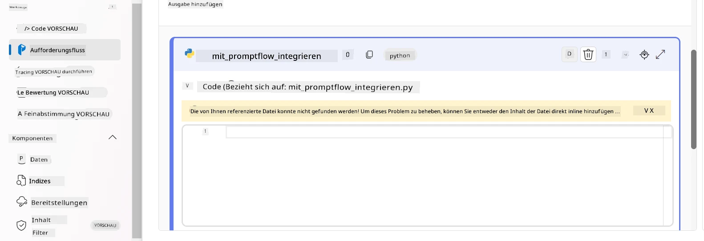

> [!NOTE]
> Für detailliertere Informationen zur Verwendung von Prompt flow in Azure AI Foundry können Sie [Prompt flow in Azure AI Foundry](https://learn.microsoft.com/azure/ai-studio/how-to/prompt-flow) konsultieren.

1. Wählen Sie **Chat input** und **Chat output** aus, um den Chat mit Ihrem Modell zu aktivieren.

    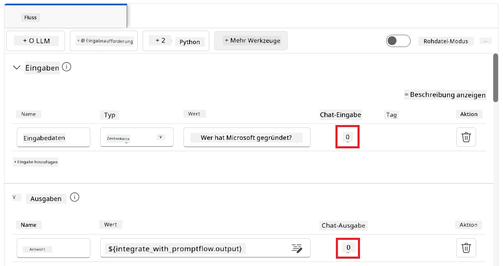

1. Nun sind Sie bereit, mit Ihrem benutzerdefinierten Phi-3 / Phi-3.5 Modell zu chatten. Im nächsten Übungsteil lernen Sie, wie Sie Prompt flow starten und es verwenden, um mit Ihrem feinabgestimmten Phi-3 / Phi-3.5 Modell zu kommunizieren.

> [!NOTE]
>
> Der neu aufgebaute Flow sollte wie im folgenden Bild aussehen:
>
> 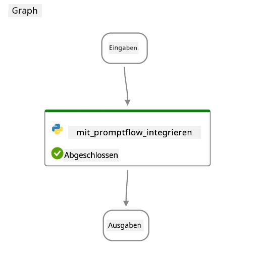
>

#### Prompt flow starten

1. Wählen Sie **Start compute sessions**, um Prompt flow zu starten.

    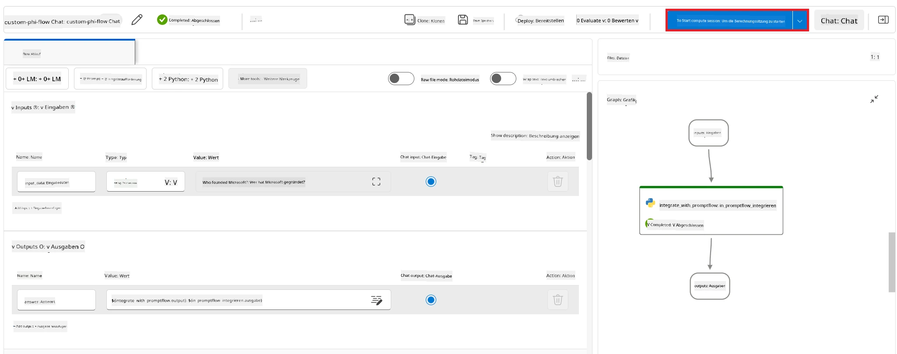

1. Wählen Sie **Validate and parse input**, um die Parameter zu aktualisieren.

    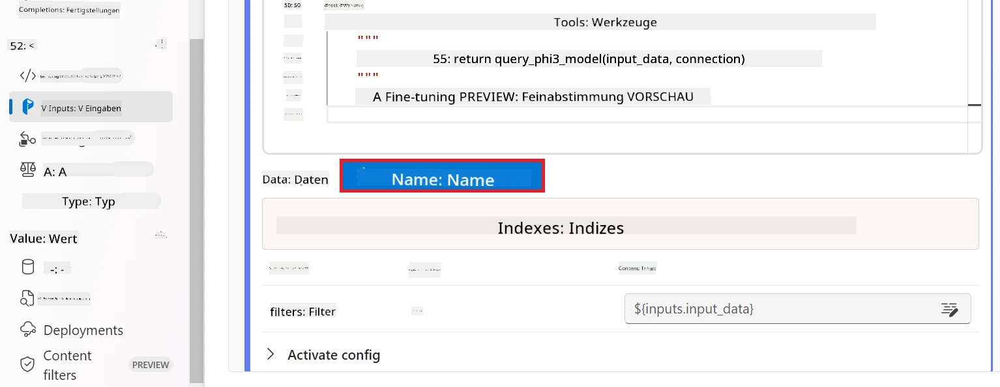

1. Wählen Sie den **Value** der **connection** aus, der Ihrer erstellten benutzerdefinierten Verbindung entspricht. Zum Beispiel *connection*.

    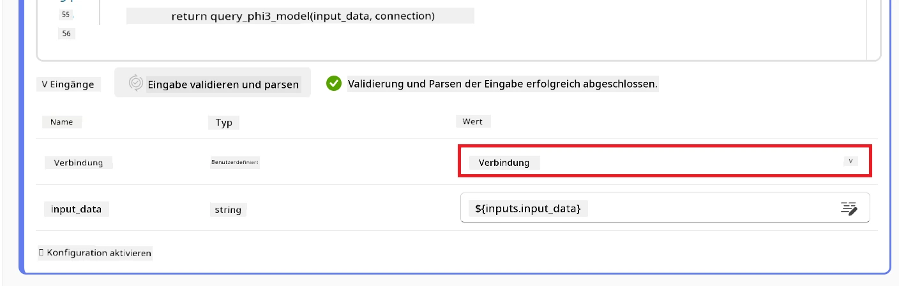

#### Chatten Sie mit Ihrem benutzerdefinierten Phi-3 / Phi-3.5 Modell

1. Wählen Sie **Chat**.

    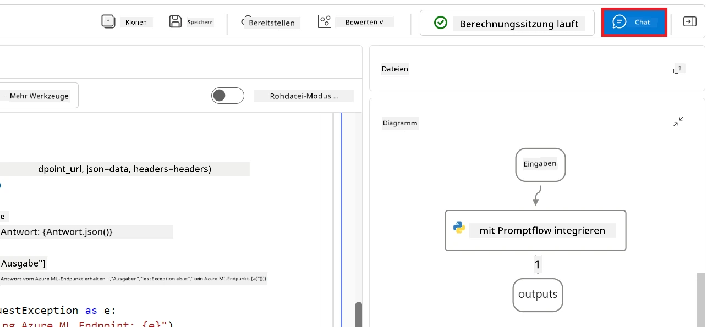

1. Hier ein Beispiel für die Ergebnisse: Jetzt können Sie mit Ihrem benutzerdefinierten Phi-3 / Phi-3.5 Modell chatten. Es wird empfohlen, Fragen basierend auf den Daten zu stellen, die für das Fine-Tuning verwendet wurden.

    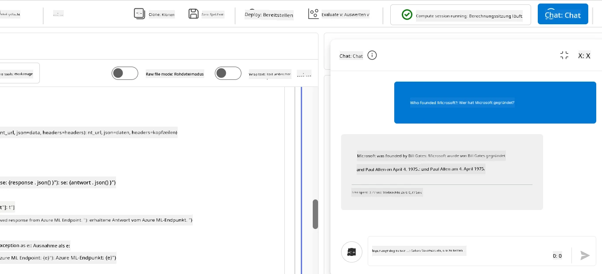

### Azure OpenAI bereitstellen, um das Phi-3 / Phi-3.5 Modell zu bewerten

Um das Phi-3 / Phi-3.5 Modell in Azure AI Foundry zu bewerten, müssen Sie ein Azure OpenAI Modell bereitstellen. Dieses Modell wird verwendet, um die Leistung des Phi-3 / Phi-3.5 Modells zu evaluieren.

#### Azure OpenAI bereitstellen

1. Melden Sie sich bei [Azure AI Foundry](https://ai.azure.com/?wt.mc_id=studentamb_279723) an.

1. Navigieren Sie zum Azure AI Foundry Projekt, das Sie erstellt haben.

    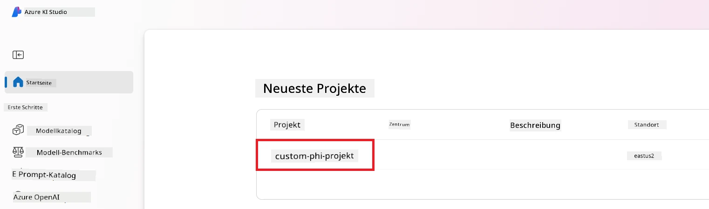

1. Wählen Sie im Projekt im linken Seitenmenü **Deployments** aus.

1. Wählen Sie im Navigationsmenü **+ Deploy model** aus.

1. Wählen Sie **Deploy base model**.

    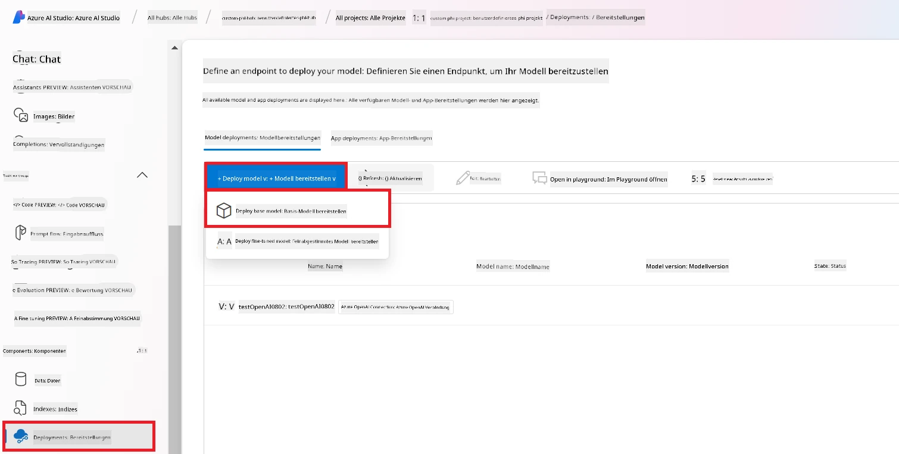

1. Wählen Sie das Azure OpenAI Modell aus, das Sie verwenden möchten. Zum Beispiel **gpt-4o**.

    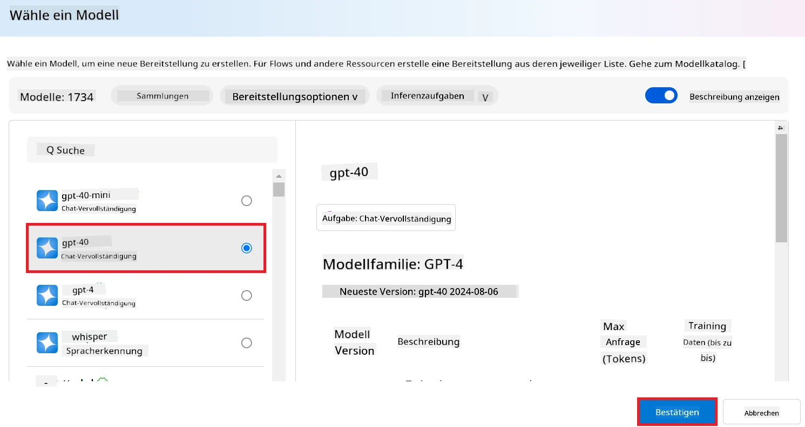

1. Wählen Sie **Confirm**.

### Das feinabgestimmte Phi-3 / Phi-3.5 Modell mit der Prompt flow Evaluation von Azure AI Foundry bewerten

### Neue Evaluation starten

1. Besuchen Sie [Azure AI Foundry](https://ai.azure.com/?wt.mc_id=studentamb_279723).

1. Navigieren Sie zum Azure AI Foundry Projekt, das Sie erstellt haben.

    

1. Wählen Sie im Projekt im linken Seitenmenü **Evaluation** aus.

1. Wählen Sie im Navigationsmenü **+ New evaluation** aus.

    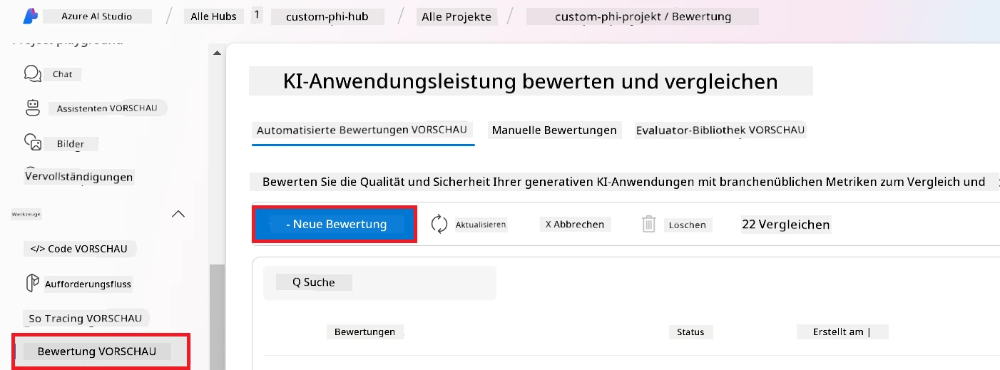

1. Wählen Sie die **Prompt flow** Evaluation aus.

    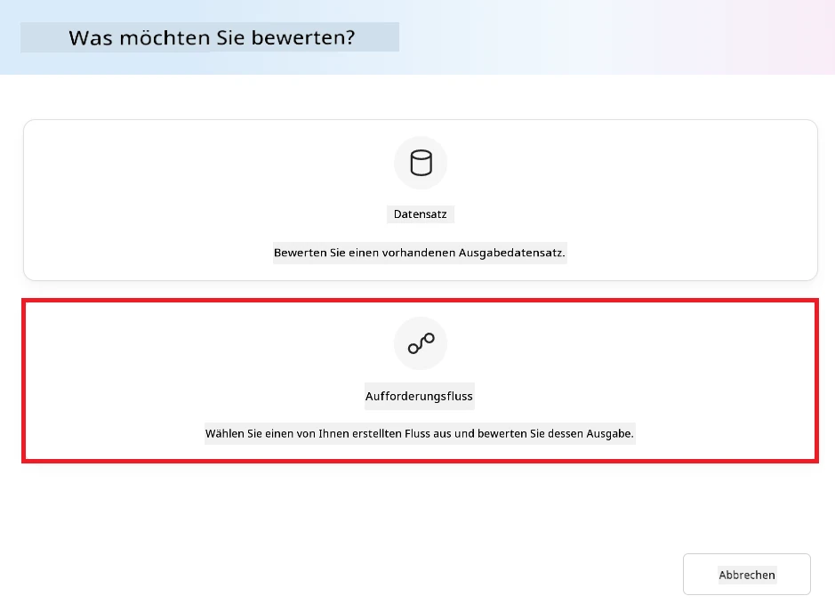

1. Führen Sie die folgenden Schritte aus:

    - Geben Sie einen Namen für die Evaluation ein. Dieser muss eindeutig sein.
    - Wählen Sie als Aufgabentyp **Question and answer without context** aus, da der im Tutorial verwendete Datensatz **ULTRACHAT_200k** keinen Kontext enthält.
    - Wählen Sie den Prompt flow aus, den Sie evaluieren möchten.

    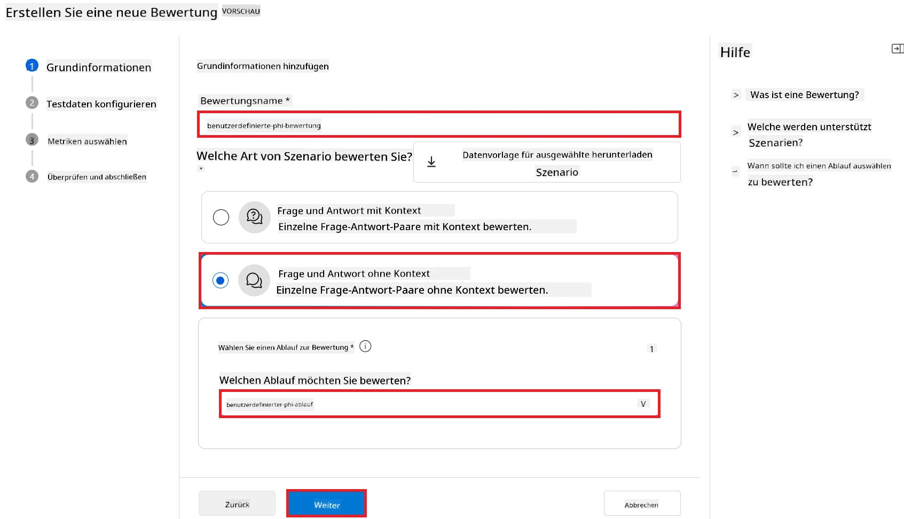

1. Wählen Sie **Next**.

1. Führen Sie die folgenden Schritte aus:

    - Wählen Sie **Add your dataset**, um den Datensatz hochzuladen. Zum Beispiel können Sie die Testdatendatei *test_data.json1* hochladen, die im **ULTRACHAT_200k** Datensatz enthalten ist.
    - Wählen Sie die passende **Dataset column** aus, die zu Ihrem Datensatz passt. Wenn Sie den **ULTRACHAT_200k** Datensatz verwenden, wählen Sie **${data.prompt}** als Dataset-Spalte.

    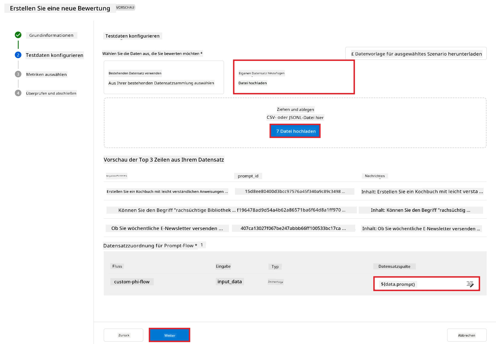

1. Wählen Sie **Next**.

1. Führen Sie die folgenden Schritte aus, um die Leistungs- und Qualitätsmetriken zu konfigurieren:

    - Wählen Sie die Leistungs- und Qualitätsmetriken aus, die Sie verwenden möchten.
    - Wählen Sie das Azure OpenAI Modell aus, das Sie für die Evaluation erstellt haben. Zum Beispiel **gpt-4o**.

    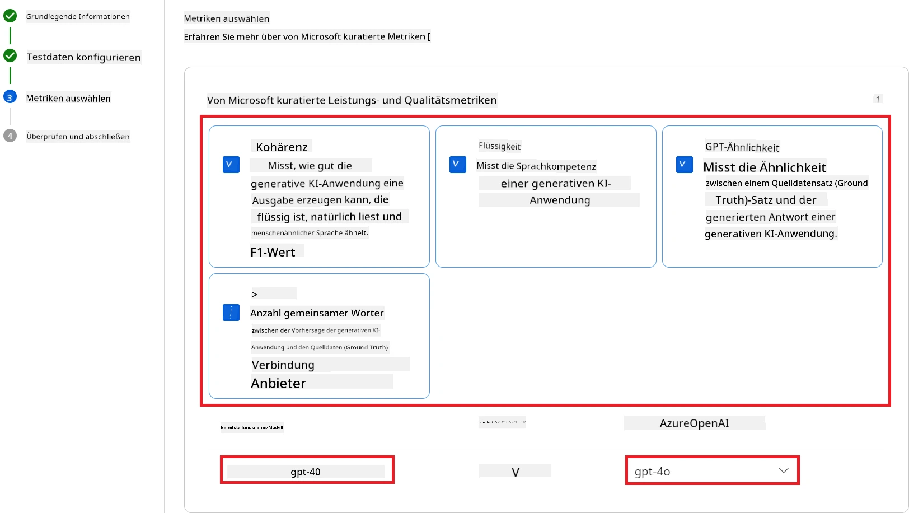

1. Führen Sie die folgenden Schritte aus, um die Risiko- und Sicherheitsmetriken zu konfigurieren:

    - Wählen Sie die Risiko- und Sicherheitsmetriken aus, die Sie verwenden möchten.
    - Wählen Sie den Schwellenwert aus, der zur Berechnung der Fehlerquote verwendet werden soll. Zum Beispiel **Medium**.
    - Für **question** wählen Sie als **Data source** **{$data.prompt}**.
    - Für **answer** wählen Sie als **Data source** **{$run.outputs.answer}**.
    - Für **ground_truth** wählen Sie als **Data source** **{$data.message}**.

    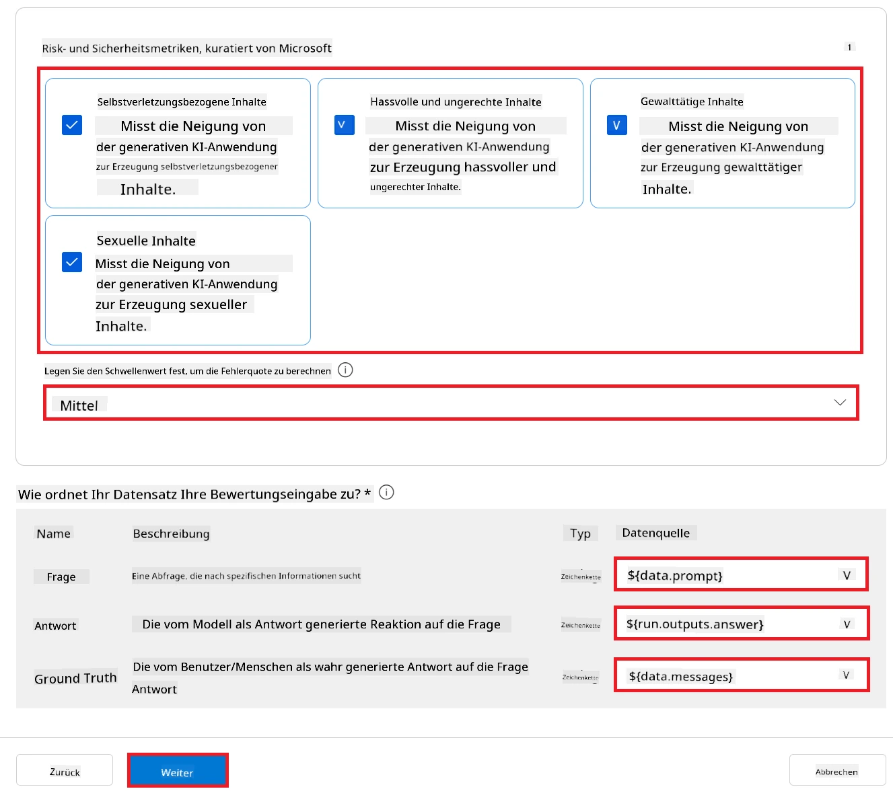

1. Wählen Sie **Next**.

1. Wählen Sie **Submit**, um die Evaluation zu starten.

1. Die Evaluation benötigt einige Zeit zur Durchführung. Sie können den Fortschritt im Tab **Evaluation** verfolgen.

### Evaluationsergebnisse überprüfen
> [!NOTE]
> Die unten dargestellten Ergebnisse sollen den Evaluierungsprozess veranschaulichen. In diesem Tutorial haben wir ein Modell verwendet, das auf einem relativ kleinen Datensatz feinabgestimmt wurde, was zu suboptimalen Ergebnissen führen kann. Die tatsächlichen Ergebnisse können je nach Größe, Qualität und Vielfalt des verwendeten Datensatzes sowie der spezifischen Konfiguration des Modells erheblich variieren.
Sobald die Bewertung abgeschlossen ist, können Sie die Ergebnisse sowohl für Leistungs- als auch Sicherheitsmetriken überprüfen.

1. Leistungs- und Qualitätsmetriken:

    - Bewerten Sie die Effektivität des Modells bei der Generierung kohärenter, flüssiger und relevanter Antworten.

    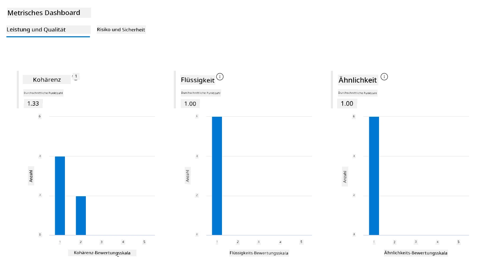

1. Risiko- und Sicherheitsmetriken:

    - Stellen Sie sicher, dass die Ausgaben des Modells sicher sind und den Responsible AI Principles entsprechen, indem schädliche oder anstößige Inhalte vermieden werden.

    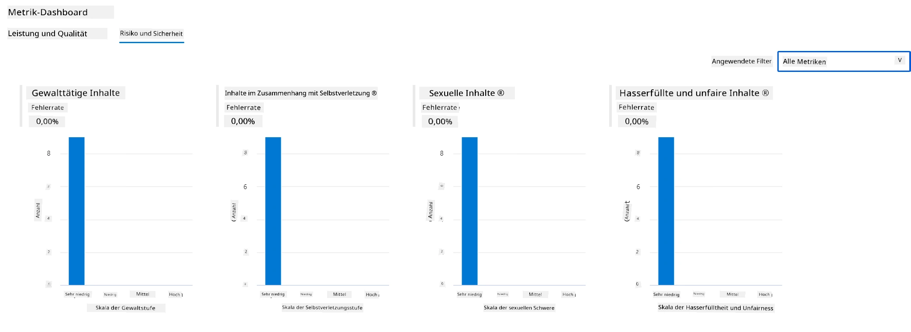

1. Sie können nach unten scrollen, um die **detaillierten Metrikergebnisse** anzusehen.

    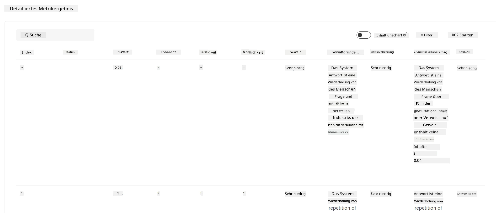

1. Durch die Bewertung Ihres benutzerdefinierten Phi-3 / Phi-3.5 Modells anhand von Leistungs- und Sicherheitsmetriken können Sie bestätigen, dass das Modell nicht nur effektiv ist, sondern auch verantwortungsbewusste KI-Praktiken einhält und somit für den Einsatz in der Praxis bereit ist.

## Herzlichen Glückwunsch!

### Sie haben dieses Tutorial abgeschlossen

Sie haben erfolgreich das feinabgestimmte Phi-3 Modell bewertet, das in Prompt flow in Azure AI Foundry integriert ist. Dies ist ein wichtiger Schritt, um sicherzustellen, dass Ihre KI-Modelle nicht nur gute Leistungen erbringen, sondern auch den Responsible AI-Prinzipien von Microsoft entsprechen, damit Sie vertrauenswürdige und zuverlässige KI-Anwendungen entwickeln können.


## Azure-Ressourcen bereinigen

Bereinigen Sie Ihre Azure-Ressourcen, um zusätzliche Kosten auf Ihrem Konto zu vermeiden. Gehen Sie zum Azure-Portal und löschen Sie die folgenden Ressourcen:

- Die Azure Machine Learning-Ressource.
- Den Azure Machine Learning Modell-Endpunkt.
- Die Azure AI Foundry Projekt-Ressource.
- Die Azure AI Foundry Prompt flow-Ressource.

### Nächste Schritte

#### Dokumentation

- [Assess AI systems by using the Responsible AI dashboard](https://learn.microsoft.com/azure/machine-learning/concept-responsible-ai-dashboard?view=azureml-api-2&source=recommendations?wt.mc_id=studentamb_279723)
- [Evaluation and monitoring metrics for generative AI](https://learn.microsoft.com/azure/ai-studio/concepts/evaluation-metrics-built-in?tabs=definition?wt.mc_id=studentamb_279723)
- [Azure AI Foundry documentation](https://learn.microsoft.com/azure/ai-studio/?wt.mc_id=studentamb_279723)
- [Prompt flow documentation](https://microsoft.github.io/promptflow/?wt.mc_id=studentamb_279723)

#### Schulungsinhalte

- [Introduction to Microsoft's Responsible AI Approach](https://learn.microsoft.com/training/modules/introduction-to-microsofts-responsible-ai-approach/?source=recommendations?wt.mc_id=studentamb_279723)
- [Introduction to Azure AI Foundry](https://learn.microsoft.com/training/modules/introduction-to-azure-ai-studio/?wt.mc_id=studentamb_279723)

### Referenz

- [What is Responsible AI?](https://learn.microsoft.com/azure/machine-learning/concept-responsible-ai?view=azureml-api-2?wt.mc_id=studentamb_279723)
- [Announcing new tools in Azure AI to help you build more secure and trustworthy generative AI applications](https://azure.microsoft.com/blog/announcing-new-tools-in-azure-ai-to-help-you-build-more-secure-and-trustworthy-generative-ai-applications/?wt.mc_id=studentamb_279723)
- [Evaluation of generative AI applications](https://learn.microsoft.com/azure/ai-studio/concepts/evaluation-approach-gen-ai?wt.mc_id%3Dstudentamb_279723)

**Haftungsausschluss**:  
Dieses Dokument wurde mit dem KI-Übersetzungsdienst [Co-op Translator](https://github.com/Azure/co-op-translator) übersetzt. Obwohl wir uns um Genauigkeit bemühen, beachten Sie bitte, dass automatisierte Übersetzungen Fehler oder Ungenauigkeiten enthalten können. Das Originaldokument in seiner Ursprungssprache ist als maßgebliche Quelle zu betrachten. Für wichtige Informationen wird eine professionelle menschliche Übersetzung empfohlen. Wir übernehmen keine Haftung für Missverständnisse oder Fehlinterpretationen, die aus der Nutzung dieser Übersetzung entstehen.