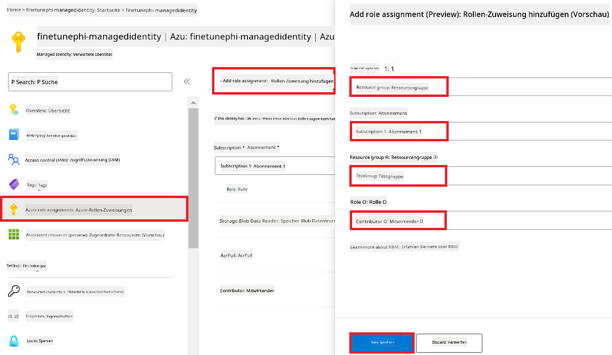
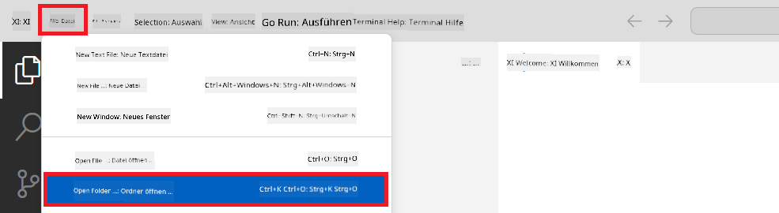
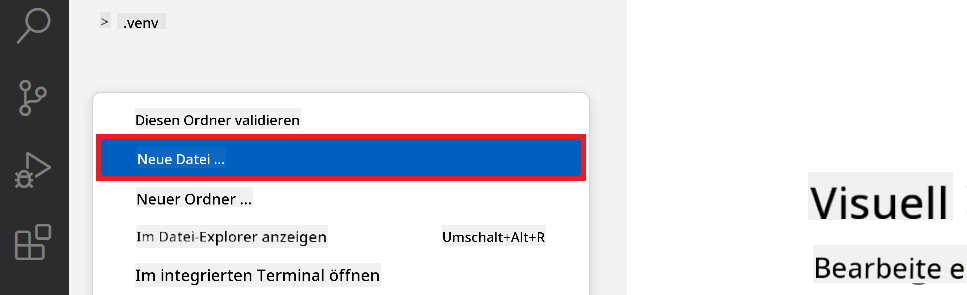
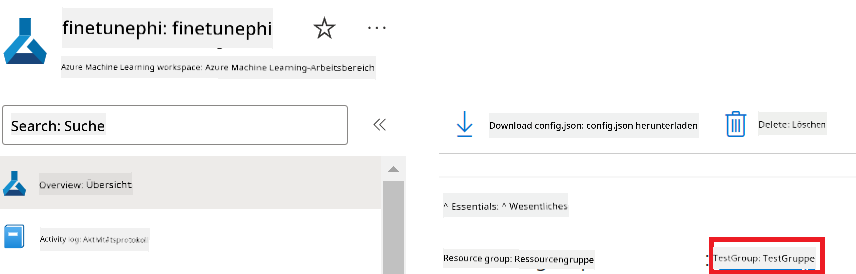

<!--
CO_OP_TRANSLATOR_METADATA:
{
  "original_hash": "7ca2c30fdb802664070e9cfbf92e24fe",
  "translation_date": "2026-01-04T06:49:26+00:00",
  "source_file": "md/02.Application/01.TextAndChat/Phi3/E2E_Phi-3-FineTuning_PromptFlow_Integration.md",
  "language_code": "de"
}
-->
# Feinabstimmung und Integration benutzerdefinierter Phi-3-Modelle mit Prompt Flow

Dieses End-to-End-(E2E)-Beispiel basiert auf dem Leitfaden "[Fine-Tune and Integrate Custom Phi-3 Models with Prompt Flow: Step-by-Step Guide](https://techcommunity.microsoft.com/t5/educator-developer-blog/fine-tune-and-integrate-custom-phi-3-models-with-prompt-flow/ba-p/4178612?WT.mc_id=aiml-137032-kinfeylo)" aus der Microsoft Tech Community. Es stellt die Prozesse des Feinabstimmens, Bereitstellens und Integrierens benutzerdefinierter Phi-3-Modelle mit Prompt Flow vor.

## Übersicht

In diesem E2E-Beispiel lernen Sie, wie Sie das Phi-3-Modell feinabstimmen und in Prompt Flow integrieren. Durch die Nutzung von Azure Machine Learning und Prompt Flow richten Sie einen Workflow zum Bereitstellen und Verwenden benutzerdefinierter KI-Modelle ein. Dieses E2E-Beispiel ist in drei Szenarien unterteilt:

**Szenario 1: Azure-Ressourcen einrichten und Vorbereitung für die Feinabstimmung**

**Szenario 2: Feinabstimmung des Phi-3-Modells und Bereitstellung in Azure Machine Learning Studio**

**Szenario 3: Integration mit Prompt Flow und Chatten mit Ihrem benutzerdefinierten Modell**

Hier ist eine Übersicht dieses E2E-Beispiels.


### Inhaltsverzeichnis

1. **[Szenario 1: Azure-Ressourcen einrichten und Vorbereitung für die Feinabstimmung](../../../../../../md/02.Application/01.TextAndChat/Phi3)**
    - [Erstellen eines Azure Machine Learning-Arbeitsbereichs](../../../../../../md/02.Application/01.TextAndChat/Phi3)
    - [GPU-Kontingente im Azure-Abonnement anfordern](../../../../../../md/02.Application/01.TextAndChat/Phi3)
    - [Rollen zuweisen](../../../../../../md/02.Application/01.TextAndChat/Phi3)
    - [Projekt einrichten](../../../../../../md/02.Application/01.TextAndChat/Phi3)
    - [Datensatz für die Feinabstimmung vorbereiten](../../../../../../md/02.Application/01.TextAndChat/Phi3)

1. **[Szenario 2: Feinabstimmung des Phi-3-Modells und Bereitstellung in Azure Machine Learning Studio](../../../../../../md/02.Application/01.TextAndChat/Phi3)**
    - [Azure CLI einrichten](../../../../../../md/02.Application/01.TextAndChat/Phi3)
    - [Das Phi-3-Modell feinabstimmen](../../../../../../md/02.Application/01.TextAndChat/Phi3)
    - [Das feinabgestimmte Modell bereitstellen](../../../../../../md/02.Application/01.TextAndChat/Phi3)

1. **[Szenario 3: Integration mit Prompt Flow und Chatten mit Ihrem benutzerdefinierten Modell](../../../../../../md/02.Application/01.TextAndChat/Phi3)**
    - [Das benutzerdefinierte Phi-3-Modell mit Prompt Flow integrieren](../../../../../../md/02.Application/01.TextAndChat/Phi3)
    - [Mit Ihrem benutzerdefinierten Modell chatten](../../../../../../md/02.Application/01.TextAndChat/Phi3)

## Szenario 1: Azure-Ressourcen einrichten und Vorbereitung für die Feinabstimmung

### Erstellen eines Azure Machine Learning-Arbeitsbereichs

1. Geben Sie *azure machine learning* in die **Suchleiste** oben auf der Portal-Seite ein und wählen Sie **Azure Machine Learning** aus den angezeigten Optionen aus.

    

1. Wählen Sie **+ Erstellen** aus dem Navigationsmenü.

1. Wählen Sie **Neuer Arbeitsbereich** aus dem Navigationsmenü.

    

1. Führen Sie die folgenden Aufgaben aus:

    - Wählen Sie Ihr Azure **Subscription**.
    - Wählen Sie die **Resource group** aus, die Sie verwenden möchten (erstellen Sie bei Bedarf eine neue).
    - Geben Sie den **Workspace Name** ein. Er muss ein eindeutiger Wert sein.
    - Wählen Sie die **Region** aus, die Sie verwenden möchten.
    - Wählen Sie das **Storage account** aus, das Sie verwenden möchten (erstellen Sie bei Bedarf ein neues).
    - Wählen Sie den **Key vault** aus, den Sie verwenden möchten (erstellen Sie bei Bedarf einen neuen).
    - Wählen Sie die **Application insights** aus, die Sie verwenden möchten (erstellen Sie bei Bedarf neue).
    - Wählen Sie das **Container registry** aus, das Sie verwenden möchten (erstellen Sie bei Bedarf ein neues).

    

1. Wählen Sie **Überprüfen + Erstellen**.

1. Wählen Sie **Erstellen**.

### GPU-Kontingente im Azure-Abonnement anfordern

In diesem E2E-Beispiel verwenden Sie die *Standard_NC24ads_A100_v4 GPU* für die Feinabstimmung, die eine Kontingentanfrage erfordert, und die *Standard_E4s_v3* CPU für die Bereitstellung, die keine Kontingentanfrage benötigt.

> [!NOTE]
>
> Nur Pay-As-You-Go-Abonnements (der Standard-Abonnementtyp) sind für GPU-Zuweisungen berechtigt; Benefit-Abonnements werden derzeit nicht unterstützt.
>
> Für diejenigen, die Benefit-Abonnements verwenden (z. B. Visual Studio Enterprise Subscription) oder die den Feinabstimmungs- und Bereitstellungsprozess schnell testen möchten, bietet dieses Tutorial auch Anleitungen zum Feinabstimmen mit einem minimalen Datensatz auf einer CPU. Es ist jedoch wichtig zu beachten, dass die Ergebnisse der Feinabstimmung deutlich besser sind, wenn eine GPU mit größeren Datensätzen verwendet wird.

1. Besuchen Sie [Azure ML Studio](https://ml.azure.com/home?wt.mc_id=studentamb_279723).

1. Führen Sie die folgenden Aufgaben aus, um das Kontingent für die *Standard NCADSA100v4 Family* anzufordern:

    - Wählen Sie **Quota** aus dem linken Bereich.
    - Wählen Sie die **Virtual machine family** aus, die Sie verwenden möchten. Beispielsweise wählen Sie **Standard NCADSA100v4 Family Cluster Dedicated vCPUs**, zu der die *Standard_NC24ads_A100_v4* GPU gehört.
    - Wählen Sie **Request quota** aus dem Navigationsmenü.

        

    - Geben Sie auf der Seite zum Anfordern des Kontingents das **New cores limit** ein, das Sie verwenden möchten. Zum Beispiel 24.
    - Wählen Sie auf der Seite zum Anfordern des Kontingents **Submit**, um das GPU-Kontingent anzufordern.

> [!NOTE]
> Sie können die geeignete GPU oder CPU für Ihre Anforderungen auswählen, indem Sie das Dokument [Sizes for Virtual Machines in Azure](https://learn.microsoft.com/azure/virtual-machines/sizes/overview?tabs=breakdownseries%2Cgeneralsizelist%2Ccomputesizelist%2Cmemorysizelist%2Cstoragesizelist%2Cgpusizelist%2Cfpgasizelist%2Chpcsizelist) zu Rate ziehen.

### Rollen zuweisen

Um Ihre Modelle feinabzustimmen und bereitzustellen, müssen Sie zunächst eine User Assigned Managed Identity (UAI) erstellen und ihr die entsprechenden Berechtigungen zuweisen. Diese UAI wird für die Authentifizierung während der Bereitstellung verwendet.

#### Benutzerzugewiesene Managed Identity (UAI) erstellen

1. Geben Sie *managed identities* in die **Suchleiste** oben auf der Portal-Seite ein und wählen Sie **Managed Identities** aus den angezeigten Optionen aus.

    

1. Wählen Sie **+ Erstellen**.

    

1. Führen Sie die folgenden Aufgaben aus:

    - Wählen Sie Ihr Azure **Subscription**.
    - Wählen Sie die **Resource group** aus, die Sie verwenden möchten (erstellen Sie bei Bedarf eine neue).
    - Wählen Sie die **Region** aus, die Sie verwenden möchten.
    - Geben Sie den **Name** ein. Er muss ein eindeutiger Wert sein.

1. Wählen Sie **Überprüfen + erstellen**.

1. Wählen Sie **+ Erstellen**.

#### Contributor-Rollenberechtigung zur Managed Identity hinzufügen

1. Navigieren Sie zu der Managed Identity-Ressource, die Sie erstellt haben.

1. Wählen Sie **Azure role assignments** aus dem linken Bereich.

1. Wählen Sie **+Add role assignment** aus dem Navigationsmenü.

1. Führen Sie auf der Seite "Add role assignment" die folgenden Aufgaben aus:
    - Wählen Sie den **Scope** auf **Resource group**.
    - Wählen Sie Ihr Azure **Subscription**.
    - Wählen Sie die **Resource group** aus, die Sie verwenden möchten.
    - Wählen Sie die **Role** auf **Contributor**.

    

1. Wählen Sie **Speichern**.

#### Storage Blob Data Reader-Rollenberechtigung zur Managed Identity hinzufügen

1. Geben Sie *storage accounts* in die **Suchleiste** oben auf der Portal-Seite ein und wählen Sie **Storage accounts** aus den angezeigten Optionen aus.

    

1. Wählen Sie das Storage-Konto aus, das mit dem von Ihnen erstellten Azure Machine Learning-Arbeitsbereich verknüpft ist. Zum Beispiel *finetunephistorage*.

1. Führen Sie die folgenden Aufgaben aus, um zur Seite "Add role assignment" zu navigieren:

    - Navigieren Sie zu dem Azure Storage-Konto, das Sie erstellt haben.
    - Wählen Sie **Access Control (IAM)** aus dem linken Bereich.
    - Wählen Sie **+ Add** aus dem Navigationsmenü.
    - Wählen Sie **Add role assignment** aus dem Navigationsmenü.

    

1. Führen Sie auf der Seite "Add role assignment" die folgenden Aufgaben aus:

    - Geben Sie auf der Seite "Role" *Storage Blob Data Reader* in die **Suchleiste** ein und wählen Sie **Storage Blob Data Reader** aus den angezeigten Optionen aus.
    - Wählen Sie auf der Seite "Role" **Weiter**.
    - Wählen Sie auf der Seite "Members" unter **Assign access to** **Managed identity** aus.
    - Wählen Sie auf der Seite "Members" **+ Select members** aus.
    - Wählen Sie auf der Seite "Select managed identities" Ihr Azure **Subscription** aus.
    - Wählen Sie auf der Seite "Select managed identities" die **Managed identity** unter **Manage Identity** aus.
    - Wählen Sie auf der Seite "Select managed identities" die Manage Identity aus, die Sie erstellt haben. Zum Beispiel *finetunephi-managedidentity*.
    - Wählen Sie auf der Seite "Select managed identities" **Select** aus.

    

1. Wählen Sie **Überprüfen + zuweisen**.

#### AcrPull-Rollenberechtigung zur Managed Identity hinzufügen

1. Geben Sie *container registries* in die **Suchleiste** oben auf der Portal-Seite ein und wählen Sie **Container registries** aus den angezeigten Optionen aus.

    

1. Wählen Sie das Container-Registry aus, das mit dem Azure Machine Learning-Arbeitsbereich verknüpft ist. Zum Beispiel *finetunephicontainerregistries*

1. Führen Sie die folgenden Aufgaben aus, um zur Seite "Add role assignment" zu navigieren:

    - Wählen Sie **Access Control (IAM)** aus dem linken Bereich.
    - Wählen Sie **+ Add** aus dem Navigationsmenü.
    - Wählen Sie **Add role assignment** aus dem Navigationsmenü.

1. Führen Sie auf der Seite "Add role assignment" die folgenden Aufgaben aus:

    - Geben Sie auf der Seite "Role" *AcrPull* in die **Suchleiste** ein und wählen Sie **AcrPull** aus den angezeigten Optionen aus.
    - Wählen Sie auf der Seite "Role" **Weiter**.
    - Wählen Sie auf der Seite "Members" unter **Assign access to** **Managed identity** aus.
    - Wählen Sie auf der Seite "Members" **+ Select members** aus.
    - Wählen Sie auf der Seite "Select managed identities" Ihr Azure **Subscription** aus.
    - Wählen Sie auf der Seite "Select managed identities" die **Managed identity** unter **Manage Identity** aus.
    - Wählen Sie auf der Seite "Select managed identities" die Manage Identity aus, die Sie erstellt haben. Zum Beispiel *finetunephi-managedidentity*.
    - Wählen Sie auf der Seite "Select managed identities" **Select** aus.
    - Wählen Sie **Überprüfen + zuweisen**.

### Projekt einrichten

Nun erstellen Sie einen Ordner, in dem Sie arbeiten, und richten eine virtuelle Umgebung ein, um ein Programm zu entwickeln, das mit Benutzern interagiert und gespeicherte Chatverläufe aus Azure Cosmos DB verwendet, um seine Antworten zu informieren.

#### Erstellen eines Arbeitsordners

1. Öffnen Sie ein Terminalfenster und geben Sie den folgenden Befehl ein, um einen Ordner mit dem Namen *finetune-phi* im Standardpfad zu erstellen.

    ```console
    mkdir finetune-phi
    ```

1. Geben Sie den folgenden Befehl in Ihrem Terminal ein, um in den Ordner *finetune-phi* zu wechseln, den Sie erstellt haben.

    ```console
    cd finetune-phi
    ```

#### Erstellen einer virtuellen Umgebung

1. Geben Sie den folgenden Befehl in Ihrem Terminal ein, um eine virtuelle Umgebung mit dem Namen *.venv* zu erstellen.

    ```console
    python -m venv .venv
    ```

1. Geben Sie den folgenden Befehl in Ihrem Terminal ein, um die virtuelle Umgebung zu aktivieren.

    ```console
    .venv\Scripts\activate.bat
    ```

> [!NOTE]
>
> Wenn es geklappt hat, sollten Sie *(.venv)* vor der Eingabeaufforderung sehen.

#### Installieren der erforderlichen Pakete

1. Geben Sie die folgenden Befehle in Ihrem Terminal ein, um die erforderlichen Pakete zu installieren.

    ```console
    pip install datasets==2.19.1
    pip install transformers==4.41.1
    pip install azure-ai-ml==1.16.0
    pip install torch==2.3.1
    pip install trl==0.9.4
    pip install promptflow==1.12.0
    ```

#### Projektdateien erstellen
In dieser Übung erstellen Sie die wesentlichen Dateien für unser Projekt. Diese Dateien umfassen Skripte zum Herunterladen des Datensatzes, zum Einrichten der Azure Machine Learning-Umgebung, zum Feinabstimmen (Fine-Tuning) des Phi-3-Modells und zum Bereitstellen des feinabgestimmten Modells. Sie erstellen außerdem eine *conda.yml*-Datei, um die Fine-Tuning-Umgebung einzurichten.

In dieser Übung werden Sie:

- Erstellen Sie eine Datei *download_dataset.py*, um den Datensatz herunterzuladen.
- Erstellen Sie eine Datei *setup_ml.py*, um die Azure Machine Learning-Umgebung einzurichten.
- Erstellen Sie eine Datei *fine_tune.py* im Ordner *finetuning_dir*, um das Phi-3-Modell mit dem Datensatz fein abzustimmen.
- Erstellen Sie eine Datei *conda.yml*, um die Fine-Tuning-Umgebung einzurichten.
- Erstellen Sie eine Datei *deploy_model.py*, um das feinabgestimmte Modell bereitzustellen.
- Erstellen Sie eine Datei *integrate_with_promptflow.py*, um das feinabgestimmte Modell zu integrieren und mit Prompt Flow auszuführen.
- Erstellen Sie eine Datei flow.dag.yml, um die Workflow-Struktur für Prompt Flow einzurichten.
- Erstellen Sie eine Datei *config.py*, um Azure-Informationen einzugeben.

> [!NOTE]
>
> Vollständige Ordnerstruktur:
>
> ```text
> └── YourUserName
> .    └── finetune-phi
> .        ├── finetuning_dir
> .        │      └── fine_tune.py
> .        ├── conda.yml
> .        ├── config.py
> .        ├── deploy_model.py
> .        ├── download_dataset.py
> .        ├── flow.dag.yml
> .        ├── integrate_with_promptflow.py
> .        └── setup_ml.py
> ```

1. Öffnen Sie **Visual Studio Code**.

1. Wählen Sie **File** in der Menüleiste.

1. Wählen Sie **Open Folder**.

1. Wählen Sie den von Ihnen erstellten Ordner *finetune-phi*, der sich unter *C:\Users\yourUserName\finetune-phi* befindet.

    

1. Klicken Sie im linken Bereich von Visual Studio Code mit der rechten Maustaste und wählen Sie **New File**, um eine neue Datei mit dem Namen *download_dataset.py* zu erstellen.

1. Klicken Sie im linken Bereich von Visual Studio Code mit der rechten Maustaste und wählen Sie **New File**, um eine neue Datei mit dem Namen *setup_ml.py* zu erstellen.

1. Klicken Sie im linken Bereich von Visual Studio Code mit der rechten Maustaste und wählen Sie **New File**, um eine neue Datei mit dem Namen *deploy_model.py* zu erstellen.

    

1. Klicken Sie im linken Bereich von Visual Studio Code mit der rechten Maustaste und wählen Sie **New Folder**, um einen neuen Ordner mit dem Namen *finetuning_dir* zu erstellen.

1. Erstellen Sie im Ordner *finetuning_dir* eine neue Datei mit dem Namen *fine_tune.py*.

#### Erstellen und Konfigurieren der Datei *conda.yml*

1. Klicken Sie im linken Bereich von Visual Studio Code mit der rechten Maustaste und wählen Sie **New File**, um eine neue Datei mit dem Namen *conda.yml* zu erstellen.

1. Fügen Sie den folgenden Code in die Datei *conda.yml* ein, um die Fine-Tuning-Umgebung für das Phi-3-Modell einzurichten.

    ```yml
    name: phi-3-training-env
    channels:
      - defaults
      - conda-forge
    dependencies:
      - python=3.10
      - pip
      - numpy<2.0
      - pip:
          - torch==2.4.0
          - torchvision==0.19.0
          - trl==0.8.6
          - transformers==4.41
          - datasets==2.21.0
          - azureml-core==1.57.0
          - azure-storage-blob==12.19.0
          - azure-ai-ml==1.16
          - azure-identity==1.17.1
          - accelerate==0.33.0
          - mlflow==2.15.1
          - azureml-mlflow==1.57.0
    ```

#### Erstellen und Konfigurieren der Datei *config.py*

1. Klicken Sie im linken Bereich von Visual Studio Code mit der rechten Maustaste und wählen Sie **New File**, um eine neue Datei mit dem Namen *config.py* zu erstellen.

1. Fügen Sie den folgenden Code in die Datei *config.py* ein, um Ihre Azure-Informationen aufzunehmen.

    ```python
    # Azure-Einstellungen
    AZURE_SUBSCRIPTION_ID = "your_subscription_id"
    AZURE_RESOURCE_GROUP_NAME = "your_resource_group_name" # "Testgruppe"

    # Azure Machine Learning-Einstellungen
    AZURE_ML_WORKSPACE_NAME = "your_workspace_name" # "finetunephi-arbeitsbereich"

    # Azure-Einstellungen für verwaltete Identität
    AZURE_MANAGED_IDENTITY_CLIENT_ID = "your_azure_managed_identity_client_id"
    AZURE_MANAGED_IDENTITY_NAME = "your_azure_managed_identity_name" # "finetunephi-verwaltete-identität"
    AZURE_MANAGED_IDENTITY_RESOURCE_ID = f"/subscriptions/{AZURE_SUBSCRIPTION_ID}/resourceGroups/{AZURE_RESOURCE_GROUP_NAME}/providers/Microsoft.ManagedIdentity/userAssignedIdentities/{AZURE_MANAGED_IDENTITY_NAME}"

    # Dateipfade des Datensatzes
    TRAIN_DATA_PATH = "data/train_data.jsonl"
    TEST_DATA_PATH = "data/test_data.jsonl"

    # Einstellungen für das feinabgestimmte Modell
    AZURE_MODEL_NAME = "your_fine_tuned_model_name" # "finetune-phi-modell"
    AZURE_ENDPOINT_NAME = "your_fine_tuned_model_endpoint_name" # "finetune-phi-endpunkt"
    AZURE_DEPLOYMENT_NAME = "your_fine_tuned_model_deployment_name" # "finetune-phi-bereitstellung"

    AZURE_ML_API_KEY = "your_fine_tuned_model_api_key"
    AZURE_ML_ENDPOINT = "your_fine_tuned_model_endpoint_uri" # "https://{ihr-endpunkt-name}.{ihre-region}.inference.ml.azure.com/score"
    ```

#### Azure-Umgebungsvariablen hinzufügen

1. Führen Sie die folgenden Schritte aus, um die Azure Subscription ID hinzuzufügen:

    - Geben Sie *subscriptions* in die **Suchleiste** oben auf der Portal-Seite ein und wählen Sie **Subscriptions** aus den angezeigten Optionen.
    - Wählen Sie die Azure-Subscription aus, die Sie derzeit verwenden.
    - Kopieren Sie Ihre Subscription ID und fügen Sie sie in die Datei *config.py* ein.

    

1. Führen Sie die folgenden Schritte aus, um den Namen des Azure-Workspaces hinzuzufügen:

    - Navigieren Sie zur Azure Machine Learning-Ressource, die Sie erstellt haben.
    - Kopieren Sie Ihren Kontonamen und fügen Sie ihn in die Datei *config.py* ein.

    

1. Führen Sie die folgenden Schritte aus, um den Namen der Azure-Ressourcengruppe hinzuzufügen:

    - Navigieren Sie zur Azure Machine Learning-Ressource, die Sie erstellt haben.
    - Kopieren Sie Ihren Azure-Ressourcengruppennamen und fügen Sie ihn in die Datei *config.py* ein.

    

2. Führen Sie die folgenden Schritte aus, um den Namen der verwalteten Azure-Identität hinzuzufügen

    - Navigieren Sie zur Managed Identities-Ressource, die Sie erstellt haben.
    - Kopieren Sie den Namen Ihrer Azure Managed Identity und fügen Sie ihn in die Datei *config.py* ein.

    

### Datensatz für das Fine-Tuning vorbereiten

In dieser Übung führen Sie die Datei *download_dataset.py* aus, um die Datensätze *ULTRACHAT_200k* in Ihre lokale Umgebung herunterzuladen. Anschließend verwenden Sie diese Datensätze, um das Phi-3-Modell in Azure Machine Learning fein abzustimmen.

#### Laden Sie Ihren Datensatz mit *download_dataset.py* herunter

1. Öffnen Sie die Datei *download_dataset.py* in Visual Studio Code.

1. Fügen Sie den folgenden Code in *download_dataset.py* ein.

    ```python
    import json
    import os
    from datasets import load_dataset
    from config import (
        TRAIN_DATA_PATH,
        TEST_DATA_PATH)

    def load_and_split_dataset(dataset_name, config_name, split_ratio):
        """
        Load and split a dataset.
        """
        # Lade den Datensatz mit dem angegebenen Namen, der Konfiguration und dem Aufteilungsverhältnis
        dataset = load_dataset(dataset_name, config_name, split=split_ratio)
        print(f"Original dataset size: {len(dataset)}")
        
        # Teile den Datensatz in Trainings- und Testmengen auf (80% Training, 20% Test)
        split_dataset = dataset.train_test_split(test_size=0.2)
        print(f"Train dataset size: {len(split_dataset['train'])}")
        print(f"Test dataset size: {len(split_dataset['test'])}")
        
        return split_dataset

    def save_dataset_to_jsonl(dataset, filepath):
        """
        Save a dataset to a JSONL file.
        """
        # Erstelle das Verzeichnis, falls es nicht existiert
        os.makedirs(os.path.dirname(filepath), exist_ok=True)
        
        # Öffne die Datei im Schreibmodus
        with open(filepath, 'w', encoding='utf-8') as f:
            # Iteriere über jeden Eintrag im Datensatz
            for record in dataset:
                # Schreibe den Eintrag als JSON-Objekt in die Datei
                json.dump(record, f)
                # Schreibe einen Zeilenumbruch, um Einträge zu trennen
                f.write('\n')
        
        print(f"Dataset saved to {filepath}")

    def main():
        """
        Main function to load, split, and save the dataset.
        """
        # Lade und teile den ULTRACHAT_200k-Datensatz mit einer bestimmten Konfiguration und einem bestimmten Aufteilungsverhältnis
        dataset = load_and_split_dataset("HuggingFaceH4/ultrachat_200k", 'default', 'train_sft[:1%]')
        
        # Extrahiere die Trainings- und Testdatensätze aus der Aufteilung
        train_dataset = dataset['train']
        test_dataset = dataset['test']

        # Speichere den Trainingsdatensatz in einer JSONL-Datei
        save_dataset_to_jsonl(train_dataset, TRAIN_DATA_PATH)
        
        # Speichere den Testdatensatz in einer separaten JSONL-Datei
        save_dataset_to_jsonl(test_dataset, TEST_DATA_PATH)

    if __name__ == "__main__":
        main()

    ```

> [!TIP]
>
> **Hinweise zum Fine-Tuning mit einem minimalen Datensatz auf einer CPU**
>
> Wenn Sie eine CPU für das Fine-Tuning verwenden möchten, ist dieses Vorgehen ideal für Personen mit Vorteil-Abonnements (wie z. B. Visual Studio Enterprise Subscription) oder um den Fine-Tuning- und Bereitstellungsprozess schnell zu testen.
>
> Ersetzen Sie `dataset = load_and_split_dataset("HuggingFaceH4/ultrachat_200k", 'default', 'train_sft[:1%]')` durch `dataset = load_and_split_dataset("HuggingFaceH4/ultrachat_200k", 'default', 'train_sft[:10]')`
>

1. Geben Sie den folgenden Befehl in Ihrem Terminal ein, um das Skript auszuführen und den Datensatz in Ihre lokale Umgebung herunterzuladen.

    ```console
    python download_data.py
    ```

1. Überprüfen Sie, ob die Datensätze erfolgreich in Ihrem lokalen Verzeichnis *finetune-phi/data* gespeichert wurden.

> [!NOTE]
>
> **Datensatzgröße und Fine-Tuning-Zeit**
>
> In diesem E2E-Beispiel verwenden Sie nur 1 % des Datensatzes (`train_sft[:1%]`). Dies reduziert die Datenmenge erheblich und beschleunigt sowohl den Upload- als auch den Fine-Tuning-Prozess. Sie können den Prozentsatz anpassen, um das richtige Gleichgewicht zwischen Trainingszeit und Modellleistung zu finden. Die Verwendung einer kleineren Teilmenge des Datensatzes verringert die für das Fine-Tuning benötigte Zeit und macht den Prozess für ein E2E-Beispiel überschaubarer.

## Szenario 2: Phi-3-Modell feinabstimmen und in Azure Machine Learning Studio bereitstellen

### Azure CLI einrichten

Sie müssen die Azure CLI einrichten, um Ihre Umgebung zu authentifizieren. Die Azure CLI ermöglicht die Verwaltung von Azure-Ressourcen direkt über die Befehlszeile und stellt die Anmeldeinformationen bereit, die Azure Machine Learning zum Zugriff auf diese Ressourcen benötigt. Um zu beginnen, installieren Sie die [Azure CLI](https://learn.microsoft.com/cli/azure/install-azure-cli)

1. Öffnen Sie ein Terminalfenster und geben Sie den folgenden Befehl ein, um sich bei Ihrem Azure-Konto anzumelden.

    ```console
    az login
    ```

1. Wählen Sie Ihr Azure-Konto aus, das Sie verwenden möchten.

1. Wählen Sie Ihre Azure-Subscription aus, die Sie verwenden möchten.

    

> [!TIP]
>
> Wenn Sie Probleme bei der Anmeldung bei Azure haben, versuchen Sie es mit einem Gerätecode. Öffnen Sie ein Terminalfenster und geben Sie den folgenden Befehl ein, um sich bei Ihrem Azure-Konto anzumelden:
>
> ```console
> az login --use-device-code
> ```
>

### Phi-3-Modell feinabstimmen

In dieser Übung stimmen Sie das Phi-3-Modell mit dem bereitgestellten Datensatz fein ab. Zuerst definieren Sie den Fine-Tuning-Prozess in der Datei *fine_tune.py*. Anschließend konfigurieren Sie die Azure Machine Learning-Umgebung und starten den Fine-Tuning-Prozess, indem Sie die Datei *setup_ml.py* ausführen. Dieses Skript stellt sicher, dass das Fine-Tuning in der Azure Machine Learning-Umgebung stattfindet.

Durch Ausführen von *setup_ml.py* starten Sie den Fine-Tuning-Prozess in der Azure Machine Learning-Umgebung.

#### Code zur Datei *fine_tune.py* hinzufügen

1. Navigieren Sie zum Ordner *finetuning_dir* und öffnen Sie die Datei *fine_tune.py* in Visual Studio Code.

1. Fügen Sie den folgenden Code in *fine_tune.py* ein.

    ```python
    import argparse
    import sys
    import logging
    import os
    from datasets import load_dataset
    import torch
    import mlflow
    from transformers import AutoModelForCausalLM, AutoTokenizer, TrainingArguments
    from trl import SFTTrainer

    # Um den INVALID_PARAMETER_VALUE-Fehler in MLflow zu vermeiden, deaktivieren Sie die MLflow-Integration
    os.environ["DISABLE_MLFLOW_INTEGRATION"] = "True"

    # Logging-Einrichtung
    logging.basicConfig(
        format="%(asctime)s - %(levelname)s - %(name)s - %(message)s",
        datefmt="%Y-%m-%d %H:%M:%S",
        handlers=[logging.StreamHandler(sys.stdout)],
        level=logging.WARNING
    )
    logger = logging.getLogger(__name__)

    def initialize_model_and_tokenizer(model_name, model_kwargs):
        """
        Initialize the model and tokenizer with the given pretrained model name and arguments.
        """
        model = AutoModelForCausalLM.from_pretrained(model_name, **model_kwargs)
        tokenizer = AutoTokenizer.from_pretrained(model_name)
        tokenizer.model_max_length = 2048
        tokenizer.pad_token = tokenizer.unk_token
        tokenizer.pad_token_id = tokenizer.convert_tokens_to_ids(tokenizer.pad_token)
        tokenizer.padding_side = 'right'
        return model, tokenizer

    def apply_chat_template(example, tokenizer):
        """
        Apply a chat template to tokenize messages in the example.
        """
        messages = example["messages"]
        if messages[0]["role"] != "system":
            messages.insert(0, {"role": "system", "content": ""})
        example["text"] = tokenizer.apply_chat_template(
            messages, tokenize=False, add_generation_prompt=False
        )
        return example

    def load_and_preprocess_data(train_filepath, test_filepath, tokenizer):
        """
        Load and preprocess the dataset.
        """
        train_dataset = load_dataset('json', data_files=train_filepath, split='train')
        test_dataset = load_dataset('json', data_files=test_filepath, split='train')
        column_names = list(train_dataset.features)

        train_dataset = train_dataset.map(
            apply_chat_template,
            fn_kwargs={"tokenizer": tokenizer},
            num_proc=10,
            remove_columns=column_names,
            desc="Applying chat template to train dataset",
        )

        test_dataset = test_dataset.map(
            apply_chat_template,
            fn_kwargs={"tokenizer": tokenizer},
            num_proc=10,
            remove_columns=column_names,
            desc="Applying chat template to test dataset",
        )

        return train_dataset, test_dataset

    def train_and_evaluate_model(train_dataset, test_dataset, model, tokenizer, output_dir):
        """
        Train and evaluate the model.
        """
        training_args = TrainingArguments(
            bf16=True,
            do_eval=True,
            output_dir=output_dir,
            eval_strategy="epoch",
            learning_rate=5.0e-06,
            logging_steps=20,
            lr_scheduler_type="cosine",
            num_train_epochs=3,
            overwrite_output_dir=True,
            per_device_eval_batch_size=4,
            per_device_train_batch_size=4,
            remove_unused_columns=True,
            save_steps=500,
            seed=0,
            gradient_checkpointing=True,
            gradient_accumulation_steps=1,
            warmup_ratio=0.2,
        )

        trainer = SFTTrainer(
            model=model,
            args=training_args,
            train_dataset=train_dataset,
            eval_dataset=test_dataset,
            max_seq_length=2048,
            dataset_text_field="text",
            tokenizer=tokenizer,
            packing=True
        )

        train_result = trainer.train()
        trainer.log_metrics("train", train_result.metrics)

        mlflow.transformers.log_model(
            transformers_model={"model": trainer.model, "tokenizer": tokenizer},
            artifact_path=output_dir,
        )

        tokenizer.padding_side = 'left'
        eval_metrics = trainer.evaluate()
        eval_metrics["eval_samples"] = len(test_dataset)
        trainer.log_metrics("eval", eval_metrics)

    def main(train_file, eval_file, model_output_dir):
        """
        Main function to fine-tune the model.
        """
        model_kwargs = {
            "use_cache": False,
            "trust_remote_code": True,
            "torch_dtype": torch.bfloat16,
            "device_map": None,
            "attn_implementation": "eager"
        }

        # pretrained_model_name = "microsoft/Phi-3-mini-4k-instruct"
        pretrained_model_name = "microsoft/Phi-3.5-mini-instruct"

        with mlflow.start_run():
            model, tokenizer = initialize_model_and_tokenizer(pretrained_model_name, model_kwargs)
            train_dataset, test_dataset = load_and_preprocess_data(train_file, eval_file, tokenizer)
            train_and_evaluate_model(train_dataset, test_dataset, model, tokenizer, model_output_dir)

    if __name__ == "__main__":
        parser = argparse.ArgumentParser()
        parser.add_argument("--train-file", type=str, required=True, help="Path to the training data")
        parser.add_argument("--eval-file", type=str, required=True, help="Path to the evaluation data")
        parser.add_argument("--model_output_dir", type=str, required=True, help="Directory to save the fine-tuned model")
        args = parser.parse_args()
        main(args.train_file, args.eval_file, args.model_output_dir)

    ```

1. Speichern Sie die Datei *fine_tune.py* und schließen Sie sie.

> [!TIP]
> **Sie können das Phi-3.5-Modell feinabstimmen**
>
> In der Datei *fine_tune.py* können Sie den Wert von `pretrained_model_name` von `"microsoft/Phi-3-mini-4k-instruct"` auf jedes Modell ändern, das Sie feinabstimmen möchten. Wenn Sie ihn beispielsweise in `"microsoft/Phi-3.5-mini-instruct"` ändern, verwenden Sie das Modell Phi-3.5-mini-instruct für das Fine-Tuning. Um den gewünschten Modellnamen zu finden und zu verwenden, besuchen Sie [Hugging Face](https://huggingface.co/), suchen Sie das gewünschte Modell und kopieren Sie dessen Namen in das Feld `pretrained_model_name` in Ihrem Skript.
>
> <image type="content" src="../../../../imgs/02/FineTuning-PromptFlow/finetunephi3.5.png" alt-text="Phi-3.5 feinabstimmen.">
>

#### Code zur Datei *setup_ml.py* hinzufügen

1. Öffnen Sie die Datei *setup_ml.py* in Visual Studio Code.

1. Fügen Sie den folgenden Code in *setup_ml.py* ein.

    ```python
    import logging
    from azure.ai.ml import MLClient, command, Input
    from azure.ai.ml.entities import Environment, AmlCompute
    from azure.identity import AzureCliCredential
    from config import (
        AZURE_SUBSCRIPTION_ID,
        AZURE_RESOURCE_GROUP_NAME,
        AZURE_ML_WORKSPACE_NAME,
        TRAIN_DATA_PATH,
        TEST_DATA_PATH
    )

    # Konstanten

    # Entkommentieren Sie die folgenden Zeilen, um eine CPU-Instanz für das Training zu verwenden
    # COMPUTE_INSTANCE_TYPE = "Standard_E16s_v3" # CPU
    # COMPUTE_NAME = "cpu-e16s-v3"
    # DOCKER_IMAGE_NAME = "mcr.microsoft.com/azureml/openmpi4.1.0-ubuntu20.04:latest"

    # Entkommentieren Sie die folgenden Zeilen, um eine GPU-Instanz für das Training zu verwenden
    COMPUTE_INSTANCE_TYPE = "Standard_NC24ads_A100_v4"
    COMPUTE_NAME = "gpu-nc24s-a100-v4"
    DOCKER_IMAGE_NAME = "mcr.microsoft.com/azureml/curated/acft-hf-nlp-gpu:59"

    CONDA_FILE = "conda.yml"
    LOCATION = "eastus2" # Ersetzen Sie dies durch den Standort Ihres Compute-Clusters
    FINETUNING_DIR = "./finetuning_dir" # Pfad zum Fine-Tuning-Skript
    TRAINING_ENV_NAME = "phi-3-training-environment" # Name der Trainingsumgebung
    MODEL_OUTPUT_DIR = "./model_output" # Pfad zum Modell-Ausgabeverzeichnis in Azure ML

    # Protokollierungseinrichtung zur Nachverfolgung des Prozesses
    logger = logging.getLogger(__name__)
    logging.basicConfig(
        format="%(asctime)s - %(levelname)s - %(name)s - %(message)s",
        datefmt="%Y-%m-%d %H:%M:%S",
        level=logging.WARNING
    )

    def get_ml_client():
        """
        Initialize the ML Client using Azure CLI credentials.
        """
        credential = AzureCliCredential()
        return MLClient(credential, AZURE_SUBSCRIPTION_ID, AZURE_RESOURCE_GROUP_NAME, AZURE_ML_WORKSPACE_NAME)

    def create_or_get_environment(ml_client):
        """
        Create or update the training environment in Azure ML.
        """
        env = Environment(
            image=DOCKER_IMAGE_NAME,  # Docker-Image für die Umgebung
            conda_file=CONDA_FILE,  # Conda-Umgebungsdatei
            name=TRAINING_ENV_NAME,  # Name der Umgebung
        )
        return ml_client.environments.create_or_update(env)

    def create_or_get_compute_cluster(ml_client, compute_name, COMPUTE_INSTANCE_TYPE, location):
        """
        Create or update the compute cluster in Azure ML.
        """
        try:
            compute_cluster = ml_client.compute.get(compute_name)
            logger.info(f"Compute cluster '{compute_name}' already exists. Reusing it for the current run.")
        except Exception:
            logger.info(f"Compute cluster '{compute_name}' does not exist. Creating a new one with size {COMPUTE_INSTANCE_TYPE}.")
            compute_cluster = AmlCompute(
                name=compute_name,
                size=COMPUTE_INSTANCE_TYPE,
                location=location,
                tier="Dedicated",  # Tier des Compute-Clusters
                min_instances=0,  # Minimale Anzahl von Instanzen
                max_instances=1  # Maximale Anzahl von Instanzen
            )
            ml_client.compute.begin_create_or_update(compute_cluster).wait()  # Warten Sie, bis der Cluster erstellt wurde
        return compute_cluster

    def create_fine_tuning_job(env, compute_name):
        """
        Set up the fine-tuning job in Azure ML.
        """
        return command(
            code=FINETUNING_DIR,  # Pfad zu fine_tune.py
            command=(
                "python fine_tune.py "
                "--train-file ${{inputs.train_file}} "
                "--eval-file ${{inputs.eval_file}} "
                "--model_output_dir ${{inputs.model_output}}"
            ),
            environment=env,  # Trainingsumgebung
            compute=compute_name,  # Zu verwendender Compute-Cluster
            inputs={
                "train_file": Input(type="uri_file", path=TRAIN_DATA_PATH),  # Pfad zur Trainingsdatendatei
                "eval_file": Input(type="uri_file", path=TEST_DATA_PATH),  # Pfad zur Evaluationsdatendatei
                "model_output": MODEL_OUTPUT_DIR
            }
        )

    def main():
        """
        Main function to set up and run the fine-tuning job in Azure ML.
        """
        # ML-Client initialisieren
        ml_client = get_ml_client()

        # Umgebung erstellen
        env = create_or_get_environment(ml_client)
        
        # Compute-Cluster erstellen oder vorhandenes abrufen
        create_or_get_compute_cluster(ml_client, COMPUTE_NAME, COMPUTE_INSTANCE_TYPE, LOCATION)

        # Fine-Tuning-Job erstellen und einreichen
        job = create_fine_tuning_job(env, COMPUTE_NAME)
        returned_job = ml_client.jobs.create_or_update(job)  # Job einreichen
        ml_client.jobs.stream(returned_job.name)  # Job-Protokolle streamen
        
        # Den Jobnamen erfassen
        job_name = returned_job.name
        print(f"Job name: {job_name}")

    if __name__ == "__main__":
        main()

    ```

1. Ersetzen Sie `COMPUTE_INSTANCE_TYPE`, `COMPUTE_NAME` und `LOCATION` durch Ihre spezifischen Angaben.

    ```python
   # Kommentieren Sie die folgenden Zeilen aus, um eine GPU-Instanz für das Training zu verwenden
    COMPUTE_INSTANCE_TYPE = "Standard_NC24ads_A100_v4"
    COMPUTE_NAME = "gpu-nc24s-a100-v4"
    ...
    LOCATION = "eastus2" # Ersetzen Sie durch den Standort Ihres Compute-Clusters
    ```

> [!TIP]
>
> **Hinweise zum Fine-Tuning mit einem minimalen Datensatz auf einer CPU**
>
> Wenn Sie eine CPU für das Fine-Tuning verwenden möchten, ist dieses Vorgehen ideal für Personen mit Vorteil-Abonnements (wie z. B. Visual Studio Enterprise Subscription) oder um den Fine-Tuning- und Bereitstellungsprozess schnell zu testen.
>
> 1. Öffnen Sie die Datei *setup_ml*.
> 1. Ersetzen Sie `COMPUTE_INSTANCE_TYPE`, `COMPUTE_NAME` und `DOCKER_IMAGE_NAME` wie folgt. Wenn Sie keinen Zugriff auf *Standard_E16s_v3* haben, können Sie eine gleichwertige CPU-Instanz verwenden oder eine neue Quote anfordern.
> 1. Ersetzen Sie `LOCATION` durch Ihre spezifischen Angaben.
>
>    ```python
>    # Uncomment the following lines to use a CPU instance for training
>    COMPUTE_INSTANCE_TYPE = "Standard_E16s_v3" # cpu
>    COMPUTE_NAME = "cpu-e16s-v3"
>    DOCKER_IMAGE_NAME = "mcr.microsoft.com/azureml/openmpi4.1.0-ubuntu20.04:latest"
>    LOCATION = "eastus2" # Replace with the location of your compute cluster
>    ```
>

1. Geben Sie den folgenden Befehl ein, um das Skript *setup_ml.py* auszuführen und den Fine-Tuning-Prozess in Azure Machine Learning zu starten.

    ```python
    python setup_ml.py
    ```

1. In dieser Übung haben Sie das Phi-3-Modell erfolgreich mit Azure Machine Learning feinabgestimmt. Durch das Ausführen des Skripts *setup_ml.py* haben Sie die Azure Machine Learning-Umgebung eingerichtet und den in der Datei *fine_tune.py* definierten Fine-Tuning-Prozess gestartet. Bitte beachten Sie, dass der Fine-Tuning-Prozess beträchtliche Zeit in Anspruch nehmen kann. Nachdem Sie den Befehl `python setup_ml.py` ausgeführt haben, müssen Sie warten, bis der Prozess abgeschlossen ist. Sie können den Status des Fine-Tuning-Jobs überwachen, indem Sie dem im Terminal angezeigten Link zum Azure Machine Learning-Portal folgen.

    

### Das feinabgestimmte Modell bereitstellen

Um das feinabgestimmte Phi-3-Modell mit Prompt Flow zu integrieren, müssen Sie das Modell bereitstellen, damit es für Echtzeit-Inferenz zugänglich ist. Dieser Prozess umfasst das Registrieren des Modells, das Erstellen eines Online-Endpunkts und die Bereitstellung des Modells.

#### Legen Sie für die Bereitstellung den Modellnamen, Endpunktnamen und Bereitstellungsnamen fest

1. Öffnen Sie die Datei *config.py*.

1. Ersetzen Sie `AZURE_MODEL_NAME = "your_fine_tuned_model_name"` durch den gewünschten Namen für Ihr Modell.

1. Ersetzen Sie `AZURE_ENDPOINT_NAME = "your_fine_tuned_model_endpoint_name"` durch den gewünschten Namen für Ihren Endpunkt.

1. Ersetzen Sie `AZURE_DEPLOYMENT_NAME = "your_fine_tuned_model_deployment_name"` durch den gewünschten Namen für Ihre Bereitstellung.

#### Code zur Datei *deploy_model.py* hinzufügen

Das Ausführen der Datei *deploy_model.py* automatisiert den gesamten Bereitstellungsprozess. Sie registriert das Modell, erstellt einen Endpunkt und führt die Bereitstellung basierend auf den in der Datei config.py angegebenen Einstellungen aus, zu denen Modellname, Endpunktname und Bereitstellungsname gehören.

1. Öffnen Sie die Datei *deploy_model.py* in Visual Studio Code.

1. Fügen Sie den folgenden Code in *deploy_model.py* ein.

    ```python
    import logging
    from azure.identity import AzureCliCredential
    from azure.ai.ml import MLClient
    from azure.ai.ml.entities import Model, ProbeSettings, ManagedOnlineEndpoint, ManagedOnlineDeployment, IdentityConfiguration, ManagedIdentityConfiguration, OnlineRequestSettings
    from azure.ai.ml.constants import AssetTypes

    # Konfigurationsimporte
    from config import (
        AZURE_SUBSCRIPTION_ID,
        AZURE_RESOURCE_GROUP_NAME,
        AZURE_ML_WORKSPACE_NAME,
        AZURE_MANAGED_IDENTITY_RESOURCE_ID,
        AZURE_MANAGED_IDENTITY_CLIENT_ID,
        AZURE_MODEL_NAME,
        AZURE_ENDPOINT_NAME,
        AZURE_DEPLOYMENT_NAME
    )

    # Konstanten
    JOB_NAME = "your-job-name"
    COMPUTE_INSTANCE_TYPE = "Standard_E4s_v3"

    deployment_env_vars = {
        "SUBSCRIPTION_ID": AZURE_SUBSCRIPTION_ID,
        "RESOURCE_GROUP_NAME": AZURE_RESOURCE_GROUP_NAME,
        "UAI_CLIENT_ID": AZURE_MANAGED_IDENTITY_CLIENT_ID,
    }

    # Protokollierungseinrichtung
    logging.basicConfig(
        format="%(asctime)s - %(levelname)s - %(name)s - %(message)s",
        datefmt="%Y-%m-%d %H:%M:%S",
        level=logging.DEBUG
    )
    logger = logging.getLogger(__name__)

    def get_ml_client():
        """Initialize and return the ML Client."""
        credential = AzureCliCredential()
        return MLClient(credential, AZURE_SUBSCRIPTION_ID, AZURE_RESOURCE_GROUP_NAME, AZURE_ML_WORKSPACE_NAME)

    def register_model(ml_client, model_name, job_name):
        """Register a new model."""
        model_path = f"azureml://jobs/{job_name}/outputs/artifacts/paths/model_output"
        logger.info(f"Registering model {model_name} from job {job_name} at path {model_path}.")
        run_model = Model(
            path=model_path,
            name=model_name,
            description="Model created from run.",
            type=AssetTypes.MLFLOW_MODEL,
        )
        model = ml_client.models.create_or_update(run_model)
        logger.info(f"Registered model ID: {model.id}")
        return model

    def delete_existing_endpoint(ml_client, endpoint_name):
        """Delete existing endpoint if it exists."""
        try:
            endpoint_result = ml_client.online_endpoints.get(name=endpoint_name)
            logger.info(f"Deleting existing endpoint {endpoint_name}.")
            ml_client.online_endpoints.begin_delete(name=endpoint_name).result()
            logger.info(f"Deleted existing endpoint {endpoint_name}.")
        except Exception as e:
            logger.info(f"No existing endpoint {endpoint_name} found to delete: {e}")

    def create_or_update_endpoint(ml_client, endpoint_name, description=""):
        """Create or update an endpoint."""
        delete_existing_endpoint(ml_client, endpoint_name)
        logger.info(f"Creating new endpoint {endpoint_name}.")
        endpoint = ManagedOnlineEndpoint(
            name=endpoint_name,
            description=description,
            identity=IdentityConfiguration(
                type="user_assigned",
                user_assigned_identities=[ManagedIdentityConfiguration(resource_id=AZURE_MANAGED_IDENTITY_RESOURCE_ID)]
            )
        )
        endpoint_result = ml_client.online_endpoints.begin_create_or_update(endpoint).result()
        logger.info(f"Created new endpoint {endpoint_name}.")
        return endpoint_result

    def create_or_update_deployment(ml_client, endpoint_name, deployment_name, model):
        """Create or update a deployment."""

        logger.info(f"Creating deployment {deployment_name} for endpoint {endpoint_name}.")
        deployment = ManagedOnlineDeployment(
            name=deployment_name,
            endpoint_name=endpoint_name,
            model=model.id,
            instance_type=COMPUTE_INSTANCE_TYPE,
            instance_count=1,
            environment_variables=deployment_env_vars,
            request_settings=OnlineRequestSettings(
                max_concurrent_requests_per_instance=3,
                request_timeout_ms=180000,
                max_queue_wait_ms=120000
            ),
            liveness_probe=ProbeSettings(
                failure_threshold=30,
                success_threshold=1,
                period=100,
                initial_delay=500,
            ),
            readiness_probe=ProbeSettings(
                failure_threshold=30,
                success_threshold=1,
                period=100,
                initial_delay=500,
            ),
        )
        deployment_result = ml_client.online_deployments.begin_create_or_update(deployment).result()
        logger.info(f"Created deployment {deployment.name} for endpoint {endpoint_name}.")
        return deployment_result

    def set_traffic_to_deployment(ml_client, endpoint_name, deployment_name):
        """Set traffic to the specified deployment."""
        try:
            # Hole die aktuellen Endpunktdetails
            endpoint = ml_client.online_endpoints.get(name=endpoint_name)
            
            # Protokolliere die aktuelle Verkehrsaufteilung zur Fehlerbehebung
            logger.info(f"Current traffic allocation: {endpoint.traffic}")
            
            # Setze die Verkehrsaufteilung für die Bereitstellung
            endpoint.traffic = {deployment_name: 100}
            
            # Aktualisiere den Endpunkt mit der neuen Verkehrsaufteilung
            endpoint_poller = ml_client.online_endpoints.begin_create_or_update(endpoint)
            updated_endpoint = endpoint_poller.result()
            
            # Protokolliere die aktualisierte Verkehrsaufteilung zur Fehlerbehebung
            logger.info(f"Updated traffic allocation: {updated_endpoint.traffic}")
            logger.info(f"Set traffic to deployment {deployment_name} at endpoint {endpoint_name}.")
            return updated_endpoint
        except Exception as e:
            # Protokolliere alle Fehler, die während des Vorgangs auftreten
            logger.error(f"Failed to set traffic to deployment: {e}")
            raise


    def main():
        ml_client = get_ml_client()

        registered_model = register_model(ml_client, AZURE_MODEL_NAME, JOB_NAME)
        logger.info(f"Registered model ID: {registered_model.id}")

        endpoint = create_or_update_endpoint(ml_client, AZURE_ENDPOINT_NAME, "Endpoint for finetuned Phi-3 model")
        logger.info(f"Endpoint {AZURE_ENDPOINT_NAME} is ready.")

        try:
            deployment = create_or_update_deployment(ml_client, AZURE_ENDPOINT_NAME, AZURE_DEPLOYMENT_NAME, registered_model)
            logger.info(f"Deployment {AZURE_DEPLOYMENT_NAME} is created for endpoint {AZURE_ENDPOINT_NAME}.")

            set_traffic_to_deployment(ml_client, AZURE_ENDPOINT_NAME, AZURE_DEPLOYMENT_NAME)
            logger.info(f"Traffic is set to deployment {AZURE_DEPLOYMENT_NAME} at endpoint {AZURE_ENDPOINT_NAME}.")
        except Exception as e:
            logger.error(f"Failed to create or update deployment: {e}")

    if __name__ == "__main__":
        main()

    ```

1. Führen Sie die folgenden Schritte aus, um den `JOB_NAME` zu erhalten:

    - Navigieren Sie zur Azure Machine Learning-Ressource, die Sie erstellt haben.
    - Wählen Sie **Studio web URL** aus, um den Azure Machine Learning-Arbeitsbereich zu öffnen.
    - Wählen Sie **Jobs** in der linken Seitenleiste aus.
    - Wählen Sie das Experiment für das Fine-Tuning aus. Zum Beispiel *finetunephi*.
    - Wählen Sie den von Ihnen erstellten Job aus.
    - Kopieren Sie den Namen Ihres Jobs und fügen Sie ihn in `JOB_NAME = "your-job-name"` in die Datei *deploy_model.py* ein.

1. Ersetzen Sie `COMPUTE_INSTANCE_TYPE` durch Ihre spezifischen Angaben.

1. Geben Sie den folgenden Befehl ein, um das Skript *deploy_model.py* auszuführen und den Bereitstellungsprozess in Azure Machine Learning zu starten.

    ```python
    python deploy_model.py
    ```

> [!WARNING]
> Um zusätzliche Kosten für Ihr Konto zu vermeiden, stellen Sie sicher, dass Sie den erstellten Endpunkt im Azure Machine Learning-Arbeitsbereich löschen.
>

#### Überprüfen des Bereitstellungsstatus im Azure Machine Learning-Arbeitsbereich

1. Besuchen Sie [Azure ML Studio](https://ml.azure.com/home?wt.mc_id=studentamb_279723).

1. Navigieren Sie zu dem Azure Machine Learning-Arbeitsbereich, den Sie erstellt haben.

1. Wählen Sie **Studio-Web-URL**, um den Azure Machine Learning-Arbeitsbereich zu öffnen.

1. Wählen Sie **Endpoints** im linken Bereich.

    

2. Wählen Sie den von Ihnen erstellten Endpunkt aus.

    

3. Auf dieser Seite können Sie die während des Bereitstellungsprozesses erstellten Endpunkte verwalten.

## Szenario 3: Integration mit Prompt flow und Chat mit Ihrem benutzerdefinierten Modell

### Integrieren Sie das benutzerdefinierte Phi-3-Modell in Prompt flow

Nachdem Sie Ihr feinabgestimmtes Modell erfolgreich bereitgestellt haben, können Sie es nun in Prompt flow integrieren, um Ihr Modell in Echtzeitanwendungen zu verwenden und eine Vielzahl interaktiver Aufgaben mit Ihrem benutzerdefinierten Phi-3-Modell zu ermöglichen.

#### API-Schlüssel und Endpunkt-URI des feinabgestimmten Phi-3-Modells festlegen

1. Navigieren Sie zu dem Azure Machine Learning-Arbeitsbereich, den Sie erstellt haben.
1. Wählen Sie **Endpoints** im linken Bereich.
1. Wählen Sie den von Ihnen erstellten Endpunkt aus.
1. Wählen Sie **Consume** im Navigationsmenü.
1. Kopieren Sie Ihren **REST-Endpunkt** in die Datei *config.py* und ersetzen Sie `AZURE_ML_ENDPOINT = "your_fine_tuned_model_endpoint_uri"` durch Ihren **REST-Endpunkt**.
1. Kopieren Sie Ihren **Primärschlüssel** in die Datei *config.py* und ersetzen Sie `AZURE_ML_API_KEY = "your_fine_tuned_model_api_key"` durch Ihren **Primärschlüssel**.

    

#### Fügen Sie Code zur Datei *flow.dag.yml* hinzu

1. Öffnen Sie die Datei *flow.dag.yml* in Visual Studio Code.

1. Fügen Sie den folgenden Code in *flow.dag.yml* ein.

    ```yml
    inputs:
      input_data:
        type: string
        default: "Who founded Microsoft?"

    outputs:
      answer:
        type: string
        reference: ${integrate_with_promptflow.output}

    nodes:
    - name: integrate_with_promptflow
      type: python
      source:
        type: code
        path: integrate_with_promptflow.py
      inputs:
        input_data: ${inputs.input_data}
    ```

#### Fügen Sie Code zur Datei *integrate_with_promptflow.py* hinzu

1. Öffnen Sie die Datei *integrate_with_promptflow.py* in Visual Studio Code.

1. Fügen Sie den folgenden Code in *integrate_with_promptflow.py* ein.

    ```python
    import logging
    import requests
    from promptflow.core import tool
    import asyncio
    import platform
    from config import (
        AZURE_ML_ENDPOINT,
        AZURE_ML_API_KEY
    )

    # Protokollierungskonfiguration
    logging.basicConfig(
        format="%(asctime)s - %(levelname)s - %(name)s - %(message)s",
        datefmt="%Y-%m-%d %H:%M:%S",
        level=logging.DEBUG
    )
    logger = logging.getLogger(__name__)

    def query_azml_endpoint(input_data: list, endpoint_url: str, api_key: str) -> str:
        """
        Send a request to the Azure ML endpoint with the given input data.
        """
        headers = {
            "Content-Type": "application/json",
            "Authorization": f"Bearer {api_key}"
        }
        data = {
            "input_data": [input_data],
            "params": {
                "temperature": 0.7,
                "max_new_tokens": 128,
                "do_sample": True,
                "return_full_text": True
            }
        }
        try:
            response = requests.post(endpoint_url, json=data, headers=headers)
            response.raise_for_status()
            result = response.json()[0]
            logger.info("Successfully received response from Azure ML Endpoint.")
            return result
        except requests.exceptions.RequestException as e:
            logger.error(f"Error querying Azure ML Endpoint: {e}")
            raise

    def setup_asyncio_policy():
        """
        Setup asyncio event loop policy for Windows.
        """
        if platform.system() == 'Windows':
            asyncio.set_event_loop_policy(asyncio.WindowsSelectorEventLoopPolicy())
            logger.info("Set Windows asyncio event loop policy.")

    @tool
    def my_python_tool(input_data: str) -> str:
        """
        Tool function to process input data and query the Azure ML endpoint.
        """
        setup_asyncio_policy()
        return query_azml_endpoint(input_data, AZURE_ML_ENDPOINT, AZURE_ML_API_KEY)

    ```

### Chatten Sie mit Ihrem benutzerdefinierten Modell

1. Geben Sie den folgenden Befehl ein, um das Skript *deploy_model.py* auszuführen und den Bereitstellungsprozess in Azure Machine Learning zu starten.

    ```python
    pf flow serve --source ./ --port 8080 --host localhost
    ```

1. Hier ein Beispiel für die Ergebnisse: Jetzt können Sie mit Ihrem benutzerdefinierten Phi-3-Modell chatten. Es wird empfohlen, Fragen auf Basis der für das Fine-Tuning verwendeten Daten zu stellen.

    

---

<!-- CO-OP TRANSLATOR DISCLAIMER START -->
Haftungsausschluss:
Dieses Dokument wurde mit dem KI-Übersetzungsdienst Co-op Translator (https://github.com/Azure/co-op-translator) übersetzt. Obwohl wir uns um Genauigkeit bemühen, beachten Sie bitte, dass automatisierte Übersetzungen Fehler oder Ungenauigkeiten enthalten können. Das Originaldokument in seiner Ausgangssprache ist als maßgebliche Quelle zu betrachten. Bei wichtigen Informationen wird eine professionelle menschliche Übersetzung empfohlen. Wir haften nicht für Missverständnisse oder Fehlinterpretationen, die aus der Verwendung dieser Übersetzung entstehen.
<!-- CO-OP TRANSLATOR DISCLAIMER END -->