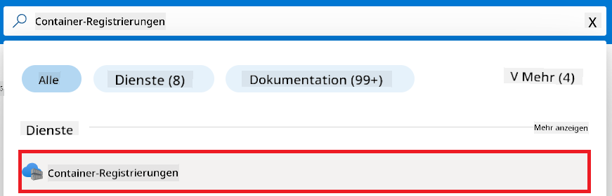
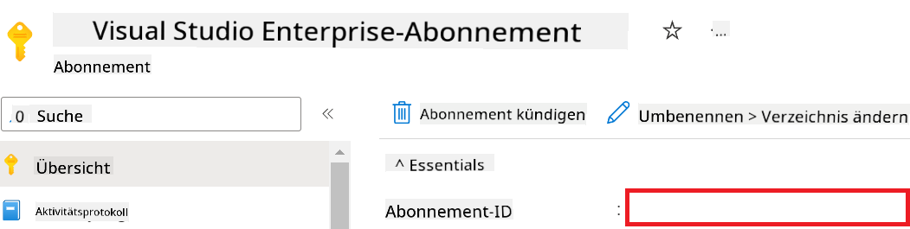
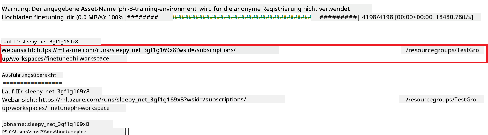
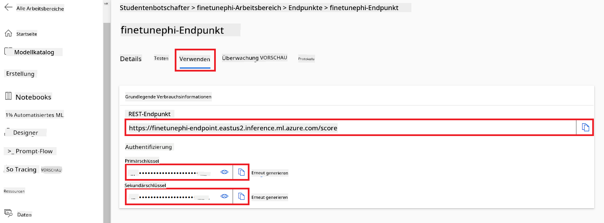
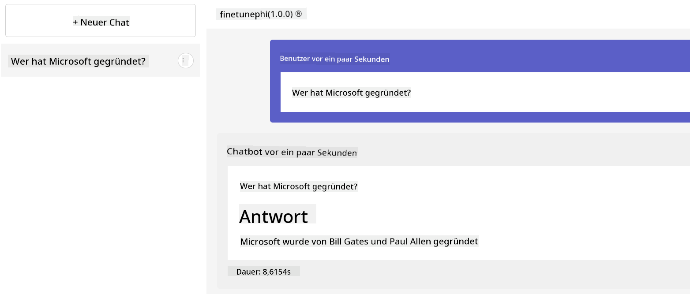

<!--
CO_OP_TRANSLATOR_METADATA:
{
  "original_hash": "455be2b7b9c3390d367d528f8fab2aa0",
  "translation_date": "2025-05-07T11:10:51+00:00",
  "source_file": "md/02.Application/01.TextAndChat/Phi3/E2E_Phi-3-FineTuning_PromptFlow_Integration.md",
  "language_code": "de"
}
-->
# Feinabstimmung und Integration benutzerdefinierter Phi-3-Modelle mit Prompt flow

Dieses End-to-End (E2E) Beispiel basiert auf der Anleitung "[Fine-Tune and Integrate Custom Phi-3 Models with Prompt Flow: Step-by-Step Guide](https://techcommunity.microsoft.com/t5/educator-developer-blog/fine-tune-and-integrate-custom-phi-3-models-with-prompt-flow/ba-p/4178612?WT.mc_id=aiml-137032-kinfeylo)" aus der Microsoft Tech Community. Es stellt die Prozesse der Feinabstimmung, Bereitstellung und Integration benutzerdefinierter Phi-3-Modelle mit Prompt flow vor.

## Übersicht

In diesem E2E-Beispiel lernen Sie, wie Sie das Phi-3-Modell feinabstimmen und mit Prompt flow integrieren. Durch die Nutzung von Azure Machine Learning und Prompt flow erstellen Sie einen Workflow zur Bereitstellung und Nutzung benutzerdefinierter KI-Modelle. Dieses E2E-Beispiel ist in drei Szenarien unterteilt:

**Szenario 1: Azure-Ressourcen einrichten und auf Feinabstimmung vorbereiten**

**Szenario 2: Phi-3-Modell feinabstimmen und in Azure Machine Learning Studio bereitstellen**

**Szenario 3: Integration mit Prompt flow und Chat mit Ihrem benutzerdefinierten Modell**

Hier eine Übersicht über dieses E2E-Beispiel.


### Inhaltsverzeichnis

1. **[Szenario 1: Azure-Ressourcen einrichten und auf Feinabstimmung vorbereiten](../../../../../../md/02.Application/01.TextAndChat/Phi3)**
    - [Erstellen eines Azure Machine Learning Workspace](../../../../../../md/02.Application/01.TextAndChat/Phi3)
    - [GPU-Kontingente in Azure Subscription anfragen](../../../../../../md/02.Application/01.TextAndChat/Phi3)
    - [Rollen-Zuweisung hinzufügen](../../../../../../md/02.Application/01.TextAndChat/Phi3)
    - [Projekt einrichten](../../../../../../md/02.Application/01.TextAndChat/Phi3)
    - [Datensatz für Feinabstimmung vorbereiten](../../../../../../md/02.Application/01.TextAndChat/Phi3)

1. **[Szenario 2: Phi-3-Modell feinabstimmen und in Azure Machine Learning Studio bereitstellen](../../../../../../md/02.Application/01.TextAndChat/Phi3)**
    - [Azure CLI einrichten](../../../../../../md/02.Application/01.TextAndChat/Phi3)
    - [Phi-3-Modell feinabstimmen](../../../../../../md/02.Application/01.TextAndChat/Phi3)
    - [Feinabgestimmtes Modell bereitstellen](../../../../../../md/02.Application/01.TextAndChat/Phi3)

1. **[Szenario 3: Integration mit Prompt flow und Chat mit Ihrem benutzerdefinierten Modell](../../../../../../md/02.Application/01.TextAndChat/Phi3)**
    - [Benutzerdefiniertes Phi-3-Modell mit Prompt flow integrieren](../../../../../../md/02.Application/01.TextAndChat/Phi3)
    - [Chat mit Ihrem benutzerdefinierten Modell](../../../../../../md/02.Application/01.TextAndChat/Phi3)

## Szenario 1: Azure-Ressourcen einrichten und auf Feinabstimmung vorbereiten

### Erstellen eines Azure Machine Learning Workspace

1. Geben Sie *azure machine learning* in die **Suchleiste** oben auf der Portal-Seite ein und wählen Sie **Azure Machine Learning** aus den angezeigten Optionen aus.

    

1. Wählen Sie **+ Erstellen** im Navigationsmenü.

1. Wählen Sie **Neuer Workspace** im Navigationsmenü.

    

1. Führen Sie folgende Schritte aus:

    - Wählen Sie Ihr Azure **Abonnement**.
    - Wählen Sie die zu verwendende **Ressourcengruppe** (bei Bedarf eine neue erstellen).
    - Geben Sie einen **Workspace-Namen** ein. Dieser muss einzigartig sein.
    - Wählen Sie die gewünschte **Region** aus.
    - Wählen Sie das zu verwendende **Storage-Konto** (bei Bedarf ein neues erstellen).
    - Wählen Sie den zu verwendenden **Key Vault** (bei Bedarf einen neuen erstellen).
    - Wählen Sie die zu verwendende **Application Insights**-Instanz (bei Bedarf eine neue erstellen).
    - Wählen Sie das zu verwendende **Container-Registry** (bei Bedarf eine neue erstellen).

    

1. Wählen Sie **Überprüfen + Erstellen**.

1. Wählen Sie **Erstellen**.

### GPU-Kontingente in Azure Subscription anfragen

In diesem E2E-Beispiel verwenden Sie die *Standard_NC24ads_A100_v4 GPU* für die Feinabstimmung, welche eine Kontingentanfrage erfordert, und die *Standard_E4s_v3* CPU für die Bereitstellung, welche keine Kontingentanfrage benötigt.

> [!NOTE]
>
> Nur Pay-As-You-Go-Abonnements (Standard-Abonnementtyp) sind für GPU-Zuweisungen berechtigt; Benefit-Abonnements werden derzeit nicht unterstützt.
>
> Für Nutzer von Benefit-Abonnements (wie Visual Studio Enterprise Subscription) oder für diejenigen, die den Feinabstimmungs- und Bereitstellungsprozess schnell testen möchten, bietet dieses Tutorial auch Anleitungen zur Feinabstimmung mit einem minimalen Datensatz auf einer CPU. Es ist jedoch wichtig zu beachten, dass die Feinabstimmungsergebnisse deutlich besser sind, wenn eine GPU mit größeren Datensätzen verwendet wird.

1. Besuchen Sie [Azure ML Studio](https://ml.azure.com/home?wt.mc_id=studentamb_279723).

1. Führen Sie folgende Schritte aus, um das Kontingent für *Standard NCADSA100v4 Family* anzufragen:

    - Wählen Sie **Kontingent** im linken Tab.
    - Wählen Sie die **Virtual Machine Family** aus, z. B. **Standard NCADSA100v4 Family Cluster Dedicated vCPUs**, die die *Standard_NC24ads_A100_v4* GPU beinhaltet.
    - Wählen Sie **Kontingent anfragen** im Navigationsmenü.

        

    - Geben Sie auf der Seite zur Kontingentanfrage die gewünschte **Neue Kernanzahl** ein, z. B. 24.
    - Wählen Sie **Absenden**, um die GPU-Kontingentanfrage zu stellen.

> [!NOTE]
> Sie können die passende GPU oder CPU für Ihre Anforderungen auswählen, indem Sie das Dokument [Größen für virtuelle Maschinen in Azure](https://learn.microsoft.com/azure/virtual-machines/sizes/overview?tabs=breakdownseries%2Cgeneralsizelist%2Ccomputesizelist%2Cmemorysizelist%2Cstoragesizelist%2Cgpusizelist%2Cfpgasizelist%2Chpcsizelist) zu Rate ziehen.

### Rollen-Zuweisung hinzufügen

Um Ihre Modelle feinabzustimmen und bereitzustellen, müssen Sie zuerst eine User Assigned Managed Identity (UAI) erstellen und ihr die passenden Berechtigungen zuweisen. Diese UAI wird für die Authentifizierung während der Bereitstellung verwendet.

#### User Assigned Managed Identity (UAI) erstellen

1. Geben Sie *managed identities* in die **Suchleiste** oben im Portal ein und wählen Sie **Managed Identities** aus den angezeigten Optionen.

    

1. Wählen Sie **+ Erstellen**.

    

1. Führen Sie folgende Schritte aus:

    - Wählen Sie Ihr Azure **Abonnement**.
    - Wählen Sie die zu verwendende **Ressourcengruppe** (bei Bedarf eine neue erstellen).
    - Wählen Sie die gewünschte **Region**.
    - Geben Sie einen **Namen** ein. Dieser muss einzigartig sein.

1. Wählen Sie **Überprüfen + erstellen**.

1. Wählen Sie **+ Erstellen**.

#### Contributor-Rollen-Zuweisung zur Managed Identity hinzufügen

1. Navigieren Sie zur erstellten Managed Identity-Ressource.

1. Wählen Sie **Azure-Rollen-Zuweisungen** im linken Tab.

1. Wählen Sie **+ Rollen-Zuweisung hinzufügen** im Navigationsmenü.

1. Führen Sie auf der Seite zur Rollen-Zuweisung folgende Schritte aus:
    - Wählen Sie den **Bereich** als **Ressourcengruppe**.
    - Wählen Sie Ihr Azure **Abonnement**.
    - Wählen Sie die **Ressourcengruppe** aus.
    - Wählen Sie die **Rolle** **Contributor**.

    

1. Wählen Sie **Speichern**.

#### Storage Blob Data Reader-Rollen-Zuweisung zur Managed Identity hinzufügen

1. Geben Sie *storage accounts* in die **Suchleiste** oben im Portal ein und wählen Sie **Storage accounts** aus den angezeigten Optionen.

    

1. Wählen Sie das Storage-Konto aus, das mit dem Azure Machine Learning Workspace verknüpft ist, z. B. *finetunephistorage*.

1. Führen Sie folgende Schritte aus, um zur Seite für Rollen-Zuweisungen zu gelangen:

    - Navigieren Sie zum Azure Storage-Konto.
    - Wählen Sie **Zugriffskontrolle (IAM)** im linken Tab.
    - Wählen Sie **+ Hinzufügen** im Navigationsmenü.
    - Wählen Sie **Rollen-Zuweisung hinzufügen** im Navigationsmenü.

    

1. Führen Sie auf der Seite Rollen-Zuweisung hinzufügen folgende Schritte aus:

    - Geben Sie im Rollensuchfeld *Storage Blob Data Reader* ein und wählen Sie **Storage Blob Data Reader** aus.
    - Wählen Sie **Weiter**.
    - Wählen Sie bei "Zugriff zuweisen an" **Managed Identity**.
    - Wählen Sie **+ Mitglieder auswählen**.
    - Wählen Sie Ihr Azure **Abonnement**.
    - Wählen Sie die **Managed Identity** aus.
    - Wählen Sie die zuvor erstellte Managed Identity aus, z. B. *finetunephi-managedidentity*.
    - Wählen Sie **Auswählen**.

    

1. Wählen Sie **Überprüfen + zuweisen**.

#### AcrPull-Rollen-Zuweisung zur Managed Identity hinzufügen

1. Geben Sie *container registries* in die **Suchleiste** oben im Portal ein und wählen Sie **Container registries** aus den angezeigten Optionen.

    

1. Wählen Sie das Container-Registry aus, das mit dem Azure Machine Learning Workspace verknüpft ist, z. B. *finetunephicontainerregistries*.

1. Führen Sie folgende Schritte aus, um zur Seite für Rollen-Zuweisungen zu gelangen:

    - Wählen Sie **Zugriffskontrolle (IAM)** im linken Tab.
    - Wählen Sie **+ Hinzufügen** im Navigationsmenü.
    - Wählen Sie **Rollen-Zuweisung hinzufügen** im Navigationsmenü.

1. Führen Sie auf der Seite Rollen-Zuweisung hinzufügen folgende Schritte aus:

    - Geben Sie im Rollensuchfeld *AcrPull* ein und wählen Sie **AcrPull** aus.
    - Wählen Sie **Weiter**.
    - Wählen Sie bei "Zugriff zuweisen an" **Managed Identity**.
    - Wählen Sie **+ Mitglieder auswählen**.
    - Wählen Sie Ihr Azure **Abonnement**.
    - Wählen Sie die **Managed Identity** aus.
    - Wählen Sie die zuvor erstellte Managed Identity aus, z. B. *finetunephi-managedidentity*.
    - Wählen Sie **Auswählen**.
    - Wählen Sie **Überprüfen + zuweisen**.

### Projekt einrichten

Nun erstellen Sie einen Ordner, in dem Sie arbeiten, und richten eine virtuelle Umgebung ein, um ein Programm zu entwickeln, das mit Nutzern interagiert und gespeicherte Chatverläufe aus Azure Cosmos DB nutzt, um seine Antworten zu verbessern.

#### Arbeitsordner erstellen

1. Öffnen Sie ein Terminalfenster und geben Sie folgenden Befehl ein, um einen Ordner namens *finetune-phi* im Standardpfad zu erstellen.

    ```console
    mkdir finetune-phi
    ```

1. Geben Sie im Terminal folgenden Befehl ein, um in den neu erstellten Ordner *finetune-phi* zu wechseln.

    ```console
    cd finetune-phi
    ```

#### Virtuelle Umgebung erstellen

1. Geben Sie im Terminal folgenden Befehl ein, um eine virtuelle Umgebung namens *.venv* zu erstellen.

    ```console
    python -m venv .venv
    ```

1. Aktivieren Sie die virtuelle Umgebung mit folgendem Befehl.

    ```console
    .venv\Scripts\activate.bat
    ```

> [!NOTE]
>
> Wenn es funktioniert hat, sehen Sie *(.venv)* vor der Eingabeaufforderung.

#### Erforderliche Pakete installieren

1. Geben Sie im Terminal folgende Befehle ein, um die benötigten Pakete zu installieren.

    ```console
    pip install datasets==2.19.1
    pip install transformers==4.41.1
    pip install azure-ai-ml==1.16.0
    pip install torch==2.3.1
    pip install trl==0.9.4
    pip install promptflow==1.12.0
    ```

#### Projektdateien erstellen

In dieser Übung erstellen Sie die wichtigen Dateien für unser Projekt. Diese enthalten Skripte zum Herunterladen des Datensatzes, zur Einrichtung der Azure Machine Learning Umgebung, zur Feinabstimmung des Phi-3-Modells und zur Bereitstellung des feinabgestimmten Modells. Außerdem erstellen Sie eine *conda.yml*-Datei zur Einrichtung der Feinabstimmungsumgebung.

Folgende Dateien erstellen Sie:

- Eine *download_dataset.py* Datei zum Herunterladen des Datensatzes.
- Eine *setup_ml.py* Datei zur Einrichtung der Azure Machine Learning Umgebung.
- Eine *fine_tune.py* Datei im Ordner *finetuning_dir* zur Feinabstimmung des Phi-3-Modells mit dem Datensatz.
- Eine *conda.yml* Datei zur Einrichtung der Feinabstimmungsumgebung.
- Eine *deploy_model.py* Datei zur Bereitstellung des feinabgestimmten Modells.
- Eine *integrate_with_promptflow.py* Datei zur Integration des feinabgestimmten Modells und Ausführung über Prompt flow.
- Eine *flow.dag.yml* Datei zur Strukturierung des Workflows für Prompt flow.
- Eine *config.py* Datei zur Eingabe der Azure-Informationen.

> [!NOTE]
>
> Vollständige Ordnerstruktur:
>
> ```text
> └── YourUserName
> .    └── finetune-phi
> .        ├── finetuning_dir
> .        │      └── fine_tune.py
> .        ├── conda.yml
> .        ├── config.py
> .        ├── deploy_model.py
> .        ├── download_dataset.py
> .        ├── flow.dag.yml
> .        ├── integrate_with_promptflow.py
> .        └── setup_ml.py
> ```

1. Öffnen Sie **Visual Studio Code**.

1. Wählen Sie im Menü **Datei**.

1. Wählen Sie **Ordner öffnen**.

1. Wählen Sie den zuvor erstellten Ordner *finetune-phi* aus, z. B. unter *C:\Users\IhrBenutzername\finetune-phi*.

    

1. Klicken Sie im linken Bereich von Visual Studio Code mit der rechten Maustaste und wählen Sie **Neue Datei**, um eine Datei namens *download_dataset.py* zu erstellen.

1. Wiederholen Sie das für die Dateien *setup_ml.py* und *deploy_model.py*.

    

1. Klicken Sie im linken Bereich mit der rechten Maustaste und wählen Sie **Neuer Ordner**, um einen Ordner namens *finetuning_dir* zu erstellen.

1. Erstellen Sie im Ordner *finetuning_dir* eine Datei namens *fine_tune.py*.

#### *conda.yml* Datei erstellen und konfigurieren

1. Erstellen Sie im linken Bereich von Visual Studio Code eine neue Datei namens *conda.yml*.

1. Fügen Sie folgenden Code in die *conda.yml* Datei ein, um die Feinabstimmungsumgebung für das Phi-3-Modell einzurichten.

    ```yml
    name: phi-3-training-env
    channels:
      - defaults
      - conda-forge
    dependencies:
      - python=3.10
      - pip
      - numpy<2.0
      - pip:
          - torch==2.4.0
          - torchvision==0.19.0
          - trl==0.8.6
          - transformers==4.41
          - datasets==2.21.0
          - azureml-core==1.57.0
          - azure-storage-blob==12.19.0
          - azure-ai-ml==1.16
          - azure-identity==1.17.1
          - accelerate==0.33.0
          - mlflow==2.15.1
          - azureml-mlflow==1.57.0
    ```

#### *config.py* Datei erstellen und konfigurieren

1. Erstellen Sie im linken Bereich von Visual Studio Code eine neue Datei namens *config.py*.

1. Fügen Sie folgenden Code in die *config.py* Datei ein, um Ihre Azure-Informationen einzutragen.

    ```python
    # Azure settings
    AZURE_SUBSCRIPTION_ID = "your_subscription_id"
    AZURE_RESOURCE_GROUP_NAME = "your_resource_group_name" # "TestGroup"

    # Azure Machine Learning settings
    AZURE_ML_WORKSPACE_NAME = "your_workspace_name" # "finetunephi-workspace"

    # Azure Managed Identity settings
    AZURE_MANAGED_IDENTITY_CLIENT_ID = "your_azure_managed_identity_client_id"
    AZURE_MANAGED_IDENTITY_NAME = "your_azure_managed_identity_name" # "finetunephi-mangedidentity"
    AZURE_MANAGED_IDENTITY_RESOURCE_ID = f"/subscriptions/{AZURE_SUBSCRIPTION_ID}/resourceGroups/{AZURE_RESOURCE_GROUP_NAME}/providers/Microsoft.ManagedIdentity/userAssignedIdentities/{AZURE_MANAGED_IDENTITY_NAME}"

    # Dataset file paths
    TRAIN_DATA_PATH = "data/train_data.jsonl"
    TEST_DATA_PATH = "data/test_data.jsonl"

    # Fine-tuned model settings
    AZURE_MODEL_NAME = "your_fine_tuned_model_name" # "finetune-phi-model"
    AZURE_ENDPOINT_NAME = "your_fine_tuned_model_endpoint_name" # "finetune-phi-endpoint"
    AZURE_DEPLOYMENT_NAME = "your_fine_tuned_model_deployment_name" # "finetune-phi-deployment"

    AZURE_ML_API_KEY = "your_fine_tuned_model_api_key"
    AZURE_ML_ENDPOINT = "your_fine_tuned_model_endpoint_uri" # "https://{your-endpoint-name}.{your-region}.inference.ml.azure.com/score"
    ```

#### Azure-Umgebungsvariablen hinzufügen

1. Führen Sie folgende Schritte aus, um die Azure Subscription ID hinzuzufügen:

    - Geben Sie *subscriptions* in die **Suchleiste** oben im Portal ein und wählen Sie **Abonnements** aus den Optionen.
    - Wählen Sie das aktuell genutzte Azure-Abonnement aus.
    - Kopieren Sie die Subscription ID und fügen Sie sie in die *config.py* Datei ein.


1. Führen Sie die folgenden Schritte aus, um den Azure Workspace-Namen hinzuzufügen:

    - Navigieren Sie zur Azure Machine Learning-Ressource, die Sie erstellt haben.
    - Kopieren Sie Ihren Kontonamen und fügen Sie ihn in die *config.py* Datei ein.

    

1. Führen Sie die folgenden Schritte aus, um den Namen der Azure Resource Group hinzuzufügen:

    - Navigieren Sie zur Azure Machine Learning-Ressource, die Sie erstellt haben.
    - Kopieren Sie den Namen Ihrer Azure Resource Group und fügen Sie ihn in die *config.py* Datei ein.

    

2. Führen Sie die folgenden Schritte aus, um den Namen der Azure Managed Identity hinzuzufügen:

    - Navigieren Sie zur Managed Identities-Ressource, die Sie erstellt haben.
    - Kopieren Sie den Namen Ihrer Azure Managed Identity und fügen Sie ihn in die *config.py* Datei ein.

    

### Datensatz für das Fine-Tuning vorbereiten

In dieser Übung führen Sie die Datei *download_dataset.py* aus, um die *ULTRACHAT_200k* Datensätze in Ihre lokale Umgebung herunterzuladen. Anschließend verwenden Sie diese Datensätze, um das Phi-3 Modell in Azure Machine Learning feinzujustieren.

#### Laden Sie Ihren Datensatz mit *download_dataset.py* herunter

1. Öffnen Sie die Datei *download_dataset.py* in Visual Studio Code.

1. Fügen Sie den folgenden Code in *download_dataset.py* ein.

    ```python
    import json
    import os
    from datasets import load_dataset
    from config import (
        TRAIN_DATA_PATH,
        TEST_DATA_PATH)

    def load_and_split_dataset(dataset_name, config_name, split_ratio):
        """
        Load and split a dataset.
        """
        # Load the dataset with the specified name, configuration, and split ratio
        dataset = load_dataset(dataset_name, config_name, split=split_ratio)
        print(f"Original dataset size: {len(dataset)}")
        
        # Split the dataset into train and test sets (80% train, 20% test)
        split_dataset = dataset.train_test_split(test_size=0.2)
        print(f"Train dataset size: {len(split_dataset['train'])}")
        print(f"Test dataset size: {len(split_dataset['test'])}")
        
        return split_dataset

    def save_dataset_to_jsonl(dataset, filepath):
        """
        Save a dataset to a JSONL file.
        """
        # Create the directory if it does not exist
        os.makedirs(os.path.dirname(filepath), exist_ok=True)
        
        # Open the file in write mode
        with open(filepath, 'w', encoding='utf-8') as f:
            # Iterate over each record in the dataset
            for record in dataset:
                # Dump the record as a JSON object and write it to the file
                json.dump(record, f)
                # Write a newline character to separate records
                f.write('\n')
        
        print(f"Dataset saved to {filepath}")

    def main():
        """
        Main function to load, split, and save the dataset.
        """
        # Load and split the ULTRACHAT_200k dataset with a specific configuration and split ratio
        dataset = load_and_split_dataset("HuggingFaceH4/ultrachat_200k", 'default', 'train_sft[:1%]')
        
        # Extract the train and test datasets from the split
        train_dataset = dataset['train']
        test_dataset = dataset['test']

        # Save the train dataset to a JSONL file
        save_dataset_to_jsonl(train_dataset, TRAIN_DATA_PATH)
        
        # Save the test dataset to a separate JSONL file
        save_dataset_to_jsonl(test_dataset, TEST_DATA_PATH)

    if __name__ == "__main__":
        main()

    ```

> [!TIP]
>
> **Hinweise zum Fine-Tuning mit einem minimalen Datensatz auf einer CPU**
>
> Wenn Sie eine CPU für das Fine-Tuning verwenden möchten, ist dieser Ansatz ideal für Personen mit Vorteil-Abonnements (wie Visual Studio Enterprise Subscription) oder um den Fine-Tuning- und Bereitstellungsprozess schnell zu testen.
>
> Ersetzen Sie `dataset = load_and_split_dataset("HuggingFaceH4/ultrachat_200k", 'default', 'train_sft[:1%]')` with `dataset = load_and_split_dataset("HuggingFaceH4/ultrachat_200k", 'default', 'train_sft[:10]')`
>

1. Geben Sie im Terminal den folgenden Befehl ein, um das Skript auszuführen und den Datensatz in Ihre lokale Umgebung herunterzuladen.

    ```console
    python download_data.py
    ```

1. Überprüfen Sie, ob die Datensätze erfolgreich im lokalen Verzeichnis *finetune-phi/data* gespeichert wurden.

> [!NOTE]
>
> **Datensatzgröße und Fine-Tuning-Dauer**
>
> In diesem End-to-End-Beispiel verwenden Sie nur 1 % des Datensatzes (`train_sft[:1%]`). Dies reduziert die Datenmenge erheblich und beschleunigt sowohl den Upload als auch den Fine-Tuning-Prozess. Sie können den Prozentsatz anpassen, um das richtige Gleichgewicht zwischen Trainingszeit und Modellleistung zu finden. Die Verwendung eines kleineren Datensatzteils verkürzt die Fine-Tuning-Dauer und macht den Prozess für ein End-to-End-Beispiel besser handhabbar.

## Szenario 2: Phi-3 Modell feinjustieren und in Azure Machine Learning Studio bereitstellen

### Azure CLI einrichten

Sie müssen die Azure CLI einrichten, um Ihre Umgebung zu authentifizieren. Die Azure CLI ermöglicht es Ihnen, Azure-Ressourcen direkt über die Befehlszeile zu verwalten und stellt die erforderlichen Anmeldeinformationen bereit, damit Azure Machine Learning auf diese Ressourcen zugreifen kann. Um loszulegen, installieren Sie [Azure CLI](https://learn.microsoft.com/cli/azure/install-azure-cli).

1. Öffnen Sie ein Terminalfenster und geben Sie den folgenden Befehl ein, um sich bei Ihrem Azure-Konto anzumelden.

    ```console
    az login
    ```

1. Wählen Sie Ihr Azure-Konto aus, das Sie verwenden möchten.

1. Wählen Sie Ihr Azure-Abonnement aus, das Sie verwenden möchten.

    

> [!TIP]
>
> Wenn Sie Probleme bei der Anmeldung bei Azure haben, versuchen Sie es mit einem Gerätecode. Öffnen Sie ein Terminalfenster und geben Sie den folgenden Befehl ein, um sich bei Ihrem Azure-Konto anzumelden:
>
> ```console
> az login --use-device-code
> ```
>

### Phi-3 Modell feinjustieren

In dieser Übung feinjustieren Sie das Phi-3 Modell mit dem bereitgestellten Datensatz. Zuerst definieren Sie den Fine-Tuning-Prozess in der Datei *fine_tune.py*. Anschließend konfigurieren Sie die Azure Machine Learning-Umgebung und starten den Fine-Tuning-Prozess, indem Sie die Datei *setup_ml.py* ausführen. Dieses Skript stellt sicher, dass das Fine-Tuning innerhalb der Azure Machine Learning-Umgebung stattfindet.

Durch das Ausführen von *setup_ml.py* führen Sie den Fine-Tuning-Prozess in der Azure Machine Learning-Umgebung aus.

#### Code zur Datei *fine_tune.py* hinzufügen

1. Navigieren Sie zum Ordner *finetuning_dir* und öffnen Sie die Datei *fine_tune.py* in Visual Studio Code.

1. Fügen Sie den folgenden Code in *fine_tune.py* ein.

    ```python
    import argparse
    import sys
    import logging
    import os
    from datasets import load_dataset
    import torch
    import mlflow
    from transformers import AutoModelForCausalLM, AutoTokenizer, TrainingArguments
    from trl import SFTTrainer

    # To avoid the INVALID_PARAMETER_VALUE error in MLflow, disable MLflow integration
    os.environ["DISABLE_MLFLOW_INTEGRATION"] = "True"

    # Logging setup
    logging.basicConfig(
        format="%(asctime)s - %(levelname)s - %(name)s - %(message)s",
        datefmt="%Y-%m-%d %H:%M:%S",
        handlers=[logging.StreamHandler(sys.stdout)],
        level=logging.WARNING
    )
    logger = logging.getLogger(__name__)

    def initialize_model_and_tokenizer(model_name, model_kwargs):
        """
        Initialize the model and tokenizer with the given pretrained model name and arguments.
        """
        model = AutoModelForCausalLM.from_pretrained(model_name, **model_kwargs)
        tokenizer = AutoTokenizer.from_pretrained(model_name)
        tokenizer.model_max_length = 2048
        tokenizer.pad_token = tokenizer.unk_token
        tokenizer.pad_token_id = tokenizer.convert_tokens_to_ids(tokenizer.pad_token)
        tokenizer.padding_side = 'right'
        return model, tokenizer

    def apply_chat_template(example, tokenizer):
        """
        Apply a chat template to tokenize messages in the example.
        """
        messages = example["messages"]
        if messages[0]["role"] != "system":
            messages.insert(0, {"role": "system", "content": ""})
        example["text"] = tokenizer.apply_chat_template(
            messages, tokenize=False, add_generation_prompt=False
        )
        return example

    def load_and_preprocess_data(train_filepath, test_filepath, tokenizer):
        """
        Load and preprocess the dataset.
        """
        train_dataset = load_dataset('json', data_files=train_filepath, split='train')
        test_dataset = load_dataset('json', data_files=test_filepath, split='train')
        column_names = list(train_dataset.features)

        train_dataset = train_dataset.map(
            apply_chat_template,
            fn_kwargs={"tokenizer": tokenizer},
            num_proc=10,
            remove_columns=column_names,
            desc="Applying chat template to train dataset",
        )

        test_dataset = test_dataset.map(
            apply_chat_template,
            fn_kwargs={"tokenizer": tokenizer},
            num_proc=10,
            remove_columns=column_names,
            desc="Applying chat template to test dataset",
        )

        return train_dataset, test_dataset

    def train_and_evaluate_model(train_dataset, test_dataset, model, tokenizer, output_dir):
        """
        Train and evaluate the model.
        """
        training_args = TrainingArguments(
            bf16=True,
            do_eval=True,
            output_dir=output_dir,
            eval_strategy="epoch",
            learning_rate=5.0e-06,
            logging_steps=20,
            lr_scheduler_type="cosine",
            num_train_epochs=3,
            overwrite_output_dir=True,
            per_device_eval_batch_size=4,
            per_device_train_batch_size=4,
            remove_unused_columns=True,
            save_steps=500,
            seed=0,
            gradient_checkpointing=True,
            gradient_accumulation_steps=1,
            warmup_ratio=0.2,
        )

        trainer = SFTTrainer(
            model=model,
            args=training_args,
            train_dataset=train_dataset,
            eval_dataset=test_dataset,
            max_seq_length=2048,
            dataset_text_field="text",
            tokenizer=tokenizer,
            packing=True
        )

        train_result = trainer.train()
        trainer.log_metrics("train", train_result.metrics)

        mlflow.transformers.log_model(
            transformers_model={"model": trainer.model, "tokenizer": tokenizer},
            artifact_path=output_dir,
        )

        tokenizer.padding_side = 'left'
        eval_metrics = trainer.evaluate()
        eval_metrics["eval_samples"] = len(test_dataset)
        trainer.log_metrics("eval", eval_metrics)

    def main(train_file, eval_file, model_output_dir):
        """
        Main function to fine-tune the model.
        """
        model_kwargs = {
            "use_cache": False,
            "trust_remote_code": True,
            "torch_dtype": torch.bfloat16,
            "device_map": None,
            "attn_implementation": "eager"
        }

        # pretrained_model_name = "microsoft/Phi-3-mini-4k-instruct"
        pretrained_model_name = "microsoft/Phi-3.5-mini-instruct"

        with mlflow.start_run():
            model, tokenizer = initialize_model_and_tokenizer(pretrained_model_name, model_kwargs)
            train_dataset, test_dataset = load_and_preprocess_data(train_file, eval_file, tokenizer)
            train_and_evaluate_model(train_dataset, test_dataset, model, tokenizer, model_output_dir)

    if __name__ == "__main__":
        parser = argparse.ArgumentParser()
        parser.add_argument("--train-file", type=str, required=True, help="Path to the training data")
        parser.add_argument("--eval-file", type=str, required=True, help="Path to the evaluation data")
        parser.add_argument("--model_output_dir", type=str, required=True, help="Directory to save the fine-tuned model")
        args = parser.parse_args()
        main(args.train_file, args.eval_file, args.model_output_dir)

    ```

1. Speichern und schließen Sie die Datei *fine_tune.py*.

> [!TIP]
> **Sie können auch das Phi-3.5 Modell feinjustieren**
>
> In der Datei *fine_tune.py* können Sie das Feld `pretrained_model_name` from `"microsoft/Phi-3-mini-4k-instruct"` to any model you want to fine-tune. For example, if you change it to `"microsoft/Phi-3.5-mini-instruct"`, you'll be using the Phi-3.5-mini-instruct model for fine-tuning. To find and use the model name you prefer, visit [Hugging Face](https://huggingface.co/), search for the model you're interested in, and then copy and paste its name into the `pretrained_model_name` in Ihrem Skript ändern.
>
> :::image type="content" source="../../imgs/03/FineTuning-PromptFlow/finetunephi3.5.png" alt-text="Phi-3.5 feinjustieren.":::
>

#### Code zur Datei *setup_ml.py* hinzufügen

1. Öffnen Sie die Datei *setup_ml.py* in Visual Studio Code.

1. Fügen Sie den folgenden Code in *setup_ml.py* ein.

    ```python
    import logging
    from azure.ai.ml import MLClient, command, Input
    from azure.ai.ml.entities import Environment, AmlCompute
    from azure.identity import AzureCliCredential
    from config import (
        AZURE_SUBSCRIPTION_ID,
        AZURE_RESOURCE_GROUP_NAME,
        AZURE_ML_WORKSPACE_NAME,
        TRAIN_DATA_PATH,
        TEST_DATA_PATH
    )

    # Constants

    # Uncomment the following lines to use a CPU instance for training
    # COMPUTE_INSTANCE_TYPE = "Standard_E16s_v3" # cpu
    # COMPUTE_NAME = "cpu-e16s-v3"
    # DOCKER_IMAGE_NAME = "mcr.microsoft.com/azureml/openmpi4.1.0-ubuntu20.04:latest"

    # Uncomment the following lines to use a GPU instance for training
    COMPUTE_INSTANCE_TYPE = "Standard_NC24ads_A100_v4"
    COMPUTE_NAME = "gpu-nc24s-a100-v4"
    DOCKER_IMAGE_NAME = "mcr.microsoft.com/azureml/curated/acft-hf-nlp-gpu:59"

    CONDA_FILE = "conda.yml"
    LOCATION = "eastus2" # Replace with the location of your compute cluster
    FINETUNING_DIR = "./finetuning_dir" # Path to the fine-tuning script
    TRAINING_ENV_NAME = "phi-3-training-environment" # Name of the training environment
    MODEL_OUTPUT_DIR = "./model_output" # Path to the model output directory in azure ml

    # Logging setup to track the process
    logger = logging.getLogger(__name__)
    logging.basicConfig(
        format="%(asctime)s - %(levelname)s - %(name)s - %(message)s",
        datefmt="%Y-%m-%d %H:%M:%S",
        level=logging.WARNING
    )

    def get_ml_client():
        """
        Initialize the ML Client using Azure CLI credentials.
        """
        credential = AzureCliCredential()
        return MLClient(credential, AZURE_SUBSCRIPTION_ID, AZURE_RESOURCE_GROUP_NAME, AZURE_ML_WORKSPACE_NAME)

    def create_or_get_environment(ml_client):
        """
        Create or update the training environment in Azure ML.
        """
        env = Environment(
            image=DOCKER_IMAGE_NAME,  # Docker image for the environment
            conda_file=CONDA_FILE,  # Conda environment file
            name=TRAINING_ENV_NAME,  # Name of the environment
        )
        return ml_client.environments.create_or_update(env)

    def create_or_get_compute_cluster(ml_client, compute_name, COMPUTE_INSTANCE_TYPE, location):
        """
        Create or update the compute cluster in Azure ML.
        """
        try:
            compute_cluster = ml_client.compute.get(compute_name)
            logger.info(f"Compute cluster '{compute_name}' already exists. Reusing it for the current run.")
        except Exception:
            logger.info(f"Compute cluster '{compute_name}' does not exist. Creating a new one with size {COMPUTE_INSTANCE_TYPE}.")
            compute_cluster = AmlCompute(
                name=compute_name,
                size=COMPUTE_INSTANCE_TYPE,
                location=location,
                tier="Dedicated",  # Tier of the compute cluster
                min_instances=0,  # Minimum number of instances
                max_instances=1  # Maximum number of instances
            )
            ml_client.compute.begin_create_or_update(compute_cluster).wait()  # Wait for the cluster to be created
        return compute_cluster

    def create_fine_tuning_job(env, compute_name):
        """
        Set up the fine-tuning job in Azure ML.
        """
        return command(
            code=FINETUNING_DIR,  # Path to fine_tune.py
            command=(
                "python fine_tune.py "
                "--train-file ${{inputs.train_file}} "
                "--eval-file ${{inputs.eval_file}} "
                "--model_output_dir ${{inputs.model_output}}"
            ),
            environment=env,  # Training environment
            compute=compute_name,  # Compute cluster to use
            inputs={
                "train_file": Input(type="uri_file", path=TRAIN_DATA_PATH),  # Path to the training data file
                "eval_file": Input(type="uri_file", path=TEST_DATA_PATH),  # Path to the evaluation data file
                "model_output": MODEL_OUTPUT_DIR
            }
        )

    def main():
        """
        Main function to set up and run the fine-tuning job in Azure ML.
        """
        # Initialize ML Client
        ml_client = get_ml_client()

        # Create Environment
        env = create_or_get_environment(ml_client)
        
        # Create or get existing compute cluster
        create_or_get_compute_cluster(ml_client, COMPUTE_NAME, COMPUTE_INSTANCE_TYPE, LOCATION)

        # Create and Submit Fine-Tuning Job
        job = create_fine_tuning_job(env, COMPUTE_NAME)
        returned_job = ml_client.jobs.create_or_update(job)  # Submit the job
        ml_client.jobs.stream(returned_job.name)  # Stream the job logs
        
        # Capture the job name
        job_name = returned_job.name
        print(f"Job name: {job_name}")

    if __name__ == "__main__":
        main()

    ```

1. Ersetzen Sie `COMPUTE_INSTANCE_TYPE`, `COMPUTE_NAME`, and `LOCATION` durch Ihre spezifischen Angaben.

    ```python
   # Uncomment the following lines to use a GPU instance for training
    COMPUTE_INSTANCE_TYPE = "Standard_NC24ads_A100_v4"
    COMPUTE_NAME = "gpu-nc24s-a100-v4"
    ...
    LOCATION = "eastus2" # Replace with the location of your compute cluster
    ```

> [!TIP]
>
> **Hinweise zum Fine-Tuning mit einem minimalen Datensatz auf einer CPU**
>
> Wenn Sie eine CPU für das Fine-Tuning verwenden möchten, ist dieser Ansatz ideal für Personen mit Vorteil-Abonnements (wie Visual Studio Enterprise Subscription) oder um den Fine-Tuning- und Bereitstellungsprozess schnell zu testen.
>
> 1. Öffnen Sie die Datei *setup_ml*.
> 1. Ersetzen Sie `COMPUTE_INSTANCE_TYPE`, `COMPUTE_NAME`, and `DOCKER_IMAGE_NAME` with the following. If you do not have access to *Standard_E16s_v3*, you can use an equivalent CPU instance or request a new quota.
> 1. Replace `LOCATION` durch Ihre spezifischen Angaben.
>
>    ```python
>    # Uncomment the following lines to use a CPU instance for training
>    COMPUTE_INSTANCE_TYPE = "Standard_E16s_v3" # cpu
>    COMPUTE_NAME = "cpu-e16s-v3"
>    DOCKER_IMAGE_NAME = "mcr.microsoft.com/azureml/openmpi4.1.0-ubuntu20.04:latest"
>    LOCATION = "eastus2" # Replace with the location of your compute cluster
>    ```
>

1. Geben Sie den folgenden Befehl ein, um das Skript *setup_ml.py* auszuführen und den Fine-Tuning-Prozess in Azure Machine Learning zu starten.

    ```python
    python setup_ml.py
    ```

1. In dieser Übung haben Sie erfolgreich das Phi-3 Modell mit Azure Machine Learning feinjustiert. Durch das Ausführen des Skripts *setup_ml.py* haben Sie die Azure Machine Learning-Umgebung eingerichtet und den in *fine_tune.py* definierten Fine-Tuning-Prozess gestartet. Bitte beachten Sie, dass der Fine-Tuning-Prozess eine beträchtliche Zeit in Anspruch nehmen kann. Nach dem Ausführen von `python setup_ml.py` command, you need to wait for the process to complete. You can monitor the status of the fine-tuning job by following the link provided in the terminal to the Azure Machine Learning portal.

    

### Deploy the fine-tuned model

To integrate the fine-tuned Phi-3 model with Prompt Flow, you need to deploy the model to make it accessible for real-time inference. This process involves registering the model, creating an online endpoint, and deploying the model.

#### Set the model name, endpoint name, and deployment name for deployment

1. Open *config.py* file.

1. Replace `AZURE_MODEL_NAME = "your_fine_tuned_model_name"` with the desired name for your model.

1. Replace `AZURE_ENDPOINT_NAME = "your_fine_tuned_model_endpoint_name"` with the desired name for your endpoint.

1. Replace `AZURE_DEPLOYMENT_NAME = "your_fine_tuned_model_deployment_name"` mit dem gewünschten Namen für Ihre Bereitstellung.

#### Code zur Datei *deploy_model.py* hinzufügen

Das Ausführen der Datei *deploy_model.py* automatisiert den gesamten Bereitstellungsprozess. Es registriert das Modell, erstellt einen Endpunkt und führt die Bereitstellung basierend auf den in der config.py Datei angegebenen Einstellungen durch, die Modellname, Endpunktname und Bereitstellungsname umfassen.

1. Öffnen Sie die Datei *deploy_model.py* in Visual Studio Code.

1. Fügen Sie den folgenden Code in *deploy_model.py* ein.

    ```python
    import logging
    from azure.identity import AzureCliCredential
    from azure.ai.ml import MLClient
    from azure.ai.ml.entities import Model, ProbeSettings, ManagedOnlineEndpoint, ManagedOnlineDeployment, IdentityConfiguration, ManagedIdentityConfiguration, OnlineRequestSettings
    from azure.ai.ml.constants import AssetTypes

    # Configuration imports
    from config import (
        AZURE_SUBSCRIPTION_ID,
        AZURE_RESOURCE_GROUP_NAME,
        AZURE_ML_WORKSPACE_NAME,
        AZURE_MANAGED_IDENTITY_RESOURCE_ID,
        AZURE_MANAGED_IDENTITY_CLIENT_ID,
        AZURE_MODEL_NAME,
        AZURE_ENDPOINT_NAME,
        AZURE_DEPLOYMENT_NAME
    )

    # Constants
    JOB_NAME = "your-job-name"
    COMPUTE_INSTANCE_TYPE = "Standard_E4s_v3"

    deployment_env_vars = {
        "SUBSCRIPTION_ID": AZURE_SUBSCRIPTION_ID,
        "RESOURCE_GROUP_NAME": AZURE_RESOURCE_GROUP_NAME,
        "UAI_CLIENT_ID": AZURE_MANAGED_IDENTITY_CLIENT_ID,
    }

    # Logging setup
    logging.basicConfig(
        format="%(asctime)s - %(levelname)s - %(name)s - %(message)s",
        datefmt="%Y-%m-%d %H:%M:%S",
        level=logging.DEBUG
    )
    logger = logging.getLogger(__name__)

    def get_ml_client():
        """Initialize and return the ML Client."""
        credential = AzureCliCredential()
        return MLClient(credential, AZURE_SUBSCRIPTION_ID, AZURE_RESOURCE_GROUP_NAME, AZURE_ML_WORKSPACE_NAME)

    def register_model(ml_client, model_name, job_name):
        """Register a new model."""
        model_path = f"azureml://jobs/{job_name}/outputs/artifacts/paths/model_output"
        logger.info(f"Registering model {model_name} from job {job_name} at path {model_path}.")
        run_model = Model(
            path=model_path,
            name=model_name,
            description="Model created from run.",
            type=AssetTypes.MLFLOW_MODEL,
        )
        model = ml_client.models.create_or_update(run_model)
        logger.info(f"Registered model ID: {model.id}")
        return model

    def delete_existing_endpoint(ml_client, endpoint_name):
        """Delete existing endpoint if it exists."""
        try:
            endpoint_result = ml_client.online_endpoints.get(name=endpoint_name)
            logger.info(f"Deleting existing endpoint {endpoint_name}.")
            ml_client.online_endpoints.begin_delete(name=endpoint_name).result()
            logger.info(f"Deleted existing endpoint {endpoint_name}.")
        except Exception as e:
            logger.info(f"No existing endpoint {endpoint_name} found to delete: {e}")

    def create_or_update_endpoint(ml_client, endpoint_name, description=""):
        """Create or update an endpoint."""
        delete_existing_endpoint(ml_client, endpoint_name)
        logger.info(f"Creating new endpoint {endpoint_name}.")
        endpoint = ManagedOnlineEndpoint(
            name=endpoint_name,
            description=description,
            identity=IdentityConfiguration(
                type="user_assigned",
                user_assigned_identities=[ManagedIdentityConfiguration(resource_id=AZURE_MANAGED_IDENTITY_RESOURCE_ID)]
            )
        )
        endpoint_result = ml_client.online_endpoints.begin_create_or_update(endpoint).result()
        logger.info(f"Created new endpoint {endpoint_name}.")
        return endpoint_result

    def create_or_update_deployment(ml_client, endpoint_name, deployment_name, model):
        """Create or update a deployment."""

        logger.info(f"Creating deployment {deployment_name} for endpoint {endpoint_name}.")
        deployment = ManagedOnlineDeployment(
            name=deployment_name,
            endpoint_name=endpoint_name,
            model=model.id,
            instance_type=COMPUTE_INSTANCE_TYPE,
            instance_count=1,
            environment_variables=deployment_env_vars,
            request_settings=OnlineRequestSettings(
                max_concurrent_requests_per_instance=3,
                request_timeout_ms=180000,
                max_queue_wait_ms=120000
            ),
            liveness_probe=ProbeSettings(
                failure_threshold=30,
                success_threshold=1,
                period=100,
                initial_delay=500,
            ),
            readiness_probe=ProbeSettings(
                failure_threshold=30,
                success_threshold=1,
                period=100,
                initial_delay=500,
            ),
        )
        deployment_result = ml_client.online_deployments.begin_create_or_update(deployment).result()
        logger.info(f"Created deployment {deployment.name} for endpoint {endpoint_name}.")
        return deployment_result

    def set_traffic_to_deployment(ml_client, endpoint_name, deployment_name):
        """Set traffic to the specified deployment."""
        try:
            # Fetch the current endpoint details
            endpoint = ml_client.online_endpoints.get(name=endpoint_name)
            
            # Log the current traffic allocation for debugging
            logger.info(f"Current traffic allocation: {endpoint.traffic}")
            
            # Set the traffic allocation for the deployment
            endpoint.traffic = {deployment_name: 100}
            
            # Update the endpoint with the new traffic allocation
            endpoint_poller = ml_client.online_endpoints.begin_create_or_update(endpoint)
            updated_endpoint = endpoint_poller.result()
            
            # Log the updated traffic allocation for debugging
            logger.info(f"Updated traffic allocation: {updated_endpoint.traffic}")
            logger.info(f"Set traffic to deployment {deployment_name} at endpoint {endpoint_name}.")
            return updated_endpoint
        except Exception as e:
            # Log any errors that occur during the process
            logger.error(f"Failed to set traffic to deployment: {e}")
            raise


    def main():
        ml_client = get_ml_client()

        registered_model = register_model(ml_client, AZURE_MODEL_NAME, JOB_NAME)
        logger.info(f"Registered model ID: {registered_model.id}")

        endpoint = create_or_update_endpoint(ml_client, AZURE_ENDPOINT_NAME, "Endpoint for finetuned Phi-3 model")
        logger.info(f"Endpoint {AZURE_ENDPOINT_NAME} is ready.")

        try:
            deployment = create_or_update_deployment(ml_client, AZURE_ENDPOINT_NAME, AZURE_DEPLOYMENT_NAME, registered_model)
            logger.info(f"Deployment {AZURE_DEPLOYMENT_NAME} is created for endpoint {AZURE_ENDPOINT_NAME}.")

            set_traffic_to_deployment(ml_client, AZURE_ENDPOINT_NAME, AZURE_DEPLOYMENT_NAME)
            logger.info(f"Traffic is set to deployment {AZURE_DEPLOYMENT_NAME} at endpoint {AZURE_ENDPOINT_NAME}.")
        except Exception as e:
            logger.error(f"Failed to create or update deployment: {e}")

    if __name__ == "__main__":
        main()

    ```

1. Führen Sie die folgenden Schritte aus, um den `JOB_NAME`:

    - Navigate to Azure Machine Learning resource that you created.
    - Select **Studio web URL** to open the Azure Machine Learning workspace.
    - Select **Jobs** from the left side tab.
    - Select the experiment for fine-tuning. For example, *finetunephi*.
    - Select the job that you created.
    - Copy and paste your job Name into the `JOB_NAME = "your-job-name"` in *deploy_model.py* file.

1. Replace `COMPUTE_INSTANCE_TYPE` mit Ihren spezifischen Angaben zu erhalten.

1. Geben Sie den folgenden Befehl ein, um das Skript *deploy_model.py* auszuführen und den Bereitstellungsprozess in Azure Machine Learning zu starten.

    ```python
    python deploy_model.py
    ```

> [!WARNING]
> Um zusätzliche Kosten auf Ihrem Konto zu vermeiden, löschen Sie unbedingt den erstellten Endpunkt im Azure Machine Learning Workspace.
>

#### Bereitstellungsstatus im Azure Machine Learning Workspace überprüfen

1. Besuchen Sie [Azure ML Studio](https://ml.azure.com/home?wt.mc_id=studentamb_279723).

1. Navigieren Sie zum Azure Machine Learning Workspace, den Sie erstellt haben.

1. Wählen Sie **Studio web URL** aus, um den Azure Machine Learning Workspace zu öffnen.

1. Wählen Sie **Endpoints** im linken Menü aus.

    

2. Wählen Sie den von Ihnen erstellten Endpunkt aus.

    

3. Auf dieser Seite können Sie die während des Bereitstellungsprozesses erstellten Endpunkte verwalten.

## Szenario 3: Integration mit Prompt flow und Chatten mit Ihrem benutzerdefinierten Modell

### Integration des benutzerdefinierten Phi-3 Modells mit Prompt flow

Nach erfolgreicher Bereitstellung Ihres feinjustierten Modells können Sie es nun mit Prompt flow integrieren, um Ihr Modell in Echtzeitanwendungen zu verwenden und eine Vielzahl interaktiver Aufgaben mit Ihrem benutzerdefinierten Phi-3 Modell zu ermöglichen.

#### API-Schlüssel und Endpunkt-URI des feinjustierten Phi-3 Modells festlegen

1. Navigieren Sie zum Azure Machine Learning Workspace, den Sie erstellt haben.
1. Wählen Sie **Endpoints** im linken Menü aus.
1. Wählen Sie den von Ihnen erstellten Endpunkt aus.
1. Wählen Sie im Navigationsmenü **Consume** aus.
1. Kopieren Sie Ihren **REST-Endpunkt** und fügen Sie ihn in die *config.py* Datei ein, indem Sie `AZURE_ML_ENDPOINT = "your_fine_tuned_model_endpoint_uri"` with your **REST endpoint**.
1. Copy and paste your **Primary key** into the *config.py* file, replacing `AZURE_ML_API_KEY = "your_fine_tuned_model_api_key"` mit Ihrem **Primärschlüssel** ersetzen.

    

#### Code zur Datei *flow.dag.yml* hinzufügen

1. Öffnen Sie die Datei *flow.dag.yml* in Visual Studio Code.

1. Fügen Sie den folgenden Code in *flow.dag.yml* ein.

    ```yml
    inputs:
      input_data:
        type: string
        default: "Who founded Microsoft?"

    outputs:
      answer:
        type: string
        reference: ${integrate_with_promptflow.output}

    nodes:
    - name: integrate_with_promptflow
      type: python
      source:
        type: code
        path: integrate_with_promptflow.py
      inputs:
        input_data: ${inputs.input_data}
    ```

#### Code zur Datei *integrate_with_promptflow.py* hinzufügen

1. Öffnen Sie die Datei *integrate_with_promptflow.py* in Visual Studio Code.

1. Fügen Sie den folgenden Code in *integrate_with_promptflow.py* ein.

    ```python
    import logging
    import requests
    from promptflow.core import tool
    import asyncio
    import platform
    from config import (
        AZURE_ML_ENDPOINT,
        AZURE_ML_API_KEY
    )

    # Logging setup
    logging.basicConfig(
        format="%(asctime)s - %(levelname)s - %(name)s - %(message)s",
        datefmt="%Y-%m-%d %H:%M:%S",
        level=logging.DEBUG
    )
    logger = logging.getLogger(__name__)

    def query_azml_endpoint(input_data: list, endpoint_url: str, api_key: str) -> str:
        """
        Send a request to the Azure ML endpoint with the given input data.
        """
        headers = {
            "Content-Type": "application/json",
            "Authorization": f"Bearer {api_key}"
        }
        data = {
            "input_data": [input_data],
            "params": {
                "temperature": 0.7,
                "max_new_tokens": 128,
                "do_sample": True,
                "return_full_text": True
            }
        }
        try:
            response = requests.post(endpoint_url, json=data, headers=headers)
            response.raise_for_status()
            result = response.json()[0]
            logger.info("Successfully received response from Azure ML Endpoint.")
            return result
        except requests.exceptions.RequestException as e:
            logger.error(f"Error querying Azure ML Endpoint: {e}")
            raise

    def setup_asyncio_policy():
        """
        Setup asyncio event loop policy for Windows.
        """
        if platform.system() == 'Windows':
            asyncio.set_event_loop_policy(asyncio.WindowsSelectorEventLoopPolicy())
            logger.info("Set Windows asyncio event loop policy.")

    @tool
    def my_python_tool(input_data: str) -> str:
        """
        Tool function to process input data and query the Azure ML endpoint.
        """
        setup_asyncio_policy()
        return query_azml_endpoint(input_data, AZURE_ML_ENDPOINT, AZURE_ML_API_KEY)

    ```

### Chatten mit Ihrem benutzerdefinierten Modell

1. Geben Sie den folgenden Befehl ein, um das Skript *deploy_model.py* auszuführen und den Bereitstellungsprozess in Azure Machine Learning zu starten.

    ```python
    pf flow serve --source ./ --port 8080 --host localhost
    ```

1. Hier ein Beispiel für die Ergebnisse: Jetzt können Sie mit Ihrem benutzerdefinierten Phi-3 Modell chatten. Es wird empfohlen, Fragen basierend auf den Daten zu stellen, die für das Fine-Tuning verwendet wurden.

    

**Haftungsausschluss**:  
Dieses Dokument wurde mit dem KI-Übersetzungsdienst [Co-op Translator](https://github.com/Azure/co-op-translator) übersetzt. Obwohl wir auf Genauigkeit achten, beachten Sie bitte, dass automatisierte Übersetzungen Fehler oder Ungenauigkeiten enthalten können. Das Originaldokument in seiner ursprünglichen Sprache ist als maßgebliche Quelle zu betrachten. Für wichtige Informationen wird eine professionelle menschliche Übersetzung empfohlen. Wir übernehmen keine Haftung für Missverständnisse oder Fehlinterpretationen, die aus der Verwendung dieser Übersetzung entstehen.