# Feinabstimmung und Integration benutzerdefinierter Phi-3-Modelle mit Prompt Flow in Azure AI Foundry

Dieses End-to-End (E2E) Beispiel basiert auf der Anleitung "[Fine-Tune and Integrate Custom Phi-3 Models with Prompt Flow in Azure AI Foundry](https://techcommunity.microsoft.com/t5/educator-developer-blog/fine-tune-and-integrate-custom-phi-3-models-with-prompt-flow-in/ba-p/4191726?WT.mc_id=aiml-137032-kinfeylo)" aus der Microsoft Tech Community. Es führt in die Prozesse der Feinabstimmung, Bereitstellung und Integration benutzerdefinierter Phi-3-Modelle mit Prompt Flow in Azure AI Foundry ein.
Im Gegensatz zum E2E-Beispiel "[Fine-Tune and Integrate Custom Phi-3 Models with Prompt Flow](./E2E_Phi-3-FineTuning_PromptFlow_Integration.md)", bei dem der Code lokal ausgeführt wurde, konzentriert sich dieses Tutorial vollständig auf die Feinabstimmung und Integration Ihres Modells innerhalb von Azure AI / ML Studio.

## Überblick

In diesem E2E-Beispiel lernen Sie, wie Sie das Phi-3-Modell feinabstimmen und mit Prompt Flow in Azure AI Foundry integrieren. Durch die Nutzung von Azure AI / ML Studio richten Sie einen Workflow für die Bereitstellung und Nutzung benutzerdefinierter KI-Modelle ein. Dieses E2E-Beispiel ist in drei Szenarien unterteilt:

**Szenario 1: Einrichten von Azure-Ressourcen und Vorbereitung für die Feinabstimmung**

**Szenario 2: Feinabstimmung des Phi-3-Modells und Bereitstellung in Azure Machine Learning Studio**

**Szenario 3: Integration mit Prompt Flow und Chatten mit Ihrem benutzerdefinierten Modell in Azure AI Foundry**

Hier ist ein Überblick über dieses E2E-Beispiel.


### Inhaltsverzeichnis

1. **[Szenario 1: Einrichten von Azure-Ressourcen und Vorbereitung für die Feinabstimmung](../../../../../../md/02.Application/01.TextAndChat/Phi3)**
    - [Erstellen eines Azure Machine Learning Workspace](../../../../../../md/02.Application/01.TextAndChat/Phi3)
    - [Anfordern von GPU-Quoten in Azure Subscription](../../../../../../md/02.Application/01.TextAndChat/Phi3)
    - [Hinzufügen einer Rollen-Zuweisung](../../../../../../md/02.Application/01.TextAndChat/Phi3)
    - [Projekt einrichten](../../../../../../md/02.Application/01.TextAndChat/Phi3)
    - [Vorbereitung des Datensatzes für die Feinabstimmung](../../../../../../md/02.Application/01.TextAndChat/Phi3)

1. **[Szenario 2: Feinabstimmung des Phi-3-Modells und Bereitstellung in Azure Machine Learning Studio](../../../../../../md/02.Application/01.TextAndChat/Phi3)**
    - [Feinabstimmung des Phi-3-Modells](../../../../../../md/02.Application/01.TextAndChat/Phi3)
    - [Bereitstellung des feinabgestimmten Phi-3-Modells](../../../../../../md/02.Application/01.TextAndChat/Phi3)

1. **[Szenario 3: Integration mit Prompt Flow und Chatten mit Ihrem benutzerdefinierten Modell in Azure AI Foundry](../../../../../../md/02.Application/01.TextAndChat/Phi3)**
    - [Integration des benutzerdefinierten Phi-3-Modells mit Prompt Flow](../../../../../../md/02.Application/01.TextAndChat/Phi3)
    - [Chatten mit Ihrem benutzerdefinierten Phi-3-Modell](../../../../../../md/02.Application/01.TextAndChat/Phi3)

## Szenario 1: Einrichten von Azure-Ressourcen und Vorbereitung für die Feinabstimmung

### Erstellen eines Azure Machine Learning Workspace

1. Geben Sie oben im Portal in der **Suchleiste** *azure machine learning* ein und wählen Sie **Azure Machine Learning** aus den angezeigten Optionen aus.

    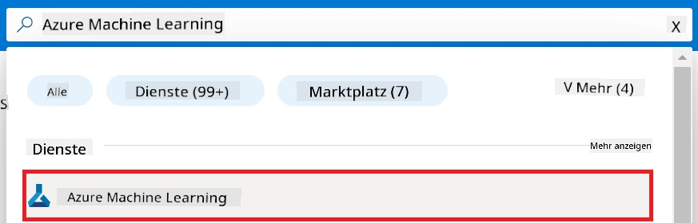

2. Wählen Sie im Navigationsmenü **+ Erstellen**.

3. Wählen Sie im Navigationsmenü **Neuen Workspace** aus.

    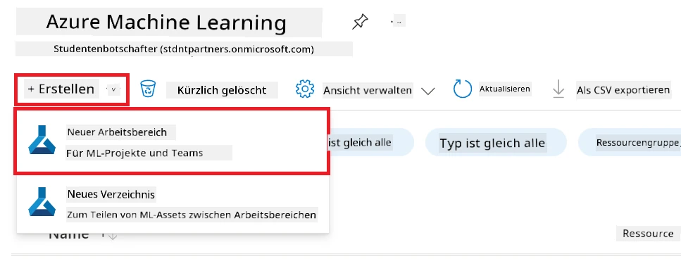

4. Führen Sie die folgenden Schritte aus:

    - Wählen Sie Ihre Azure **Subscription** aus.
    - Wählen Sie die zu verwendende **Ressourcengruppe** aus (bei Bedarf neu erstellen).
    - Geben Sie **Workspace-Name** ein. Er muss ein eindeutiger Wert sein.
    - Wählen Sie die gewünschte **Region** aus.
    - Wählen Sie das zu verwendende **Speicherkonto** aus (bei Bedarf neu erstellen).
    - Wählen Sie den zu verwendenden **Key Vault** aus (bei Bedarf neu erstellen).
    - Wählen Sie die zu verwendende **Application Insights** aus (bei Bedarf neu erstellen).
    - Wählen Sie die zu verwendende **Container Registry** aus (bei Bedarf neu erstellen).

    

5. Wählen Sie **Überprüfen + erstellen**.

6. Wählen Sie **Erstellen**.

### Anfordern von GPU-Quoten in Azure Subscription

In diesem Tutorial lernen Sie, wie Sie ein Phi-3-Modell feinabstimmen und bereitstellen, wobei GPUs verwendet werden. Für die Feinabstimmung verwenden Sie die GPU *Standard_NC24ads_A100_v4*, für die eine Quotenanforderung erforderlich ist. Für die Bereitstellung verwenden Sie die GPU *Standard_NC6s_v3*, für die ebenfalls eine Quotenanforderung notwendig ist.

> [!NOTE]
>
> Nur Pay-As-You-Go-Abonnements (der Standard-Abonnementtyp) sind für die GPU-Zuteilung berechtigt; Benefit-Abonnements werden derzeit nicht unterstützt.
>

1. Besuchen Sie [Azure ML Studio](https://ml.azure.com/home?wt.mc_id=studentamb_279723).

1. Führen Sie die folgenden Schritte durch, um die Quote für die *Standard NCADSA100v4 Family* anzufordern:

    - Wählen Sie im linken Tab **Quote**.
    - Wählen Sie die zu verwendende **Virtuelle Maschinenfamilie** aus. Zum Beispiel **Standard NCADSA100v4 Family Cluster Dedicated vCPUs**, welche die GPU *Standard_NC24ads_A100_v4* einschließt.
    - Wählen Sie im Navigationsmenü **Quote anfordern**.

        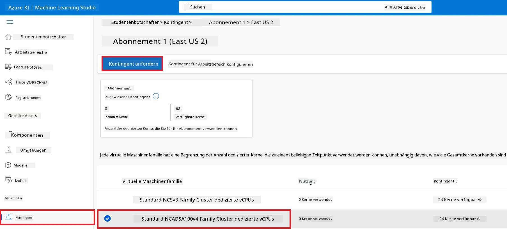

    - Geben Sie auf der Seite zur Quotenanforderung das **Neue Kernlimit** ein, das Sie verwenden möchten. Zum Beispiel 24.
    - Wählen Sie auf der Seite zur Quotenanforderung **Absenden**, um die GPU-Quote anzufordern.

1. Führen Sie die folgenden Schritte durch, um die Quote für die *Standard NCSv3 Family* anzufordern:

    - Wählen Sie im linken Tab **Quote**.
    - Wählen Sie die zu verwendende **Virtuelle Maschinenfamilie** aus. Zum Beispiel **Standard NCSv3 Family Cluster Dedicated vCPUs**, welche die GPU *Standard_NC6s_v3* einschließt.
    - Wählen Sie im Navigationsmenü **Quote anfordern**.
    - Geben Sie auf der Seite zur Quotenanforderung das **Neue Kernlimit** ein, das Sie verwenden möchten. Zum Beispiel 24.
    - Wählen Sie auf der Seite zur Quotenanforderung **Absenden**, um die GPU-Quote anzufordern.

### Rollen-Zuweisung hinzufügen

Um Ihre Modelle feinabzustimmen und bereitzustellen, müssen Sie zuerst eine User Assigned Managed Identity (UAI) erstellen und ihr die entsprechenden Berechtigungen zuweisen. Diese UAI wird zur Authentifizierung während der Bereitstellung verwendet.

#### Erstellen einer User Assigned Managed Identity (UAI)

1. Geben Sie oben im Portal in der **Suchleiste** *managed identities* ein und wählen Sie **Managed Identities** aus den angezeigten Optionen aus.

    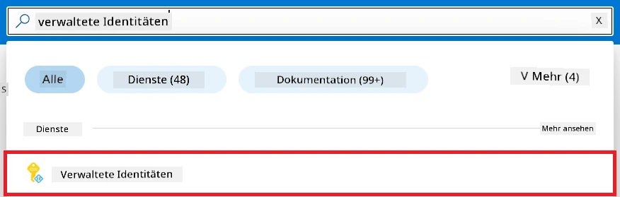

1. Wählen Sie **+ Erstellen**.

    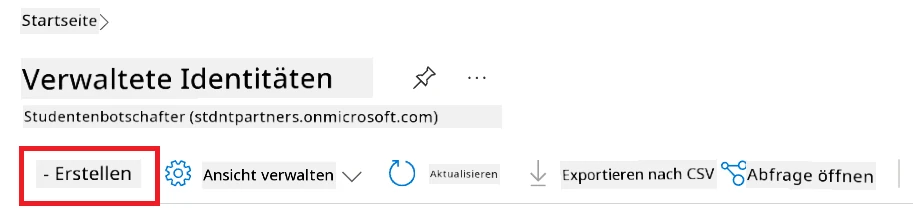

1. Führen Sie die folgenden Schritte aus:

    - Wählen Sie Ihre Azure **Subscription** aus.
    - Wählen Sie die zu verwendende **Ressourcengruppe** aus (bei Bedarf neu erstellen).
    - Wählen Sie die gewünschte **Region** aus.
    - Geben Sie einen **Namen** ein. Er muss ein eindeutiger Wert sein.

    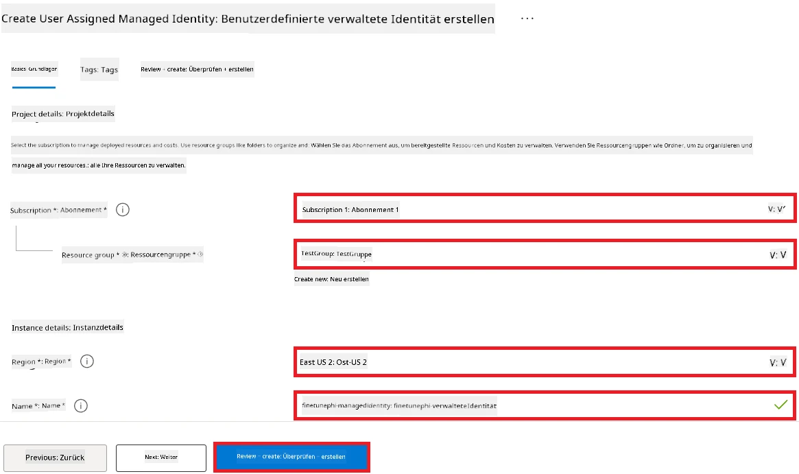

1. Wählen Sie **Überprüfen + erstellen**.

1. Wählen Sie **+ Erstellen**.

#### Hinzufügen der Contributor-Rollen-Zuweisung zur Managed Identity

1. Navigieren Sie zur Managed Identity Ressource, die Sie erstellt haben.

1. Wählen Sie im linken Tab **Azure-Rollen-Zuweisungen**.

1. Wählen Sie im Navigationsmenü **+ Rollen-Zuweisung hinzufügen**.

1. Führen Sie auf der Seite "Rollen-Zuweisung hinzufügen" die folgenden Aufgaben aus:
    - Wählen Sie den **Geltungsbereich** auf **Ressourcengruppe**.
    - Wählen Sie Ihre Azure **Subscription**.
    - Wählen Sie die zu verwendende **Ressourcengruppe**.
    - Wählen Sie die **Rolle** **Mitwirkender (Contributor)**.

    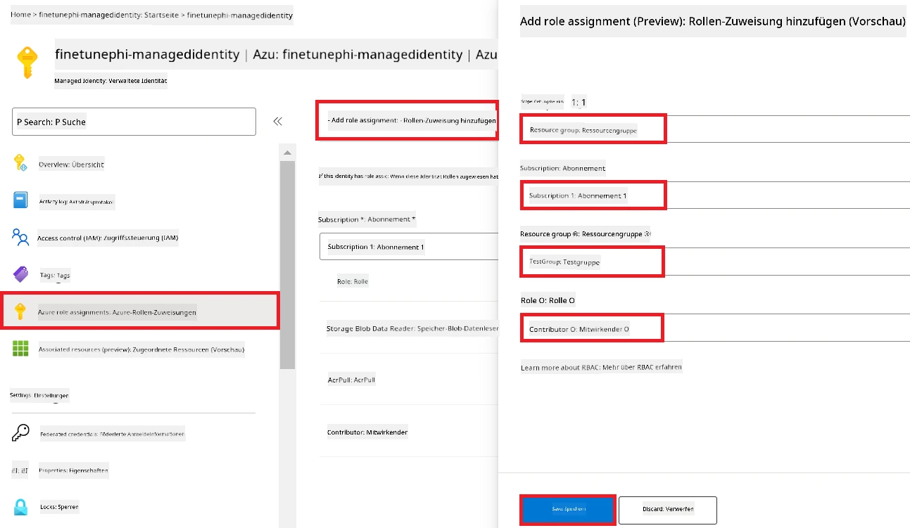

2. Wählen Sie **Speichern**.

#### Hinzufügen der Storage Blob Data Reader-Rollen-Zuweisung zur Managed Identity

1. Geben Sie oben im Portal in der **Suchleiste** *storage accounts* ein und wählen Sie **Storage accounts** aus den angezeigten Optionen aus.

    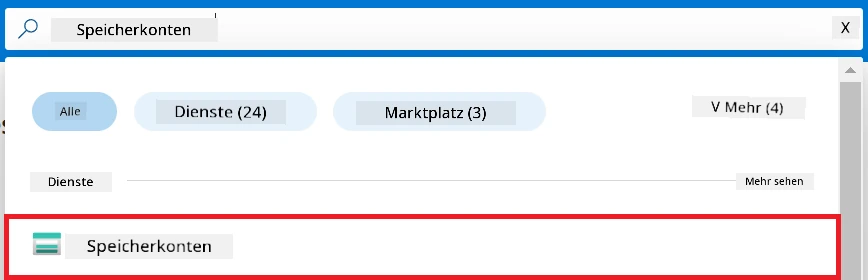

1. Wählen Sie das Speicherkonto aus, das mit dem Azure Machine Learning Workspace, den Sie erstellt haben, verknüpft ist. Zum Beispiel *finetunephistorage*.

1. Führen Sie folgende Schritte aus, um zur Seite "Rollen-Zuweisung hinzufügen" zu gelangen:

    - Navigieren Sie zum erstellten Azure Storage-Konto.
    - Wählen Sie im linken Tab **Zugriffskontrolle (IAM)**.
    - Wählen Sie im Navigationsmenü **+ Hinzufügen**.
    - Wählen Sie im Navigationsmenü **Rollen-Zuweisung hinzufügen**.

    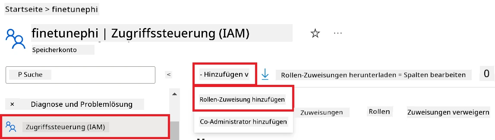

1. Führen Sie auf der Seite "Rollen-Zuweisung hinzufügen" folgende Aufgaben aus:

    - Geben Sie auf der Rollenseite *Storage Blob Data Reader* in die **Suchleiste** ein und wählen Sie **Storage Blob Data Reader** aus den angezeigten Optionen aus.
    - Wählen Sie auf der Rollenseite **Weiter**.
    - Wählen Sie auf der Mitgliederseite **Zugriff zuweisen an** **Managed identity**.
    - Wählen Sie auf der Mitgliederseite **+ Mitglieder auswählen**.
    - Wählen Sie auf der Seite "Verwaltete Identitäten auswählen" Ihre Azure **Subscription**.
    - Wählen Sie auf der Seite "Verwaltete Identities auswählen" die **Managed Identity** zur **Managed Identity** aus.
    - Wählen Sie die Managed Identity, die Sie erstellt haben, aus. Zum Beispiel *finetunephi-managedidentity*.
    - Wählen Sie **Auswählen**.

    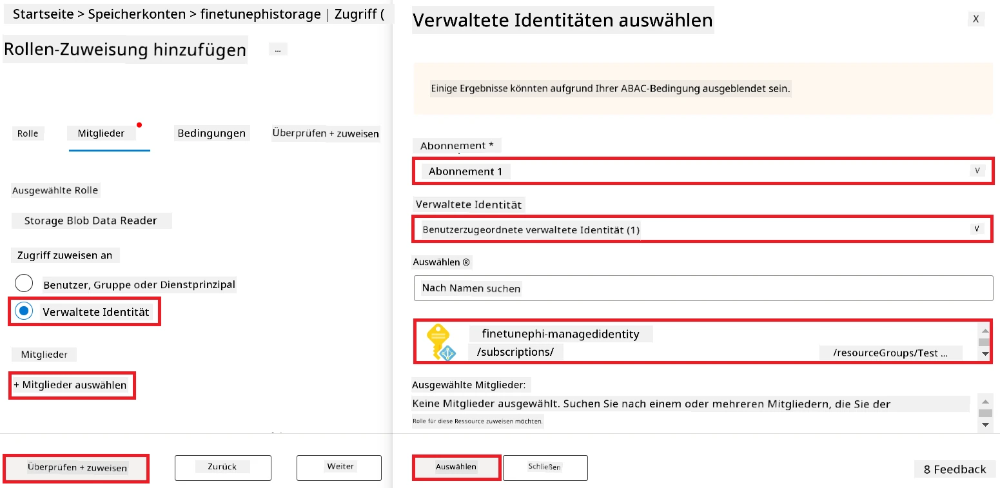

1. Wählen Sie **Überprüfen + zuweisen**.

#### Hinzufügen der AcrPull-Rollen-Zuweisung zur Managed Identity

1. Geben Sie oben im Portal in der **Suchleiste** *container registries* ein und wählen Sie **Container registries** aus den angezeigten Optionen aus.

    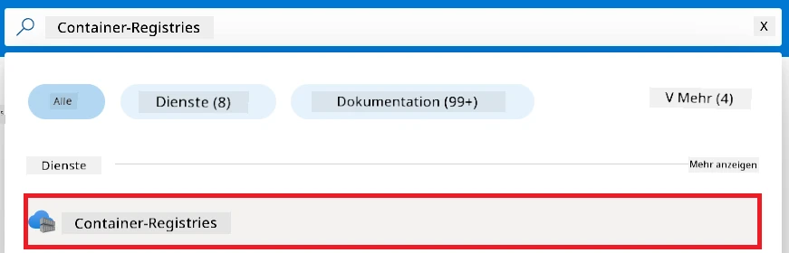

1. Wählen Sie die Container-Registry aus, die mit dem Azure Machine Learning Workspace verknüpft ist. Zum Beispiel *finetunephicontainerregistry*

1. Führen Sie folgende Schritte aus, um zur Seite "Rollen-Zuweisung hinzufügen" zu gelangen:

    - Wählen Sie im linken Tab **Zugriffskontrolle (IAM)**.
    - Wählen Sie im Navigationsmenü **+ Hinzufügen**.
    - Wählen Sie im Navigationsmenü **Rollen-Zuweisung hinzufügen**.

1. Führen Sie auf der Seite "Rollen-Zuweisung hinzufügen" folgende Aufgaben aus:

    - Geben Sie auf der Rollenseite *AcrPull* in die **Suchleiste** ein und wählen Sie **AcrPull** aus den angezeigten Optionen aus.
    - Wählen Sie auf der Rollenseite **Weiter**.
    - Wählen Sie auf der Mitgliederseite **Zugriff zuweisen an** **Managed identity**.
    - Wählen Sie auf der Mitgliederseite **+ Mitglieder auswählen**.
    - Wählen Sie auf der Seite "Verwaltete Identities auswählen" Ihre Azure **Subscription**.
    - Wählen Sie auf der Seite "Verwaltete Identitäten auswählen" die **Managed Identity** zur **Managed Identity** aus.
    - Wählen Sie die Managed Identity, die Sie erstellt haben, aus. Zum Beispiel *finetunephi-managedidentity*.
    - Wählen Sie **Auswählen**.
    - Wählen Sie **Überprüfen + zuweisen**.

### Projekt einrichten

Um die für die Feinabstimmung benötigten Datensätze herunterzuladen, richten Sie eine lokale Umgebung ein.

In dieser Übung werden Sie

- Einen Ordner erstellen, in dem Sie arbeiten.
- Eine virtuelle Umgebung erstellen.
- Die erforderlichen Pakete installieren.
- Eine Datei *download_dataset.py* erstellen, um den Datensatz herunterzuladen.

#### Einen Ordner erstellen, in dem Sie arbeiten

1. Öffnen Sie ein Terminalfenster und geben Sie den folgenden Befehl ein, um einen Ordner mit dem Namen *finetune-phi* im Standardpfad zu erstellen.

    ```console
    mkdir finetune-phi
    ```

2. Geben Sie den folgenden Befehl in Ihr Terminal ein, um zum Ordner *finetune-phi* zu navigieren, den Sie erstellt haben.

    ```console
    cd finetune-phi
    ```

#### Erstellen einer virtuellen Umgebung

1. Geben Sie den folgenden Befehl in Ihr Terminal ein, um eine virtuelle Umgebung mit dem Namen *.venv* zu erstellen.

    ```console
    python -m venv .venv
    ```

2. Geben Sie den folgenden Befehl in Ihr Terminal ein, um die virtuelle Umgebung zu aktivieren.

    ```console
    .venv\Scripts\activate.bat
    ```

> [!NOTE]
> Wenn es funktioniert hat, sollten Sie *(.venv)* vor der Eingabeaufforderung sehen.

#### Installieren der erforderlichen Pakete

1. Geben Sie die folgenden Befehle in Ihr Terminal ein, um die erforderlichen Pakete zu installieren.

    ```console
    pip install datasets==2.19.1
    ```

#### Erstellen von `donload_dataset.py`

> [!NOTE]
> Vollständige Ordnerstruktur:
>
> ```text
> └── YourUserName
> .    └── finetune-phi
> .        └── download_dataset.py
> ```

1. Öffnen Sie **Visual Studio Code**.

1. Wählen Sie **Datei** aus der Menüleiste.

1. Wählen Sie **Ordner öffnen**.

1. Wählen Sie den *finetune-phi*-Ordner aus, den Sie erstellt haben, dieser befindet sich unter *C:\Users\yourUserName\finetune-phi*.

    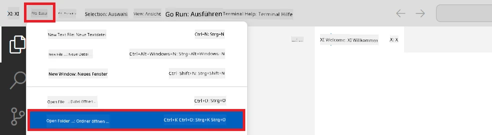

1. Klicken Sie im linken Bereich von Visual Studio Code mit der rechten Maustaste und wählen Sie **Neue Datei**, um eine neue Datei mit dem Namen *download_dataset.py* zu erstellen.

    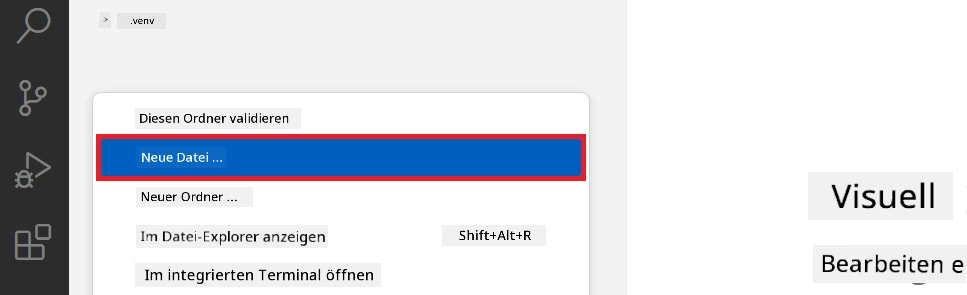

### Vorbereitung des Datensatzes für Fine-Tuning

In dieser Übung führen Sie die Datei *download_dataset.py* aus, um die *ultrachat_200k*-Datensätze in Ihre lokale Umgebung herunterzuladen. Anschließend verwenden Sie diese Datensätze, um das Phi-3-Modell in Azure Machine Learning feinzujustieren.

In dieser Übung werden Sie:

- Code zur Datei *download_dataset.py* hinzufügen, um die Datensätze herunterzuladen.
- Die Datei *download_dataset.py* ausführen, um die Datensätze in Ihre lokale Umgebung herunterzuladen.

#### Laden Sie Ihren Datensatz mit *download_dataset.py* herunter

1. Öffnen Sie die Datei *download_dataset.py* in Visual Studio Code.

1. Fügen Sie den folgenden Code in die Datei *download_dataset.py* ein.

    ```python
    import json
    import os
    from datasets import load_dataset

    def load_and_split_dataset(dataset_name, config_name, split_ratio):
        """
        Load and split a dataset.
        """
        # Lade den Datensatz mit dem angegebenen Namen, der Konfiguration und dem Aufteilungsverhältnis
        dataset = load_dataset(dataset_name, config_name, split=split_ratio)
        print(f"Original dataset size: {len(dataset)}")
        
        # Teile den Datensatz in Trainings- und Testdatensätze (80% Training, 20% Test)
        split_dataset = dataset.train_test_split(test_size=0.2)
        print(f"Train dataset size: {len(split_dataset['train'])}")
        print(f"Test dataset size: {len(split_dataset['test'])}")
        
        return split_dataset

    def save_dataset_to_jsonl(dataset, filepath):
        """
        Save a dataset to a JSONL file.
        """
        # Erstelle das Verzeichnis, falls es nicht existiert
        os.makedirs(os.path.dirname(filepath), exist_ok=True)
        
        # Öffne die Datei im Schreibmodus
        with open(filepath, 'w', encoding='utf-8') as f:
            # Iteriere über jeden Datensatz im Datensatz
            for record in dataset:
                # Speichere den Datensatz als JSON-Objekt und schreibe ihn in die Datei
                json.dump(record, f)
                # Schreibe ein Zeilenumbruchzeichen, um Datensätze zu trennen
                f.write('\n')
        
        print(f"Dataset saved to {filepath}")

    def main():
        """
        Main function to load, split, and save the dataset.
        """
        # Lade und teile den ULTRACHAT_200k-Datensatz mit einer spezifischen Konfiguration und Aufteilungsverhältnis
        dataset = load_and_split_dataset("HuggingFaceH4/ultrachat_200k", 'default', 'train_sft[:1%]')
        
        # Extrahiere die Trainings- und Testdatensätze aus der Aufteilung
        train_dataset = dataset['train']
        test_dataset = dataset['test']

        # Speichere den Trainingsdatensatz in eine JSONL-Datei
        save_dataset_to_jsonl(train_dataset, "data/train_data.jsonl")
        
        # Speichere den Testdatensatz in eine separate JSONL-Datei
        save_dataset_to_jsonl(test_dataset, "data/test_data.jsonl")

    if __name__ == "__main__":
        main()

    ```

1. Geben Sie den folgenden Befehl in Ihr Terminal ein, um das Skript auszuführen und den Datensatz in Ihre lokale Umgebung herunterzuladen.

    ```console
    python download_dataset.py
    ```

1. Überprüfen Sie, ob die Datensätze erfolgreich im lokalen Verzeichnis *finetune-phi/data* gespeichert wurden.

> [!NOTE]
>
> #### Hinweis zur Datensatzgröße und Fine-Tuning-Zeit
>
> In diesem Tutorial verwenden Sie nur 1 % des Datensatzes (`split='train[:1%]'`). Dies reduziert die Datenmenge erheblich und beschleunigt sowohl das Hochladen als auch den Fine-Tuning-Prozess. Sie können den Prozentsatz anpassen, um das richtige Gleichgewicht zwischen Trainingszeit und Modellleistung zu finden. Die Verwendung eines kleineren Teils des Datensatzes verkürzt die benötigte Zeit für das Fine-Tuning und macht den Prozess für ein Tutorial besser handhabbar.

## Szenario 2: Feinabstimmung des Phi-3-Modells und Bereitstellung in Azure Machine Learning Studio

### Feinabstimmung des Phi-3-Modells

In dieser Übung werden Sie das Phi-3-Modell in Azure Machine Learning Studio feinabstimmen.

In dieser Übung werden Sie:

- Einen Computer-Cluster für das Fine-Tuning erstellen.
- Das Phi-3-Modell in Azure Machine Learning Studio feinabstimmen.

#### Erstellen eines Computer-Clusters für das Fine-Tuning

1. Besuchen Sie [Azure ML Studio](https://ml.azure.com/home?wt.mc_id=studentamb_279723).

1. Wählen Sie **Compute** aus dem linken Seitenmenü.

1. Wählen Sie **Compute clusters** im Navigationsmenü.

1. Wählen Sie **+ Neu**.

    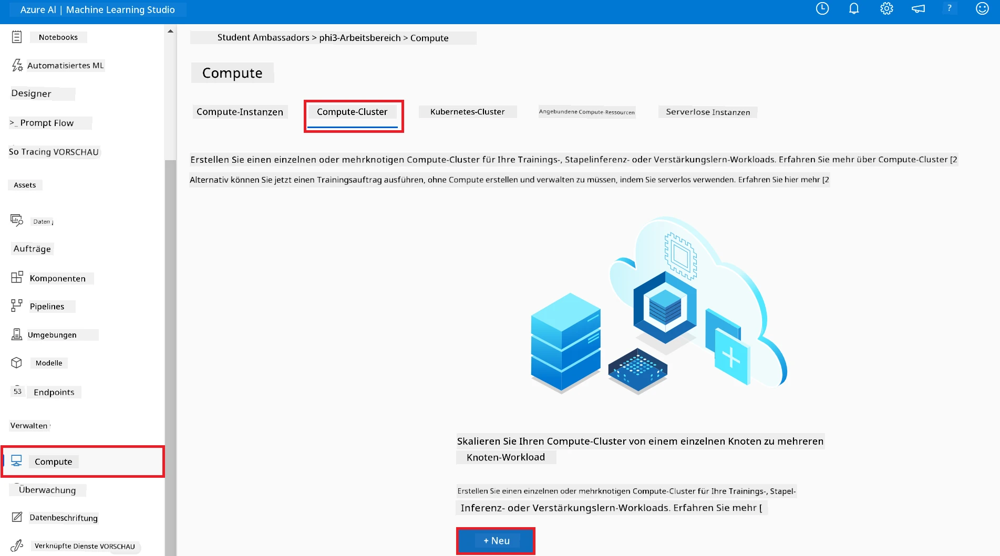

1. Führen Sie die folgenden Aufgaben aus:

    - Wählen Sie die gewünschte **Region** aus.
    - Wählen Sie die **Virtual Machine Ebene** auf **Dedicated**.
    - Wählen Sie den **Virtual Machine Typ** auf **GPU**.
    - Filtern Sie bei **Virtual Machine Größe** nach **Von allen Optionen auswählen**.
    - Wählen Sie die **Virtual Machine Größe** auf **Standard_NC24ads_A100_v4**.

    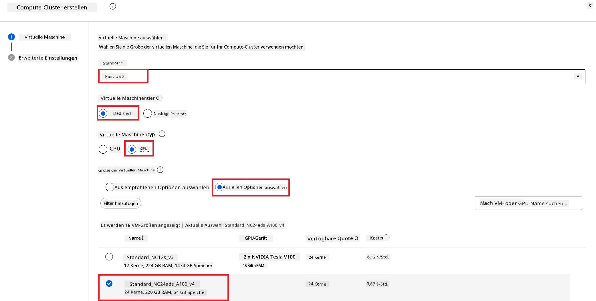

1. Wählen Sie **Weiter**.

1. Führen Sie die folgenden Aufgaben aus:

    - Geben Sie den **Compute-Namen** ein. Er muss eindeutig sein.
    - Wählen Sie die **Minimale Anzahl von Knoten** auf **0**.
    - Wählen Sie die **Maximale Anzahl von Knoten** auf **1**.
    - Wählen Sie die **Leerlaufzeit vor Skalierung nach unten** auf **120**.

    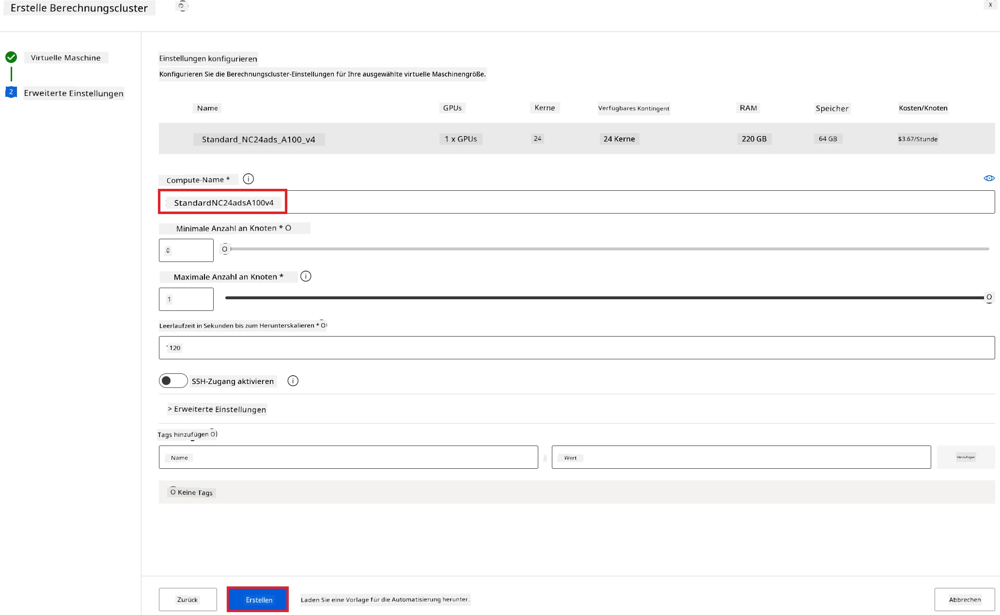

1. Wählen Sie **Erstellen**.

#### Feinabstimmung des Phi-3-Modells

1. Besuchen Sie [Azure ML Studio](https://ml.azure.com/home?wt.mc_id=studentamb_279723).

1. Wählen Sie den Azure Machine Learning-Arbeitsbereich aus, den Sie erstellt haben.

    

1. Führen Sie die folgenden Aufgaben aus:

    - Wählen Sie **Model Catalog** im linken Seitenmenü.
    - Geben Sie *phi-3-mini-4k* in die **Suchleiste** ein und wählen Sie **Phi-3-mini-4k-instruct** aus den erscheinenden Optionen aus.

    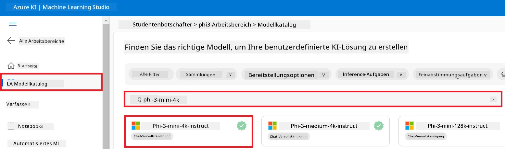

1. Wählen Sie **Fine-tune** im Navigationsmenü.

    

1. Führen Sie die folgenden Aufgaben aus:

    - Wählen Sie **Aufgabentyp auswählen** auf **Chat Completion**.
    - Wählen Sie **+ Daten auswählen** um **Trainingsdaten** hochzuladen.
    - Wählen Sie bei Validierungsdaten den Upload-Typ **Andere Validierungsdaten angeben**.
    - Wählen Sie **+ Daten auswählen** um **Validierungsdaten** hochzuladen.

    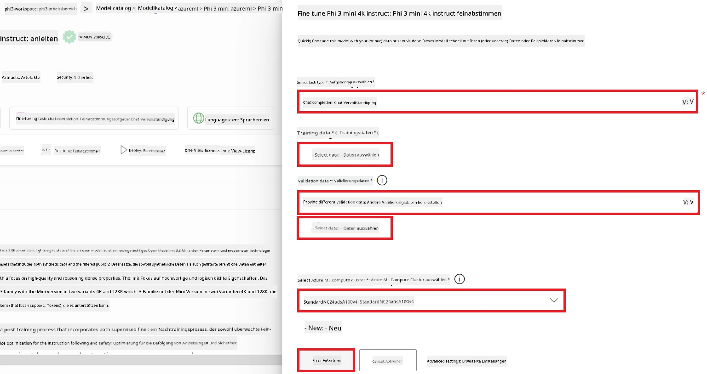

> [!TIP]
>
> Sie können **Erweiterte Einstellungen** auswählen, um Konfigurationen wie **learning_rate** und **lr_scheduler_type** anzupassen, um den Fine-Tuning-Prozess nach Ihren spezifischen Anforderungen zu optimieren.

1. Wählen Sie **Fertig stellen**.

1. In dieser Übung haben Sie erfolgreich das Phi-3-Modell mit Azure Machine Learning feinabgestimmt. Beachten Sie bitte, dass der Fine-Tuning-Prozess einige Zeit in Anspruch nehmen kann. Nachdem Sie den Fine-Tuning-Job gestartet haben, müssen Sie warten, bis dieser abgeschlossen ist. Sie können den Status des Fine-Tuning-Jobs verfolgen, indem Sie im linken Seitenmenü Ihres Azure Machine Learning-Arbeitsbereichs auf die Registerkarte Jobs gehen. Im nächsten Abschnitt werden Sie das feinabgestimmte Modell bereitstellen und es mit Prompt Flow integrieren.

    

### Bereitstellen des feinabgestimmten Phi-3-Modells

Um das feinabgestimmte Phi-3-Modell mit Prompt Flow zu integrieren, müssen Sie das Modell bereitstellen, damit es für Echtzeit-Inferenz zugänglich ist. Dieser Prozess umfasst die Registrierung des Modells, das Erstellen eines Online-Endpunkts und das Bereitstellen des Modells.

In dieser Übung werden Sie:

- Das feinabgestimmte Modell im Azure Machine Learning-Arbeitsbereich registrieren.
- Einen Online-Endpunkt erstellen.
- Das registrierte feinabgestimmte Phi-3-Modell bereitstellen.

#### Registrieren des feinabgestimmten Modells

1. Besuchen Sie [Azure ML Studio](https://ml.azure.com/home?wt.mc_id=studentamb_279723).

1. Wählen Sie den Azure Machine Learning-Arbeitsbereich aus, den Sie erstellt haben.

    

1. Wählen Sie **Models** im linken Seitenmenü.
1. Wählen Sie **+ Registrieren**.
1. Wählen Sie **Aus einem Job-Ausgabewert**.

    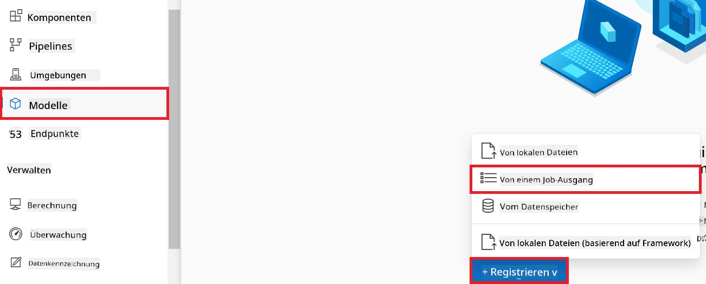

1. Wählen Sie den Job aus, den Sie erstellt haben.

    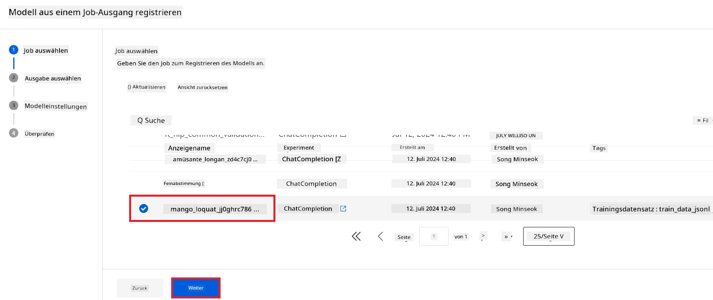

1. Wählen Sie **Weiter**.

1. Wählen Sie den **Modelltyp** auf **MLflow**.

1. Stellen Sie sicher, dass **Job output** ausgewählt ist; dies sollte automatisch der Fall sein.

    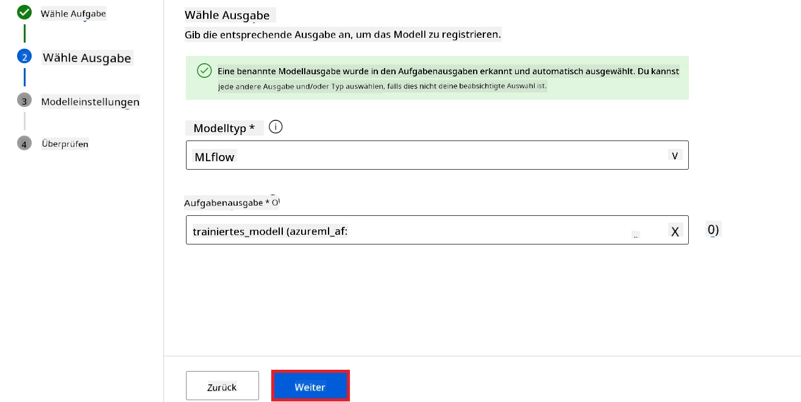

2. Wählen Sie **Weiter**.

3. Wählen Sie **Registrieren**.

    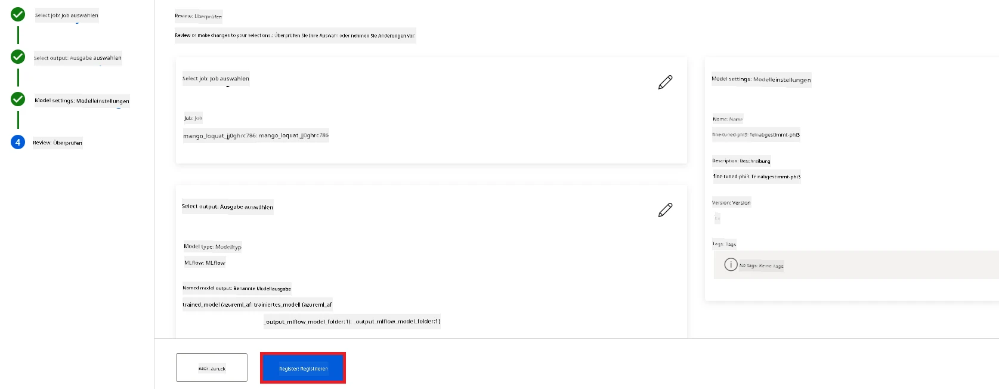

4. Sie können Ihr registriertes Modell anzeigen, indem Sie im linken Seitenmenü auf **Models** gehen.

    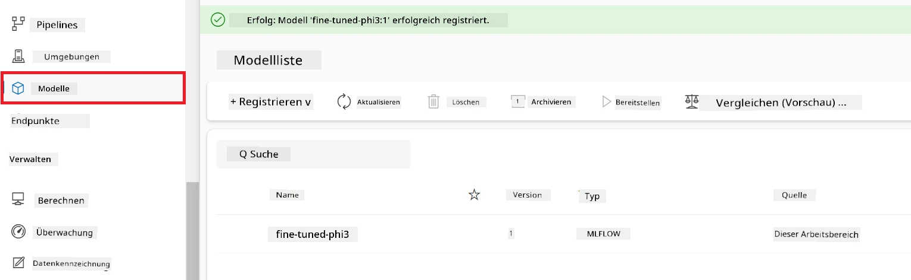

#### Bereitstellen des feinabgestimmten Modells

1. Navigieren Sie zu dem Azure Machine Learning-Arbeitsbereich, den Sie erstellt haben.

1. Wählen Sie **Endpoints** im linken Seitenmenü.

1. Wählen Sie **Echtzeit-Endpunkte** im Navigationsmenü.

    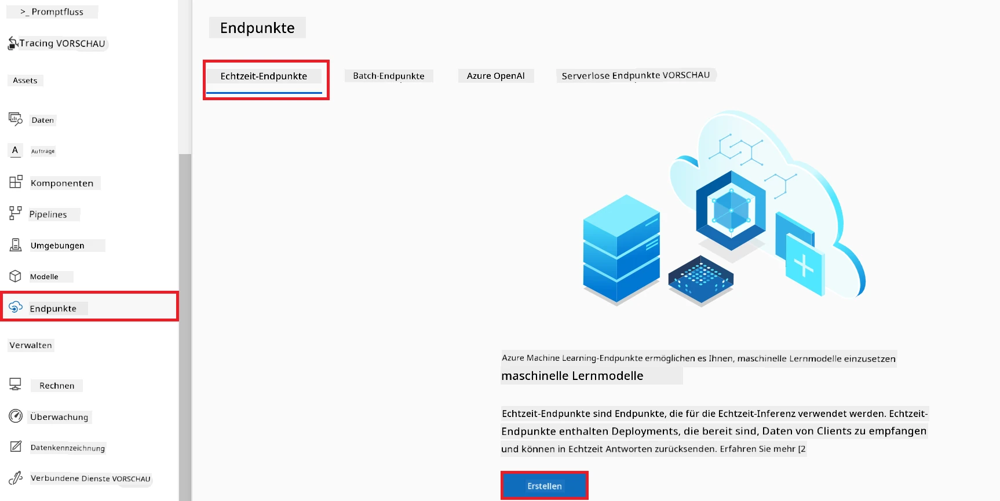

1. Wählen Sie **Erstellen**.

1. Wählen Sie das registrierte Modell aus, das Sie erstellt haben.

    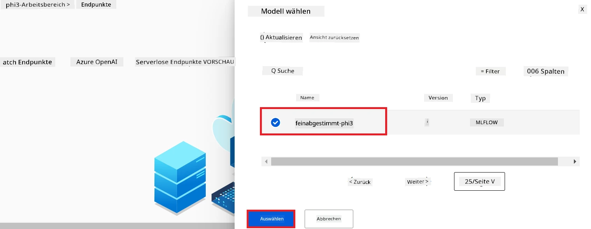

1. Wählen Sie **Auswählen**.

1. Führen Sie die folgenden Aufgaben aus:

    - Wählen Sie **Virtuelle Maschine** auf *Standard_NC6s_v3*.
    - Wählen Sie die gewünschte **Instanzanzahl**, z.B. *1*.
    - Wählen Sie den **Endpunkt** auf **Neu**, um einen neuen Endpunkt zu erstellen.
    - Geben Sie den **Endpunktnamen** ein. Er muss eindeutig sein.
    - Geben Sie den **Bereitstellungsnamen** ein. Er muss eindeutig sein.

    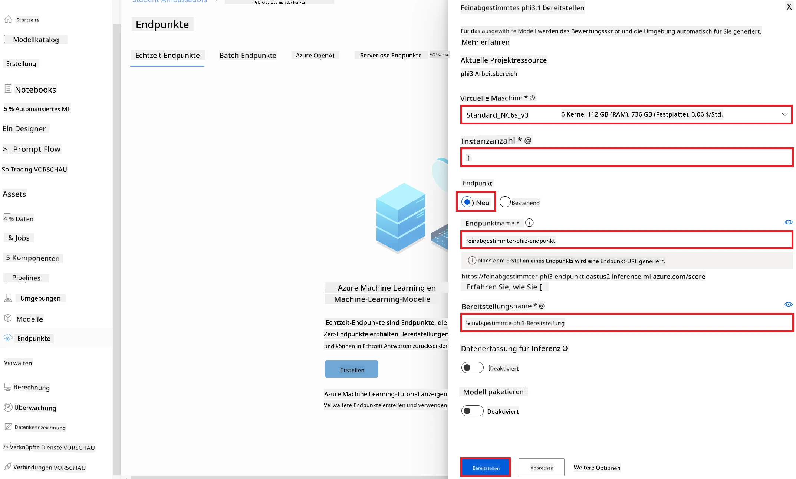

1. Wählen Sie **Bereitstellen**.

> [!WARNING]
> Um zusätzliche Kosten auf Ihrem Konto zu vermeiden, löschen Sie bitte den erstellten Endpunkt im Azure Machine Learning-Arbeitsbereich.
>

#### Überprüfen des Bereitstellungsstatus im Azure Machine Learning-Arbeitsbereich

1. Navigieren Sie zu dem Azure Machine Learning-Arbeitsbereich, den Sie erstellt haben.

1. Wählen Sie **Endpoints** im linken Seitenmenü.

1. Wählen Sie den Endpunkt aus, den Sie erstellt haben.

    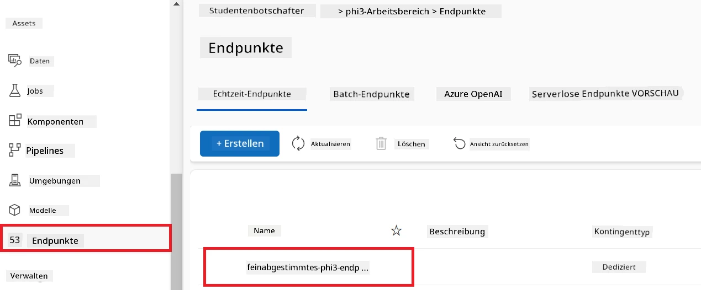

1. Auf dieser Seite können Sie die Endpunkte während des Bereitstellungsprozesses verwalten.

> [!NOTE]
> Sobald die Bereitstellung abgeschlossen ist, stellen Sie sicher, dass der **Live Traffic** auf **100%** gesetzt ist. Falls nicht, wählen Sie **Traffic aktualisieren**, um die Traffic-Einstellungen anzupassen. Beachten Sie, dass Sie das Modell nicht testen können, wenn der Traffic auf 0 % eingestellt ist.
>
> 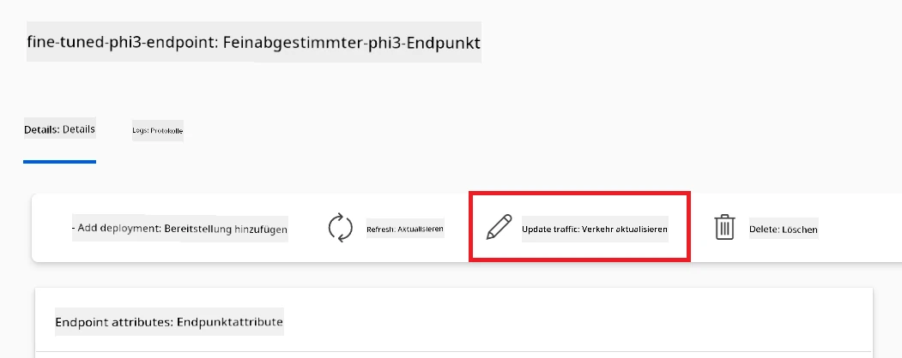
>

## Szenario 3: Integration mit Prompt Flow und Chatten mit Ihrem benutzerdefinierten Modell in Azure AI Foundry

### Integration des benutzerdefinierten Phi-3-Modells mit Prompt Flow

Nach erfolgreicher Bereitstellung Ihres feinabgestimmten Modells können Sie es nun mit Prompt Flow integrieren, um Ihr Modell in Echtzeitanwendungen zu nutzen und verschiedene interaktive Aufgaben mit Ihrem benutzerdefinierten Phi-3-Modell durchzuführen.

In dieser Übung werden Sie:

- Azure AI Foundry Hub erstellen.
- Azure AI Foundry Projekt erstellen.
- Prompt Flow erstellen.
- Eine benutzerdefinierte Verbindung für das feinabgestimmte Phi-3-Modell hinzufügen.
- Prompt Flow einrichten, um mit Ihrem benutzerdefinierten Phi-3-Modell zu chatten.

> [!NOTE]
> Sie können die Integration mit Prompt Flow auch über Azure ML Studio durchführen. Der gleiche Integrationsprozess kann auf Azure ML Studio angewandt werden.

#### Erstellen des Azure AI Foundry Hub

Sie müssen zuerst einen Hub erstellen, bevor Sie das Projekt erstellen können. Ein Hub funktioniert wie eine Ressourcengruppe und ermöglicht es Ihnen, mehrere Projekte innerhalb von Azure AI Foundry zu organisieren und zu verwalten.

1. Besuchen Sie [Azure AI Foundry](https://ai.azure.com/?WT.mc_id=aiml-137032-kinfeylo).

1. Wählen Sie **Alle Hubs** im linken Seitenmenü.

1. Wählen Sie **+ Neuer Hub** im Navigationsmenü.
    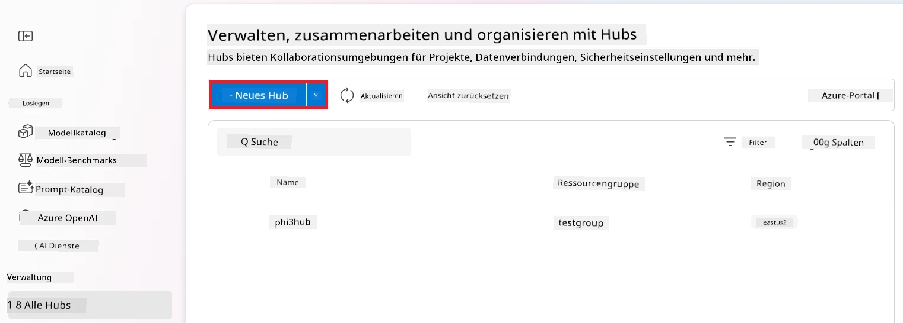

1. Führen Sie die folgenden Aufgaben aus:

    - Geben Sie **Hub-Name** ein. Es muss ein eindeutiger Wert sein.
    - Wählen Sie Ihr Azure-**Abonnement** aus.
    - Wählen Sie die zu verwendende **Ressourcengruppe** aus (erstelle bei Bedarf eine neue).
    - Wählen Sie den gewünschten **Standort** aus.
    - Wählen Sie die zu verwendenden **Azure AI Services verbinden** aus (erstelle bei Bedarf eine neue).
    - Wählen Sie **Azure AI Search verbinden** und dann **Verbindung überspringen** aus.

    

1. Wählen Sie **Weiter** aus.

#### Azure AI Foundry-Projekt erstellen

1. Wählen Sie im erstellten Hub im linken Seiten-Tab **Alle Projekte** aus.

1. Wählen Sie im Navigationsmenü **+ Neues Projekt** aus.

    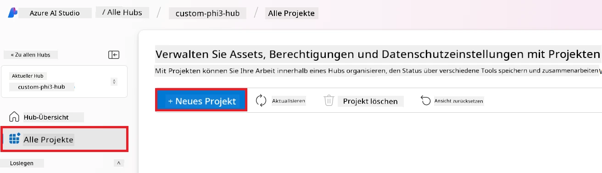

1. Geben Sie **Projektname** ein. Es muss ein eindeutiger Wert sein.

    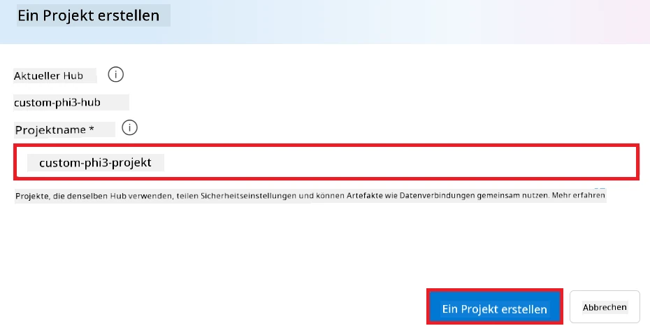

1. Wählen Sie **Ein Projekt erstellen** aus.

#### Eine benutzerdefinierte Verbindung für das feinabgestimmte Phi-3-Modell hinzufügen

Um Ihr benutzerdefiniertes Phi-3-Modell mit Prompt flow zu integrieren, müssen Sie den Endpunkt und den Schlüssel des Modells in einer benutzerdefinierten Verbindung speichern. Diese Einrichtung stellt sicher, dass Sie in Prompt flow Zugriff auf Ihr benutzerdefiniertes Phi-3-Modell haben.

#### API-Schlüssel und Endpunkt-URI des feinabgestimmten Phi-3-Modells festlegen

1. Besuchen Sie [Azure ML Studio](https://ml.azure.com/home?WT.mc_id=aiml-137032-kinfeylo).

1. Navigieren Sie zum von Ihnen erstellten Azure Machine Learning-Workspace.

1. Wählen Sie im linken Seiten-Tab **Endpunkte** aus.

    

1. Wählen Sie den von Ihnen erstellten Endpunkt aus.

    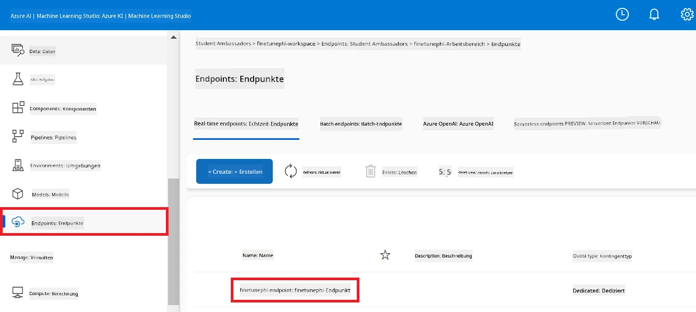

1. Wählen Sie im Navigationsmenü **Verbrauch** aus.

1. Kopieren Sie Ihren **REST-Endpunkt** und den **Primärschlüssel**.

    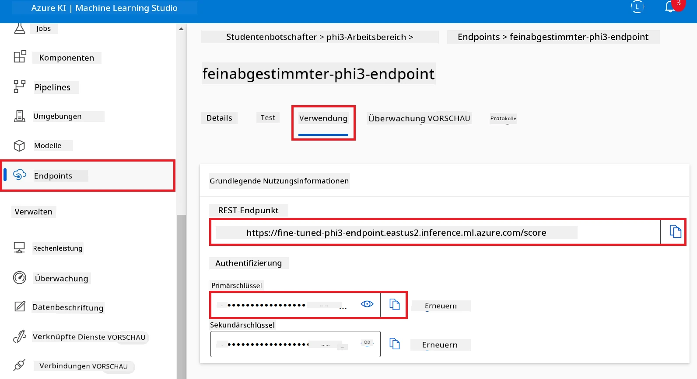

#### Die benutzerdefinierte Verbindung hinzufügen

1. Besuchen Sie [Azure AI Foundry](https://ai.azure.com/?WT.mc_id=aiml-137032-kinfeylo).

1. Navigieren Sie zum erstellten Azure AI Foundry-Projekt.

1. Wählen Sie im erstellten Projekt den linken Seiten-Tab **Einstellungen** aus.

1. Wählen Sie **+ Neue Verbindung** aus.

    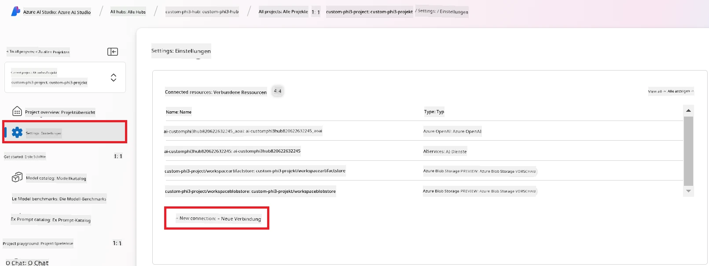

1. Wählen Sie im Navigationsmenü **Benutzerdefinierte Schlüssel** aus.

    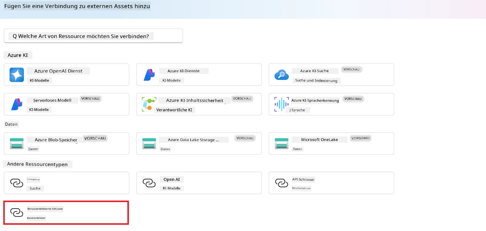

1. Führen Sie die folgenden Schritte aus:

    - Wählen Sie **+ Schlüssel-Wert-Paare hinzufügen**.
    - Geben Sie als Schlüsselname **endpoint** ein und fügen Sie den kopierten Endpoint aus Azure ML Studio im Wertefeld ein.
    - Wählen Sie erneut **+ Schlüssel-Wert-Paare hinzufügen**.
    - Geben Sie als Schlüsselname **key** ein und fügen Sie den kopierten Schlüssel aus Azure ML Studio im Wertefeld ein.
    - Nachdem Sie die Schlüssel hinzugefügt haben, aktivieren Sie **ist Geheimnis**, um zu verhindern, dass der Schlüssel offengelegt wird.

    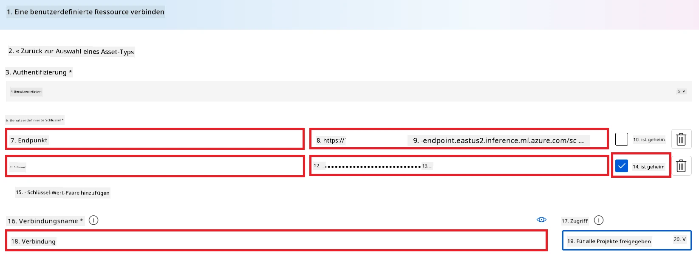

1. Wählen Sie **Verbindung hinzufügen** aus.

#### Prompt flow erstellen

Sie haben eine benutzerdefinierte Verbindung in Azure AI Foundry hinzugefügt. Erstellen Sie nun einen Prompt flow mit den folgenden Schritten. Danach verbinden Sie den Prompt flow mit der benutzerdefinierten Verbindung, sodass Sie das feinabgestimmte Modell innerhalb des Prompt flows verwenden können.

1. Navigieren Sie zum erstellten Azure AI Foundry-Projekt.

1. Wählen Sie im linken Seiten-Tab **Prompt flow** aus.

1. Wählen Sie im Navigationsmenü **+ Erstellen** aus.

    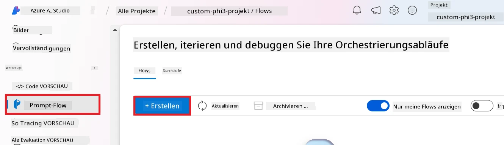

1. Wählen Sie im Navigationsmenü **Chat flow** aus.

    

1. Geben Sie **Ordnername** ein, den Sie verwenden möchten.

    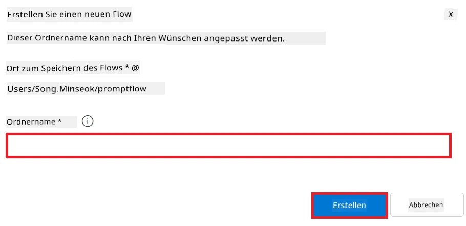

2. Wählen Sie **Erstellen** aus.

#### Prompt flow einrichten, um mit Ihrem benutzerdefinierten Phi-3-Modell zu chatten

Sie müssen das feinabgestimmte Phi-3-Modell in einen Prompt flow integrieren. Der bereitgestellte vorhandene Prompt flow ist jedoch nicht für diesen Zweck ausgelegt. Daher müssen Sie den Prompt flow neu gestalten, um die Integration des benutzerdefinierten Modells zu ermöglichen.

1. Führen Sie im Prompt flow die folgenden Aufgaben aus, um den vorhandenen Flow neu aufzubauen:

    - Wählen Sie **Rohdateimodus** aus.
    - Löschen Sie allen vorhandenen Code in der Datei *flow.dag.yml*.
    - Fügen Sie den folgenden Code in die Datei *flow.dag.yml* ein.

        ```yml
        inputs:
          input_data:
            type: string
            default: "Who founded Microsoft?"

        outputs:
          answer:
            type: string
            reference: ${integrate_with_promptflow.output}

        nodes:
        - name: integrate_with_promptflow
          type: python
          source:
            type: code
            path: integrate_with_promptflow.py
          inputs:
            input_data: ${inputs.input_data}
        ```

    - Wählen Sie **Speichern** aus.

    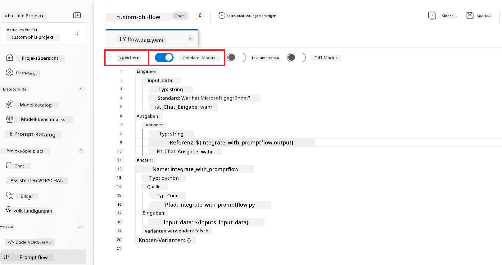

1. Fügen Sie in die Datei *integrate_with_promptflow.py* den folgenden Code ein, um das benutzerdefinierte Phi-3-Modell im Prompt flow zu verwenden.

    ```python
    import logging
    import requests
    from promptflow import tool
    from promptflow.connections import CustomConnection

    # Protokollierung einrichten
    logging.basicConfig(
        format="%(asctime)s - %(levelname)s - %(name)s - %(message)s",
        datefmt="%Y-%m-%d %H:%M:%S",
        level=logging.DEBUG
    )
    logger = logging.getLogger(__name__)

    def query_phi3_model(input_data: str, connection: CustomConnection) -> str:
        """
        Send a request to the Phi-3 model endpoint with the given input data using Custom Connection.
        """

        # „connection“ ist der Name der benutzerdefinierten Verbindung, „endpoint“, „key“ sind die Schlüssel in der benutzerdefinierten Verbindung
        endpoint_url = connection.endpoint
        api_key = connection.key

        headers = {
            "Content-Type": "application/json",
            "Authorization": f"Bearer {api_key}"
        }
        data = {
            "input_data": {
                "input_string": [
                    {"role": "user", "content": input_data}
                ],
                "parameters": {
                    "temperature": 0.7,
                    "max_new_tokens": 128
                }
            }
        }
        try:
            response = requests.post(endpoint_url, json=data, headers=headers)
            response.raise_for_status()
            
            # Die vollständige JSON-Antwort protokollieren
            logger.debug(f"Full JSON response: {response.json()}")

            result = response.json()["output"]
            logger.info("Successfully received response from Azure ML Endpoint.")
            return result
        except requests.exceptions.RequestException as e:
            logger.error(f"Error querying Azure ML Endpoint: {e}")
            raise

    @tool
    def my_python_tool(input_data: str, connection: CustomConnection) -> str:
        """
        Tool function to process input data and query the Phi-3 model.
        """
        return query_phi3_model(input_data, connection)

    ```

    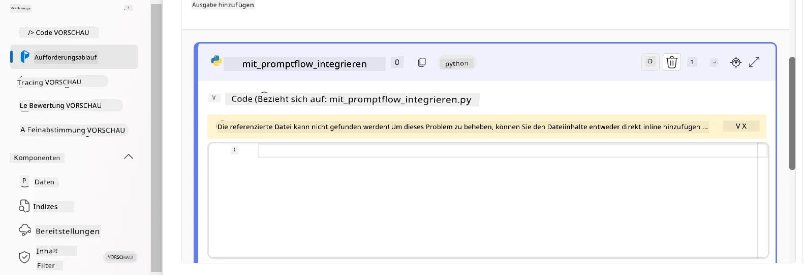

> [!NOTE]
> Für detailliertere Informationen zur Verwendung von Prompt flow in Azure AI Foundry können Sie [Prompt flow in Azure AI Foundry](https://learn.microsoft.com/azure/ai-studio/how-to/prompt-flow) konsultieren.

1. Aktivieren Sie **Chat-Eingabe** und **Chat-Ausgabe**, um den Chat mit Ihrem Modell zu ermöglichen.

    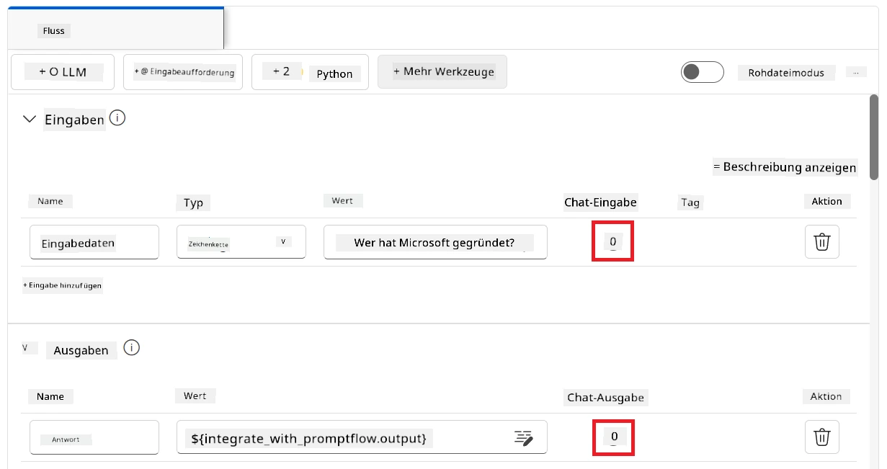

1. Nun sind Sie bereit, mit Ihrem benutzerdefinierten Phi-3-Modell zu chatten. Im nächsten Übungsteil lernen Sie, wie Sie Prompt flow starten und es verwenden, um mit Ihrem feinabgestimmten Phi-3-Modell zu chatten.

> [!NOTE]
>
> Der neu aufgebaute Flow sollte wie im folgenden Bild aussehen:
>
> 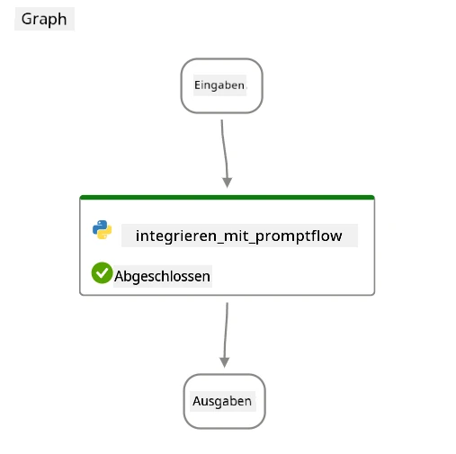
>

### Mit Ihrem benutzerdefinierten Phi-3-Modell chatten

Da Sie Ihr benutzerdefiniertes Phi-3-Modell feinabgestimmt und in Prompt flow integriert haben, sind Sie bereit, mit ihm zu interagieren. Diese Übung führt Sie durch den Prozess, einen Chat mit Ihrem Modell einzurichten und zu starten. Durch das Befolgen dieser Schritte können Sie die Fähigkeiten Ihres feinabgestimmten Phi-3-Modells für verschiedene Aufgaben und Gespräche voll ausschöpfen.

- Chatten Sie mit Ihrem benutzerdefinierten Phi-3-Modell mithilfe von Prompt flow.

#### Prompt flow starten

1. Wählen Sie **Compute-Sitzungen starten** aus, um Prompt flow zu starten.

    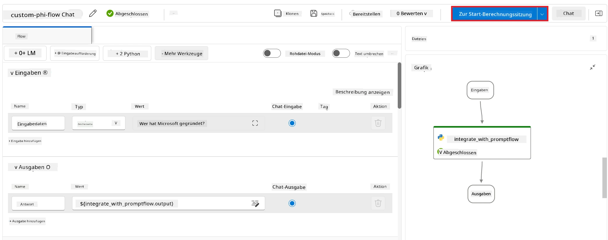

1. Wählen Sie **Eingabe validieren und parsen** aus, um Parameter zu erneuern.

    

1. Wählen Sie den **Wert** der **Verbindung** zu der von Ihnen erstellten benutzerdefinierten Verbindung aus. Zum Beispiel *connection*.

    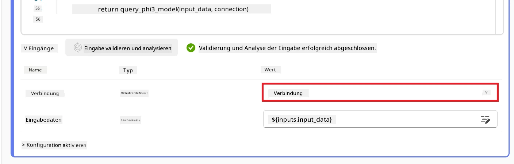

#### Mit Ihrem benutzerdefinierten Modell chatten

1. Wählen Sie **Chat** aus.

    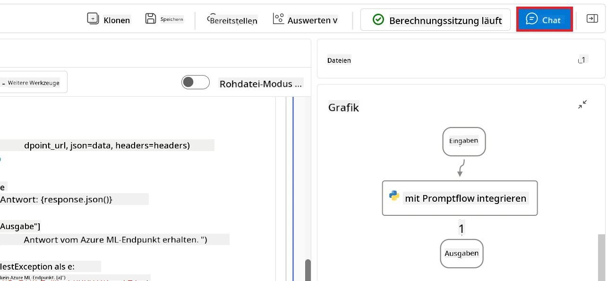

1. Hier ist ein Beispiel für die Ergebnisse: Jetzt können Sie mit Ihrem benutzerdefinierten Phi-3-Modell chatten. Es wird empfohlen, Fragen basierend auf den für das Fine-Tuning verwendeten Daten zu stellen.

    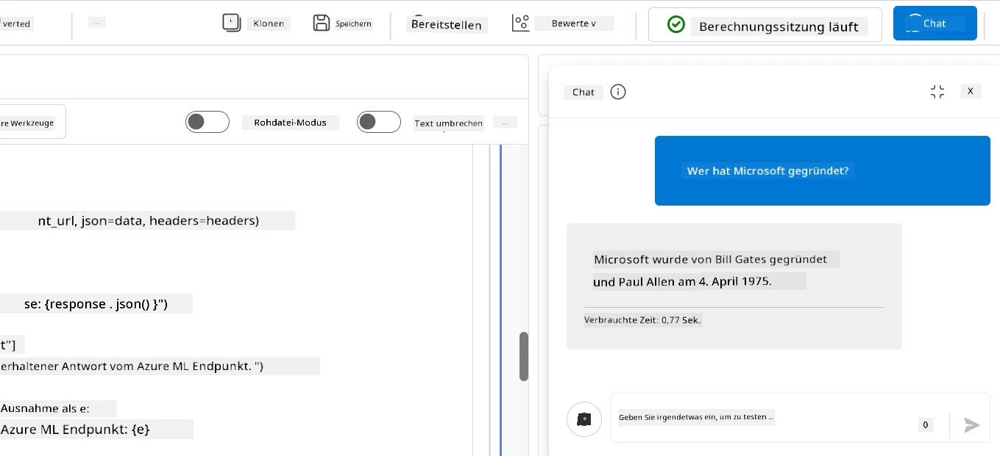

---

<!-- CO-OP TRANSLATOR DISCLAIMER START -->
**Haftungsausschluss**:  
Dieses Dokument wurde mit dem KI-Übersetzungsdienst [Co-op Translator](https://github.com/Azure/co-op-translator) übersetzt. Obwohl wir auf Genauigkeit achten, können automatische Übersetzungen Fehler oder Ungenauigkeiten enthalten. Das Originaldokument in der Ursprungssprache gilt als maßgebliche Quelle. Für wichtige Informationen wird eine professionelle menschliche Übersetzung empfohlen. Wir übernehmen keine Haftung für Missverständnisse oder Fehlinterpretationen, die durch die Verwendung dieser Übersetzung entstehen.
<!-- CO-OP TRANSLATOR DISCLAIMER END -->