<!--
CO_OP_TRANSLATOR_METADATA:
{
  "original_hash": "ecbd9179a21edbaafaf114d47f09f3e3",
  "translation_date": "2025-05-07T11:01:26+00:00",
  "source_file": "md/02.Application/01.TextAndChat/Phi3/E2E_Phi-3-FineTuning_PromptFlow_Integration_AIFoundry.md",
  "language_code": "de"
}
-->
# Feinabstimmung und Integration benutzerdefinierter Phi-3-Modelle mit Prompt Flow in Azure AI Foundry

Dieses End-to-End (E2E) Beispiel basiert auf der Anleitung "[Fine-Tune and Integrate Custom Phi-3 Models with Prompt Flow in Azure AI Foundry](https://techcommunity.microsoft.com/t5/educator-developer-blog/fine-tune-and-integrate-custom-phi-3-models-with-prompt-flow-in/ba-p/4191726?WT.mc_id=aiml-137032-kinfeylo)" aus der Microsoft Tech Community. Es stellt die Abläufe zum Feinabstimmen, Bereitstellen und Integrieren benutzerdefinierter Phi-3-Modelle mit Prompt Flow in Azure AI Foundry vor. Im Gegensatz zum E2E-Beispiel "[Fine-Tune and Integrate Custom Phi-3 Models with Prompt Flow](./E2E_Phi-3-FineTuning_PromptFlow_Integration.md)", bei dem der Code lokal ausgeführt wurde, konzentriert sich dieses Tutorial vollständig auf die Feinabstimmung und Integration Ihres Modells innerhalb des Azure AI / ML Studios.

## Übersicht

In diesem E2E-Beispiel lernen Sie, wie Sie das Phi-3-Modell feinabstimmen und mit Prompt Flow in Azure AI Foundry integrieren. Mithilfe von Azure AI / ML Studio erstellen Sie einen Workflow zum Bereitstellen und Nutzen benutzerdefinierter KI-Modelle. Dieses E2E-Beispiel ist in drei Szenarien unterteilt:

**Szenario 1: Azure-Ressourcen einrichten und auf Feinabstimmung vorbereiten**

**Szenario 2: Phi-3-Modell feinabstimmen und in Azure Machine Learning Studio bereitstellen**

**Szenario 3: Integration mit Prompt Flow und Chat mit Ihrem benutzerdefinierten Modell in Azure AI Foundry**

Hier eine Übersicht über dieses E2E-Beispiel.

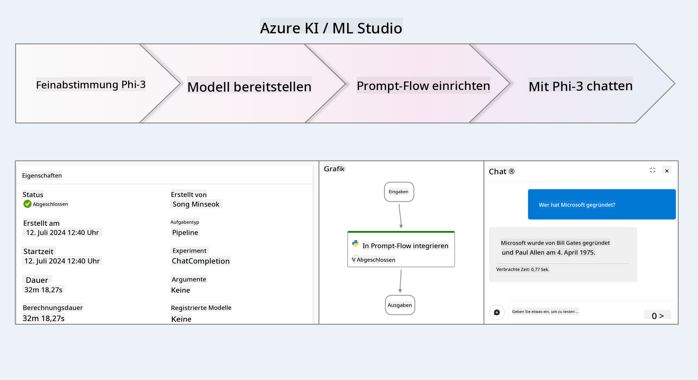

### Inhaltsverzeichnis

1. **[Szenario 1: Azure-Ressourcen einrichten und auf Feinabstimmung vorbereiten](../../../../../../md/02.Application/01.TextAndChat/Phi3)**
    - [Azure Machine Learning Workspace erstellen](../../../../../../md/02.Application/01.TextAndChat/Phi3)
    - [GPU-Kontingente im Azure-Abonnement anfordern](../../../../../../md/02.Application/01.TextAndChat/Phi3)
    - [Rollen-Zuweisung hinzufügen](../../../../../../md/02.Application/01.TextAndChat/Phi3)
    - [Projekt einrichten](../../../../../../md/02.Application/01.TextAndChat/Phi3)
    - [Datensatz für Feinabstimmung vorbereiten](../../../../../../md/02.Application/01.TextAndChat/Phi3)

1. **[Szenario 2: Phi-3-Modell feinabstimmen und in Azure Machine Learning Studio bereitstellen](../../../../../../md/02.Application/01.TextAndChat/Phi3)**
    - [Phi-3-Modell feinabstimmen](../../../../../../md/02.Application/01.TextAndChat/Phi3)
    - [Feinabgestimmtes Phi-3-Modell bereitstellen](../../../../../../md/02.Application/01.TextAndChat/Phi3)

1. **[Szenario 3: Integration mit Prompt Flow und Chat mit Ihrem benutzerdefinierten Modell in Azure AI Foundry](../../../../../../md/02.Application/01.TextAndChat/Phi3)**
    - [Benutzerdefiniertes Phi-3-Modell mit Prompt Flow integrieren](../../../../../../md/02.Application/01.TextAndChat/Phi3)
    - [Chat mit Ihrem benutzerdefinierten Phi-3-Modell](../../../../../../md/02.Application/01.TextAndChat/Phi3)

## Szenario 1: Azure-Ressourcen einrichten und auf Feinabstimmung vorbereiten

### Azure Machine Learning Workspace erstellen

1. Geben Sie *azure machine learning* in die **Suchleiste** oben auf der Portal-Seite ein und wählen Sie **Azure Machine Learning** aus den angezeigten Optionen aus.

    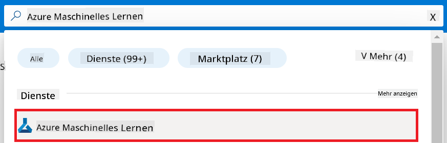

2. Wählen Sie im Navigationsmenü **+ Erstellen** aus.

3. Wählen Sie im Navigationsmenü **Neuen Workspace** aus.

    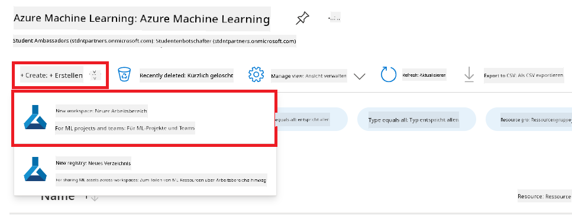

4. Führen Sie die folgenden Schritte aus:

    - Wählen Sie Ihr Azure **Abonnement** aus.
    - Wählen Sie die **Ressourcengruppe** aus (oder erstellen Sie bei Bedarf eine neue).
    - Geben Sie den **Workspace-Namen** ein. Dieser muss eindeutig sein.
    - Wählen Sie die **Region** aus, die Sie verwenden möchten.
    - Wählen Sie das **Speicherkonto** aus (oder erstellen Sie bei Bedarf ein neues).
    - Wählen Sie den **Key Vault** aus (oder erstellen Sie bei Bedarf einen neuen).
    - Wählen Sie die **Application Insights** aus (oder erstellen Sie bei Bedarf eine neue).
    - Wählen Sie die **Container-Registry** aus (oder erstellen Sie bei Bedarf eine neue).

    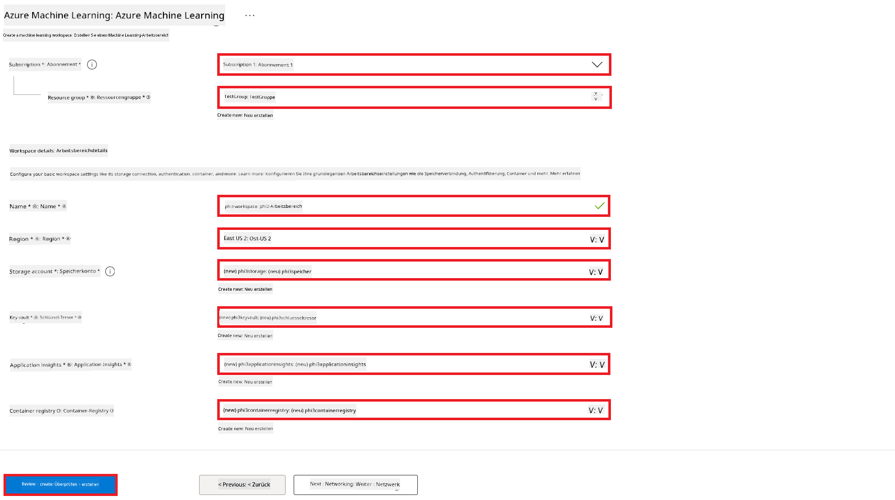

5. Wählen Sie **Überprüfen + erstellen**.

6. Wählen Sie **Erstellen**.

### GPU-Kontingente im Azure-Abonnement anfordern

In diesem Tutorial lernen Sie, wie Sie ein Phi-3-Modell mit GPUs feinabstimmen und bereitstellen. Für die Feinabstimmung verwenden Sie die GPU *Standard_NC24ads_A100_v4*, für die ein Kontingent beantragt werden muss. Für die Bereitstellung wird die GPU *Standard_NC6s_v3* verwendet, die ebenfalls ein Kontingent erfordert.

> [!NOTE]
>
> Nur Pay-As-You-Go-Abonnements (der Standard-Abonnementtyp) sind für die GPU-Zuteilung berechtigt; Vorteil-Abonnements werden derzeit nicht unterstützt.
>

1. Besuchen Sie [Azure ML Studio](https://ml.azure.com/home?wt.mc_id=studentamb_279723).

1. Führen Sie die folgenden Schritte aus, um das Kontingent für *Standard NCADSA100v4 Family* anzufordern:

    - Wählen Sie im linken Menü **Kontingent** aus.
    - Wählen Sie die **Virtuelle Maschinenfamilie** aus, z. B. **Standard NCADSA100v4 Family Cluster Dedicated vCPUs**, zu der die GPU *Standard_NC24ads_A100_v4* gehört.
    - Wählen Sie im Navigationsmenü **Kontingent anfordern** aus.

        

    - Geben Sie auf der Seite „Kontingent anfordern“ das gewünschte **Neue Kernlimit** ein, z. B. 24.
    - Wählen Sie **Absenden**, um das GPU-Kontingent anzufordern.

1. Führen Sie die folgenden Schritte aus, um das Kontingent für *Standard NCSv3 Family* anzufordern:

    - Wählen Sie im linken Menü **Kontingent** aus.
    - Wählen Sie die **Virtuelle Maschinenfamilie** aus, z. B. **Standard NCSv3 Family Cluster Dedicated vCPUs**, zu der die GPU *Standard_NC6s_v3* gehört.
    - Wählen Sie im Navigationsmenü **Kontingent anfordern** aus.
    - Geben Sie auf der Seite „Kontingent anfordern“ das gewünschte **Neue Kernlimit** ein, z. B. 24.
    - Wählen Sie **Absenden**, um das GPU-Kontingent anzufordern.

### Rollen-Zuweisung hinzufügen

Um Ihre Modelle feinabzustimmen und bereitzustellen, müssen Sie zunächst eine User Assigned Managed Identity (UAI) erstellen und ihr die entsprechenden Berechtigungen zuweisen. Diese UAI wird für die Authentifizierung während der Bereitstellung verwendet.

#### User Assigned Managed Identity (UAI) erstellen

1. Geben Sie *managed identities* in die **Suchleiste** oben auf der Portal-Seite ein und wählen Sie **Managed Identities** aus den angezeigten Optionen aus.

    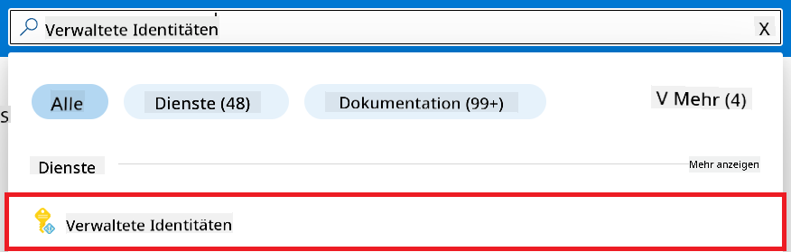

1. Wählen Sie **+ Erstellen**.

    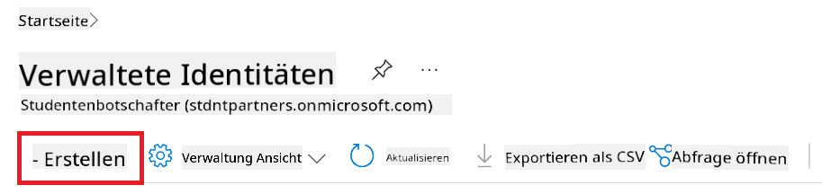

1. Führen Sie die folgenden Schritte aus:

    - Wählen Sie Ihr Azure **Abonnement** aus.
    - Wählen Sie die **Ressourcengruppe** aus (oder erstellen Sie bei Bedarf eine neue).
    - Wählen Sie die **Region** aus, die Sie verwenden möchten.
    - Geben Sie den **Namen** ein. Dieser muss eindeutig sein.

    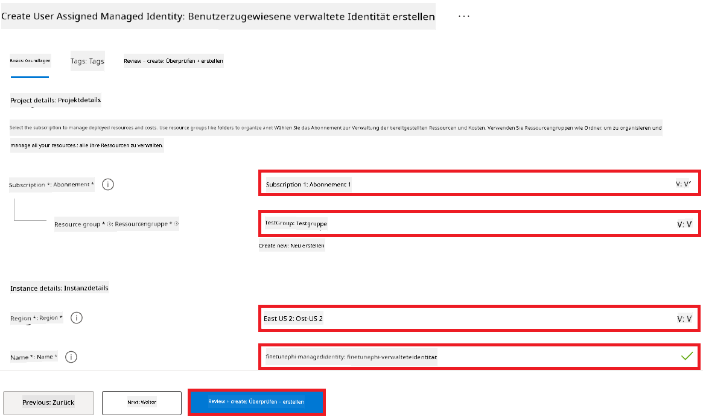

1. Wählen Sie **Überprüfen + erstellen**.

1. Wählen Sie **+ Erstellen**.

#### Contributor-Rollen-Zuweisung zur Managed Identity hinzufügen

1. Navigieren Sie zur Managed Identity-Ressource, die Sie erstellt haben.

1. Wählen Sie im linken Menü **Azure-Rollen-Zuweisungen** aus.

1. Wählen Sie im Navigationsmenü **+ Rollen-Zuweisung hinzufügen** aus.

1. Führen Sie auf der Seite „Rollen-Zuweisung hinzufügen“ die folgenden Schritte aus:
    - Wählen Sie als **Geltungsbereich** die **Ressourcengruppe** aus.
    - Wählen Sie Ihr Azure **Abonnement** aus.
    - Wählen Sie die **Ressourcengruppe** aus.
    - Wählen Sie die **Rolle** **Contributor** aus.

    

2. Wählen Sie **Speichern**.

#### Storage Blob Data Reader-Rollen-Zuweisung zur Managed Identity hinzufügen

1. Geben Sie *storage accounts* in die **Suchleiste** oben auf der Portal-Seite ein und wählen Sie **Storage accounts** aus den angezeigten Optionen aus.

    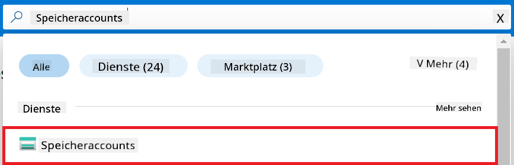

1. Wählen Sie das Speicherkonto aus, das mit dem Azure Machine Learning Workspace verknüpft ist, den Sie erstellt haben. Zum Beispiel *finetunephistorage*.

1. Führen Sie die folgenden Schritte aus, um zur Seite „Rollen-Zuweisung hinzufügen“ zu navigieren:

    - Navigieren Sie zum erstellten Azure Storage-Konto.
    - Wählen Sie im linken Menü **Zugriffssteuerung (IAM)** aus.
    - Wählen Sie im Navigationsmenü **+ Hinzufügen** aus.
    - Wählen Sie im Navigationsmenü **Rollen-Zuweisung hinzufügen** aus.

    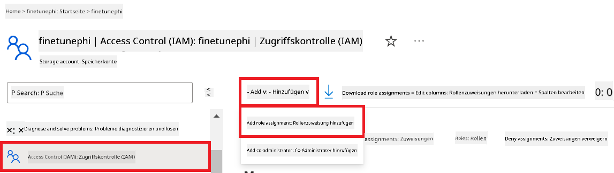

1. Führen Sie auf der Seite „Rollen-Zuweisung hinzufügen“ die folgenden Schritte aus:

    - Geben Sie auf der Rollenseite *Storage Blob Data Reader* in die **Suchleiste** ein und wählen Sie **Storage Blob Data Reader** aus den Optionen aus.
    - Wählen Sie auf der Rollenseite **Weiter** aus.
    - Wählen Sie auf der Mitgliederseite unter **Zugriff zuweisen an** die Option **Managed Identity**.
    - Wählen Sie auf der Mitgliederseite **+ Mitglieder auswählen** aus.
    - Wählen Sie auf der Seite „Managed Identities auswählen“ Ihr Azure **Abonnement** aus.
    - Wählen Sie auf der Seite „Managed Identities auswählen“ die **Managed Identity** aus.
    - Wählen Sie die zuvor erstellte Managed Identity aus, z. B. *finetunephi-managedidentity*.
    - Wählen Sie **Auswählen**.

    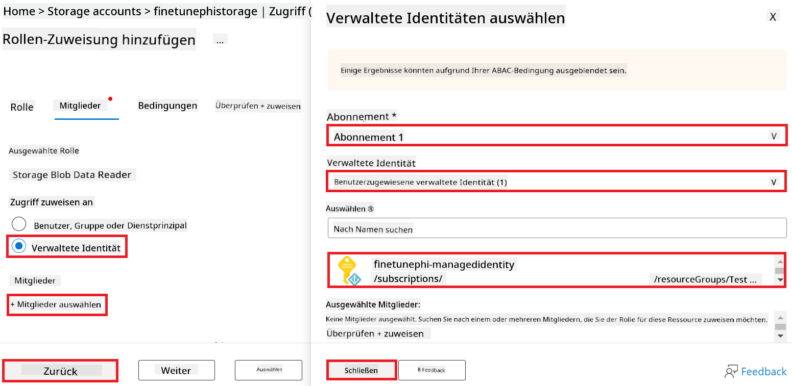

1. Wählen Sie **Überprüfen + zuweisen**.

#### AcrPull-Rollen-Zuweisung zur Managed Identity hinzufügen

1. Geben Sie *container registries* in die **Suchleiste** oben auf der Portal-Seite ein und wählen Sie **Container registries** aus den angezeigten Optionen aus.

    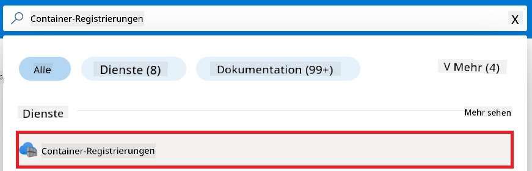

1. Wählen Sie die Container-Registry aus, die mit dem Azure Machine Learning Workspace verknüpft ist, z. B. *finetunephicontainerregistry*.

1. Führen Sie die folgenden Schritte aus, um zur Seite „Rollen-Zuweisung hinzufügen“ zu navigieren:

    - Wählen Sie im linken Menü **Zugriffssteuerung (IAM)** aus.
    - Wählen Sie im Navigationsmenü **+ Hinzufügen** aus.
    - Wählen Sie im Navigationsmenü **Rollen-Zuweisung hinzufügen** aus.

1. Führen Sie auf der Seite „Rollen-Zuweisung hinzufügen“ die folgenden Schritte aus:

    - Geben Sie auf der Rollenseite *AcrPull* in die **Suchleiste** ein und wählen Sie **AcrPull** aus den Optionen aus.
    - Wählen Sie auf der Rollenseite **Weiter** aus.
    - Wählen Sie auf der Mitgliederseite unter **Zugriff zuweisen an** die Option **Managed Identity**.
    - Wählen Sie auf der Mitgliederseite **+ Mitglieder auswählen** aus.
    - Wählen Sie auf der Seite „Managed Identities auswählen“ Ihr Azure **Abonnement** aus.
    - Wählen Sie auf der Seite „Managed Identities auswählen“ die **Managed Identity** aus.
    - Wählen Sie die zuvor erstellte Managed Identity aus, z. B. *finetunephi-managedidentity*.
    - Wählen Sie **Auswählen**.
    - Wählen Sie **Überprüfen + zuweisen**.

### Projekt einrichten

Um die für die Feinabstimmung benötigten Datensätze herunterzuladen, richten Sie eine lokale Umgebung ein.

In dieser Übung:

- Erstellen Sie einen Ordner, in dem Sie arbeiten.
- Erstellen Sie eine virtuelle Umgebung.
- Installieren Sie die erforderlichen Pakete.
- Erstellen Sie eine Datei *download_dataset.py*, um den Datensatz herunterzuladen.

#### Arbeitsordner erstellen

1. Öffnen Sie ein Terminalfenster und geben Sie den folgenden Befehl ein, um einen Ordner mit dem Namen *finetune-phi* im Standardpfad zu erstellen.

    ```console
    mkdir finetune-phi
    ```

2. Geben Sie im Terminal den folgenden Befehl ein, um in den Ordner *finetune-phi* zu wechseln, den Sie erstellt haben.

    ```console
    cd finetune-phi
    ```

#### Virtuelle Umgebung erstellen

1. Geben Sie im Terminal den folgenden Befehl ein, um eine virtuelle Umgebung mit dem Namen *.venv* zu erstellen.

    ```console
    python -m venv .venv
    ```

2. Geben Sie im Terminal den folgenden Befehl ein, um die virtuelle Umgebung zu aktivieren.

    ```console
    .venv\Scripts\activate.bat
    ```

> [!NOTE]
> Wenn alles funktioniert hat, sehen Sie *(.venv)* vor dem Eingabeaufforderungszeichen.

#### Erforderliche Pakete installieren

1. Geben Sie im Terminal die folgenden Befehle ein, um die benötigten Pakete zu installieren.

    ```console
    pip install datasets==2.19.1
    ```

#### `download_dataset.py` erstellen

> [!NOTE]
> Vollständige Ordnerstruktur:
>
> ```text
> └── YourUserName
> .    └── finetune-phi
> .        └── download_dataset.py
> ```

1. Öffnen Sie **Visual Studio Code**.

1. Wählen Sie in der Menüleiste **Datei**.

1. Wählen Sie **Ordner öffnen**.

1. Wählen Sie den Ordner *finetune-phi* aus, den Sie erstellt haben, z. B. *C:\Users\IhrBenutzername\finetune-phi*.

    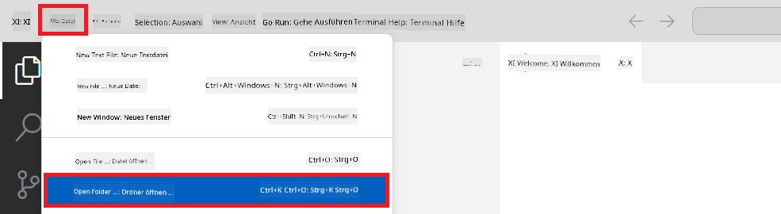

1. Klicken Sie im linken Bereich von Visual Studio Code mit der rechten Maustaste und wählen Sie **Neue Datei**, um eine Datei namens *download_dataset.py* zu erstellen.

    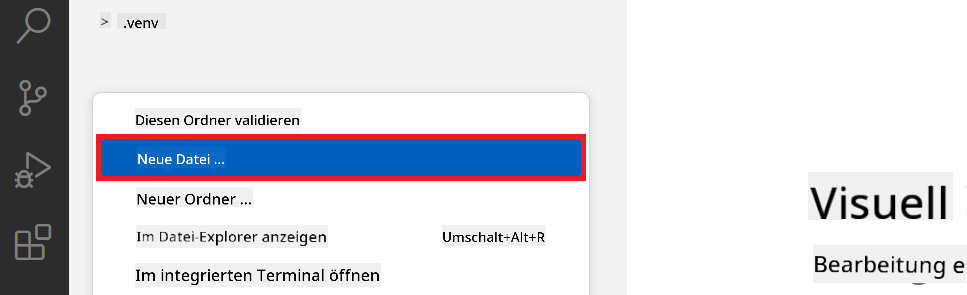

### Datensatz für Feinabstimmung vorbereiten

In dieser Übung führen Sie die Datei *download_dataset.py* aus, um die Datensätze *ultrachat_200k* in Ihre lokale Umgebung herunterzuladen. Diese Datensätze werden anschließend zur Feinabstimmung des Phi-3-Modells in Azure Machine Learning verwendet.

In dieser Übung:

- Fügen Sie Code zur Datei *download_dataset.py* hinzu, um die Datensätze herunterzuladen.
- Führen Sie die Datei *download_dataset.py* aus, um die Datensätze lokal herunterzuladen.

#### Datensatz mit *download_dataset.py* herunterladen

1. Öffnen Sie die Datei *download_dataset.py* in Visual Studio Code.

1. Fügen Sie den folgenden Code in die Datei *download_dataset.py* ein.

    ```python
    import json
    import os
    from datasets import load_dataset

    def load_and_split_dataset(dataset_name, config_name, split_ratio):
        """
        Load and split a dataset.
        """
        # Load the dataset with the specified name, configuration, and split ratio
        dataset = load_dataset(dataset_name, config_name, split=split_ratio)
        print(f"Original dataset size: {len(dataset)}")
        
        # Split the dataset into train and test sets (80% train, 20% test)
        split_dataset = dataset.train_test_split(test_size=0.2)
        print(f"Train dataset size: {len(split_dataset['train'])}")
        print(f"Test dataset size: {len(split_dataset['test'])}")
        
        return split_dataset

    def save_dataset_to_jsonl(dataset, filepath):
        """
        Save a dataset to a JSONL file.
        """
        # Create the directory if it does not exist
        os.makedirs(os.path.dirname(filepath), exist_ok=True)
        
        # Open the file in write mode
        with open(filepath, 'w', encoding='utf-8') as f:
            # Iterate over each record in the dataset
            for record in dataset:
                # Dump the record as a JSON object and write it to the file
                json.dump(record, f)
                # Write a newline character to separate records
                f.write('\n')
        
        print(f"Dataset saved to {filepath}")

    def main():
        """
        Main function to load, split, and save the dataset.
        """
        # Load and split the ULTRACHAT_200k dataset with a specific configuration and split ratio
        dataset = load_and_split_dataset("HuggingFaceH4/ultrachat_200k", 'default', 'train_sft[:1%]')
        
        # Extract the train and test datasets from the split
        train_dataset = dataset['train']
        test_dataset = dataset['test']

        # Save the train dataset to a JSONL file
        save_dataset_to_jsonl(train_dataset, "data/train_data.jsonl")
        
        # Save the test dataset to a separate JSONL file
        save_dataset_to_jsonl(test_dataset, "data/test_data.jsonl")

    if __name__ == "__main__":
        main()

    ```

1. Geben Sie im Terminal den folgenden Befehl ein, um das Skript auszuführen und den Datensatz lokal herunterzuladen.

    ```console
    python download_dataset.py
    ```

1. Überprüfen Sie, ob die Datensätze erfolgreich im lokalen Verzeichnis *finetune-phi/data* gespeichert wurden.

> [!NOTE]
>
> #### Hinweis zur Datensatzgröße und Feinabstimmungsdauer
>
> In diesem Tutorial verwenden Sie nur 1 % des Datensatzes (`split='train[:1%]'`). Dadurch wird die Datenmenge erheblich reduziert, was den Upload und die Feinabstimmung beschleunigt. Sie können den Prozentsatz anpassen, um das richtige Gleichgewicht zwischen Trainingsdauer und Modellleistung zu finden. Die Verwendung
1. Besuchen Sie [Azure ML Studio](https://ml.azure.com/home?wt.mc_id=studentamb_279723).

1. Wählen Sie im linken Seitenmenü **Compute** aus.

1. Wählen Sie im Navigationsmenü **Compute clusters** aus.

1. Wählen Sie **+ Neu**.

    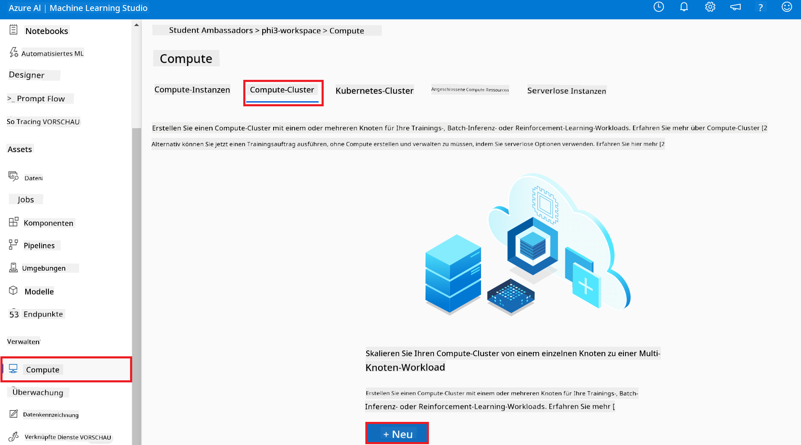

1. Führen Sie die folgenden Schritte aus:

    - Wählen Sie die **Region** aus, die Sie verwenden möchten.
    - Stellen Sie den **Virtual machine tier** auf **Dedicated** ein.
    - Wählen Sie den **Virtual machine type** auf **GPU**.
    - Stellen Sie den Filter für die **Virtual machine size** auf **Alle Optionen anzeigen** ein.
    - Wählen Sie die **Virtual machine size** auf **Standard_NC24ads_A100_v4**.

    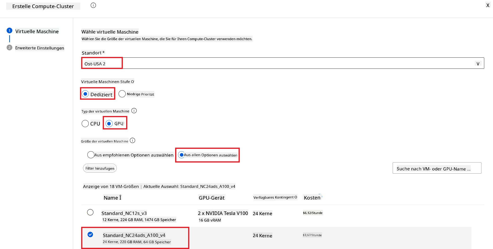

1. Wählen Sie **Weiter**.

1. Führen Sie die folgenden Schritte aus:

    - Geben Sie den **Compute name** ein. Er muss eindeutig sein.
    - Stellen Sie die **Minimum number of nodes** auf **0** ein.
    - Stellen Sie die **Maximum number of nodes** auf **1** ein.
    - Stellen Sie die **Idle seconds before scale down** auf **120** ein.

    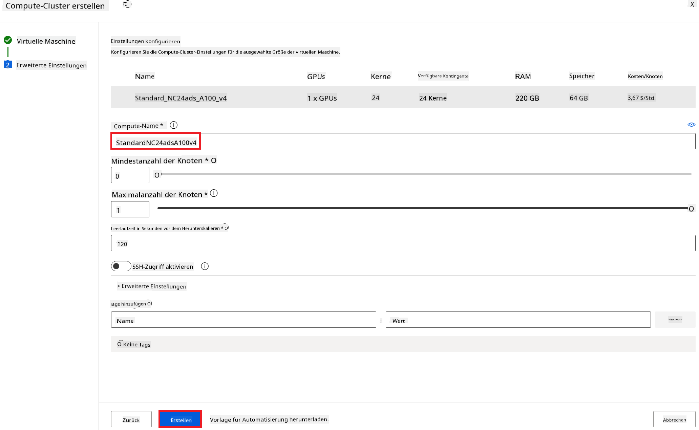

1. Wählen Sie **Erstellen**.

#### Feinabstimmung des Phi-3-Modells

1. Besuchen Sie [Azure ML Studio](https://ml.azure.com/home?wt.mc_id=studentamb_279723).

1. Wählen Sie den Azure Machine Learning-Arbeitsbereich aus, den Sie erstellt haben.

    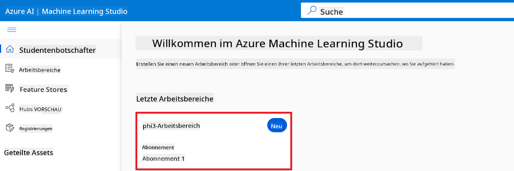

1. Führen Sie die folgenden Schritte aus:

    - Wählen Sie im linken Seitenmenü **Model catalog** aus.
    - Geben Sie *phi-3-mini-4k* in die **Suchleiste** ein und wählen Sie **Phi-3-mini-4k-instruct** aus den angezeigten Optionen aus.

    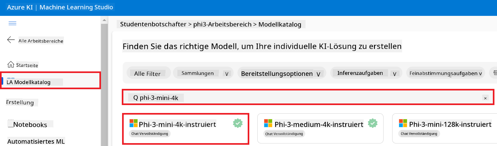

1. Wählen Sie im Navigationsmenü **Fine-tune** aus.

    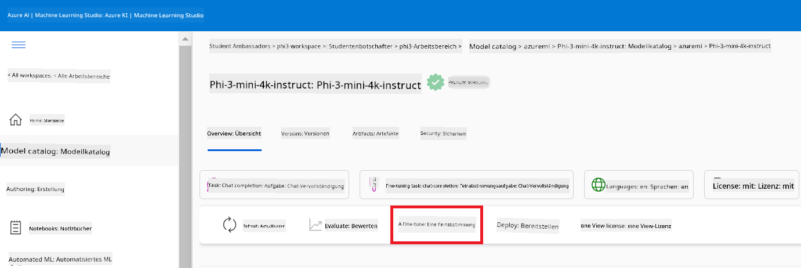

1. Führen Sie die folgenden Schritte aus:

    - Wählen Sie **Select task type** auf **Chat completion**.
    - Wählen Sie **+ Select data**, um **Traning data** hochzuladen.
    - Wählen Sie den Upload-Typ für Validierungsdaten auf **Provide different validation data**.
    - Wählen Sie **+ Select data**, um **Validation data** hochzuladen.

    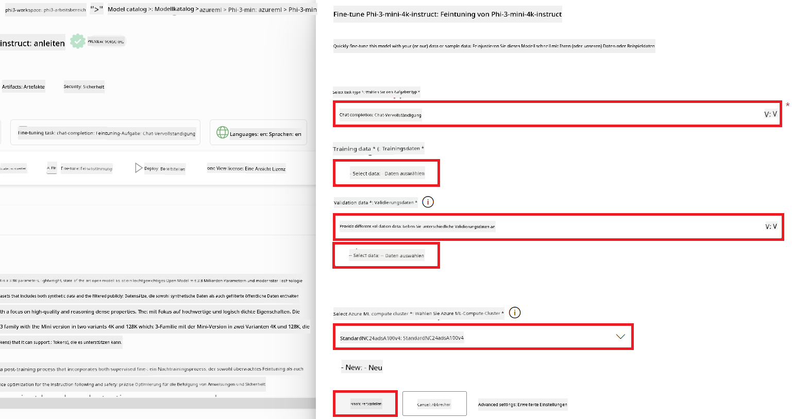

    > [!TIP]
    >
    > Sie können **Advanced settings** auswählen, um Konfigurationen wie **learning_rate** und **lr_scheduler_type** anzupassen, um den Feinabstimmungsprozess optimal auf Ihre Bedürfnisse abzustimmen.

1. Wählen Sie **Fertigstellen**.

1. In dieser Übung haben Sie das Phi-3-Modell erfolgreich feinabgestimmt mit Azure Machine Learning. Bitte beachten Sie, dass der Feinabstimmungsprozess einige Zeit in Anspruch nehmen kann. Nach dem Starten des Feinabstimmungsjobs müssen Sie warten, bis dieser abgeschlossen ist. Den Status des Feinabstimmungsjobs können Sie im Tab „Jobs“ auf der linken Seite Ihres Azure Machine Learning-Arbeitsbereichs überwachen. In der nächsten Folge werden Sie das feinabgestimmte Modell bereitstellen und in Prompt flow integrieren.

    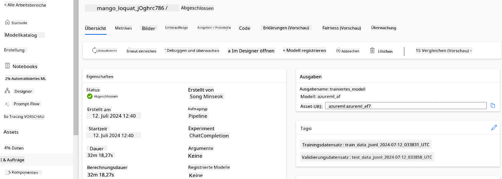

### Bereitstellung des feinabgestimmten Phi-3-Modells

Um das feinabgestimmte Phi-3-Modell in Prompt flow zu integrieren, müssen Sie das Modell bereitstellen, damit es für Echtzeit-Inferenz zugänglich ist. Dieser Prozess umfasst die Registrierung des Modells, das Erstellen eines Online-Endpunkts und die Bereitstellung des Modells.

In dieser Übung werden Sie:

- Das feinabgestimmte Modell im Azure Machine Learning-Arbeitsbereich registrieren.
- Einen Online-Endpunkt erstellen.
- Das registrierte feinabgestimmte Phi-3-Modell bereitstellen.

#### Registrierung des feinabgestimmten Modells

1. Besuchen Sie [Azure ML Studio](https://ml.azure.com/home?wt.mc_id=studentamb_279723).

1. Wählen Sie den Azure Machine Learning-Arbeitsbereich aus, den Sie erstellt haben.

    

1. Wählen Sie im linken Seitenmenü **Models** aus.
1. Wählen Sie **+ Register**.
1. Wählen Sie **From a job output**.

    

1. Wählen Sie den Job aus, den Sie erstellt haben.

    

1. Wählen Sie **Weiter**.

1. Stellen Sie den **Model type** auf **MLflow** ein.

1. Stellen Sie sicher, dass **Job output** ausgewählt ist; dies sollte automatisch der Fall sein.

    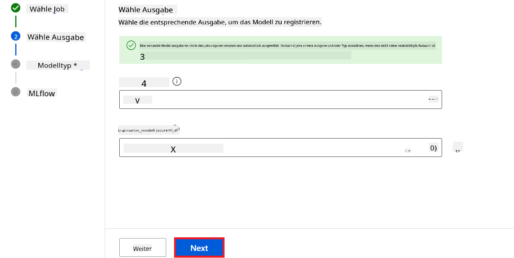

2. Wählen Sie **Weiter**.

3. Wählen Sie **Register**.

    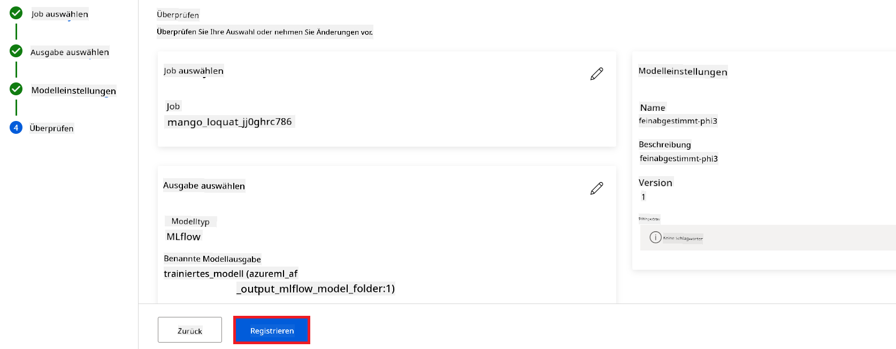

4. Sie können Ihr registriertes Modell einsehen, indem Sie im linken Seitenmenü zum Menü **Models** navigieren.

    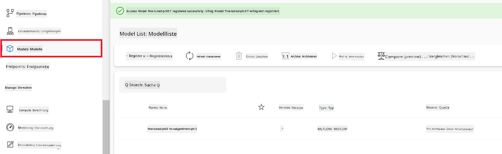

#### Bereitstellung des feinabgestimmten Modells

1. Navigieren Sie zu dem Azure Machine Learning-Arbeitsbereich, den Sie erstellt haben.

1. Wählen Sie im linken Seitenmenü **Endpoints** aus.

1. Wählen Sie im Navigationsmenü **Real-time endpoints** aus.

    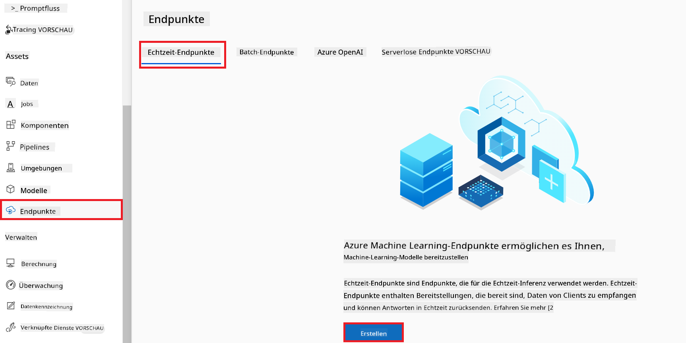

1. Wählen Sie **Erstellen**.

1. Wählen Sie das registrierte Modell aus, das Sie erstellt haben.

    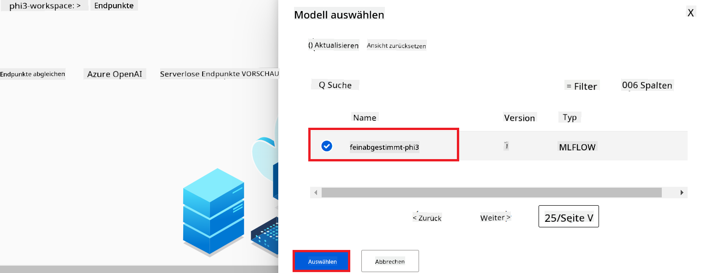

1. Wählen Sie **Auswählen**.

1. Führen Sie die folgenden Schritte aus:

    - Wählen Sie die **Virtual machine** auf *Standard_NC6s_v3*.
    - Wählen Sie die gewünschte **Instance count** aus, z. B. *1*.
    - Stellen Sie den **Endpoint** auf **Neu**, um einen Endpunkt zu erstellen.
    - Geben Sie den **Endpoint name** ein. Er muss eindeutig sein.
    - Geben Sie den **Deployment name** ein. Er muss eindeutig sein.

    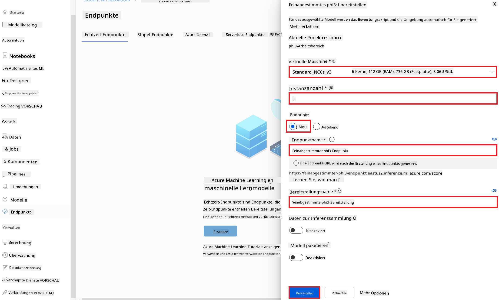

1. Wählen Sie **Bereitstellen**.

> [!WARNING]
> Um zusätzliche Kosten zu vermeiden, stellen Sie sicher, dass Sie den erstellten Endpunkt im Azure Machine Learning-Arbeitsbereich löschen.
>

#### Überprüfung des Bereitstellungsstatus im Azure Machine Learning-Arbeitsbereich

1. Navigieren Sie zu dem Azure Machine Learning-Arbeitsbereich, den Sie erstellt haben.

1. Wählen Sie im linken Seitenmenü **Endpoints** aus.

1. Wählen Sie den Endpunkt aus, den Sie erstellt haben.

    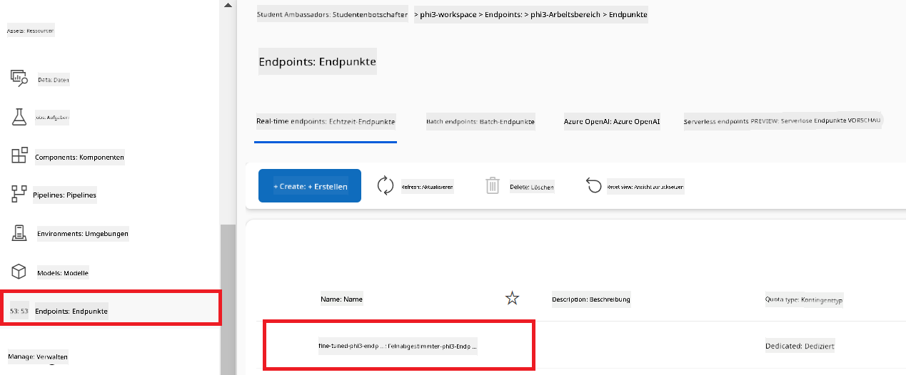

1. Auf dieser Seite können Sie die Endpunkte während des Bereitstellungsprozesses verwalten.

> [!NOTE]
> Sobald die Bereitstellung abgeschlossen ist, stellen Sie sicher, dass **Live traffic** auf **100%** eingestellt ist. Falls nicht, wählen Sie **Update traffic**, um die Verkehrseinstellungen anzupassen. Beachten Sie, dass Sie das Modell nicht testen können, wenn der Traffic auf 0% gesetzt ist.
>
> 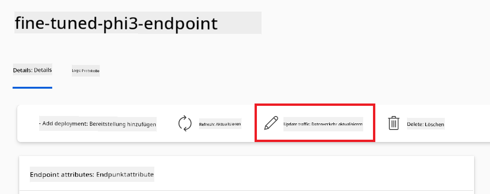
>

## Szenario 3: Integration mit Prompt flow und Chatten mit Ihrem benutzerdefinierten Modell in Azure AI Foundry

### Integration des benutzerdefinierten Phi-3-Modells mit Prompt flow

Nachdem Sie Ihr feinabgestimmtes Modell erfolgreich bereitgestellt haben, können Sie es nun mit Prompt Flow integrieren, um Ihr Modell in Echtzeitanwendungen zu nutzen und so verschiedene interaktive Aufgaben mit Ihrem benutzerdefinierten Phi-3-Modell zu ermöglichen.

In dieser Übung werden Sie:

- Azure AI Foundry Hub erstellen.
- Azure AI Foundry Projekt erstellen.
- Prompt flow erstellen.
- Eine benutzerdefinierte Verbindung für das feinabgestimmte Phi-3-Modell hinzufügen.
- Prompt flow einrichten, um mit Ihrem benutzerdefinierten Phi-3-Modell zu chatten.

> [!NOTE]
> Sie können die Integration mit Promptflow auch über Azure ML Studio durchführen. Der gleiche Integrationsprozess ist auf Azure ML Studio anwendbar.

#### Erstellen eines Azure AI Foundry Hub

Sie müssen einen Hub erstellen, bevor Sie ein Projekt anlegen. Ein Hub funktioniert wie eine Ressourcengruppe und ermöglicht es Ihnen, mehrere Projekte innerhalb von Azure AI Foundry zu organisieren und zu verwalten.

1. Besuchen Sie [Azure AI Foundry](https://ai.azure.com/?WT.mc_id=aiml-137032-kinfeylo).

1. Wählen Sie im linken Seitenmenü **All hubs** aus.

1. Wählen Sie im Navigationsmenü **+ New hub** aus.

    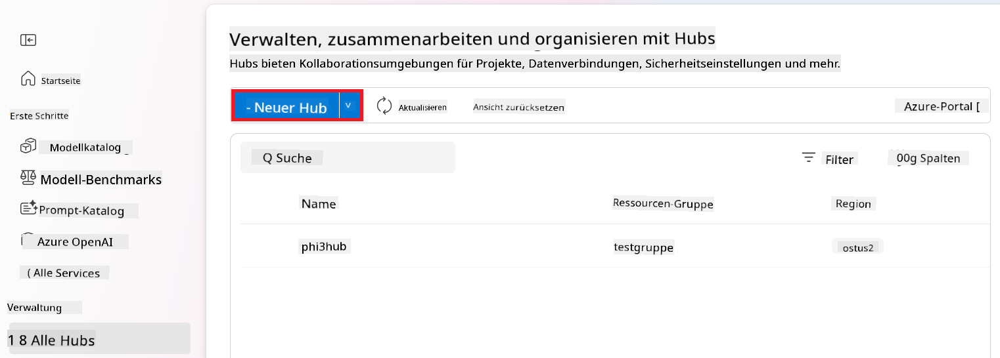

1. Führen Sie die folgenden Schritte aus:

    - Geben Sie den **Hub name** ein. Er muss eindeutig sein.
    - Wählen Sie Ihr Azure **Subscription** aus.
    - Wählen Sie die zu verwendende **Resource group** (erstellen Sie bei Bedarf eine neue).
    - Wählen Sie die **Location** aus, die Sie verwenden möchten.
    - Wählen Sie die zu verwendenden **Connect Azure AI Services** (erstellen Sie bei Bedarf eine neue).
    - Wählen Sie bei **Connect Azure AI Search** die Option **Skip connecting**.

    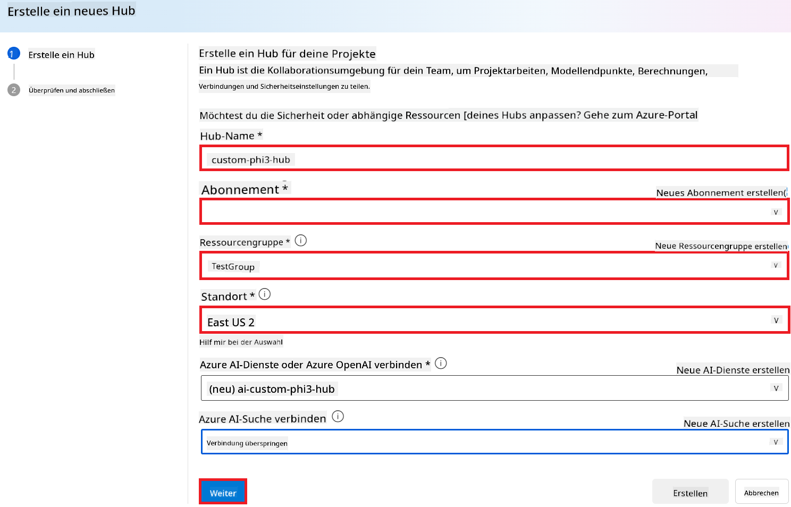

1. Wählen Sie **Weiter**.

#### Erstellen eines Azure AI Foundry Projekts

1. Wählen Sie im erstellten Hub im linken Seitenmenü **All projects** aus.

1. Wählen Sie im Navigationsmenü **+ New project** aus.

    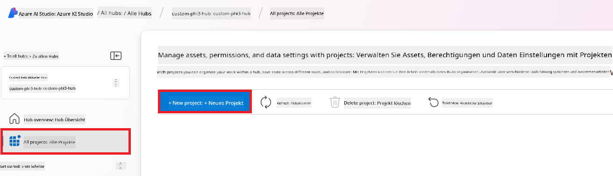

1. Geben Sie den **Project name** ein. Er muss eindeutig sein.

    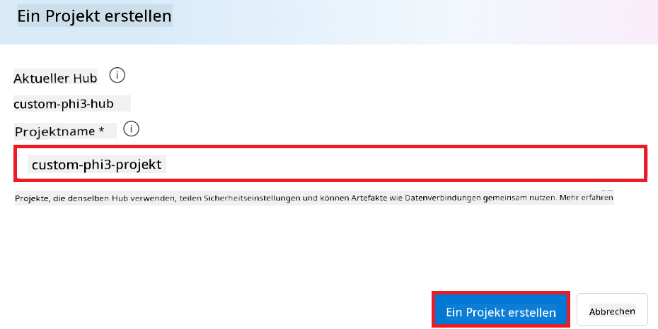

1. Wählen Sie **Create a project**.

#### Hinzufügen einer benutzerdefinierten Verbindung für das feinabgestimmte Phi-3-Modell

Um Ihr benutzerdefiniertes Phi-3-Modell mit Prompt flow zu integrieren, müssen Sie den Endpunkt und den Schlüssel des Modells in einer benutzerdefinierten Verbindung speichern. Diese Einrichtung stellt sicher, dass Prompt flow Zugriff auf Ihr benutzerdefiniertes Phi-3-Modell hat.

#### API-Schlüssel und Endpunkt-URI des feinabgestimmten Phi-3-Modells festlegen

1. Besuchen Sie [Azure ML Studio](https://ml.azure.com/home?WT.mc_id=aiml-137032-kinfeylo).

1. Navigieren Sie zu dem Azure Machine Learning-Arbeitsbereich, den Sie erstellt haben.

1. Wählen Sie im linken Seitenmenü **Endpoints** aus.

    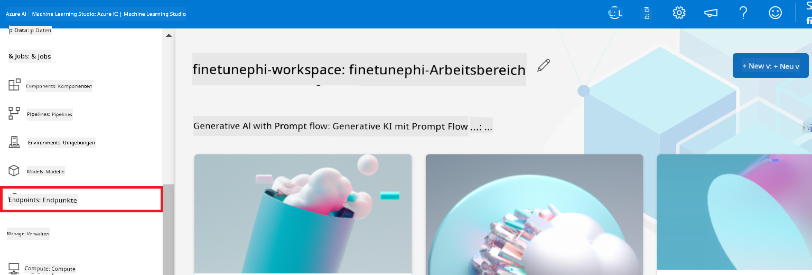

1. Wählen Sie den Endpunkt aus, den Sie erstellt haben.

    

1. Wählen Sie im Navigationsmenü **Consume** aus.

1. Kopieren Sie Ihren **REST endpoint** und den **Primary key**.
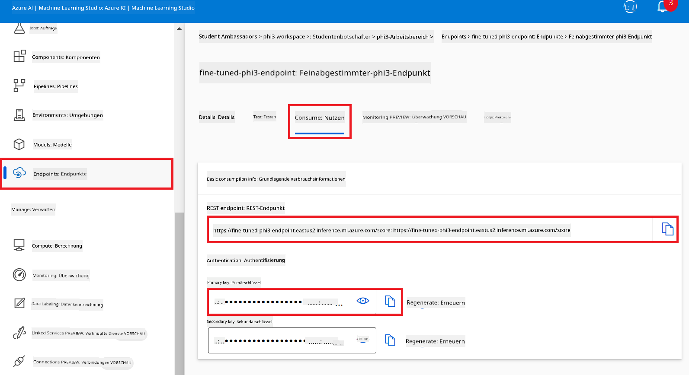

#### Füge die benutzerdefinierte Verbindung hinzu

1. Besuche [Azure AI Foundry](https://ai.azure.com/?WT.mc_id=aiml-137032-kinfeylo).

1. Navigiere zu dem Azure AI Foundry Projekt, das du erstellt hast.

1. Wähle im erstellten Projekt im linken Seitenmenü **Settings** aus.

1. Wähle **+ New connection**.

    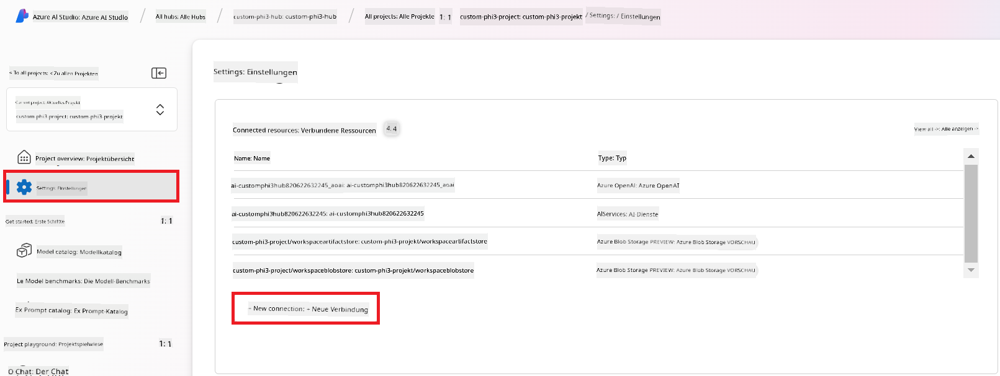

1. Wähle im Navigationsmenü **Custom keys** aus.

    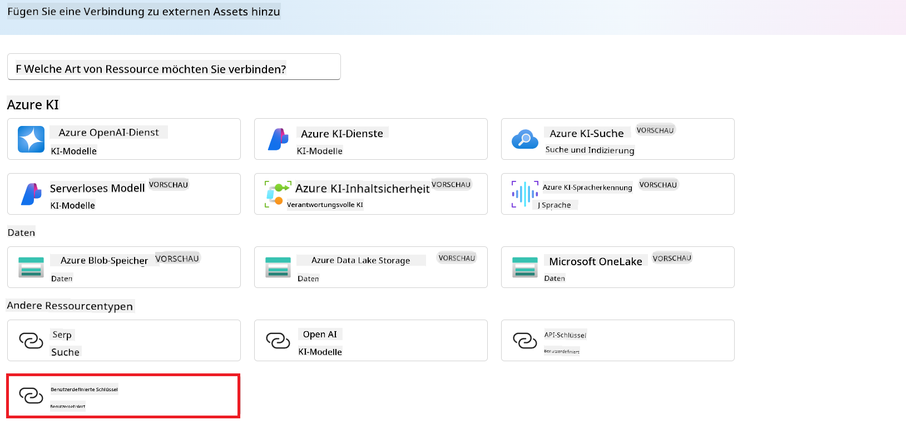

1. Führe die folgenden Schritte aus:

    - Wähle **+ Add key value pairs**.
    - Gib als Schlüsselname **endpoint** ein und füge den von Azure ML Studio kopierten Endpoint im Wertfeld ein.
    - Wähle erneut **+ Add key value pairs**.
    - Gib als Schlüsselname **key** ein und füge den von Azure ML Studio kopierten Schlüssel im Wertfeld ein.
    - Nach dem Hinzufügen der Schlüssel aktiviere **is secret**, um zu verhindern, dass der Schlüssel offengelegt wird.

    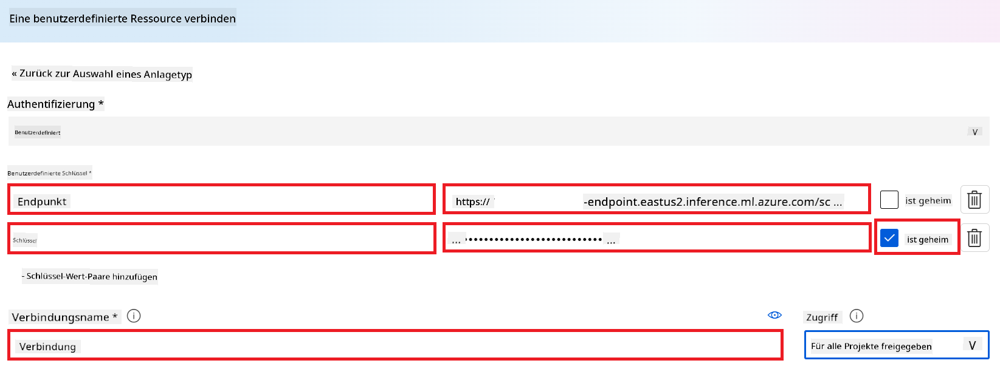

1. Wähle **Add connection**.

#### Erstelle Prompt flow

Du hast eine benutzerdefinierte Verbindung in Azure AI Foundry hinzugefügt. Nun erstellen wir einen Prompt flow mit den folgenden Schritten. Anschließend verbindest du diesen Prompt flow mit der benutzerdefinierten Verbindung, damit du das feinabgestimmte Modell innerhalb des Prompt flows verwenden kannst.

1. Navigiere zu dem Azure AI Foundry Projekt, das du erstellt hast.

1. Wähle im linken Seitenmenü **Prompt flow** aus.

1. Wähle im Navigationsmenü **+ Create**.

    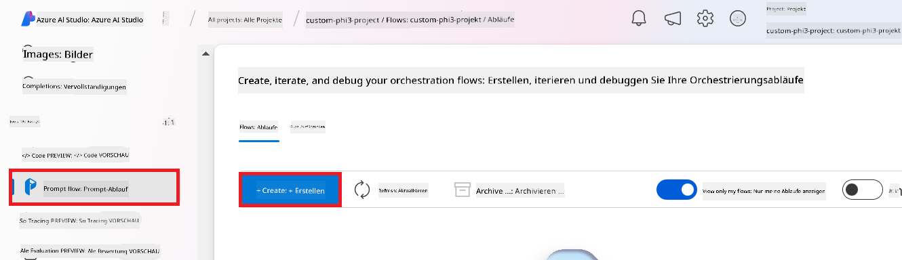

1. Wähle im Navigationsmenü **Chat flow**.

    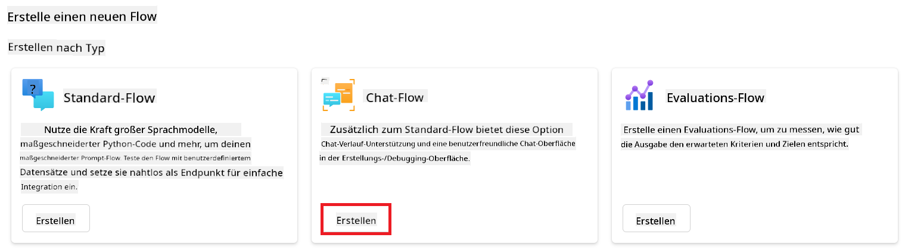

1. Gib den **Ordnernamen** ein, den du verwenden möchtest.

    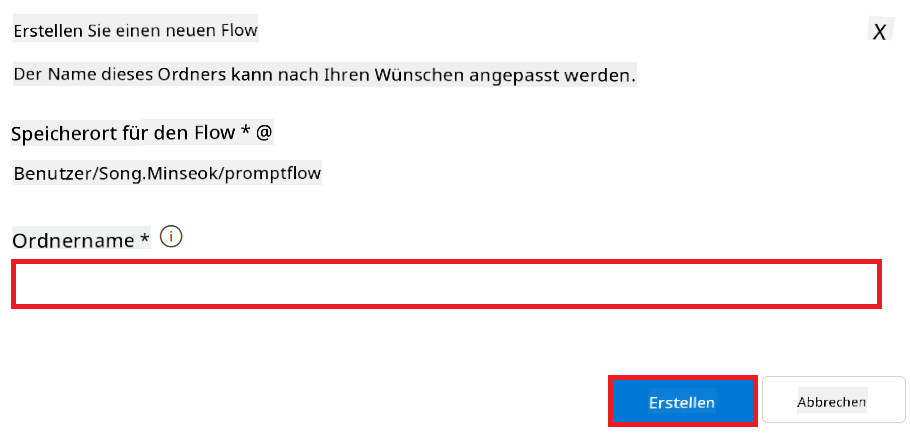

2. Wähle **Create**.

#### Richte Prompt flow ein, um mit deinem benutzerdefinierten Phi-3 Modell zu chatten

Du musst das feinabgestimmte Phi-3 Modell in einen Prompt flow integrieren. Der vorhandene Prompt flow ist jedoch nicht dafür ausgelegt. Deshalb musst du den Prompt flow neu gestalten, um die Integration des benutzerdefinierten Modells zu ermöglichen.

1. Führe im Prompt flow die folgenden Schritte aus, um den bestehenden Flow neu zu erstellen:

    - Wähle **Raw file mode**.
    - Lösche den gesamten vorhandenen Code in der Datei *flow.dag.yml*.
    - Füge den folgenden Code in die Datei *flow.dag.yml* ein.

        ```yml
        inputs:
          input_data:
            type: string
            default: "Who founded Microsoft?"

        outputs:
          answer:
            type: string
            reference: ${integrate_with_promptflow.output}

        nodes:
        - name: integrate_with_promptflow
          type: python
          source:
            type: code
            path: integrate_with_promptflow.py
          inputs:
            input_data: ${inputs.input_data}
        ```

    - Wähle **Save**.

    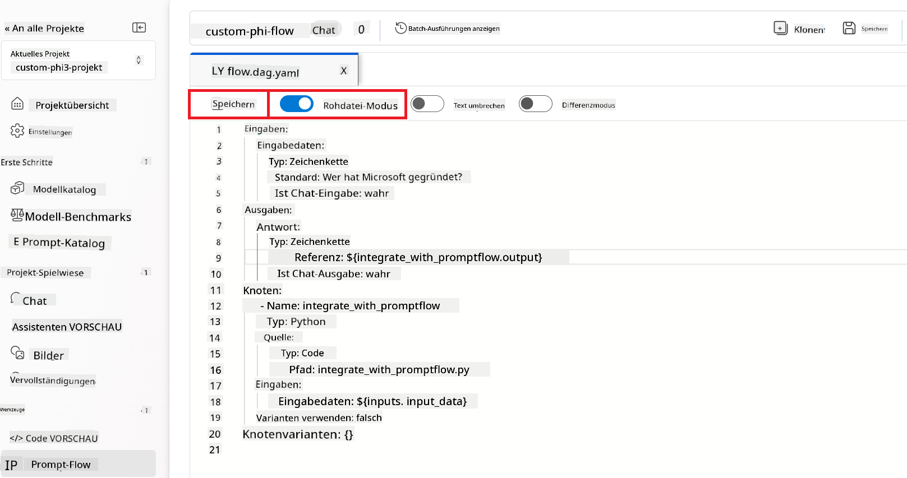

1. Füge den folgenden Code in die Datei *integrate_with_promptflow.py* ein, um das benutzerdefinierte Phi-3 Modell im Prompt flow zu verwenden.

    ```python
    import logging
    import requests
    from promptflow import tool
    from promptflow.connections import CustomConnection

    # Logging setup
    logging.basicConfig(
        format="%(asctime)s - %(levelname)s - %(name)s - %(message)s",
        datefmt="%Y-%m-%d %H:%M:%S",
        level=logging.DEBUG
    )
    logger = logging.getLogger(__name__)

    def query_phi3_model(input_data: str, connection: CustomConnection) -> str:
        """
        Send a request to the Phi-3 model endpoint with the given input data using Custom Connection.
        """

        # "connection" is the name of the Custom Connection, "endpoint", "key" are the keys in the Custom Connection
        endpoint_url = connection.endpoint
        api_key = connection.key

        headers = {
            "Content-Type": "application/json",
            "Authorization": f"Bearer {api_key}"
        }
        data = {
            "input_data": {
                "input_string": [
                    {"role": "user", "content": input_data}
                ],
                "parameters": {
                    "temperature": 0.7,
                    "max_new_tokens": 128
                }
            }
        }
        try:
            response = requests.post(endpoint_url, json=data, headers=headers)
            response.raise_for_status()
            
            # Log the full JSON response
            logger.debug(f"Full JSON response: {response.json()}")

            result = response.json()["output"]
            logger.info("Successfully received response from Azure ML Endpoint.")
            return result
        except requests.exceptions.RequestException as e:
            logger.error(f"Error querying Azure ML Endpoint: {e}")
            raise

    @tool
    def my_python_tool(input_data: str, connection: CustomConnection) -> str:
        """
        Tool function to process input data and query the Phi-3 model.
        """
        return query_phi3_model(input_data, connection)

    ```

    

> [!NOTE]
> Für detailliertere Informationen zur Nutzung von Prompt flow in Azure AI Foundry kannst du die Seite [Prompt flow in Azure AI Foundry](https://learn.microsoft.com/azure/ai-studio/how-to/prompt-flow) besuchen.

1. Wähle **Chat input**, **Chat output**, um den Chat mit deinem Modell zu aktivieren.

    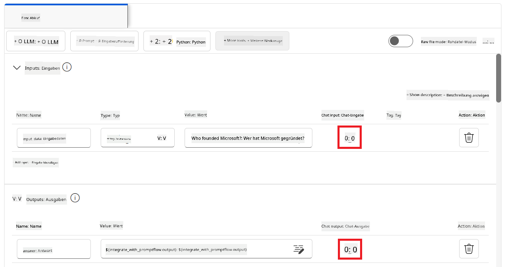

1. Jetzt bist du bereit, mit deinem benutzerdefinierten Phi-3 Modell zu chatten. Im nächsten Abschnitt lernst du, wie du Prompt flow startest und es nutzt, um mit deinem feinabgestimmten Phi-3 Modell zu kommunizieren.

> [!NOTE]
>
> Der neu erstellte Flow sollte wie im folgenden Bild aussehen:
>
> 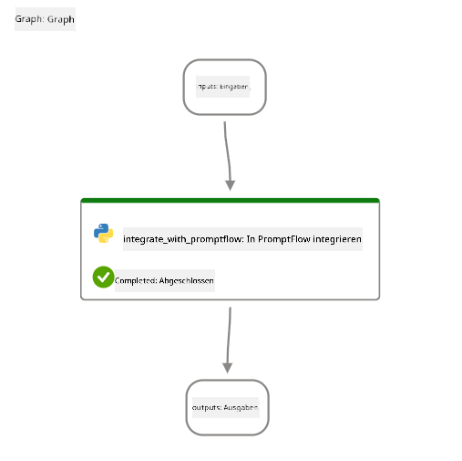
>

### Chatte mit deinem benutzerdefinierten Phi-3 Modell

Nachdem du dein benutzerdefiniertes Phi-3 Modell feinabgestimmt und in Prompt flow integriert hast, kannst du nun mit ihm interagieren. Diese Übung führt dich durch die Einrichtung und den Start eines Chats mit deinem Modell über Prompt flow. So kannst du die Fähigkeiten deines feinabgestimmten Phi-3 Modells für verschiedene Aufgaben und Gespräche optimal nutzen.

- Chatte mit deinem benutzerdefinierten Phi-3 Modell über Prompt flow.

#### Starte Prompt flow

1. Wähle **Start compute sessions**, um Prompt flow zu starten.

    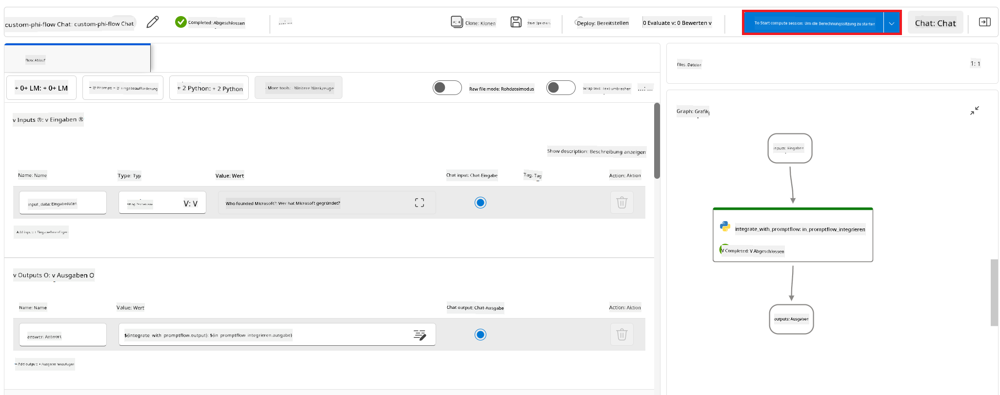

1. Wähle **Validate and parse input**, um die Parameter zu erneuern.

    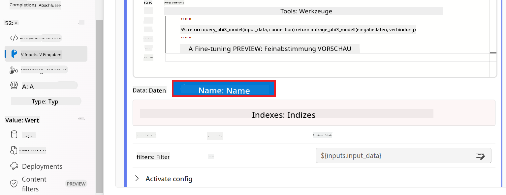

1. Wähle den **Value** der **connection** zu der benutzerdefinierten Verbindung, die du erstellt hast, z. B. *connection*.

    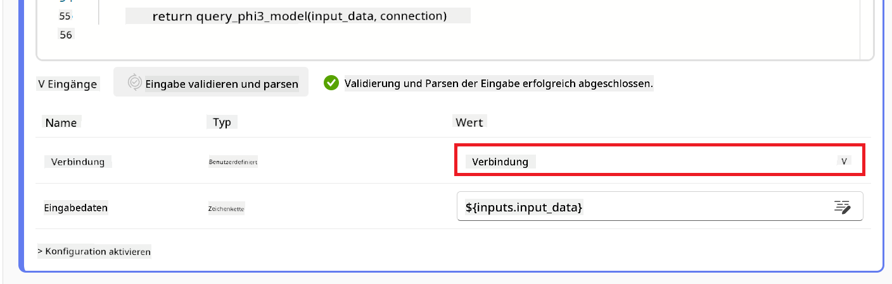

#### Chatte mit deinem benutzerdefinierten Modell

1. Wähle **Chat**.

    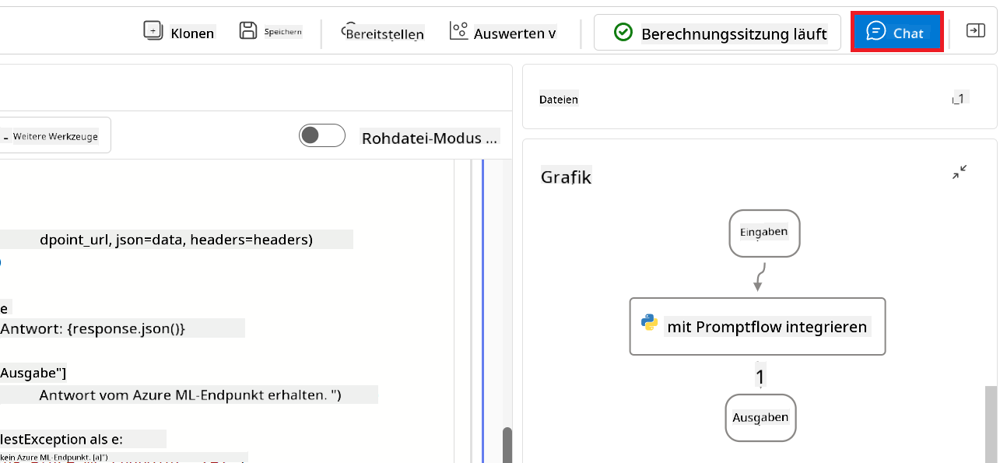

1. Hier ein Beispiel für die Ergebnisse: Du kannst jetzt mit deinem benutzerdefinierten Phi-3 Modell chatten. Es wird empfohlen, Fragen zu stellen, die auf den Daten basieren, mit denen das Modell feinabgestimmt wurde.

    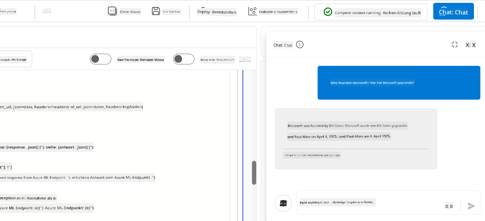

**Haftungsausschluss**:  
Dieses Dokument wurde mit dem KI-Übersetzungsdienst [Co-op Translator](https://github.com/Azure/co-op-translator) übersetzt. Obwohl wir uns um Genauigkeit bemühen, beachten Sie bitte, dass automatisierte Übersetzungen Fehler oder Ungenauigkeiten enthalten können. Das Originaldokument in seiner Originalsprache ist als maßgebliche Quelle zu betrachten. Für wichtige Informationen wird eine professionelle menschliche Übersetzung empfohlen. Wir übernehmen keine Haftung für Missverständnisse oder Fehlinterpretationen, die aus der Verwendung dieser Übersetzung entstehen.