<!--
CO_OP_TRANSLATOR_METADATA:
{
  "original_hash": "ecbd9179a21edbaafaf114d47f09f3e3",
  "translation_date": "2025-07-17T00:58:38+00:00",
  "source_file": "md/02.Application/01.TextAndChat/Phi3/E2E_Phi-3-FineTuning_PromptFlow_Integration_AIFoundry.md",
  "language_code": "de"
}
-->
# Feinabstimmung und Integration benutzerdefinierter Phi-3-Modelle mit Prompt Flow in Azure AI Foundry

Dieses End-to-End (E2E) Beispiel basiert auf der Anleitung "[Fine-Tune and Integrate Custom Phi-3 Models with Prompt Flow in Azure AI Foundry](https://techcommunity.microsoft.com/t5/educator-developer-blog/fine-tune-and-integrate-custom-phi-3-models-with-prompt-flow-in/ba-p/4191726?WT.mc_id=aiml-137032-kinfeylo)" aus der Microsoft Tech Community. Es stellt die Prozesse des Feinabstimmens, Bereitstellens und Integrierens benutzerdefinierter Phi-3-Modelle mit Prompt Flow in Azure AI Foundry vor.  
Im Gegensatz zum E2E-Beispiel "[Fine-Tune and Integrate Custom Phi-3 Models with Prompt Flow](./E2E_Phi-3-FineTuning_PromptFlow_Integration.md)", bei dem Code lokal ausgeführt wurde, konzentriert sich dieses Tutorial vollständig auf das Feinabstimmen und Integrieren Ihres Modells innerhalb des Azure AI / ML Studios.

## Überblick

In diesem E2E-Beispiel lernen Sie, wie Sie das Phi-3-Modell feinabstimmen und mit Prompt Flow in Azure AI Foundry integrieren. Durch die Nutzung von Azure AI / ML Studio erstellen Sie einen Workflow zum Bereitstellen und Verwenden benutzerdefinierter KI-Modelle. Dieses E2E-Beispiel ist in drei Szenarien unterteilt:

**Szenario 1: Azure-Ressourcen einrichten und Vorbereitung für die Feinabstimmung**

**Szenario 2: Feinabstimmung des Phi-3-Modells und Bereitstellung im Azure Machine Learning Studio**

**Szenario 3: Integration mit Prompt Flow und Chat mit Ihrem benutzerdefinierten Modell in Azure AI Foundry**

Hier ist eine Übersicht über dieses E2E-Beispiel.


### Inhaltsverzeichnis

1. **[Szenario 1: Azure-Ressourcen einrichten und Vorbereitung für die Feinabstimmung](../../../../../../md/02.Application/01.TextAndChat/Phi3)**
    - [Erstellen eines Azure Machine Learning Workspace](../../../../../../md/02.Application/01.TextAndChat/Phi3)
    - [Anfordern von GPU-Kontingenten im Azure-Abonnement](../../../../../../md/02.Application/01.TextAndChat/Phi3)
    - [Rollen-Zuweisung hinzufügen](../../../../../../md/02.Application/01.TextAndChat/Phi3)
    - [Projekt einrichten](../../../../../../md/02.Application/01.TextAndChat/Phi3)
    - [Datensatz für Feinabstimmung vorbereiten](../../../../../../md/02.Application/01.TextAndChat/Phi3)

1. **[Szenario 2: Feinabstimmung des Phi-3-Modells und Bereitstellung im Azure Machine Learning Studio](../../../../../../md/02.Application/01.TextAndChat/Phi3)**
    - [Phi-3-Modell feinabstimmen](../../../../../../md/02.Application/01.TextAndChat/Phi3)
    - [Feinabgestimmtes Phi-3-Modell bereitstellen](../../../../../../md/02.Application/01.TextAndChat/Phi3)

1. **[Szenario 3: Integration mit Prompt Flow und Chat mit Ihrem benutzerdefinierten Modell in Azure AI Foundry](../../../../../../md/02.Application/01.TextAndChat/Phi3)**
    - [Benutzerdefiniertes Phi-3-Modell mit Prompt Flow integrieren](../../../../../../md/02.Application/01.TextAndChat/Phi3)
    - [Chat mit Ihrem benutzerdefinierten Phi-3-Modell](../../../../../../md/02.Application/01.TextAndChat/Phi3)

## Szenario 1: Azure-Ressourcen einrichten und Vorbereitung für die Feinabstimmung

### Erstellen eines Azure Machine Learning Workspace

1. Geben Sie *azure machine learning* in die **Suchleiste** oben auf der Portal-Seite ein und wählen Sie **Azure Machine Learning** aus den angezeigten Optionen aus.

    

2. Wählen Sie im Navigationsmenü **+ Erstellen** aus.

3. Wählen Sie im Navigationsmenü **Neuen Workspace** aus.

    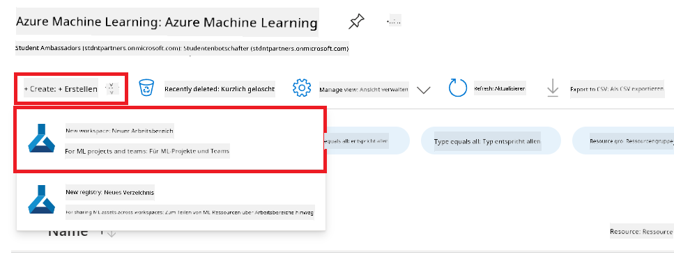

4. Führen Sie die folgenden Schritte aus:

    - Wählen Sie Ihr Azure **Abonnement** aus.
    - Wählen Sie die **Ressourcengruppe** aus, die Sie verwenden möchten (bei Bedarf eine neue erstellen).
    - Geben Sie den **Workspace-Namen** ein. Dieser muss eindeutig sein.
    - Wählen Sie die **Region** aus, die Sie verwenden möchten.
    - Wählen Sie das **Speicherkonto** aus (bei Bedarf ein neues erstellen).
    - Wählen Sie den **Key Vault** aus (bei Bedarf einen neuen erstellen).
    - Wählen Sie die **Application Insights** aus (bei Bedarf eine neue erstellen).
    - Wählen Sie die **Container-Registry** aus (bei Bedarf eine neue erstellen).

    

5. Wählen Sie **Überprüfen + Erstellen**.

6. Wählen Sie **Erstellen**.

### Anfordern von GPU-Kontingenten im Azure-Abonnement

In diesem Tutorial lernen Sie, wie Sie ein Phi-3-Modell mit GPUs feinabstimmen und bereitstellen. Für die Feinabstimmung verwenden Sie die GPU *Standard_NC24ads_A100_v4*, für die eine Kontingentanfrage erforderlich ist. Für die Bereitstellung verwenden Sie die GPU *Standard_NC6s_v3*, die ebenfalls eine Kontingentanfrage benötigt.

> [!NOTE]
>
> Nur Pay-As-You-Go-Abonnements (der Standard-Abonnementtyp) sind für die GPU-Zuweisung berechtigt; Vorteil-Abonnements werden derzeit nicht unterstützt.
>

1. Besuchen Sie [Azure ML Studio](https://ml.azure.com/home?wt.mc_id=studentamb_279723).

1. Führen Sie die folgenden Schritte aus, um das Kontingent für die *Standard NCADSA100v4 Family* anzufordern:

    - Wählen Sie im linken Tab **Kontingent** aus.
    - Wählen Sie die **Virtuelle Maschinenfamilie** aus. Zum Beispiel **Standard NCADSA100v4 Family Cluster Dedicated vCPUs**, die die GPU *Standard_NC24ads_A100_v4* enthält.
    - Wählen Sie im Navigationsmenü **Kontingent anfordern**.

        

    - Geben Sie auf der Seite „Kontingent anfordern“ das gewünschte **Neue Kernlimit** ein, z. B. 24.
    - Wählen Sie auf der Seite „Kontingent anfordern“ **Absenden**, um das GPU-Kontingent anzufordern.

1. Führen Sie die folgenden Schritte aus, um das Kontingent für die *Standard NCSv3 Family* anzufordern:

    - Wählen Sie im linken Tab **Kontingent** aus.
    - Wählen Sie die **Virtuelle Maschinenfamilie** aus. Zum Beispiel **Standard NCSv3 Family Cluster Dedicated vCPUs**, die die GPU *Standard_NC6s_v3* enthält.
    - Wählen Sie im Navigationsmenü **Kontingent anfordern**.
    - Geben Sie auf der Seite „Kontingent anfordern“ das gewünschte **Neue Kernlimit** ein, z. B. 24.
    - Wählen Sie auf der Seite „Kontingent anfordern“ **Absenden**, um das GPU-Kontingent anzufordern.

### Rollen-Zuweisung hinzufügen

Um Ihre Modelle feinabzustimmen und bereitzustellen, müssen Sie zunächst eine User Assigned Managed Identity (UAI) erstellen und ihr die entsprechenden Berechtigungen zuweisen. Diese UAI wird für die Authentifizierung während der Bereitstellung verwendet.

#### User Assigned Managed Identity (UAI) erstellen

1. Geben Sie *managed identities* in die **Suchleiste** oben auf der Portal-Seite ein und wählen Sie **Managed Identities** aus den angezeigten Optionen aus.

    

1. Wählen Sie **+ Erstellen**.

    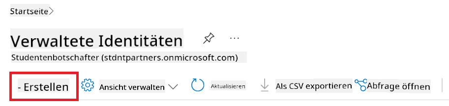

1. Führen Sie die folgenden Schritte aus:

    - Wählen Sie Ihr Azure **Abonnement** aus.
    - Wählen Sie die **Ressourcengruppe** aus (bei Bedarf eine neue erstellen).
    - Wählen Sie die **Region** aus, die Sie verwenden möchten.
    - Geben Sie den **Namen** ein. Dieser muss eindeutig sein.

    

1. Wählen Sie **Überprüfen + Erstellen**.

1. Wählen Sie **+ Erstellen**.

#### Contributor-Rollen-Zuweisung zur Managed Identity hinzufügen

1. Navigieren Sie zur Managed Identity-Ressource, die Sie erstellt haben.

1. Wählen Sie im linken Tab **Azure-Rollen-Zuweisungen** aus.

1. Wählen Sie im Navigationsmenü **+ Rollen-Zuweisung hinzufügen**.

1. Führen Sie auf der Seite „Rollen-Zuweisung hinzufügen“ die folgenden Schritte aus:
    - Wählen Sie den **Bereich** auf **Ressourcengruppe**.
    - Wählen Sie Ihr Azure **Abonnement**.
    - Wählen Sie die **Ressourcengruppe** aus.
    - Wählen Sie die **Rolle** **Contributor** aus.

    

2. Wählen Sie **Speichern**.

#### Storage Blob Data Reader-Rollen-Zuweisung zur Managed Identity hinzufügen

1. Geben Sie *storage accounts* in die **Suchleiste** oben auf der Portal-Seite ein und wählen Sie **Storage accounts** aus den angezeigten Optionen aus.

    

1. Wählen Sie das Speicherkonto aus, das mit dem Azure Machine Learning Workspace verknüpft ist, den Sie erstellt haben. Zum Beispiel *finetunephistorage*.

1. Führen Sie die folgenden Schritte aus, um zur Seite „Rollen-Zuweisung hinzufügen“ zu navigieren:

    - Navigieren Sie zum Azure Storage-Konto, das Sie erstellt haben.
    - Wählen Sie im linken Tab **Zugriffssteuerung (IAM)** aus.
    - Wählen Sie im Navigationsmenü **+ Hinzufügen**.
    - Wählen Sie im Navigationsmenü **Rollen-Zuweisung hinzufügen**.

    

1. Führen Sie auf der Seite „Rollen-Zuweisung hinzufügen“ die folgenden Schritte aus:

    - Geben Sie auf der Rollenseite *Storage Blob Data Reader* in die **Suchleiste** ein und wählen Sie **Storage Blob Data Reader** aus den angezeigten Optionen aus.
    - Wählen Sie auf der Rollenseite **Weiter**.
    - Wählen Sie auf der Mitgliederseite unter **Zugriff zuweisen an** die Option **Managed identity**.
    - Wählen Sie auf der Mitgliederseite **+ Mitglieder auswählen**.
    - Wählen Sie auf der Seite „Managed Identities auswählen“ Ihr Azure **Abonnement** aus.
    - Wählen Sie auf der Seite „Managed Identities auswählen“ die **Managed Identity** aus.
    - Wählen Sie die Managed Identity aus, die Sie erstellt haben, z. B. *finetunephi-managedidentity*.
    - Wählen Sie **Auswählen**.

    

1. Wählen Sie **Überprüfen + Zuweisen**.

#### AcrPull-Rollen-Zuweisung zur Managed Identity hinzufügen

1. Geben Sie *container registries* in die **Suchleiste** oben auf der Portal-Seite ein und wählen Sie **Container registries** aus den angezeigten Optionen aus.

    

1. Wählen Sie die Container-Registry aus, die mit dem Azure Machine Learning Workspace verknüpft ist. Zum Beispiel *finetunephicontainerregistry*.

1. Führen Sie die folgenden Schritte aus, um zur Seite „Rollen-Zuweisung hinzufügen“ zu navigieren:

    - Wählen Sie im linken Tab **Zugriffssteuerung (IAM)** aus.
    - Wählen Sie im Navigationsmenü **+ Hinzufügen**.
    - Wählen Sie im Navigationsmenü **Rollen-Zuweisung hinzufügen**.

1. Führen Sie auf der Seite „Rollen-Zuweisung hinzufügen“ die folgenden Schritte aus:

    - Geben Sie auf der Rollenseite *AcrPull* in die **Suchleiste** ein und wählen Sie **AcrPull** aus den angezeigten Optionen aus.
    - Wählen Sie auf der Rollenseite **Weiter**.
    - Wählen Sie auf der Mitgliederseite unter **Zugriff zuweisen an** die Option **Managed identity**.
    - Wählen Sie auf der Mitgliederseite **+ Mitglieder auswählen**.
    - Wählen Sie auf der Seite „Managed Identities auswählen“ Ihr Azure **Abonnement** aus.
    - Wählen Sie auf der Seite „Managed Identities auswählen“ die **Managed Identity** aus.
    - Wählen Sie die Managed Identity aus, die Sie erstellt haben, z. B. *finetunephi-managedidentity*.
    - Wählen Sie **Auswählen**.
    - Wählen Sie **Überprüfen + Zuweisen**.

### Projekt einrichten

Um die für die Feinabstimmung benötigten Datensätze herunterzuladen, richten Sie eine lokale Umgebung ein.

In dieser Übung werden Sie

- Einen Ordner erstellen, in dem Sie arbeiten.
- Eine virtuelle Umgebung erstellen.
- Die erforderlichen Pakete installieren.
- Eine Datei *download_dataset.py* erstellen, um den Datensatz herunterzuladen.

#### Einen Ordner erstellen, in dem Sie arbeiten

1. Öffnen Sie ein Terminalfenster und geben Sie den folgenden Befehl ein, um einen Ordner namens *finetune-phi* im Standardpfad zu erstellen.

    ```console
    mkdir finetune-phi
    ```

2. Geben Sie im Terminal den folgenden Befehl ein, um in den erstellten Ordner *finetune-phi* zu wechseln.
#### Erstellen einer virtuellen Umgebung

1. Geben Sie im Terminal den folgenden Befehl ein, um eine virtuelle Umgebung mit dem Namen *.venv* zu erstellen.

    ```console
    python -m venv .venv
    ```

2. Geben Sie im Terminal den folgenden Befehl ein, um die virtuelle Umgebung zu aktivieren.

    ```console
    .venv\Scripts\activate.bat
    ```


> [!NOTE]
> Wenn alles funktioniert hat, sollten Sie *(.venv)* vor der Eingabeaufforderung sehen.

#### Installieren der benötigten Pakete

1. Geben Sie im Terminal die folgenden Befehle ein, um die erforderlichen Pakete zu installieren.

    ```console
    pip install datasets==2.19.1
    ```

#### Erstellen von `download_dataset.py`

> [!NOTE]
> Vollständige Ordnerstruktur:
>
> ```text
> └── YourUserName
> .    └── finetune-phi
> .        └── download_dataset.py
> ```

1. Öffnen Sie **Visual Studio Code**.

1. Wählen Sie in der Menüleiste **Datei** aus.

1. Wählen Sie **Ordner öffnen**.

1. Wählen Sie den Ordner *finetune-phi* aus, den Sie erstellt haben. Dieser befindet sich unter *C:\Users\yourUserName\finetune-phi*.

    

1. Klicken Sie im linken Bereich von Visual Studio Code mit der rechten Maustaste und wählen Sie **Neue Datei**, um eine neue Datei mit dem Namen *download_dataset.py* zu erstellen.

    

### Vorbereitung des Datensatzes für das Fine-Tuning

In dieser Übung führen Sie die Datei *download_dataset.py* aus, um die *ultrachat_200k* Datensätze in Ihre lokale Umgebung herunterzuladen. Anschließend verwenden Sie diese Datensätze, um das Phi-3 Modell in Azure Machine Learning zu fine-tunen.

In dieser Übung werden Sie:

- Code zur Datei *download_dataset.py* hinzufügen, um die Datensätze herunterzuladen.
- Die Datei *download_dataset.py* ausführen, um die Datensätze lokal herunterzuladen.

#### Laden Sie Ihren Datensatz mit *download_dataset.py* herunter

1. Öffnen Sie die Datei *download_dataset.py* in Visual Studio Code.

1. Fügen Sie den folgenden Code in die Datei *download_dataset.py* ein.

    ```python
    import json
    import os
    from datasets import load_dataset

    def load_and_split_dataset(dataset_name, config_name, split_ratio):
        """
        Load and split a dataset.
        """
        # Load the dataset with the specified name, configuration, and split ratio
        dataset = load_dataset(dataset_name, config_name, split=split_ratio)
        print(f"Original dataset size: {len(dataset)}")
        
        # Split the dataset into train and test sets (80% train, 20% test)
        split_dataset = dataset.train_test_split(test_size=0.2)
        print(f"Train dataset size: {len(split_dataset['train'])}")
        print(f"Test dataset size: {len(split_dataset['test'])}")
        
        return split_dataset

    def save_dataset_to_jsonl(dataset, filepath):
        """
        Save a dataset to a JSONL file.
        """
        # Create the directory if it does not exist
        os.makedirs(os.path.dirname(filepath), exist_ok=True)
        
        # Open the file in write mode
        with open(filepath, 'w', encoding='utf-8') as f:
            # Iterate over each record in the dataset
            for record in dataset:
                # Dump the record as a JSON object and write it to the file
                json.dump(record, f)
                # Write a newline character to separate records
                f.write('\n')
        
        print(f"Dataset saved to {filepath}")

    def main():
        """
        Main function to load, split, and save the dataset.
        """
        # Load and split the ULTRACHAT_200k dataset with a specific configuration and split ratio
        dataset = load_and_split_dataset("HuggingFaceH4/ultrachat_200k", 'default', 'train_sft[:1%]')
        
        # Extract the train and test datasets from the split
        train_dataset = dataset['train']
        test_dataset = dataset['test']

        # Save the train dataset to a JSONL file
        save_dataset_to_jsonl(train_dataset, "data/train_data.jsonl")
        
        # Save the test dataset to a separate JSONL file
        save_dataset_to_jsonl(test_dataset, "data/test_data.jsonl")

    if __name__ == "__main__":
        main()

    ```

1. Geben Sie im Terminal den folgenden Befehl ein, um das Skript auszuführen und den Datensatz in Ihre lokale Umgebung herunterzuladen.

    ```console
    python download_dataset.py
    ```

1. Überprüfen Sie, ob die Datensätze erfolgreich im lokalen Verzeichnis *finetune-phi/data* gespeichert wurden.

> [!NOTE]
>
> #### Hinweis zur Datensatzgröße und Fine-Tuning-Dauer
>
> In diesem Tutorial verwenden Sie nur 1 % des Datensatzes (`split='train[:1%]'`). Dadurch wird die Datenmenge erheblich reduziert, was sowohl den Upload als auch den Fine-Tuning-Prozess beschleunigt. Sie können den Prozentsatz anpassen, um das richtige Gleichgewicht zwischen Trainingszeit und Modellleistung zu finden. Die Verwendung eines kleineren Teils des Datensatzes verkürzt die Fine-Tuning-Zeit und macht den Prozess für ein Tutorial besser handhabbar.

## Szenario 2: Fine-Tuning des Phi-3 Modells und Bereitstellung in Azure Machine Learning Studio

### Fine-Tuning des Phi-3 Modells

In dieser Übung führen Sie das Fine-Tuning des Phi-3 Modells in Azure Machine Learning Studio durch.

In dieser Übung werden Sie:

- Einen Compute-Cluster für das Fine-Tuning erstellen.
- Das Phi-3 Modell in Azure Machine Learning Studio fine-tunen.

#### Erstellen eines Compute-Clusters für das Fine-Tuning

1. Besuchen Sie [Azure ML Studio](https://ml.azure.com/home?wt.mc_id=studentamb_279723).

1. Wählen Sie im linken Menü **Compute** aus.

1. Wählen Sie im Navigationsmenü **Compute clusters**.

1. Klicken Sie auf **+ Neu**.

    

1. Führen Sie folgende Schritte aus:

    - Wählen Sie die gewünschte **Region** aus.
    - Stellen Sie den **Virtual machine tier** auf **Dedicated**.
    - Wählen Sie den **Virtual machine type** auf **GPU**.
    - Filtern Sie die **Virtual machine size** auf **Alle Optionen anzeigen**.
    - Wählen Sie die **Virtual machine size** *Standard_NC24ads_A100_v4* aus.

    

1. Klicken Sie auf **Weiter**.

1. Führen Sie folgende Schritte aus:

    - Geben Sie einen eindeutigen **Compute-Namen** ein.
    - Setzen Sie die **Minimale Anzahl an Knoten** auf **0**.
    - Setzen Sie die **Maximale Anzahl an Knoten** auf **1**.
    - Stellen Sie die **Leerlaufzeit vor Skalierung nach unten** auf **120 Sekunden**.

    

1. Klicken Sie auf **Erstellen**.

#### Fine-Tuning des Phi-3 Modells

1. Besuchen Sie [Azure ML Studio](https://ml.azure.com/home?wt.mc_id=studentamb_279723).

1. Wählen Sie den Azure Machine Learning Workspace aus, den Sie erstellt haben.

    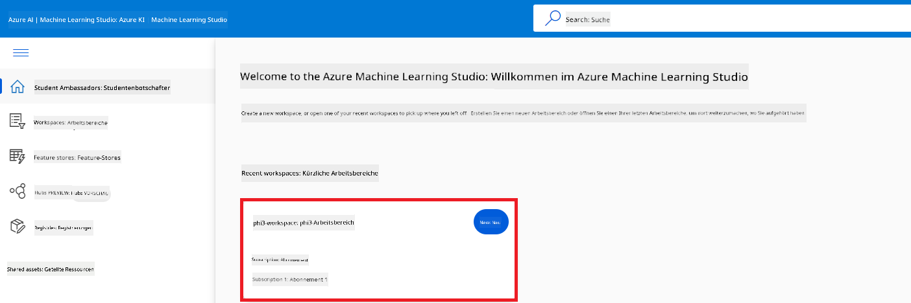

1. Führen Sie folgende Schritte aus:

    - Wählen Sie im linken Menü **Model catalog**.
    - Geben Sie *phi-3-mini-4k* in die **Suchleiste** ein und wählen Sie **Phi-3-mini-4k-instruct** aus den angezeigten Optionen aus.

    

1. Wählen Sie im Navigationsmenü **Fine-tune**.

    

1. Führen Sie folgende Schritte aus:

    - Wählen Sie bei **Select task type** die Option **Chat completion**.
    - Klicken Sie auf **+ Select data**, um die **Trainingsdaten** hochzuladen.
    - Wählen Sie bei der Validierungsdaten-Upload-Art **Provide different validation data**.
    - Klicken Sie auf **+ Select data**, um die **Validierungsdaten** hochzuladen.

    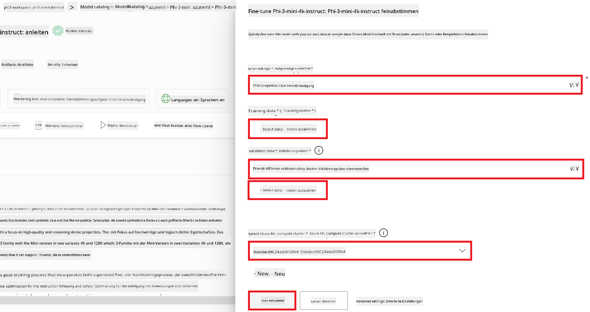

    > [!TIP]
    >
    > Unter **Advanced settings** können Sie Einstellungen wie **learning_rate** und **lr_scheduler_type** anpassen, um den Fine-Tuning-Prozess optimal auf Ihre Bedürfnisse abzustimmen.

1. Klicken Sie auf **Finish**.

1. In dieser Übung haben Sie das Phi-3 Modell erfolgreich mit Azure Machine Learning fine-getunt. Beachten Sie, dass der Fine-Tuning-Prozess einige Zeit in Anspruch nehmen kann. Nach dem Start des Fine-Tuning-Jobs müssen Sie warten, bis dieser abgeschlossen ist. Den Status des Jobs können Sie im Tab „Jobs“ im linken Bereich Ihres Azure Machine Learning Workspaces überwachen. Im nächsten Abschnitt werden Sie das fine-getunte Modell bereitstellen und in Prompt Flow integrieren.

    

### Bereitstellen des fine-getunten Phi-3 Modells

Um das fine-getunte Phi-3 Modell mit Prompt Flow zu integrieren, müssen Sie das Modell bereitstellen, damit es für Echtzeit-Inferenz zugänglich ist. Dieser Prozess umfasst die Registrierung des Modells, das Erstellen eines Online-Endpunkts und die Bereitstellung des Modells.

In dieser Übung werden Sie:

- Das fine-getunte Modell im Azure Machine Learning Workspace registrieren.
- Einen Online-Endpunkt erstellen.
- Das registrierte fine-getunte Phi-3 Modell bereitstellen.

#### Registrierung des fine-getunten Modells

1. Besuchen Sie [Azure ML Studio](https://ml.azure.com/home?wt.mc_id=studentamb_279723).

1. Wählen Sie den Azure Machine Learning Workspace aus, den Sie erstellt haben.

    

1. Wählen Sie im linken Menü **Models** aus.
1. Klicken Sie auf **+ Register**.
1. Wählen Sie **From a job output**.

    

1. Wählen Sie den Job aus, den Sie erstellt haben.

    

1. Klicken Sie auf **Weiter**.

1. Wählen Sie bei **Model type** die Option **MLflow**.

1. Stellen Sie sicher, dass **Job output** ausgewählt ist; dies sollte automatisch der Fall sein.

    

2. Klicken Sie auf **Weiter**.

3. Klicken Sie auf **Register**.

    

4. Ihr registriertes Modell können Sie im Menü **Models** im linken Bereich einsehen.

    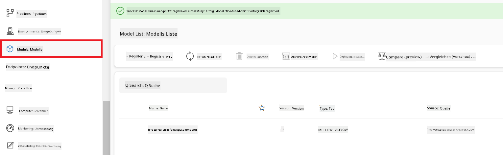

#### Bereitstellen des fine-getunten Modells

1. Navigieren Sie zu dem Azure Machine Learning Workspace, den Sie erstellt haben.

1. Wählen Sie im linken Menü **Endpoints** aus.

1. Wählen Sie im Navigationsmenü **Real-time endpoints**.

    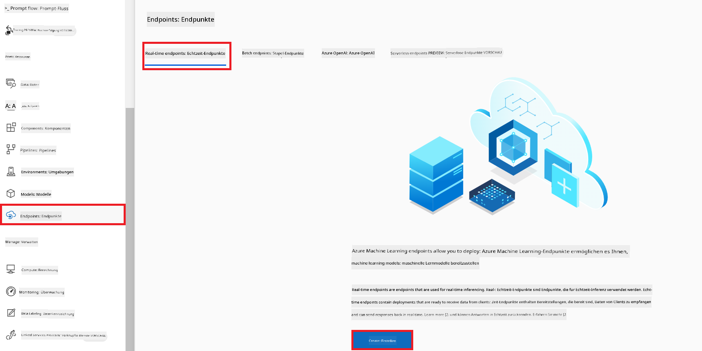

1. Klicken Sie auf **Create**.

1. Wählen Sie das registrierte Modell aus, das Sie erstellt haben.

    

1. Klicken Sie auf **Select**.

1. Führen Sie folgende Schritte aus:

    - Wählen Sie bei **Virtual machine** *Standard_NC6s_v3* aus.
    - Wählen Sie die gewünschte **Instanzanzahl** aus, z. B. *1*.
    - Wählen Sie bei **Endpoint** die Option **Neu**, um einen neuen Endpunkt zu erstellen.
    - Geben Sie einen eindeutigen **Endpoint-Namen** ein.
    - Geben Sie einen eindeutigen **Bereitstellungsnamen** ein.

    

1. Klicken Sie auf **Deploy**.

> [!WARNING]
> Um zusätzliche Kosten zu vermeiden, löschen Sie den erstellten Endpunkt im Azure Machine Learning Workspace, wenn Sie ihn nicht mehr benötigen.
>

#### Überprüfen des Bereitstellungsstatus im Azure Machine Learning Workspace

1. Navigieren Sie zu dem Azure Machine Learning Workspace, den Sie erstellt haben.

1. Wählen Sie im linken Menü **Endpoints** aus.

1. Wählen Sie den Endpunkt aus, den Sie erstellt haben.

    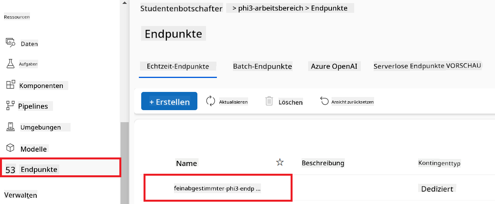

1. Auf dieser Seite können Sie die Endpunkte während des Bereitstellungsprozesses verwalten.

> [!NOTE]
> Sobald die Bereitstellung abgeschlossen ist, stellen Sie sicher, dass **Live traffic** auf **100 %** eingestellt ist. Falls nicht, wählen Sie **Update traffic**, um die Verkehrseinstellungen anzupassen. Beachten Sie, dass Sie das Modell nicht testen können, wenn der Traffic auf 0 % gesetzt ist.
>
> 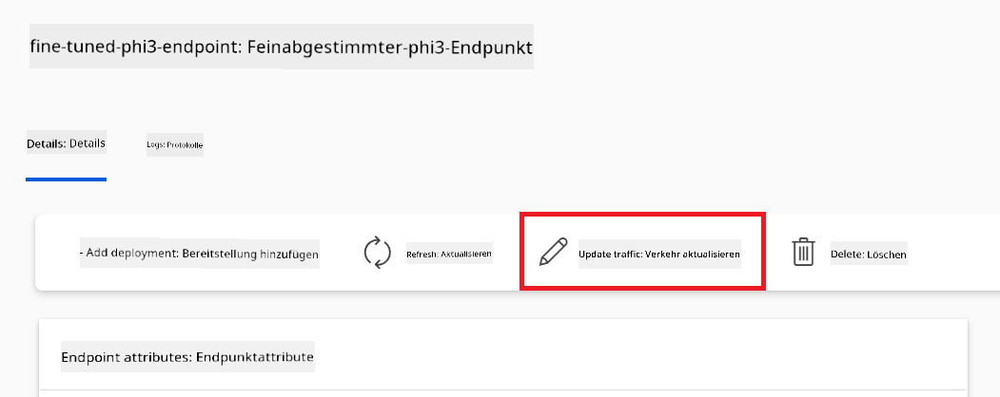
>

## Szenario 3: Integration mit Prompt Flow und Chat mit Ihrem benutzerdefinierten Modell in Azure AI Foundry

### Integration des benutzerdefinierten Phi-3 Modells mit Prompt Flow

Nachdem Sie Ihr fine-getuntes Modell erfolgreich bereitgestellt haben, können Sie es nun mit Prompt Flow integrieren, um Ihr Modell in Echtzeitanwendungen zu verwenden und so verschiedene interaktive Aufgaben mit Ihrem benutzerdefinierten Phi-3 Modell zu ermöglichen.

In dieser Übung werden Sie:

- Azure AI Foundry Hub erstellen.
- Azure AI Foundry Projekt erstellen.
- Prompt Flow erstellen.
- Eine benutzerdefinierte Verbindung für das fine-getunte Phi-3 Modell hinzufügen.
- Prompt Flow einrichten, um mit Ihrem benutzerdefinierten Phi-3 Modell zu chatten.
> [!NOTE]  
> Sie können auch eine Integration mit Promptflow über Azure ML Studio vornehmen. Der gleiche Integrationsprozess lässt sich auf Azure ML Studio anwenden.
#### Azure AI Foundry Hub erstellen

Bevor Sie ein Projekt erstellen, müssen Sie einen Hub anlegen. Ein Hub funktioniert ähnlich wie eine Ressourcengruppe und ermöglicht es Ihnen, mehrere Projekte innerhalb von Azure AI Foundry zu organisieren und zu verwalten.

1. Besuchen Sie [Azure AI Foundry](https://ai.azure.com/?WT.mc_id=aiml-137032-kinfeylo).

1. Wählen Sie im linken Seitenmenü **All hubs** aus.

1. Wählen Sie im Navigationsmenü **+ New hub** aus.

    

1. Führen Sie folgende Schritte aus:

    - Geben Sie einen **Hub name** ein. Dieser muss eindeutig sein.
    - Wählen Sie Ihr Azure **Subscription** aus.
    - Wählen Sie die **Resource group** aus, die Sie verwenden möchten (erstellen Sie bei Bedarf eine neue).
    - Wählen Sie den gewünschten **Location** aus.
    - Wählen Sie die **Connect Azure AI Services** aus, die Sie verwenden möchten (erstellen Sie bei Bedarf eine neue).
    - Wählen Sie bei **Connect Azure AI Search** die Option **Skip connecting**.

    

1. Klicken Sie auf **Next**.

#### Azure AI Foundry Projekt erstellen

1. Wählen Sie im erstellten Hub im linken Seitenmenü **All projects** aus.

1. Wählen Sie im Navigationsmenü **+ New project** aus.

    

1. Geben Sie einen **Project name** ein. Dieser muss eindeutig sein.

    

1. Klicken Sie auf **Create a project**.

#### Eine benutzerdefinierte Verbindung für das feinabgestimmte Phi-3 Modell hinzufügen

Um Ihr benutzerdefiniertes Phi-3 Modell in Prompt flow zu integrieren, müssen Sie den Endpunkt und den Schlüssel des Modells in einer benutzerdefinierten Verbindung speichern. So wird der Zugriff auf Ihr Phi-3 Modell in Prompt flow ermöglicht.

#### API-Schlüssel und Endpunkt-URI des feinabgestimmten Phi-3 Modells festlegen

1. Besuchen Sie [Azure ML Studio](https://ml.azure.com/home?WT.mc_id=aiml-137032-kinfeylo).

1. Navigieren Sie zum Azure Machine Learning Workspace, den Sie erstellt haben.

1. Wählen Sie im linken Seitenmenü **Endpoints** aus.

    

1. Wählen Sie den von Ihnen erstellten Endpunkt aus.

    

1. Wählen Sie im Navigationsmenü **Consume** aus.

1. Kopieren Sie Ihren **REST endpoint** und den **Primary key**.

    

#### Die benutzerdefinierte Verbindung hinzufügen

1. Besuchen Sie [Azure AI Foundry](https://ai.azure.com/?WT.mc_id=aiml-137032-kinfeylo).

1. Navigieren Sie zu dem Azure AI Foundry Projekt, das Sie erstellt haben.

1. Wählen Sie im Projekt im linken Seitenmenü **Settings** aus.

1. Wählen Sie **+ New connection**.

    

1. Wählen Sie im Navigationsmenü **Custom keys** aus.

    

1. Führen Sie folgende Schritte aus:

    - Wählen Sie **+ Add key value pairs**.
    - Geben Sie als Schlüsselname **endpoint** ein und fügen Sie den kopierten Endpunkt aus Azure ML Studio im Wertfeld ein.
    - Wählen Sie erneut **+ Add key value pairs**.
    - Geben Sie als Schlüsselname **key** ein und fügen Sie den kopierten Schlüssel aus Azure ML Studio im Wertfeld ein.
    - Aktivieren Sie nach dem Hinzufügen der Schlüssel die Option **is secret**, um zu verhindern, dass der Schlüssel sichtbar ist.

    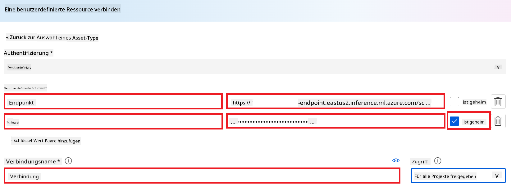

1. Klicken Sie auf **Add connection**.

#### Prompt flow erstellen

Sie haben eine benutzerdefinierte Verbindung in Azure AI Foundry hinzugefügt. Nun erstellen wir einen Prompt flow mit den folgenden Schritten. Anschließend verbinden Sie diesen Prompt flow mit der benutzerdefinierten Verbindung, damit Sie das feinabgestimmte Modell im Prompt flow verwenden können.

1. Navigieren Sie zu dem Azure AI Foundry Projekt, das Sie erstellt haben.

1. Wählen Sie im linken Seitenmenü **Prompt flow** aus.

1. Wählen Sie im Navigationsmenü **+ Create** aus.

    

1. Wählen Sie im Navigationsmenü **Chat flow** aus.

    

1. Geben Sie einen **Folder name** ein.

    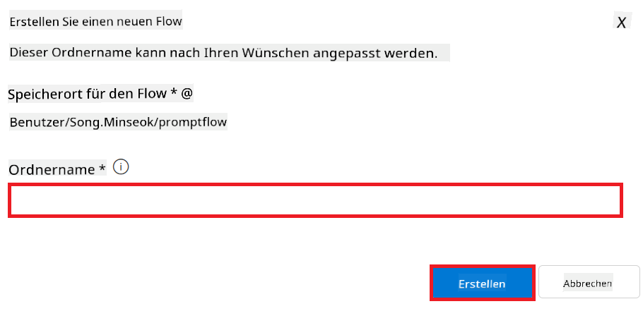

2. Klicken Sie auf **Create**.

#### Prompt flow einrichten, um mit Ihrem benutzerdefinierten Phi-3 Modell zu chatten

Sie müssen das feinabgestimmte Phi-3 Modell in einen Prompt flow integrieren. Der vorhandene Prompt flow ist dafür nicht ausgelegt. Daher müssen Sie den Prompt flow neu gestalten, um die Integration des benutzerdefinierten Modells zu ermöglichen.

1. Führen Sie im Prompt flow folgende Schritte aus, um den bestehenden Flow neu aufzubauen:

    - Wählen Sie **Raw file mode**.
    - Löschen Sie den gesamten vorhandenen Code in der Datei *flow.dag.yml*.
    - Fügen Sie den folgenden Code in die Datei *flow.dag.yml* ein.

        ```yml
        inputs:
          input_data:
            type: string
            default: "Who founded Microsoft?"

        outputs:
          answer:
            type: string
            reference: ${integrate_with_promptflow.output}

        nodes:
        - name: integrate_with_promptflow
          type: python
          source:
            type: code
            path: integrate_with_promptflow.py
          inputs:
            input_data: ${inputs.input_data}
        ```

    - Klicken Sie auf **Save**.

    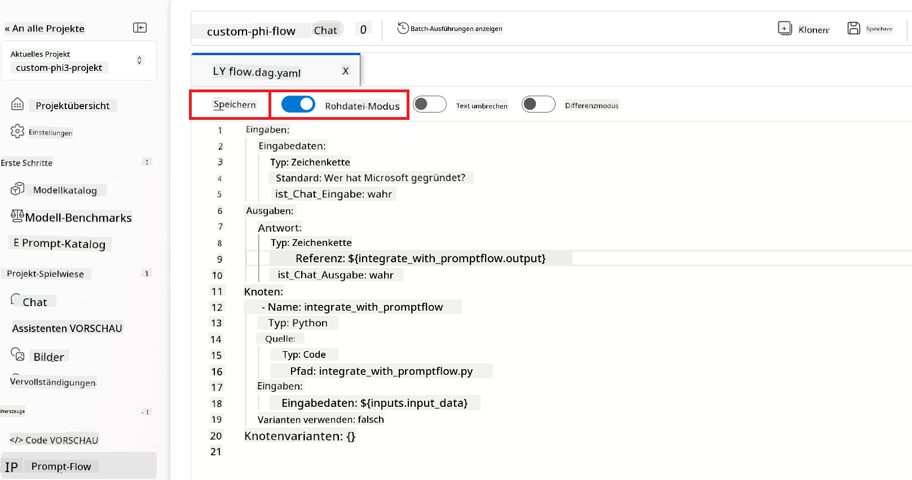

1. Fügen Sie den folgenden Code in die Datei *integrate_with_promptflow.py* ein, um das benutzerdefinierte Phi-3 Modell im Prompt flow zu verwenden.

    ```python
    import logging
    import requests
    from promptflow import tool
    from promptflow.connections import CustomConnection

    # Logging setup
    logging.basicConfig(
        format="%(asctime)s - %(levelname)s - %(name)s - %(message)s",
        datefmt="%Y-%m-%d %H:%M:%S",
        level=logging.DEBUG
    )
    logger = logging.getLogger(__name__)

    def query_phi3_model(input_data: str, connection: CustomConnection) -> str:
        """
        Send a request to the Phi-3 model endpoint with the given input data using Custom Connection.
        """

        # "connection" is the name of the Custom Connection, "endpoint", "key" are the keys in the Custom Connection
        endpoint_url = connection.endpoint
        api_key = connection.key

        headers = {
            "Content-Type": "application/json",
            "Authorization": f"Bearer {api_key}"
        }
        data = {
            "input_data": {
                "input_string": [
                    {"role": "user", "content": input_data}
                ],
                "parameters": {
                    "temperature": 0.7,
                    "max_new_tokens": 128
                }
            }
        }
        try:
            response = requests.post(endpoint_url, json=data, headers=headers)
            response.raise_for_status()
            
            # Log the full JSON response
            logger.debug(f"Full JSON response: {response.json()}")

            result = response.json()["output"]
            logger.info("Successfully received response from Azure ML Endpoint.")
            return result
        except requests.exceptions.RequestException as e:
            logger.error(f"Error querying Azure ML Endpoint: {e}")
            raise

    @tool
    def my_python_tool(input_data: str, connection: CustomConnection) -> str:
        """
        Tool function to process input data and query the Phi-3 model.
        """
        return query_phi3_model(input_data, connection)

    ```

    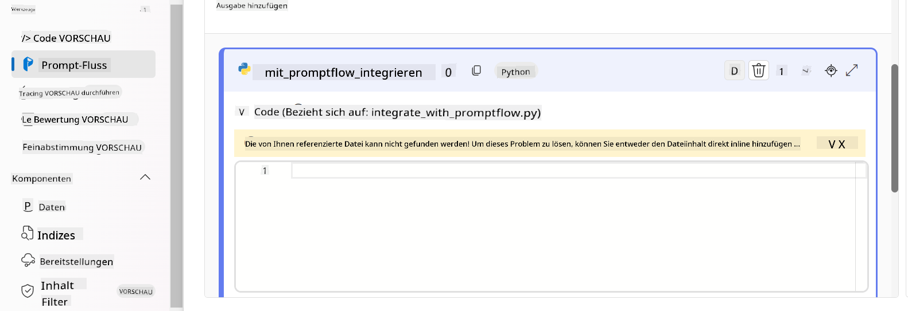

> [!NOTE]
> Für detailliertere Informationen zur Verwendung von Prompt flow in Azure AI Foundry können Sie [Prompt flow in Azure AI Foundry](https://learn.microsoft.com/azure/ai-studio/how-to/prompt-flow) konsultieren.

1. Aktivieren Sie **Chat input** und **Chat output**, um den Chat mit Ihrem Modell zu ermöglichen.

    

1. Nun sind Sie bereit, mit Ihrem benutzerdefinierten Phi-3 Modell zu chatten. Im nächsten Abschnitt erfahren Sie, wie Sie Prompt flow starten und es nutzen, um mit Ihrem feinabgestimmten Phi-3 Modell zu kommunizieren.

> [!NOTE]
>
> Der neu aufgebaute Flow sollte wie im folgenden Bild aussehen:
>
> 
>

### Chatten mit Ihrem benutzerdefinierten Phi-3 Modell

Nachdem Sie Ihr benutzerdefiniertes Phi-3 Modell feinabgestimmt und in Prompt flow integriert haben, können Sie nun mit ihm interagieren. Diese Übung führt Sie durch die Einrichtung und den Start eines Chats mit Ihrem Modell über Prompt flow. So können Sie die Möglichkeiten Ihres feinabgestimmten Phi-3 Modells für verschiedene Aufgaben und Gespräche optimal nutzen.

- Chatten Sie mit Ihrem benutzerdefinierten Phi-3 Modell über Prompt flow.

#### Prompt flow starten

1. Wählen Sie **Start compute sessions**, um Prompt flow zu starten.

    

1. Wählen Sie **Validate and parse input**, um die Parameter zu aktualisieren.

    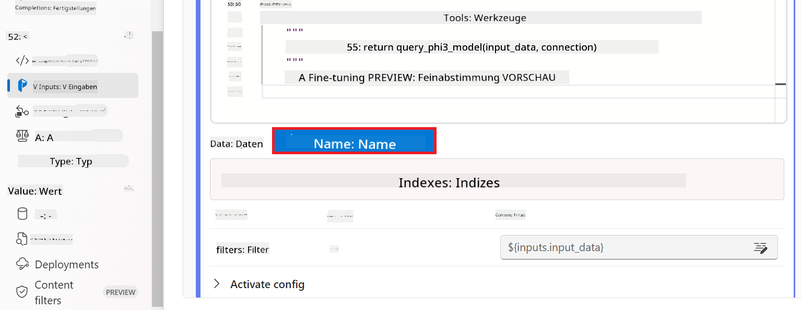

1. Wählen Sie den **Value** der **connection** aus, der Ihrer erstellten benutzerdefinierten Verbindung entspricht, z. B. *connection*.

    

#### Mit Ihrem benutzerdefinierten Modell chatten

1. Wählen Sie **Chat** aus.

    

1. Hier ein Beispiel für die Ergebnisse: Jetzt können Sie mit Ihrem benutzerdefinierten Phi-3 Modell chatten. Es wird empfohlen, Fragen zu stellen, die auf den für das Fine-Tuning verwendeten Daten basieren.

    

**Haftungsausschluss**:  
Dieses Dokument wurde mit dem KI-Übersetzungsdienst [Co-op Translator](https://github.com/Azure/co-op-translator) übersetzt. Obwohl wir uns um Genauigkeit bemühen, beachten Sie bitte, dass automatisierte Übersetzungen Fehler oder Ungenauigkeiten enthalten können. Das Originaldokument in seiner Ursprungssprache ist als maßgebliche Quelle zu betrachten. Für wichtige Informationen wird eine professionelle menschliche Übersetzung empfohlen. Wir übernehmen keine Haftung für Missverständnisse oder Fehlinterpretationen, die aus der Nutzung dieser Übersetzung entstehen.