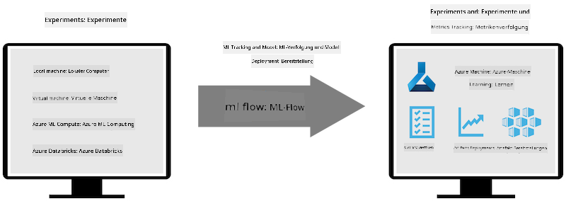

<!--
CO_OP_TRANSLATOR_METADATA:
{
  "original_hash": "f61c383bbf0c3dac97e43f833c258731",
  "translation_date": "2025-07-17T02:25:33+00:00",
  "source_file": "md/02.Application/01.TextAndChat/Phi3/E2E_Phi-3-MLflow.md",
  "language_code": "de"
}
-->
# MLflow

[MLflow](https://mlflow.org/) ist eine Open-Source-Plattform, die entwickelt wurde, um den gesamten Lebenszyklus von Machine Learning zu verwalten.


MLFlow wird verwendet, um den ML-Lebenszyklus zu steuern, einschließlich Experimentieren, Reproduzierbarkeit, Bereitstellung und einem zentralen Modell-Register. MLflow bietet derzeit vier Komponenten an.

- **MLflow Tracking:** Erfassen und Abfragen von Experimenten, Code, Datenkonfigurationen und Ergebnissen.
- **MLflow Projects:** Verpacken von Data-Science-Code in einem Format, das die Reproduzierbarkeit von Läufen auf jeder Plattform ermöglicht.
- **Mlflow Models:** Bereitstellung von Machine-Learning-Modellen in verschiedenen Serving-Umgebungen.
- **Model Registry:** Speichern, Kommentieren und Verwalten von Modellen in einem zentralen Repository.

Es umfasst Funktionen zum Nachverfolgen von Experimenten, Verpacken von Code in reproduzierbare Läufe sowie zum Teilen und Bereitstellen von Modellen. MLFlow ist in Databricks integriert und unterstützt eine Vielzahl von ML-Bibliotheken, wodurch es bibliotheksunabhängig ist. Es kann mit jeder Machine-Learning-Bibliothek und in jeder Programmiersprache verwendet werden, da es eine REST-API und CLI für die einfache Nutzung bereitstellt.



Wichtige Funktionen von MLFlow umfassen:

- **Experiment Tracking:** Erfassen und Vergleichen von Parametern und Ergebnissen.
- **Model Management:** Bereitstellung von Modellen auf verschiedenen Serving- und Inferenzplattformen.
- **Model Registry:** Gemeinsames Verwalten des Lebenszyklus von MLflow-Modellen, einschließlich Versionierung und Anmerkungen.
- **Projects:** Verpacken von ML-Code zum Teilen oder für den Produktionseinsatz.

MLFlow unterstützt außerdem den MLOps-Zyklus, der das Vorbereiten von Daten, Registrieren und Verwalten von Modellen, Verpacken von Modellen für die Ausführung, Bereitstellen von Diensten und Überwachen von Modellen umfasst. Ziel ist es, den Übergang von einem Prototyp zu einem produktiven Workflow zu vereinfachen, insbesondere in Cloud- und Edge-Umgebungen.

## E2E-Szenario – Erstellen eines Wrappers und Verwendung von Phi-3 als MLFlow-Modell

In diesem E2E-Beispiel zeigen wir zwei verschiedene Ansätze, um einen Wrapper um das kleine Sprachmodell Phi-3 (SLM) zu bauen und es anschließend als MLFlow-Modell lokal oder in der Cloud, z. B. im Azure Machine Learning Workspace, auszuführen.


| Projekt | Beschreibung | Speicherort |
| ------------ | ----------- | -------- |
| Transformer Pipeline | Die Transformer Pipeline ist die einfachste Möglichkeit, einen Wrapper zu erstellen, wenn Sie ein HuggingFace-Modell mit dem experimentellen Transformers-Flavour von MLFlow verwenden möchten. | [**TransformerPipeline.ipynb**](../../../../../../code/06.E2E/E2E_Phi-3-MLflow_TransformerPipeline.ipynb) |
| Custom Python Wrapper | Zum Zeitpunkt der Erstellung unterstützte die Transformer Pipeline keine MLFlow-Wrapper-Generierung für HuggingFace-Modelle im ONNX-Format, selbst mit dem experimentellen Optimum-Python-Paket. Für solche Fälle können Sie einen eigenen Python-Wrapper für MLFlow erstellen. | [**CustomPythonWrapper.ipynb**](../../../../../../code/06.E2E/E2E_Phi-3-MLflow_CustomPythonWrapper.ipynb) |

## Projekt: Transformer Pipeline

1. Sie benötigen die entsprechenden Python-Pakete von MLFlow und HuggingFace:

    ``` Python
    import mlflow
    import transformers
    ```

2. Als Nächstes sollten Sie eine Transformer Pipeline starten, indem Sie auf das Zielmodell Phi-3 im HuggingFace-Register verweisen. Wie aus der Modellkarte von _Phi-3-mini-4k-instruct_ ersichtlich ist, handelt es sich bei der Aufgabe um eine „Textgenerierung“:

    ``` Python
    pipeline = transformers.pipeline(
        task = "text-generation",
        model = "microsoft/Phi-3-mini-4k-instruct"
    )
    ```

3. Nun können Sie die Transformer Pipeline Ihres Phi-3-Modells im MLFlow-Format speichern und zusätzliche Details wie den Zielpfad für Artefakte, spezifische Modellkonfigurationen und den Typ der Inferenz-API angeben:

    ``` Python
    model_info = mlflow.transformers.log_model(
        transformers_model = pipeline,
        artifact_path = "phi3-mlflow-model",
        model_config = model_config,
        task = "llm/v1/chat"
    )
    ```

## Projekt: Custom Python Wrapper

1. Hier können wir Microsofts [ONNX Runtime generate() API](https://github.com/microsoft/onnxruntime-genai) für die Inferenz des ONNX-Modells sowie das Kodieren/Decodieren von Tokens nutzen. Sie müssen das Paket _onnxruntime_genai_ für Ihre Ziel-Compute-Umgebung auswählen, im folgenden Beispiel ist die CPU das Ziel:

    ``` Python
    import mlflow
    from mlflow.models import infer_signature
    import onnxruntime_genai as og
    ```

1. Unsere eigene Klasse implementiert zwei Methoden: _load_context()_, um das **ONNX-Modell** von Phi-3 Mini 4K Instruct, die **Generator-Parameter** und den **Tokenizer** zu initialisieren; und _predict()_, um Ausgabetokens für den gegebenen Prompt zu erzeugen:

    ``` Python
    class Phi3Model(mlflow.pyfunc.PythonModel):
        def load_context(self, context):
            # Retrieving model from the artifacts
            model_path = context.artifacts["phi3-mini-onnx"]
            model_options = {
                 "max_length": 300,
                 "temperature": 0.2,         
            }
        
            # Defining the model
            self.phi3_model = og.Model(model_path)
            self.params = og.GeneratorParams(self.phi3_model)
            self.params.set_search_options(**model_options)
            
            # Defining the tokenizer
            self.tokenizer = og.Tokenizer(self.phi3_model)
    
        def predict(self, context, model_input):
            # Retrieving prompt from the input
            prompt = model_input["prompt"][0]
            self.params.input_ids = self.tokenizer.encode(prompt)
    
            # Generating the model's response
            response = self.phi3_model.generate(self.params)
    
            return self.tokenizer.decode(response[0][len(self.params.input_ids):])
    ```

1. Sie können jetzt die Funktion _mlflow.pyfunc.log_model()_ verwenden, um einen benutzerdefinierten Python-Wrapper (im Pickle-Format) für das Phi-3-Modell zu erzeugen, zusammen mit dem ursprünglichen ONNX-Modell und den benötigten Abhängigkeiten:

    ``` Python
    model_info = mlflow.pyfunc.log_model(
        artifact_path = artifact_path,
        python_model = Phi3Model(),
        artifacts = {
            "phi3-mini-onnx": "cpu_and_mobile/cpu-int4-rtn-block-32-acc-level-4",
        },
        input_example = input_example,
        signature = infer_signature(input_example, ["Run"]),
        extra_pip_requirements = ["torch", "onnxruntime_genai", "numpy"],
    )
    ```

## Signaturen der generierten MLFlow-Modelle

1. In Schritt 3 des Transformer Pipeline-Projekts oben haben wir die Aufgabe des MLFlow-Modells auf „_llm/v1/chat_“ gesetzt. Diese Anweisung erzeugt einen API-Wrapper für das Modell, der mit der Chat-API von OpenAI kompatibel ist, wie unten gezeigt:

    ``` Python
    {inputs: 
      ['messages': Array({content: string (required), name: string (optional), role: string (required)}) (required), 'temperature': double (optional), 'max_tokens': long (optional), 'stop': Array(string) (optional), 'n': long (optional), 'stream': boolean (optional)],
    outputs: 
      ['id': string (required), 'object': string (required), 'created': long (required), 'model': string (required), 'choices': Array({finish_reason: string (required), index: long (required), message: {content: string (required), name: string (optional), role: string (required)} (required)}) (required), 'usage': {completion_tokens: long (required), prompt_tokens: long (required), total_tokens: long (required)} (required)],
    params: 
      None}
    ```

1. Dadurch können Sie Ihren Prompt im folgenden Format übermitteln:

    ``` Python
    messages = [{"role": "user", "content": "What is the capital of Spain?"}]
    ```

1. Anschließend können Sie eine OpenAI API-kompatible Nachbearbeitung verwenden, z. B. _response[0][‘choices’][0][‘message’][‘content’]_, um Ihre Ausgabe ansprechend zu formatieren, etwa so:

    ``` JSON
    Question: What is the capital of Spain?
    
    Answer: The capital of Spain is Madrid. It is the largest city in Spain and serves as the political, economic, and cultural center of the country. Madrid is located in the center of the Iberian Peninsula and is known for its rich history, art, and architecture, including the Royal Palace, the Prado Museum, and the Plaza Mayor.
    
    Usage: {'prompt_tokens': 11, 'completion_tokens': 73, 'total_tokens': 84}
    ```

1. In Schritt 3 des Custom Python Wrapper-Projekts oben erlauben wir dem MLFlow-Paket, die Signatur des Modells anhand eines Beispielinputs zu generieren. Die Signatur unseres MLFlow-Wrappers sieht dann so aus:

    ``` Python
    {inputs: 
      ['prompt': string (required)],
    outputs: 
      [string (required)],
    params: 
      None}
    ```

1. Unser Prompt müsste also den Schlüssel "prompt" im Dictionary enthalten, ähnlich wie hier:

    ``` Python
    {"prompt": "<|system|>You are a stand-up comedian.<|end|><|user|>Tell me a joke about atom<|end|><|assistant|>",}
    ```

1. Die Ausgabe des Modells wird dann im String-Format bereitgestellt:

    ``` JSON
    Alright, here's a little atom-related joke for you!
    
    Why don't electrons ever play hide and seek with protons?
    
    Because good luck finding them when they're always "sharing" their electrons!
    
    Remember, this is all in good fun, and we're just having a little atomic-level humor!
    ```

**Haftungsausschluss**:  
Dieses Dokument wurde mit dem KI-Übersetzungsdienst [Co-op Translator](https://github.com/Azure/co-op-translator) übersetzt. Obwohl wir uns um Genauigkeit bemühen, beachten Sie bitte, dass automatisierte Übersetzungen Fehler oder Ungenauigkeiten enthalten können. Das Originaldokument in seiner Ursprungssprache gilt als maßgebliche Quelle. Für wichtige Informationen wird eine professionelle menschliche Übersetzung empfohlen. Wir übernehmen keine Haftung für Missverständnisse oder Fehlinterpretationen, die aus der Nutzung dieser Übersetzung entstehen.