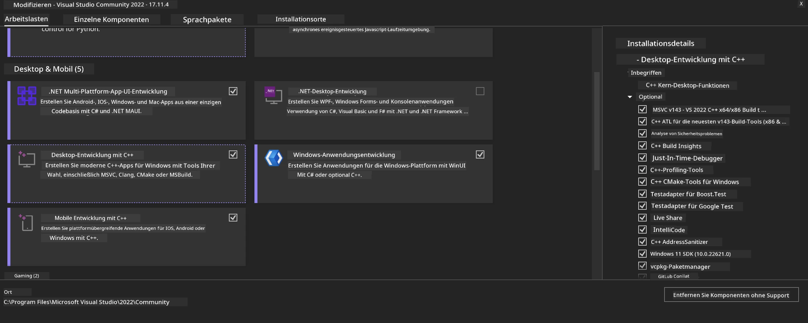
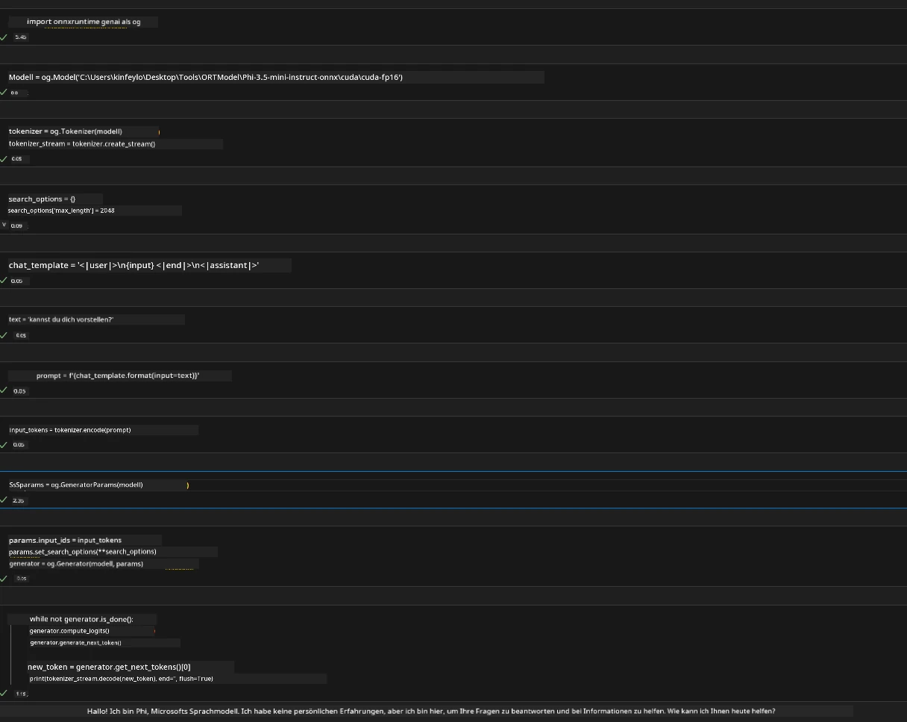
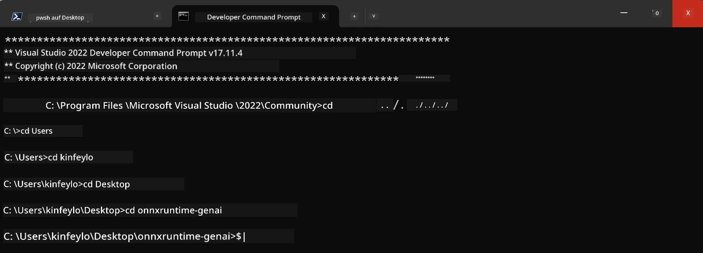

# **Leitfaden für OnnxRuntime GenAI Windows GPU**

Dieser Leitfaden beschreibt die Schritte zur Einrichtung und Nutzung von ONNX Runtime (ORT) mit GPUs unter Windows. Er soll Ihnen helfen, die GPU-Beschleunigung für Ihre Modelle zu nutzen und so Leistung und Effizienz zu verbessern.

Das Dokument gibt Hinweise zu:

- Umgebungseinrichtung: Anleitungen zur Installation der notwendigen Abhängigkeiten wie CUDA, cuDNN und ONNX Runtime.
- Konfiguration: Wie Sie die Umgebung und ONNX Runtime so einstellen, dass GPU-Ressourcen effektiv genutzt werden.
- Optimierungstipps: Empfehlungen zur Feinabstimmung Ihrer GPU-Einstellungen für optimale Leistung.

### **1. Python 3.10.x /3.11.8**

   ***Hinweis*** Es wird empfohlen, [miniforge](https://github.com/conda-forge/miniforge/releases/latest/download/Miniforge3-Windows-x86_64.exe) als Ihre Python-Umgebung zu verwenden

   ```bash

   conda create -n pydev python==3.11.8

   conda activate pydev

   ```

   ***Erinnerung*** Falls Sie eine Python ONNX-Bibliothek installiert haben, deinstallieren Sie diese bitte

### **2. CMake mit winget installieren**

   ```bash

   winget install -e --id Kitware.CMake

   ```

### **3. Visual Studio 2022 - Desktopentwicklung mit C++ installieren**

   ***Hinweis*** Wenn Sie nicht kompilieren möchten, können Sie diesen Schritt überspringen



### **4. NVIDIA-Treiber installieren**

1. **NVIDIA GPU-Treiber**  [https://www.nvidia.com/en-us/drivers/](https://www.nvidia.com/en-us/drivers/)

2. **NVIDIA CUDA 12.4** [https://developer.nvidia.com/cuda-12-4-0-download-archive](https://developer.nvidia.com/cuda-12-4-0-download-archive)

3. **NVIDIA CUDNN 9.4**  [https://developer.nvidia.com/cudnn-downloads](https://developer.nvidia.com/cudnn-downloads)

***Erinnerung*** Bitte verwenden Sie die Standardeinstellungen während der Installation

### **5. NVIDIA-Umgebung einrichten**

Kopieren Sie die NVIDIA CUDNN 9.4 lib, bin, include Ordner in die entsprechenden Verzeichnisse von NVIDIA CUDA 12.4

- Kopieren Sie die Dateien aus *'C:\Program Files\NVIDIA\CUDNN\v9.4\bin\12.6'* nach *'C:\Program Files\NVIDIA GPU Computing Toolkit\CUDA\v12.4\bin'*

- Kopieren Sie die Dateien aus *'C:\Program Files\NVIDIA\CUDNN\v9.4\include\12.6'* nach *'C:\Program Files\NVIDIA GPU Computing Toolkit\CUDA\v12.4\include'*

- Kopieren Sie die Dateien aus *'C:\Program Files\NVIDIA\CUDNN\v9.4\lib\12.6'* nach *'C:\Program Files\NVIDIA GPU Computing Toolkit\CUDA\v12.4\lib\x64'*

### **6. Phi-3.5-mini-instruct-onnx herunterladen**

   ```bash

   winget install -e --id Git.Git

   winget install -e --id GitHub.GitLFS

   git lfs install

   git clone https://huggingface.co/microsoft/Phi-3.5-mini-instruct-onnx

   ```

### **7. InferencePhi35Instruct.ipynb ausführen**

   Öffnen Sie das [Notebook](../../../../../../code/09.UpdateSamples/Aug/ortgpu-phi35-instruct.ipynb) und führen Sie es aus



### **8. ORT GenAI GPU kompilieren**

   ***Hinweis*** 
   
   1. Bitte deinstallieren Sie zunächst alle ONNX-, ONNX Runtime- und ONNX Runtime GenAI-Pakete

   ```bash

   pip list 
   
   ```

   Danach deinstallieren Sie alle onnxruntime-Bibliotheken, z.B.

   ```bash

   pip uninstall onnxruntime

   pip uninstall onnxruntime-genai

   pip uninstall onnxruntume-genai-cuda
   
   ```

   2. Visual Studio Erweiterung prüfen

   Überprüfen Sie im Verzeichnis C:\Program Files\NVIDIA GPU Computing Toolkit\CUDA\v12.4\extras, ob der Ordner C:\Program Files\NVIDIA GPU Computing Toolkit\CUDA\v12.4\extras\visual_studio_integration vorhanden ist. 
   
   Falls nicht, suchen Sie in anderen CUDA Toolkit Treiberordnern nach dem Ordner visual_studio_integration und kopieren Sie diesen samt Inhalt nach C:\Program Files\NVIDIA GPU Computing Toolkit\CUDA\v12.4\extras\visual_studio_integration

   - Wenn Sie nicht kompilieren möchten, können Sie diesen Schritt überspringen

   ```bash

   git clone https://github.com/microsoft/onnxruntime-genai

   ```

   - Laden Sie [https://github.com/microsoft/onnxruntime/releases/download/v1.19.2/onnxruntime-win-x64-gpu-1.19.2.zip](https://github.com/microsoft/onnxruntime/releases/download/v1.19.2/onnxruntime-win-x64-gpu-1.19.2.zip) herunter

   - Entpacken Sie onnxruntime-win-x64-gpu-1.19.2.zip, benennen Sie den Ordner in **ort** um und kopieren Sie ihn in onnxruntime-genai

   - Öffnen Sie das Windows Terminal, wechseln Sie zur Developer Command Prompt für VS 2022 und navigieren Sie zu onnxruntime-genai



   - Kompilieren Sie es mit Ihrer Python-Umgebung

   ```bash

   cd onnxruntime-genai

   python build.py --use_cuda  --cuda_home "C:\Program Files\NVIDIA GPU Computing Toolkit\CUDA\v12.4" --config Release
 

   cd build/Windows/Release/Wheel

   pip install .whl

   ```

**Haftungsausschluss**:  
Dieses Dokument wurde mit dem KI-Übersetzungsdienst [Co-op Translator](https://github.com/Azure/co-op-translator) übersetzt. Obwohl wir uns um Genauigkeit bemühen, beachten Sie bitte, dass automatisierte Übersetzungen Fehler oder Ungenauigkeiten enthalten können. Das Originaldokument in seiner Ursprungssprache ist als maßgebliche Quelle zu betrachten. Für wichtige Informationen wird eine professionelle menschliche Übersetzung empfohlen. Wir übernehmen keine Haftung für Missverständnisse oder Fehlinterpretationen, die aus der Nutzung dieser Übersetzung entstehen.