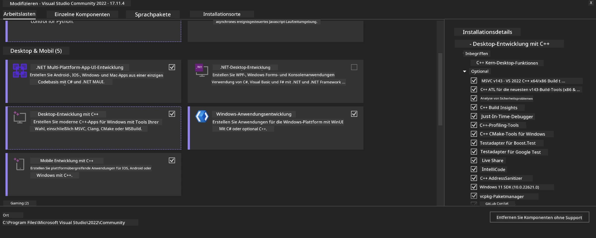
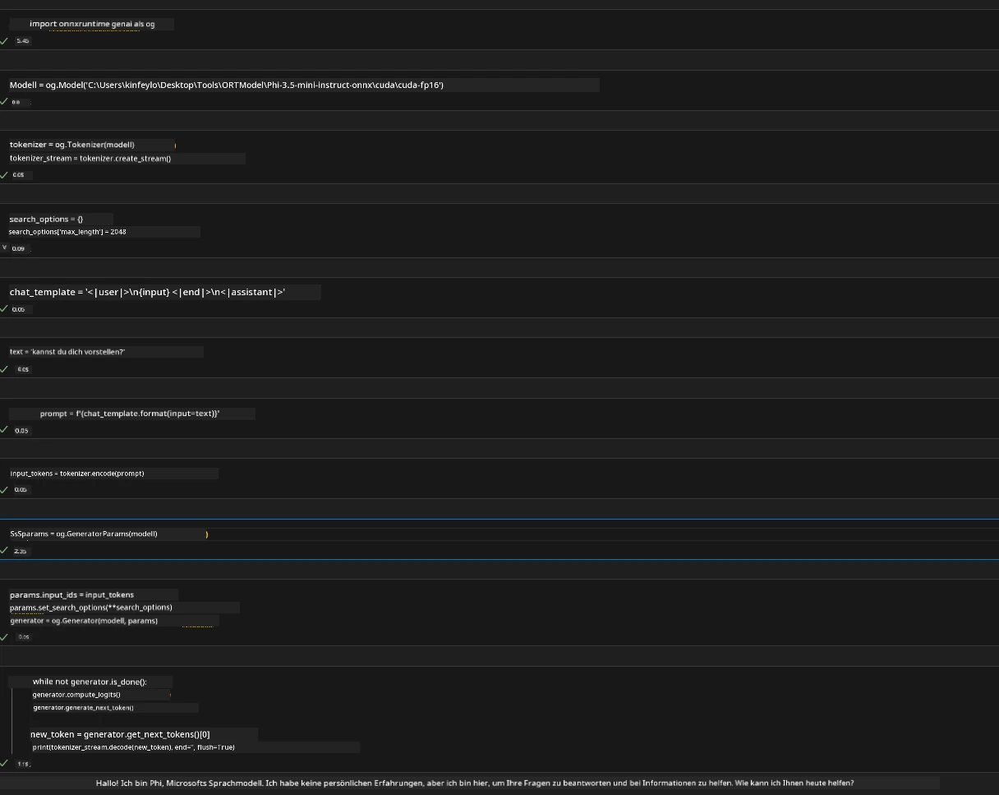
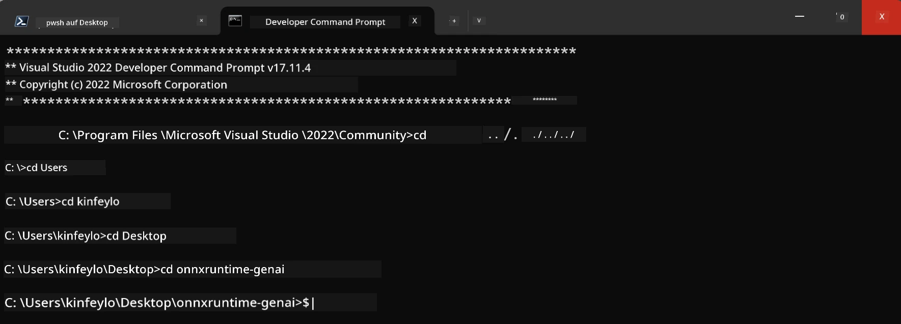

# **Leitfaden für OnnxRuntime GenAI Windows GPU**

Dieser Leitfaden bietet Schritte zum Einrichten und Verwenden von ONNX Runtime (ORT) mit GPUs unter Windows. Er soll Ihnen helfen, GPU-Beschleunigung für Ihre Modelle zu nutzen und so Leistung und Effizienz zu verbessern.

Das Dokument enthält Hinweise zu:

- Umgebungs Einrichtung: Anweisungen zur Installation der erforderlichen Abhängigkeiten wie CUDA, cuDNN und ONNX Runtime.
- Konfiguration: Wie Sie die Umgebung und ONNX Runtime konfigurieren, um GPU-Ressourcen effektiv zu nutzen.
- Optimierungstipps: Ratschläge, wie Sie Ihre GPU-Einstellungen für optimale Leistung feinabstimmen.

### **1. Python 3.10.x /3.11.8**

   ***Hinweis*** Es wird empfohlen, [miniforge](https://github.com/conda-forge/miniforge/releases/latest/download/Miniforge3-Windows-x86_64.exe) als Ihre Python-Umgebung zu verwenden

   ```bash

   conda create -n pydev python==3.11.8

   conda activate pydev

   ```

   ***Erinnerung*** Falls Sie eine Python ONNX-Bibliothek installiert haben, deinstallieren Sie diese bitte

### **2. Installation von CMake mit winget**


   ```bash

   winget install -e --id Kitware.CMake

   ```

### **3. Installation von Visual Studio 2022 - Desktop-Entwicklung mit C++**

   ***Hinweis*** Wenn Sie nicht kompilieren möchten, können Sie diesen Schritt überspringen




### **4. Installation des NVIDIA Treibers**

1. **NVIDIA GPU-Treiber**  [https://www.nvidia.com/en-us/drivers/](https://www.nvidia.com/en-us/drivers/)

2. **NVIDIA CUDA 12.4** [https://developer.nvidia.com/cuda-12-4-0-download-archive](https://developer.nvidia.com/cuda-12-4-0-download-archive)

3. **NVIDIA CUDNN 9.4**  [https://developer.nvidia.com/cudnn-downloads](https://developer.nvidia.com/cudnn-downloads)

***Erinnerung*** Bitte verwenden Sie die Standardeinstellungen im Installationsprozess 

### **5. NVIDIA Umgebung einrichten**

Kopieren Sie NVIDIA CUDNN 9.4 lib, bin, include nach NVIDIA CUDA 12.4 lib, bin, include

- Kopieren Sie *'C:\Program Files\NVIDIA\CUDNN\v9.4\bin\12.6'* Dateien nach  *'C:\Program Files\NVIDIA GPU Computing Toolkit\CUDA\v12.4\bin*

- Kopieren Sie *'C:\Program Files\NVIDIA\CUDNN\v9.4\include\12.6'* Dateien nach  *'C:\Program Files\NVIDIA GPU Computing Toolkit\CUDA\v12.4\include*

- Kopieren Sie *'C:\Program Files\NVIDIA\CUDNN\v9.4\lib\12.6'* Dateien nach  *'C:\Program Files\NVIDIA GPU Computing Toolkit\CUDA\v12.4\lib\x64'*


### **6. Herunterladen von Phi-3.5-mini-instruct-onnx**


   ```bash

   winget install -e --id Git.Git

   winget install -e --id GitHub.GitLFS

   git lfs install

   git clone https://huggingface.co/microsoft/Phi-3.5-mini-instruct-onnx

   ```

### **7. Ausführung von InferencePhi35Instruct.ipynb**

   Öffnen Sie das [Notebook](../../../../code/09.UpdateSamples/Aug/ortgpu-phi35-instruct.ipynb) und führen Sie es aus





### **8. Kompilieren von ORT GenAI GPU**


   ***Hinweis*** 
   
   1. Bitte deinstallieren Sie zunächst alle Pakete zu onnx, onnxruntime und onnxruntime-genai

   
   ```bash

   pip list 
   
   ```

   Dann deinstallieren Sie alle onnxruntime Bibliotheken, z.B. 


   ```bash

   pip uninstall onnxruntime

   pip uninstall onnxruntime-genai

   pip uninstall onnxruntume-genai-cuda
   
   ```

   2. Überprüfen Sie die Unterstützung der Visual Studio-Erweiterung 

   Prüfen Sie C:\Program Files\NVIDIA GPU Computing Toolkit\CUDA\v12.4\extras, um sicherzustellen, dass C:\Program Files\NVIDIA GPU Computing Toolkit\CUDA\v12.4\extras\visual_studio_integration vorhanden ist. 
   
   Wenn nicht vorhanden, überprüfen Sie andere CUDA Toolkit Treiberordner und kopieren Sie den Ordner visual_studio_integration samt Inhalt nach C:\Program Files\NVIDIA GPU Computing Toolkit\CUDA\v12.4\extras\visual_studio_integration


   - Wenn Sie nicht kompilieren möchten, können Sie diesen Schritt überspringen


   ```bash

   git clone https://github.com/microsoft/onnxruntime-genai

   ```

   - Laden Sie [https://github.com/microsoft/onnxruntime/releases/download/v1.19.2/onnxruntime-win-x64-gpu-1.19.2.zip](https://github.com/microsoft/onnxruntime/releases/download/v1.19.2/onnxruntime-win-x64-gpu-1.19.2.zip) herunter

   - Entpacken Sie onnxruntime-win-x64-gpu-1.19.2.zip und benennen Sie es in **ort** um, kopieren Sie den ort-Ordner nach onnxruntime-genai

   - Öffnen Sie Windows Terminal, wechseln Sie zur Developer Command Prompt für VS 2022 und navigieren Sie zu onnxruntime-genai 



   - Kompilieren Sie es mit Ihrer Python-Umgebung

   
   ```bash

   cd onnxruntime-genai

   python build.py --use_cuda  --cuda_home "C:\Program Files\NVIDIA GPU Computing Toolkit\CUDA\v12.4" --config Release
 

   cd build/Windows/Release/Wheel

   pip install .whl

   ```

---

<!-- CO-OP TRANSLATOR DISCLAIMER START -->
**Haftungsausschluss**:
Dieses Dokument wurde mit dem KI-Übersetzungsdienst [Co-op Translator](https://github.com/Azure/co-op-translator) übersetzt. Obwohl wir uns um Genauigkeit bemühen, beachten Sie bitte, dass automatisierte Übersetzungen Fehler oder Ungenauigkeiten enthalten können. Das Originaldokument in seiner Ursprungssprache gilt als maßgebliche Quelle. Bei kritischen Informationen wird eine professionelle menschliche Übersetzung empfohlen. Wir übernehmen keine Haftung für Missverständnisse oder Fehlinterpretationen, die aus der Verwendung dieser Übersetzung entstehen.
<!-- CO-OP TRANSLATOR DISCLAIMER END -->