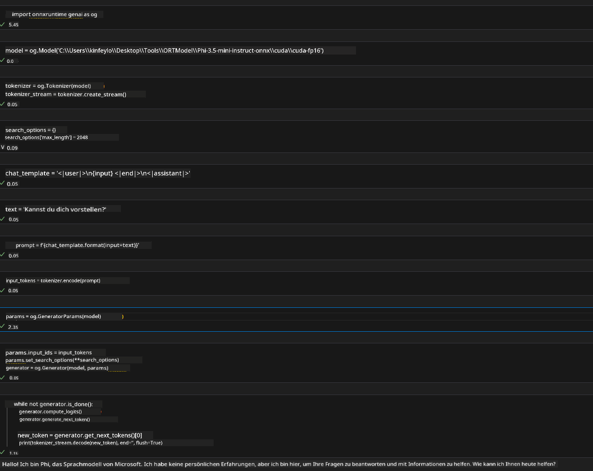
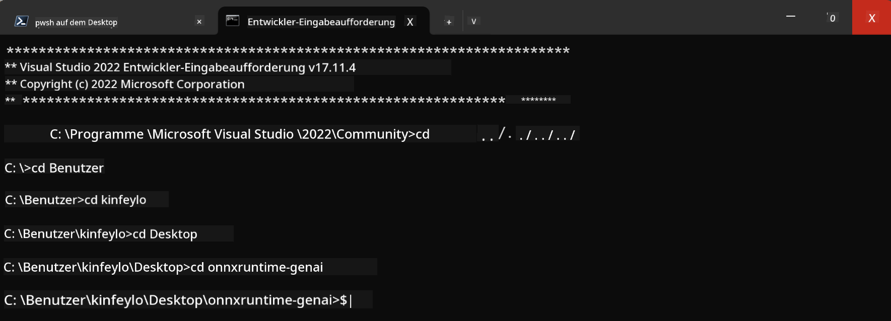

<!--
CO_OP_TRANSLATOR_METADATA:
{
  "original_hash": "b066fc29c1b2129df84e027cb75119ce",
  "translation_date": "2025-05-07T11:03:35+00:00",
  "source_file": "md/02.Application/01.TextAndChat/Phi3/ORTWindowGPUGuideline.md",
  "language_code": "de"
}
-->
# **Leitfaden für OnnxRuntime GenAI Windows GPU**

Dieser Leitfaden beschreibt die Schritte zur Einrichtung und Nutzung von ONNX Runtime (ORT) mit GPUs unter Windows. Er soll Ihnen helfen, GPU-Beschleunigung für Ihre Modelle zu nutzen, um Leistung und Effizienz zu steigern.

Das Dokument enthält Anleitungen zu:

- Einrichtung der Umgebung: Anweisungen zur Installation der notwendigen Abhängigkeiten wie CUDA, cuDNN und ONNX Runtime.
- Konfiguration: Wie man die Umgebung und ONNX Runtime so einstellt, dass GPU-Ressourcen effektiv genutzt werden.
- Optimierungstipps: Empfehlungen zur Feinabstimmung der GPU-Einstellungen für optimale Leistung.

### **1. Python 3.10.x /3.11.8**

   ***Hinweis*** Es wird empfohlen, [miniforge](https://github.com/conda-forge/miniforge/releases/latest/download/Miniforge3-Windows-x86_64.exe) als Ihre Python-Umgebung zu verwenden

   ```bash

   conda create -n pydev python==3.11.8

   conda activate pydev

   ```

   ***Erinnerung*** Falls Sie eine Python ONNX-Bibliothek installiert haben, deinstallieren Sie diese bitte

### **2. Installation von CMake mit winget**

   ```bash

   winget install -e --id Kitware.CMake

   ```

### **3. Installation von Visual Studio 2022 - Desktopentwicklung mit C++**

   ***Hinweis*** Wenn Sie nicht selbst kompilieren möchten, können Sie diesen Schritt überspringen


### **4. Installation des NVIDIA-Treibers**

1. **NVIDIA GPU-Treiber**  [https://www.nvidia.com/en-us/drivers/](https://www.nvidia.com/en-us/drivers/)

2. **NVIDIA CUDA 12.4** [https://developer.nvidia.com/cuda-12-4-0-download-archive](https://developer.nvidia.com/cuda-12-4-0-download-archive)

3. **NVIDIA CUDNN 9.4**  [https://developer.nvidia.com/cudnn-downloads](https://developer.nvidia.com/cudnn-downloads)

***Erinnerung*** Bitte verwenden Sie die Standardeinstellungen während der Installation

### **5. NVIDIA-Umgebung einrichten**

Kopieren Sie die NVIDIA CUDNN 9.4 lib, bin, include Ordner in die entsprechenden Verzeichnisse von NVIDIA CUDA 12.4

- Kopieren Sie die Dateien aus *'C:\Program Files\NVIDIA\CUDNN\v9.4\bin\12.6'* nach *'C:\Program Files\NVIDIA GPU Computing Toolkit\CUDA\v12.4\bin'*

- Kopieren Sie die Dateien aus *'C:\Program Files\NVIDIA\CUDNN\v9.4\include\12.6'* nach *'C:\Program Files\NVIDIA GPU Computing Toolkit\CUDA\v12.4\include'*

- Kopieren Sie die Dateien aus *'C:\Program Files\NVIDIA\CUDNN\v9.4\lib\12.6'* nach *'C:\Program Files\NVIDIA GPU Computing Toolkit\CUDA\v12.4\lib\x64'*

### **6. Download Phi-3.5-mini-instruct-onnx**

   ```bash

   winget install -e --id Git.Git

   winget install -e --id GitHub.GitLFS

   git lfs install

   git clone https://huggingface.co/microsoft/Phi-3.5-mini-instruct-onnx

   ```

### **7. Ausführen von InferencePhi35Instruct.ipynb**

   Öffnen Sie das [Notebook](../../../../../../code/09.UpdateSamples/Aug/ortgpu-phi35-instruct.ipynb) und führen Sie es aus



### **8. Kompilieren von ORT GenAI GPU**

   ***Hinweis***

   1. Bitte deinstallieren Sie zunächst alle onnx-, onnxruntime- und onnxruntime-genai-Pakete

   ```bash

   pip list 
   
   ```

   Anschließend deinstallieren Sie alle onnxruntime-Bibliotheken, z.B.

   ```bash

   pip uninstall onnxruntime

   pip uninstall onnxruntime-genai

   pip uninstall onnxruntume-genai-cuda
   
   ```

   2. Überprüfen Sie die Unterstützung der Visual Studio Erweiterung

   Prüfen Sie unter C:\Program Files\NVIDIA GPU Computing Toolkit\CUDA\v12.4\extras, ob sich der Ordner C:\Program Files\NVIDIA GPU Computing Toolkit\CUDA\v12.4\extras\visual_studio_integration befindet.  
   
   Falls nicht, suchen Sie in anderen CUDA Toolkit Treiber-Ordnern nach diesem Ordner und kopieren Sie ihn samt Inhalt nach C:\Program Files\NVIDIA GPU Computing Toolkit\CUDA\v12.4\extras\visual_studio_integration

   - Wenn Sie nicht selbst kompilieren möchten, können Sie diesen Schritt überspringen

   ```bash

   git clone https://github.com/microsoft/onnxruntime-genai

   ```

   - Laden Sie [https://github.com/microsoft/onnxruntime/releases/download/v1.19.2/onnxruntime-win-x64-gpu-1.19.2.zip](https://github.com/microsoft/onnxruntime/releases/download/v1.19.2/onnxruntime-win-x64-gpu-1.19.2.zip) herunter

   - Entpacken Sie onnxruntime-win-x64-gpu-1.19.2.zip, benennen Sie den Ordner in **ort** um und kopieren Sie ihn in onnxruntime-genai

   - Öffnen Sie mit Windows Terminal die Developer Command Prompt für VS 2022 und navigieren Sie zu onnxruntime-genai



   - Kompilieren Sie es mit Ihrer Python-Umgebung

   ```bash

   cd onnxruntime-genai

   python build.py --use_cuda  --cuda_home "C:\Program Files\NVIDIA GPU Computing Toolkit\CUDA\v12.4" --config Release
 

   cd build/Windows/Release/Wheel

   pip install .whl

   ```

**Haftungsausschluss**:  
Dieses Dokument wurde mithilfe des KI-Übersetzungsdienstes [Co-op Translator](https://github.com/Azure/co-op-translator) übersetzt. Obwohl wir uns um Genauigkeit bemühen, beachten Sie bitte, dass automatisierte Übersetzungen Fehler oder Ungenauigkeiten enthalten können. Das Originaldokument in seiner Ursprungssprache ist als maßgebliche Quelle zu betrachten. Für wichtige Informationen wird eine professionelle menschliche Übersetzung empfohlen. Wir übernehmen keine Haftung für Missverständnisse oder Fehlinterpretationen, die durch die Verwendung dieser Übersetzung entstehen.