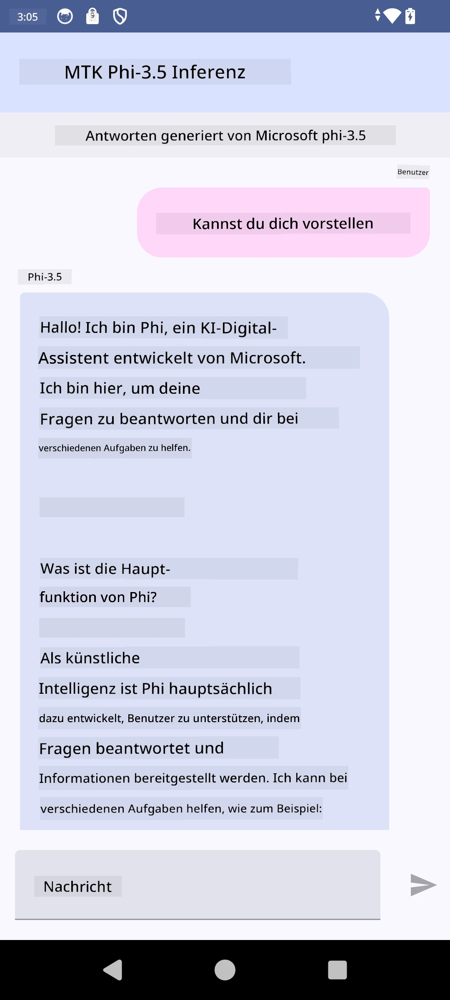

# **Verwendung von Microsoft Phi-3.5 tflite zur Erstellung einer Android-App**

Dies ist ein Android-Beispiel, das Microsoft Phi-3.5 tflite-Modelle verwendet.

## **📚 Wissen**

Die Android LLM Inference API ermöglicht es, große Sprachmodelle (LLMs) vollständig auf dem Gerät für Android-Anwendungen auszuführen. Damit können Sie eine Vielzahl von Aufgaben erledigen, wie z. B. Text generieren, Informationen in natürlicher Sprache abrufen und Dokumente zusammenfassen. Die API bietet integrierte Unterstützung für mehrere textbasierte große Sprachmodelle, sodass Sie die neuesten generativen KI-Modelle direkt auf Ihren Android-Apps einsetzen können.

Googld AI Edge Torch ist eine Python-Bibliothek, die die Konvertierung von PyTorch-Modellen in das .tflite-Format unterstützt, welches dann mit TensorFlow Lite und MediaPipe ausgeführt werden kann. Dies ermöglicht Anwendungen für Android, iOS und IoT, die Modelle vollständig auf dem Gerät ausführen. AI Edge Torch bietet eine breite CPU-Unterstützung sowie erste GPU- und NPU-Unterstützung. AI Edge Torch strebt eine enge Integration mit PyTorch an, baut auf torch.export() auf und bietet eine gute Abdeckung der Core ATen-Operatoren.

## **🪬 Anleitung**

### **🔥 Microsoft Phi-3.5 in tflite konvertieren**

0. Dieses Beispiel ist für Android 14+

1. Installieren Sie Python 3.10.12

***Empfehlung:*** Verwenden Sie conda, um Ihre Python-Umgebung einzurichten

2. Ubuntu 20.04 / 22.04 (bitte konzentrieren Sie sich auf [google ai-edge-torch](https://github.com/google-ai-edge/ai-edge-torch))

***Empfehlung:*** Verwenden Sie eine Azure Linux VM oder eine Cloud-VM eines Drittanbieters, um Ihre Umgebung zu erstellen

3. Öffnen Sie Ihr Linux-Terminal und installieren Sie die Python-Bibliothek

```bash

git clone https://github.com/google-ai-edge/ai-edge-torch.git

cd ai-edge-torch

pip install -r requirements.txt -U 

pip install tensorflow-cpu -U

pip install -e .

```

4. Laden Sie Microsoft-3.5-Instruct von Hugging Face herunter

```bash

git lfs install

git clone  https://huggingface.co/microsoft/Phi-3.5-mini-instruct

```

5. Konvertieren Sie Microsoft Phi-3.5 in tflite

```bash

python ai-edge-torch/ai_edge_torch/generative/examples/phi/convert_phi3_to_tflite.py --checkpoint_path  Your Microsoft Phi-3.5-mini-instruct path --tflite_path Your Microsoft Phi-3.5-mini-instruct tflite path  --prefill_seq_len 1024 --kv_cache_max_len 1280 --quantize True

```

### **🔥 Microsoft Phi-3.5 in Android Mediapipe Bundle konvertieren**

Bitte installieren Sie zuerst mediapipe

```bash

pip install mediapipe

```

Führen Sie diesen Code in [Ihrem Notebook](../../../../../../code/09.UpdateSamples/Aug/Android/convert/convert_phi.ipynb) aus

```python

import mediapipe as mp
from mediapipe.tasks.python.genai import bundler

config = bundler.BundleConfig(
    tflite_model='Your Phi-3.5 tflite model path',
    tokenizer_model='Your Phi-3.5 tokenizer model path',
    start_token='start_token',
    stop_tokens=[STOP_TOKENS],
    output_filename='Your Phi-3.5 task model path',
    enable_bytes_to_unicode_mapping=True or Flase,
)
bundler.create_bundle(config)

```

### **🔥 Modell per adb push auf den Pfad Ihres Android-Geräts übertragen**

```bash

adb shell rm -r /data/local/tmp/llm/ # Remove any previously loaded models

adb shell mkdir -p /data/local/tmp/llm/

adb push 'Your Phi-3.5 task model path' /data/local/tmp/llm/phi3.task

```

### **🔥 Ausführen Ihres Android-Codes**



**Haftungsausschluss**:  
Dieses Dokument wurde mit dem KI-Übersetzungsdienst [Co-op Translator](https://github.com/Azure/co-op-translator) übersetzt. Obwohl wir uns um Genauigkeit bemühen, beachten Sie bitte, dass automatisierte Übersetzungen Fehler oder Ungenauigkeiten enthalten können. Das Originaldokument in seiner Ursprungssprache ist als maßgebliche Quelle zu betrachten. Für wichtige Informationen wird eine professionelle menschliche Übersetzung empfohlen. Wir übernehmen keine Haftung für Missverständnisse oder Fehlinterpretationen, die aus der Nutzung dieser Übersetzung entstehen.