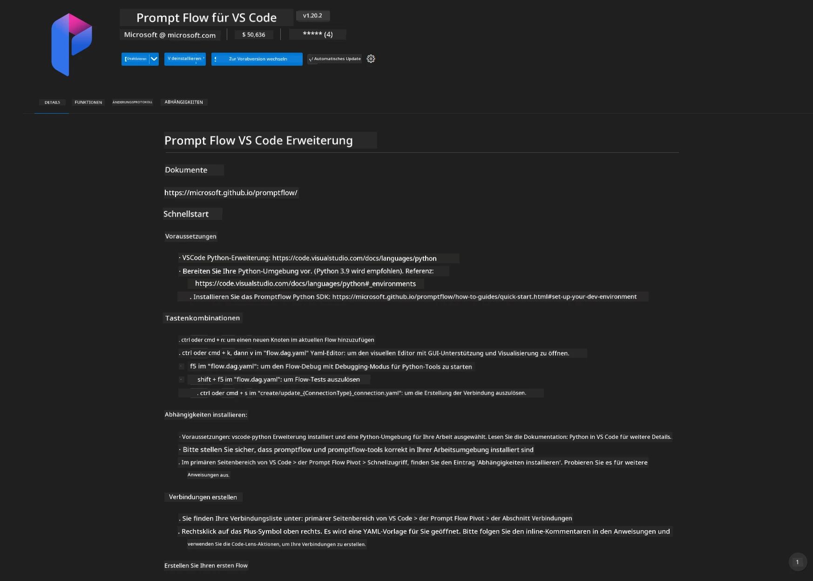
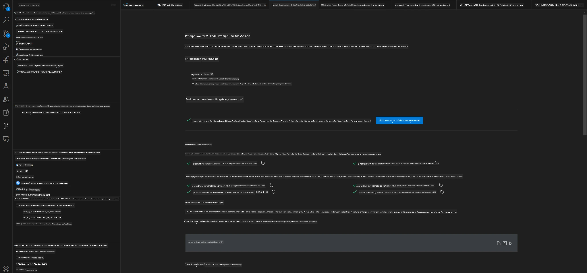
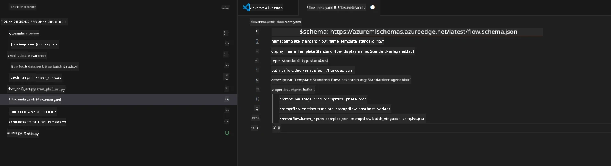
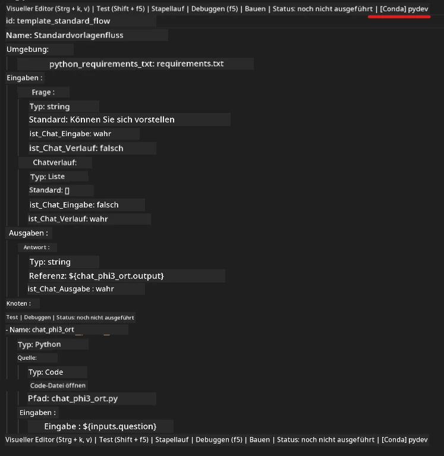
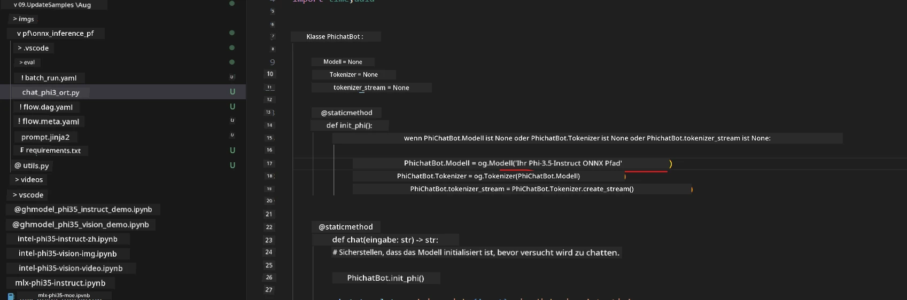
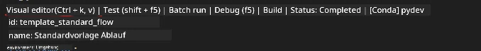
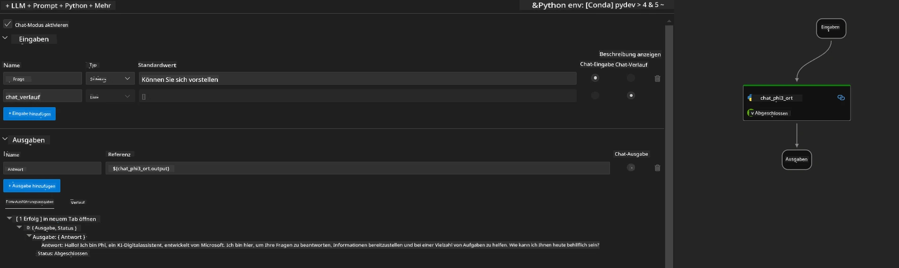
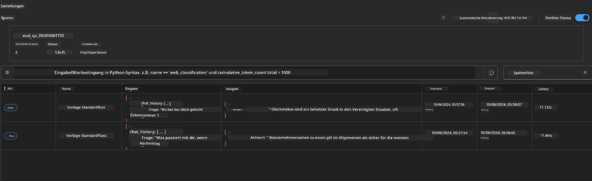

# Verwendung der Windows GPU zur Erstellung einer Prompt Flow-Lösung mit Phi-3.5-Instruct ONNX 

Das folgende Dokument ist ein Beispiel dafür, wie PromptFlow mit ONNX (Open Neural Network Exchange) zur Entwicklung von KI-Anwendungen auf Basis von Phi-3-Modellen verwendet wird.

PromptFlow ist eine Suite von Entwicklungstools, die darauf ausgelegt ist, den End-to-End-Entwicklungszyklus von LLM-basierten (Large Language Model) KI-Anwendungen zu vereinfachen – von der Ideenfindung und Prototypentwicklung bis hin zu Tests und Evaluierung.

Durch die Integration von PromptFlow mit ONNX können Entwickler:

- Modellleistung optimieren: Nutzen Sie ONNX für eine effiziente Modellausführung und -bereitstellung.
- Entwicklung vereinfachen: Verwenden Sie PromptFlow zur Verwaltung des Workflows und Automatisierung wiederkehrender Aufgaben.
- Zusammenarbeit verbessern: Erleichtern Sie die Zusammenarbeit im Team durch eine einheitliche Entwicklungsumgebung.

**Prompt Flow** ist eine Suite von Entwicklungstools, die darauf abzielt, den gesamten Entwicklungszyklus von LLM-basierten KI-Anwendungen zu vereinfachen – von der Ideenfindung, Prototypentwicklung, Tests, Evaluierung bis hin zur produktiven Bereitstellung und Überwachung. Es macht Prompt Engineering deutlich einfacher und ermöglicht es Ihnen, LLM-Anwendungen mit Produktionsqualität zu erstellen.

Prompt Flow kann sich mit OpenAI, Azure OpenAI Service sowie anpassbaren Modellen (Huggingface, lokale LLM/SLM) verbinden. Wir hoffen, das quantisierte ONNX-Modell von Phi-3.5 in lokalen Anwendungen bereitzustellen. Prompt Flow kann uns helfen, unser Geschäft besser zu planen und lokale Lösungen auf Basis von Phi-3.5 zu realisieren. In diesem Beispiel kombinieren wir die ONNX Runtime GenAI Library, um die Prompt Flow-Lösung basierend auf Windows GPU abzuschließen.

## **Installation**

### **ONNX Runtime GenAI für Windows GPU**

Lesen Sie diese Anleitung, um ONNX Runtime GenAI für Windows GPU einzurichten [hier klicken](./ORTWindowGPUGuideline.md)

### **Prompt Flow in VSCode einrichten**

1. Installieren Sie die Prompt Flow VS Code-Erweiterung



2. Nach der Installation der Prompt Flow VS Code-Erweiterung klicken Sie auf die Erweiterung und wählen **Installation dependencies** — folgen Sie dieser Anleitung, um das Prompt Flow SDK in Ihrer Umgebung zu installieren



3. Laden Sie den [Beispielcode](../../../../../../code/09.UpdateSamples/Aug/pf/onnx_inference_pf) herunter und öffnen Sie diesen mit VS Code



4. Öffnen Sie **flow.dag.yaml**, um Ihr Python-Umgebung auszuwählen



   Öffnen Sie **chat_phi3_ort.py**, um den Speicherort Ihres Phi-3.5-Instruct ONNX-Modells zu ändern



5. Führen Sie Ihren Prompt Flow zum Testen aus

Öffnen Sie **flow.dag.yaml** und klicken Sie auf den visuellen Editor



Nach dem Klick darauf führen Sie es aus, um zu testen



1. Sie können im Terminal Batchprozesse ausführen, um weitere Ergebnisse zu prüfen


```bash

pf run create --file batch_run.yaml --stream --name 'Your eval qa name'    

```

Sie können die Ergebnisse in Ihrem Standardbrowser ansehen




---

<!-- CO-OP TRANSLATOR DISCLAIMER START -->
**Haftungsausschluss**:
Dieses Dokument wurde mit dem KI-Übersetzungsdienst [Co-op Translator](https://github.com/Azure/co-op-translator) übersetzt. Obwohl wir uns um Genauigkeit bemühen, beachten Sie bitte, dass automatisierte Übersetzungen Fehler oder Ungenauigkeiten enthalten können. Das Originaldokument in seiner Ursprungssprache gilt als maßgebliche Quelle. Bei kritischen Informationen wird eine professionelle menschliche Übersetzung empfohlen. Wir übernehmen keine Haftung für Missverständnisse oder Fehlinterpretationen, die aus der Verwendung dieser Übersetzung entstehen.
<!-- CO-OP TRANSLATOR DISCLAIMER END -->