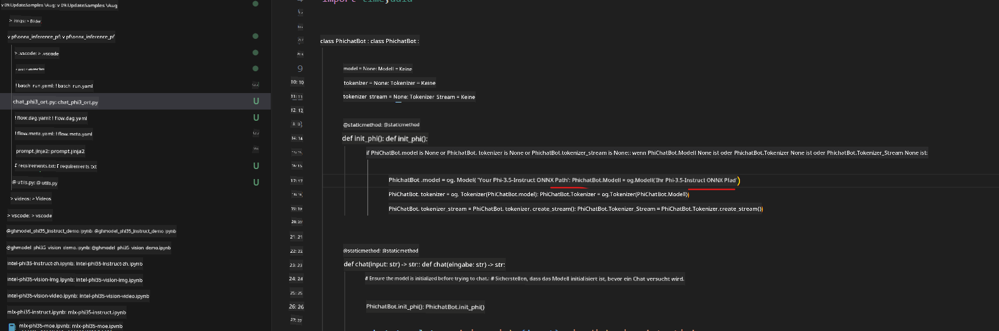

<!--
CO_OP_TRANSLATOR_METADATA:
{
  "original_hash": "92e7dac1e5af0dd7c94170fdaf6860fe",
  "translation_date": "2025-07-17T02:56:42+00:00",
  "source_file": "md/02.Application/01.TextAndChat/Phi3/UsingPromptFlowWithONNX.md",
  "language_code": "de"
}
-->
# Verwendung der Windows-GPU zur Erstellung einer PromptFlow-Lösung mit Phi-3.5-Instruct ONNX

Das folgende Dokument zeigt ein Beispiel, wie man PromptFlow mit ONNX (Open Neural Network Exchange) verwendet, um KI-Anwendungen auf Basis von Phi-3-Modellen zu entwickeln.

PromptFlow ist eine Sammlung von Entwicklungstools, die den gesamten Entwicklungszyklus von KI-Anwendungen auf Basis von LLMs (Large Language Models) vereinfachen – von der Ideenfindung und Prototypenerstellung bis hin zu Tests und Evaluation.

Durch die Integration von PromptFlow mit ONNX können Entwickler:

- Modellleistung optimieren: ONNX für effiziente Modellausführung und Bereitstellung nutzen.
- Entwicklung vereinfachen: PromptFlow verwenden, um den Workflow zu steuern und wiederkehrende Aufgaben zu automatisieren.
- Zusammenarbeit verbessern: Bessere Teamarbeit durch eine einheitliche Entwicklungsumgebung ermöglichen.

**PromptFlow** ist eine Sammlung von Entwicklungstools, die den gesamten Entwicklungszyklus von LLM-basierten KI-Anwendungen vereinfachen – von der Ideenfindung, Prototypenerstellung, Tests und Evaluation bis hin zur produktiven Bereitstellung und Überwachung. Es macht Prompt Engineering deutlich einfacher und ermöglicht es, LLM-Anwendungen in Produktionsqualität zu erstellen.

PromptFlow kann sich mit OpenAI, Azure OpenAI Service und anpassbaren Modellen (Huggingface, lokale LLM/SLM) verbinden. Wir planen, das quantisierte ONNX-Modell von Phi-3.5 in lokalen Anwendungen einzusetzen. PromptFlow hilft uns dabei, unser Geschäft besser zu planen und lokale Lösungen auf Basis von Phi-3.5 zu realisieren. In diesem Beispiel kombinieren wir die ONNX Runtime GenAI Library, um die PromptFlow-Lösung auf einer Windows-GPU umzusetzen.

## **Installation**

### **ONNX Runtime GenAI für Windows GPU**

Lies diese Anleitung, um ONNX Runtime GenAI für Windows GPU einzurichten: [hier klicken](./ORTWindowGPUGuideline.md)

### **PromptFlow in VSCode einrichten**

1. Installiere die PromptFlow VS Code Erweiterung


2. Nach der Installation der PromptFlow VS Code Erweiterung, klicke auf die Erweiterung und wähle **Installation dependencies**. Folge dieser Anleitung, um das PromptFlow SDK in deiner Umgebung zu installieren.


3. Lade den [Beispielcode](../../../../../../code/09.UpdateSamples/Aug/pf/onnx_inference_pf) herunter und öffne das Beispiel mit VS Code


4. Öffne **flow.dag.yaml**, um deine Python-Umgebung auszuwählen


   Öffne **chat_phi3_ort.py**, um den Speicherort deines Phi-3.5-instruct ONNX-Modells anzupassen



5. Starte deinen PromptFlow-Testlauf

Öffne **flow.dag.yaml** und klicke auf den visuellen Editor


Klicke darauf und führe den Testlauf aus


1. Du kannst auch im Terminal Batch-Läufe starten, um weitere Ergebnisse zu prüfen


```bash

pf run create --file batch_run.yaml --stream --name 'Your eval qa name'    

```

Die Ergebnisse kannst du in deinem Standardbrowser ansehen


**Haftungsausschluss**:  
Dieses Dokument wurde mit dem KI-Übersetzungsdienst [Co-op Translator](https://github.com/Azure/co-op-translator) übersetzt. Obwohl wir uns um Genauigkeit bemühen, beachten Sie bitte, dass automatisierte Übersetzungen Fehler oder Ungenauigkeiten enthalten können. Das Originaldokument in seiner Ursprungssprache gilt als maßgebliche Quelle. Für wichtige Informationen wird eine professionelle menschliche Übersetzung empfohlen. Wir übernehmen keine Haftung für Missverständnisse oder Fehlinterpretationen, die aus der Nutzung dieser Übersetzung entstehen.