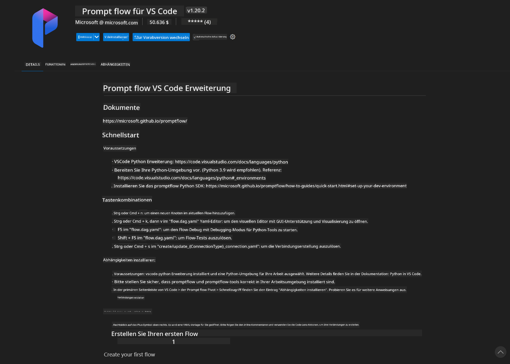
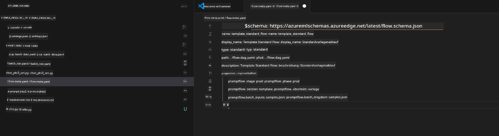
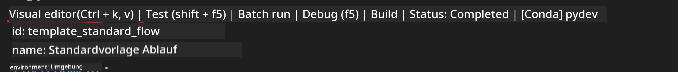

<!--
CO_OP_TRANSLATOR_METADATA:
{
  "original_hash": "92e7dac1e5af0dd7c94170fdaf6860fe",
  "translation_date": "2025-05-07T11:05:45+00:00",
  "source_file": "md/02.Application/01.TextAndChat/Phi3/UsingPromptFlowWithONNX.md",
  "language_code": "de"
}
-->
# Verwendung der Windows-GPU zur Erstellung einer PromptFlow-Lösung mit Phi-3.5-Instruct ONNX

Das folgende Dokument ist ein Beispiel dafür, wie PromptFlow mit ONNX (Open Neural Network Exchange) verwendet wird, um KI-Anwendungen auf Basis von Phi-3-Modellen zu entwickeln.

PromptFlow ist eine Sammlung von Entwicklungstools, die den gesamten Entwicklungszyklus von LLM-basierten (Large Language Model) KI-Anwendungen von der Ideenfindung und Prototypenerstellung bis hin zu Tests und Evaluierung vereinfachen.

Durch die Integration von PromptFlow mit ONNX können Entwickler:

- Modellleistung optimieren: ONNX für effiziente Modellausführung und Bereitstellung nutzen.
- Entwicklung vereinfachen: PromptFlow verwenden, um den Workflow zu verwalten und repetitive Aufgaben zu automatisieren.
- Zusammenarbeit verbessern: Bessere Zusammenarbeit im Team durch eine einheitliche Entwicklungsumgebung ermöglichen.

**Prompt flow** ist eine Sammlung von Entwicklungstools, die den gesamten Entwicklungszyklus von LLM-basierten KI-Anwendungen von der Ideenfindung, Prototypenerstellung, Tests, Evaluierung bis hin zur Produktionsbereitstellung und Überwachung optimiert. Es macht Prompt-Engineering deutlich einfacher und ermöglicht es, LLM-Anwendungen in Produktionsqualität zu erstellen.

Prompt flow kann sich mit OpenAI, Azure OpenAI Service und anpassbaren Modellen (Huggingface, lokale LLM/SLM) verbinden. Wir hoffen, das quantisierte ONNX-Modell von Phi-3.5 in lokalen Anwendungen einzusetzen. Prompt flow hilft uns dabei, unser Geschäft besser zu planen und lokale Lösungen auf Basis von Phi-3.5 zu realisieren. In diesem Beispiel kombinieren wir die ONNX Runtime GenAI Library, um die Prompt flow-Lösung auf Basis der Windows-GPU zu vervollständigen.

## **Installation**

### **ONNX Runtime GenAI für Windows GPU**

Lesen Sie diese Anleitung, um ONNX Runtime GenAI für Windows GPU einzurichten [hier klicken](./ORTWindowGPUGuideline.md)

### **Einrichtung von Prompt flow in VSCode**

1. Installieren Sie die Prompt flow VS Code-Erweiterung



2. Nach der Installation der Prompt flow VS Code-Erweiterung klicken Sie auf die Erweiterung und wählen **Installation dependencies**. Folgen Sie dieser Anleitung, um das Prompt flow SDK in Ihrer Umgebung zu installieren.


3. Laden Sie den [Beispielcode](../../../../../../code/09.UpdateSamples/Aug/pf/onnx_inference_pf) herunter und öffnen Sie dieses Beispiel mit VS Code.



4. Öffnen Sie **flow.dag.yaml**, um Ihre Python-Umgebung auszuwählen.


   Öffnen Sie **chat_phi3_ort.py**, um den Speicherort Ihres Phi-3.5-Instruct ONNX-Modells zu ändern.


5. Führen Sie Ihren Prompt flow zum Testen aus.

Öffnen Sie **flow.dag.yaml** und klicken Sie auf den visuellen Editor.



Nachdem Sie darauf geklickt haben, führen Sie es aus, um zu testen.


1. Sie können Batch im Terminal ausführen, um weitere Ergebnisse zu überprüfen.

```bash

pf run create --file batch_run.yaml --stream --name 'Your eval qa name'    

```

Sie können die Ergebnisse in Ihrem Standardbrowser ansehen.


**Haftungsausschluss**:  
Dieses Dokument wurde mit dem KI-Übersetzungsdienst [Co-op Translator](https://github.com/Azure/co-op-translator) übersetzt. Obwohl wir uns um Genauigkeit bemühen, beachten Sie bitte, dass automatisierte Übersetzungen Fehler oder Ungenauigkeiten enthalten können. Das Originaldokument in seiner Ursprungssprache gilt als maßgebliche Quelle. Für wichtige Informationen wird eine professionelle menschliche Übersetzung empfohlen. Wir übernehmen keine Haftung für Missverständnisse oder Fehlinterpretationen, die durch die Nutzung dieser Übersetzung entstehen.