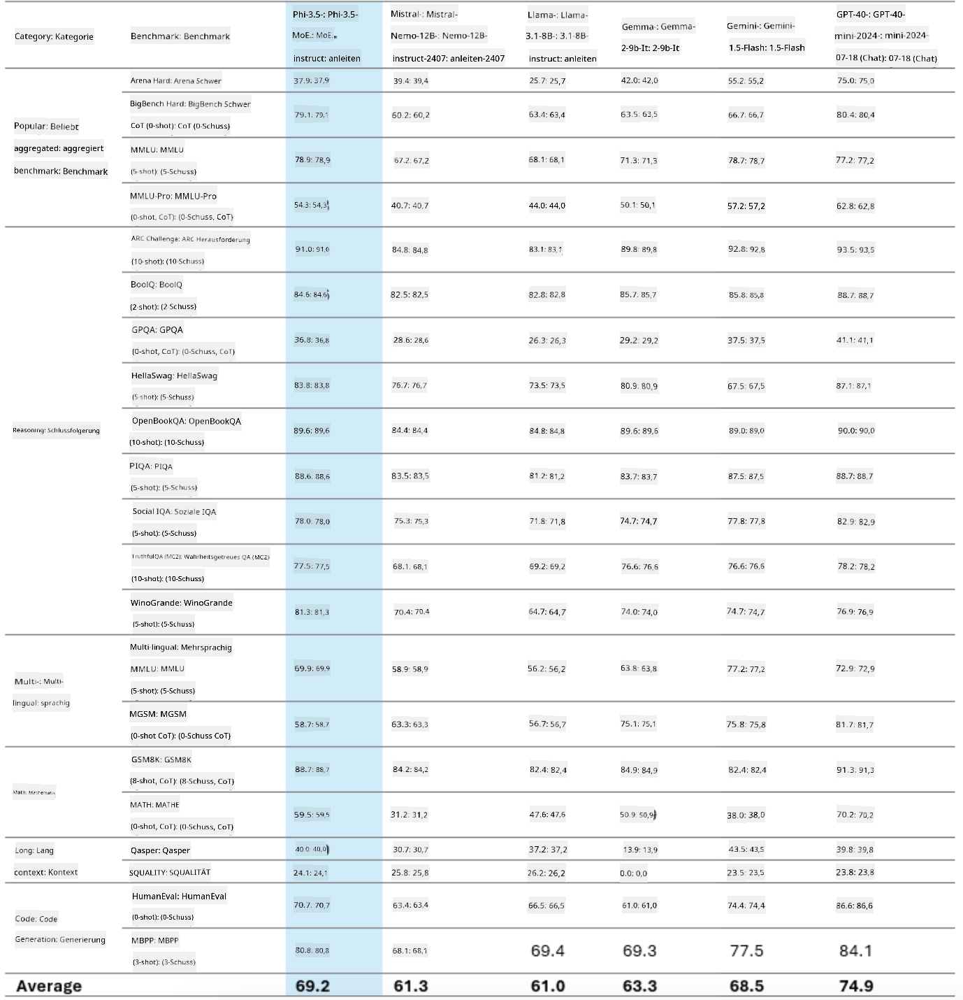
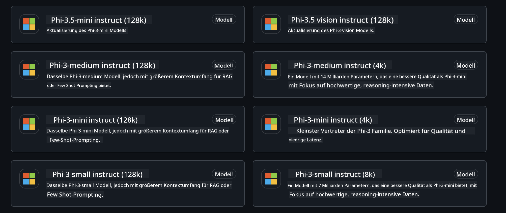
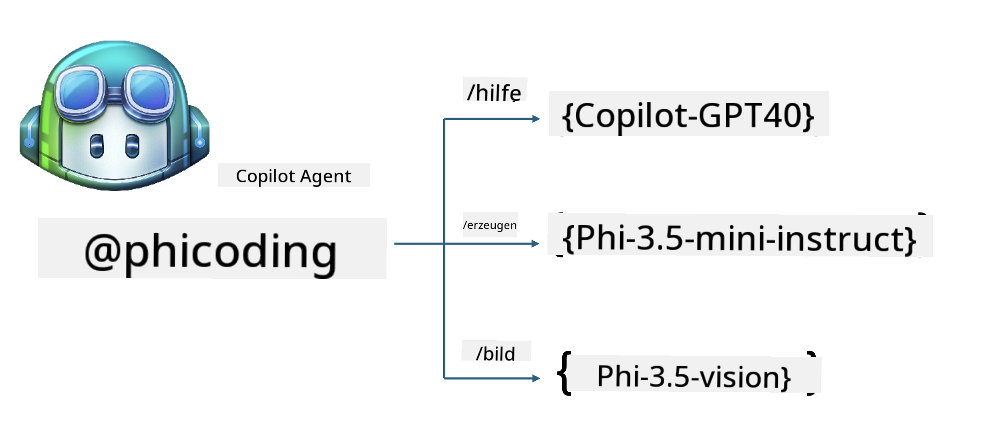
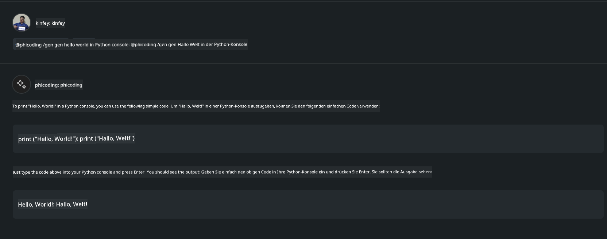
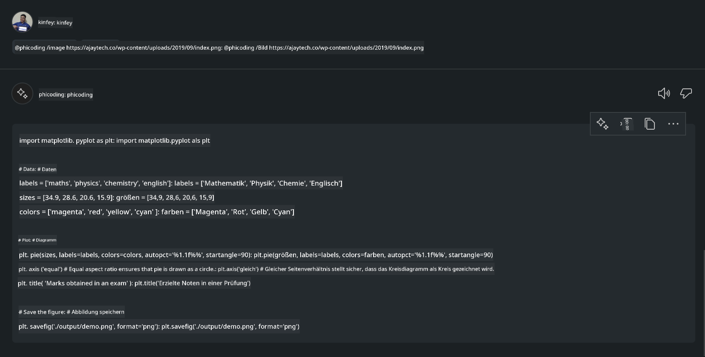

<!--
CO_OP_TRANSLATOR_METADATA:
{
  "original_hash": "35bf81388ac6917277b8d9a0c39bdc70",
  "translation_date": "2025-07-17T03:20:55+00:00",
  "source_file": "md/02.Application/02.Code/Phi3/CreateVSCodeChatAgentWithGitHubModels.md",
  "language_code": "de"
}
-->
# **Erstelle deinen eigenen Visual Studio Code Chat Copilot Agent mit Phi-3.5 von GitHub Models**

Verwendest du Visual Studio Code Copilot? Besonders im Chat kannst du verschiedene Agents nutzen, um die Fähigkeit zur Erstellung, zum Schreiben und zur Pflege von Projekten in Visual Studio Code zu verbessern. Visual Studio Code bietet eine API, die es Unternehmen und Einzelpersonen ermöglicht, unterschiedliche Agents basierend auf ihrem Geschäftsfeld zu erstellen, um deren Fähigkeiten in verschiedenen proprietären Bereichen zu erweitern. In diesem Artikel konzentrieren wir uns auf **Phi-3.5-mini-instruct (128k)** und **Phi-3.5-vision-instruct (128k)** von GitHub Models, um deinen eigenen Visual Studio Code Agent zu erstellen.

## **Über Phi-3.5 bei GitHub Models**

Wir wissen, dass Phi-3/3.5-mini-instruct aus der Phi-3/3.5-Familie starke Fähigkeiten im Code-Verstehen und -Generieren besitzt und Vorteile gegenüber Gemma-2-9b und Mistral-Nemo-12B-instruct-2407 hat.



Die neuesten GitHub Models bieten bereits Zugriff auf die Modelle Phi-3.5-mini-instruct (128k) und Phi-3.5-vision-instruct (128k). Entwickler können über das OpenAI SDK, Azure AI Inference SDK und die REST API darauf zugreifen.



***Hinweis:*** Es wird empfohlen, hier das Azure AI Inference SDK zu verwenden, da es im Produktionsumfeld besser mit dem Azure Model Catalog zusammenarbeitet.

Im Folgenden siehst du die Ergebnisse von **Phi-3.5-mini-instruct (128k)** und **Phi-3.5-vision-instruct (128k)** im Szenario der Codegenerierung nach der Anbindung an GitHub Models, sowie die Vorbereitung auf die folgenden Beispiele.

**Demo: GitHub Models Phi-3.5-mini-instruct (128k) generiert Code aus Prompt** ([klicke hier](../../../../../../code/09.UpdateSamples/Aug/ghmodel_phi35_instruct_demo.ipynb))

**Demo: GitHub Models Phi-3.5-vision-instruct (128k) generiert Code aus Bild** ([klicke hier](../../../../../../code/09.UpdateSamples/Aug/ghmodel_phi35_vision_demo.ipynb))


## **Über den GitHub Copilot Chat Agent**

Der GitHub Copilot Chat Agent kann basierend auf dem Code verschiedene Aufgaben in unterschiedlichen Projektszenarien erledigen. Das System verfügt über vier Agents: workspace, github, terminal, vscode


Indem du den Namen des Agents mit „@“ ergänzt, kannst du die entsprechende Arbeit schnell erledigen. Für Unternehmen gilt: Wenn du eigene geschäftsbezogene Inhalte wie Anforderungen, Codierung, Testspezifikationen und Releases hinzufügst, kannst du leistungsfähigere private Unternehmensfunktionen auf Basis von GitHub Copilot erhalten.

Der Visual Studio Code Chat Agent hat nun offiziell seine API veröffentlicht, die es Unternehmen oder Unternehmensentwicklern ermöglicht, Agents basierend auf unterschiedlichen Software-Geschäftsökosystemen zu entwickeln. Basierend auf der Entwicklungsweise von Visual Studio Code Extension Development kannst du einfach auf die Schnittstelle der Visual Studio Code Chat Agent API zugreifen. Wir können auf diesem Prozess aufbauen.


Das Entwicklungsszenario unterstützt den Zugriff auf Drittanbieter-Model-APIs (wie GitHub Models, Azure Model Catalog und selbstgebaute Services basierend auf Open-Source-Modellen) und kann auch die von GitHub Copilot bereitgestellten Modelle gpt-35-turbo, gpt-4 und gpt-4o verwenden.

## **Füge einen Agenten @phicoding basierend auf Phi-3.5 hinzu**

Wir versuchen, die Programmierfähigkeiten von Phi-3.5 zu integrieren, um Code-Schreiben, Bildgenerierungscode und andere Aufgaben zu erledigen. Erstelle einen Agenten rund um Phi-3.5 – @PHI, mit folgenden Funktionen:

1. Erstelle eine Selbstvorstellung basierend auf GPT-4o, bereitgestellt von GitHub Copilot, über den Befehl **@phicoding /help**

2. Generiere Code für verschiedene Programmiersprachen basierend auf **Phi-3.5-mini-instruct (128k)** über den Befehl **@phicoding /gen**

3. Generiere Code basierend auf **Phi-3.5-vision-instruct (128k)** und vervollständige Bilder über den Befehl **@phicoding /image**



## **Verwandte Schritte**

1. Installiere die Unterstützung für Visual Studio Code Extension Development mit npm

```bash

npm install --global yo generator-code 

```
2. Erstelle ein Visual Studio Code Extension Plugin (im Typescript-Entwicklungsmodus, benannt phiext)

```bash

yo code 

```

3. Öffne das erstellte Projekt und bearbeite package.json. Hier findest du die zugehörigen Anweisungen und Konfigurationen sowie die Konfiguration der GitHub Models. Beachte, dass du hier deinen GitHub Models Token hinzufügen musst.

```json

{
  "name": "phiext",
  "displayName": "phiext",
  "description": "",
  "version": "0.0.1",
  "engines": {
    "vscode": "^1.93.0"
  },
  "categories": [
    "AI",
    "Chat"
  ],
  "activationEvents": [],
  "enabledApiProposals": [
      "chatVariableResolver"
  ],
  "main": "./dist/extension.js",
  "contributes": {
    "chatParticipants": [
        {
            "id": "chat.phicoding",
            "name": "phicoding",
            "description": "Hey! I am Microsoft Phi-3.5, She can help me with coding problems, such as generation code with your natural language, or even generation code about chart from images. Just ask me anything!",
            "isSticky": true,
            "commands": [
                {
                    "name": "help",
                    "description": "Introduce myself to you"
                },
                {
                    "name": "gen",
                    "description": "Generate code for you with Microsoft Phi-3.5-mini-instruct"
                },
                {
                    "name": "image",
                    "description": "Generate code for chart from image(png or jpg) with Microsoft Phi-3.5-vision-instruct, please add image url like this : https://ajaytech.co/wp-content/uploads/2019/09/index.png"
                }
            ]
        }
    ],
    "commands": [
        {
            "command": "phicoding.namesInEditor",
            "title": "Use Microsoft Phi 3.5 in Editor"
        }
    ],
    "configuration": {
      "type": "object",
      "title": "githubmodels",
      "properties": {
        "githubmodels.endpoint": {
          "type": "string",
          "default": "https://models.inference.ai.azure.com",
          "description": "Your GitHub Models Endpoint",
          "order": 0
        },
        "githubmodels.api_key": {
          "type": "string",
          "default": "Your GitHub Models Token",
          "description": "Your GitHub Models Token",
          "order": 1
        },
        "githubmodels.phi35instruct": {
          "type": "string",
          "default": "Phi-3.5-mini-instruct",
          "description": "Your Phi-35-Instruct Model",
          "order": 2
        },
        "githubmodels.phi35vision": {
          "type": "string",
          "default": "Phi-3.5-vision-instruct",
          "description": "Your Phi-35-Vision Model",
          "order": 3
        }
      }
    }
  },
  "scripts": {
    "vscode:prepublish": "npm run package",
    "compile": "webpack",
    "watch": "webpack --watch",
    "package": "webpack --mode production --devtool hidden-source-map",
    "compile-tests": "tsc -p . --outDir out",
    "watch-tests": "tsc -p . -w --outDir out",
    "pretest": "npm run compile-tests && npm run compile && npm run lint",
    "lint": "eslint src",
    "test": "vscode-test"
  },
  "devDependencies": {
    "@types/vscode": "^1.93.0",
    "@types/mocha": "^10.0.7",
    "@types/node": "20.x",
    "@typescript-eslint/eslint-plugin": "^8.3.0",
    "@typescript-eslint/parser": "^8.3.0",
    "eslint": "^9.9.1",
    "typescript": "^5.5.4",
    "ts-loader": "^9.5.1",
    "webpack": "^5.94.0",
    "webpack-cli": "^5.1.4",
    "@vscode/test-cli": "^0.0.10",
    "@vscode/test-electron": "^2.4.1"
  },
  "dependencies": {
    "@types/node-fetch": "^2.6.11",
    "node-fetch": "^3.3.2",
    "@azure-rest/ai-inference": "latest",
    "@azure/core-auth": "latest",
    "@azure/core-sse": "latest"
  }
}


```

4. Bearbeite src/extension.ts

```typescript

// The module 'vscode' contains the VS Code extensibility API
// Import the module and reference it with the alias vscode in your code below
import * as vscode from 'vscode';
import ModelClient from "@azure-rest/ai-inference";
import { AzureKeyCredential } from "@azure/core-auth";


interface IPhiChatResult extends vscode.ChatResult {
    metadata: {
        command: string;
    };
}


const MODEL_SELECTOR: vscode.LanguageModelChatSelector = { vendor: 'copilot', family: 'gpt-4o' };

function isValidImageUrl(url: string): boolean {
    const regex = /^(https?:\/\/.*\.(?:png|jpg))$/i;
    return regex.test(url);
}
  

// This method is called when your extension is activated
// Your extension is activated the very first time the command is executed
export function activate(context: vscode.ExtensionContext) {

    const codinghandler: vscode.ChatRequestHandler = async (request: vscode.ChatRequest, context: vscode.ChatContext, stream: vscode.ChatResponseStream, token: vscode.CancellationToken): Promise<IPhiChatResult> => {


        const config : any = vscode.workspace.getConfiguration('githubmodels');
        const endPoint: string = config.get('endpoint');
        const apiKey: string = config.get('api_key');
        const phi35instruct: string = config.get('phi35instruct');
        const phi35vision: string = config.get('phi35vision');
        
        if (request.command === 'help') {

            const content = "Welcome to Coding assistant with Microsoft Phi-3.5"; 
            stream.progress(content);


            try {
                const [model] = await vscode.lm.selectChatModels(MODEL_SELECTOR);
                if (model) {
                    const messages = [
                        vscode.LanguageModelChatMessage.User("Please help me express this content in a humorous way: I am a programming assistant who can help you convert natural language into code and generate code based on the charts in the images. output format like this : Hey I am Phi ......")
                    ];
                    const chatResponse = await model.sendRequest(messages, {}, token);
                    for await (const fragment of chatResponse.text) {
                        stream.markdown(fragment);
                    }
                }
            } catch(err) {
                console.log(err);
            }


            return { metadata: { command: 'help' } };

        }

        
        if (request.command === 'gen') {

            const content = "Welcome to use phi-3.5 to generate code";

            stream.progress(content);

            const client = new ModelClient(endPoint, new AzureKeyCredential(apiKey));

            const response = await client.path("/chat/completions").post({
              body: {
                messages: [
                  { role:"system", content: "You are a coding assistant.Help answer all code generation questions." },
                  { role:"user", content: request.prompt }
                ],
                model: phi35instruct,
                temperature: 0.4,
                max_tokens: 1000,
                top_p: 1.
              }
            });

            stream.markdown(response.body.choices[0].message.content);

            return { metadata: { command: 'gen' } };

        }


        
        if (request.command === 'image') {


            const content = "Welcome to use phi-3.5 to generate code from image(png or jpg),image url like this:https://ajaytech.co/wp-content/uploads/2019/09/index.png";

            stream.progress(content);

            if (!isValidImageUrl(request.prompt)) {
                stream.markdown('Please provide a valid image URL');
                return { metadata: { command: 'image' } };
            }
            else
            {

                const client = new ModelClient(endPoint, new AzureKeyCredential(apiKey));
    
                const response = await client.path("/chat/completions").post({
                    body: {
                      messages: [
                        { role: "system", content: "You are a helpful assistant that describes images in details." },
                        { role: "user", content: [
                            { type: "text", text: "Please generate code according to the chart in the picture according to the following requirements\n1. Keep all information in the chart, including data and text\n2. Do not generate additional information that is not included in the chart\n3. Please extract data from the picture, do not generate it from csv\n4. Please save the regenerated chart as a chart and save it to ./output/demo.png"},
                            { type: "image_url", image_url: {url: request.prompt}
                            }
                          ]
                        }
                      ],
                      model: phi35vision,
                      temperature: 0.4,
                      max_tokens: 2048,
                      top_p: 1.
                    }
                  });
    
                
                stream.markdown(response.body.choices[0].message.content);
    
                return { metadata: { command: 'image' } };
            }


        }


        return { metadata: { command: '' } };
    };


    const phi_ext = vscode.chat.createChatParticipant("chat.phicoding", codinghandler);

    phi_ext.iconPath = new vscode.ThemeIcon('sparkle');


    phi_ext.followupProvider = {
        provideFollowups(result: IPhiChatResult, context: vscode.ChatContext, token: vscode.CancellationToken) {
            return [{
                prompt: 'Let us coding with Phi-3.5 😋😋😋😋',
                label: vscode.l10n.t('Enjoy coding with Phi-3.5'),
                command: 'help'
            } satisfies vscode.ChatFollowup];
        }
    };

    context.subscriptions.push(phi_ext);
}

// This method is called when your extension is deactivated
export function deactivate() {}


```

6. Ausführung

***/help***


***@phicoding /help***


***@phicoding /gen***



***@phicoding /image***



Du kannst Beispielcode herunterladen: [klicke hier](../../../../../../code/09.UpdateSamples/Aug/vscode)

## **Ressourcen**

1. Registriere dich bei GitHub Models [https://gh.io/models](https://gh.io/models)

2. Lerne Visual Studio Code Extension Development [https://code.visualstudio.com/api/get-started/your-first-extension](https://code.visualstudio.com/api/get-started/your-first-extension)

3. Erfahre mehr über die Visual Studio Code Copilot Chat API [https://code.visualstudio.com/api/extension-guides/chat](https://code.visualstudio.com/api/extension-guides/chat)

**Haftungsausschluss**:  
Dieses Dokument wurde mit dem KI-Übersetzungsdienst [Co-op Translator](https://github.com/Azure/co-op-translator) übersetzt. Obwohl wir uns um Genauigkeit bemühen, beachten Sie bitte, dass automatisierte Übersetzungen Fehler oder Ungenauigkeiten enthalten können. Das Originaldokument in seiner Ursprungssprache ist als maßgebliche Quelle zu betrachten. Für wichtige Informationen wird eine professionelle menschliche Übersetzung empfohlen. Wir übernehmen keine Haftung für Missverständnisse oder Fehlinterpretationen, die aus der Nutzung dieser Übersetzung entstehen.