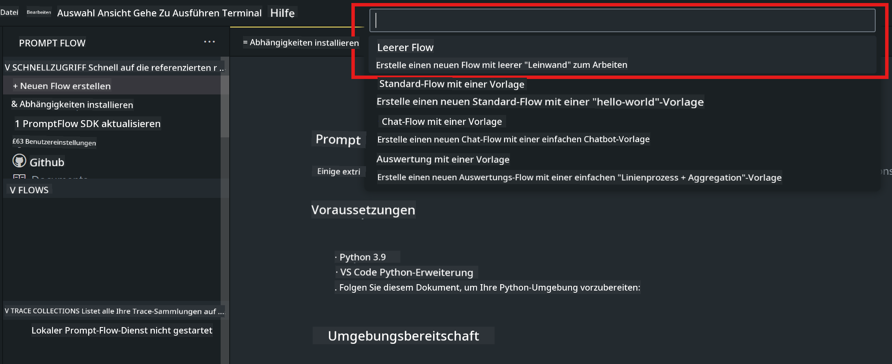
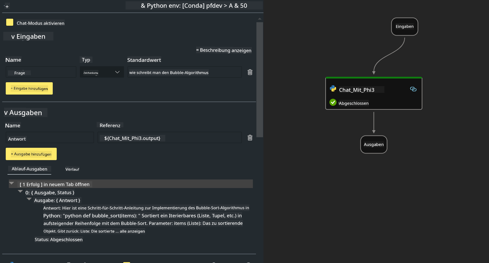
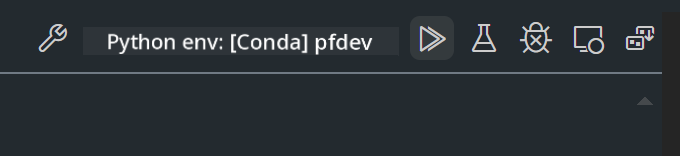

<!--
CO_OP_TRANSLATOR_METADATA:
{
  "original_hash": "bc29f7fe7fc16bed6932733eac8c81b8",
  "translation_date": "2025-05-07T10:55:29+00:00",
  "source_file": "md/02.Application/02.Code/Phi3/VSCodeExt/HOL/AIPC/02.PromptflowWithNPU.md",
  "language_code": "de"
}
-->
# **Lab 2 - Ausführen von Prompt flow mit Phi-3-mini auf AIPC**

## **Was ist Prompt flow**

Prompt flow ist eine Sammlung von Entwicklungstools, die den gesamten Entwicklungszyklus von KI-Anwendungen auf Basis großer Sprachmodelle (LLMs) vereinfachen – von der Ideenfindung, Prototypenerstellung, Tests und Bewertung bis hin zur Produktion und Überwachung. Es macht das Prompt-Engineering deutlich leichter und ermöglicht es Ihnen, LLM-Anwendungen in Produktionsqualität zu erstellen.

Mit Prompt flow können Sie:

- Flows erstellen, die LLMs, Prompts, Python-Code und andere Tools in einem ausführbaren Workflow miteinander verbinden.

- Ihre Flows einfach debuggen und iterieren, insbesondere die Interaktion mit den LLMs.

- Ihre Flows bewerten und Qualitäts- sowie Leistungskennzahlen mit größeren Datensätzen berechnen.

- Tests und Bewertungen in Ihr CI/CD-System integrieren, um die Qualität Ihres Flows sicherzustellen.

- Ihre Flows auf der von Ihnen gewählten Bereitstellungsplattform ausführen oder problemlos in den Code Ihrer Anwendung integrieren.

- (Optional, aber sehr empfohlen) Mit Ihrem Team zusammenarbeiten, indem Sie die Cloud-Version von Prompt flow in Azure AI nutzen.

## **Was ist AIPC**

Ein AI PC verfügt über eine CPU, eine GPU und eine NPU, die jeweils spezielle KI-Beschleunigungsfunktionen bieten. Eine NPU (Neural Processing Unit) ist ein spezialisierter Beschleuniger, der KI- und ML-Aufgaben direkt auf Ihrem PC ausführt, anstatt Daten zur Verarbeitung in die Cloud zu senden. GPU und CPU können diese Aufgaben ebenfalls übernehmen, aber die NPU ist besonders effizient bei KI-Berechnungen mit geringem Stromverbrauch. Der AI PC markiert einen grundlegenden Wandel in der Funktionsweise unserer Computer. Er ist keine Lösung für ein bisher unbekanntes Problem, sondern verspricht eine erhebliche Verbesserung für den Alltag am PC.

Wie funktioniert das? Im Vergleich zu generativer KI und den riesigen großen Sprachmodellen (LLMs), die mit massiven öffentlichen Datenmengen trainiert werden, ist die auf Ihrem PC ablaufende KI auf fast allen Ebenen zugänglicher. Das Konzept ist leichter verständlich, und da es mit Ihren eigenen Daten trainiert wird, ohne Cloud-Zugriff zu benötigen, sind die Vorteile für eine breitere Nutzergruppe sofort spürbar.

Kurzfristig umfasst die AI PC-Welt persönliche Assistenten und kleinere KI-Modelle, die direkt auf Ihrem PC laufen und Ihre Daten nutzen, um persönliche, private und sicherere KI-Verbesserungen für alltägliche Aufgaben zu bieten – wie Protokolle bei Meetings führen, eine Fantasy-Football-Liga organisieren, automatische Verbesserungen bei Foto- und Videobearbeitung oder die perfekte Reiseroute für ein Familientreffen basierend auf Ankunfts- und Abfahrtszeiten erstellen.

## **Erstellen von Generierungscode-Flows auf AIPC**

***Hinweis*** ：Falls Sie die Umgebung noch nicht installiert haben, besuchen Sie bitte [Lab 0 -Installations](./01.Installations.md)

1. Öffnen Sie die Prompt flow-Erweiterung in Visual Studio Code und erstellen Sie ein leeres Flow-Projekt



2. Fügen Sie Eingabe- und Ausgabeparameter hinzu und fügen Sie Python-Code als neuen Flow hinzu



Sie können sich an dieser Struktur (flow.dag.yaml) orientieren, um Ihren Flow zu erstellen

```yaml

inputs:
  question:
    type: string
    default: how to write Bubble Algorithm
outputs:
  answer:
    type: string
    reference: ${Chat_With_Phi3.output}
nodes:
- name: Chat_With_Phi3
  type: python
  source:
    type: code
    path: Chat_With_Phi3.py
  inputs:
    question: ${inputs.question}


```

3. Fügen Sie Code in ***Chat_With_Phi3.py*** ein

```python


from promptflow.core import tool

# import torch
from transformers import AutoTokenizer, pipeline,TextStreamer
import intel_npu_acceleration_library as npu_lib

import warnings

import asyncio
import platform

class Phi3CodeAgent:
    
    model = None
    tokenizer = None
    text_streamer = None
    
    model_id = "microsoft/Phi-3-mini-4k-instruct"

    @staticmethod
    def init_phi3():
        
        if Phi3CodeAgent.model is None or Phi3CodeAgent.tokenizer is None or Phi3CodeAgent.text_streamer is None:
            Phi3CodeAgent.model = npu_lib.NPUModelForCausalLM.from_pretrained(
                                    Phi3CodeAgent.model_id,
                                    torch_dtype="auto",
                                    dtype=npu_lib.int4,
                                    trust_remote_code=True
                                )
            Phi3CodeAgent.tokenizer = AutoTokenizer.from_pretrained(Phi3CodeAgent.model_id)
            Phi3CodeAgent.text_streamer = TextStreamer(Phi3CodeAgent.tokenizer, skip_prompt=True)

    

    @staticmethod
    def chat_with_phi3(prompt):
        
        Phi3CodeAgent.init_phi3()

        messages = "<|system|>You are a AI Python coding assistant. Please help me to generate code in Python.The answer only genertated Python code, but any comments and instructions do not need to be generated<|end|><|user|>" + prompt +"<|end|><|assistant|>"


        generation_args = {
            "max_new_tokens": 1024,
            "return_full_text": False,
            "temperature": 0.3,
            "do_sample": False,
            "streamer": Phi3CodeAgent.text_streamer,
        }

        pipe = pipeline(
            "text-generation",
            model=Phi3CodeAgent.model,
            tokenizer=Phi3CodeAgent.tokenizer,
            # **generation_args
        )

        result = ''

        with warnings.catch_warnings():
            warnings.simplefilter("ignore")
            response = pipe(messages, **generation_args)
            result =response[0]['generated_text']
            return result


@tool
def my_python_tool(question: str) -> str:
    if platform.system() == 'Windows':
        asyncio.set_event_loop_policy(asyncio.WindowsSelectorEventLoopPolicy())
    return Phi3CodeAgent.chat_with_phi3(question)


```

4. Sie können den Flow über Debug oder Run testen, um zu prüfen, ob der Generierungscode funktioniert



5. Führen Sie den Flow als Entwicklungs-API im Terminal aus

```

pf flow serve --source ./ --port 8080 --host localhost   

```

Testen können Sie ihn in Postman / Thunder Client

### **Hinweis**

1. Der erste Lauf dauert lange. Es wird empfohlen, das phi-3 Modell über die Hugging Face CLI herunterzuladen.

2. Aufgrund der begrenzten Rechenleistung der Intel NPU wird empfohlen, Phi-3-mini-4k-instruct zu verwenden.

3. Wir nutzen Intel NPU-Beschleunigung für die INT4-Quantisierung, aber wenn Sie den Service neu starten, müssen Sie die Cache- und nc_workshop-Ordner löschen.

## **Ressourcen**

1. Lernen Sie Promptflow [https://microsoft.github.io/promptflow/](https://microsoft.github.io/promptflow/)

2. Lernen Sie Intel NPU Acceleration [https://github.com/intel/intel-npu-acceleration-library](https://github.com/intel/intel-npu-acceleration-library)

3. Beispielcode, Download [Local NPU Agent Sample Code](../../../../../../../../../code/07.Lab/01/AIPC)

**Haftungsausschluss**:  
Dieses Dokument wurde mithilfe des KI-Übersetzungsdienstes [Co-op Translator](https://github.com/Azure/co-op-translator) übersetzt. Obwohl wir auf Genauigkeit achten, beachten Sie bitte, dass automatisierte Übersetzungen Fehler oder Ungenauigkeiten enthalten können. Das Originaldokument in seiner Ursprungssprache ist als maßgebliche Quelle zu betrachten. Für wichtige Informationen wird eine professionelle menschliche Übersetzung empfohlen. Wir übernehmen keine Haftung für Missverständnisse oder Fehlinterpretationen, die aus der Nutzung dieser Übersetzung entstehen.