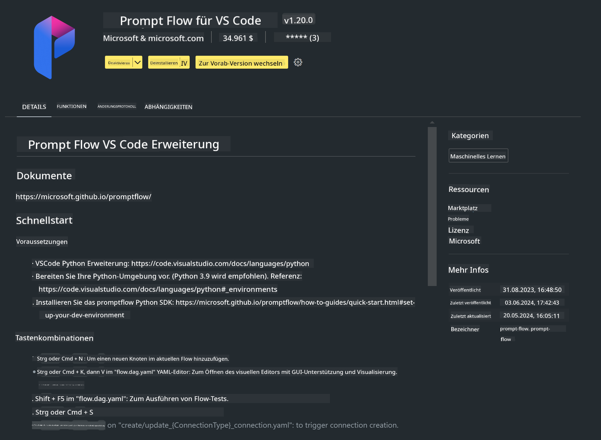

<!--
CO_OP_TRANSLATOR_METADATA:
{
  "original_hash": "4b16264917d9b93169745d92b8ce8c65",
  "translation_date": "2025-05-07T10:58:15+00:00",
  "source_file": "md/02.Application/02.Code/Phi3/VSCodeExt/HOL/Apple/01.Installations.md",
  "language_code": "de"
}
-->
# **Lab 0 - Installation**

Wenn wir das Labor betreten, müssen wir die entsprechende Umgebung konfigurieren:


### **1. Python 3.11+**

Es wird empfohlen, miniforge zu verwenden, um Ihre Python-Umgebung einzurichten.

Zur Konfiguration von miniforge beachten Sie bitte [https://github.com/conda-forge/miniforge](https://github.com/conda-forge/miniforge)

Nach der Einrichtung von miniforge führen Sie folgenden Befehl in Power Shell aus

```bash

conda create -n pyenv python==3.11.8 -y

conda activate pyenv

```


### **2. Installieren Sie das Prompt flow SDK**

In Lab 1 verwenden wir Prompt flow, daher müssen Sie das Prompt flow SDK konfigurieren.

```bash

pip install promptflow --upgrade

```

Sie können das promptflow sdk mit diesem Befehl überprüfen


```bash

pf --version

```

### **3. Installieren Sie die Visual Studio Code Prompt flow Erweiterung**



### **4. Apples MLX Framework**

MLX ist ein Array-Framework für maschinelles Lernen auf Apple Silicon, entwickelt von Apple Machine Learning Research. Mit dem **Apple MLX Framework** können Sie LLM / SLM mit Apple Silicon beschleunigen. Wenn Sie mehr erfahren möchten, lesen Sie [https://github.com/microsoft/PhiCookBook/blob/main/md/01.Introduction/03/MLX_Inference.md](https://github.com/microsoft/PhiCookBook/blob/main/md/01.Introduction/03/MLX_Inference.md).

Installieren Sie die MLX Framework-Bibliothek in bash


```bash

pip install mlx-lm

```


### **5. Weitere Python-Bibliotheken**


Erstellen Sie requirements.txt und fügen Sie diesen Inhalt hinzu

```txt

notebook
numpy 
scipy 
scikit-learn 
matplotlib 
pandas 
pillow 
graphviz

```


### **6. Installieren Sie NVM**

Installieren Sie nvm in Powershell 


```bash

brew install nvm

```

Installieren Sie nodejs 18.20


```bash

nvm install 18.20.0

nvm use 18.20.0

```

### **7. Installieren Sie die Visual Studio Code Entwicklungsunterstützung**


```bash

npm install --global yo generator-code

```

Herzlichen Glückwunsch! Sie haben das SDK erfolgreich eingerichtet. Fahren Sie nun mit den praktischen Schritten fort.

**Haftungsausschluss**:  
Dieses Dokument wurde mit dem KI-Übersetzungsdienst [Co-op Translator](https://github.com/Azure/co-op-translator) übersetzt. Obwohl wir auf Genauigkeit achten, beachten Sie bitte, dass automatisierte Übersetzungen Fehler oder Ungenauigkeiten enthalten können. Das Originaldokument in seiner Ursprungssprache gilt als maßgebliche Quelle. Für wichtige Informationen wird eine professionelle menschliche Übersetzung empfohlen. Wir übernehmen keine Haftung für Missverständnisse oder Fehlinterpretationen, die durch die Verwendung dieser Übersetzung entstehen.