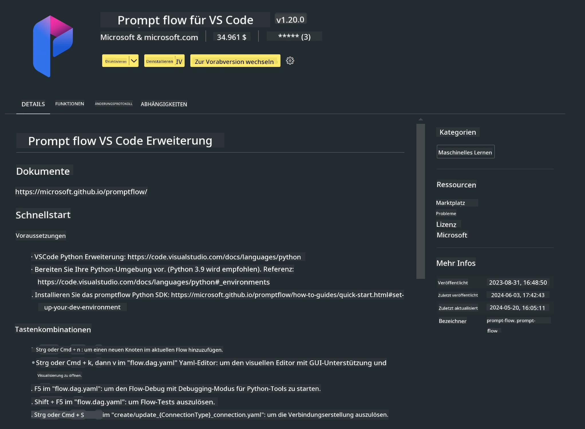

# **Lab 0 - Installation**

Wenn wir das Labor betreten, müssen wir die entsprechende Umgebung einrichten:


### **1. Python 3.11+**

Es wird empfohlen, miniforge zur Konfiguration deiner Python-Umgebung zu verwenden.

Für die Einrichtung von miniforge siehe bitte [https://github.com/conda-forge/miniforge](https://github.com/conda-forge/miniforge)

Nach der Konfiguration von miniforge führe den folgenden Befehl in Power Shell aus

```bash

conda create -n pyenv python==3.11.8 -y

conda activate pyenv

```


### **2. Installation des Prompt flow SDK**

Im Lab 1 verwenden wir Prompt flow, daher musst du das Prompt flow SDK einrichten.

```bash

pip install promptflow --upgrade

```

Du kannst das promptflow SDK mit folgendem Befehl überprüfen


```bash

pf --version

```

### **3. Installation der Visual Studio Code Prompt flow Erweiterung**



### **4. Apples MLX Framework**

MLX ist ein Array-Framework für maschinelles Lernen auf Apple Silicon, entwickelt von Apple Machine Learning Research. Du kannst das **Apple MLX Framework** nutzen, um LLM / SLM mit Apple Silicon zu beschleunigen. Wenn du mehr erfahren möchtest, kannst du hier nachlesen: [https://github.com/microsoft/PhiCookBook/blob/main/md/01.Introduction/03/MLX_Inference.md](https://github.com/microsoft/PhiCookBook/blob/main/md/01.Introduction/03/MLX_Inference.md).

Installiere die MLX Framework-Bibliothek in bash


```bash

pip install mlx-lm

```


### **5. Weitere Python-Bibliotheken**


Erstelle eine requirements.txt und füge diesen Inhalt hinzu

```txt

notebook
numpy 
scipy 
scikit-learn 
matplotlib 
pandas 
pillow 
graphviz

```


### **6. Installation von NVM**

Installiere nvm in Powershell


```bash

brew install nvm

```

Installiere nodejs 18.20


```bash

nvm install 18.20.0

nvm use 18.20.0

```

### **7. Installation der Visual Studio Code Entwicklungsunterstützung**


```bash

npm install --global yo generator-code

```

Herzlichen Glückwunsch! Du hast das SDK erfolgreich eingerichtet. Fahre nun mit den praktischen Schritten fort.

**Haftungsausschluss**:  
Dieses Dokument wurde mit dem KI-Übersetzungsdienst [Co-op Translator](https://github.com/Azure/co-op-translator) übersetzt. Obwohl wir uns um Genauigkeit bemühen, beachten Sie bitte, dass automatisierte Übersetzungen Fehler oder Ungenauigkeiten enthalten können. Das Originaldokument in seiner Ursprungssprache ist als maßgebliche Quelle zu betrachten. Für wichtige Informationen wird eine professionelle menschliche Übersetzung empfohlen. Wir übernehmen keine Haftung für Missverständnisse oder Fehlinterpretationen, die aus der Nutzung dieser Übersetzung entstehen.