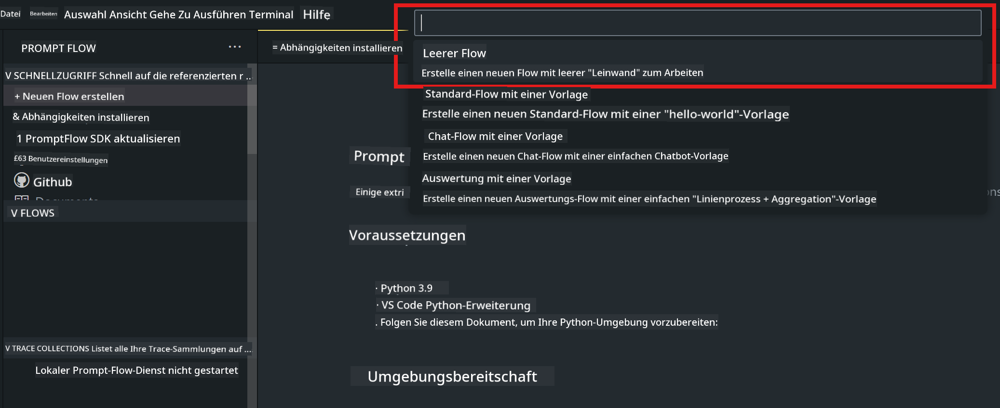
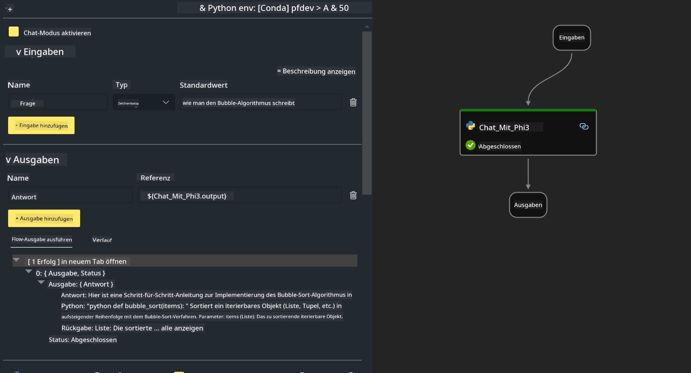

<!--
CO_OP_TRANSLATOR_METADATA:
{
  "original_hash": "3dbbf568625b1ee04b354c2dc81d3248",
  "translation_date": "2025-05-07T10:57:50+00:00",
  "source_file": "md/02.Application/02.Code/Phi3/VSCodeExt/HOL/Apple/02.PromptflowWithMLX.md",
  "language_code": "de"
}
-->
# **Lab 2 - Ausführen von Prompt flow mit Phi-3-mini in AIPC**

## **Was ist Prompt flow**

Prompt flow ist eine Sammlung von Entwicklungstools, die den kompletten Entwicklungszyklus von LLM-basierten KI-Anwendungen vereinfachen – von der Ideenfindung, Prototypenerstellung, Tests und Bewertung bis hin zur Produktionsbereitstellung und Überwachung. Es macht das Prompt-Engineering deutlich einfacher und ermöglicht es Ihnen, LLM-Anwendungen mit Produktionsqualität zu erstellen.

Mit Prompt flow können Sie:

- Flows erstellen, die LLMs, Prompts, Python-Code und andere Tools in einem ausführbaren Workflow verbinden.

- Ihre Flows debuggen und iterieren, insbesondere die Interaktion mit LLMs, ganz einfach.

- Ihre Flows bewerten und Qualitäts- sowie Leistungskennzahlen mit größeren Datensätzen berechnen.

- Tests und Bewertungen in Ihr CI/CD-System integrieren, um die Qualität Ihres Flows sicherzustellen.

- Ihre Flows einfach auf der von Ihnen gewählten Serving-Plattform bereitstellen oder in den Code Ihrer App integrieren.

- (Optional, aber sehr empfohlen) Mit Ihrem Team zusammenarbeiten, indem Sie die Cloud-Version von Prompt flow in Azure AI nutzen.

## **Erstellung von Generierungscode-Flows auf Apple Silicon**

***Note*** ：Falls Sie die Umgebung noch nicht eingerichtet haben, besuchen Sie bitte [Lab 0 -Installations](./01.Installations.md)

1. Öffnen Sie die Prompt flow Extension in Visual Studio Code und erstellen Sie ein leeres Flow-Projekt



2. Fügen Sie Eingabe- und Ausgabeparameter hinzu und fügen Sie Python-Code als neuen Flow hinzu



Sie können sich an dieser Struktur (flow.dag.yaml) orientieren, um Ihren Flow zu erstellen

```yaml

inputs:
  prompt:
    type: string
    default: Write python code for Fibonacci serie. Please use markdown as output
outputs:
  result:
    type: string
    reference: ${gen_code_by_phi3.output}
nodes:
- name: gen_code_by_phi3
  type: python
  source:
    type: code
    path: gen_code_by_phi3.py
  inputs:
    prompt: ${inputs.prompt}


```

3. Quantifizierung von phi-3-mini

Wir möchten SLM besser auf lokalen Geräten ausführen. Generell quantifizieren wir das Modell (INT4, FP16, FP32)

```bash

python -m mlx_lm.convert --hf-path microsoft/Phi-3-mini-4k-instruct

```

**Note:** Der Standardordner ist mlx_model

4. Fügen Sie Code in ***Chat_With_Phi3.py*** ein

```python


from promptflow import tool

from mlx_lm import load, generate


# The inputs section will change based on the arguments of the tool function, after you save the code
# Adding type to arguments and return value will help the system show the types properly
# Please update the function name/signature per need
@tool
def my_python_tool(prompt: str) -> str:

    model_id = './mlx_model_phi3_mini'

    model, tokenizer = load(model_id)

    # <|user|>\nWrite python code for Fibonacci serie. Please use markdown as output<|end|>\n<|assistant|>

    response = generate(model, tokenizer, prompt="<|user|>\n" + prompt  + "<|end|>\n<|assistant|>", max_tokens=2048, verbose=True)

    return response


```

4. Sie können den Flow über Debug oder Run testen, um zu prüfen, ob der Generierungscode funktioniert


5. Führen Sie den Flow als Entwicklungs-API im Terminal aus

```

pf flow serve --source ./ --port 8080 --host localhost   

```

Sie können es in Postman / Thunder Client testen

### **Note**

1. Der erste Lauf dauert lange. Es wird empfohlen, das phi-3 Modell über die Hugging face CLI herunterzuladen.

2. Aufgrund der begrenzten Rechenleistung des Intel NPU wird empfohlen, Phi-3-mini-4k-instruct zu verwenden.

3. Wir nutzen die Intel NPU Beschleunigung zur Quantisierung der INT4-Konvertierung, aber wenn Sie den Dienst neu starten, müssen Sie die Cache- und nc_workshop-Ordner löschen.

## **Ressourcen**

1. Lernen Sie Promptflow [https://microsoft.github.io/promptflow/](https://microsoft.github.io/promptflow/)

2. Lernen Sie Intel NPU Beschleunigung [https://github.com/intel/intel-npu-acceleration-library](https://github.com/intel/intel-npu-acceleration-library)

3. Beispielcode, Download [Local NPU Agent Sample Code](../../../../../../../../../code/07.Lab/01/AIPC/local-npu-agent)

**Haftungsausschluss**:  
Dieses Dokument wurde mithilfe des KI-Übersetzungsdienstes [Co-op Translator](https://github.com/Azure/co-op-translator) übersetzt. Obwohl wir uns um Genauigkeit bemühen, beachten Sie bitte, dass automatisierte Übersetzungen Fehler oder Ungenauigkeiten enthalten können. Das Originaldokument in seiner Ursprungssprache ist als maßgebliche Quelle zu betrachten. Für wichtige Informationen wird eine professionelle menschliche Übersetzung empfohlen. Wir übernehmen keine Haftung für Missverständnisse oder Fehlinterpretationen, die aus der Verwendung dieser Übersetzung entstehen.