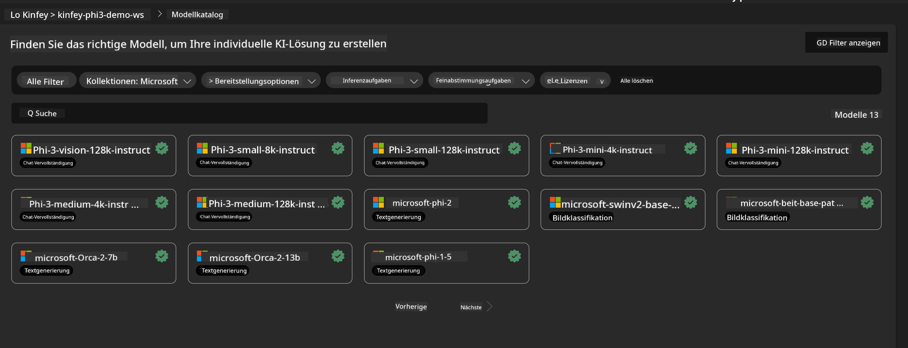
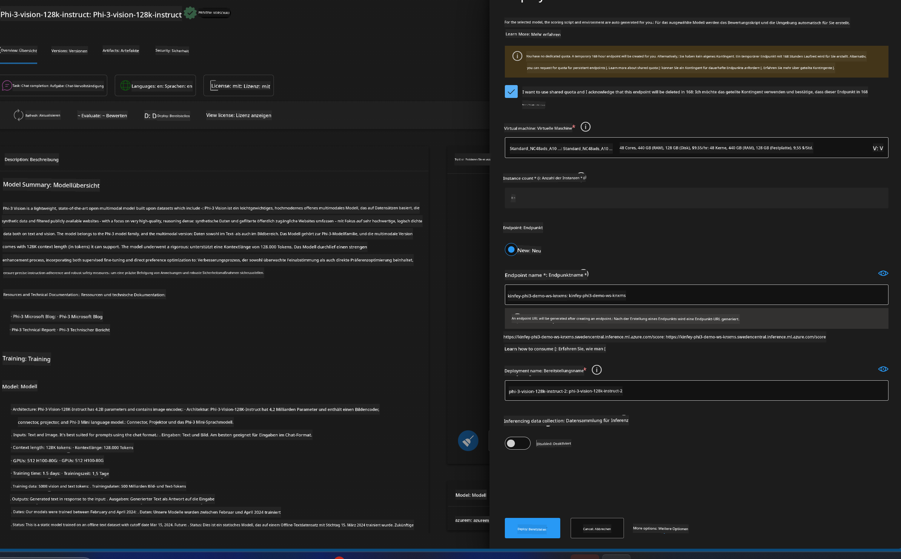
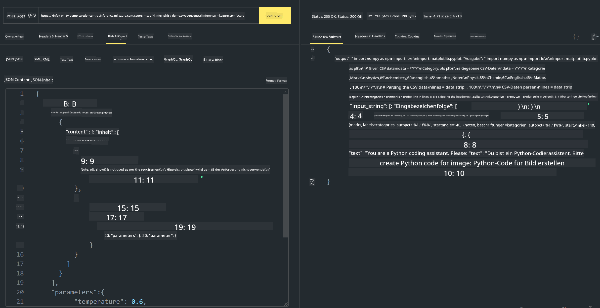

<!--
CO_OP_TRANSLATOR_METADATA:
{
  "original_hash": "20cb4e6ac1686248e8be913ccf6c2bc2",
  "translation_date": "2025-05-07T10:57:04+00:00",
  "source_file": "md/02.Application/02.Code/Phi3/VSCodeExt/HOL/Apple/03.DeployPhi3VisionOnAzure.md",
  "language_code": "de"
}
-->
# **Labor 3 – Phi-3-vision auf Azure Machine Learning Service bereitstellen**

Wir nutzen NPU, um die produktive Bereitstellung des lokalen Codes abzuschließen, und möchten dann die Möglichkeit einführen, PHI-3-VISION darüber zu integrieren, um aus Bildern Code zu generieren.

In dieser Einführung zeigen wir, wie man schnell einen Model As Service Phi-3 Vision Dienst im Azure Machine Learning Service aufbaut.

***Note***: Phi-3 Vision benötigt Rechenleistung, um Inhalte schneller zu generieren. Dafür brauchen wir Cloud-Rechenleistung als Unterstützung.


### **1. Azure Machine Learning Service erstellen**

Wir müssen im Azure-Portal einen Azure Machine Learning Service erstellen. Wenn Sie wissen möchten, wie das geht, besuchen Sie bitte diesen Link [https://learn.microsoft.com/azure/machine-learning/quickstart-create-resources?view=azureml-api-2](https://learn.microsoft.com/azure/machine-learning/quickstart-create-resources?view=azureml-api-2)


### **2. Phi-3 Vision im Azure Machine Learning Service auswählen**




### **3. Phi-3-Vision in Azure bereitstellen**





### **4. Endpoint in Postman testen**





***Note***

1. Die zu übertragenden Parameter müssen Authorization, azureml-model-deployment und Content-Type enthalten. Diese Informationen erhalten Sie aus den Bereitstellungsdetails.

2. Um Parameter zu übermitteln, muss Phi-3-Vision einen Bildlink senden. Bitte orientieren Sie sich an der GPT-4-Vision-Methode zur Parameterübergabe, zum Beispiel

```json

{
  "input_data":{
    "input_string":[
      {
        "role":"user",
        "content":[ 
          {
            "type": "text",
            "text": "You are a Python coding assistant.Please create Python code for image "
          },
          {
              "type": "image_url",
              "image_url": {
                "url": "https://ajaytech.co/wp-content/uploads/2019/09/index.png"
              }
          }
        ]
      }
    ],
    "parameters":{
          "temperature": 0.6,
          "top_p": 0.9,
          "do_sample": false,
          "max_new_tokens": 2048
    }
  }
}

```

3. Rufen Sie **/score** mit der Post-Methode auf

**Herzlichen Glückwunsch**! Sie haben die schnelle PHI-3-VISION-Bereitstellung abgeschlossen und ausprobiert, wie man aus Bildern Code generiert. Als nächstes können wir Anwendungen in Kombination mit NPUs und Cloud-Diensten entwickeln.

**Haftungsausschluss**:  
Dieses Dokument wurde mit dem KI-Übersetzungsdienst [Co-op Translator](https://github.com/Azure/co-op-translator) übersetzt. Obwohl wir auf Genauigkeit achten, beachten Sie bitte, dass automatisierte Übersetzungen Fehler oder Ungenauigkeiten enthalten können. Das Originaldokument in seiner Ursprungssprache ist als maßgebliche Quelle zu betrachten. Für wichtige Informationen wird eine professionelle menschliche Übersetzung empfohlen. Wir übernehmen keine Haftung für Missverständnisse oder Fehlinterpretationen, die durch die Nutzung dieser Übersetzung entstehen.