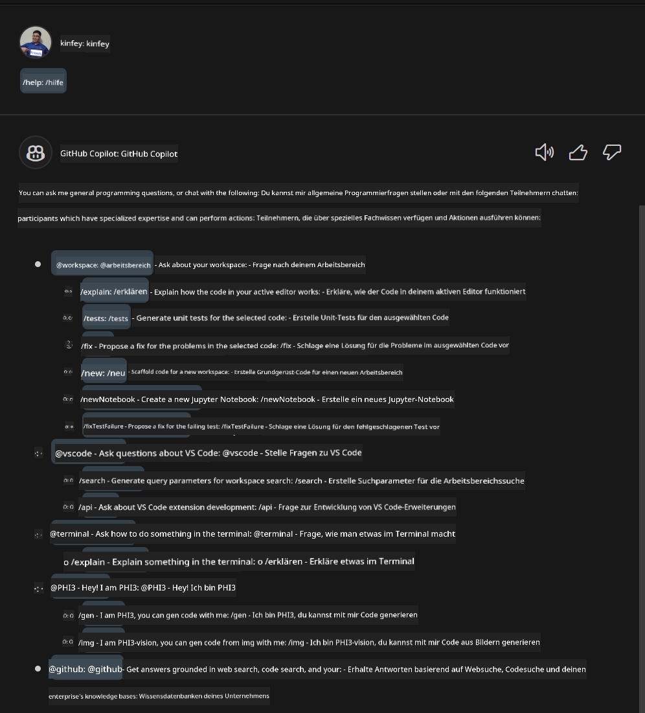
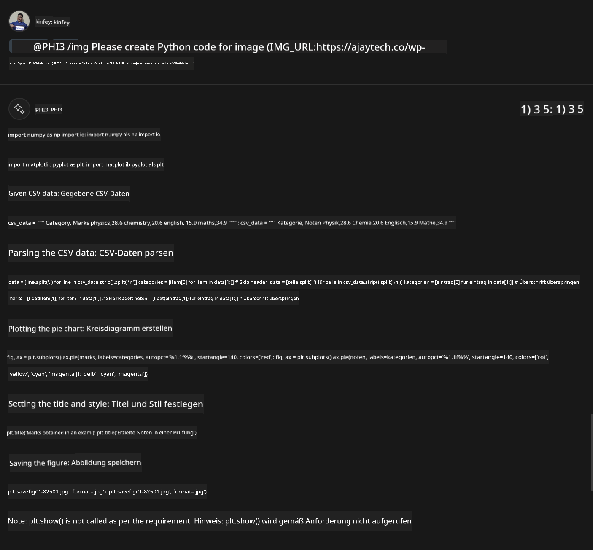

<!--
CO_OP_TRANSLATOR_METADATA:
{
  "original_hash": "df19a4d9fe96fe7335665bede9298a62",
  "translation_date": "2025-05-07T10:57:26+00:00",
  "source_file": "md/02.Application/02.Code/Phi3/VSCodeExt/HOL/Apple/04.CreatePhi3AgentInVSCode.md",
  "language_code": "de"
}
-->
# **Lab 3 - Erstellen eines @PHI3-Agenten in GitHub Copilot Chat**

In Visual Studio Code Copilot Chat können Sie das gesamte Projekt über @workspace verwalten. Für Unternehmensszenarien können wir den Agenten von Copilot Chat auch flexibler anpassen.

Im letzten Lab haben wir das MX-Framework und die Cloud kombiniert, um eine Visual Studio Code-Erweiterung für den Phi3-Agenten zu erstellen.



### **1. Erstellen einer VSCode-Entwicklungserweiterung**

Bitte folgen Sie diesem Link [https://code.visualstudio.com/api/get-started/your-first-extension], um ein Erweiterungsprojekt zu erstellen.

***NOTE:*** Bitte verwenden Sie Typescript und WebPack als technische Lösung für dieses Projekt.

### **2. vscode.d.ts hinzufügen**

Die Visual Studio Code Chat API ist noch nicht in die Code-API integriert, wird aber jetzt über Erweiterungen hinzugefügt.

Laden Sie vscode.d.ts herunter [https://github.com/microsoft/vscode/blob/main/src/vscode-dts/vscode.d.ts]

***NOTE:*** Bitte führen Sie es in Visual Studio Code Insiders 1.90+ aus.

### **3. package.json aktualisieren**

```json

{
  "name": "phi3ext",
  "displayName": "phi3ext",
  "description": "",
  "version": "0.0.1",
  "engines": {
    "vscode": "^1.90.0"
  },
  "categories": [
      "AI",
      "Chat"
  ],
  "activationEvents": [],
  "enabledApiProposals": [
      "chatVariableResolver"
  ],
  "main": "./dist/extension.js",
  "contributes": {
      "chatParticipants": [
          {
              "id": "chat.PHI3",
              "name": "PHI3",
              "description": "Hey! I am PHI3",
              "isSticky": true,
              "commands": [
                  {
                      "name": "gen",
                      "description": "I am PHI3, you can gen code with me"
                  },
                  {
                      "name": "img",
                      "description": "I am PHI3-vision, you can gen code from img with me"
                  }
              ]
          }
      ],
      "commands": [
          {
              "command": "PHI3.namesInEditor",
              "title": "Use PHI3 in Editor"
          }
      ]
  },  
  "scripts": {
    "vscode:prepublish": "npm run package",
    "compile": "webpack",
    "watch": "webpack --watch",
    "package": "webpack --mode production --devtool hidden-source-map",
    "compile-tests": "tsc -p . --outDir out",
    "watch-tests": "tsc -p . -w --outDir out",
    "pretest": "npm run compile-tests && npm run compile && npm run lint",
    "lint": "eslint src --ext ts",
    "test": "vscode-test"
  },
  "devDependencies": {
    "@types/vscode": "^1.90.0",
    "@types/mocha": "^10.0.6",
    "@types/node": "18.x",
    "@typescript-eslint/eslint-plugin": "^7.11.0",
    "@typescript-eslint/parser": "^7.11.0",
    "eslint": "^8.57.0",
    "typescript": "^5.4.5",
    "ts-loader": "^9.5.1",
    "webpack": "^5.91.0",
    "webpack-cli": "^5.1.4",
    "@vscode/test-cli": "^0.0.9",
    "@vscode/test-electron": "^2.4.0"
  },
  "dependencies": {
    "@types/node-fetch": "^2.6.11",
    "node-fetch": "^3.3.2"
  }
}

```

Sie können **npm install** im Terminal ausführen und Ihre Erweiterung debuggen, um sie zu testen.

***Download Sample Code*** [Hier klicken](../../../../../../../../../code/07.Lab/01/Apple)

### **4. Ändern von src/extension.ts**

```ts

// The module 'vscode' contains the VS Code extensibility API
// Import the module and reference it with the alias vscode in your code below
import * as vscode from 'vscode';


interface IPHI3ChatResult extends vscode.ChatResult {
    metadata: {
        command: string;
    }
}


// This method is called when your extension is activated
// Your extension is activated the very first time the command is executed
export function activate(extcontext: vscode.ExtensionContext) {


	// Define a SHEIN chat handler. 
	const phi3handler: vscode.ChatRequestHandler = async (request: vscode.ChatRequest, context: vscode.ChatContext, stream: vscode.ChatResponseStream, token: vscode.CancellationToken): Promise<IPHI3ChatResult> => {

		if (request.command == 'gen') {

			const content = "Welcome to Phi-3 to gen code";

			const result = await gen(request.prompt);

			const code = result;
			
			
			stream.markdown(code)


            return { metadata: { command: 'gen' } };

		}
		if (request.command == 'img') {

			const content = "Welcome to Phi-3 vision to gen code in image";

			const prompt = request.prompt;

			if(prompt.indexOf("(IMG_URL:")>-1){

				const img_url = prompt.split("(IMG_URL:")[1].split(")")[0];
				const question = prompt.split("(IMG_URL:")[0];
				const tmp = question;

				const result = await genImage(question,img_url);
	
				const code = result;
				
				
				stream.markdown(code)
	
	
				return { metadata: { command: 'img' } };
			}
			else
			{
				var result = "Please ask question like this Your question (IMG_URL:https://example.com/image.jpg)";
				stream.markdown(result);
			}


            return { metadata: { command: 'img' } };

		}


		return { metadata: { command: '' } };

	}


	const phi3 = vscode.chat.createChatParticipant("chat.PHI3", phi3handler);

	phi3.iconPath = new vscode.ThemeIcon('sparkle');


    phi3.followupProvider = {
        provideFollowups(result: IPHI3ChatResult, context: vscode.ChatContext, token: vscode.CancellationToken) {
            return [{
                prompt: 'let us code with Phi-3 Family',
                label: vscode.l10n.t('Dev with Phi-3 Family'),
                command: 'help'
            } satisfies vscode.ChatFollowup];
        }
    };

	extcontext.subscriptions.push(phi3);
}


interface GenCode {
	prompt: string;
}

interface ImgGenCodeResponse {
	output: string;
}


interface GenCodeResponse {
	result: string;
}

async function gen(prompt: string) {

	const postData: GenCode = {
		prompt: prompt
	};
	const response = await fetch('http://localhost:8080/score', {
		method: 'POST',
		body: JSON.stringify(postData),
		headers: { 'Content-Type': 'application/json' }
	});
	const post = await response.json();
	const resultResponse = post as GenCodeResponse;
	return resultResponse.result;
}

async function genImage(prompt: string, img_url: string) {

	// const postData: GenCode = {
	// 	question: prompt
	// };
	const response = await fetch('Your Phi-3 Endpoint', {
		method: 'POST',
		body: JSON.stringify({
			"input_data":{
			  "input_string":[
				{
				  "role":"user",
				  "content":[ 
					{
					  "type": "text",
					  "text": prompt
					},
					{
						"type": "image_url",
						"image_url": {
						  "url": img_url
						}
					}
				  ]
				}
			  ],
			  "parameters":{
					"temperature": 0.6,
					"top_p": 0.9,
					"do_sample": false,
					"max_new_tokens": 2048
			  }
			}
		}),
		headers: { 'Content-Type': 'application/json', 'Authorization' : 'Bearer Your Phi-3-Vision Endpoint Key', 'azureml-model-deployment': 'Your Phi-3-Vision Deployment Name' }
	});
	const post = await response.json();
	const resultResponse = post as ImgGenCodeResponse;
	return resultResponse.output;
}

// This method is called when your extension is deactivated
export function deactivate() {}


```

Herzlichen Glückwunsch! Sie haben alle Labs abgeschlossen. Ich hoffe, das hilft Ihnen, die Phi-3-Familie zu verstehen und wie man GitHub Copilot Chat verwendet.

Sie können ***@PHI3 /gen*** ausprobieren


Sie können ***@PHI3 /img*** ausprobieren



**Haftungsausschluss**:  
Dieses Dokument wurde mit dem KI-Übersetzungsdienst [Co-op Translator](https://github.com/Azure/co-op-translator) übersetzt. Obwohl wir uns um Genauigkeit bemühen, beachten Sie bitte, dass automatisierte Übersetzungen Fehler oder Ungenauigkeiten enthalten können. Das Originaldokument in seiner ursprünglichen Sprache ist als maßgebliche Quelle zu betrachten. Für wichtige Informationen wird eine professionelle menschliche Übersetzung empfohlen. Wir übernehmen keine Haftung für Missverständnisse oder Fehlinterpretationen, die aus der Verwendung dieser Übersetzung entstehen.