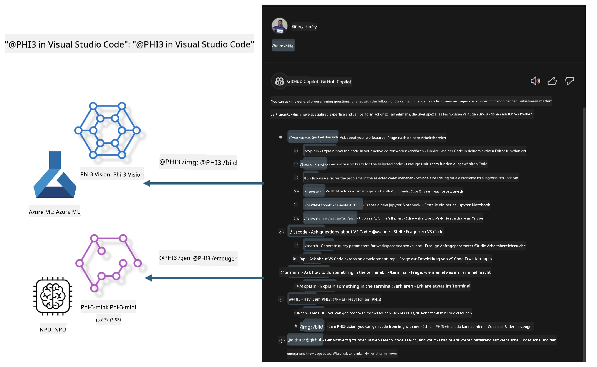

# **Erstelle deinen eigenen Visual Studio Code GitHub Copilot Chat mit der Microsoft Phi-3 Familie**

Hast du den Workspace-Agenten im GitHub Copilot Chat schon verwendet? Möchtest du einen eigenen Code-Agenten für dein Team bauen? Dieses praktische Labor soll das Open-Source-Modell kombinieren, um einen unternehmensgerechten Code-Geschäftsagenten zu erstellen.

## **Grundlagen**

### **Warum Microsoft Phi-3 wählen**

Phi-3 ist eine Familienserie, die phi-3-mini, phi-3-small und phi-3-medium umfasst, basierend auf unterschiedlichen Trainingsparametern für Textgenerierung, Dialogvervollständigung und Codegenerierung. Es gibt außerdem phi-3-vision, das auf Vision basiert. Es eignet sich für Unternehmen oder verschiedene Teams, um Offline-Generative-AI-Lösungen zu erstellen.

Empfohlen wird die Lektüre dieses Links [https://github.com/microsoft/PhiCookBook/blob/main/md/01.Introduction/01/01.PhiFamily.md](https://github.com/microsoft/PhiCookBook/blob/main/md/01.Introduction/01/01.PhiFamily.md)

### **Microsoft GitHub Copilot Chat**

Die GitHub Copilot Chat-Erweiterung bietet dir eine Chat-Oberfläche, mit der du direkt in VS Code mit GitHub Copilot interagieren und Antworten auf codingbezogene Fragen erhalten kannst, ohne Dokumentationen durchsuchen oder Online-Foren konsultieren zu müssen.

Copilot Chat kann Syntaxhervorhebung, Einrückungen und andere Formatierungsfunktionen verwenden, um die generierte Antwort klarer zu gestalten. Je nach Art der Nutzerfrage kann das Ergebnis Links zu Kontexten enthalten, die Copilot zur Antwortgenerierung verwendet hat, wie Quellcodedateien oder Dokumentationen, oder Schaltflächen zum Zugriff auf VS Code-Funktionalitäten.

- Copilot Chat integriert sich in deinen Entwickler-Workflow und unterstützt dich genau dort, wo du Hilfe brauchst:

- Starte eine Inline-Chat-Konversation direkt aus dem Editor oder Terminal, um während des Codens Unterstützung zu erhalten

- Nutze die Chat-Ansicht, um jederzeit einen KI-Assistenten an deiner Seite zu haben

- Starte Quick Chat, um schnell eine Frage zu stellen und sofort wieder weiterzuarbeiten

Du kannst GitHub Copilot Chat in verschiedenen Szenarien verwenden, zum Beispiel:

- Beantwortung von Programmierfragen zur besten Problemlösung

- Erklärung von fremdem Code und Vorschläge zur Verbesserung

- Vorschläge für Codekorrekturen

- Generierung von Unit-Testfällen

- Erstellung von Code-Dokumentationen

Empfohlen wird die Lektüre dieses Links [https://code.visualstudio.com/docs/copilot/copilot-chat](https://code.visualstudio.com/docs/copilot/copilot-chat?WT.mc_id=aiml-137032-kinfeylo)

### **Microsoft GitHub Copilot Chat @workspace**

Die Verwendung von **@workspace** im Copilot Chat ermöglicht es dir, Fragen zu deinem gesamten Codebestand zu stellen. Basierend auf der Frage ruft Copilot intelligent relevante Dateien und Symbole ab, die es dann in seiner Antwort als Links und Codebeispiele referenziert.

Um deine Frage zu beantworten, durchsucht **@workspace** dieselben Quellen, die ein Entwickler beim Navigieren in einem Codebestand in VS Code verwenden würde:

- Alle Dateien im Workspace, außer Dateien, die durch eine .gitignore-Datei ignoriert werden

- Verzeichnisstruktur mit verschachtelten Ordner- und Dateinamen

- GitHubs Code-Suchindex, falls der Workspace ein GitHub-Repository ist und durch Code Search indexiert wurde

- Symbole und Definitionen im Workspace

- Aktuell ausgewählter Text oder sichtbarer Text im aktiven Editor

Hinweis: Die .gitignore wird umgangen, wenn du eine Datei geöffnet hast oder Text in einer ignorierten Datei ausgewählt ist.

Empfohlen wird die Lektüre dieses Links [[https://code.visualstudio.com/docs/copilot/copilot-chat](https://code.visualstudio.com/docs/copilot/workspace-context?WT.mc_id=aiml-137032-kinfeylo)]

## **Mehr über dieses Labor**

GitHub Copilot hat die Programmier-Effizienz in Unternehmen stark verbessert, und jedes Unternehmen möchte die relevanten Funktionen von GitHub Copilot anpassen. Viele Unternehmen haben Erweiterungen ähnlich GitHub Copilot basierend auf ihren eigenen Geschäftsszenarien und Open-Source-Modellen angepasst. Für Unternehmen sind angepasste Erweiterungen leichter zu kontrollieren, was jedoch auch die Nutzererfahrung beeinflusst. Schließlich hat GitHub Copilot stärkere Funktionen im Umgang mit allgemeinen Szenarien und Professionalität. Wenn die Erfahrung konsistent gehalten werden kann, ist es besser, die eigene Unternehmens-Erweiterung anzupassen. GitHub Copilot Chat stellt relevante APIs bereit, damit Unternehmen die Chat-Erfahrung erweitern können. Eine konsistente Erfahrung bei gleichzeitig angepassten Funktionen sorgt für eine bessere Nutzererfahrung.

Dieses Labor verwendet hauptsächlich das Phi-3-Modell in Kombination mit lokalem NPU und Azure-Hybrid, um einen benutzerdefinierten Agenten in GitHub Copilot Chat ***@PHI3*** zu erstellen, der Unternehmensentwickler bei der Codegenerierung***(@PHI3 /gen)*** und der Codeerstellung basierend auf Bildern ***(@PHI3 /img)*** unterstützt.

### ***Hinweis:***

Dieses Labor wird derzeit auf AIPC von Intel CPU und Apple Silicon umgesetzt. Die Qualcomm-Version des NPU wird weiterhin aktualisiert.

## **Labor**

| Name | Beschreibung | AIPC | Apple |
| ------------ | ----------- | -------- |-------- |
| Lab0 - Installationen(✅) | Konfiguration und Installation der benötigten Umgebungen und Tools | [Go](./HOL/AIPC/01.Installations.md) |[Go](./HOL/Apple/01.Installations.md) |
| Lab1 - Ausführen des Prompt-Flows mit Phi-3-mini (✅) | In Kombination mit AIPC / Apple Silicon wird die lokale NPU genutzt, um Codegenerierung mit Phi-3-mini zu erstellen | [Go](./HOL/AIPC/02.PromptflowWithNPU.md) |  [Go](./HOL/Apple/02.PromptflowWithMLX.md) |
| Lab2 - Deployment von Phi-3-vision auf Azure Machine Learning Service(✅) | Codegenerierung durch Deployment des Model Catalogs von Azure Machine Learning Service – Phi-3-vision Bild | [Go](./HOL/AIPC/03.DeployPhi3VisionOnAzure.md) |[Go](./HOL/Apple/03.DeployPhi3VisionOnAzure.md) |
| Lab3 - Erstellen eines @phi-3 Agenten im GitHub Copilot Chat(✅)  | Erstellen eines benutzerdefinierten Phi-3 Agenten im GitHub Copilot Chat zur Codegenerierung, Graph-Code-Erstellung, RAG usw. | [Go](./HOL/AIPC/04.CreatePhi3AgentInVSCode.md) | [Go](./HOL/Apple/04.CreatePhi3AgentInVSCode.md) |
| Beispielcode (✅)  | Beispielcode herunterladen | [Go](../../../../../../../code/07.Lab/01/AIPC) | [Go](../../../../../../../code/07.Lab/01/Apple) |

## **Ressourcen**

1. Phi-3 Cookbook [https://github.com/microsoft/Phi-3CookBook](https://github.com/microsoft/Phi-3CookBook)

2. Mehr über GitHub Copilot erfahren [https://learn.microsoft.com/training/paths/copilot/](https://learn.microsoft.com/training/paths/copilot/?WT.mc_id=aiml-137032-kinfeylo)

3. Mehr über GitHub Copilot Chat erfahren [https://learn.microsoft.com/training/paths/accelerate-app-development-using-github-copilot/](https://learn.microsoft.com/training/paths/accelerate-app-development-using-github-copilot/?WT.mc_id=aiml-137032-kinfeylo)

4. Mehr über die GitHub Copilot Chat API erfahren [https://code.visualstudio.com/api/extension-guides/chat](https://code.visualstudio.com/api/extension-guides/chat?WT.mc_id=aiml-137032-kinfeylo)

5. Mehr über Azure AI Foundry erfahren [https://learn.microsoft.com/training/paths/create-custom-copilots-ai-studio/](https://learn.microsoft.com/training/paths/create-custom-copilots-ai-studio/?WT.mc_id=aiml-137032-kinfeylo)

6. Mehr über den Model Catalog von Azure AI Foundry erfahren [https://learn.microsoft.com/azure/ai-studio/how-to/model-catalog-overview](https://learn.microsoft.com/azure/ai-studio/how-to/model-catalog-overview)

**Haftungsausschluss**:  
Dieses Dokument wurde mit dem KI-Übersetzungsdienst [Co-op Translator](https://github.com/Azure/co-op-translator) übersetzt. Obwohl wir uns um Genauigkeit bemühen, beachten Sie bitte, dass automatisierte Übersetzungen Fehler oder Ungenauigkeiten enthalten können. Das Originaldokument in seiner Ursprungssprache gilt als maßgebliche Quelle. Für wichtige Informationen wird eine professionelle menschliche Übersetzung empfohlen. Wir übernehmen keine Haftung für Missverständnisse oder Fehlinterpretationen, die aus der Nutzung dieser Übersetzung entstehen.