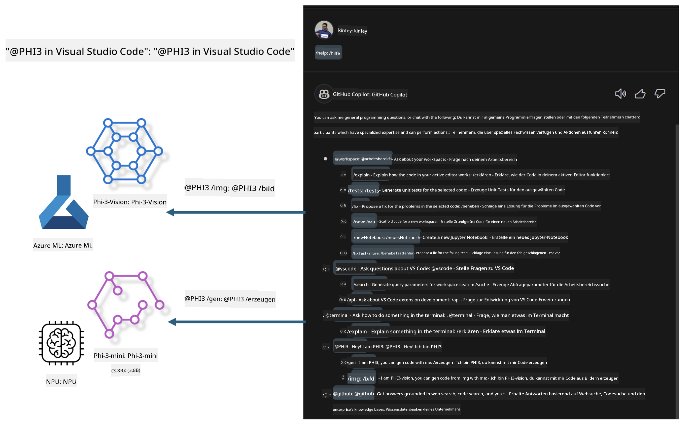

<!--
CO_OP_TRANSLATOR_METADATA:
{
  "original_hash": "00b7a699de8ac405fa821f4c0f7fc0ab",
  "translation_date": "2025-05-07T10:54:45+00:00",
  "source_file": "md/02.Application/02.Code/Phi3/VSCodeExt/README.md",
  "language_code": "de"
}
-->
# **Baue deinen eigenen Visual Studio Code GitHub Copilot Chat mit der Microsoft Phi-3 Familie**

Hast du den Workspace-Agenten im GitHub Copilot Chat schon verwendet? Möchtest du einen eigenen Code-Agenten für dein Team erstellen? Dieses praktische Labor versucht, das Open-Source-Modell zu kombinieren, um einen unternehmensweiten Code-Geschäftsagenten zu entwickeln.

## **Grundlagen**

### **Warum Microsoft Phi-3 wählen**

Phi-3 ist eine Familienserie, die phi-3-mini, phi-3-small und phi-3-medium umfasst, basierend auf unterschiedlichen Trainingsparametern für Textgenerierung, Dialogvervollständigung und Codegenerierung. Es gibt auch phi-3-vision, das auf Vision basiert. Es eignet sich für Unternehmen oder verschiedene Teams, um Offline-generative KI-Lösungen zu erstellen.

Empfohlen wird die Lektüre dieses Links [https://github.com/microsoft/PhiCookBook/blob/main/md/01.Introduction/01/01.PhiFamily.md](https://github.com/microsoft/PhiCookBook/blob/main/md/01.Introduction/01/01.PhiFamily.md)

### **Microsoft GitHub Copilot Chat**

Die GitHub Copilot Chat-Erweiterung bietet eine Chat-Oberfläche, mit der du direkt in VS Code mit GitHub Copilot interagieren und Antworten auf codierungsbezogene Fragen erhalten kannst, ohne Dokumentationen durchsuchen oder Online-Foren konsultieren zu müssen.

Copilot Chat kann Syntaxhervorhebung, Einrückungen und andere Formatierungsfunktionen nutzen, um die generierte Antwort klarer zu machen. Je nach Art der Benutzerfrage kann das Ergebnis Links zu Kontexten enthalten, die Copilot zur Antwortgenerierung verwendet hat, wie Quellcodedateien oder Dokumentationen, oder Schaltflächen zur Nutzung von VS Code-Funktionen.

- Copilot Chat integriert sich in deinen Entwickler-Workflow und bietet Unterstützung genau dort, wo du sie brauchst:

- Starte ein Inline-Chatgespräch direkt aus dem Editor oder Terminal, um Hilfe beim Programmieren zu erhalten

- Nutze die Chat-Ansicht, um jederzeit einen KI-Assistenten an deiner Seite zu haben

- Starte Quick Chat, um schnell eine Frage zu stellen und sofort wieder weiterzuarbeiten

GitHub Copilot Chat kannst du in verschiedenen Szenarien verwenden, wie zum Beispiel:

- Beantwortung von Programmierfragen zur besten Problemlösung

- Erklärung fremden Codes und Vorschläge zur Verbesserung

- Vorschläge für Codekorrekturen

- Erstellung von Unit-Testfällen

- Generierung von Code-Dokumentation

Empfohlen wird die Lektüre dieses Links [https://code.visualstudio.com/docs/copilot/copilot-chat](https://code.visualstudio.com/docs/copilot/copilot-chat?WT.mc_id=aiml-137032-kinfeylo)

###  **Microsoft GitHub Copilot Chat @workspace**

Die Verwendung von **@workspace** im Copilot Chat ermöglicht es dir, Fragen zum gesamten Codebestand zu stellen. Basierend auf der Frage ruft Copilot intelligent relevante Dateien und Symbole ab, die es dann in seiner Antwort als Links und Codebeispiele referenziert.

Um deine Frage zu beantworten, durchsucht **@workspace** dieselben Quellen, die ein Entwickler bei der Navigation im Codebestand in VS Code nutzen würde:

- Alle Dateien im Workspace, außer Dateien, die durch eine .gitignore-Datei ausgeschlossen sind

- Verzeichnisstruktur mit verschachtelten Ordner- und Dateinamen

- GitHubs Code-Suchindex, falls der Workspace ein GitHub-Repository ist und durch die Code-Suche indexiert wurde

- Symbole und Definitionen im Workspace

- Aktuell ausgewählter Text oder sichtbarer Text im aktiven Editor

Hinweis: .gitignore wird ignoriert, wenn du eine Datei geöffnet hast oder Text innerhalb einer ignorierten Datei ausgewählt ist.

Empfohlen wird die Lektüre dieses Links [[https://code.visualstudio.com/docs/copilot/copilot-chat](https://code.visualstudio.com/docs/copilot/workspace-context?WT.mc_id=aiml-137032-kinfeylo)]

## **Mehr über dieses Labor**

GitHub Copilot hat die Programmier-Effizienz in Unternehmen stark verbessert, und jedes Unternehmen möchte die relevanten Funktionen von GitHub Copilot anpassen. Viele Unternehmen haben Erweiterungen entwickelt, die GitHub Copilot ähneln, basierend auf ihren eigenen Geschäftsszenarien und Open-Source-Modellen. Für Unternehmen sind angepasste Erweiterungen leichter zu kontrollieren, allerdings beeinflusst dies auch die Nutzererfahrung. Schließlich bietet GitHub Copilot stärkere Funktionen für allgemeine Szenarien und professionelle Anforderungen. Wenn die Erfahrung konsistent bleibt, ist es besser, die eigene Erweiterung des Unternehmens anzupassen. GitHub Copilot Chat stellt relevante APIs zur Verfügung, damit Unternehmen die Chat-Erfahrung erweitern können. Eine konsistente Nutzererfahrung mit angepassten Funktionen ist die beste Lösung.

Dieses Labor verwendet hauptsächlich das Phi-3 Modell in Kombination mit lokalem NPU und Azure Hybrid, um einen benutzerdefinierten Agenten in GitHub Copilot Chat ***@PHI3*** zu erstellen, der Unternehmensentwickler bei der Codegenerierung***(@PHI3 /gen)*** und der Codeerzeugung basierend auf Bildern ***(@PHI3 /img)*** unterstützt.

### ***Hinweis:***

Dieses Labor wird derzeit auf AIPC mit Intel CPU und Apple Silicon umgesetzt. Die Qualcomm-Version des NPU wird weiterhin aktualisiert.

## **Labor**

| Name | Beschreibung | AIPC | Apple |
| ------------ | ----------- | -------- |-------- |
| Lab0 - Installations(✅) | Konfiguration und Installation der benötigten Umgebungen und Tools | [Go](./HOL/AIPC/01.Installations.md) |[Go](./HOL/Apple/01.Installations.md) |
| Lab1 - Ausführen des Promptflows mit Phi-3-mini (✅) | In Kombination mit AIPC / Apple Silicon wird die lokale NPU verwendet, um Codegenerierung mit Phi-3-mini zu erstellen | [Go](./HOL/AIPC/02.PromptflowWithNPU.md) |  [Go](./HOL/Apple/02.PromptflowWithMLX.md) |
| Lab2 - Deployment von Phi-3-vision auf Azure Machine Learning Service(✅) | Codegenerierung durch Deployment des Modellkatalogs von Azure Machine Learning Service - Phi-3-vision Bild | [Go](./HOL/AIPC/03.DeployPhi3VisionOnAzure.md) |[Go](./HOL/Apple/03.DeployPhi3VisionOnAzure.md) |
| Lab3 - Erstellen eines @phi-3 Agenten im GitHub Copilot Chat(✅)  | Erstelle einen benutzerdefinierten Phi-3 Agenten im GitHub Copilot Chat, um Codegenerierung, Graph-Code-Generierung, RAG usw. abzuschließen | [Go](./HOL/AIPC/04.CreatePhi3AgentInVSCode.md) | [Go](./HOL/Apple/04.CreatePhi3AgentInVSCode.md) |
| Beispielcode (✅)  | Beispielcode herunterladen | [Go](../../../../../../../code/07.Lab/01/AIPC) | [Go](../../../../../../../code/07.Lab/01/Apple) |

## **Ressourcen**

1. Phi-3 Cookbook [https://github.com/microsoft/Phi-3CookBook](https://github.com/microsoft/Phi-3CookBook)

2. Mehr über GitHub Copilot erfahren [https://learn.microsoft.com/training/paths/copilot/](https://learn.microsoft.com/training/paths/copilot/?WT.mc_id=aiml-137032-kinfeylo)

3. Mehr über GitHub Copilot Chat erfahren [https://learn.microsoft.com/training/paths/accelerate-app-development-using-github-copilot/](https://learn.microsoft.com/training/paths/accelerate-app-development-using-github-copilot/?WT.mc_id=aiml-137032-kinfeylo)

4. Mehr über GitHub Copilot Chat API erfahren [https://code.visualstudio.com/api/extension-guides/chat](https://code.visualstudio.com/api/extension-guides/chat?WT.mc_id=aiml-137032-kinfeylo)

5. Mehr über Azure AI Foundry erfahren [https://learn.microsoft.com/training/paths/create-custom-copilots-ai-studio/](https://learn.microsoft.com/training/paths/create-custom-copilots-ai-studio/?WT.mc_id=aiml-137032-kinfeylo)

6. Mehr über den Modellkatalog von Azure AI Foundry erfahren [https://learn.microsoft.com/azure/ai-studio/how-to/model-catalog-overview](https://learn.microsoft.com/azure/ai-studio/how-to/model-catalog-overview)

**Haftungsausschluss**:  
Dieses Dokument wurde mithilfe des KI-Übersetzungsdienstes [Co-op Translator](https://github.com/Azure/co-op-translator) übersetzt. Obwohl wir uns um Genauigkeit bemühen, beachten Sie bitte, dass automatisierte Übersetzungen Fehler oder Ungenauigkeiten enthalten können. Das Originaldokument in seiner ursprünglichen Sprache gilt als maßgebliche Quelle. Für wichtige Informationen wird eine professionelle menschliche Übersetzung empfohlen. Wir übernehmen keine Haftung für Missverständnisse oder Fehlinterpretationen, die aus der Nutzung dieser Übersetzung entstehen.