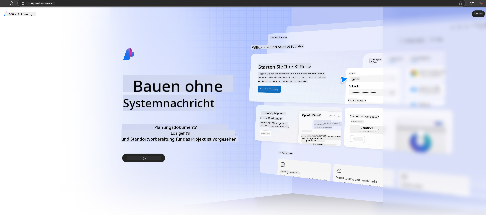

<!--
CO_OP_TRANSLATOR_METADATA:
{
  "original_hash": "3a1e48b628022485aac989c9f733e792",
  "translation_date": "2025-05-07T10:20:09+00:00",
  "source_file": "md/02.QuickStart/AzureAIFoundry_QuickStart.md",
  "language_code": "de"
}
-->
# **Verwendung von Phi-3 in Azure AI Foundry**

Mit der Entwicklung von Generative AI möchten wir eine einheitliche Plattform nutzen, um verschiedene LLM und SLM, die Integration von Unternehmensdaten, Fine-Tuning/RAG-Operationen sowie die Bewertung verschiedener Unternehmensbereiche nach der Integration von LLM und SLM zu verwalten, damit generative KI in Smart-Anwendungen besser umgesetzt werden kann. [Azure AI Foundry](https://ai.azure.com) ist eine generische KI-Anwendungsplattform auf Unternehmensebene.

Mit Azure AI Foundry können Sie die Antworten großer Sprachmodelle (LLM) bewerten und Prompt-Anwendungskomponenten mit Prompt Flow orchestrieren, um die Leistung zu verbessern. Die Plattform erleichtert die Skalierbarkeit, um Proof of Concepts mühelos in vollwertige Produktionen zu überführen. Kontinuierliche Überwachung und Verfeinerung unterstützen den langfristigen Erfolg.

Wir können das Phi-3-Modell schnell über einfache Schritte auf Azure AI Foundry bereitstellen und anschließend Azure AI Foundry nutzen, um Phi-3-bezogene Playground/Chat-, Fine-Tuning-, Evaluierungs- und weitere Aufgaben abzuwickeln.

## **1. Vorbereitung**

Wenn Sie bereits die [Azure Developer CLI](https://learn.microsoft.com/azure/developer/azure-developer-cli/overview?WT.mc_id=aiml-138114-kinfeylo) auf Ihrem Rechner installiert haben, ist die Verwendung dieser Vorlage so einfach wie das Ausführen dieses Befehls in einem neuen Verzeichnis.

## Manuelle Erstellung

Die Erstellung eines Microsoft Azure AI Foundry-Projekts und Hubs ist eine gute Möglichkeit, Ihre KI-Arbeiten zu organisieren und zu verwalten. Hier eine Schritt-für-Schritt-Anleitung zum Einstieg:

### Erstellen eines Projekts in Azure AI Foundry

1. **Gehen Sie zu Azure AI Foundry**: Melden Sie sich im Azure AI Foundry-Portal an.
2. **Projekt erstellen**:
   - Wenn Sie sich bereits in einem Projekt befinden, wählen Sie oben links auf der Seite „Azure AI Foundry“, um zur Startseite zu gelangen.
   - Wählen Sie „+ Create project“.
   - Geben Sie einen Namen für das Projekt ein.
   - Wenn Sie einen Hub haben, wird dieser standardmäßig ausgewählt. Falls Sie Zugriff auf mehrere Hubs haben, können Sie einen anderen aus dem Dropdown-Menü auswählen. Wenn Sie einen neuen Hub erstellen möchten, wählen Sie „Create new hub“ und geben Sie einen Namen ein.
   - Wählen Sie „Create“.

### Erstellen eines Hubs in Azure AI Foundry

1. **Gehen Sie zu Azure AI Foundry**: Melden Sie sich mit Ihrem Azure-Konto an.
2. **Hub erstellen**:
   - Wählen Sie im linken Menü das Management Center aus.
   - Wählen Sie „All resources“, dann den Pfeil neben „+ New project“ und anschließend „+ New hub“.
   - Geben Sie im Dialog „Create a new hub“ einen Namen für Ihren Hub ein (z. B. contoso-hub) und passen Sie die weiteren Felder nach Wunsch an.
   - Wählen Sie „Next“, überprüfen Sie die Angaben und klicken Sie auf „Create“.

Für ausführlichere Anweisungen können Sie die offizielle [Microsoft-Dokumentation](https://learn.microsoft.com/azure/ai-studio/how-to/create-projects) konsultieren.

Nach erfolgreicher Erstellung können Sie auf das erstellte Studio über [ai.azure.com](https://ai.azure.com/) zugreifen.

In einem AI Foundry können mehrere Projekte existieren. Erstellen Sie ein Projekt in AI Foundry zur Vorbereitung.

Erstellen Sie Azure AI Foundry [QuickStarts](https://learn.microsoft.com/azure/ai-studio/quickstarts/get-started-code)

## **2. Bereitstellung eines Phi-Modells in Azure AI Foundry**

Klicken Sie auf die Option „Explore“ des Projekts, um den Model Catalog zu öffnen, und wählen Sie Phi-3 aus.

Wählen Sie Phi-3-mini-4k-instruct aus.

Klicken Sie auf „Deploy“, um das Modell Phi-3-mini-4k-instruct bereitzustellen.

> [!NOTE]
>
> Sie können beim Bereitstellen die Rechenleistung auswählen.

## **3. Playground Chat Phi in Azure AI Foundry**

Gehen Sie zur Bereitstellungsseite, wählen Sie Playground und chatten Sie mit Phi-3 von Azure AI Foundry.

## **4. Modellbereitstellung aus Azure AI Foundry**

Um ein Modell aus dem Azure Model Catalog bereitzustellen, gehen Sie wie folgt vor:

- Melden Sie sich bei Azure AI Foundry an.
- Wählen Sie das Modell aus dem Azure AI Foundry Model Catalog aus, das Sie bereitstellen möchten.
- Wählen Sie auf der Detailseite des Modells „Deploy“ und anschließend „Serverless API with Azure AI Content Safety“.
- Wählen Sie das Projekt aus, in dem Sie Ihre Modelle bereitstellen möchten. Um das Serverless API-Angebot zu nutzen, muss Ihr Workspace in der Region East US 2 oder Sweden Central liegen. Sie können den Namen der Bereitstellung anpassen.
- Wählen Sie im Bereitstellungsassistenten „Pricing and terms“, um Informationen zu Preisen und Nutzungsbedingungen zu erhalten.
- Wählen Sie „Deploy“. Warten Sie, bis die Bereitstellung abgeschlossen ist und Sie zur Seite „Deployments“ weitergeleitet werden.
- Wählen Sie „Open in playground“, um mit dem Modell zu interagieren.
- Sie können jederzeit zur Seite „Deployments“ zurückkehren, die Bereitstellung auswählen und die Ziel-URL des Endpunkts sowie den Secret Key notieren, die Sie zum Aufrufen der Bereitstellung und zum Generieren von Ausgaben verwenden können.
- Details zum Endpunkt, URL und Zugriffsschlüssel finden Sie jederzeit im Tab „Build“ unter „Deployments“ im Bereich „Components“.

> [!NOTE]
> Bitte beachten Sie, dass Ihr Konto über die Azure AI Developer-Rollenberechtigungen für die Ressourcengruppe verfügen muss, um diese Schritte auszuführen.

## **5. Verwendung der Phi API in Azure AI Foundry**

Sie können über Postman mit GET auf https://{Your project name}.region.inference.ml.azure.com/swagger.json zugreifen und in Kombination mit dem Key die bereitgestellten Schnittstellen kennenlernen.

So erhalten Sie sehr bequem die Anfrageparameter sowie die Antwortparameter.

**Haftungsausschluss**:  
Dieses Dokument wurde mit dem KI-Übersetzungsdienst [Co-op Translator](https://github.com/Azure/co-op-translator) übersetzt. Obwohl wir auf Genauigkeit achten, beachten Sie bitte, dass automatisierte Übersetzungen Fehler oder Ungenauigkeiten enthalten können. Das Originaldokument in seiner Ausgangssprache ist als maßgebliche Quelle zu betrachten. Für wichtige Informationen wird eine professionelle menschliche Übersetzung empfohlen. Wir übernehmen keine Haftung für Missverständnisse oder Fehlinterpretationen, die aus der Verwendung dieser Übersetzung entstehen.