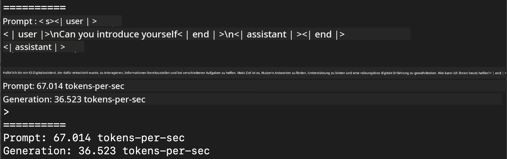
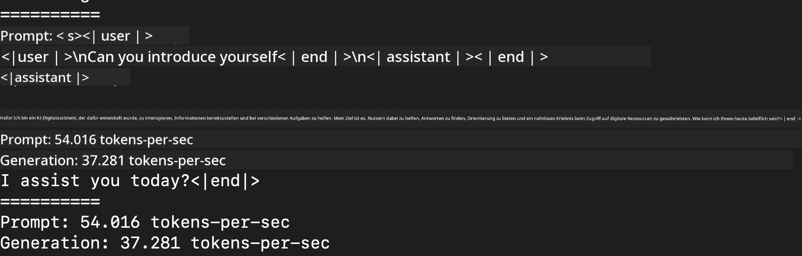
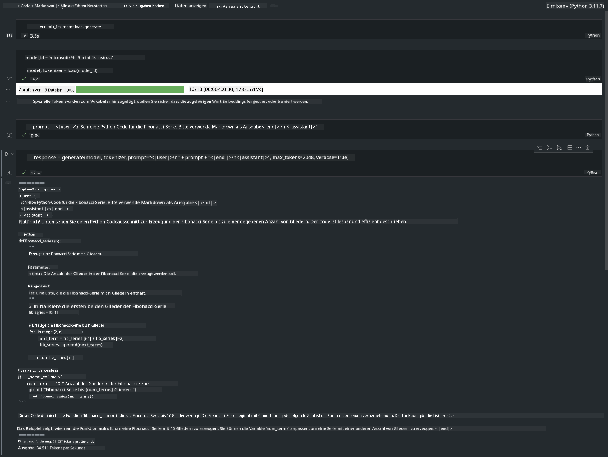

<!--
CO_OP_TRANSLATOR_METADATA:
{
  "original_hash": "dcb656f3d206fc4968e236deec5d4384",
  "translation_date": "2025-05-07T10:34:03+00:00",
  "source_file": "md/03.FineTuning/03.Inference/MLX_Inference.md",
  "language_code": "de"
}
-->
# **Inference Phi-3 mit Apple MLX Framework**

## **Was ist das MLX Framework**

MLX ist ein Array-Framework für maschinelles Lernen auf Apple Silicon, entwickelt von Apple Machine Learning Research.

MLX wurde von Forschern für Forscher im Bereich maschinelles Lernen entwickelt. Das Framework soll benutzerfreundlich sein, dabei aber effizient für das Training und den Einsatz von Modellen. Das Design des Frameworks ist zudem konzeptionell einfach gehalten. Wir möchten es Forschern leicht machen, MLX zu erweitern und zu verbessern, um neue Ideen schnell zu erforschen.

LLMs können auf Apple Silicon Geräten durch MLX beschleunigt werden, und Modelle können sehr bequem lokal ausgeführt werden.

## **Phi-3-mini mit MLX inferieren**

### **1. MLX Umgebung einrichten**

1. Python 3.11.x  
2. MLX Library installieren

```bash

pip install mlx-lm

```

### **2. Phi-3-mini im Terminal mit MLX ausführen**

```bash

python -m mlx_lm.generate --model microsoft/Phi-3-mini-4k-instruct --max-token 2048 --prompt  "<|user|>\nCan you introduce yourself<|end|>\n<|assistant|>"

```

Das Ergebnis (meine Umgebung ist Apple M1 Max, 64GB) ist



### **3. Phi-3-mini mit MLX im Terminal quantisieren**

```bash

python -m mlx_lm.convert --hf-path microsoft/Phi-3-mini-4k-instruct

```

***Note：*** Das Modell kann mit mlx_lm.convert quantisiert werden, die Standardquantisierung ist INT4. In diesem Beispiel wird Phi-3-mini auf INT4 quantisiert.

Das Modell kann mit mlx_lm.convert quantisiert werden, die Standardquantisierung ist INT4. Dieses Beispiel quantisiert Phi-3-mini zu INT4. Nach der Quantisierung wird es im Standardverzeichnis ./mlx_model gespeichert.

Wir können das mit MLX quantisierte Modell im Terminal testen

```bash

python -m mlx_lm.generate --model ./mlx_model/ --max-token 2048 --prompt  "<|user|>\nCan you introduce yourself<|end|>\n<|assistant|>"

```

Das Ergebnis ist



### **4. Phi-3-mini mit MLX im Jupyter Notebook ausführen**



***Note:*** Bitte lesen Sie dieses Beispiel [click this link](../../../../../code/03.Inference/MLX/MLX_DEMO.ipynb)

## **Ressourcen**

1. Mehr zum Apple MLX Framework erfahren [https://ml-explore.github.io](https://ml-explore.github.io/mlx/build/html/index.html)

2. Apple MLX GitHub Repo [https://github.com/ml-explore](https://github.com/ml-explore)

**Haftungsausschluss**:  
Dieses Dokument wurde mit dem KI-Übersetzungsdienst [Co-op Translator](https://github.com/Azure/co-op-translator) übersetzt. Obwohl wir uns um Genauigkeit bemühen, beachten Sie bitte, dass automatisierte Übersetzungen Fehler oder Ungenauigkeiten enthalten können. Das Originaldokument in seiner Ursprungssprache ist als maßgebliche Quelle zu betrachten. Für wichtige Informationen wird eine professionelle menschliche Übersetzung empfohlen. Wir übernehmen keine Haftung für Missverständnisse oder Fehlinterpretationen, die aus der Nutzung dieser Übersetzung entstehen.