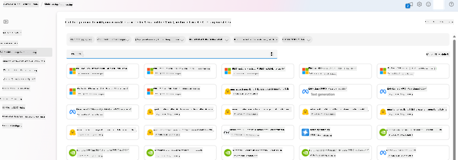
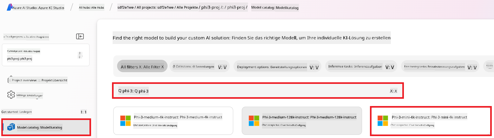
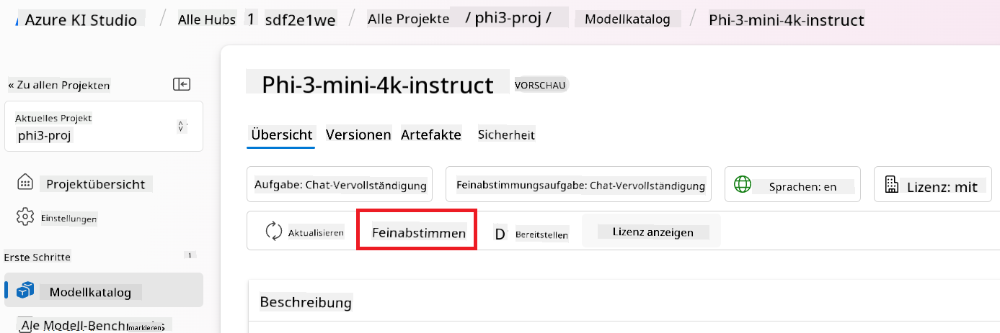

<!--
CO_OP_TRANSLATOR_METADATA:
{
  "original_hash": "c1559c5af6caccf6f623fd43a6b3a9a3",
  "translation_date": "2025-07-17T05:54:52+00:00",
  "source_file": "md/03.FineTuning/FineTuning_AIFoundry.md",
  "language_code": "de"
}
-->
# Feinabstimmung von Phi-3 mit Azure AI Foundry

Lassen Sie uns erkunden, wie man das Sprachmodell Phi-3 Mini von Microsoft mit Azure AI Foundry feinabstimmt. Die Feinabstimmung ermöglicht es, Phi-3 Mini an spezifische Aufgaben anzupassen und macht es dadurch noch leistungsfähiger und kontextsensitiver.

## Überlegungen

- **Fähigkeiten:** Welche Modelle sind feinabstimmbar? Wozu kann das Basismodell feinabgestimmt werden?
- **Kosten:** Wie sieht das Preismodell für die Feinabstimmung aus?
- **Anpassbarkeit:** Wie stark kann ich das Basismodell verändern – und auf welche Weise?
- **Bequemlichkeit:** Wie läuft die Feinabstimmung tatsächlich ab – muss ich eigenen Code schreiben? Benötige ich eigene Rechenressourcen?
- **Sicherheit:** Feinabgestimmte Modelle bergen bekannte Sicherheitsrisiken – gibt es Schutzmechanismen, die unbeabsichtigte Schäden verhindern?



## Vorbereitung der Feinabstimmung

### Voraussetzungen

> [!NOTE]
> Für Modelle der Phi-3-Familie ist das Pay-as-you-go-Angebot zur Feinabstimmung nur mit Hubs verfügbar, die in der Region **East US 2** erstellt wurden.

- Ein Azure-Abonnement. Falls Sie noch keines haben, erstellen Sie ein [kostenpflichtiges Azure-Konto](https://azure.microsoft.com/pricing/purchase-options/pay-as-you-go), um zu starten.

- Ein [AI Foundry-Projekt](https://ai.azure.com?WT.mc_id=aiml-138114-kinfeylo).
- Azure rollenbasierte Zugriffssteuerungen (Azure RBAC) werden verwendet, um Zugriffsrechte für Operationen in Azure AI Foundry zu vergeben. Um die Schritte in diesem Artikel auszuführen, muss Ihr Benutzerkonto die __Azure AI Developer Rolle__ auf der Ressourcengruppe zugewiesen bekommen haben.

### Registrierung des Abonnementanbieters

Stellen Sie sicher, dass das Abonnement beim Ressourcendienstanbieter `Microsoft.Network` registriert ist.

1. Melden Sie sich im [Azure-Portal](https://portal.azure.com) an.
1. Wählen Sie im linken Menü **Abonnements** aus.
1. Wählen Sie das gewünschte Abonnement aus.
1. Wählen Sie im linken Menü **AI-Projekteinstellungen** > **Ressourcenanbieter**.
1. Bestätigen Sie, dass **Microsoft.Network** in der Liste der Ressourcenanbieter enthalten ist. Falls nicht, fügen Sie es hinzu.

### Datenvorbereitung

Bereiten Sie Ihre Trainings- und Validierungsdaten vor, um Ihr Modell feinabzustimmen. Ihre Trainings- und Validierungsdatensätze bestehen aus Eingabe- und Ausgabe-Beispielen, die zeigen, wie das Modell arbeiten soll.

Stellen Sie sicher, dass alle Trainingsbeispiele dem erwarteten Format für die Inferenz entsprechen. Für eine effektive Feinabstimmung sollten die Datensätze ausgewogen und vielfältig sein.

Das bedeutet, ein Gleichgewicht in den Daten zu wahren, verschiedene Szenarien einzubeziehen und die Trainingsdaten regelmäßig zu verfeinern, um realen Erwartungen zu entsprechen. So erzielen Sie genauere und ausgewogenere Modellantworten.

Verschiedene Modelltypen erfordern unterschiedliche Formate der Trainingsdaten.

### Chat Completion

Die Trainings- und Validierungsdaten müssen als JSON Lines (JSONL) Dokument formatiert sein. Für `Phi-3-mini-128k-instruct` muss der Feinabstimmungsdatensatz im Konversationsformat vorliegen, das von der Chat Completions API verwendet wird.

### Beispiel-Dateiformat

```json
    {"messages": [{"role": "system", "content": "You are an Xbox customer support agent whose primary goal is to help users with issues they are experiencing with their Xbox devices. You are friendly and concise. You only provide factual answers to queries, and do not provide answers that are not related to Xbox."}, {"role": "user", "content": "Is Xbox better than PlayStation?"}, {"role": "assistant", "content": "I apologize, but I cannot provide personal opinions. My primary job is to assist you with any issues related to your Xbox device. Do you have any Xbox-related issues that need addressing?"}]}
    {"messages": [{"role": "system", "content": "You are an Xbox customer support agent whose primary goal is to help users with issues they are experiencing with their Xbox devices. You are friendly and concise. You only provide factual answers to queries, and do not provide answers that are not related to Xbox."}, {"role": "user", "content": "Can I play PC games on my Xbox?"}, {"role": "assistant", "content": "While Xbox consoles don't natively support PC games, they can play an array of Xbox games, many of which are also available on PC. Can I assist you with finding games compatible with your Xbox device?"}]}
    {"messages": [{"role": "system", "content": "You are an Xbox customer support agent whose primary goal is to help users with issues they are experiencing with their Xbox devices. You are friendly and concise. You only provide factual answers to queries, and do not provide answers that are not related to Xbox."}, {"role": "user", "content": "I'm having trouble connecting my Xbox to the Wi-Fi."}, {"role": "assistant", "content": "No worries, let's go through the network settings on your Xbox. Can you please tell me what happens when you try to connect it to the Wi-Fi?"}]}
```

Der unterstützte Dateityp ist JSON Lines. Dateien werden im Standard-Datenspeicher hochgeladen und in Ihrem Projekt verfügbar gemacht.

## Feinabstimmung von Phi-3 mit Azure AI Foundry

Azure AI Foundry ermöglicht es, große Sprachmodelle an eigene Datensätze anzupassen, indem ein Prozess namens Feinabstimmung verwendet wird. Die Feinabstimmung bietet großen Mehrwert, indem sie Anpassungen und Optimierungen für spezifische Aufgaben und Anwendungen erlaubt. Das führt zu besserer Leistung, Kosteneffizienz, geringerer Latenz und maßgeschneiderten Ergebnissen.


### Neues Projekt erstellen

1. Melden Sie sich bei [Azure AI Foundry](https://ai.azure.com) an.

1. Wählen Sie **+New project**, um ein neues Projekt in Azure AI Foundry zu erstellen.

    

1. Führen Sie folgende Schritte aus:

    - Projekt-**Hub-Name**. Dieser muss eindeutig sein.
    - Wählen Sie den **Hub** aus, den Sie verwenden möchten (bei Bedarf neu erstellen).

    

1. Führen Sie folgende Schritte aus, um einen neuen Hub zu erstellen:

    - Geben Sie den **Hub-Namen** ein. Dieser muss eindeutig sein.
    - Wählen Sie Ihr Azure-**Abonnement**.
    - Wählen Sie die **Ressourcengruppe** aus (bei Bedarf neu erstellen).
    - Wählen Sie den **Standort** aus, den Sie verwenden möchten.
    - Wählen Sie die **Connect Azure AI Services** aus (bei Bedarf neu erstellen).
    - Wählen Sie bei **Connect Azure AI Search** die Option **Skip connecting**.

    

1. Wählen Sie **Next**.
1. Wählen Sie **Create a project**.

### Datenvorbereitung

Sammeln oder erstellen Sie vor der Feinabstimmung einen Datensatz, der für Ihre Aufgabe relevant ist, z. B. Chat-Anweisungen, Frage-Antwort-Paare oder andere passende Textdaten. Bereinigen und verarbeiten Sie diese Daten vor, indem Sie Rauschen entfernen, fehlende Werte behandeln und den Text tokenisieren.

### Feinabstimmung von Phi-3-Modellen in Azure AI Foundry

> [!NOTE]
> Die Feinabstimmung von Phi-3-Modellen wird derzeit nur in Projekten unterstützt, die sich in East US 2 befinden.

1. Wählen Sie im linken Tab **Model catalog** aus.

1. Geben Sie *phi-3* in die **Suchleiste** ein und wählen Sie das Phi-3-Modell aus, das Sie verwenden möchten.

    

1. Wählen Sie **Fine-tune**.

    

1. Geben Sie den **Namen des feinabgestimmten Modells** ein.

    

1. Wählen Sie **Next**.

1. Führen Sie folgende Schritte aus:

    - Wählen Sie den **Aufgabentyp** als **Chat completion**.
    - Wählen Sie die **Trainingsdaten** aus, die Sie verwenden möchten. Sie können diese über Azure AI Foundry hochladen oder aus Ihrer lokalen Umgebung auswählen.

    

1. Wählen Sie **Next**.

1. Laden Sie die **Validierungsdaten** hoch, die Sie verwenden möchten, oder wählen Sie **Automatische Aufteilung der Trainingsdaten**.

    

1. Wählen Sie **Next**.

1. Führen Sie folgende Schritte aus:

    - Wählen Sie den gewünschten **Batch-Größen-Multiplikator**.
    - Wählen Sie die gewünschte **Lernrate**.
    - Wählen Sie die gewünschte Anzahl an **Epochen**.

    

1. Wählen Sie **Submit**, um den Feinabstimmungsprozess zu starten.

    

1. Sobald Ihr Modell feinabgestimmt ist, wird der Status als **Completed** angezeigt, wie im Bild unten zu sehen. Nun können Sie das Modell bereitstellen und in Ihrer eigenen Anwendung, im Playground oder in Prompt Flow verwenden. Weitere Informationen finden Sie unter [How to deploy Phi-3 family of small language models with Azure AI Foundry](https://learn.microsoft.com/azure/ai-studio/how-to/deploy-models-phi-3?tabs=phi-3-5&pivots=programming-language-python).

    

> [!NOTE]
> Für detailliertere Informationen zur Feinabstimmung von Phi-3 besuchen Sie bitte [Fine-tune Phi-3 models in Azure AI Foundry](https://learn.microsoft.com/azure/ai-studio/how-to/fine-tune-phi-3?tabs=phi-3-mini).

## Aufräumen Ihrer feinabgestimmten Modelle

Sie können ein feinabgestimmtes Modell aus der Liste der feinabgestimmten Modelle in [Azure AI Foundry](https://ai.azure.com) oder von der Modell-Detailseite löschen. Wählen Sie das zu löschende feinabgestimmte Modell auf der Feinabstimmungsseite aus und klicken Sie dann auf die Schaltfläche Löschen, um das Modell zu entfernen.

> [!NOTE]
> Sie können ein benutzerdefiniertes Modell nicht löschen, wenn es eine bestehende Bereitstellung hat. Sie müssen zuerst die Modellbereitstellung löschen, bevor Sie das benutzerdefinierte Modell entfernen können.

## Kosten und Kontingente

### Kosten- und Kontingentüberlegungen für als Service feinabgestimmte Phi-3-Modelle

Phi-Modelle, die als Service feinabgestimmt werden, werden von Microsoft angeboten und in Azure AI Foundry integriert. Die Preise finden Sie beim [Bereitstellen](https://learn.microsoft.com/azure/ai-studio/how-to/deploy-models-phi-3?tabs=phi-3-5&pivots=programming-language-python) oder bei der Feinabstimmung der Modelle unter dem Tab „Pricing and terms“ im Bereitstellungsassistenten.

## Inhaltsfilterung

Modelle, die als Pay-as-you-go-Service bereitgestellt werden, sind durch Azure AI Content Safety geschützt. Bei Bereitstellung an Echtzeit-Endpunkten können Sie diese Funktion deaktivieren. Mit aktiviertem Azure AI Content Safety durchlaufen sowohl Eingabeaufforderung als auch Ausgabe ein Ensemble von Klassifikationsmodellen, die darauf abzielen, die Ausgabe schädlicher Inhalte zu erkennen und zu verhindern. Das Inhaltsfiltersystem erkennt und reagiert auf bestimmte Kategorien potenziell schädlicher Inhalte in Eingabeaufforderungen und Ausgaben. Erfahren Sie mehr über [Azure AI Content Safety](https://learn.microsoft.com/azure/ai-studio/concepts/content-filtering).

**Feinabstimmungs-Konfiguration**

Hyperparameter: Definieren Sie Hyperparameter wie Lernrate, Batch-Größe und Anzahl der Trainings-Epochen.

**Verlustfunktion**

Wählen Sie eine geeignete Verlustfunktion für Ihre Aufgabe (z. B. Kreuzentropie).

**Optimierer**

Wählen Sie einen Optimierer (z. B. Adam) für die Gradientenaktualisierung während des Trainings.

**Feinabstimmungsprozess**

- Vorgefertigtes Modell laden: Laden Sie den Phi-3 Mini Checkpoint.
- Eigene Schichten hinzufügen: Fügen Sie aufgabenspezifische Schichten hinzu (z. B. Klassifikationskopf für Chat-Anweisungen).

**Modell trainieren**  
Feinabstimmen des Modells mit Ihrem vorbereiteten Datensatz. Überwachen Sie den Trainingsfortschritt und passen Sie die Hyperparameter bei Bedarf an.

**Evaluation und Validierung**

Validierungsdatensatz: Teilen Sie Ihre Daten in Trainings- und Validierungsdatensätze auf.

**Leistung bewerten**

Verwenden Sie Metriken wie Genauigkeit, F1-Score oder Perplexität, um die Modellleistung zu beurteilen.

## Feinabgestimmtes Modell speichern

**Checkpoint**  
Speichern Sie den Checkpoint des feinabgestimmten Modells für die spätere Verwendung.

## Bereitstellung

- Als Webservice bereitstellen: Stellen Sie Ihr feinabgestimmtes Modell als Webservice in Azure AI Foundry bereit.
- Endpunkt testen: Senden Sie Testanfragen an den bereitgestellten Endpunkt, um dessen Funktionalität zu überprüfen.

## Iterieren und verbessern

Iterieren: Wenn die Leistung nicht zufriedenstellend ist, passen Sie Hyperparameter an, fügen Sie mehr Daten hinzu oder führen Sie weitere Feinabstimmungs-Epochen durch.

## Überwachen und verfeinern

Überwachen Sie kontinuierlich das Verhalten des Modells und verfeinern Sie es bei Bedarf.

## Anpassen und erweitern

Benutzerdefinierte Aufgaben: Phi-3 Mini kann für verschiedene Aufgaben über Chat-Anweisungen hinaus feinabgestimmt werden. Entdecken Sie weitere Anwendungsfälle!  
Experimentieren: Probieren Sie unterschiedliche Architekturen, Schichtkombinationen und Techniken aus, um die Leistung zu verbessern.

> [!NOTE]
> Feinabstimmung ist ein iterativer Prozess. Experimentieren Sie, lernen Sie dazu und passen Sie Ihr Modell an, um die besten Ergebnisse für Ihre spezifische Aufgabe zu erzielen!

**Haftungsausschluss**:  
Dieses Dokument wurde mit dem KI-Übersetzungsdienst [Co-op Translator](https://github.com/Azure/co-op-translator) übersetzt. Obwohl wir uns um Genauigkeit bemühen, beachten Sie bitte, dass automatisierte Übersetzungen Fehler oder Ungenauigkeiten enthalten können. Das Originaldokument in seiner Ursprungssprache ist als maßgebliche Quelle zu betrachten. Für wichtige Informationen wird eine professionelle menschliche Übersetzung empfohlen. Wir übernehmen keine Haftung für Missverständnisse oder Fehlinterpretationen, die aus der Nutzung dieser Übersetzung entstehen.