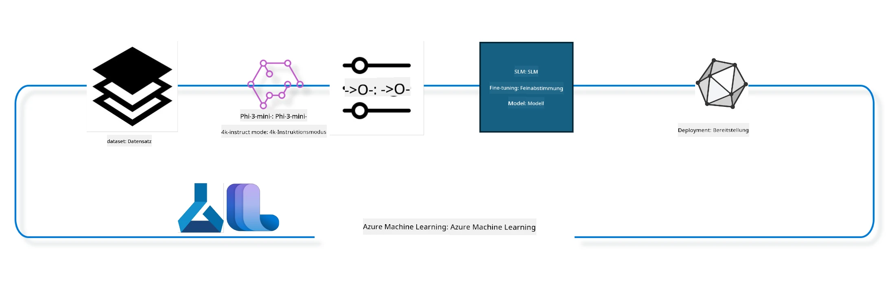

<!--
CO_OP_TRANSLATOR_METADATA:
{
  "original_hash": "944949f040e61b2ea25b3460f7394fd4",
  "translation_date": "2025-07-17T06:56:29+00:00",
  "source_file": "md/03.FineTuning/FineTuning_MLSDK.md",
  "language_code": "de"
}
-->
## Wie man Chat-Completion-Komponenten aus dem Azure ML System-Registry verwendet, um ein Modell feinzujustieren

In diesem Beispiel werden wir das Phi-3-mini-4k-instruct Modell feinjustieren, um ein Gespräch zwischen zwei Personen mit dem ultrachat_200k Datensatz zu vervollständigen.



Das Beispiel zeigt, wie man mit dem Azure ML SDK und Python eine Feinjustierung durchführt und anschließend das feinjustierte Modell für Echtzeit-Inferenz an einem Online-Endpunkt bereitstellt.

### Trainingsdaten

Wir verwenden den ultrachat_200k Datensatz. Dies ist eine stark gefilterte Version des UltraChat-Datensatzes und wurde verwendet, um Zephyr-7B-β zu trainieren, ein hochmodernes 7b Chat-Modell.

### Modell

Wir verwenden das Phi-3-mini-4k-instruct Modell, um zu zeigen, wie Nutzer ein Modell für die Chat-Completion-Aufgabe feinjustieren können. Wenn Sie dieses Notebook von einer bestimmten Modellkarte geöffnet haben, denken Sie daran, den Modellnamen entsprechend zu ersetzen.

### Aufgaben

- Wählen Sie ein Modell zur Feinjustierung aus.
- Wählen und erkunden Sie die Trainingsdaten.
- Konfigurieren Sie den Feinjustierungsjob.
- Führen Sie den Feinjustierungsjob aus.
- Überprüfen Sie Trainings- und Evaluationsmetriken.
- Registrieren Sie das feinjustierte Modell.
- Stellen Sie das feinjustierte Modell für Echtzeit-Inferenz bereit.
- Bereinigen Sie Ressourcen.

## 1. Voraussetzungen einrichten

- Abhängigkeiten installieren
- Verbindung zum AzureML Workspace herstellen. Mehr dazu unter SDK-Authentifizierung einrichten. Ersetzen Sie <WORKSPACE_NAME>, <RESOURCE_GROUP> und <SUBSCRIPTION_ID> unten.
- Verbindung zum AzureML System-Registry herstellen
- Optionalen Experimentnamen festlegen
- Compute prüfen oder erstellen

> [!NOTE]
> Anforderungen: Ein einzelner GPU-Knoten kann mehrere GPU-Karten haben. Zum Beispiel hat ein Knoten vom Typ Standard_NC24rs_v3 vier NVIDIA V100 GPUs, während Standard_NC12s_v3 zwei NVIDIA V100 GPUs hat. Weitere Informationen finden Sie in der Dokumentation. Die Anzahl der GPU-Karten pro Knoten wird im Parameter gpus_per_node unten festgelegt. Eine korrekte Einstellung stellt sicher, dass alle GPUs im Knoten genutzt werden. Empfohlene GPU-Compute-SKUs finden Sie hier und hier.

### Python-Bibliotheken

Installieren Sie die Abhängigkeiten, indem Sie die folgende Zelle ausführen. Dies ist kein optionaler Schritt, wenn Sie in einer neuen Umgebung arbeiten.

```bash
pip install azure-ai-ml
pip install azure-identity
pip install datasets==2.9.0
pip install mlflow
pip install azureml-mlflow
```

### Interaktion mit Azure ML

1. Dieses Python-Skript dient zur Interaktion mit dem Azure Machine Learning (Azure ML) Dienst. Hier eine Übersicht der Funktionen:

    - Es importiert notwendige Module aus den Paketen azure.ai.ml, azure.identity und azure.ai.ml.entities sowie das time-Modul.

    - Es versucht, sich mit DefaultAzureCredential() zu authentifizieren, was eine vereinfachte Authentifizierung für schnelle Entwicklung in der Azure-Cloud bietet. Falls dies fehlschlägt, wird auf InteractiveBrowserCredential() zurückgegriffen, das eine interaktive Anmeldung ermöglicht.

    - Anschließend wird versucht, eine MLClient-Instanz mit der from_config-Methode zu erstellen, die die Konfiguration aus der Standard-Konfigurationsdatei (config.json) liest. Falls das fehlschlägt, wird die MLClient-Instanz manuell mit subscription_id, resource_group_name und workspace_name erstellt.

    - Es wird eine weitere MLClient-Instanz für das Azure ML Registry mit dem Namen "azureml" erstellt. Dieses Registry speichert Modelle, Feinjustierungs-Pipelines und Umgebungen.

    - Der experiment_name wird auf "chat_completion_Phi-3-mini-4k-instruct" gesetzt.

    - Es wird ein eindeutiger Zeitstempel generiert, indem die aktuelle Zeit (in Sekunden seit der Epoche als Fließkommazahl) in einen Integer und dann in einen String umgewandelt wird. Dieser Zeitstempel kann für eindeutige Namen und Versionen verwendet werden.

    ```python
    # Import necessary modules from Azure ML and Azure Identity
    from azure.ai.ml import MLClient
    from azure.identity import (
        DefaultAzureCredential,
        InteractiveBrowserCredential,
    )
    from azure.ai.ml.entities import AmlCompute
    import time  # Import time module
    
    # Try to authenticate using DefaultAzureCredential
    try:
        credential = DefaultAzureCredential()
        credential.get_token("https://management.azure.com/.default")
    except Exception as ex:  # If DefaultAzureCredential fails, use InteractiveBrowserCredential
        credential = InteractiveBrowserCredential()
    
    # Try to create an MLClient instance using the default config file
    try:
        workspace_ml_client = MLClient.from_config(credential=credential)
    except:  # If that fails, create an MLClient instance by manually providing the details
        workspace_ml_client = MLClient(
            credential,
            subscription_id="<SUBSCRIPTION_ID>",
            resource_group_name="<RESOURCE_GROUP>",
            workspace_name="<WORKSPACE_NAME>",
        )
    
    # Create another MLClient instance for the Azure ML registry named "azureml"
    # This registry is where models, fine-tuning pipelines, and environments are stored
    registry_ml_client = MLClient(credential, registry_name="azureml")
    
    # Set the experiment name
    experiment_name = "chat_completion_Phi-3-mini-4k-instruct"
    
    # Generate a unique timestamp that can be used for names and versions that need to be unique
    timestamp = str(int(time.time()))
    ```

## 2. Wählen Sie ein Foundation-Modell zur Feinjustierung aus

1. Phi-3-mini-4k-instruct ist ein leichtgewichtiges, hochmodernes Open-Model mit 3,8 Milliarden Parametern, das auf Datensätzen basiert, die auch für Phi-2 verwendet wurden. Das Modell gehört zur Phi-3 Modellfamilie, und die Mini-Version gibt es in zwei Varianten: 4K und 128K, was die unterstützte Kontextlänge (in Tokens) angibt. Für unseren spezifischen Zweck muss das Modell feinjustiert werden. Sie können diese Modelle im Model Catalog im AzureML Studio durchsuchen und nach der Chat-Completion-Aufgabe filtern. In diesem Beispiel verwenden wir das Phi-3-mini-4k-instruct Modell. Wenn Sie dieses Notebook für ein anderes Modell geöffnet haben, ersetzen Sie den Modellnamen und die Version entsprechend.

    > [!NOTE]
    > die model id Eigenschaft des Modells. Diese wird als Eingabe für den Feinjustierungsjob verwendet. Sie ist auch als Asset ID Feld auf der Modell-Detailseite im AzureML Studio Model Catalog verfügbar.

2. Dieses Python-Skript interagiert mit dem Azure Machine Learning (Azure ML) Dienst. Hier eine Übersicht der Funktionen:

    - Es setzt model_name auf "Phi-3-mini-4k-instruct".

    - Es verwendet die get-Methode der models-Eigenschaft des registry_ml_client Objekts, um die neueste Version des Modells mit dem angegebenen Namen aus dem Azure ML Registry abzurufen. Die get-Methode wird mit zwei Argumenten aufgerufen: dem Modellnamen und einem Label, das angibt, dass die neueste Version abgerufen werden soll.

    - Es gibt eine Nachricht auf der Konsole aus, die den Namen, die Version und die ID des Modells angibt, das für die Feinjustierung verwendet wird. Die format-Methode des Strings wird verwendet, um Name, Version und ID des Modells in die Nachricht einzufügen. Name, Version und ID werden als Eigenschaften des foundation_model Objekts abgerufen.

    ```python
    # Set the model name
    model_name = "Phi-3-mini-4k-instruct"
    
    # Get the latest version of the model from the Azure ML registry
    foundation_model = registry_ml_client.models.get(model_name, label="latest")
    
    # Print the model name, version, and id
    # This information is useful for tracking and debugging
    print(
        "\n\nUsing model name: {0}, version: {1}, id: {2} for fine tuning".format(
            foundation_model.name, foundation_model.version, foundation_model.id
        )
    )
    ```

## 3. Erstellen Sie einen Compute, der für den Job verwendet wird

Der Feinjustierungsjob funktioniert NUR mit GPU-Compute. Die Größe des Compute hängt davon ab, wie groß das Modell ist, und in den meisten Fällen ist es schwierig, den richtigen Compute für den Job zu bestimmen. In dieser Zelle führen wir den Nutzer an, den passenden Compute auszuwählen.

> [!NOTE]
> Die unten aufgeführten Compute-Optionen arbeiten mit der am besten optimierten Konfiguration. Änderungen an der Konfiguration können zu Cuda Out Of Memory Fehlern führen. In solchen Fällen versuchen Sie, den Compute auf eine größere Größe zu erweitern.

> [!NOTE]
> Achten Sie bei der Auswahl der compute_cluster_size darauf, dass der Compute in Ihrer Ressourcengruppe verfügbar ist. Falls ein bestimmter Compute nicht verfügbar ist, können Sie eine Anfrage stellen, um Zugriff auf die Compute-Ressourcen zu erhalten.

### Überprüfung des Modells auf Feinjustierungsunterstützung

1. Dieses Python-Skript interagiert mit einem Azure Machine Learning (Azure ML) Modell. Hier eine Übersicht der Funktionen:

    - Es importiert das ast-Modul, das Funktionen zur Verarbeitung von Bäumen der Python-Abstraktsyntax bereitstellt.

    - Es prüft, ob das foundation_model Objekt (das ein Modell in Azure ML repräsentiert) ein Tag namens finetune_compute_allow_list besitzt. Tags in Azure ML sind Schlüssel-Wert-Paare, die zur Filterung und Sortierung von Modellen verwendet werden können.

    - Falls das finetune_compute_allow_list Tag vorhanden ist, wird der Wert des Tags (ein String) mit ast.literal_eval sicher in eine Python-Liste umgewandelt. Diese Liste wird der Variable computes_allow_list zugewiesen. Anschließend wird eine Nachricht ausgegeben, die darauf hinweist, dass ein Compute aus der Liste erstellt werden soll.

    - Falls das finetune_compute_allow_list Tag nicht vorhanden ist, wird computes_allow_list auf None gesetzt und eine Nachricht ausgegeben, dass das Tag nicht Teil der Modell-Tags ist.

    - Zusammengefasst prüft dieses Skript, ob ein bestimmtes Tag in den Metadaten des Modells vorhanden ist, wandelt den Wert in eine Liste um, falls vorhanden, und gibt dem Nutzer entsprechendes Feedback.

    ```python
    # Import the ast module, which provides functions to process trees of the Python abstract syntax grammar
    import ast
    
    # Check if the 'finetune_compute_allow_list' tag is present in the model's tags
    if "finetune_compute_allow_list" in foundation_model.tags:
        # If the tag is present, use ast.literal_eval to safely parse the tag's value (a string) into a Python list
        computes_allow_list = ast.literal_eval(
            foundation_model.tags["finetune_compute_allow_list"]
        )  # convert string to python list
        # Print a message indicating that a compute should be created from the list
        print(f"Please create a compute from the above list - {computes_allow_list}")
    else:
        # If the tag is not present, set computes_allow_list to None
        computes_allow_list = None
        # Print a message indicating that the 'finetune_compute_allow_list' tag is not part of the model's tags
        print("`finetune_compute_allow_list` is not part of model tags")
    ```

### Überprüfung der Compute-Instanz

1. Dieses Python-Skript interagiert mit dem Azure Machine Learning (Azure ML) Dienst und führt mehrere Prüfungen an einer Compute-Instanz durch. Hier eine Übersicht der Funktionen:

    - Es versucht, die Compute-Instanz mit dem im compute_cluster gespeicherten Namen aus dem Azure ML Workspace abzurufen. Falls der Bereitstellungsstatus der Compute-Instanz "failed" ist, wird ein ValueError ausgelöst.

    - Es prüft, ob computes_allow_list nicht None ist. Falls nicht, werden alle Compute-Größen in der Liste in Kleinbuchstaben umgewandelt und geprüft, ob die Größe der aktuellen Compute-Instanz in der Liste enthalten ist. Falls nicht, wird ein ValueError ausgelöst.

    - Falls computes_allow_list None ist, wird geprüft, ob die Größe der Compute-Instanz in einer Liste nicht unterstützter GPU-VM-Größen enthalten ist. Falls ja, wird ein ValueError ausgelöst.

    - Es ruft eine Liste aller verfügbaren Compute-Größen im Workspace ab. Anschließend wird diese Liste durchlaufen, und für jede Compute-Größe wird geprüft, ob der Name mit der Größe der aktuellen Compute-Instanz übereinstimmt. Falls ja, wird die Anzahl der GPUs für diese Compute-Größe abgerufen und gpu_count_found auf True gesetzt.

    - Falls gpu_count_found True ist, wird die Anzahl der GPUs in der Compute-Instanz ausgegeben. Falls False, wird ein ValueError ausgelöst.

    - Zusammengefasst führt dieses Skript mehrere Prüfungen an einer Compute-Instanz in einem Azure ML Workspace durch, einschließlich des Bereitstellungsstatus, der Größe im Vergleich zu einer Erlaubnis- oder Verbotsliste und der Anzahl der GPUs.

    ```python
    # Print the exception message
    print(e)
    # Raise a ValueError if the compute size is not available in the workspace
    raise ValueError(
        f"WARNING! Compute size {compute_cluster_size} not available in workspace"
    )
    
    # Retrieve the compute instance from the Azure ML workspace
    compute = workspace_ml_client.compute.get(compute_cluster)
    # Check if the provisioning state of the compute instance is "failed"
    if compute.provisioning_state.lower() == "failed":
        # Raise a ValueError if the provisioning state is "failed"
        raise ValueError(
            f"Provisioning failed, Compute '{compute_cluster}' is in failed state. "
            f"please try creating a different compute"
        )
    
    # Check if computes_allow_list is not None
    if computes_allow_list is not None:
        # Convert all compute sizes in computes_allow_list to lowercase
        computes_allow_list_lower_case = [x.lower() for x in computes_allow_list]
        # Check if the size of the compute instance is in computes_allow_list_lower_case
        if compute.size.lower() not in computes_allow_list_lower_case:
            # Raise a ValueError if the size of the compute instance is not in computes_allow_list_lower_case
            raise ValueError(
                f"VM size {compute.size} is not in the allow-listed computes for finetuning"
            )
    else:
        # Define a list of unsupported GPU VM sizes
        unsupported_gpu_vm_list = [
            "standard_nc6",
            "standard_nc12",
            "standard_nc24",
            "standard_nc24r",
        ]
        # Check if the size of the compute instance is in unsupported_gpu_vm_list
        if compute.size.lower() in unsupported_gpu_vm_list:
            # Raise a ValueError if the size of the compute instance is in unsupported_gpu_vm_list
            raise ValueError(
                f"VM size {compute.size} is currently not supported for finetuning"
            )
    
    # Initialize a flag to check if the number of GPUs in the compute instance has been found
    gpu_count_found = False
    # Retrieve a list of all available compute sizes in the workspace
    workspace_compute_sku_list = workspace_ml_client.compute.list_sizes()
    available_sku_sizes = []
    # Iterate over the list of available compute sizes
    for compute_sku in workspace_compute_sku_list:
        available_sku_sizes.append(compute_sku.name)
        # Check if the name of the compute size matches the size of the compute instance
        if compute_sku.name.lower() == compute.size.lower():
            # If it does, retrieve the number of GPUs for that compute size and set gpu_count_found to True
            gpus_per_node = compute_sku.gpus
            gpu_count_found = True
    # If gpu_count_found is True, print the number of GPUs in the compute instance
    if gpu_count_found:
        print(f"Number of GPU's in compute {compute.size}: {gpus_per_node}")
    else:
        # If gpu_count_found is False, raise a ValueError
        raise ValueError(
            f"Number of GPU's in compute {compute.size} not found. Available skus are: {available_sku_sizes}."
            f"This should not happen. Please check the selected compute cluster: {compute_cluster} and try again."
        )
    ```

## 4. Wählen Sie den Datensatz für die Feinjustierung des Modells aus

1. Wir verwenden den ultrachat_200k Datensatz. Der Datensatz ist in vier Splits unterteilt, die für Supervised Fine-Tuning (sft) geeignet sind.
Generation ranking (gen). Die Anzahl der Beispiele pro Split ist wie folgt:

    ```bash
    train_sft test_sft  train_gen  test_gen
    207865  23110  256032  28304
    ```

1. Die nächsten Zellen zeigen die grundlegende Datenvorbereitung für die Feinjustierung:

### Einige Datenzeilen visualisieren

Wir möchten, dass dieses Beispiel schnell läuft, daher speichern wir train_sft und test_sft Dateien, die 5 % der bereits bereinigten Zeilen enthalten. Das bedeutet, dass das feinjustierte Modell eine geringere Genauigkeit hat und daher nicht für den produktiven Einsatz geeignet ist.
Das Skript download-dataset.py wird verwendet, um den ultrachat_200k Datensatz herunterzuladen und in ein Format zu transformieren, das von der Feinjustierungs-Pipeline-Komponente verarbeitet werden kann. Da der Datensatz groß ist, haben wir hier nur einen Teil des Datensatzes.

1. Das folgende Skript lädt nur 5 % der Daten herunter. Dies kann durch Ändern des Parameters dataset_split_pc auf den gewünschten Prozentsatz erhöht werden.

    > [!NOTE]
    > Einige Sprachmodelle verwenden unterschiedliche Sprachcodes, daher sollten die Spaltennamen im Datensatz entsprechend angepasst werden.

1. So sollte die Datenstruktur aussehen:
Der Chat-Completion-Datensatz wird im Parquet-Format gespeichert, wobei jeder Eintrag folgendes Schema verwendet:

    - Dies ist ein JSON (JavaScript Object Notation) Dokument, ein beliebtes Datenformat zum Austausch. Es ist kein ausführbarer Code, sondern eine Möglichkeit, Daten zu speichern und zu transportieren. Hier eine Übersicht der Struktur:

    - "prompt": Dieser Schlüssel enthält einen String, der eine Aufgabe oder Frage an einen KI-Assistenten darstellt.

    - "messages": Dieser Schlüssel enthält ein Array von Objekten. Jedes Objekt repräsentiert eine Nachricht in einem Gespräch zwischen einem Nutzer und einem KI-Assistenten. Jedes Nachrichtenobjekt hat zwei Schlüssel:

    - "content": Dieser Schlüssel enthält den Text der Nachricht als String.
    - "role": Dieser Schlüssel gibt die Rolle der Entität an, die die Nachricht gesendet hat. Dies kann entweder "user" oder "assistant" sein.
    - "prompt_id": Dieser Schlüssel enthält eine eindeutige Kennung für den Prompt als String.

1. In diesem speziellen JSON-Dokument wird ein Gespräch dargestellt, in dem ein Nutzer den KI-Assistenten bittet, einen Protagonisten für eine dystopische Geschichte zu erstellen. Der Assistent antwortet, und der Nutzer bittet um weitere Details. Der Assistent stimmt zu, mehr Details zu liefern. Das gesamte Gespräch ist mit einer spezifischen prompt_id verknüpft.

    ```python
    {
        // The task or question posed to an AI assistant
        "prompt": "Create a fully-developed protagonist who is challenged to survive within a dystopian society under the rule of a tyrant. ...",
        
        // An array of objects, each representing a message in a conversation between a user and an AI assistant
        "messages":[
            {
                // The content of the user's message
                "content": "Create a fully-developed protagonist who is challenged to survive within a dystopian society under the rule of a tyrant. ...",
                // The role of the entity that sent the message
                "role": "user"
            },
            {
                // The content of the assistant's message
                "content": "Name: Ava\n\n Ava was just 16 years old when the world as she knew it came crashing down. The government had collapsed, leaving behind a chaotic and lawless society. ...",
                // The role of the entity that sent the message
                "role": "assistant"
            },
            {
                // The content of the user's message
                "content": "Wow, Ava's story is so intense and inspiring! Can you provide me with more details.  ...",
                // The role of the entity that sent the message
                "role": "user"
            }, 
            {
                // The content of the assistant's message
                "content": "Certainly! ....",
                // The role of the entity that sent the message
                "role": "assistant"
            }
        ],
        
        // A unique identifier for the prompt
        "prompt_id": "d938b65dfe31f05f80eb8572964c6673eddbd68eff3db6bd234d7f1e3b86c2af"
    }
    ```

### Daten herunterladen

1. Dieses Python-Skript wird verwendet, um einen Datensatz mit einem Hilfsskript namens download-dataset.py herunterzuladen. Hier eine Übersicht der Funktionen:

    - Es importiert das os-Modul, das plattformübergreifende Funktionen für Betriebssystemabhängigkeiten bereitstellt.

    - Es verwendet die Funktion os.system, um das Skript download-dataset.py mit bestimmten Kommandozeilenargumenten im Shell-Modus auszuführen. Die Argumente geben an, welcher Datensatz heruntergeladen werden soll (HuggingFaceH4/ultrachat_200k), in welches Verzeichnis (ultrachat_200k_dataset) und welcher Prozentsatz des Datensatzes (5) verwendet werden soll. Die Funktion os.system gibt den Exit-Status des ausgeführten Befehls zurück, der in exit_status gespeichert wird.

    - Es prüft, ob exit_status ungleich 0 ist. In Unix-ähnlichen Betriebssystemen bedeutet ein Exit-Status von 0 normalerweise Erfolg, jeder andere Wert einen Fehler. Falls exit_status ungleich 0 ist, wird eine Exception mit einer Fehlermeldung ausgelöst, die auf einen Fehler beim Herunterladen des Datensatzes hinweist.

    - Zusammengefasst führt dieses Skript einen Befehl aus, um einen Datensatz mit einem Hilfsskript herunterzuladen, und löst eine Ausnahme aus, falls der Befehl fehlschlägt.

    ```python
    # Import the os module, which provides a way of using operating system dependent functionality
    import os
    
    # Use the os.system function to run the download-dataset.py script in the shell with specific command-line arguments
    # The arguments specify the dataset to download (HuggingFaceH4/ultrachat_200k), the directory to download it to (ultrachat_200k_dataset), and the percentage of the dataset to split (5)
    # The os.system function returns the exit status of the command it executed; this status is stored in the exit_status variable
    exit_status = os.system(
        "python ./download-dataset.py --dataset HuggingFaceH4/ultrachat_200k --download_dir ultrachat_200k_dataset --dataset_split_pc 5"
    )
    
    # Check if exit_status is not 0
    # In Unix-like operating systems, an exit status of 0 usually indicates that a command has succeeded, while any other number indicates an error
    # If exit_status is not 0, raise an Exception with a message indicating that there was an error downloading the dataset
    if exit_status != 0:
        raise Exception("Error downloading dataset")
    ```

### Laden der Daten in ein DataFrame

1. Dieses Python-Skript lädt eine JSON Lines Datei in ein pandas DataFrame und zeigt die ersten 5 Zeilen an. Hier eine Übersicht der Funktionen:

    - Es importiert die pandas-Bibliothek, eine leistungsstarke Bibliothek zur Datenmanipulation und -analyse.

    - Es setzt die maximale Spaltenbreite für die Anzeigeoptionen von pandas auf 0. Das bedeutet, dass der vollständige Text jeder Spalte ohne Abschneidung angezeigt wird, wenn das DataFrame ausgegeben wird.

    - Es verwendet die Funktion pd.read_json, um die Datei train_sft.jsonl aus dem Verzeichnis ultrachat_200k_dataset in ein DataFrame zu laden. Das Argument lines=True gibt an, dass die Datei im JSON Lines Format vorliegt, bei dem jede Zeile ein separates JSON-Objekt ist.
- Es verwendet die head-Methode, um die ersten 5 Zeilen des DataFrames anzuzeigen. Wenn das DataFrame weniger als 5 Zeilen enthält, werden alle angezeigt.

- Zusammenfassend lädt dieses Skript eine JSON Lines-Datei in ein DataFrame und zeigt die ersten 5 Zeilen mit vollständigem Spaltentext an.

```python
    # Import the pandas library, which is a powerful data manipulation and analysis library
    import pandas as pd
    
    # Set the maximum column width for pandas' display options to 0
    # This means that the full text of each column will be displayed without truncation when the DataFrame is printed
    pd.set_option("display.max_colwidth", 0)
    
    # Use the pd.read_json function to load the train_sft.jsonl file from the ultrachat_200k_dataset directory into a DataFrame
    # The lines=True argument indicates that the file is in JSON Lines format, where each line is a separate JSON object
    df = pd.read_json("./ultrachat_200k_dataset/train_sft.jsonl", lines=True)
    
    # Use the head method to display the first 5 rows of the DataFrame
    # If the DataFrame has less than 5 rows, it will display all of them
    df.head()
    ```

## 5. Reichen Sie den Fine-Tuning-Job mit Modell und Daten als Eingaben ein

Erstellen Sie den Job, der die chat-completion Pipeline-Komponente verwendet. Erfahren Sie mehr über alle unterstützten Parameter für das Fine-Tuning.

### Fine-Tuning-Parameter definieren

1. Fine-Tuning-Parameter lassen sich in 2 Kategorien einteilen – Trainingsparameter und Optimierungsparameter

1. Trainingsparameter definieren die Trainingsaspekte wie –

    - Den zu verwendenden Optimierer und Scheduler
    - Die Metrik, die beim Fine-Tuning optimiert werden soll
    - Anzahl der Trainingsschritte, Batch-Größe und so weiter
    - Optimierungsparameter helfen dabei, den GPU-Speicher zu optimieren und die Rechenressourcen effektiv zu nutzen.

1. Nachfolgend einige Parameter, die zu dieser Kategorie gehören. Die Optimierungsparameter unterscheiden sich je nach Modell und sind im Modellpaket enthalten, um diese Unterschiede zu handhaben.

    - Aktivieren von deepspeed und LoRA
    - Aktivieren von Mixed Precision Training
    - Aktivieren von Multi-Node Training


> [!NOTE]
> Überwachtes Fine-Tuning kann zu einem Verlust der Ausrichtung oder katastrophalem Vergessen führen. Wir empfehlen, dieses Problem zu überprüfen und nach dem Fine-Tuning eine Ausrichtungsphase durchzuführen.

### Fine-Tuning-Parameter

1. Dieses Python-Skript richtet Parameter für das Fine-Tuning eines Machine-Learning-Modells ein. Hier eine Übersicht:

    - Es legt Standard-Trainingsparameter fest, wie die Anzahl der Trainings-Epochen, Batch-Größen für Training und Evaluation, Lernrate und den Typ des Lernraten-Schedulers.

    - Es legt Standard-Optimierungsparameter fest, z. B. ob Layer-wise Relevance Propagation (LoRa) und DeepSpeed angewendet werden und die DeepSpeed-Stufe.

    - Es kombiniert die Trainings- und Optimierungsparameter in einem einzigen Dictionary namens finetune_parameters.

    - Es prüft, ob das foundation_model modell-spezifische Standardparameter hat. Falls ja, wird eine Warnung ausgegeben und das finetune_parameters-Dictionary mit diesen modell-spezifischen Standardwerten aktualisiert. Die Funktion ast.literal_eval wird verwendet, um die modell-spezifischen Standardwerte von einem String in ein Python-Dictionary umzuwandeln.

    - Es gibt die endgültigen Fine-Tuning-Parameter aus, die für den Lauf verwendet werden.

    - Zusammenfassend richtet dieses Skript die Parameter für das Fine-Tuning eines Machine-Learning-Modells ein und zeigt sie an, mit der Möglichkeit, die Standardparameter durch modell-spezifische zu überschreiben.

    ```python
    # Set up default training parameters such as the number of training epochs, batch sizes for training and evaluation, learning rate, and learning rate scheduler type
    training_parameters = dict(
        num_train_epochs=3,
        per_device_train_batch_size=1,
        per_device_eval_batch_size=1,
        learning_rate=5e-6,
        lr_scheduler_type="cosine",
    )
    
    # Set up default optimization parameters such as whether to apply Layer-wise Relevance Propagation (LoRa) and DeepSpeed, and the DeepSpeed stage
    optimization_parameters = dict(
        apply_lora="true",
        apply_deepspeed="true",
        deepspeed_stage=2,
    )
    
    # Combine the training and optimization parameters into a single dictionary called finetune_parameters
    finetune_parameters = {**training_parameters, **optimization_parameters}
    
    # Check if the foundation_model has any model-specific default parameters
    # If it does, print a warning message and update the finetune_parameters dictionary with these model-specific defaults
    # The ast.literal_eval function is used to convert the model-specific defaults from a string to a Python dictionary
    if "model_specific_defaults" in foundation_model.tags:
        print("Warning! Model specific defaults exist. The defaults could be overridden.")
        finetune_parameters.update(
            ast.literal_eval(  # convert string to python dict
                foundation_model.tags["model_specific_defaults"]
            )
        )
    
    # Print the final set of fine-tuning parameters that will be used for the run
    print(
        f"The following finetune parameters are going to be set for the run: {finetune_parameters}"
    )
    ```

### Trainings-Pipeline

1. Dieses Python-Skript definiert eine Funktion, um einen Anzeigenamen für eine Machine-Learning-Trainingspipeline zu generieren, und ruft diese Funktion auf, um den Namen zu erzeugen und auszugeben. Hier eine Übersicht:

1. Die Funktion get_pipeline_display_name wird definiert. Sie erzeugt einen Anzeigenamen basierend auf verschiedenen Parametern der Trainingspipeline.

1. Innerhalb der Funktion wird die Gesamt-Batch-Größe berechnet, indem die Batch-Größe pro Gerät, die Anzahl der Gradient Accumulation Steps, die Anzahl der GPUs pro Node und die Anzahl der Nodes für das Fine-Tuning multipliziert werden.

1. Es werden weitere Parameter abgerufen, wie der Typ des Lernraten-Schedulers, ob DeepSpeed angewendet wird, die DeepSpeed-Stufe, ob Layer-wise Relevance Propagation (LoRa) angewendet wird, die Begrenzung der Anzahl der zu behaltenden Modell-Checkpoints und die maximale Sequenzlänge.

1. Es wird ein String konstruiert, der all diese Parameter enthält, getrennt durch Bindestriche. Wenn DeepSpeed oder LoRa angewendet wird, enthält der String "ds" gefolgt von der DeepSpeed-Stufe oder "lora". Andernfalls enthält er "nods" oder "nolora".

1. Die Funktion gibt diesen String zurück, der als Anzeigename für die Trainingspipeline dient.

1. Nach der Definition wird die Funktion aufgerufen, um den Anzeigenamen zu generieren, der dann ausgegeben wird.

1. Zusammenfassend generiert dieses Skript einen Anzeigenamen für eine Machine-Learning-Trainingspipeline basierend auf verschiedenen Parametern und gibt diesen Namen aus.

    ```python
    # Define a function to generate a display name for the training pipeline
    def get_pipeline_display_name():
        # Calculate the total batch size by multiplying the per-device batch size, the number of gradient accumulation steps, the number of GPUs per node, and the number of nodes used for fine-tuning
        batch_size = (
            int(finetune_parameters.get("per_device_train_batch_size", 1))
            * int(finetune_parameters.get("gradient_accumulation_steps", 1))
            * int(gpus_per_node)
            * int(finetune_parameters.get("num_nodes_finetune", 1))
        )
        # Retrieve the learning rate scheduler type
        scheduler = finetune_parameters.get("lr_scheduler_type", "linear")
        # Retrieve whether DeepSpeed is applied
        deepspeed = finetune_parameters.get("apply_deepspeed", "false")
        # Retrieve the DeepSpeed stage
        ds_stage = finetune_parameters.get("deepspeed_stage", "2")
        # If DeepSpeed is applied, include "ds" followed by the DeepSpeed stage in the display name; if not, include "nods"
        if deepspeed == "true":
            ds_string = f"ds{ds_stage}"
        else:
            ds_string = "nods"
        # Retrieve whether Layer-wise Relevance Propagation (LoRa) is applied
        lora = finetune_parameters.get("apply_lora", "false")
        # If LoRa is applied, include "lora" in the display name; if not, include "nolora"
        if lora == "true":
            lora_string = "lora"
        else:
            lora_string = "nolora"
        # Retrieve the limit on the number of model checkpoints to keep
        save_limit = finetune_parameters.get("save_total_limit", -1)
        # Retrieve the maximum sequence length
        seq_len = finetune_parameters.get("max_seq_length", -1)
        # Construct the display name by concatenating all these parameters, separated by hyphens
        return (
            model_name
            + "-"
            + "ultrachat"
            + "-"
            + f"bs{batch_size}"
            + "-"
            + f"{scheduler}"
            + "-"
            + ds_string
            + "-"
            + lora_string
            + f"-save_limit{save_limit}"
            + f"-seqlen{seq_len}"
        )
    
    # Call the function to generate the display name
    pipeline_display_name = get_pipeline_display_name()
    # Print the display name
    print(f"Display name used for the run: {pipeline_display_name}")
    ```

### Pipeline konfigurieren

Dieses Python-Skript definiert und konfiguriert eine Machine-Learning-Pipeline mit dem Azure Machine Learning SDK. Hier eine Übersicht:

1. Es importiert notwendige Module aus dem Azure AI ML SDK.

1. Es lädt eine Pipeline-Komponente namens "chat_completion_pipeline" aus dem Registry.

1. Es definiert einen Pipeline-Job mit dem `@pipeline`-Decorator und der Funktion `create_pipeline`. Der Name der Pipeline wird auf `pipeline_display_name` gesetzt.

1. Innerhalb der Funktion `create_pipeline` wird die geladene Pipeline-Komponente mit verschiedenen Parametern initialisiert, darunter der Modellpfad, Compute-Cluster für verschiedene Phasen, Datensatz-Splits für Training und Test, die Anzahl der GPUs für das Fine-Tuning und weitere Fine-Tuning-Parameter.

1. Die Ausgabe des Fine-Tuning-Jobs wird auf die Ausgabe des Pipeline-Jobs gemappt. So kann das feinabgestimmte Modell einfach registriert werden, was für die Bereitstellung an einen Online- oder Batch-Endpunkt erforderlich ist.

1. Es wird eine Instanz der Pipeline erzeugt, indem die Funktion `create_pipeline` aufgerufen wird.

1. Die Einstellung `force_rerun` der Pipeline wird auf `True` gesetzt, was bedeutet, dass keine zwischengespeicherten Ergebnisse aus vorherigen Jobs verwendet werden.

1. Die Einstellung `continue_on_step_failure` der Pipeline wird auf `False` gesetzt, was bedeutet, dass die Pipeline stoppt, wenn ein Schritt fehlschlägt.

1. Zusammenfassend definiert und konfiguriert dieses Skript eine Machine-Learning-Pipeline für eine Chat-Completion-Aufgabe mit dem Azure Machine Learning SDK.

    ```python
    # Import necessary modules from the Azure AI ML SDK
    from azure.ai.ml.dsl import pipeline
    from azure.ai.ml import Input
    
    # Fetch the pipeline component named "chat_completion_pipeline" from the registry
    pipeline_component_func = registry_ml_client.components.get(
        name="chat_completion_pipeline", label="latest"
    )
    
    # Define the pipeline job using the @pipeline decorator and the function create_pipeline
    # The name of the pipeline is set to pipeline_display_name
    @pipeline(name=pipeline_display_name)
    def create_pipeline():
        # Initialize the fetched pipeline component with various parameters
        # These include the model path, compute clusters for different stages, dataset splits for training and testing, the number of GPUs to use for fine-tuning, and other fine-tuning parameters
        chat_completion_pipeline = pipeline_component_func(
            mlflow_model_path=foundation_model.id,
            compute_model_import=compute_cluster,
            compute_preprocess=compute_cluster,
            compute_finetune=compute_cluster,
            compute_model_evaluation=compute_cluster,
            # Map the dataset splits to parameters
            train_file_path=Input(
                type="uri_file", path="./ultrachat_200k_dataset/train_sft.jsonl"
            ),
            test_file_path=Input(
                type="uri_file", path="./ultrachat_200k_dataset/test_sft.jsonl"
            ),
            # Training settings
            number_of_gpu_to_use_finetuning=gpus_per_node,  # Set to the number of GPUs available in the compute
            **finetune_parameters
        )
        return {
            # Map the output of the fine tuning job to the output of pipeline job
            # This is done so that we can easily register the fine tuned model
            # Registering the model is required to deploy the model to an online or batch endpoint
            "trained_model": chat_completion_pipeline.outputs.mlflow_model_folder
        }
    
    # Create an instance of the pipeline by calling the create_pipeline function
    pipeline_object = create_pipeline()
    
    # Don't use cached results from previous jobs
    pipeline_object.settings.force_rerun = True
    
    # Set continue on step failure to False
    # This means that the pipeline will stop if any step fails
    pipeline_object.settings.continue_on_step_failure = False
    ```

### Job einreichen

1. Dieses Python-Skript reicht einen Machine-Learning-Pipeline-Job in einem Azure Machine Learning Workspace ein und wartet dann auf den Abschluss des Jobs. Hier eine Übersicht:

    - Es ruft die Methode create_or_update des jobs-Objekts im workspace_ml_client auf, um den Pipeline-Job einzureichen. Die auszuführende Pipeline wird durch pipeline_object angegeben, und das Experiment, unter dem der Job läuft, durch experiment_name.

    - Anschließend ruft es die Methode stream des jobs-Objekts im workspace_ml_client auf, um auf den Abschluss des Pipeline-Jobs zu warten. Der zu wartende Job wird durch das name-Attribut des pipeline_job-Objekts angegeben.

    - Zusammenfassend reicht dieses Skript einen Machine-Learning-Pipeline-Job in einem Azure Machine Learning Workspace ein und wartet auf dessen Abschluss.

    ```python
    # Submit the pipeline job to the Azure Machine Learning workspace
    # The pipeline to be run is specified by pipeline_object
    # The experiment under which the job is run is specified by experiment_name
    pipeline_job = workspace_ml_client.jobs.create_or_update(
        pipeline_object, experiment_name=experiment_name
    )
    
    # Wait for the pipeline job to complete
    # The job to wait for is specified by the name attribute of the pipeline_job object
    workspace_ml_client.jobs.stream(pipeline_job.name)
    ```

## 6. Registrieren Sie das feinabgestimmte Modell im Workspace

Wir registrieren das Modell aus der Ausgabe des Fine-Tuning-Jobs. Dadurch wird die Herkunft zwischen dem feinabgestimmten Modell und dem Fine-Tuning-Job nachverfolgt. Der Fine-Tuning-Job verfolgt zudem die Herkunft zum Foundation Model, den Daten und dem Trainingscode.

### ML-Modell registrieren

1. Dieses Python-Skript registriert ein Machine-Learning-Modell, das in einer Azure Machine Learning Pipeline trainiert wurde. Hier eine Übersicht:

    - Es importiert notwendige Module aus dem Azure AI ML SDK.

    - Es prüft, ob die Ausgabe trained_model vom Pipeline-Job verfügbar ist, indem es die get-Methode des jobs-Objekts im workspace_ml_client aufruft und auf dessen outputs-Attribut zugreift.

    - Es erstellt einen Pfad zum trainierten Modell, indem es einen String mit dem Namen des Pipeline-Jobs und dem Namen der Ausgabe ("trained_model") formatiert.

    - Es definiert einen Namen für das feinabgestimmte Modell, indem es "-ultrachat-200k" an den ursprünglichen Modellnamen anhängt und alle Schrägstriche durch Bindestriche ersetzt.

    - Es bereitet die Registrierung des Modells vor, indem es ein Model-Objekt mit verschiedenen Parametern erstellt, darunter der Pfad zum Modell, der Modelltyp (MLflow-Modell), der Name und die Version des Modells sowie eine Beschreibung.

    - Es registriert das Modell, indem es die Methode create_or_update des models-Objekts im workspace_ml_client mit dem Model-Objekt als Argument aufruft.

    - Es gibt das registrierte Modell aus.

1. Zusammenfassend registriert dieses Skript ein Machine-Learning-Modell, das in einer Azure Machine Learning Pipeline trainiert wurde.

    ```python
    # Import necessary modules from the Azure AI ML SDK
    from azure.ai.ml.entities import Model
    from azure.ai.ml.constants import AssetTypes
    
    # Check if the `trained_model` output is available from the pipeline job
    print("pipeline job outputs: ", workspace_ml_client.jobs.get(pipeline_job.name).outputs)
    
    # Construct a path to the trained model by formatting a string with the name of the pipeline job and the name of the output ("trained_model")
    model_path_from_job = "azureml://jobs/{0}/outputs/{1}".format(
        pipeline_job.name, "trained_model"
    )
    
    # Define a name for the fine-tuned model by appending "-ultrachat-200k" to the original model name and replacing any slashes with hyphens
    finetuned_model_name = model_name + "-ultrachat-200k"
    finetuned_model_name = finetuned_model_name.replace("/", "-")
    
    print("path to register model: ", model_path_from_job)
    
    # Prepare to register the model by creating a Model object with various parameters
    # These include the path to the model, the type of the model (MLflow model), the name and version of the model, and a description of the model
    prepare_to_register_model = Model(
        path=model_path_from_job,
        type=AssetTypes.MLFLOW_MODEL,
        name=finetuned_model_name,
        version=timestamp,  # Use timestamp as version to avoid version conflict
        description=model_name + " fine tuned model for ultrachat 200k chat-completion",
    )
    
    print("prepare to register model: \n", prepare_to_register_model)
    
    # Register the model by calling the create_or_update method of the models object in the workspace_ml_client with the Model object as the argument
    registered_model = workspace_ml_client.models.create_or_update(
        prepare_to_register_model
    )
    
    # Print the registered model
    print("registered model: \n", registered_model)
    ```

## 7. Bereitstellen des feinabgestimmten Modells an einem Online-Endpunkt

Online-Endpunkte bieten eine dauerhafte REST-API, die zur Integration in Anwendungen genutzt werden kann, die das Modell verwenden möchten.

### Endpunkt verwalten

1. Dieses Python-Skript erstellt einen verwalteten Online-Endpunkt in Azure Machine Learning für ein registriertes Modell. Hier eine Übersicht:

    - Es importiert notwendige Module aus dem Azure AI ML SDK.

    - Es definiert einen eindeutigen Namen für den Online-Endpunkt, indem es einen Zeitstempel an den String "ultrachat-completion-" anhängt.

    - Es bereitet die Erstellung des Online-Endpunkts vor, indem es ein ManagedOnlineEndpoint-Objekt mit verschiedenen Parametern erstellt, darunter der Name des Endpunkts, eine Beschreibung und der Authentifizierungsmodus ("key").

    - Es erstellt den Online-Endpunkt, indem es die Methode begin_create_or_update des workspace_ml_client mit dem ManagedOnlineEndpoint-Objekt als Argument aufruft. Anschließend wartet es mit der wait-Methode auf den Abschluss der Erstellung.

1. Zusammenfassend erstellt dieses Skript einen verwalteten Online-Endpunkt in Azure Machine Learning für ein registriertes Modell.

    ```python
    # Import necessary modules from the Azure AI ML SDK
    from azure.ai.ml.entities import (
        ManagedOnlineEndpoint,
        ManagedOnlineDeployment,
        ProbeSettings,
        OnlineRequestSettings,
    )
    
    # Define a unique name for the online endpoint by appending a timestamp to the string "ultrachat-completion-"
    online_endpoint_name = "ultrachat-completion-" + timestamp
    
    # Prepare to create the online endpoint by creating a ManagedOnlineEndpoint object with various parameters
    # These include the name of the endpoint, a description of the endpoint, and the authentication mode ("key")
    endpoint = ManagedOnlineEndpoint(
        name=online_endpoint_name,
        description="Online endpoint for "
        + registered_model.name
        + ", fine tuned model for ultrachat-200k-chat-completion",
        auth_mode="key",
    )
    
    # Create the online endpoint by calling the begin_create_or_update method of the workspace_ml_client with the ManagedOnlineEndpoint object as the argument
    # Then wait for the creation operation to complete by calling the wait method
    workspace_ml_client.begin_create_or_update(endpoint).wait()
    ```

> [!NOTE]
> Hier finden Sie die Liste der für die Bereitstellung unterstützten SKUs – [Managed online endpoints SKU list](https://learn.microsoft.com/azure/machine-learning/reference-managed-online-endpoints-vm-sku-list)

### ML-Modell bereitstellen

1. Dieses Python-Skript stellt ein registriertes Machine-Learning-Modell an einem verwalteten Online-Endpunkt in Azure Machine Learning bereit. Hier eine Übersicht:

    - Es importiert das ast-Modul, das Funktionen zur Verarbeitung von Bäumen der Python-Abstraktsyntax bereitstellt.

    - Es setzt den Instanztyp für die Bereitstellung auf "Standard_NC6s_v3".

    - Es prüft, ob das Tag inference_compute_allow_list im foundation_model vorhanden ist. Falls ja, wird der Tag-Wert von einem String in eine Python-Liste umgewandelt und inference_computes_allow_list zugewiesen. Falls nicht, wird inference_computes_allow_list auf None gesetzt.

    - Es prüft, ob der angegebene Instanztyp in der Allow-Liste enthalten ist. Falls nicht, wird eine Nachricht ausgegeben, die den Benutzer auffordert, einen Instanztyp aus der Allow-Liste auszuwählen.

    - Es bereitet die Erstellung der Bereitstellung vor, indem es ein ManagedOnlineDeployment-Objekt mit verschiedenen Parametern erstellt, darunter der Name der Bereitstellung, der Name des Endpunkts, die ID des Modells, der Instanztyp und die Anzahl, die Einstellungen für die Liveness-Probe und die Request-Einstellungen.

    - Es erstellt die Bereitstellung, indem es die Methode begin_create_or_update des workspace_ml_client mit dem ManagedOnlineDeployment-Objekt als Argument aufruft. Anschließend wartet es mit der wait-Methode auf den Abschluss der Erstellung.

    - Es setzt den Traffic des Endpunkts so, dass 100 % des Traffics an die Bereitstellung "demo" geleitet werden.

    - Es aktualisiert den Endpunkt, indem es die Methode begin_create_or_update des workspace_ml_client mit dem Endpunkt-Objekt als Argument aufruft. Anschließend wartet es mit der result-Methode auf den Abschluss der Aktualisierung.

1. Zusammenfassend stellt dieses Skript ein registriertes Machine-Learning-Modell an einem verwalteten Online-Endpunkt in Azure Machine Learning bereit.

    ```python
    # Import the ast module, which provides functions to process trees of the Python abstract syntax grammar
    import ast
    
    # Set the instance type for the deployment
    instance_type = "Standard_NC6s_v3"
    
    # Check if the `inference_compute_allow_list` tag is present in the foundation model
    if "inference_compute_allow_list" in foundation_model.tags:
        # If it is, convert the tag value from a string to a Python list and assign it to `inference_computes_allow_list`
        inference_computes_allow_list = ast.literal_eval(
            foundation_model.tags["inference_compute_allow_list"]
        )
        print(f"Please create a compute from the above list - {computes_allow_list}")
    else:
        # If it's not, set `inference_computes_allow_list` to `None`
        inference_computes_allow_list = None
        print("`inference_compute_allow_list` is not part of model tags")
    
    # Check if the specified instance type is in the allow list
    if (
        inference_computes_allow_list is not None
        and instance_type not in inference_computes_allow_list
    ):
        print(
            f"`instance_type` is not in the allow listed compute. Please select a value from {inference_computes_allow_list}"
        )
    
    # Prepare to create the deployment by creating a `ManagedOnlineDeployment` object with various parameters
    demo_deployment = ManagedOnlineDeployment(
        name="demo",
        endpoint_name=online_endpoint_name,
        model=registered_model.id,
        instance_type=instance_type,
        instance_count=1,
        liveness_probe=ProbeSettings(initial_delay=600),
        request_settings=OnlineRequestSettings(request_timeout_ms=90000),
    )
    
    # Create the deployment by calling the `begin_create_or_update` method of the `workspace_ml_client` with the `ManagedOnlineDeployment` object as the argument
    # Then wait for the creation operation to complete by calling the `wait` method
    workspace_ml_client.online_deployments.begin_create_or_update(demo_deployment).wait()
    
    # Set the traffic of the endpoint to direct 100% of the traffic to the "demo" deployment
    endpoint.traffic = {"demo": 100}
    
    # Update the endpoint by calling the `begin_create_or_update` method of the `workspace_ml_client` with the `endpoint` object as the argument
    # Then wait for the update operation to complete by calling the `result` method
    workspace_ml_client.begin_create_or_update(endpoint).result()
    ```

## 8. Testen des Endpunkts mit Beispieldaten

Wir holen einige Beispieldaten aus dem Testdatensatz und senden sie an den Online-Endpunkt zur Inferenz. Anschließend zeigen wir die vorhergesagten Labels zusammen mit den tatsächlichen Labels an.

### Ergebnisse lesen

1. Dieses Python-Skript liest eine JSON Lines-Datei in ein pandas DataFrame ein, nimmt eine zufällige Stichprobe und setzt den Index zurück. Hier eine Übersicht:

    - Es liest die Datei ./ultrachat_200k_dataset/test_gen.jsonl in ein pandas DataFrame ein. Die Funktion read_json wird mit dem Argument lines=True verwendet, da die Datei im JSON Lines-Format vorliegt, bei dem jede Zeile ein separates JSON-Objekt ist.

    - Es nimmt eine zufällige Stichprobe von 1 Zeile aus dem DataFrame. Die Funktion sample wird mit dem Argument n=1 verwendet, um die Anzahl der zufälligen Zeilen anzugeben.

    - Es setzt den Index des DataFrames zurück. Die Funktion reset_index wird mit dem Argument drop=True verwendet, um den ursprünglichen Index zu verwerfen und durch einen neuen Standard-Integer-Index zu ersetzen.

    - Es zeigt die ersten 2 Zeilen des DataFrames mit der Funktion head und dem Argument 2 an. Da das DataFrame nach der Stichprobe nur eine Zeile enthält, wird nur diese eine Zeile angezeigt.

1. Zusammenfassend liest dieses Skript eine JSON Lines-Datei in ein pandas DataFrame ein, nimmt eine zufällige Stichprobe von 1 Zeile, setzt den Index zurück und zeigt die erste Zeile an.

    ```python
    # Import pandas library
    import pandas as pd
    
    # Read the JSON Lines file './ultrachat_200k_dataset/test_gen.jsonl' into a pandas DataFrame
    # The 'lines=True' argument indicates that the file is in JSON Lines format, where each line is a separate JSON object
    test_df = pd.read_json("./ultrachat_200k_dataset/test_gen.jsonl", lines=True)
    
    # Take a random sample of 1 row from the DataFrame
    # The 'n=1' argument specifies the number of random rows to select
    test_df = test_df.sample(n=1)
    
    # Reset the index of the DataFrame
    # The 'drop=True' argument indicates that the original index should be dropped and replaced with a new index of default integer values
    # The 'inplace=True' argument indicates that the DataFrame should be modified in place (without creating a new object)
    test_df.reset_index(drop=True, inplace=True)
    
    # Display the first 2 rows of the DataFrame
    # However, since the DataFrame only contains one row after the sampling, this will only display that one row
    test_df.head(2)
    ```

### JSON-Objekt erstellen

1. Dieses Python-Skript erstellt ein JSON-Objekt mit bestimmten Parametern und speichert es in einer Datei. Hier eine Übersicht:

    - Es importiert das json-Modul, das Funktionen zur Arbeit mit JSON-Daten bereitstellt.

    - Es erstellt ein Dictionary parameters mit Schlüsseln und Werten, die Parameter für ein Machine-Learning-Modell repräsentieren. Die Schlüssel sind "temperature", "top_p", "do_sample" und "max_new_tokens", und die entsprechenden Werte sind 0.6, 0.9, True und 200.

    - Es erstellt ein weiteres Dictionary test_json mit zwei Schlüsseln: "input_data" und "params". Der Wert von "input_data" ist ein weiteres Dictionary mit den Schlüsseln "input_string" und "parameters". Der Wert von "input_string" ist eine Liste, die die erste Nachricht aus dem test_df DataFrame enthält. Der Wert von "parameters" ist das zuvor erstellte parameters-Dictionary. Der Wert von "params" ist ein leeres Dictionary.
- Es wird eine Datei namens sample_score.json geöffnet

```python
    # Import the json module, which provides functions to work with JSON data
    import json
    
    # Create a dictionary `parameters` with keys and values that represent parameters for a machine learning model
    # The keys are "temperature", "top_p", "do_sample", and "max_new_tokens", and their corresponding values are 0.6, 0.9, True, and 200 respectively
    parameters = {
        "temperature": 0.6,
        "top_p": 0.9,
        "do_sample": True,
        "max_new_tokens": 200,
    }
    
    # Create another dictionary `test_json` with two keys: "input_data" and "params"
    # The value of "input_data" is another dictionary with keys "input_string" and "parameters"
    # The value of "input_string" is a list containing the first message from the `test_df` DataFrame
    # The value of "parameters" is the `parameters` dictionary created earlier
    # The value of "params" is an empty dictionary
    test_json = {
        "input_data": {
            "input_string": [test_df["messages"][0]],
            "parameters": parameters,
        },
        "params": {},
    }
    
    # Open a file named `sample_score.json` in the `./ultrachat_200k_dataset` directory in write mode
    with open("./ultrachat_200k_dataset/sample_score.json", "w") as f:
        # Write the `test_json` dictionary to the file in JSON format using the `json.dump` function
        json.dump(test_json, f)
    ```

### Aufrufen des Endpunkts

1. Dieses Python-Skript ruft einen Online-Endpunkt in Azure Machine Learning auf, um eine JSON-Datei zu bewerten. Hier eine Übersicht, was es macht:

    - Es ruft die invoke-Methode der online_endpoints-Eigenschaft des workspace_ml_client-Objekts auf. Diese Methode wird verwendet, um eine Anfrage an einen Online-Endpunkt zu senden und eine Antwort zu erhalten.

    - Es gibt den Namen des Endpunkts und der Bereitstellung mit den Argumenten endpoint_name und deployment_name an. In diesem Fall ist der Endpunktname in der Variable online_endpoint_name gespeichert und der Bereitstellungsname ist "demo".

    - Es gibt den Pfad zur zu bewertenden JSON-Datei mit dem Argument request_file an. In diesem Fall ist die Datei ./ultrachat_200k_dataset/sample_score.json.

    - Es speichert die Antwort vom Endpunkt in der Variable response.

    - Es gibt die rohe Antwort aus.

1. Zusammengefasst ruft dieses Skript einen Online-Endpunkt in Azure Machine Learning auf, um eine JSON-Datei zu bewerten, und gibt die Antwort aus.

```python
    # Invoke the online endpoint in Azure Machine Learning to score the `sample_score.json` file
    # The `invoke` method of the `online_endpoints` property of the `workspace_ml_client` object is used to send a request to an online endpoint and get a response
    # The `endpoint_name` argument specifies the name of the endpoint, which is stored in the `online_endpoint_name` variable
    # The `deployment_name` argument specifies the name of the deployment, which is "demo"
    # The `request_file` argument specifies the path to the JSON file to be scored, which is `./ultrachat_200k_dataset/sample_score.json`
    response = workspace_ml_client.online_endpoints.invoke(
        endpoint_name=online_endpoint_name,
        deployment_name="demo",
        request_file="./ultrachat_200k_dataset/sample_score.json",
    )
    
    # Print the raw response from the endpoint
    print("raw response: \n", response, "\n")
    ```

## 9. Löschen des Online-Endpunkts

1. Vergiss nicht, den Online-Endpunkt zu löschen, sonst läuft die Abrechnung für die vom Endpunkt genutzte Rechenleistung weiter. Diese Zeile Python-Code löscht einen Online-Endpunkt in Azure Machine Learning. Hier eine Übersicht, was sie macht:

    - Sie ruft die begin_delete-Methode der online_endpoints-Eigenschaft des workspace_ml_client-Objekts auf. Diese Methode startet die Löschung eines Online-Endpunkts.

    - Sie gibt den Namen des zu löschenden Endpunkts mit dem Argument name an. In diesem Fall ist der Endpunktname in der Variable online_endpoint_name gespeichert.

    - Sie ruft die wait-Methode auf, um auf den Abschluss der Löschoperation zu warten. Dies ist eine blockierende Operation, das heißt, das Skript wird erst fortgesetzt, wenn die Löschung abgeschlossen ist.

    - Zusammengefasst startet diese Codezeile die Löschung eines Online-Endpunkts in Azure Machine Learning und wartet auf den Abschluss der Operation.

```python
    # Delete the online endpoint in Azure Machine Learning
    # The `begin_delete` method of the `online_endpoints` property of the `workspace_ml_client` object is used to start the deletion of an online endpoint
    # The `name` argument specifies the name of the endpoint to be deleted, which is stored in the `online_endpoint_name` variable
    # The `wait` method is called to wait for the deletion operation to complete. This is a blocking operation, meaning that it will prevent the script from continuing until the deletion is finished
    workspace_ml_client.online_endpoints.begin_delete(name=online_endpoint_name).wait()
    ```

**Haftungsausschluss**:  
Dieses Dokument wurde mit dem KI-Übersetzungsdienst [Co-op Translator](https://github.com/Azure/co-op-translator) übersetzt. Obwohl wir uns um Genauigkeit bemühen, beachten Sie bitte, dass automatisierte Übersetzungen Fehler oder Ungenauigkeiten enthalten können. Das Originaldokument in seiner Ursprungssprache gilt als maßgebliche Quelle. Für wichtige Informationen wird eine professionelle menschliche Übersetzung empfohlen. Wir übernehmen keine Haftung für Missverständnisse oder Fehlinterpretationen, die aus der Nutzung dieser Übersetzung entstehen.