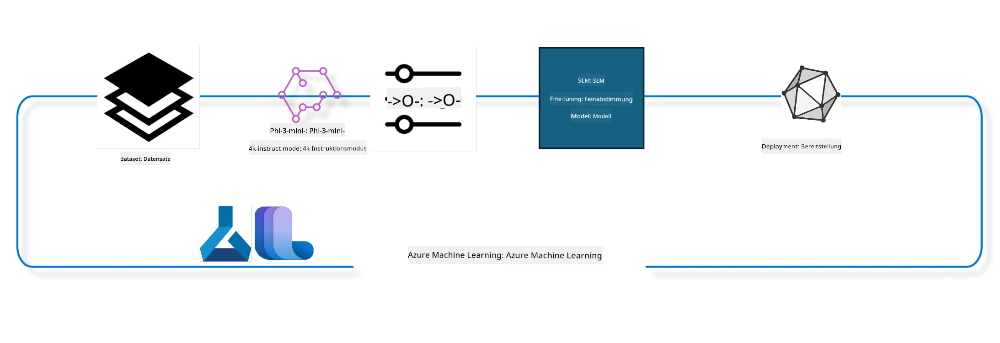

## Verwendung von Chat-Completion-Komponenten aus dem Azure ML-System-Registry zur Feinabstimmung eines Modells

In diesem Beispiel werden wir die Feinabstimmung des Phi-3-mini-4k-instruct-Modells durchführen, um ein Gespräch zwischen zwei Personen mit dem ultrachat_200k-Datensatz zu vervollständigen.



Das Beispiel zeigt, wie man eine Feinabstimmung mit dem Azure ML SDK und Python durchführt und das fein abgestimmte Modell dann an einem Online-Endpunkt für die Echtzeit-Inferenz bereitstellt.

### Trainingsdaten

Wir verwenden den ultrachat_200k-Datensatz. Dies ist eine stark gefilterte Version des UltraChat-Datensatzes und wurde verwendet, um Zephyr-7B-β zu trainieren, ein modernes 7b-Chat-Modell.

### Modell

Wir verwenden das Phi-3-mini-4k-instruct-Modell, um zu zeigen, wie Benutzer ein Modell für die Chat-Completion-Aufgabe feinabstimmen können. Wenn Sie dieses Notebook von einer spezifischen Modellkarte geöffnet haben, denken Sie daran, den spezifischen Modellnamen zu ersetzen.

### Aufgaben

- Wählen Sie ein Modell zur Feinabstimmung aus.
- Wählen und erkunden Sie die Trainingsdaten.
- Konfigurieren Sie den Feinabstimmungs-Job.
- Führen Sie den Feinabstimmungs-Job aus.
- Überprüfen Sie Trainings- und Bewertungsmetriken.
- Registrieren Sie das fein abgestimmte Modell.
- Stellen Sie das fein abgestimmte Modell für Echtzeit-Inferenz bereit.
- Räumen Sie Ressourcen auf.

## 1. Voraussetzungen einrichten

- Abhängigkeiten installieren
- Verbindung zum AzureML-Arbeitsbereich herstellen. Erfahren Sie mehr unter Einrichtung der SDK-Authentifizierung. Ersetzen Sie unten <WORKSPACE_NAME>, <RESOURCE_GROUP> und <SUBSCRIPTION_ID>.
- Verbindung zur AzureML-System-Registry herstellen
- Einen optionalen Experimentnamen festlegen
- Compute überprüfen oder erstellen.

> [!NOTE]
> Voraussetzung ist ein einzelner GPU-Knoten, der mehrere GPU-Karten haben kann. Zum Beispiel gibt es in einem Knoten des Typs Standard_NC24rs_v3 4 NVIDIA V100 GPUs, während Standard_NC12s_v3 2 NVIDIA V100 GPUs hat. Informationen hierzu finden Sie in der Dokumentation. Die Anzahl der GPU-Karten pro Knoten wird im Parameter gpus_per_node unten festgelegt. Eine korrekte Einstellung dieses Wertes stellt die Nutzung aller GPUs im Knoten sicher. Empfohlene GPU-Compute-SKUs finden Sie hier und hier.

### Python-Bibliotheken

Installieren Sie die Abhängigkeiten, indem Sie die folgende Zelle ausführen. Dies ist kein optionaler Schritt, wenn Sie in einer neuen Umgebung arbeiten.

```bash
pip install azure-ai-ml
pip install azure-identity
pip install datasets==2.9.0
pip install mlflow
pip install azureml-mlflow
```

### Interaktion mit Azure ML

1. Dieses Python-Skript wird verwendet, um mit dem Azure Machine Learning (Azure ML) Dienst zu interagieren. Hier eine Aufschlüsselung seiner Funktion:

    - Es importiert notwendige Module aus den Paketen azure.ai.ml, azure.identity und azure.ai.ml.entities. Außerdem wird das Modul time importiert.

    - Es versucht, sich mit DefaultAzureCredential() zu authentifizieren, was eine vereinfachte Authentifizierung bietet, um schnell mit der Entwicklung von Anwendungen zu beginnen, die in der Azure-Cloud ausgeführt werden. Falls das fehlschlägt, fällt es zurück auf InteractiveBrowserCredential(), welches eine interaktive Anmeldeaufforderung bietet.

    - Anschließend versucht es, eine MLClient-Instanz mit der from_config-Methode zu erstellen, die die Konfiguration aus der Standard-Konfigurationsdatei (config.json) liest. Wenn dies fehlschlägt, wird eine MLClient-Instanz manuell mit Angabe von subscription_id, resource_group_name und workspace_name erzeugt.

    - Es wird eine weitere MLClient-Instanz erstellt, diesmal für das Azure ML-Registry mit dem Namen "azureml". Dieses Registry speichert Modelle, Feinabstimmungs-Pipelines und Umgebungen.

    - Es wird der experiment_name auf "chat_completion_Phi-3-mini-4k-instruct" gesetzt.

    - Es wird ein eindeutiger Zeitstempel erzeugt, indem die aktuelle Zeit (in Sekunden seit der Epoche, als Gleitkommazahl) in eine Ganzzahl und dann in einen String umgewandelt wird. Dieser Zeitstempel kann zur Erstellung eindeutiger Namen und Versionen verwendet werden.

    ```python
    # Notwendige Module von Azure ML und Azure Identity importieren
    from azure.ai.ml import MLClient
    from azure.identity import (
        DefaultAzureCredential,
        InteractiveBrowserCredential,
    )
    from azure.ai.ml.entities import AmlCompute
    import time  # Zeitmodul importieren
    
    # Versuch, sich mit DefaultAzureCredential zu authentifizieren
    try:
        credential = DefaultAzureCredential()
        credential.get_token("https://management.azure.com/.default")
    except Exception as ex:  # Falls DefaultAzureCredential fehlschlägt, InteractiveBrowserCredential verwenden
        credential = InteractiveBrowserCredential()
    
    # Versuch, eine MLClient-Instanz mit der Standard-Konfigurationsdatei zu erstellen
    try:
        workspace_ml_client = MLClient.from_config(credential=credential)
    except:  # Falls das fehlschlägt, eine MLClient-Instanz durch manuelle Angabe der Details erstellen
        workspace_ml_client = MLClient(
            credential,
            subscription_id="<SUBSCRIPTION_ID>",
            resource_group_name="<RESOURCE_GROUP>",
            workspace_name="<WORKSPACE_NAME>",
        )
    
    # Eine weitere MLClient-Instanz für das Azure ML-Registry mit dem Namen "azureml" erstellen
    # Dieses Registry ist der Speicherort für Modelle, Fine-Tuning-Pipelines und Umgebungen
    registry_ml_client = MLClient(credential, registry_name="azureml")
    
    # Experimentnamen festlegen
    experiment_name = "chat_completion_Phi-3-mini-4k-instruct"
    
    # Einen eindeutigen Zeitstempel generieren, der für Namen und Versionen verwendet werden kann, die einzigartig sein müssen
    timestamp = str(int(time.time()))
    ```

## 2. Auswahl eines Foundation-Modells zur Feinabstimmung

1. Phi-3-mini-4k-instruct ist ein leichtgewichtiges, modernes Open Model mit 3,8 Milliarden Parametern, basierend auf Datensätzen, die für Phi-2 verwendet wurden. Das Modell gehört zur Phi-3-Modellfamilie, und die Mini-Version gibt es in zwei Varianten: 4K und 128K, was die Kontextlänge (in Tokens) angibt, die es unterstützen kann. Das Modell muss unser spezifisches Zielzweck finetuned werden, um es nutzen zu können. Diese Modelle können im Model-Katalog in AzureML Studio durchsucht werden, gefiltert nach der Aufgabe Chat-Completion. In diesem Beispiel verwenden wir das Phi-3-mini-4k-instruct-Modell. Wenn Sie dieses Notebook für ein anderes Modell geöffnet haben, ersetzen Sie entsprechend den Modellnamen und die Version.

> [!NOTE]
> die model id-Eigenschaft des Modells. Diese wird als Eingabe für den Feinabstimmungs-Job verwendet. Dies ist auch als Feld Asset ID auf der Detailseite des Modells im AzureML Studio Model-Katalog verfügbar.

2. Dieses Python-Skript interagiert mit dem Azure Machine Learning (Azure ML) Dienst. Hier eine Aufschlüsselung seiner Funktion:

    - Es setzt model_name auf "Phi-3-mini-4k-instruct".

    - Es verwendet die get-Methode der property models des Objekts registry_ml_client, um die neueste Version des Modells mit dem angegebenen Namen aus dem Azure ML-Registry abzurufen. Die get-Methode wird mit zwei Argumenten aufgerufen: dem Namen des Modells und einem Label, das angibt, dass die neueste Version des Modells abgerufen werden soll.

    - Es gibt eine Meldung auf der Konsole aus, die den Namen, die Version und die ID des Modells anzeigt, das für die Feinabstimmung verwendet wird. Die format-Methode des Strings wird verwendet, um den Namen, Version und ID des Modells in die Meldung einzufügen. Der Name, die Version und die ID des Modells werden als Eigenschaften des foundation_model-Objekts abgerufen.

    ```python
    # Legen Sie den Modellnamen fest
    model_name = "Phi-3-mini-4k-instruct"
    
    # Holen Sie die neueste Version des Modells aus dem Azure ML-Register
    foundation_model = registry_ml_client.models.get(model_name, label="latest")
    
    # Drucken Sie den Modellnamen, die Version und die ID aus
    # Diese Informationen sind nützlich für die Nachverfolgung und Fehlerbehebung
    print(
        "\n\nUsing model name: {0}, version: {1}, id: {2} for fine tuning".format(
            foundation_model.name, foundation_model.version, foundation_model.id
        )
    )
    ```

## 3. Erstellen eines Compute zur Verwendung mit dem Job

Der Feinabstimmungs-Job funktioniert NUR mit GPU-Compute. Die Größe des Compute hängt davon ab, wie groß das Modell ist, und in den meisten Fällen ist es schwierig, den richtigen Compute für den Job zu identifizieren. In dieser Zelle führen wir den Benutzer bei der Auswahl des richtigen Compute für den Job.

> [!NOTE]
> Die unten aufgeführten Compute-Typen arbeiten mit der am besten optimierten Konfiguration. Jegliche Änderungen an der Konfiguration können zu Cuda Out Of Memory-Fehlern führen. Versuchen Sie in solchen Fällen, den Compute auf eine größere Compute-Größe zu upgraden.

> [!NOTE]
> Beim Auswählen der compute_cluster_size unten stellen Sie sicher, dass der Compute in Ihrer Ressourcengruppe verfügbar ist. Falls ein bestimmter Compute nicht verfügbar ist, können Sie eine Anfrage stellen, um Zugriff auf die Compute-Ressourcen zu erhalten.

### Prüfung des Modells auf Feinabstimmungs-Support

1. Dieses Python-Skript interagiert mit einem Azure Machine Learning (Azure ML) Modell. Hier eine Aufschlüsselung der Funktionen:

    - Es importiert das Modul ast, das Funktionen zum Verarbeiten von Bäumen der Python-Abstract-Syntax-Grammatik bietet.

    - Es prüft, ob das foundation_model Objekt (das ein Modell in Azure ML repräsentiert) ein Tag mit dem Namen finetune_compute_allow_list besitzt. Tags in Azure ML sind Schlüssel-Wert-Paare, die Sie erstellen und zur Filterung und Sortierung von Modellen verwenden können.

    - Falls das Tag finetune_compute_allow_list vorhanden ist, verwendet es die Funktion ast.literal_eval, um den Wert des Tags (eine Zeichenkette) sicher in eine Python-Liste zu parsen. Diese Liste wird der Variablen computes_allow_list zugewiesen. Anschließend wird eine Meldung ausgegeben, die angibt, dass ein Compute aus der Liste erstellt werden soll.

    - Ist das Tag finetune_compute_allow_list nicht vorhanden, wird computes_allow_list auf None gesetzt und eine Meldung ausgegeben, die darauf hinweist, dass das Tag nicht Teil der Tags des Modells ist.

    - Zusammengefasst prüft dieses Skript ein spezielles Tag in den Metadaten des Modells, konvertiert dessen Wert in eine Liste, falls vorhanden, und gibt entsprechend Rückmeldung an den Benutzer.

    ```python
    # Importieren Sie das Modul ast, das Funktionen zur Verarbeitung von Bäumen der Python-Abstraktsyntax-Grammatik bereitstellt
    import ast
    
    # Überprüfen Sie, ob das Tag 'finetune_compute_allow_list' in den Tags des Modells vorhanden ist
    if "finetune_compute_allow_list" in foundation_model.tags:
        # Wenn das Tag vorhanden ist, verwenden Sie ast.literal_eval, um den Wert des Tags (einen String) sicher in eine Python-Liste zu parsen
        computes_allow_list = ast.literal_eval(
            foundation_model.tags["finetune_compute_allow_list"]
        )  # Konvertieren Sie einen String in eine Python-Liste
        # Drucken Sie eine Nachricht, die angibt, dass ein Compute aus der Liste erstellt werden soll
        print(f"Please create a compute from the above list - {computes_allow_list}")
    else:
        # Wenn das Tag nicht vorhanden ist, setzen Sie computes_allow_list auf None
        computes_allow_list = None
        # Drucken Sie eine Nachricht, die angibt, dass das Tag 'finetune_compute_allow_list' nicht Teil der Tags des Modells ist
        print("`finetune_compute_allow_list` is not part of model tags")
    ```

### Prüfung des Compute-Instanz

1. Dieses Python-Skript interagiert mit dem Azure Machine Learning (Azure ML) Dienst und führt mehrere Prüfungen auf einer Compute-Instanz durch. Hier eine Aufschlüsselung seiner Funktionen:

    - Es versucht, die Compute-Instanz mit dem Namen aus compute_cluster aus dem Azure ML-Arbeitsbereich abzurufen. Wenn sich der Bereitstellungsstatus der Compute-Instanz auf „failed“ befindet, wird ein ValueError ausgelöst.

    - Es prüft, ob computes_allow_list nicht None ist. Falls nicht, werden alle Compute-Größen in der Liste in Kleinbuchstaben umgewandelt und es wird geprüft, ob die Größe der aktuellen Compute-Instanz in dieser Liste enthalten ist. Falls nicht, wird ein ValueError ausgelöst.

    - Ist computes_allow_list None, wird geprüft, ob die Größe der Compute-Instanz in einer Liste nicht unterstützter GPU-VM-Größen enthalten ist. Falls ja, wird ein ValueError ausgelöst.

    - Es ruft eine Liste aller verfügbaren Compute-Größen im Workspace ab. Dann wird über diese Liste iteriert, und für jede Compute-Größe wird geprüft, ob ihr Name der Größe der aktuellen Compute-Instanz entspricht. Falls ja, wird die Anzahl der GPUs für diese Compute-Größe abgerufen und gpu_count_found auf True gesetzt.

    - Falls gpu_count_found True ist, wird die Anzahl der GPUs der Compute-Instanz ausgegeben. Falls gpu_count_found False ist, wird ein ValueError ausgelöst.

    - Zusammengefasst führt dieses Skript mehrere Prüfungen an einer Compute-Instanz in einem Azure ML-Arbeitsbereich durch, darunter der Bereitstellungsstatus, die Größe gegen eine Zulassungsliste oder Sperrliste und die Anzahl der GPUs.

    ```python
    # Die Ausnahme-Nachricht ausgeben
    print(e)
    # Löst einen ValueError aus, wenn die Compute-Größe im Workspace nicht verfügbar ist
    raise ValueError(
        f"WARNING! Compute size {compute_cluster_size} not available in workspace"
    )
    
    # Ruft die Compute-Instanz aus dem Azure ML-Workspace ab
    compute = workspace_ml_client.compute.get(compute_cluster)
    # Prüft, ob der Bereitstellungsstatus der Compute-Instanz "failed" ist
    if compute.provisioning_state.lower() == "failed":
        # Löst einen ValueError aus, wenn der Bereitstellungsstatus "failed" ist
        raise ValueError(
            f"Provisioning failed, Compute '{compute_cluster}' is in failed state. "
            f"please try creating a different compute"
        )
    
    # Prüft, ob computes_allow_list nicht None ist
    if computes_allow_list is not None:
        # Wandelt alle Compute-Größen in computes_allow_list in Kleinbuchstaben um
        computes_allow_list_lower_case = [x.lower() for x in computes_allow_list]
        # Prüft, ob die Größe der Compute-Instanz in computes_allow_list_lower_case enthalten ist
        if compute.size.lower() not in computes_allow_list_lower_case:
            # Löst einen ValueError aus, wenn die Größe der Compute-Instanz nicht in computes_allow_list_lower_case enthalten ist
            raise ValueError(
                f"VM size {compute.size} is not in the allow-listed computes for finetuning"
            )
    else:
        # Definiert eine Liste von nicht unterstützten GPU-VM-Größen
        unsupported_gpu_vm_list = [
            "standard_nc6",
            "standard_nc12",
            "standard_nc24",
            "standard_nc24r",
        ]
        # Prüft, ob die Größe der Compute-Instanz in unsupported_gpu_vm_list enthalten ist
        if compute.size.lower() in unsupported_gpu_vm_list:
            # Löst einen ValueError aus, wenn die Größe der Compute-Instanz in unsupported_gpu_vm_list enthalten ist
            raise ValueError(
                f"VM size {compute.size} is currently not supported for finetuning"
            )
    
    # Initialisiert eine Flagge, um zu prüfen, ob die Anzahl der GPUs in der Compute-Instanz gefunden wurde
    gpu_count_found = False
    # Ruft eine Liste aller verfügbaren Compute-Größen im Workspace ab
    workspace_compute_sku_list = workspace_ml_client.compute.list_sizes()
    available_sku_sizes = []
    # Durchläuft die Liste der verfügbaren Compute-Größen
    for compute_sku in workspace_compute_sku_list:
        available_sku_sizes.append(compute_sku.name)
        # Prüft, ob der Name der Compute-Größe mit der Größe der Compute-Instanz übereinstimmt
        if compute_sku.name.lower() == compute.size.lower():
            # Wenn ja, ruft die Anzahl der GPUs für diese Compute-Größe ab und setzt gpu_count_found auf True
            gpus_per_node = compute_sku.gpus
            gpu_count_found = True
    # Wenn gpu_count_found True ist, gibt die Anzahl der GPUs in der Compute-Instanz aus
    if gpu_count_found:
        print(f"Number of GPU's in compute {compute.size}: {gpus_per_node}")
    else:
        # Wenn gpu_count_found False ist, wird ein ValueError ausgelöst
        raise ValueError(
            f"Number of GPU's in compute {compute.size} not found. Available skus are: {available_sku_sizes}."
            f"This should not happen. Please check the selected compute cluster: {compute_cluster} and try again."
        )
    ```

## 4. Auswahl des Datensatzes für die Feinabstimmung des Modells

1. Wir verwenden den ultrachat_200k-Datensatz. Der Datensatz besitzt vier Splits, geeignet für Supervised Fine-Tuning (SFT).
Generierungs-Ranking (gen). Die Anzahl der Beispiele pro Split wird wie folgt angezeigt:

    ```bash
    train_sft test_sft  train_gen  test_gen
    207865  23110  256032  28304
    ```

1. Die nächsten Zellen zeigen die grundlegende Datenaufbereitung für die Feinabstimmung:

### Einige Datenzeilen visualisieren

Wir möchten, dass dieses Beispiel schnell läuft, daher speichern wir train_sft- und test_sft-Dateien, die jeweils 5 % der bereits gekürzten Zeilen enthalten. Dies bedeutet, dass das fein abgestimmte Modell eine geringere Genauigkeit haben wird und daher nicht für den Produktiveinsatz verwendet werden sollte.
Das Skript download-dataset.py wird verwendet, um den ultrachat_200k-Datensatz herunterzuladen und diesen in ein vom Feinabstimmungs-Pipeline-Komponenten verwendbares Format zu transformieren. Da der Datensatz groß ist, haben wir hier nur einen Teil des Datensatzes.

1. Das Ausführen des folgenden Skripts lädt nur 5 % der Daten herunter. Dies kann durch Ändern des Parameters dataset_split_pc auf den gewünschten Prozentsatz erhöht werden.

> [!NOTE]
> Manche Sprachmodelle verwenden unterschiedliche Sprachcodes, daher sollten auch die Spaltennamen im Datensatz entsprechend angepasst werden.

1. Hier ein Beispiel, wie die Daten aussehen sollten.
Der Chat-Completion-Datensatz wird im Parquet-Format gespeichert, wobei jeder Eintrag folgendes Schema aufweist:

    - Dies ist ein JSON (JavaScript Object Notation) Dokument, ein populäres Datenaustauschformat. Es ist kein ausführbarer Code, sondern eine Methode zum Speichern und Transportieren von Daten. Hier eine Aufschlüsselung der Struktur:

    - "prompt": Dieser Schlüssel enthält einen String, der eine Aufgabe oder Frage an einen KI-Assistenten darstellt.

    - "messages": Dieser Schlüssel enthält ein Array von Objekten. Jedes Objekt repräsentiert eine Nachricht in einem Gespräch zwischen einem Benutzer und einem KI-Assistenten. Jedes Nachrichtenobjekt hat zwei Schlüssel:

    - "content": Dieser Schlüssel enthält den Textinhalt der Nachricht als String.
    - "role": Dieser Schlüssel enthält einen String, der die Rolle der sendenden Entität angibt. Dies kann entweder "user" oder "assistant" sein.
    - "prompt_id": Dieser Schlüssel enthält einen String, der eine eindeutige Kennung für den Prompt darstellt.

1. In diesem speziellen JSON-Dokument wird ein Gespräch dargestellt, bei dem ein Benutzer einen KI-Assistenten bittet, eine Hauptfigur für eine dystopische Geschichte zu erstellen. Der Assistent antwortet, und der Benutzer fordert dann weitere Details an. Der Assistent erklärt sich bereit, weitere Details zu liefern. Das gesamte Gespräch ist mit einer spezifischen Prompt-ID verknüpft.

    ```python
    {
        // The task or question posed to an AI assistant
        "prompt": "Create a fully-developed protagonist who is challenged to survive within a dystopian society under the rule of a tyrant. ...",
        
        // An array of objects, each representing a message in a conversation between a user and an AI assistant
        "messages":[
            {
                // The content of the user's message
                "content": "Create a fully-developed protagonist who is challenged to survive within a dystopian society under the rule of a tyrant. ...",
                // The role of the entity that sent the message
                "role": "user"
            },
            {
                // The content of the assistant's message
                "content": "Name: Ava\n\n Ava was just 16 years old when the world as she knew it came crashing down. The government had collapsed, leaving behind a chaotic and lawless society. ...",
                // The role of the entity that sent the message
                "role": "assistant"
            },
            {
                // The content of the user's message
                "content": "Wow, Ava's story is so intense and inspiring! Can you provide me with more details.  ...",
                // The role of the entity that sent the message
                "role": "user"
            }, 
            {
                // The content of the assistant's message
                "content": "Certainly! ....",
                // The role of the entity that sent the message
                "role": "assistant"
            }
        ],
        
        // A unique identifier for the prompt
        "prompt_id": "d938b65dfe31f05f80eb8572964c6673eddbd68eff3db6bd234d7f1e3b86c2af"
    }
    ```

### Daten herunterladen

1. Dieses Python-Skript dient zum Herunterladen eines Datensatzes über ein Hilfsskript namens download-dataset.py. Hier eine Aufschlüsselung seiner Funktion:

    - Es importiert das Modul os, das eine plattformunabhängige Nutzung von Betriebssystemfunktionen ermöglicht.

    - Es nutzt die Funktion os.system, um das Skript download-dataset.py mit bestimmten Kommandozeilenargumenten im Shell auszuführen. Die Argumente spezifizieren den herunterzuladenden Datensatz (HuggingFaceH4/ultrachat_200k), das Verzeichnis für den Download (ultrachat_200k_dataset) und den Prozentsatz des Datensatzes, der gesplittet wird (5). Die Funktion os.system gibt den Exit-Status des ausgeführten Befehls zurück, welcher in der Variablen exit_status gespeichert wird.

    - Es prüft, ob exit_status ungleich 0 ist. In Unix-ähnlichen Betriebssystemen weist ein Exit-Status von 0 gewöhnlich auf Erfolg hin, jeder andere Wert auf einen Fehler. Wenn exit_status ungleich 0 ist, wird eine Exception mit einer Fehlermeldung ausgelöst, die auf einen Fehler beim Herunterladen des Datensatzes hinweist.

    - Zusammenfassend führt dieses Skript einen Befehl zum Herunterladen eines Datensatzes über ein Hilfsskript aus und wirft eine Ausnahme, falls der Befehl fehlschlägt.

    ```python
    # Importieren Sie das Modul os, das eine Möglichkeit bietet, betriebssystemabhängige Funktionen zu nutzen
    import os
    
    # Verwenden Sie die Funktion os.system, um das Skript download-dataset.py in der Shell mit bestimmten Befehlszeilenargumenten auszuführen
    # Die Argumente geben das herunterzuladende Dataset an (HuggingFaceH4/ultrachat_200k), das Verzeichnis, in das es heruntergeladen wird (ultrachat_200k_dataset), und den Prozentsatz des zu splittenden Datasets (5)
    # Die Funktion os.system gibt den Exit-Status des ausgeführten Befehls zurück; dieser Status wird in der Variablen exit_status gespeichert
    exit_status = os.system(
        "python ./download-dataset.py --dataset HuggingFaceH4/ultrachat_200k --download_dir ultrachat_200k_dataset --dataset_split_pc 5"
    )
    
    # Prüfen Sie, ob exit_status ungleich 0 ist
    # In Unix-ähnlichen Betriebssystemen zeigt ein Exit-Status von 0 normalerweise an, dass ein Befehl erfolgreich war, während jede andere Zahl einen Fehler anzeigt
    # Wenn exit_status nicht 0 ist, lösen Sie eine Exception mit einer Meldung aus, die angibt, dass ein Fehler beim Herunterladen des Datasets aufgetreten ist
    if exit_status != 0:
        raise Exception("Error downloading dataset")
    ```

### Laden der Daten in ein DataFrame
1. Dieses Python-Skript lädt eine JSON Lines-Datei in ein pandas DataFrame und zeigt die ersten 5 Zeilen an. Hier ist eine Aufschlüsselung dessen, was es tut:

    - Es importiert die pandas-Bibliothek, eine leistungsstarke Bibliothek zur Datenmanipulation und -analyse.

    - Es setzt die maximale Spaltenbreite in den Anzeigeoptionen von pandas auf 0. Das bedeutet, dass der volle Text jeder Spalte angezeigt wird, ohne abgeschnitten zu werden, wenn das DataFrame ausgegeben wird.

    - Es verwendet die Funktion pd.read_json, um die Datei train_sft.jsonl aus dem Verzeichnis ultrachat_200k_dataset in ein DataFrame zu laden. Das Argument lines=True gibt an, dass die Datei im JSON Lines-Format vorliegt, bei dem jede Zeile ein separates JSON-Objekt ist.

    - Es verwendet die Methode head, um die ersten 5 Zeilen des DataFrames anzuzeigen. Wenn das DataFrame weniger als 5 Zeilen hat, werden alle angezeigt.

    - Zusammenfassend lädt dieses Skript eine JSON Lines-Datei in ein DataFrame und zeigt die ersten 5 Zeilen mit vollständigem Spaltentext an.
    
    ```python
    # Importieren Sie die pandas-Bibliothek, die eine leistungsstarke Bibliothek zur Datenmanipulation und -analyse ist
    import pandas as pd
    
    # Setzen Sie die maximale Spaltenbreite in den Anzeigeoptionen von pandas auf 0
    # Dies bedeutet, dass der vollständige Text jeder Spalte ohne Abschneidung angezeigt wird, wenn das DataFrame ausgegeben wird
    pd.set_option("display.max_colwidth", 0)
    
    # Verwenden Sie die Funktion pd.read_json, um die Datei train_sft.jsonl aus dem Verzeichnis ultrachat_200k_dataset in ein DataFrame zu laden
    # Das Argument lines=True gibt an, dass die Datei im JSON Lines-Format vorliegt, wobei jede Zeile ein separates JSON-Objekt ist
    df = pd.read_json("./ultrachat_200k_dataset/train_sft.jsonl", lines=True)
    
    # Verwenden Sie die Methode head, um die ersten 5 Zeilen des DataFrames anzuzeigen
    # Wenn das DataFrame weniger als 5 Zeilen hat, werden alle angezeigt
    df.head()
    ```

## 5. Übermitteln Sie den Fine-Tuning-Job unter Verwendung des Modells und der Daten als Eingaben

Erstellen Sie den Job, der die Pipeline-Komponente für Chat-Komplettierung verwendet. Erfahren Sie mehr über alle Parameter, die für das Fine-Tuning unterstützt werden.

### Fine-Tuning-Parameter definieren

1. Fine-Tuning-Parameter lassen sich in 2 Kategorien einteilen – Trainingsparameter und Optimierungsparameter

1. Trainingsparameter definieren Aspekte des Trainings wie –

    - Den Optimierer, Scheduler, der verwendet wird
    - Die Metrik, die für das Fine-Tuning optimiert wird
    - Anzahl der Trainingsschritte, Batch-Größe und so weiter
    - Optimierungsparameter helfen bei der Optimierung des GPU-Speichers und einer effizienten Nutzung der Rechenressourcen.

1. Im Folgenden sind einige Parameter aufgeführt, die zu dieser Kategorie gehören. Diese Optimierungsparameter unterscheiden sich je nach Modell und werden zusammen mit dem Modell bereitgestellt, um diese Variationen zu handhaben.

    - Aktivieren von DeepSpeed und LoRA
    - Aktivieren von Mixed Precision Training
    - Aktivieren von Multi-Node Training

> [!NOTE]
> Überwachtes Fine-Tuning kann dazu führen, dass die Ausrichtung verloren geht oder katastrophales Vergessen auftritt. Wir empfehlen, dies zu überprüfen und nach dem Fine-Tuning eine Ausrichtungsphase durchzuführen.

### Fine-Tuning-Parameter

1. Dieses Python-Skript richtet Parameter für das Fine-Tuning eines Machine-Learning-Modells ein. Hier ist eine Aufschlüsselung dessen, was es tut:

    - Es legt Standard-Trainingsparameter fest, wie die Anzahl der Trainings-Epochen, Batch-Größen für Training und Bewertung, Lernrate und Typ des Lernraten-Schedulers.

    - Es richtet Standard-Optimierungsparameter ein, etwa ob Layer-wise Relevance Propagation (LoRa) und DeepSpeed angewendet werden sollen, sowie die DeepSpeed-Stufe.

    - Es fasst die Trainings- und Optimierungsparameter in einem einzigen Wörterbuch namens finetune_parameters zusammen.

    - Es prüft, ob das Foundation_Model modell-spezifische Standardparameter hat. Falls ja, gibt es eine Warnmeldung aus und aktualisiert das Wörterbuch finetune_parameters mit diesen modell-spezifischen Standardwerten. Die Funktion ast.literal_eval wird verwendet, um die modell-spezifischen Standardwerte aus einem String in ein Python-Wörterbuch zu konvertieren.

    - Es gibt die endgültige Menge der für den Lauf verwendeten Fine-Tuning-Parameter aus.

    - Zusammenfassend richtet dieses Skript Parameter für das Fine-Tuning eines ML-Modells ein und zeigt sie an, wobei die Möglichkeit besteht, die Standardwerte mit modell-spezifischen zu überschreiben.

    ```python
    # Standard-Trainingsparameter wie die Anzahl der Trainingsepochen, Batch-Größen für Training und Evaluierung, Lernrate und Typ des Lernraten-Schedulers festlegen
    training_parameters = dict(
        num_train_epochs=3,
        per_device_train_batch_size=1,
        per_device_eval_batch_size=1,
        learning_rate=5e-6,
        lr_scheduler_type="cosine",
    )
    
    # Standard-Optimierungsparameter wie die Anwendung von Layer-wise Relevance Propagation (LoRa) und DeepSpeed sowie die DeepSpeed-Stufe festlegen
    optimization_parameters = dict(
        apply_lora="true",
        apply_deepspeed="true",
        deepspeed_stage=2,
    )
    
    # Die Trainings- und Optimierungsparameter in einem einzelnen Dictionary namens finetune_parameters zusammenführen
    finetune_parameters = {**training_parameters, **optimization_parameters}
    
    # Überprüfen, ob das foundation_model modell-spezifische Standardparameter hat
    # Falls ja, eine Warnmeldung ausgeben und das finetune_parameters-Dictionary mit diesen modell-spezifischen Standardwerten aktualisieren
    # Die Funktion ast.literal_eval wird verwendet, um die modell-spezifischen Standardwerte von einem String in ein Python-Dictionary umzuwandeln
    if "model_specific_defaults" in foundation_model.tags:
        print("Warning! Model specific defaults exist. The defaults could be overridden.")
        finetune_parameters.update(
            ast.literal_eval(  # String in Python-Dictionary umwandeln
                foundation_model.tags["model_specific_defaults"]
            )
        )
    
    # Die endgültigen Fine-Tuning-Parameter, die für den Lauf verwendet werden, ausgeben
    print(
        f"The following finetune parameters are going to be set for the run: {finetune_parameters}"
    )
    ```

### Trainings-Pipeline

1. Dieses Python-Skript definiert eine Funktion zur Erzeugung eines Anzeigennamens für eine Machine-Learning-Trainings-Pipeline und ruft diese Funktion auf, um den Anzeigennamen zu erzeugen und auszugeben. Hier ist eine Aufschlüsselung dessen, was es tut:

1. Die Funktion get_pipeline_display_name wird definiert. Diese Funktion generiert einen Anzeigennamen basierend auf verschiedenen Parametern, die mit der Trainings-Pipeline zusammenhängen.

1. Innerhalb der Funktion wird die Gesamt-Batch-Größe berechnet, indem die pro Gerät verwendete Batch-Größe, die Anzahl der Gradienten-Akkumulationsschritte, die Anzahl der GPUs pro Node und die Anzahl der für das Fine-Tuning verwendeten Nodes multipliziert werden.

1. Es werden weitere Parameter abgerufen wie: Typ des Lernraten-Schedulers, ob DeepSpeed angewendet wird, die DeepSpeed-Stufe, ob Layer-wise Relevance Propagation (LoRa) verwendet wird, das Limit der Anzahl der aufzubewahrenden Modell-Checkpoints und die maximale Sequenzlänge.

1. Es wird ein String konstruiert, der alle diese Parameter enthält, getrennt durch Bindestriche. Wenn DeepSpeed oder LoRa angewendet wird, enthält der String "ds" gefolgt von der DeepSpeed-Stufe bzw. "lora". Falls nicht, enthält er "nods" bzw. "nolora".

1. Die Funktion gibt diesen String zurück, der als Anzeigennamen für die Trainings-Pipeline dient.

1. Nachdem die Funktion definiert ist, wird sie aufgerufen, um den Anzeigennamen zu erzeugen, der anschließend ausgegeben wird.

1. Zusammenfassend generiert dieses Skript einen Anzeigennamen für eine Machine-Learning-Trainings-Pipeline basierend auf verschiedenen Parametern und gibt diesen Anzeigennamen aus.

    ```python
    # Definiere eine Funktion, um einen Anzeigenamen für die Trainingspipeline zu generieren
    def get_pipeline_display_name():
        # Berechne die gesamte Batch-Größe, indem die Batch-Größe pro Gerät, die Anzahl der Gradientenakkumulationsschritte, die Anzahl der GPUs pro Knoten und die Anzahl der für das Fine-Tuning verwendeten Knoten multipliziert werden
        batch_size = (
            int(finetune_parameters.get("per_device_train_batch_size", 1))
            * int(finetune_parameters.get("gradient_accumulation_steps", 1))
            * int(gpus_per_node)
            * int(finetune_parameters.get("num_nodes_finetune", 1))
        )
        # Hole den Typ des Lernraten-Schedulers
        scheduler = finetune_parameters.get("lr_scheduler_type", "linear")
        # Hole, ob DeepSpeed angewendet wird
        deepspeed = finetune_parameters.get("apply_deepspeed", "false")
        # Hole die DeepSpeed-Stufe
        ds_stage = finetune_parameters.get("deepspeed_stage", "2")
        # Wenn DeepSpeed angewendet wird, füge im Anzeigenamen "ds" gefolgt von der DeepSpeed-Stufe hinzu; wenn nicht, füge "nods" hinzu
        if deepspeed == "true":
            ds_string = f"ds{ds_stage}"
        else:
            ds_string = "nods"
        # Hole, ob Layer-wise Relevance Propagation (LoRa) angewendet wird
        lora = finetune_parameters.get("apply_lora", "false")
        # Wenn LoRa angewendet wird, füge "lora" im Anzeigenamen hinzu; wenn nicht, füge "nolora" hinzu
        if lora == "true":
            lora_string = "lora"
        else:
            lora_string = "nolora"
        # Hole die Begrenzung der Anzahl der zu behaltenden Modell-Checkpoints
        save_limit = finetune_parameters.get("save_total_limit", -1)
        # Hole die maximale Sequenzlänge
        seq_len = finetune_parameters.get("max_seq_length", -1)
        # Erstelle den Anzeigenamen, indem alle diese Parameter durch Bindestriche getrennt zusammengefügt werden
        return (
            model_name
            + "-"
            + "ultrachat"
            + "-"
            + f"bs{batch_size}"
            + "-"
            + f"{scheduler}"
            + "-"
            + ds_string
            + "-"
            + lora_string
            + f"-save_limit{save_limit}"
            + f"-seqlen{seq_len}"
        )
    
    # Rufe die Funktion auf, um den Anzeigenamen zu generieren
    pipeline_display_name = get_pipeline_display_name()
    # Gib den Anzeigenamen aus
    print(f"Display name used for the run: {pipeline_display_name}")
    ```

### Konfigurieren der Pipeline

Dieses Python-Skript definiert und konfiguriert eine Machine-Learning-Pipeline mit dem Azure Machine Learning SDK. Hier ist eine Aufschlüsselung dessen, was es tut:

1. Es importiert notwendige Module aus dem Azure AI ML SDK.

1. Es ruft eine Pipeline-Komponente namens "chat_completion_pipeline" aus dem Registry ab.

1. Es definiert einen Pipeline-Job mit dem `@pipeline`-Decorator und der Funktion `create_pipeline`. Der Name der Pipeline wird auf `pipeline_display_name` gesetzt.

1. Innerhalb der Funktion `create_pipeline` wird die abgerufene Pipeline-Komponente mit verschiedenen Parametern initialisiert, darunter der Modellpfad, Compute-Cluster für verschiedene Stufen, Datensatz-Splits für Training und Test, die Anzahl der GPUs für das Fine-Tuning und andere Fine-Tuning-Parameter.

1. Es wird die Ausgabe des Fine-Tuning-Jobs auf die Ausgabe des Pipeline-Jobs abgebildet. Dies ermöglicht eine einfache Registrierung des fein abgestimmten Modells, was benötigt wird, um das Modell in einem Online- oder Batch-Endpunkt bereitzustellen.

1. Es wird eine Instanz der Pipeline erzeugt, indem die Funktion `create_pipeline` aufgerufen wird.

1. Die Einstellung `force_rerun` der Pipeline wird auf `True` gesetzt, was bedeutet, dass keine zwischengespeicherten Ergebnisse von vorherigen Jobs verwendet werden.

1. Die Einstellung `continue_on_step_failure` der Pipeline wird auf `False` gesetzt, was bedeutet, dass die Pipeline stoppt, wenn ein Schritt fehlschlägt.

1. Zusammenfassend definiert und konfiguriert dieses Skript eine Machine-Learning-Pipeline für eine Chat-Komplettierungs-Aufgabe mit dem Azure Machine Learning SDK.

    ```python
    # Importiere notwendige Module aus dem Azure AI ML SDK
    from azure.ai.ml.dsl import pipeline
    from azure.ai.ml import Input
    
    # Hole die Pipeline-Komponente mit dem Namen "chat_completion_pipeline" aus dem Registry
    pipeline_component_func = registry_ml_client.components.get(
        name="chat_completion_pipeline", label="latest"
    )
    
    # Definiere den Pipeline-Job mit dem @pipeline-Dekorator und der Funktion create_pipeline
    # Der Name der Pipeline wird auf pipeline_display_name gesetzt
    @pipeline(name=pipeline_display_name)
    def create_pipeline():
        # Initialisiere die abgerufene Pipeline-Komponente mit verschiedenen Parametern
        # Diese umfassen den Modellpfad, Compute-Cluster für verschiedene Stufen, Datensatz-Aufteilungen für Training und Test, die Anzahl der GPUs für das Fine-Tuning und andere Fine-Tuning-Parameter
        chat_completion_pipeline = pipeline_component_func(
            mlflow_model_path=foundation_model.id,
            compute_model_import=compute_cluster,
            compute_preprocess=compute_cluster,
            compute_finetune=compute_cluster,
            compute_model_evaluation=compute_cluster,
            # Weise die Datensatz-Aufteilungen den Parametern zu
            train_file_path=Input(
                type="uri_file", path="./ultrachat_200k_dataset/train_sft.jsonl"
            ),
            test_file_path=Input(
                type="uri_file", path="./ultrachat_200k_dataset/test_sft.jsonl"
            ),
            # Trainingseinstellungen
            number_of_gpu_to_use_finetuning=gpus_per_node,  # Setze auf die Anzahl der im Compute verfügbaren GPUs
            **finetune_parameters
        )
        return {
            # Weise die Ausgabe des Fine-Tuning-Jobs der Ausgabe des Pipeline-Jobs zu
            # Dies geschieht, damit wir das feinabgestimmte Modell einfach registrieren können
            # Die Registrierung des Modells ist erforderlich, um das Modell an einem Online- oder Batch-Endpunkt bereitzustellen
            "trained_model": chat_completion_pipeline.outputs.mlflow_model_folder
        }
    
    # Erstelle eine Instanz der Pipeline durch Aufruf der Funktion create_pipeline
    pipeline_object = create_pipeline()
    
    # Verwende keine zwischengespeicherten Ergebnisse von vorherigen Jobs
    pipeline_object.settings.force_rerun = True
    
    # Setze Continue on Step Failure auf False
    # Das bedeutet, dass die Pipeline stoppt, wenn ein Schritt fehlschlägt
    pipeline_object.settings.continue_on_step_failure = False
    ```

### Job übermitteln

1. Dieses Python-Skript übermittelt einen Machine-Learning-Pipeline-Job an einen Azure Machine Learning Workspace und wartet anschließend auf den Abschluss des Jobs. Hier ist eine Aufschlüsselung dessen, was es tut:

    - Es ruft die Methode create_or_update des Objekts jobs im workspace_ml_client auf, um den Pipeline-Job einzureichen. Die zu verwendende Pipeline wird durch pipeline_object angegeben, und das Experiment, unter dem der Job läuft, durch experiment_name.

    - Anschließend ruft es die Methode stream des Objekts jobs im workspace_ml_client auf, um auf den Abschluss des Pipeline-Jobs zu warten. Zu wartender Job wird durch das Namensattribut des pipeline_job-Objekts angegeben.

    - Zusammenfassend übermittelt dieses Skript einen Machine-Learning-Pipeline-Job an einen Azure Machine Learning Workspace und wartet dann auf den Abschluss des Jobs.

    ```python
    # Übermitteln Sie den Pipeline-Job an den Azure Machine Learning-Arbeitsbereich
    # Die auszuführende Pipeline wird durch pipeline_object angegeben
    # Das Experiment, unter dem der Job ausgeführt wird, wird durch experiment_name angegeben
    pipeline_job = workspace_ml_client.jobs.create_or_update(
        pipeline_object, experiment_name=experiment_name
    )
    
    # Warten Sie, bis der Pipeline-Job abgeschlossen ist
    # Der zu wartende Job wird durch das Namensattribut des pipeline_job-Objekts angegeben
    workspace_ml_client.jobs.stream(pipeline_job.name)
    ```

## 6. Registrieren des fein abgestimmten Modells im Workspace

Wir werden das Modell aus der Ausgabe des Fine-Tuning-Jobs registrieren. Dies verfolgt die Abstammung zwischen dem fein abgestimmten Modell und dem Fine-Tuning-Job. Der Fine-Tuning-Job verfolgt zudem die Abstammung zum Foundation Model, den Daten und dem Trainingscode.

### Registrieren des ML-Modells

1. Dieses Python-Skript registriert ein Machine-Learning-Modell, das in einer Azure Machine Learning Pipeline trainiert wurde. Hier ist eine Aufschlüsselung dessen, was es tut:

    - Es importiert notwendige Module aus dem Azure AI ML SDK.

    - Es prüft, ob die Ausgabe trained_model vom Pipeline-Job vorhanden ist, indem es die get-Methode des jobs-Objekts im workspace_ml_client aufruft und auf das Attribut outputs zugreift.

    - Es erstellt einen Pfad zum trainierten Modell, indem es einen String formatiert, der den Namen des Pipeline-Jobs und den Namen der Ausgabe ("trained_model") enthält.

    - Es definiert einen Namen für das fein abgestimmte Modell, indem es an den ursprünglichen Modellnamen "-ultrachat-200k" anhängt und alle Schrägstriche durch Bindestriche ersetzt.

    - Es bereitet die Registrierung vor, indem es ein Model-Objekt mit verschiedenen Parametern erstellt, darunter der Pfad zum Modell, der Typ des Modells (MLflow-Modell), der Name und die Version des Modells sowie eine Beschreibung des Modells.

    - Es registriert das Modell, indem es die Methode create_or_update des models-Objekts im workspace_ml_client mit dem Model-Objekt als Argument aufruft.

    - Es gibt das registrierte Modell aus.

1. Zusammenfassend registriert dieses Skript ein Machine-Learning-Modell, das in einer Azure Machine Learning Pipeline trainiert wurde.
    
    ```python
    # Importieren Sie die notwendigen Module aus dem Azure AI ML SDK
    from azure.ai.ml.entities import Model
    from azure.ai.ml.constants import AssetTypes
    
    # Überprüfen Sie, ob die Ausgabe `trained_model` vom Pipeline-Job verfügbar ist
    print("pipeline job outputs: ", workspace_ml_client.jobs.get(pipeline_job.name).outputs)
    
    # Erstellen Sie einen Pfad zum trainierten Modell, indem Sie einen String mit dem Namen des Pipeline-Jobs und dem Namen der Ausgabe ("trained_model") formatieren
    model_path_from_job = "azureml://jobs/{0}/outputs/{1}".format(
        pipeline_job.name, "trained_model"
    )
    
    # Definieren Sie einen Namen für das feinabgestimmte Modell, indem Sie "-ultrachat-200k" an den ursprünglichen Modellnamen anhängen und alle Schrägstriche durch Bindestriche ersetzen
    finetuned_model_name = model_name + "-ultrachat-200k"
    finetuned_model_name = finetuned_model_name.replace("/", "-")
    
    print("path to register model: ", model_path_from_job)
    
    # Bereiten Sie die Registrierung des Modells vor, indem Sie ein Model-Objekt mit verschiedenen Parametern erstellen
    # Diese beinhalten den Pfad zum Modell, den Modelltyp (MLflow-Modell), den Namen und die Version des Modells sowie eine Beschreibung des Modells
    prepare_to_register_model = Model(
        path=model_path_from_job,
        type=AssetTypes.MLFLOW_MODEL,
        name=finetuned_model_name,
        version=timestamp,  # Verwenden Sie einen Zeitstempel als Version, um Versionskonflikte zu vermeiden
        description=model_name + " fine tuned model for ultrachat 200k chat-completion",
    )
    
    print("prepare to register model: \n", prepare_to_register_model)
    
    # Registrieren Sie das Modell, indem Sie die Methode create_or_update des models-Objekts im workspace_ml_client mit dem Model-Objekt als Argument aufrufen
    registered_model = workspace_ml_client.models.create_or_update(
        prepare_to_register_model
    )
    
    # Geben Sie das registrierte Modell aus
    print("registered model: \n", registered_model)
    ```

## 7. Bereitstellen des fein abgestimmten Modells an einem Online-Endpunkt

Online-Endpunkte bieten eine dauerhafte REST-API, die verwendet werden kann, um das Modell in Anwendungen zu integrieren.

### Verwalten des Endpunkts

1. Dieses Python-Skript erstellt einen verwalteten Online-Endpunkt in Azure Machine Learning für ein registriertes Modell. Hier ist eine Aufschlüsselung dessen, was es tut:

    - Es importiert notwendige Module aus dem Azure AI ML SDK.

    - Es definiert einen eindeutigen Namen für den Online-Endpunkt, indem es einen Zeitstempel an den String "ultrachat-completion-" anhängt.

    - Es bereitet die Erstellung des Online-Endpunkts vor, indem es ein ManagedOnlineEndpoint-Objekt mit verschiedenen Parametern erstellt, darunter der Name des Endpunkts, eine Beschreibung des Endpunkts und den Authentifizierungsmodus ("key").

    - Es erstellt den Online-Endpunkt, indem es die Methode begin_create_or_update des workspace_ml_client mit dem ManagedOnlineEndpoint-Objekt als Argument aufruft und anschließend die Operation mit der Methode wait abwartet.

1. Zusammenfassend erstellt dieses Skript einen verwalteten Online-Endpunkt in Azure Machine Learning für ein registriertes Modell.

    ```python
    # Importieren Sie die notwendigen Module aus dem Azure AI ML SDK
    from azure.ai.ml.entities import (
        ManagedOnlineEndpoint,
        ManagedOnlineDeployment,
        ProbeSettings,
        OnlineRequestSettings,
    )
    
    # Definieren Sie einen eindeutigen Namen für den Online-Endpunkt, indem Sie einen Zeitstempel an den String "ultrachat-completion-" anhängen
    online_endpoint_name = "ultrachat-completion-" + timestamp
    
    # Bereiten Sie die Erstellung des Online-Endpunkts vor, indem Sie ein ManagedOnlineEndpoint-Objekt mit verschiedenen Parametern erstellen
    # Diese beinhalten den Namen des Endpunkts, eine Beschreibung des Endpunkts und den Authentifizierungsmodus ("key")
    endpoint = ManagedOnlineEndpoint(
        name=online_endpoint_name,
        description="Online endpoint for "
        + registered_model.name
        + ", fine tuned model for ultrachat-200k-chat-completion",
        auth_mode="key",
    )
    
    # Erstellen Sie den Online-Endpunkt, indem Sie die Methode begin_create_or_update des workspace_ml_client mit dem ManagedOnlineEndpoint-Objekt als Argument aufrufen
    # Warten Sie dann auf den Abschluss des Erstellungsvorgangs, indem Sie die wait-Methode aufrufen
    workspace_ml_client.begin_create_or_update(endpoint).wait()
    ```

> [!NOTE]
> Hier finden Sie die Liste der für die Bereitstellung unterstützten SKUs – [Managed online endpoints SKU list](https://learn.microsoft.com/azure/machine-learning/reference-managed-online-endpoints-vm-sku-list)

### Bereitstellen des ML-Modells

1. Dieses Python-Skript stellt ein registriertes Machine-Learning-Modell an einem verwalteten Online-Endpunkt in Azure Machine Learning bereit. Hier ist eine Aufschlüsselung dessen, was es tut:

    - Es importiert das Modul ast, das Funktionen zur Verarbeitung von Bäumen der Python-Abstract-Syntax-Grammatik bereitstellt.

    - Es legt den Instanztyp für die Bereitstellung auf "Standard_NC6s_v3" fest.

    - Es prüft, ob die Tag inference_compute_allow_list im Foundation Model vorhanden ist. Falls ja, konvertiert es den Tag-Wert von einem String in eine Python-Liste und weist ihn inference_computes_allow_list zu. Falls nicht, wird inference_computes_allow_list auf None gesetzt.

    - Es prüft, ob der angegebene Instanztyp in der Allow-Liste ist. Falls nicht, gibt es eine Nachricht aus, die den Benutzer auffordert, einen Instanztyp aus der Allow-Liste auszuwählen.

    - Es bereitet die Erstellung der Bereitstellung vor, indem es ein ManagedOnlineDeployment-Objekt mit verschiedenen Parametern erstellt, darunter der Name der Bereitstellung, der Name des Endpunkts, die ID des Modells, der Instanztyp und die Instanzanzahl, die Einstellungen für die Liveness-Probe und die Request-Einstellungen.

    - Es erstellt die Bereitstellung, indem es die Methode begin_create_or_update des workspace_ml_client mit dem ManagedOnlineDeployment-Objekt als Argument aufruft und anschließend die Operation mit der Methode wait abwartet.

    - Es setzt den Traffic des Endpunkts so, dass 100 % des Traffics an die Bereitstellung "demo" geleitet werden.

    - Es aktualisiert den Endpunkt, indem es die Methode begin_create_or_update des workspace_ml_client mit dem Endpunktobjekt als Argument aufruft und anschließend die Operation mit der Methode result abwartet.

1. Zusammenfassend stellt dieses Skript ein registriertes Machine-Learning-Modell an einem verwalteten Online-Endpunkt in Azure Machine Learning bereit.

    ```python
    # Importieren Sie das ast-Modul, das Funktionen zur Verarbeitung von Bäumen der Python-Abstraktsyntaxgrammatik bereitstellt
    import ast
    
    # Legen Sie den Instanztyp für die Bereitstellung fest
    instance_type = "Standard_NC6s_v3"
    
    # Prüfen Sie, ob das Tag `inference_compute_allow_list` im Foundation Model vorhanden ist
    if "inference_compute_allow_list" in foundation_model.tags:
        # Falls ja, konvertieren Sie den Tag-Wert von einem String in eine Python-Liste und weisen ihn `inference_computes_allow_list` zu
        inference_computes_allow_list = ast.literal_eval(
            foundation_model.tags["inference_compute_allow_list"]
        )
        print(f"Please create a compute from the above list - {computes_allow_list}")
    else:
        # Falls nicht, setzen Sie `inference_computes_allow_list` auf `None`
        inference_computes_allow_list = None
        print("`inference_compute_allow_list` is not part of model tags")
    
    # Prüfen Sie, ob der angegebene Instanztyp in der Allow-Liste enthalten ist
    if (
        inference_computes_allow_list is not None
        and instance_type not in inference_computes_allow_list
    ):
        print(
            f"`instance_type` is not in the allow listed compute. Please select a value from {inference_computes_allow_list}"
        )
    
    # Bereiten Sie die Erstellung der Bereitstellung vor, indem Sie ein `ManagedOnlineDeployment`-Objekt mit verschiedenen Parametern erstellen
    demo_deployment = ManagedOnlineDeployment(
        name="demo",
        endpoint_name=online_endpoint_name,
        model=registered_model.id,
        instance_type=instance_type,
        instance_count=1,
        liveness_probe=ProbeSettings(initial_delay=600),
        request_settings=OnlineRequestSettings(request_timeout_ms=90000),
    )
    
    # Erstellen Sie die Bereitstellung, indem Sie die Methode `begin_create_or_update` des `workspace_ml_client` mit dem `ManagedOnlineDeployment`-Objekt als Argument aufrufen
    # Warten Sie anschließend auf den Abschluss des Erstellungsvorgangs, indem Sie die Methode `wait` aufrufen
    workspace_ml_client.online_deployments.begin_create_or_update(demo_deployment).wait()
    
    # Legen Sie den Datenverkehr des Endpunkts so fest, dass 100 % des Datenverkehrs auf die "demo"-Bereitstellung geleitet werden
    endpoint.traffic = {"demo": 100}
    
    # Aktualisieren Sie den Endpunkt, indem Sie die Methode `begin_create_or_update` des `workspace_ml_client` mit dem `endpoint`-Objekt als Argument aufrufen
    # Warten Sie anschließend auf den Abschluss des Aktualisierungsvorgangs, indem Sie die Methode `result` aufrufen
    workspace_ml_client.begin_create_or_update(endpoint).result()
    ```

## 8. Testen des Endpunkts mit Beispieldaten

Wir holen einige Beispieldaten aus dem Testdatensatz und senden sie an den Online-Endpunkt zur Inferenz. Anschließend zeigen wir die bewerteten Labels neben den Ground-Truth-Labels an.

### Ergebnisse lesen

1. Dieses Python-Skript liest eine JSON Lines-Datei in ein pandas DataFrame ein, nimmt eine Zufallsstichprobe und setzt den Index zurück. Hier ist eine Aufschlüsselung dessen, was es tut:

    - Es liest die Datei ./ultrachat_200k_dataset/test_gen.jsonl in ein pandas DataFrame ein. Die Funktion read_json wird mit dem Argument lines=True verwendet, weil die Datei im JSON Lines-Format vorliegt, bei dem jede Zeile ein separates JSON-Objekt ist.

    - Es nimmt eine Zufallsstichprobe von 1 Zeile aus dem DataFrame. Die Funktion sample wird mit dem Argument n=1 verwendet, um die Anzahl der auszuwählenden zufälligen Zeilen anzugeben.

    - Es setzt den Index des DataFrames zurück. Die Funktion reset_index wird mit dem Argument drop=True verwendet, um den ursprünglichen Index zu verwerfen und durch einen neuen Standard-Integer-Index zu ersetzen.

    - Es zeigt die ersten 2 Zeilen des DataFrames mit der Funktion head und dem Argument 2 an. Da das DataFrame allerdings nach der Stichprobe nur eine Zeile enthält, wird nur diese eine Zeile angezeigt.

1. Zusammenfassend liest dieses Skript eine JSON Lines-Datei in ein pandas DataFrame ein, nimmt eine Zufallsstichprobe von 1 Zeile, setzt den Index zurück und zeigt die erste Zeile an.
    
    ```python
    # Pandas-Bibliothek importieren
    import pandas as pd
    
    # Die JSON Lines-Datei './ultrachat_200k_dataset/test_gen.jsonl' in ein pandas DataFrame einlesen
    # Das Argument 'lines=True' gibt an, dass die Datei im JSON Lines-Format vorliegt, wobei jede Zeile ein separates JSON-Objekt ist
    test_df = pd.read_json("./ultrachat_200k_dataset/test_gen.jsonl", lines=True)
    
    # Eine zufällige Stichprobe von 1 Zeile aus dem DataFrame entnehmen
    # Das Argument 'n=1' spezifiziert die Anzahl der zufällig auszuwählenden Zeilen
    test_df = test_df.sample(n=1)
    
    # Den Index des DataFrames zurücksetzen
    # Das Argument 'drop=True' gibt an, dass der ursprüngliche Index verworfen und durch einen neuen Index mit Standard-Ganzzahlwerten ersetzt wird
    # Das Argument 'inplace=True' gibt an, dass das DataFrame direkt geändert wird (ohne ein neues Objekt zu erstellen)
    test_df.reset_index(drop=True, inplace=True)
    
    # Die ersten 2 Zeilen des DataFrames anzeigen
    # Da das DataFrame nach der Stichprobe jedoch nur eine Zeile enthält, wird nur diese eine Zeile angezeigt
    test_df.head(2)
    ```

### JSON-Objekt erstellen
1. Dieses Python-Skript erstellt ein JSON-Objekt mit bestimmten Parametern und speichert es in einer Datei. Hier ist eine Aufschlüsselung dessen, was es tut:

    - Es importiert das json-Modul, das Funktionen zum Arbeiten mit JSON-Daten bereitstellt.

    - Es erstellt ein Wörterbuch parameters mit Schlüsseln und Werten, die Parameter für ein Machine-Learning-Modell repräsentieren. Die Schlüssel sind "temperature", "top_p", "do_sample" und "max_new_tokens" mit den entsprechenden Werten 0,6, 0,9, True bzw. 200.

    - Es erstellt ein weiteres Wörterbuch test_json mit zwei Schlüsseln: "input_data" und "params". Der Wert von "input_data" ist ein weiteres Wörterbuch mit den Schlüsseln "input_string" und "parameters". Der Wert von "input_string" ist eine Liste, die die erste Nachricht aus dem DataFrame test_df enthält. Der Wert von "parameters" ist das zuvor erstellte parameters-Wörterbuch. Der Wert von "params" ist ein leeres Wörterbuch.

    - Es öffnet eine Datei namens sample_score.json
    
    ```python
    # Importiere das json-Modul, das Funktionen zur Arbeit mit JSON-Daten bereitstellt
    import json
    
    # Erstelle ein Wörterbuch `parameters` mit Schlüsseln und Werten, die Parameter für ein maschinelles Lernmodell darstellen
    # Die Schlüssel sind "temperature", "top_p", "do_sample" und "max_new_tokens", und ihre entsprechenden Werte sind 0,6, 0,9, True und 200
    parameters = {
        "temperature": 0.6,
        "top_p": 0.9,
        "do_sample": True,
        "max_new_tokens": 200,
    }
    
    # Erstelle ein weiteres Wörterbuch `test_json` mit zwei Schlüsseln: "input_data" und "params"
    # Der Wert von "input_data" ist ein weiteres Wörterbuch mit den Schlüsseln "input_string" und "parameters"
    # Der Wert von "input_string" ist eine Liste, die die erste Nachricht aus dem DataFrame `test_df` enthält
    # Der Wert von "parameters" ist das zuvor erstellte Wörterbuch `parameters`
    # Der Wert von "params" ist ein leeres Wörterbuch
    test_json = {
        "input_data": {
            "input_string": [test_df["messages"][0]],
            "parameters": parameters,
        },
        "params": {},
    }
    
    # Öffne eine Datei namens `sample_score.json` im Verzeichnis `./ultrachat_200k_dataset` im Schreibmodus
    with open("./ultrachat_200k_dataset/sample_score.json", "w") as f:
        # Schreibe das Wörterbuch `test_json` mit der Funktion `json.dump` im JSON-Format in die Datei
        json.dump(test_json, f)
    ```

### Endpoint aufrufen

1. Dieses Python-Skript ruft einen Online-Endpunkt in Azure Machine Learning auf, um eine JSON-Datei zu bewerten. Hier ist eine Aufschlüsselung dessen, was es tut:

    - Es ruft die Methode invoke der Eigenschaft online_endpoints des Objekts workspace_ml_client auf. Diese Methode wird verwendet, um eine Anfrage an einen Online-Endpunkt zu senden und eine Antwort zu erhalten.

    - Es gibt den Namen des Endpunkts und der Bereitstellung mit den Argumenten endpoint_name und deployment_name an. In diesem Fall ist der Endpunktname in der Variablen online_endpoint_name gespeichert und der Bereitstellungsname ist "demo".

    - Es gibt den Pfad zur zu bewertenden JSON-Datei mit dem Argument request_file an. In diesem Fall ist die Datei ./ultrachat_200k_dataset/sample_score.json.

    - Es speichert die Antwort des Endpunkts in der Variablen response.

    - Es gibt die Roh-Antwort aus.

1. Zusammenfassend ruft dieses Skript einen Online-Endpunkt in Azure Machine Learning auf, um eine JSON-Datei zu bewerten, und gibt die Antwort aus.

    ```python
    # Rufen Sie den Online-Endpunkt in Azure Machine Learning auf, um die Datei `sample_score.json` zu bewerten
    # Die `invoke`-Methode der `online_endpoints`-Eigenschaft des Objekts `workspace_ml_client` wird verwendet, um eine Anfrage an einen Online-Endpunkt zu senden und eine Antwort zu erhalten
    # Das Argument `endpoint_name` gibt den Namen des Endpunkts an, der in der Variablen `online_endpoint_name` gespeichert ist
    # Das Argument `deployment_name` gibt den Namen der Bereitstellung an, der "demo" ist
    # Das Argument `request_file` gibt den Pfad zur zu bewertenden JSON-Datei an, der `./ultrachat_200k_dataset/sample_score.json` ist
    response = workspace_ml_client.online_endpoints.invoke(
        endpoint_name=online_endpoint_name,
        deployment_name="demo",
        request_file="./ultrachat_200k_dataset/sample_score.json",
    )
    
    # Die rohe Antwort vom Endpunkt ausgeben
    print("raw response: \n", response, "\n")
    ```

## 9. Löschen des Online-Endpunkts

1. Vergiss nicht, den Online-Endpunkt zu löschen, sonst wird die Abrechnung für die vom Endpunkt genutzte Rechenleistung weiterlaufen. Diese Zeile Python-Code löscht einen Online-Endpunkt in Azure Machine Learning. Hier ist eine Aufschlüsselung dessen, was sie tut:

    - Es ruft die Methode begin_delete der Eigenschaft online_endpoints des Objekts workspace_ml_client auf. Diese Methode wird verwendet, um das Löschen eines Online-Endpunkts zu starten.

    - Es gibt den Namen des zu löschenden Endpunkts mit dem Argument name an. In diesem Fall ist der Endpunktname in der Variablen online_endpoint_name gespeichert.

    - Es ruft die Methode wait auf, um auf den Abschluss der Löschoperation zu warten. Dies ist eine blockierende Operation, d.h., das Skript wird nicht fortgesetzt, bis das Löschen abgeschlossen ist.

    - Zusammenfassend startet diese Zeile den Löschvorgang eines Online-Endpunkts in Azure Machine Learning und wartet auf den Abschluss der Operation.

    ```python
    # Löschen Sie den Online-Endpunkt in Azure Machine Learning
    # Die Methode `begin_delete` der Eigenschaft `online_endpoints` des Objekts `workspace_ml_client` wird verwendet, um das Löschen eines Online-Endpunkts zu starten
    # Das Argument `name` gibt den Namen des zu löschenden Endpunkts an, der in der Variablen `online_endpoint_name` gespeichert ist
    # Die Methode `wait` wird aufgerufen, um auf den Abschluss der Löschoperation zu warten. Dies ist eine blockierende Operation, was bedeutet, dass das Skript nicht fortfährt, bis die Löschung abgeschlossen ist
    workspace_ml_client.online_endpoints.begin_delete(name=online_endpoint_name).wait()
    ```

---

<!-- CO-OP TRANSLATOR DISCLAIMER START -->
**Haftungsausschluss**:  
Dieses Dokument wurde mit dem KI-Übersetzungsdienst [Co-op Translator](https://github.com/Azure/co-op-translator) übersetzt. Obwohl wir uns um Genauigkeit bemühen, bitten wir zu beachten, dass automatisierte Übersetzungen Fehler oder Ungenauigkeiten enthalten können. Das Originaldokument in seiner Ausgangssprache ist als maßgebliche Quelle zu betrachten. Für wichtige Informationen wird eine professionelle menschliche Übersetzung empfohlen. Wir übernehmen keine Haftung für Missverständnisse oder Fehlinterpretationen, die aus der Verwendung dieser Übersetzung entstehen.
<!-- CO-OP TRANSLATOR DISCLAIMER END -->