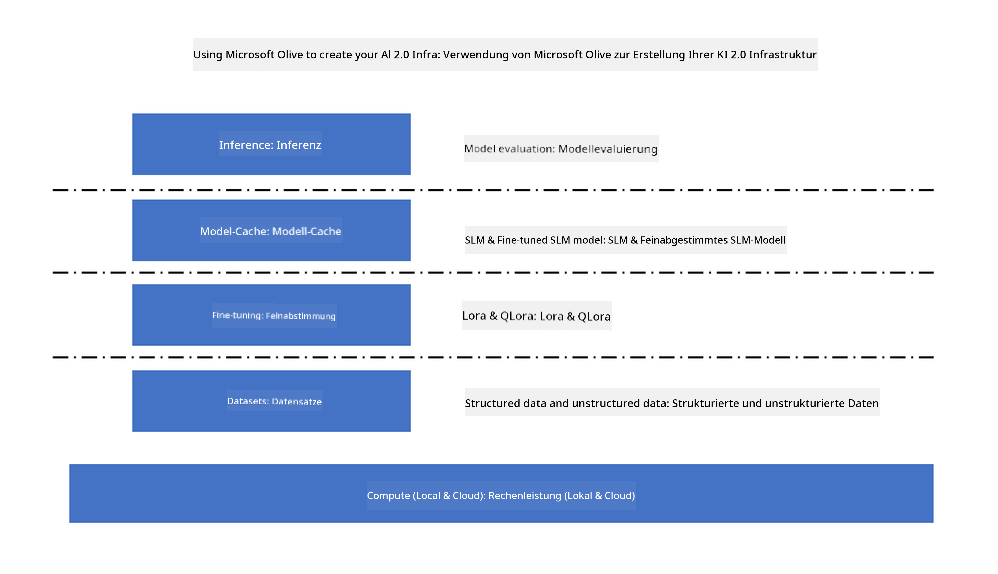

<!--
CO_OP_TRANSLATOR_METADATA:
{
  "original_hash": "5764be88ad2eb4f341e742eb8f14fab1",
  "translation_date": "2025-07-17T06:38:08+00:00",
  "source_file": "md/03.FineTuning/FineTuning_MicrosoftOlive.md",
  "language_code": "de"
}
-->
# **Feinabstimmung von Phi-3 mit Microsoft Olive**

[Olive](https://github.com/microsoft/OLive?WT.mc_id=aiml-138114-kinfeylo) ist ein benutzerfreundliches, hardwarebewusstes Modelloptimierungstool, das branchenführende Techniken aus den Bereichen Modellkompression, Optimierung und Kompilierung vereint.

Es wurde entwickelt, um den Prozess der Optimierung von Machine-Learning-Modellen zu vereinfachen und sicherzustellen, dass diese die spezifische Hardwarearchitektur möglichst effizient nutzen.

Egal, ob Sie an cloudbasierten Anwendungen oder Edge-Geräten arbeiten, Olive ermöglicht es Ihnen, Ihre Modelle mühelos und effektiv zu optimieren.

## Hauptmerkmale:
- Olive bündelt und automatisiert Optimierungstechniken für gewünschte Hardwareziele.
- Da keine einzelne Optimierungstechnik für alle Szenarien passt, erlaubt Olive Erweiterungen, indem Branchenexperten ihre Optimierungsinnovationen einbinden können.

## Reduzierung des Entwicklungsaufwands:
- Entwickler müssen oft mehrere hardwareherstellerspezifische Toolchains erlernen und nutzen, um trainierte Modelle für den Einsatz vorzubereiten und zu optimieren.
- Olive vereinfacht diesen Prozess, indem es die Optimierungstechniken für die gewünschte Hardware automatisiert.

## Fertige End-to-End-Optimierungslösung:

Durch die Kombination und Feinabstimmung integrierter Techniken bietet Olive eine einheitliche Lösung für die End-to-End-Optimierung.
Dabei werden Einschränkungen wie Genauigkeit und Latenz berücksichtigt.

## Feinabstimmung mit Microsoft Olive

Microsoft Olive ist ein sehr einfach zu bedienendes Open-Source-Modelloptimierungstool, das sowohl Feinabstimmung als auch Referenzierung im Bereich der generativen künstlichen Intelligenz abdeckt. Es erfordert nur eine einfache Konfiguration und in Kombination mit der Nutzung von Open-Source-Kleinsprachenmodellen und den zugehörigen Laufzeitumgebungen (AzureML / lokale GPU, CPU, DirectML) können Sie die Feinabstimmung oder Referenzierung des Modells durch automatische Optimierung abschließen und das beste Modell für die Bereitstellung in der Cloud oder auf Edge-Geräten finden. So können Unternehmen ihre eigenen branchenspezifischen Modelle sowohl lokal als auch in der Cloud erstellen.



## Phi-3 Feinabstimmung mit Microsoft Olive


## Phi-3 Olive Beispielcode und Beispiel
In diesem Beispiel verwenden Sie Olive, um:

- Einen LoRA-Adapter fein abzustimmen, der Phrasen in Trauer, Freude, Angst, Überraschung klassifiziert.
- Die Adapter-Gewichte in das Basismodell zu integrieren.
- Das Modell zu optimieren und in int4 zu quantisieren.

[Beispielcode](../../code/03.Finetuning/olive-ort-example/README.md)

### Microsoft Olive einrichten

Die Installation von Microsoft Olive ist sehr einfach und kann für CPU, GPU, DirectML und Azure ML durchgeführt werden.

```bash
pip install olive-ai
```

Wenn Sie ein ONNX-Modell mit einer CPU ausführen möchten, können Sie

```bash
pip install olive-ai[cpu]
```

Wenn Sie ein ONNX-Modell mit einer GPU ausführen möchten, können Sie

```python
pip install olive-ai[gpu]
```

Wenn Sie Azure ML verwenden möchten, nutzen Sie

```python
pip install git+https://github.com/microsoft/Olive#egg=olive-ai[azureml]
```

**Hinweis**  
Betriebssystemanforderung: Ubuntu 20.04 / 22.04

### **Config.json von Microsoft Olive**

Nach der Installation können Sie verschiedene modellbezogene Einstellungen über die Config-Datei konfigurieren, einschließlich Daten, Berechnung, Training, Bereitstellung und Modellerstellung.

**1. Daten**

Microsoft Olive unterstützt das Training mit lokalen und Cloud-Daten, die in den Einstellungen konfiguriert werden können.

*Einstellungen für lokale Daten*

Sie können einfach den Datensatz einrichten, der für die Feinabstimmung trainiert werden soll, üblicherweise im JSON-Format, und ihn mit der Datentemplate anpassen. Dies muss je nach Anforderungen des Modells angepasst werden (z. B. an das von Microsoft Phi-3-mini benötigte Format. Für andere Modelle beachten Sie bitte die erforderlichen Feinabstimmungsformate).

```json

    "data_configs": [
        {
            "name": "dataset_default_train",
            "type": "HuggingfaceContainer",
            "load_dataset_config": {
                "params": {
                    "data_name": "json", 
                    "data_files":"dataset/dataset-classification.json",
                    "split": "train"
                }
            },
            "pre_process_data_config": {
                "params": {
                    "dataset_type": "corpus",
                    "text_cols": [
                            "phrase",
                            "tone"
                    ],
                    "text_template": "### Text: {phrase}\n### The tone is:\n{tone}",
                    "corpus_strategy": "join",
                    "source_max_len": 2048,
                    "pad_to_max_len": false,
                    "use_attention_mask": false
                }
            }
        }
    ],
```

**Einstellungen für Cloud-Datenquellen**

Durch die Verknüpfung des Datenspeichers von Azure AI Studio/Azure Machine Learning Service können Sie verschiedene Datenquellen über Microsoft Fabric und Azure Data in Azure AI Studio/Azure Machine Learning Service einbinden, um die Daten für die Feinabstimmung bereitzustellen.

```json

    "data_configs": [
        {
            "name": "dataset_default_train",
            "type": "HuggingfaceContainer",
            "load_dataset_config": {
                "params": {
                    "data_name": "json", 
                    "data_files": {
                        "type": "azureml_datastore",
                        "config": {
                            "azureml_client": {
                                "subscription_id": "Your Azure Subscrition ID",
                                "resource_group": "Your Azure Resource Group",
                                "workspace_name": "Your Azure ML Workspaces name"
                            },
                            "datastore_name": "workspaceblobstore",
                            "relative_path": "Your train_data.json Azure ML Location"
                        }
                    },
                    "split": "train"
                }
            },
            "pre_process_data_config": {
                "params": {
                    "dataset_type": "corpus",
                    "text_cols": [
                            "Question",
                            "Best Answer"
                    ],
                    "text_template": "<|user|>\n{Question}<|end|>\n<|assistant|>\n{Best Answer}\n<|end|>",
                    "corpus_strategy": "join",
                    "source_max_len": 2048,
                    "pad_to_max_len": false,
                    "use_attention_mask": false
                }
            }
        }
    ],
    
```

**2. Berechnungskonfiguration**

Wenn Sie lokal arbeiten möchten, können Sie direkt lokale Datenressourcen verwenden. Wenn Sie Ressourcen von Azure AI Studio / Azure Machine Learning Service nutzen wollen, müssen Sie die entsprechenden Azure-Parameter, den Namen der Rechenressource usw. konfigurieren.

```json

    "systems": {
        "aml": {
            "type": "AzureML",
            "config": {
                "accelerators": ["gpu"],
                "hf_token": true,
                "aml_compute": "Your Azure AI Studio / Azure Machine Learning Service Compute Name",
                "aml_docker_config": {
                    "base_image": "Your Azure AI Studio / Azure Machine Learning Service docker",
                    "conda_file_path": "conda.yaml"
                }
            }
        },
        "azure_arc": {
            "type": "AzureML",
            "config": {
                "accelerators": ["gpu"],
                "aml_compute": "Your Azure AI Studio / Azure Machine Learning Service Compute Name",
                "aml_docker_config": {
                    "base_image": "Your Azure AI Studio / Azure Machine Learning Service docker",
                    "conda_file_path": "conda.yaml"
                }
            }
        }
    },
```

***Hinweis***

Da die Ausführung über einen Container auf Azure AI Studio/Azure Machine Learning Service erfolgt, muss die erforderliche Umgebung konfiguriert werden. Dies geschieht in der conda.yaml-Umgebung.

```yaml

name: project_environment
channels:
  - defaults
dependencies:
  - python=3.8.13
  - pip=22.3.1
  - pip:
      - einops
      - accelerate
      - azure-keyvault-secrets
      - azure-identity
      - bitsandbytes
      - datasets
      - huggingface_hub
      - peft
      - scipy
      - sentencepiece
      - torch>=2.2.0
      - transformers
      - git+https://github.com/microsoft/Olive@jiapli/mlflow_loading_fix#egg=olive-ai[gpu]
      - --extra-index-url https://aiinfra.pkgs.visualstudio.com/PublicPackages/_packaging/ORT-Nightly/pypi/simple/ 
      - ort-nightly-gpu==1.18.0.dev20240307004
      - --extra-index-url https://aiinfra.pkgs.visualstudio.com/PublicPackages/_packaging/onnxruntime-genai/pypi/simple/
      - onnxruntime-genai-cuda

    

```

**3. Wählen Sie Ihr SLM**

Sie können das Modell direkt von Hugging Face verwenden oder es direkt mit dem Model Catalog von Azure AI Studio / Azure Machine Learning kombinieren, um das zu verwendende Modell auszuwählen. Im folgenden Codebeispiel verwenden wir Microsoft Phi-3-mini als Beispiel.

Wenn Sie das Modell lokal haben, können Sie diese Methode verwenden

```json

    "input_model":{
        "type": "PyTorchModel",
        "config": {
            "hf_config": {
                "model_name": "model-cache/microsoft/phi-3-mini",
                "task": "text-generation",
                "model_loading_args": {
                    "trust_remote_code": true
                }
            }
        }
    },
```

Wenn Sie ein Modell von Azure AI Studio / Azure Machine Learning Service verwenden möchten, können Sie diese Methode nutzen

```json

    "input_model":{
        "type": "PyTorchModel",
        "config": {
            "model_path": {
                "type": "azureml_registry_model",
                "config": {
                    "name": "microsoft/Phi-3-mini-4k-instruct",
                    "registry_name": "azureml-msr",
                    "version": "11"
                }
            },
             "model_file_format": "PyTorch.MLflow",
             "hf_config": {
                "model_name": "microsoft/Phi-3-mini-4k-instruct",
                "task": "text-generation",
                "from_pretrained_args": {
                    "trust_remote_code": true
                }
            }
        }
    },
```

**Hinweis:**  
Wir müssen mit Azure AI Studio / Azure Machine Learning Service integriert sein, daher beachten Sie bei der Einrichtung des Modells bitte die Versionsnummer und die zugehörigen Bezeichnungen.

Alle Modelle auf Azure müssen auf PyTorch.MLflow eingestellt sein.

Sie benötigen ein Hugging Face-Konto und müssen den Schlüssel mit dem Key-Wert von Azure AI Studio / Azure Machine Learning verknüpfen.

**4. Algorithmus**

Microsoft Olive kapselt die LoRA- und QLoRA-Feinabstimmungsalgorithmen sehr gut. Sie müssen nur einige relevante Parameter konfigurieren. Hier nehme ich QLoRA als Beispiel.

```json
        "lora": {
            "type": "LoRA",
            "config": {
                "target_modules": [
                    "o_proj",
                    "qkv_proj"
                ],
                "double_quant": true,
                "lora_r": 64,
                "lora_alpha": 64,
                "lora_dropout": 0.1,
                "train_data_config": "dataset_default_train",
                "eval_dataset_size": 0.3,
                "training_args": {
                    "seed": 0,
                    "data_seed": 42,
                    "per_device_train_batch_size": 1,
                    "per_device_eval_batch_size": 1,
                    "gradient_accumulation_steps": 4,
                    "gradient_checkpointing": false,
                    "learning_rate": 0.0001,
                    "num_train_epochs": 3,
                    "max_steps": 10,
                    "logging_steps": 10,
                    "evaluation_strategy": "steps",
                    "eval_steps": 187,
                    "group_by_length": true,
                    "adam_beta2": 0.999,
                    "max_grad_norm": 0.3
                }
            }
        },
```

Wenn Sie eine Quantisierung durchführen möchten, unterstützt der Hauptzweig von Microsoft Olive bereits die onnxruntime-genai-Methode. Sie können dies nach Bedarf einstellen:

1. Adapter-Gewichte in das Basismodell integrieren  
2. Das Modell mit der erforderlichen Präzision mit ModelBuilder in ein ONNX-Modell konvertieren

z. B. Konvertierung in quantisiertes INT4

```json

        "merge_adapter_weights": {
            "type": "MergeAdapterWeights"
        },
        "builder": {
            "type": "ModelBuilder",
            "config": {
                "precision": "int4"
            }
        }
```

**Hinweis**  
- Wenn Sie QLoRA verwenden, wird die Quantisierungskonvertierung mit ONNXRuntime-genai derzeit nicht unterstützt.  
- Es sei hier angemerkt, dass Sie die oben genannten Schritte je nach Bedarf anpassen können. Es ist nicht notwendig, alle Schritte vollständig zu konfigurieren. Je nach Bedarf können Sie direkt die Algorithmen-Schritte ohne Feinabstimmung verwenden. Am Ende müssen Sie die relevanten Engines konfigurieren.

```json

    "engine": {
        "log_severity_level": 0,
        "host": "aml",
        "target": "aml",
        "search_strategy": false,
        "execution_providers": ["CUDAExecutionProvider"],
        "cache_dir": "../model-cache/models/phi3-finetuned/cache",
        "output_dir" : "../model-cache/models/phi3-finetuned"
    }
```

**5. Feinabstimmung abgeschlossen**

Führen Sie in der Befehlszeile im Verzeichnis der olive-config.json aus

```bash
olive run --config olive-config.json  
```

**Haftungsausschluss**:  
Dieses Dokument wurde mit dem KI-Übersetzungsdienst [Co-op Translator](https://github.com/Azure/co-op-translator) übersetzt. Obwohl wir uns um Genauigkeit bemühen, beachten Sie bitte, dass automatisierte Übersetzungen Fehler oder Ungenauigkeiten enthalten können. Das Originaldokument in seiner Ursprungssprache gilt als maßgebliche Quelle. Für wichtige Informationen wird eine professionelle menschliche Übersetzung empfohlen. Wir übernehmen keine Haftung für Missverständnisse oder Fehlinterpretationen, die aus der Nutzung dieser Übersetzung entstehen.