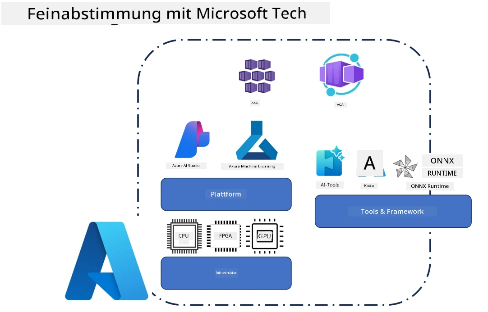
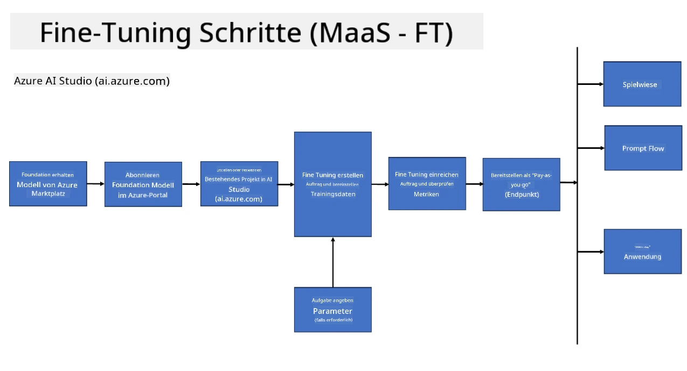
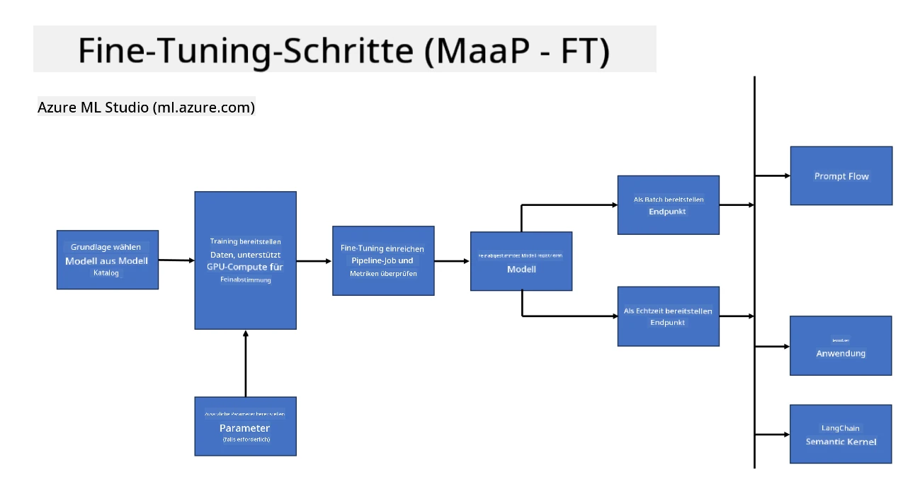
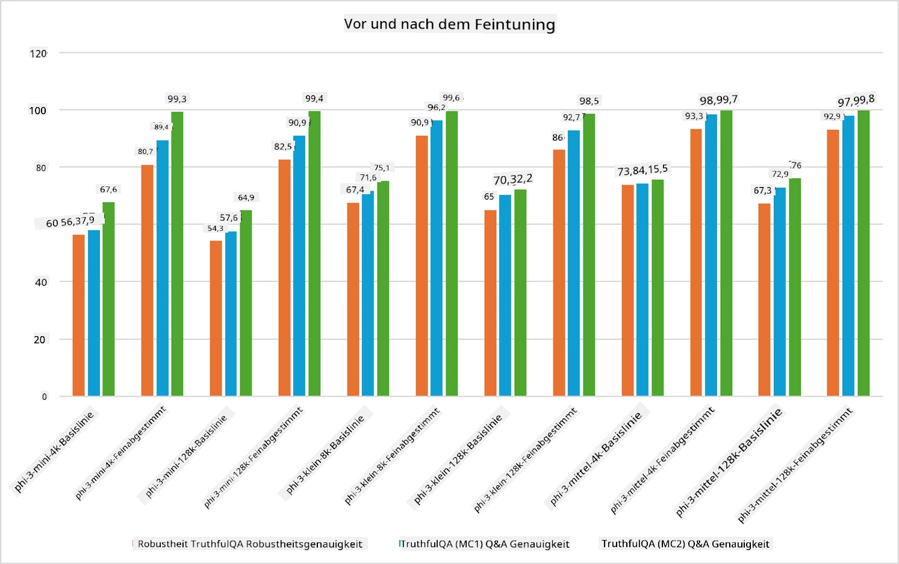

## Fine-Tuning-Szenarien

Dieser Abschnitt bietet einen Überblick über Fine-Tuning-Szenarien in Microsoft Foundry und Azure-Umgebungen, einschließlich Bereitstellungsmodelle, Infrastrukturebenen und häufig verwendete Optimierungstechniken.

**Plattform**  
Dies umfasst verwaltete Dienste wie Microsoft Foundry (ehemals Azure AI Foundry) und Azure Machine Learning, die Modellverwaltung, Orchestrierung, Experimentenverfolgung und Bereitstellungs-Workflows bereitstellen.

**Infrastruktur**  
Fine-Tuning erfordert skalierbare Rechenressourcen. In Azure-Umgebungen beinhaltet dies typischerweise GPU-basierte virtuelle Maschinen und CPU-Ressourcen für leichte Workloads sowie skalierbaren Speicher für Datensätze und Checkpoints.

**Tools & Framework**  
Fine-Tuning-Workflows basieren häufig auf Frameworks und Optimierungsbibliotheken wie Hugging Face Transformers, DeepSpeed und PEFT (Parameter-Efficient Fine-Tuning).

Der Fine-Tuning-Prozess mit Microsoft-Technologien umfasst Plattformdienste, Recheninfrastruktur und Trainingsframeworks. Durch das Verständnis, wie diese Komponenten zusammenarbeiten, können Entwickler Foundation-Modelle effizient an spezifische Aufgaben und Produktionsszenarien anpassen.

## Model as Service

Feinabstimmung des Modells mittels gehostetem Fine-Tuning, ohne eigene Compute-Ressourcen erstellen oder verwalten zu müssen.

Serverloses Fine-Tuning ist nun für die Modellfamilien Phi-3, Phi-3.5 und Phi-4 verfügbar, womit Entwickler Modelle für Cloud- und Edge-Szenarien schnell und einfach anpassen können, ohne sich um die Ressourcenbereitstellung kümmern zu müssen.

## Model as a Platform

Benutzer verwalten eigene Compute-Ressourcen, um ihre Modelle feinzujustieren.

[Fine Tuning Beispiel](https://github.com/Azure/azureml-examples/blob/main/sdk/python/foundation-models/system/finetune/chat-completion/chat-completion.ipynb)

## Vergleich der Fine-Tuning-Techniken

|Szenario|LoRA|QLoRA|PEFT|DeepSpeed|ZeRO|DoRA|
|---|---|---|---|---|---|---|
|Anpassung vortrainierter LLMs an spezifische Aufgaben oder Domänen|Ja|Ja|Ja|Ja|Ja|Ja|
|Fine-Tuning für NLP-Aufgaben wie Textklassifikation, Benannte Entitätenerkennung und maschinelle Übersetzung|Ja|Ja|Ja|Ja|Ja|Ja|
|Fine-Tuning für QA-Aufgaben|Ja|Ja|Ja|Ja|Ja|Ja|
|Fine-Tuning zur Erzeugung menschenähnlicher Antworten in Chatbots|Ja|Ja|Ja|Ja|Ja|Ja|
|Fine-Tuning zur Erzeugung von Musik, Kunst oder anderen kreativen Formen|Ja|Ja|Ja|Ja|Ja|Ja|
|Reduzierung von Rechen- und Kostenaufwand|Ja|Ja|Ja|Ja|Ja|Ja|
|Reduzierung des Speicherverbrauchs|Ja|Ja|Ja|Ja|Ja|Ja|
|Verwendung weniger Parameter für effizientes Fine-Tuning|Ja|Ja|Ja|Nein|Nein|Ja|
|Speichereffiziente Form von Datenparallelismus, die Zugriff auf den aggregierten GPU-Speicher aller verfügbaren GPU-Geräte ermöglicht|Nein|Nein|Nein|Ja|Ja|Nein|

> [!NOTE]
> LoRA, QLoRA, PEFT und DoRA sind parameter-effiziente Fine-Tuning-Methoden, während DeepSpeed und ZeRO sich auf verteiltes Training und Speicheroptimierung konzentrieren.

## Beispiele zur Fine-Tuning-Leistung

---

<!-- CO-OP TRANSLATOR DISCLAIMER START -->
**Haftungsausschluss**:  
Dieses Dokument wurde mit dem KI-Übersetzungsdienst [Co-op Translator](https://github.com/Azure/co-op-translator) übersetzt. Obwohl wir um Genauigkeit bemüht sind, können automatisierte Übersetzungen Fehler oder Ungenauigkeiten enthalten. Das Originaldokument in seiner Ausgangssprache gilt als maßgebliche Quelle. Für kritische Informationen wird eine professionelle menschliche Übersetzung empfohlen. Wir übernehmen keine Haftung für Missverständnisse oder Fehlinterpretationen, die aus der Nutzung dieser Übersetzung entstehen.
<!-- CO-OP TRANSLATOR DISCLAIMER END -->