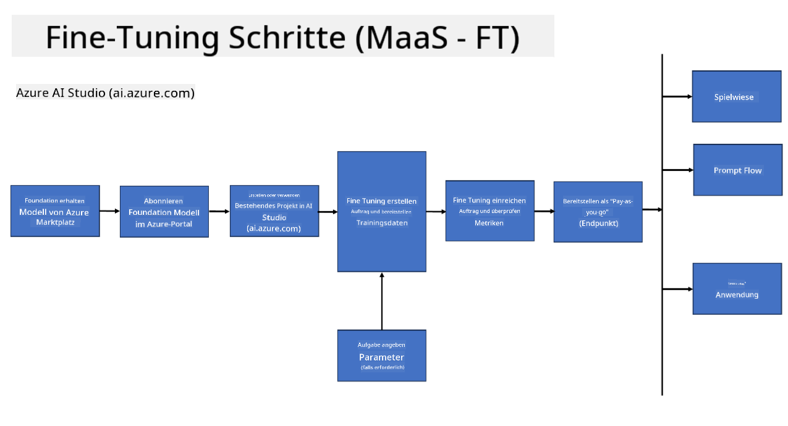
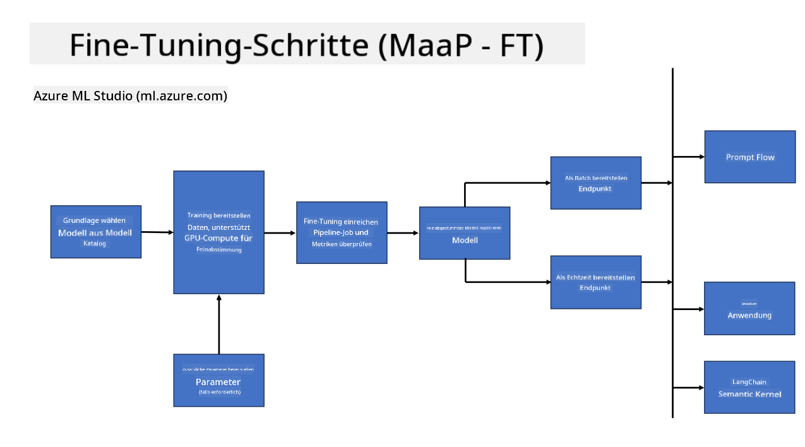
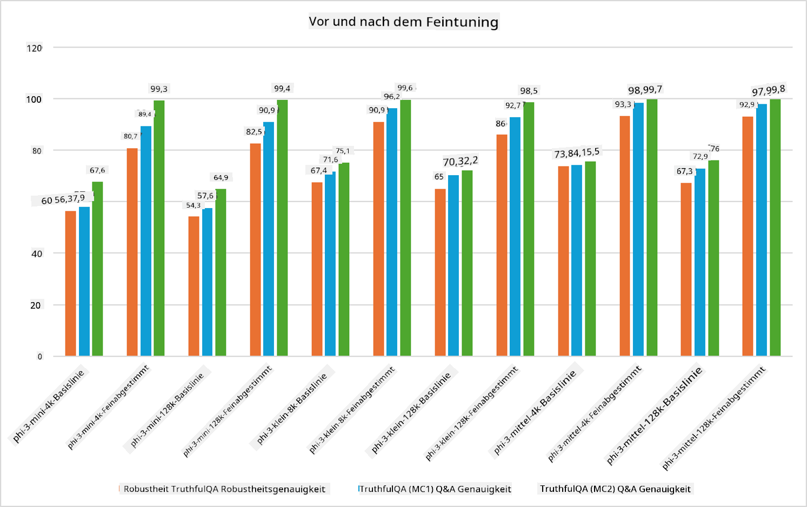

<!--
CO_OP_TRANSLATOR_METADATA:
{
  "original_hash": "cb5648935f63edc17e95ce38f23adc32",
  "translation_date": "2025-07-17T08:22:11+00:00",
  "source_file": "md/03.FineTuning/FineTuning_Scenarios.md",
  "language_code": "de"
}
-->
## Fine-Tuning-Szenarien

**Plattform** Dazu gehören verschiedene Technologien wie Azure AI Foundry, Azure Machine Learning, AI Tools, Kaito und ONNX Runtime.

**Infrastruktur** Dazu gehören CPU und FPGA, die für den Fine-Tuning-Prozess unerlässlich sind. Ich zeige Ihnen die Symbole für jede dieser Technologien.

**Tools & Framework** Dazu gehören ONNX Runtime und ONNX Runtime. Ich zeige Ihnen die Symbole für jede dieser Technologien.  
[Symbole für ONNX Runtime und ONNX Runtime einfügen]

Der Fine-Tuning-Prozess mit Microsoft-Technologien umfasst verschiedene Komponenten und Werkzeuge. Durch das Verständnis und die Nutzung dieser Technologien können wir unsere Anwendungen effektiv feinabstimmen und bessere Lösungen schaffen.

## Modell als Service

Feinabstimmung des Modells mit gehostetem Fine-Tuning, ohne dass Compute erstellt oder verwaltet werden muss.

Serverloses Fine-Tuning ist für die Modelle Phi-3-mini und Phi-3-medium verfügbar, wodurch Entwickler die Modelle schnell und einfach für Cloud- und Edge-Szenarien anpassen können, ohne Compute organisieren zu müssen. Wir haben außerdem angekündigt, dass Phi-3-small jetzt über unser Models-as-a-Service-Angebot verfügbar ist, sodass Entwickler schnell und unkompliziert mit der KI-Entwicklung starten können, ohne die zugrunde liegende Infrastruktur verwalten zu müssen.

## Modell als Plattform

Benutzer verwalten ihre eigene Compute-Ressource, um ihre Modelle feinabzustimmen.

[Fine Tuning Beispiel](https://github.com/Azure/azureml-examples/blob/main/sdk/python/foundation-models/system/finetune/chat-completion/chat-completion.ipynb)

## Fine-Tuning-Szenarien

| | | | | | | |
|-|-|-|-|-|-|-|
|Szenario|LoRA|QLoRA|PEFT|DeepSpeed|ZeRO|DORA|
|Anpassung vortrainierter LLMs an spezifische Aufgaben oder Domänen|Ja|Ja|Ja|Ja|Ja|Ja|
|Fine-Tuning für NLP-Aufgaben wie Textklassifikation, Named Entity Recognition und maschinelle Übersetzung|Ja|Ja|Ja|Ja|Ja|Ja|
|Fine-Tuning für QA-Aufgaben|Ja|Ja|Ja|Ja|Ja|Ja|
|Fine-Tuning zur Erzeugung menschenähnlicher Antworten in Chatbots|Ja|Ja|Ja|Ja|Ja|Ja|
|Fine-Tuning zur Erzeugung von Musik, Kunst oder anderen kreativen Formen|Ja|Ja|Ja|Ja|Ja|Ja|
|Reduzierung von Rechen- und Kostenaufwand|Ja|Ja|Nein|Ja|Ja|Nein|
|Reduzierung des Speicherverbrauchs|Nein|Ja|Nein|Ja|Ja|Ja|
|Verwendung weniger Parameter für effizientes Fine-Tuning|Nein|Ja|Ja|Nein|Nein|Ja|
|Speichereffiziente Form der Datenparallelität, die Zugriff auf den aggregierten GPU-Speicher aller verfügbaren GPU-Geräte ermöglicht|Nein|Nein|Nein|Ja|Ja|Ja|

## Beispiele für Fine-Tuning-Leistung

**Haftungsausschluss**:  
Dieses Dokument wurde mit dem KI-Übersetzungsdienst [Co-op Translator](https://github.com/Azure/co-op-translator) übersetzt. Obwohl wir uns um Genauigkeit bemühen, beachten Sie bitte, dass automatisierte Übersetzungen Fehler oder Ungenauigkeiten enthalten können. Das Originaldokument in seiner Ursprungssprache gilt als maßgebliche Quelle. Für wichtige Informationen wird eine professionelle menschliche Übersetzung empfohlen. Wir übernehmen keine Haftung für Missverständnisse oder Fehlinterpretationen, die aus der Nutzung dieser Übersetzung entstehen.