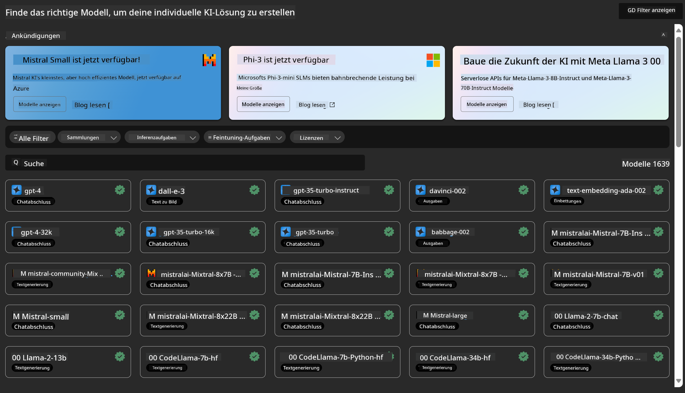
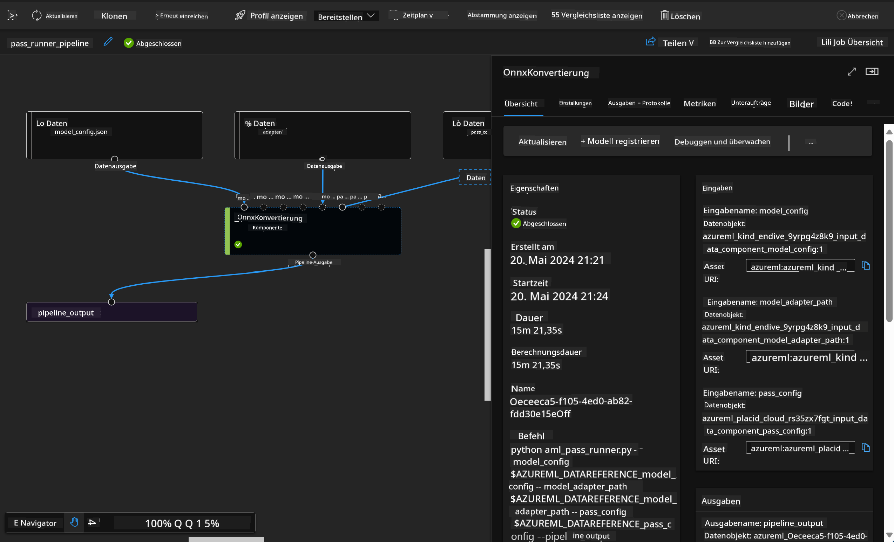

<!--
CO_OP_TRANSLATOR_METADATA:
{
  "original_hash": "7fe541373802e33568e94e13226d463c",
  "translation_date": "2025-05-07T10:23:52+00:00",
  "source_file": "md/03.FineTuning/Introduce_AzureML.md",
  "language_code": "de"
}
-->
# **Einführung in den Azure Machine Learning Service**

[Azure Machine Learning](https://ml.azure.com?WT.mc_id=aiml-138114-kinfeylo) ist ein Cloud-Dienst zur Beschleunigung und Verwaltung des gesamten Lebenszyklus von Machine-Learning-(ML)-Projekten.

ML-Experten, Data Scientists und Ingenieure können ihn in ihrem täglichen Arbeitsablauf verwenden, um:

- Modelle zu trainieren und bereitzustellen.
- Machine Learning Operations (MLOps) zu verwalten.
- Sie können ein Modell in Azure Machine Learning erstellen oder ein Modell verwenden, das auf einer Open-Source-Plattform wie PyTorch, TensorFlow oder scikit-learn entwickelt wurde.
- MLOps-Tools helfen Ihnen, Modelle zu überwachen, neu zu trainieren und erneut bereitzustellen.

## Für wen ist Azure Machine Learning gedacht?

**Data Scientists und ML-Ingenieure**

Sie können Werkzeuge nutzen, um ihre täglichen Arbeitsabläufe zu beschleunigen und zu automatisieren.  
Azure ML bietet Funktionen für Fairness, Erklärbarkeit, Nachverfolgung und Prüfbarkeit.

**Anwendungsentwickler:**  
Sie können Modelle nahtlos in Anwendungen oder Dienste integrieren.

**Plattformentwickler**

Sie haben Zugriff auf ein robustes Set an Tools, unterstützt durch langlebige Azure Resource Manager APIs.  
Diese Tools ermöglichen den Aufbau fortschrittlicher ML-Werkzeuge.

**Unternehmen**

Unternehmen, die in der Microsoft Azure Cloud arbeiten, profitieren von vertrauter Sicherheit und rollenbasierter Zugriffskontrolle.  
Projekte können so eingerichtet werden, dass der Zugriff auf geschützte Daten und spezifische Operationen kontrolliert wird.

## Produktivität für das gesamte Team  
ML-Projekte erfordern oft ein Team mit vielfältigen Fähigkeiten zum Aufbau und zur Wartung.

Azure ML stellt Tools bereit, die es ermöglichen:  
- Mit Ihrem Team über geteilte Notebooks, Rechenressourcen, serverlose Berechnung, Daten und Umgebungen zusammenzuarbeiten.  
- Modelle mit Fairness, Erklärbarkeit, Nachverfolgung und Prüfbarkeit zu entwickeln, um Anforderungen an Herkunft und Compliance zu erfüllen.  
- ML-Modelle schnell und einfach in großem Maßstab bereitzustellen sowie effizient mit MLOps zu verwalten und zu steuern.  
- Machine-Learning-Workloads überall auszuführen – mit integrierter Governance, Sicherheit und Compliance.

## Plattformübergreifende Tools

Jeder im ML-Team kann seine bevorzugten Werkzeuge verwenden, um die Arbeit zu erledigen.  
Ob schnelle Experimente, Hyperparameter-Tuning, Pipeline-Erstellung oder Inferenzverwaltung – Sie können vertraute Schnittstellen nutzen, darunter:  
- Azure Machine Learning Studio  
- Python SDK (v2)  
- Azure CLI (v2)  
- Azure Resource Manager REST APIs

Während Sie Modelle verfeinern und im Entwicklungszyklus zusammenarbeiten, können Sie Assets, Ressourcen und Metriken innerhalb der Azure Machine Learning Studio-Benutzeroberfläche teilen und finden.

## **LLM/SLM in Azure ML**

Azure ML hat viele Funktionen im Bereich LLM/SLM hinzugefügt, die LLMOps und SLMOps kombinieren, um eine unternehmensweite Plattform für generative künstliche Intelligenz bereitzustellen.

### **Model Catalog**

Unternehmensanwender können über den Model Catalog verschiedene Modelle entsprechend unterschiedlicher Geschäftsszenarien bereitstellen und diese als Model as Service für Entwickler oder Nutzer zugänglich machen.

Der Model Catalog im Azure Machine Learning Studio ist das Zentrum, um eine breite Palette von Modellen zu entdecken und zu nutzen, die den Aufbau generativer KI-Anwendungen ermöglichen. Der Katalog umfasst hunderte Modelle von Anbietern wie Azure OpenAI Service, Mistral, Meta, Cohere, Nvidia, Hugging Face sowie von Microsoft trainierte Modelle. Modelle von anderen Anbietern als Microsoft gelten als Non-Microsoft Products gemäß den Microsoft-Produktbedingungen und unterliegen den jeweiligen Modellbedingungen.

### **Job Pipeline**

Der Kern einer Machine-Learning-Pipeline besteht darin, eine vollständige Machine-Learning-Aufgabe in einen mehrstufigen Workflow aufzuteilen. Jeder Schritt ist eine überschaubare Komponente, die einzeln entwickelt, optimiert, konfiguriert und automatisiert werden kann. Die Schritte sind durch klar definierte Schnittstellen verbunden. Der Azure Machine Learning Pipeline Service orchestriert automatisch alle Abhängigkeiten zwischen den Pipelineschritten.

Beim Feinabstimmen von SLM / LLM können wir unsere Daten-, Trainings- und Generierungsprozesse über Pipelines verwalten.

### **Prompt flow**

Vorteile der Verwendung von Azure Machine Learning prompt flow  
Azure Machine Learning prompt flow bietet eine Reihe von Vorteilen, die Nutzern helfen, vom Ideenstadium über Experimente bis hin zu produktionsreifen, auf LLM basierenden Anwendungen zu gelangen:

**Agilität im Prompt Engineering**

Interaktive Erstellungserfahrung: Azure Machine Learning prompt flow bietet eine visuelle Darstellung der Struktur des Flows, die es Nutzern erleichtert, ihre Projekte zu verstehen und zu navigieren. Außerdem bietet es eine notebookähnliche Programmierumgebung für effiziente Flow-Entwicklung und Debugging.  
Varianten für Prompt-Tuning: Nutzer können mehrere Prompt-Varianten erstellen und vergleichen, um den Verfeinerungsprozess iterativ zu gestalten.

Evaluation: Eingebaute Evaluationsflows ermöglichen es Nutzern, die Qualität und Effektivität ihrer Prompts und Flows zu bewerten.

Umfassende Ressourcen: Azure Machine Learning prompt flow enthält eine Bibliothek mit integrierten Werkzeugen, Beispielen und Vorlagen, die als Ausgangspunkt für die Entwicklung dienen, Kreativität fördern und den Prozess beschleunigen.

**Unternehmensreife für LLM-basierte Anwendungen**

Zusammenarbeit: Azure Machine Learning prompt flow unterstützt Teamarbeit, sodass mehrere Nutzer gemeinsam an Prompt-Engineering-Projekten arbeiten, Wissen teilen und Versionskontrolle pflegen können.

Alles-in-einem-Plattform: Azure Machine Learning prompt flow vereinfacht den gesamten Prompt-Engineering-Prozess – von Entwicklung und Bewertung bis hin zu Bereitstellung und Überwachung. Nutzer können ihre Flows mühelos als Azure Machine Learning Endpunkte bereitstellen und deren Leistung in Echtzeit überwachen, um optimale Abläufe und kontinuierliche Verbesserungen sicherzustellen.

Azure Machine Learning Enterprise Readiness Solutions: Prompt flow nutzt die robusten Unternehmenslösungen von Azure Machine Learning und bietet eine sichere, skalierbare und zuverlässige Basis für Entwicklung, Experimente und Bereitstellung von Flows.

Mit Azure Machine Learning prompt flow können Nutzer ihre Agilität im Prompt Engineering entfalten, effektiv zusammenarbeiten und Unternehmenslösungen nutzen, um erfolgreiche LLM-basierte Anwendungen zu entwickeln und bereitzustellen.

Durch die Kombination der Rechenleistung, Daten und verschiedener Komponenten von Azure ML können Unternehmensentwickler problemlos ihre eigenen KI-Anwendungen erstellen.

**Haftungsausschluss**:  
Dieses Dokument wurde mit dem KI-Übersetzungsdienst [Co-op Translator](https://github.com/Azure/co-op-translator) übersetzt. Obwohl wir auf Genauigkeit achten, bitten wir zu beachten, dass automatisierte Übersetzungen Fehler oder Ungenauigkeiten enthalten können. Das Originaldokument in seiner Ursprungssprache ist als maßgebliche Quelle zu betrachten. Für wichtige Informationen wird eine professionelle menschliche Übersetzung empfohlen. Wir übernehmen keine Haftung für Missverständnisse oder Fehlinterpretationen, die durch die Nutzung dieser Übersetzung entstehen.