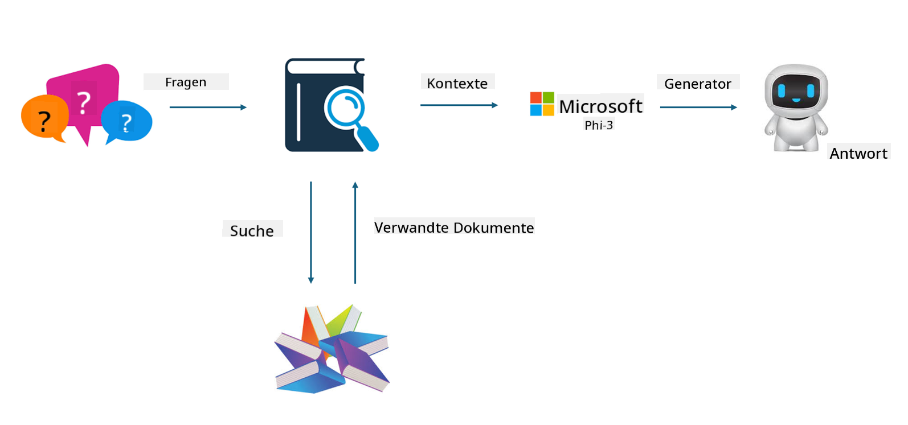
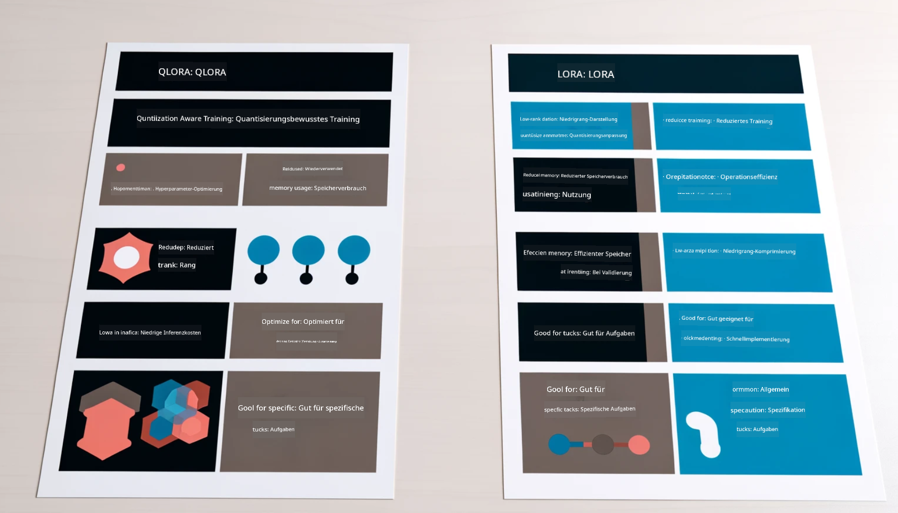

<!--
CO_OP_TRANSLATOR_METADATA:
{
  "original_hash": "743d7e9cb9c4e8ea642d77bee657a7fa",
  "translation_date": "2025-05-07T10:22:39+00:00",
  "source_file": "md/03.FineTuning/LetPhi3gotoIndustriy.md",
  "language_code": "de"
}
-->
# **Lass Phi-3 zum Branchenexperten werden**

Um das Phi-3-Modell in einer Branche einzusetzen, müssen branchenspezifische Geschäftsdaten in das Phi-3-Modell integriert werden. Wir haben zwei verschiedene Optionen: die erste ist RAG (Retrieval Augmented Generation) und die zweite Fine-Tuning.

## **RAG vs Fine-Tuning**

### **Retrieval Augmented Generation**

RAG ist Datenabruf + Textgenerierung. Die strukturierten und unstrukturierten Daten des Unternehmens werden in der Vektordatenbank gespeichert. Bei der Suche nach relevanten Inhalten werden passende Zusammenfassungen und Inhalte gefunden, um einen Kontext zu bilden, und die Textvervollständigungsfunktion von LLM/SLM wird kombiniert, um Inhalte zu erzeugen.

### **Fine-Tuning**

Fine-Tuning basiert auf der Verbesserung eines bestimmten Modells. Es ist nicht nötig, mit dem Modellalgorithmus zu beginnen, aber es müssen kontinuierlich Daten gesammelt werden. Wenn Sie in Branchenanwendungen präzisere Terminologie und sprachliche Ausdrucksweise benötigen, ist Fine-Tuning die bessere Wahl. Wenn sich Ihre Daten jedoch häufig ändern, kann Fine-Tuning kompliziert werden.

### **Wie man sich entscheidet**

1. Wenn unsere Antwort externe Daten erfordert, ist RAG die beste Wahl.

2. Wenn Sie stabile und präzise Branchenkenntnisse ausgeben möchten, ist Fine-Tuning eine gute Wahl. RAG zieht relevante Inhalte heran, trifft aber nicht immer die speziellen Nuancen.

3. Fine-Tuning benötigt einen hochwertigen Datensatz, und bei nur einem kleinen Datenumfang macht es wenig Unterschied. RAG ist flexibler.

4. Fine-Tuning ist eine Blackbox, eine Art Metaphysik, und es ist schwer, den internen Mechanismus zu verstehen. RAG erleichtert es, die Datenquelle zu finden, wodurch Halluzinationen oder Fehler im Inhalt effektiv korrigiert und eine bessere Transparenz geboten werden kann.

### **Szenarien**

1. Vertikale Branchen, die spezifisches Fachvokabular und Ausdrücke benötigen, ***Fine-Tuning*** ist die beste Wahl.

2. QA-Systeme, die verschiedene Wissenspunkte zusammenführen, ***RAG*** ist die beste Wahl.

3. Die Kombination von automatisierten Geschäftsprozessen ***RAG + Fine-Tuning*** ist die beste Wahl.

## **Wie man RAG verwendet**

Eine Vektordatenbank ist eine Sammlung von Daten, die in mathematischer Form gespeichert sind. Vektordatenbanken erleichtern es Machine-Learning-Modellen, sich an vorherige Eingaben zu erinnern, und ermöglichen den Einsatz von Machine Learning für Anwendungsfälle wie Suche, Empfehlungen und Textgenerierung. Daten können anhand von Ähnlichkeitsmetriken identifiziert werden, anstatt exakte Übereinstimmungen zu verlangen, sodass Computermodelle den Kontext der Daten verstehen können.

Die Vektordatenbank ist der Schlüssel zur Realisierung von RAG. Wir können Daten durch Vektormodelle wie text-embedding-3, jina-ai-embedding usw. in Vektorform speichern.

Mehr über die Erstellung von RAG-Anwendungen erfahren Sie unter [https://github.com/microsoft/Phi-3CookBook](https://github.com/microsoft/Phi-3CookBook?WT.mc_id=aiml-138114-kinfeylo)

## **Wie man Fine-Tuning verwendet**

Die häufig verwendeten Algorithmen im Fine-Tuning sind Lora und QLora. Wie wählt man aus?
- [Mehr erfahren mit diesem Beispiel-Notebook](../../../../code/04.Finetuning/Phi_3_Inference_Finetuning.ipynb)
- [Beispiel für Python FineTuning Sample](../../../../code/04.Finetuning/FineTrainingScript.py)

### **Lora und QLora**

LoRA (Low-Rank Adaptation) und QLoRA (Quantized Low-Rank Adaptation) sind Techniken, um große Sprachmodelle (LLMs) mittels Parameter Efficient Fine Tuning (PEFT) zu verfeinern. PEFT-Techniken sind darauf ausgelegt, Modelle effizienter zu trainieren als herkömmliche Methoden.

LoRA ist eine eigenständige Fine-Tuning-Methode, die den Speicherbedarf reduziert, indem sie eine Niedrigrangapproximation auf die Gewichtsmatrix der Aktualisierung anwendet. Sie bietet schnelle Trainingszeiten und erreicht eine Leistung, die nahe an traditionellen Fine-Tuning-Methoden liegt.

QLoRA ist eine erweiterte Version von LoRA, die Quantisierungstechniken integriert, um den Speicherverbrauch weiter zu senken. QLoRA quantisiert die Präzision der Gewichtungsparameter im vortrainierten LLM auf 4-Bit-Präzision, was speichereffizienter ist als LoRA. Allerdings ist das Training mit QLoRA aufgrund der zusätzlichen Quantisierungs- und Dequantisierungsschritte etwa 30 % langsamer als bei LoRA.

QLoRA verwendet LoRA als Ergänzung, um Fehler zu korrigieren, die durch die Quantisierung entstehen. QLoRA ermöglicht das Fine-Tuning von sehr großen Modellen mit Milliarden von Parametern auf relativ kleinen, gut verfügbaren GPUs. Zum Beispiel kann QLoRA ein 70B-Parameter-Modell fine-tunen, das normalerweise 36 GPUs benötigt, mit nur 2 GPUs.

**Haftungsausschluss**:  
Dieses Dokument wurde mit dem KI-Übersetzungsdienst [Co-op Translator](https://github.com/Azure/co-op-translator) übersetzt. Obwohl wir uns um Genauigkeit bemühen, beachten Sie bitte, dass automatisierte Übersetzungen Fehler oder Ungenauigkeiten enthalten können. Das Originaldokument in seiner Ursprungssprache ist als maßgebliche Quelle zu betrachten. Für wichtige Informationen wird eine professionelle menschliche Übersetzung empfohlen. Wir übernehmen keine Haftung für Missverständnisse oder Fehlinterpretationen, die durch die Nutzung dieser Übersetzung entstehen.