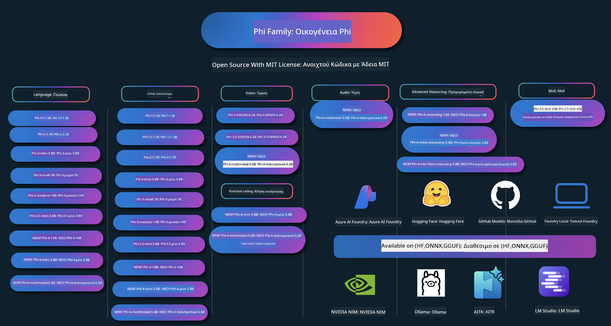

<!--
CO_OP_TRANSLATOR_METADATA:
{
  "original_hash": "ef3a50368712b1a7483d0def1f70c490",
  "translation_date": "2025-12-21T11:42:15+00:00",
  "source_file": "README.md",
  "language_code": "el"
}
-->
# Phi Cookbook: Πρακτικά παραδείγματα με τα μοντέλα Phi της Microsoft

Το Phi είναι μια σειρά ανοιχτών μοντέλων τεχνητής νοημοσύνης ανεπτυγμένων από τη Microsoft. 

Το Phi είναι σήμερα το πιο ισχυρό και οικονομικά αποδοτικό μικρό μοντέλο γλώσσας (SLM), με πολύ καλά αποτελέσματα σε πολλαπλές γλώσσες, συλλογιστική, δημιουργία κειμένου/συνομιλίας, κωδικοποίηση, εικόνες, ήχο και άλλα σενάρια. 

Μπορείτε να αναπτύξετε το Phi στο cloud ή σε συσκευές άκρου, και μπορείτε εύκολα να δημιουργήσετε γενετικές εφαρμογές τεχνητής νοημοσύνης με περιορισμένη υπολογιστική ισχύ.

Ακολουθήστε αυτά τα βήματα για να ξεκινήσετε με αυτούς τους πόρους :
1. **Κάντε fork το αποθετήριο**: Κάντε κλικ 
2. **Κλωνοποιήστε το αποθετήριο**:   `git clone https://github.com/microsoft/PhiCookBook.git`
3. [**Εγγραφείτε στην κοινότητα Microsoft AI στο Discord και γνωρίστε ειδικούς και συναδέλφους προγραμματιστές**](https://discord.com/invite/ByRwuEEgH4?WT.mc_id=aiml-137032-kinfeylo)

### 🌐 Υποστήριξη πολλαπλών γλωσσών

#### Υποστηρίζεται μέσω GitHub Action (Αυτοματοποιημένο & Πάντα Ενημερωμένο)

<!-- CO-OP TRANSLATOR LANGUAGES TABLE START -->
[Αραβικά](../ar/README.md) | [Μπενγκάλι](../bn/README.md) | [Βουλγαρικά](../bg/README.md) | [Βιρμανικά (Μιανμάρ)](../my/README.md) | [Κινεζικά (Απλοποιημένα)](../zh/README.md) | [Κινεζικά (Παραδοσιακά, Χονγκ Κονγκ)](../hk/README.md) | [Κινεζικά (Παραδοσιακά, Μακάο)](../mo/README.md) | [Κινεζικά (Παραδοσιακά, Ταϊβάν)](../tw/README.md) | [Κροατικά](../hr/README.md) | [Τσέχικα](../cs/README.md) | [Δανικά](../da/README.md) | [Ολλανδικά](../nl/README.md) | [Εσθονικά](../et/README.md) | [Φινλανδικά](../fi/README.md) | [Γαλλικά](../fr/README.md) | [Γερμανικά](../de/README.md) | [Ελληνικά](./README.md) | [Εβραϊκά](../he/README.md) | [Χίντι](../hi/README.md) | [Ουγγρικά](../hu/README.md) | [Ινδονησιακά](../id/README.md) | [Ιταλικά](../it/README.md) | [Ιαπωνικά](../ja/README.md) | [Κανάντα](../kn/README.md) | [Κορεατικά](../ko/README.md) | [Λιθουανικά](../lt/README.md) | [Μαλαιικά](../ms/README.md) | [Μαλαγιαλάμ](../ml/README.md) | [Μαραθικά](../mr/README.md) | [Νεπάλ](../ne/README.md) | [Νιγηριανό Πίτζιν](../pcm/README.md) | [Νορβηγικά](../no/README.md) | [Περσικά (Φαρσί)](../fa/README.md) | [Πολωνικά](../pl/README.md) | [Πορτογαλικά (Βραζιλίας)](../br/README.md) | [Πορτογαλικά (Πορτογαλίας)](../pt/README.md) | [Πουντζαπικά (Gurmukhi)](../pa/README.md) | [Ρουμανικά](../ro/README.md) | [Ρωσικά](../ru/README.md) | [Σερβικά (Κύριλλη)](../sr/README.md) | [Σλοβακικά](../sk/README.md) | [Σλοβενικά](../sl/README.md) | [Ισπανικά](../es/README.md) | [Σουαχίλι](../sw/README.md) | [Σουηδικά](../sv/README.md) | [Ταγκάλογκ (Φιλιππινέζικα)](../tl/README.md) | [Ταμίλ](../ta/README.md) | [Τελούγκου](../te/README.md) | [Ταϊλανδέζικα](../th/README.md) | [Τουρκικά](../tr/README.md) | [Ουκρανικά](../uk/README.md) | [Ουρντού](../ur/README.md) | [Βιετναμέζικα](../vi/README.md)
<!-- CO-OP TRANSLATOR LANGUAGES TABLE END -->

## Πίνακας Περιεχομένων

- Εισαγωγή
  - [Καλώς ορίσατε στην οικογένεια Phi](./md/01.Introduction/01/01.PhiFamily.md)
  - [Ρύθμιση του περιβάλλοντός σας](./md/01.Introduction/01/01.EnvironmentSetup.md)
  - [Κατανόηση βασικών τεχνολογιών](./md/01.Introduction/01/01.Understandingtech.md)
  - [Ασφάλεια τεχνητής νοημοσύνης για τα μοντέλα Phi](./md/01.Introduction/01/01.AISafety.md)
  - [Υποστήριξη υλικού Phi](./md/01.Introduction/01/01.Hardwaresupport.md)
  - [Μοντέλα Phi & Διαθεσιμότητα σε πλατφόρμες](./md/01.Introduction/01/01.Edgeandcloud.md)
  - [Χρήση Guidance-ai και Phi](./md/01.Introduction/01/01.Guidance.md)
  - [Μοντέλα GitHub Marketplace](https://github.com/marketplace/models)
  - [Κατάλογος μοντέλων Azure AI](https://ai.azure.com)

- Inference του Phi σε διαφορετικά περιβάλλοντα
    -  [Hugging face](./md/01.Introduction/02/01.HF.md)
    -  [GitHub Models](./md/01.Introduction/02/02.GitHubModel.md)
    -  [Azure AI Foundry Model Catalog](./md/01.Introduction/02/03.AzureAIFoundry.md)
    -  [Ollama](./md/01.Introduction/02/04.Ollama.md)
    -  [AI Toolkit VSCode (AITK)](./md/01.Introduction/02/05.AITK.md)
    -  [NVIDIA NIM](./md/01.Introduction/02/06.NVIDIA.md)
    -  [Foundry Local](./md/01.Introduction/02/07.FoundryLocal.md)

- Inference της οικογένειας Phi
    - [Inference του Phi σε iOS](./md/01.Introduction/03/iOS_Inference.md)
    - [Inference του Phi σε Android](./md/01.Introduction/03/Android_Inference.md)
    - [Inference του Phi σε Jetson](./md/01.Introduction/03/Jetson_Inference.md)
    - [Inference του Phi σε AI PC](./md/01.Introduction/03/AIPC_Inference.md)
    - [Inference του Phi με το Apple MLX Framework](./md/01.Introduction/03/MLX_Inference.md)
    - [Inference του Phi σε Τοπικό Διακομιστή](./md/01.Introduction/03/Local_Server_Inference.md)
    - [Inference του Phi σε Απομακρυσμένο Διακομιστή χρησιμοποιώντας το AI Toolkit](./md/01.Introduction/03/Remote_Interence.md)
    - [Inference του Phi με Rust](./md/01.Introduction/03/Rust_Inference.md)
    - [Inference του Phi–Vision τοπικά](./md/01.Introduction/03/Vision_Inference.md)
    - [Inference του Phi με Kaito AKS, Azure Containers(επίσημη υποστήριξη)](./md/01.Introduction/03/Kaito_Inference.md)
-  [Ποσοτικοποίηση της οικογένειας Phi](./md/01.Introduction/04/QuantifyingPhi.md)
    - [Ποσοτικοποίηση Phi-3.5 / 4 χρησιμοποιώντας llama.cpp](./md/01.Introduction/04/UsingLlamacppQuantifyingPhi.md)
    - [Ποσοτικοποίηση Phi-3.5 / 4 χρησιμοποιώντας τις επεκτάσεις Generative AI για onnxruntime](./md/01.Introduction/04/UsingORTGenAIQuantifyingPhi.md)
    - [Ποσοτικοποίηση Phi-3.5 / 4 χρησιμοποιώντας Intel OpenVINO](./md/01.Introduction/04/UsingIntelOpenVINOQuantifyingPhi.md)
    - [Ποσοτικοποίηση Phi-3.5 / 4 χρησιμοποιώντας το Apple MLX Framework](./md/01.Introduction/04/UsingAppleMLXQuantifyingPhi.md)

-  Αξιολόγηση Phi
    - [Υπεύθυνη ΤΝ](./md/01.Introduction/05/ResponsibleAI.md)
    - [Azure AI Foundry για Αξιολόγηση](./md/01.Introduction/05/AIFoundry.md)
    - [Χρήση Promptflow για Αξιολόγηση](./md/01.Introduction/05/Promptflow.md)
 
- RAG με Azure AI Search
    - [Πώς να χρησιμοποιήσετε το Phi-4-mini και το Phi-4-multimodal(RAG) με Azure AI Search](https://github.com/microsoft/PhiCookBook/blob/main/code/06.E2E/E2E_Phi-4-RAG-Azure-AI-Search.ipynb)

- Δείγματα ανάπτυξης εφαρμογών Phi
  - Εφαρμογές κειμένου & συνομιλίας
    - Δείγματα Phi-4 🆕
      - [📓] [Συνομιλία με το μοντέλο Phi-4-mini ONNX](./md/02.Application/01.TextAndChat/Phi4/ChatWithPhi4ONNX/README.md)
      - [Συνομιλία με το τοπικό μοντέλο Phi-4 ONNX .NET](../../md/04.HOL/dotnet/src/LabsPhi4-Chat-01OnnxRuntime)
      - [Chat .NET Console App με Phi-4 ONNX χρησιμοποιώντας Sementic Kernel](../../md/04.HOL/dotnet/src/LabsPhi4-Chat-02SK)
    - Δείγματα Phi-3 / 3.5
      - [Τοπικό chatbot στο πρόγραμμα περιήγησης χρησιμοποιώντας Phi3, ONNX Runtime Web και WebGPU](https://github.com/microsoft/onnxruntime-inference-examples/tree/main/js/chat)
      - [OpenVino Συνομιλία](./md/02.Application/01.TextAndChat/Phi3/E2E_OpenVino_Chat.md)
      - [Πολλαπλά μοντέλα - Διαδραστικό Phi-3-mini και OpenAI Whisper](./md/02.Application/01.TextAndChat/Phi3/E2E_Phi-3-mini_with_whisper.md)
      - [MLFlow - Δημιουργία wrapper και χρήση Phi-3 με MLFlow](./md//02.Application/01.TextAndChat/Phi3/E2E_Phi-3-MLflow.md)
      - [Βελτιστοποίηση μοντέλου - Πώς να βελτιστοποιήσετε το μοντέλο Phi-3-min για ONNX Runtime Web με Olive](https://github.com/microsoft/Olive/tree/main/examples/phi3)
      - [Εφαρμογή WinUI3 με Phi-3 mini-4k-instruct-onnx](https://github.com/microsoft/Phi3-Chat-WinUI3-Sample/)
      -[Δείγμα εφαρμογής WinUI3: Σημειώσεις υποστηριζόμενες από πολλαπλά μοντέλα AI](https://github.com/microsoft/ai-powered-notes-winui3-sample)
      - [Fine-tune και Ενσωμάτωση προσαρμοσμένων μοντέλων Phi-3 με Prompt flow](./md/02.Application/01.TextAndChat/Phi3/E2E_Phi-3-FineTuning_PromptFlow_Integration.md)
      - [Fine-tune και Ενσωμάτωση προσαρμοσμένων μοντέλων Phi-3 με Prompt flow στο Azure AI Foundry](./md/02.Application/01.TextAndChat/Phi3/E2E_Phi-3-FineTuning_PromptFlow_Integration_AIFoundry.md)
      - [Αξιολογήστε το Fine-tuned μοντέλο Phi-3 / Phi-3.5 στο Azure AI Foundry με έμφαση στις Αρχές Υπεύθυνης Τεχνητής Νοημοσύνης της Microsoft](./md/02.Application/01.TextAndChat/Phi3/E2E_Phi-3-Evaluation_AIFoundry.md)
      - [📓] [Phi-3.5-mini-instruct παράδειγμα πρόβλεψης γλώσσας (Κινέζικα/Αγγλικά)](./md/02.Application/01.TextAndChat/Phi3/phi3-instruct-demo.ipynb)
      - [Chatbot RAG Phi-3.5-Instruct με WebGPU](./md/02.Application/01.TextAndChat/Phi3/WebGPUWithPhi35Readme.md)
      - [Χρήση GPU των Windows για δημιουργία λύσης Prompt flow με Phi-3.5-Instruct ONNX](./md/02.Application/01.TextAndChat/Phi3/UsingPromptFlowWithONNX.md)
      - [Χρήση Microsoft Phi-3.5 tflite για δημιουργία εφαρμογής Android](./md/02.Application/01.TextAndChat/Phi3/UsingPhi35TFLiteCreateAndroidApp.md)
      - [Παράδειγμα Q&A .NET που χρησιμοποιεί το τοπικό ONNX μοντέλο Phi-3 με Microsoft.ML.OnnxRuntime](../../md/04.HOL/dotnet/src/LabsPhi301)
      - [Εφαρμογή .NET κονσόλας συνομιλίας με Semantic Kernel και Phi-3](../../md/04.HOL/dotnet/src/LabsPhi302)

  - Azure AI Inference SDK Code Based Samples 
    - Δείγματα Phi-4 🆕
      - [📓] [Δημιουργία κώδικα έργου χρησιμοποιώντας Phi-4-multimodal](./md/02.Application/02.Code/Phi4/GenProjectCode/README.md)
    - Δείγματα Phi-3 / 3.5
      - [Δημιουργήστε το δικό σας Visual Studio Code GitHub Copilot Chat με την οικογένεια Microsoft Phi-3](./md/02.Application/02.Code/Phi3/VSCodeExt/README.md)
      - [Δημιουργήστε το δικό σας Visual Studio Code Chat Copilot Agent με Phi-3.5 από τα GitHub Models](/md/02.Application/02.Code/Phi3/CreateVSCodeChatAgentWithGitHubModels.md)

  - Δείγματα Προηγμένης Συλλογιστικής
    - Δείγματα Phi-4 🆕
      - [📓] [Δείγματα Phi-4-mini-reasoning ή Phi-4-reasoning](./md/02.Application/03.AdvancedReasoning/Phi4/AdvancedResoningPhi4mini/README.md)
      - [📓] [Fine-tuning του Phi-4-mini-reasoning με Microsoft Olive](./md/02.Application/03.AdvancedReasoning/Phi4/AdvancedResoningPhi4mini/olive_ft_phi_4_reasoning_with_medicaldata.ipynb)
      - [📓] [Fine-tuning του Phi-4-mini-reasoning με Apple MLX](./md/02.Application/03.AdvancedReasoning/Phi4/AdvancedResoningPhi4mini/mlx_ft_phi_4_reasoning_with_medicaldata.ipynb)
      - [📓] [Phi-4-mini-reasoning με GitHub Models](./md/02.Application/02.Code/Phi4r/github_models_inference.ipynb)
      - [📓] [Phi-4-mini-reasoning με μοντέλα Azure AI Foundry](./md/02.Application/02.Code/Phi4r/azure_models_inference.ipynb)
  - Επιδείξεις
      - [Επιδείξεις Phi-4-mini φιλοξενημένες στο Hugging Face Spaces](https://huggingface.co/spaces/microsoft/phi-4-mini?WT.mc_id=aiml-137032-kinfeylo)
      - [Επιδείξεις Phi-4-multimodal φιλοξενημένες στο Hugginge Face Spaces](https://huggingface.co/spaces/microsoft/phi-4-multimodal?WT.mc_id=aiml-137032-kinfeylo)
  - Δείγματα Όρασης
    - Δείγματα Phi-4 🆕
      - [📓] [Χρησιμοποιήστε το Phi-4-multimodal για ανάγνωση εικόνων και δημιουργία κώδικα](./md/02.Application/04.Vision/Phi4/CreateFrontend/README.md) 
    - Δείγματα Phi-3 / 3.5
      -  [📓][Phi-3-vision - κείμενο από εικόνα σε κείμενο](./md/02.Application/04.Vision/Phi3/E2E_Phi-3-vision-image-text-to-text-online-endpoint.ipynb)
      - [Phi-3-vision-ONNX](https://onnxruntime.ai/docs/genai/tutorials/phi3-v.html)
      - [📓][Phi-3-vision CLIP Ενσωμάτωση](./md/02.Application/04.Vision/Phi3/E2E_Phi-3-vision-image-text-to-text-online-endpoint.ipynb)
      - [DEMO: Phi-3 Ανακύκλωση](https://github.com/jennifermarsman/PhiRecycling/)
      - [Phi-3-vision - Οπτικός βοηθός γλώσσας - με Phi3-Vision και OpenVINO](https://docs.openvino.ai/nightly/notebooks/phi-3-vision-with-output.html)
      - [Phi-3 Vision Nvidia NIM](./md/02.Application/04.Vision/Phi3/E2E_Nvidia_NIM_Vision.md)
      - [Phi-3 Vision OpenVino](./md/02.Application/04.Vision/Phi3/E2E_OpenVino_Phi3Vision.md)
      - [📓][Phi-3.5 Vision παράδειγμα πολλαπλών καρέ ή πολλαπλών εικόνων](./md/02.Application/04.Vision/Phi3/phi3-vision-demo.ipynb)
      - [Τοπικό ONNX μοντέλο Phi-3 Vision χρησιμοποιώντας το Microsoft.ML.OnnxRuntime .NET](../../md/04.HOL/dotnet/src/LabsPhi303)
      - [Μενού-βασισμένο τοπικό ONNX μοντέλο Phi-3 Vision χρησιμοποιώντας το Microsoft.ML.OnnxRuntime .NET](../../md/04.HOL/dotnet/src/LabsPhi304)

  - Δείγματα Μαθηματικών
    -  Δείγματα Phi-4-Mini-Flash-Reasoning-Instruct 🆕 [Επίδειξη Μαθηματικών με Phi-4-Mini-Flash-Reasoning-Instruct](./md/02.Application/09.Math/MathDemo.ipynb)

  - Δείγματα Ήχου
    - Δείγματα Phi-4 🆕
      - [📓] [Εξαγωγή απομαγνητοφωνήσεων ήχου χρησιμοποιώντας Phi-4-multimodal](./md/02.Application/05.Audio/Phi4/Transciption/README.md)
      - [📓] [Παράδειγμα ήχου Phi-4-multimodal](./md/02.Application/05.Audio/Phi4/Siri/demo.ipynb)
      - [📓] [Παράδειγμα μετάφρασης ομιλίας Phi-4-multimodal](./md/02.Application/05.Audio/Phi4/Translate/demo.ipynb)
      - [.NET εφαρμογή κονσόλας που χρησιμοποιεί το Phi-4-multimodal Audio για ανάλυση αρχείου ήχου και δημιουργία απομαγνητοφώνησης](../../md/04.HOL/dotnet/src/LabsPhi4-MultiModal-02Audio)

  - Δείγματα MOE
    - Delta Phi-3 / 3.5 Samples
    - Phi-3 / 3.5 Samples
      - [📓] [Παράδειγμα κοινωνικών δικτύων με μοντέλα Phi-3.5 Mixture of Experts (MoEs)](./md/02.Application/06.MoE/Phi3/phi3_moe_demo.ipynb)
      - [📓] [Δημιουργία pipeline Retrieval-Augmented Generation (RAG) με NVIDIA NIM Phi-3 MOE, Azure AI Search και LlamaIndex](./md/02.Application/06.MoE/Phi3/azure-ai-search-nvidia-rag.ipynb)
      - 

  - Δείγματα Κλήσης Συναρτήσεων
    - Δείγματα Phi-4 🆕
      -  [📓] [Χρήση Κλήσεων Συναρτήσεων με Phi-4-mini](./md/02.Application/07.FunctionCalling/Phi4/FunctionCallingBasic/README.md)
      -  [📓] [Χρήση Κλήσεων Συναρτήσεων για δημιουργία πολλαπλών πρακτόρων με Phi-4-mini](./md/02.Application/07.FunctionCalling/Phi4/Multiagents/Phi_4_mini_multiagent.ipynb)
      -  [📓] [Χρήση Κλήσεων Συναρτήσεων με Ollama](./md/02.Application/07.FunctionCalling/Phi4/Ollama/ollama_functioncalling.ipynb)
      -  [📓] [Χρήση Κλήσεων Συναρτήσεων με ONNX](./md/02.Application/07.FunctionCalling/Phi4/ONNX/onnx_parallel_functioncalling.ipynb)
  - Δείγματα Πολυμορφικού Συνδυασμού
    - Δείγματα Phi-4 🆕
      -  [📓] [Χρήση Phi-4-multimodal ως τεχνολογικού δημοσιογράφου](./md/02.Application/08.Multimodel/Phi4/TechJournalist/phi_4_mm_audio_text_publish_news.ipynb)
      - [.NET εφαρμογή κονσόλας που χρησιμοποιεί το Phi-4-multimodal για ανάλυση εικόνων](../../md/04.HOL/dotnet/src/LabsPhi4-MultiModal-01Images)

- Παραμετροποίηση (Fine-tuning) Δειγμάτων Phi
  - [Σενάρια Fine-tuning](./md/03.FineTuning/FineTuning_Scenarios.md)
  - [Fine-tuning εναντίον RAG](./md/03.FineTuning/FineTuning_vs_RAG.md)
  - [Fine-tuning: Κάντε το Phi-3 να γίνει ειδικός του κλάδου](./md/03.FineTuning/LetPhi3gotoIndustriy.md)
  - [Fine-tuning του Phi-3 με AI Toolkit για VS Code](./md/03.FineTuning/Finetuning_VSCodeaitoolkit.md)
  - [Fine-tuning του Phi-3 με Azure Machine Learning Service](./md/03.FineTuning/Introduce_AzureML.md)
  - [Fine-tuning του Phi-3 με Lora](./md/03.FineTuning/FineTuning_Lora.md)
  - [Fine-tuning του Phi-3 με QLora](./md/03.FineTuning/FineTuning_Qlora.md)
  - [Fine-tuning του Phi-3 με Azure AI Foundry](./md/03.FineTuning/FineTuning_AIFoundry.md)
  - [Fine-tuning του Phi-3 με Azure ML CLI/SDK](./md/03.FineTuning/FineTuning_MLSDK.md)
  - [Fine-tuning με Microsoft Olive](./md/03.FineTuning/FineTuning_MicrosoftOlive.md)
  - [Fine-tuning με Microsoft Olive Hands-On Lab](./md/03.FineTuning/olive-lab/readme.md)
  - [Fine-tuning του Phi-3-vision με Weights and Bias](./md/03.FineTuning/FineTuning_Phi-3-visionWandB.md)
  - [Fine-tuning του Phi-3 με το Apple MLX Framework](./md/03.FineTuning/FineTuning_MLX.md)
  - [Fine-tuning Phi-3-vision (επίσημη υποστήριξη)](./md/03.FineTuning/FineTuning_Vision.md)
  - [Fine-Tuning του Phi-3 με Kaito AKS , Azure Containers(επίσημη υποστήριξη)](./md/03.FineTuning/FineTuning_Kaito.md)
  - [Fine-Tuning Phi-3 και 3.5 Vision](https://github.com/2U1/Phi3-Vision-Finetune)

- Πρακτικό Εργαστήριο
  - [Εξερεύνηση μοντέλων αιχμής: LLMs, SLMs, τοπική ανάπτυξη και άλλα](https://github.com/microsoft/aitour-exploring-cutting-edge-models)
  - [Αξιοποίηση των δυνατοτήτων του NLP: Fine-Tuning με Microsoft Olive](https://github.com/azure/Ignite_FineTuning_workshop)

- Ακαδημαϊκές Ερευνητικές Εργασίες και Δημοσιεύσεις
  - [Textbooks Are All You Need II: τεχνική αναφορά phi-1.5](https://arxiv.org/abs/2309.05463)
  - [Phi-3 Τεχνική Αναφορά: Ένα ιδιαίτερα ικανό γλωσσικό μοντέλο τοπικά στο τηλέφωνό σας](https://arxiv.org/abs/2404.14219)
  - [Phi-4 Τεχνική Αναφορά](https://arxiv.org/abs/2412.08905)
  - [Phi-4-Mini Τεχνική Αναφορά: Συμπαγή αλλά Ισχυρά Πολυτροπικά Μοντέλα Γλώσσας μέσω Μείξης LoRAs](https://arxiv.org/abs/2503.01743)
  - [Βελτιστοποίηση Μικρών Μοντέλων Γλώσσας για Κλήση Λειτουργιών Εντός Οχήματος](https://arxiv.org/abs/2501.02342)
  - [(WhyPHI) Προσαρμογή του PHI-3 για Απαντήσεις Πολλαπλής Επιλογής: Μεθοδολογία, Αποτελέσματα και Προκλήσεις](https://arxiv.org/abs/2501.01588)
  - [Τεχνική Αναφορά Phi-4-reasoning](https://www.microsoft.com/en-us/research/wp-content/uploads/2025/04/phi_4_reasoning.pdf)
  - [Τεχνική Αναφορά Phi-4-mini-reasoning](https://huggingface.co/microsoft/Phi-4-mini-reasoning/blob/main/Phi-4-Mini-Reasoning.pdf)

## Χρήση των μοντέλων Phi

### Phi στο Azure AI Foundry

Μπορείτε να μάθετε πώς να χρησιμοποιείτε το Microsoft Phi και πώς να κατασκευάζετε λύσεις E2E στις διάφορες συσκευές υλικού σας. Για να δοκιμάσετε το Phi μόνοι σας, ξεκινήστε παίζοντας με τα μοντέλα και προσαρμόζοντας το Phi για τα σενάρια σας χρησιμοποιώντας το [Azure AI Foundry Azure AI Model Catalog](https://aka.ms/phi3-azure-ai) Μπορείτε να μάθετε περισσότερα στον Οδηγό εκκίνησης για το [Azure AI Foundry](/md/02.QuickStart/AzureAIFoundry_QuickStart.md)

**Πλατφόρμα δοκιμών**
Κάθε μοντέλο έχει μια αφιερωμένη πλατφόρμα δοκιμών για να δοκιμάσετε το μοντέλο [Πλατφόρμα Δοκιμών Azure AI](https://aka.ms/try-phi3).

### Phi στα Μοντέλα GitHub

Μπορείτε να μάθετε πώς να χρησιμοποιείτε το Microsoft Phi και πώς να κατασκευάζετε λύσεις E2E στις διάφορες συσκευές υλικού σας. Για να δοκιμάσετε το Phi μόνοι σας, ξεκινήστε παίζοντας με το μοντέλο και προσαρμόζοντας το Phi για τα σενάρια σας χρησιμοποιώντας το [GitHub Model Catalog](https://github.com/marketplace/models?WT.mc_id=aiml-137032-kinfeylo) Μπορείτε να μάθετε περισσότερα στον Οδηγό εκκίνησης για το [GitHub Model Catalog](/md/02.QuickStart/GitHubModel_QuickStart.md)

**Πλατφόρμα δοκιμών**
Κάθε μοντέλο έχει μια αφιερωμένη [πλατφόρμα δοκιμών για το μοντέλο](/md/02.QuickStart/GitHubModel_QuickStart.md).

### Phi στο Hugging Face

Μπορείτε επίσης να βρείτε το μοντέλο στο [Hugging Face](https://huggingface.co/microsoft)

**Πλατφόρμα δοκιμών**
 [Πλατφόρμα συνομιλίας Hugging Chat](https://huggingface.co/chat/models/microsoft/Phi-3-mini-4k-instruct)

 ## 🎒 Άλλα Μαθήματα

Η ομάδα μας παράγει και άλλα μαθήματα! Ρίξτε μια ματιά:

<!-- CO-OP TRANSLATOR OTHER COURSES START -->
### LangChain

---

### Azure / Edge / MCP / Agents

---
 
### Σειρά Γενετικής ΤΝ

[-9333EA?style=for-the-badge&labelColor=E5E7EB&color=9333EA)](https://github.com/microsoft/Generative-AI-for-beginners-dotnet?WT.mc_id=academic-105485-koreyst)
[-C084FC?style=for-the-badge&labelColor=E5E7EB&color=C084FC)](https://github.com/microsoft/generative-ai-for-beginners-java?WT.mc_id=academic-105485-koreyst)
[-E879F9?style=for-the-badge&labelColor=E5E7EB&color=E879F9)](https://github.com/microsoft/generative-ai-with-javascript?WT.mc_id=academic-105485-koreyst)

---
 
### Βασική Εκπαίδευση

---
 
### Σειρά Copilot

<!-- CO-OP TRANSLATOR OTHER COURSES END -->

## Υπεύθυνη Τεχνητή Νοημοσύνη 

Η Microsoft δεσμεύεται να βοηθά τους πελάτες μας να χρησιμοποιούν τα προϊόντα μας ΤΝ υπεύθυνα, να μοιράζεται τα διδάγματα μας και να χτίζει συνεργασίες βασισμένες στην εμπιστοσύνη μέσω εργαλείων όπως οι Transparency Notes και τα Impact Assessments. Πολλοί από αυτούς τους πόρους μπορούν να βρεθούν στο [https://aka.ms/RAI](https://aka.ms/RAI).
Η προσέγγιση της Microsoft για την υπεύθυνη ΤΝ εδράζεται στις αρχές μας για την ΤΝ: δικαιοσύνη, αξιοπιστία και ασφάλεια, ιδιωτικότητα και ασφάλεια, συμπερίληψη, διαφάνεια και λογοδοσία.

Μεγάλης κλίμακας μοντέλα φυσικής γλώσσας, εικόνας και ομιλίας - όπως αυτά που χρησιμοποιούνται σε αυτό το δείγμα - ενδέχεται να συμπεριφέρονται με τρόπους που είναι άδικοι, αναξιόπιστοι ή προσβλητικοί, προκαλώντας βλάβες. Παρακαλούμε συμβουλευτείτε τη [Σημείωση Διαφάνειας υπηρεσίας Azure OpenAI](https://learn.microsoft.com/legal/cognitive-services/openai/transparency-note?tabs=text) για να ενημερωθείτε σχετικά με τους κινδύνους και τους περιορισμούς.

Η συνιστώμενη προσέγγιση για την αντιμετώπιση αυτών των κινδύνων είναι να συμπεριλάβετε ένα σύστημα ασφάλειας στην αρχιτεκτονική σας που μπορεί να ανιχνεύσει και να αποτρέψει επιβλαβείς συμπεριφορές. Η [Ασφάλεια Περιεχομένου Azure AI](https://learn.microsoft.com/azure/ai-services/content-safety/overview) παρέχει ένα ανεξάρτητο επίπεδο προστασίας, ικανό να ανιχνεύει επιβλαβές περιεχόμενο που δημιουργείται από χρήστες και από ΤΝ σε εφαρμογές και υπηρεσίες. Η Azure AI Content Safety περιλαμβάνει API για κείμενο και εικόνες που σας επιτρέπουν να ανιχνεύετε υλικό που είναι επιβλαβές. Μέσα στο Azure AI Foundry, η υπηρεσία Content Safety σας επιτρέπει να δείτε, να εξερευνήσετε και να δοκιμάσετε δείγματα κώδικα για την ανίχνευση επιβλαβούς περιεχομένου σε διαφορετικές μορφές. Η ακόλουθη [τεκμηρίωση γρήγορης εκκίνησης](https://learn.microsoft.com/azure/ai-services/content-safety/quickstart-text?tabs=visual-studio%2Clinux&pivots=programming-language-rest) σας καθοδηγεί στο πώς να κάνετε αιτήματα προς την υπηρεσία.

Ένας άλλος παράγοντας που πρέπει να ληφθεί υπόψη είναι η συνολική απόδοση της εφαρμογής. Σε εφαρμογές πολυτροπικές και με πολλαπλά μοντέλα, θεωρούμε ότι απόδοση σημαίνει ότι το σύστημα λειτουργεί όπως εσείς και οι χρήστες σας περιμένετε, συμπεριλαμβανομένου του να μην παράγει επιβλαβή αποτελέσματα. Είναι σημαντικό να αξιολογήσετε την απόδοση της συνολικής εφαρμογής σας χρησιμοποιώντας τους [Αξιολογητές Απόδοσης, Ποιότητας, Κινδύνου και Ασφαλείας](https://learn.microsoft.com/azure/ai-studio/concepts/evaluation-metrics-built-in). Έχετε επίσης τη δυνατότητα να δημιουργήσετε και να αξιολογήσετε με [προσαρμοσμένους αξιολογητές](https://learn.microsoft.com/azure/ai-studio/how-to/develop/evaluate-sdk#custom-evaluators).

Μπορείτε να αξιολογήσετε την εφαρμογή ΤΝ σας στο περιβάλλον ανάπτυξης χρησιμοποιώντας το [SDK Αξιολόγησης Azure AI](https://microsoft.github.io/promptflow/index.html). Δοθέντος είτε ενός δοκιμαστικού συνόλου δεδομένων είτε ενός στόχου, οι δημιουργίες της γενετικής ΤΝ της εφαρμογής σας μετρώνται ποσοτικά με ενσωματωμένους ή προσαρμοσμένους αξιολογητές της επιλογής σας. Για να ξεκινήσετε με το SDK αξιολόγησης azure ai για να αξιολογήσετε το σύστημά σας, μπορείτε να ακολουθήσετε τον [οδηγό γρήγορης εκκίνησης](https://learn.microsoft.com/azure/ai-studio/how-to/develop/flow-evaluate-sdk). Μόλις εκτελέσετε μια εκτέλεση αξιολόγησης, μπορείτε να [οπτικοποιήσετε τα αποτελέσματα στο Azure AI Foundry](https://learn.microsoft.com/azure/ai-studio/how-to/evaluate-flow-results). 

## Εμπορικά σήματα
Αυτό το έργο ενδέχεται να περιέχει εμπορικά σήματα ή λογότυπα για έργα, προϊόντα ή υπηρεσίες. Η εξουσιοδοτημένη χρήση των εμπορικών σημάτων ή λογοτύπων της Microsoft υπόκειται και πρέπει να συμμορφώνεται με τις [Οδηγίες Σήματος και Εταιρικής Ταυτότητας της Microsoft](https://www.microsoft.com/legal/intellectualproperty/trademarks/usage/general).
Η χρήση των εμπορικών σημάτων ή λογοτύπων της Microsoft σε τροποποιημένες εκδόσεις αυτού του έργου δεν πρέπει να προκαλεί σύγχυση ή να υπονοεί χορηγία από τη Microsoft. Οποιαδήποτε χρήση εμπορικών σημάτων ή λογοτύπων τρίτων υπόκειται στις πολιτικές των αντίστοιχων τρίτων.

## Λήψη Βοήθειας

Αν κολλήσετε ή έχετε οποιεσδήποτε ερωτήσεις σχετικά με την ανάπτυξη εφαρμογών AI, ενταχθείτε στο:

Εάν έχετε σχόλια για το προϊόν ή σφάλματα κατά την ανάπτυξη, επισκεφθείτε:

---

<!-- CO-OP TRANSLATOR DISCLAIMER START -->
Αποποίηση ευθυνών:
Το παρόν έγγραφο μεταφράστηκε με τη χρήση υπηρεσίας μετάφρασης με τεχνητή νοημοσύνη [Co-op Translator](https://github.com/Azure/co-op-translator). Παρά τις προσπάθειές μας για ακρίβεια, λάβετε υπόψη ότι οι αυτοματοποιημένες μεταφράσεις ενδέχεται να περιέχουν σφάλματα ή ανακρίβειες. Το πρωτότυπο έγγραφο στη γλώσσα στην οποία συντάχθηκε πρέπει να θεωρείται η αυθεντική πηγή. Για κρίσιμες πληροφορίες συνιστάται η επαγγελματική ανθρώπινη μετάφραση. Δεν φέρουμε ευθύνη για τυχόν παρεξηγήσεις ή λανθασμένες ερμηνείες που προκύπτουν από τη χρήση αυτής της μετάφρασης.
<!-- CO-OP TRANSLATOR DISCLAIMER END -->