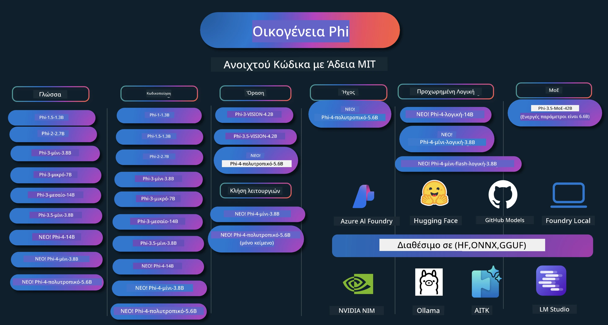

# Phi Cookbook: Πρακτικά Παραδείγματα με τα Μοντέλα Phi της Microsoft

[](https://codespaces.new/microsoft/phicookbook)
[](https://vscode.dev/redirect?url=vscode://ms-vscode-remote.remote-containers/cloneInVolume?url=https://github.com/microsoft/phicookbook)

[](https://GitHub.com/microsoft/phicookbook/graphs/contributors/?WT.mc_id=aiml-137032-kinfeylo)
[](https://GitHub.com/microsoft/phicookbook/issues/?WT.mc_id=aiml-137032-kinfeylo)
[](https://GitHub.com/microsoft/phicookbook/pulls/?WT.mc_id=aiml-137032-kinfeylo)
[](http://makeapullrequest.com?WT.mc_id=aiml-137032-kinfeylo)

[](https://GitHub.com/microsoft/phicookbook/watchers/?WT.mc_id=aiml-137032-kinfeylo)
[](https://GitHub.com/microsoft/phicookbook/network/?WT.mc_id=aiml-137032-kinfeylo)
[](https://GitHub.com/microsoft/phicookbook/stargazers/?WT.mc_id=aiml-137032-kinfeylo)

[](https://discord.com/invite/ByRwuEEgH4)

Το Phi είναι μια σειρά ανοιχτού κώδικα μοντέλων τεχνητής νοημοσύνης που αναπτύχθηκαν από τη Microsoft.

Το Phi είναι επί του παρόντος το πιο ισχυρό και οικονομικά αποδοτικό μικρό μοντέλο γλώσσας (SLM), με πολύ καλές επιδόσεις σε πολυγλωσσία, λογική, παραγωγή κειμένου/συνομιλίας, κωδικοποίηση, εικόνες, ήχο και άλλα σενάρια.

Μπορείτε να αναπτύξετε το Phi στο cloud ή σε συσκευές άκρου, και μπορείτε εύκολα να δημιουργήσετε εφαρμογές γεννητικής τεχνητής νοημοσύνης με περιορισμένη υπολογιστική ισχύ.

Ακολουθήστε αυτά τα βήματα για να ξεκινήσετε με αυτούς τους πόρους:
1. **Δημιουργήστε Fork του Αποθετηρίου**: Κλικ στο [](https://GitHub.com/microsoft/phicookbook/network/?WT.mc_id=aiml-137032-kinfeylo)
2. **Κλωνοποιήστε το Αποθετήριο**: `git clone https://github.com/microsoft/PhiCookBook.git`
3. [**Γίνετε μέλος της Κοινότητας Microsoft AI Discord και γνωρίστε ειδικούς και άλλους προγραμματιστές**](https://discord.com/invite/ByRwuEEgH4?WT.mc_id=aiml-137032-kinfeylo)



### 🌐 Υποστήριξη Πολλών Γλωσσών

#### Υποστηρίζεται μέσω GitHub Action (Αυτοματοποιημένο & Πάντα Ενημερωμένο)

<!-- CO-OP TRANSLATOR LANGUAGES TABLE START -->
[Αραβικά](../ar/README.md) | [Μπενγκάλι](../bn/README.md) | [Βουλγαρικά](../bg/README.md) | [Βιρμανικά (Μυανμάρ)](../my/README.md) | [Κινέζικα (Απλοποιημένα)](../zh-CN/README.md) | [Κινέζικα (Παραδοσιακά, Χονγκ Κονγκ)](../zh-HK/README.md) | [Κινέζικα (Παραδοσιακά, Μακάο)](../zh-MO/README.md) | [Κινέζικα (Παραδοσιακά, Ταϊβάν)](../zh-TW/README.md) | [Κροατικά](../hr/README.md) | [Τσέχικα](../cs/README.md) | [Δανέζικα](../da/README.md) | [Ολλανδικά](../nl/README.md) | [Εσθονικά](../et/README.md) | [Φινλανδικά](../fi/README.md) | [Γαλλικά](../fr/README.md) | [Γερμανικά](../de/README.md) | [Ελληνικά](./README.md) | [Εβραϊκά](../he/README.md) | [Χίντι](../hi/README.md) | [Ουγγρικά](../hu/README.md) | [Ινδονησιακά](../id/README.md) | [Ιταλικά](../it/README.md) | [Ιαπωνικά](../ja/README.md) | [Καννάδα](../kn/README.md) | [Κορεατικά](../ko/README.md) | [Λιθουανικά](../lt/README.md) | [Μαλαισιανά](../ms/README.md) | [Μαλαγιαλάμ](../ml/README.md) | [Μαράθι](../mr/README.md) | [Νεπάλι](../ne/README.md) | [Νιγηριανό Πίτζιν](../pcm/README.md) | [Νορβηγικά](../no/README.md) | [Περσικά (Φαρσί)](../fa/README.md) | [Πολωνικά](../pl/README.md) | [Πορτογαλικά (Βραζιλία)](../pt-BR/README.md) | [Πορτογαλικά (Πορτογαλία)](../pt-PT/README.md) | [Πουντζαμπικά (Γκουρμούκι)](../pa/README.md) | [Ρουμανικά](../ro/README.md) | [Ρωσικά](../ru/README.md) | [Σερβικά (Κυριλλικά)](../sr/README.md) | [Σλοβακικά](../sk/README.md) | [Σλοβενικά](../sl/README.md) | [Ισπανικά](../es/README.md) | [Σουαχίλι](../sw/README.md) | [Σουηδικά](../sv/README.md) | [Ταγκαλόγκ (Φιλιππινέζικα)](../tl/README.md) | [Ταμίλ](../ta/README.md) | [Τελούγκου](../te/README.md) | [Ταϊλανδέζικα](../th/README.md) | [Τουρκικά](../tr/README.md) | [Ουκρανικά](../uk/README.md) | [Ουρντού](../ur/README.md) | [Βιετναμέζικα](../vi/README.md)

> **Προτιμάτε να κάνετε κλωνοποίηση τοπικά;**
>
> Αυτό το αποθετήριο περιλαμβάνει πάνω από 50 μεταφράσεις γλωσσών που αυξάνουν σημαντικά το μέγεθος λήψης. Για να κάνετε κλωνοποίηση χωρίς μεταφράσεις, χρησιμοποιήστε το sparse checkout:
>
> **Bash / macOS / Linux:**
> ```bash
> git clone --filter=blob:none --sparse https://github.com/microsoft/PhiCookBook.git
> cd PhiCookBook
> git sparse-checkout set --no-cone '/*' '!translations' '!translated_images'
> ```
>
> **CMD (Windows):**
> ```cmd
> git clone --filter=blob:none --sparse https://github.com/microsoft/PhiCookBook.git
> cd PhiCookBook
> git sparse-checkout set --no-cone "/*" "!translations" "!translated_images"
> ```
>
> Αυτό σας δίνει ό,τι χρειάζεστε για να ολοκληρώσετε το μάθημα με πολύ ταχύτερη λήψη.
<!-- CO-OP TRANSLATOR LANGUAGES TABLE END -->

## Περιεχόμενα

- Εισαγωγή
  - [Καλωσόρισμα στην Οικογένεια Phi](./md/01.Introduction/01/01.PhiFamily.md)
  - [Ρύθμιση του περιβάλλοντός σας](./md/01.Introduction/01/01.EnvironmentSetup.md)
  - [Κατανόηση βασικών τεχνολογιών](./md/01.Introduction/01/01.Understandingtech.md)
  - [Ασφάλεια AI για τα Μοντέλα Phi](./md/01.Introduction/01/01.AISafety.md)
  - [Υποστήριξη Υλικού Phi](./md/01.Introduction/01/01.Hardwaresupport.md)
  - [Μοντέλα Phi & Διαθεσιμότητα σε πλατφόρμες](./md/01.Introduction/01/01.Edgeandcloud.md)
  - [Χρήση Guidance-ai και Phi](./md/01.Introduction/01/01.Guidance.md)
  - [Μοντέλα Marketplace GitHub](https://github.com/marketplace/models)
  - [Κατάλογος Μοντέλων Azure AI](https://ai.azure.com)

- Εξαγωγή συμπερασμάτων Phi σε διαφορετικά περιβάλλοντα
    -  [Hugging face](./md/01.Introduction/02/01.HF.md)
    -  [Μοντέλα GitHub](./md/01.Introduction/02/02.GitHubModel.md)
    -  [Κατάλογος Μοντέλων Azure AI Foundry](./md/01.Introduction/02/03.AzureAIFoundry.md)
    -  [Ollama](./md/01.Introduction/02/04.Ollama.md)
    -  [Εργαλειοθήκη AI VSCode (AITK)](./md/01.Introduction/02/05.AITK.md)
    -  [NVIDIA NIM](./md/01.Introduction/02/06.NVIDIA.md)
    -  [Foundry Local](./md/01.Introduction/02/07.FoundryLocal.md)

- Εξαγωγή συμπερασμάτων από την οικογένεια Phi
    - [Εξαγωγή Phi σε iOS](./md/01.Introduction/03/iOS_Inference.md)
    - [Εξαγωγή Phi σε Android](./md/01.Introduction/03/Android_Inference.md)
    - [Εξαγωγή Phi σε Jetson](./md/01.Introduction/03/Jetson_Inference.md)
    - [Εξαγωγή Phi σε AI PC](./md/01.Introduction/03/AIPC_Inference.md)
    - [Εξαγωγή Phi με Apple MLX Framework](./md/01.Introduction/03/MLX_Inference.md)
    - [Εξαγωγή Phi σε Τοπικό Διακομιστή](./md/01.Introduction/03/Local_Server_Inference.md)
    - [Εξαγωγή Phi σε Απομακρυσμένο Διακομιστή με χρήση AI Toolkit](./md/01.Introduction/03/Remote_Interence.md)
    - [Εξαγωγή Phi με Rust](./md/01.Introduction/03/Rust_Inference.md)
    - [Εξαγωγή Phi–Όραση τοπικά](./md/01.Introduction/03/Vision_Inference.md)
    - [Εξαγωγή Phi με Kaito AKS, Azure Containers (επίσημη υποστήριξη)](./md/01.Introduction/03/Kaito_Inference.md)
-  [Ποσοτικοποίηση της οικογένειας Phi](./md/01.Introduction/04/QuantifyingPhi.md)
    - [Ποσοτικοποίηση Phi-3.5 / 4 με χρήση llama.cpp](./md/01.Introduction/04/UsingLlamacppQuantifyingPhi.md)
    - [Ποσοτικοποίηση Phi-3.5 / 4 με επεκτάσεις γεννητικής AI για onnxruntime](./md/01.Introduction/04/UsingORTGenAIQuantifyingPhi.md)
    - [Ποσοτικοποίηση Phi-3.5 / 4 με χρήση Intel OpenVINO](./md/01.Introduction/04/UsingIntelOpenVINOQuantifyingPhi.md)
    - [Ποσοτικοποίηση Phi-3.5 / 4 με χρήση Apple MLX Framework](./md/01.Introduction/04/UsingAppleMLXQuantifyingPhi.md)

-  Αξιολόγηση Phi
    - [Υπεύθυνη AI](./md/01.Introduction/05/ResponsibleAI.md)
    - [Azure AI Foundry για Αξιολόγηση](./md/01.Introduction/05/AIFoundry.md)
    - [Χρήση Promptflow για Αξιολόγηση](./md/01.Introduction/05/Promptflow.md)
 
- RAG με Azure AI Search
    - [Πώς να χρησιμοποιήσετε τα Phi-4-mini και Phi-4-multimodal (RAG) με το Azure AI Search](https://github.com/microsoft/PhiCookBook/blob/main/code/06.E2E/E2E_Phi-4-RAG-Azure-AI-Search.ipynb)

- Παραδείγματα ανάπτυξης εφαρμογών Phi
  - Εφαρμογές Κειμένου & Συνομιλιών
    - Δείγματα Phi-4 🆕
      - [📓] [Συνομιλία με το μοντέλο Phi-4-mini ONNX](./md/02.Application/01.TextAndChat/Phi4/ChatWithPhi4ONNX/README.md)
      - [Συνομιλία με το τοπικό μοντέλο Phi-4 ONNX .NET](../../md/04.HOL/dotnet/src/LabsPhi4-Chat-01OnnxRuntime)
      - [Εφαρμογή κονσόλας συνομιλίας .NET με Phi-4 ONNX χρησιμοποιώντας Sementic Kernel](../../md/04.HOL/dotnet/src/LabsPhi4-Chat-02SK)
    - Δείγματα Phi-3 / 3.5
      - [Τοπικό chatbot στον περιηγητή χρησιμοποιώντας Phi3, ONNX Runtime Web και WebGPU](https://github.com/microsoft/onnxruntime-inference-examples/tree/main/js/chat)
      - [OpenVino Συνομιλία](./md/02.Application/01.TextAndChat/Phi3/E2E_OpenVino_Chat.md)
      - [Πολλαπλά Μοντέλα - Διαδραστικό Phi-3-mini και OpenAI Whisper](./md/02.Application/01.TextAndChat/Phi3/E2E_Phi-3-mini_with_whisper.md)
      - [MLFlow - Δημιουργία wrapper και χρήση Phi-3 με MLFlow](./md//02.Application/01.TextAndChat/Phi3/E2E_Phi-3-MLflow.md)
      - [Βελτιστοποίηση Μοντέλου - Πώς να βελτιστοποιήσετε το μοντέλο Phi-3-min για ONNX Runtime Web με Olive](https://github.com/microsoft/Olive/tree/main/examples/phi3)
      - [Εφαρμογή WinUI3 με Phi-3 mini-4k-instruct-onnx](https://github.com/microsoft/Phi3-Chat-WinUI3-Sample/)
      -[Παράδειγμα Εφαρμογής Σημειώσεων με Τεχνητή Νοημοσύνη πολλαπλών μοντέλων WinUI3](https://github.com/microsoft/ai-powered-notes-winui3-sample)
      - [Ρύθμιση και Ενσωμάτωση προσαρμοσμένων μοντέλων Phi-3 με Prompt flow](./md/02.Application/01.TextAndChat/Phi3/E2E_Phi-3-FineTuning_PromptFlow_Integration.md)
      - [Ρύθμιση και Ενσωμάτωση προσαρμοσμένων μοντέλων Phi-3 με Prompt flow στο Azure AI Foundry](./md/02.Application/01.TextAndChat/Phi3/E2E_Phi-3-FineTuning_PromptFlow_Integration_AIFoundry.md)
      - [Αξιολόγηση του ρυθμισμένου μοντέλου Phi-3 / Phi-3.5 στο Azure AI Foundry εστιάζοντας στις Αρχές Υπεύθυνης Τεχνητής Νοημοσύνης της Microsoft](./md/02.Application/01.TextAndChat/Phi3/E2E_Phi-3-Evaluation_AIFoundry.md)
      - [📓] [Παράδειγμα πρόβλεψης γλώσσας Phi-3.5-mini-instruct (Κινέζικα/Αγγλικά)](./md/02.Application/01.TextAndChat/Phi3/phi3-instruct-demo.ipynb)
      - [Phi-3.5-Instruct WebGPU RAG Συνομιλητής](./md/02.Application/01.TextAndChat/Phi3/WebGPUWithPhi35Readme.md)
      - [Χρήση GPU των Windows για δημιουργία λύσης Prompt flow με Phi-3.5-Instruct ONNX](./md/02.Application/01.TextAndChat/Phi3/UsingPromptFlowWithONNX.md)
      - [Χρήση Microsoft Phi-3.5 tflite για δημιουργία εφαρμογής Android](./md/02.Application/01.TextAndChat/Phi3/UsingPhi35TFLiteCreateAndroidApp.md)
      - [Παράδειγμα ερωταπαντήσεων .NET με το τοπικό μοντέλο ONNX Phi-3 χρησιμοποιώντας το Microsoft.ML.OnnxRuntime](../../md/04.HOL/dotnet/src/LabsPhi301)
      - [Εφαρμογή συνομιλίας κονσόλας .NET με Semantic Kernel και Phi-3](../../md/04.HOL/dotnet/src/LabsPhi302)

  - Παραδείγματα κώδικα βάσει SDK Azure AI Inference  
    - Παραδείγματα Phi-4 🆕
      - [📓] [Δημιουργία κώδικα έργου χρησιμοποιώντας Phi-4-multimodal](./md/02.Application/02.Code/Phi4/GenProjectCode/README.md)
    - Παραδείγματα Phi-3 / 3.5
      - [Δημιουργήστε το δικό σας Visual Studio Code GitHub Copilot Chat με την Οικογένεια Microsoft Phi-3](./md/02.Application/02.Code/Phi3/VSCodeExt/README.md)
      - [Δημιουργήστε τον δικό σας πράκτορα συνομιλίας Visual Studio Code Copilot με Phi-3.5 από μοντέλα GitHub](/md/02.Application/02.Code/Phi3/CreateVSCodeChatAgentWithGitHubModels.md)

  - Παραδείγματα προχωρημένης λογικής  
    - Παραδείγματα Phi-4 🆕
      - [📓] [Παραδείγματα Phi-4-mini-λογικής ή Phi-4-λογικής](./md/02.Application/03.AdvancedReasoning/Phi4/AdvancedResoningPhi4mini/README.md)
      - [📓] [Ρύθμιση Phi-4-mini-λογικής με Microsoft Olive](./md/02.Application/03.AdvancedReasoning/Phi4/AdvancedResoningPhi4mini/olive_ft_phi_4_reasoning_with_medicaldata.ipynb)
      - [📓] [Ρύθμιση Phi-4-mini-λογικής με Apple MLX](./md/02.Application/03.AdvancedReasoning/Phi4/AdvancedResoningPhi4mini/mlx_ft_phi_4_reasoning_with_medicaldata.ipynb)
      - [📓] [Phi-4-mini-λογική με μοντέλα GitHub](./md/02.Application/02.Code/Phi4r/github_models_inference.ipynb)
      - [📓] [Phi-4-mini-λογική με μοντέλα Azure AI Foundry](./md/02.Application/02.Code/Phi4r/azure_models_inference.ipynb)
  - Επιδείξεις  
      - [Παρουσιάσεις Phi-4-mini φιλοξενούμενες στο Hugging Face Spaces](https://huggingface.co/spaces/microsoft/phi-4-mini?WT.mc_id=aiml-137032-kinfeylo)
      - [Παρουσιάσεις Phi-4-multimodal φιλοξενούμενες στο Hugging Face Spaces](https://huggingface.co/spaces/microsoft/phi-4-multimodal?WT.mc_id=aiml-137032-kinfeylo)
  - Παραδείγματα Όρασης  
    - Παραδείγματα Phi-4 🆕
      - [📓] [Χρήση Phi-4-multimodal για ανάγνωση εικόνων και δημιουργία κώδικα](./md/02.Application/04.Vision/Phi4/CreateFrontend/README.md) 
    - Παραδείγματα Phi-3 / 3.5
      -  [📓][Phi-3-vision-Κείμενο εικόνας σε κείμενο](./md/02.Application/04.Vision/Phi3/E2E_Phi-3-vision-image-text-to-text-online-endpoint.ipynb)
      - [Phi-3-vision-ONNX](https://onnxruntime.ai/docs/genai/tutorials/phi3-v.html)
      - [📓][Phi-3-vision CLIP Ενσωμάτωση](./md/02.Application/04.Vision/Phi3/E2E_Phi-3-vision-image-text-to-text-online-endpoint.ipynb)
      - [ΕΠΙΔΕΙΞΗ: Ανακύκλωση Phi-3](https://github.com/jennifermarsman/PhiRecycling/)
      - [Phi-3-vision - Βοηθός οπτικής γλώσσας - με Phi3-Vision και OpenVINO](https://docs.openvino.ai/nightly/notebooks/phi-3-vision-with-output.html)
      - [Phi-3 Όραση Nvidia NIM](./md/02.Application/04.Vision/Phi3/E2E_Nvidia_NIM_Vision.md)
      - [Phi-3 Όραση OpenVino](./md/02.Application/04.Vision/Phi3/E2E_OpenVino_Phi3Vision.md)
      - [📓][Phi-3.5 Όραση παράδειγμα πολλαπλών καρέ ή πολλαπλών εικόνων](./md/02.Application/04.Vision/Phi3/phi3-vision-demo.ipynb)
      - [Phi-3 Όραση Τοπικό μοντέλο ONNX με χρήση Microsoft.ML.OnnxRuntime .NET](../../md/04.HOL/dotnet/src/LabsPhi303)
      - [Μενού βασισμένο Phi-3 Όραση Τοπικό μοντέλο ONNX με χρήση Microsoft.ML.OnnxRuntime .NET](../../md/04.HOL/dotnet/src/LabsPhi304)

  - Παραδείγματα Μαθηματικών  
    -  Παραδείγματα Phi-4-Mini-Flash-Reasoning-Instruct 🆕 [Επίδειξη Μαθηματικών με Phi-4-Mini-Flash-Reasoning-Instruct](./md/02.Application/09.Math/MathDemo.ipynb)

  - Παραδείγματα Ήχου  
    - Παραδείγματα Phi-4 🆕
      - [📓] [Εξαγωγή απομαγνητοφωνήσεων χρησιμοποιώντας Phi-4-multimodal](./md/02.Application/05.Audio/Phi4/Transciption/README.md)
      - [📓] [Παράδειγμα ήχου Phi-4-multimodal](./md/02.Application/05.Audio/Phi4/Siri/demo.ipynb)
      - [📓] [Παράδειγμα μετάφρασης ομιλίας Phi-4-multimodal](./md/02.Application/05.Audio/Phi4/Translate/demo.ipynb)
      - [.NET εφαρμογή κονσόλας με χρήση Phi-4-multimodal ήχου για ανάλυση αρχείου ήχου και δημιουργία απομαγνητοφώνησης](../../md/04.HOL/dotnet/src/LabsPhi4-MultiModal-02Audio)

  - Παραδείγματα MOE  
    - Παραδείγματα Phi-3 / 3.5
      - [📓] [Παράδειγμα κοινωνικών μέσων με μοντέλα Μείγμα ειδικών (MoEs) Phi-3.5](./md/02.Application/06.MoE/Phi3/phi3_moe_demo.ipynb)
      - [📓] [Δημιουργία αγωγού ανάκτησης και προώθησης (RAG) με NVIDIA NIM Phi-3 MOE, Azure AI Search και LlamaIndex](./md/02.Application/06.MoE/Phi3/azure-ai-search-nvidia-rag.ipynb)
      - 
  - Παραδείγματα Κλήσης Λειτουργιών  
    - Παραδείγματα Phi-4 🆕
      -  [📓] [Χρήση της Κλήσης Λειτουργιών με Phi-4-mini](./md/02.Application/07.FunctionCalling/Phi4/FunctionCallingBasic/README.md)
      -  [📓] [Χρήση Κλήσης Λειτουργιών για δημιουργία πολλαπλών πρακτόρων με Phi-4-mini](./md/02.Application/07.FunctionCalling/Phi4/Multiagents/Phi_4_mini_multiagent.ipynb)
      -  [📓] [Χρήση Κλήσης Λειτουργιών με Ollama](./md/02.Application/07.FunctionCalling/Phi4/Ollama/ollama_functioncalling.ipynb)
      -  [📓] [Χρήση Κλήσης Λειτουργιών με ONNX](./md/02.Application/07.FunctionCalling/Phi4/ONNX/onnx_parallel_functioncalling.ipynb)
  - Παραδείγματα Μικτής Πολλαπλών Μορφών  
    - Παραδείγματα Phi-4 🆕
      -  [📓] [Χρήση Phi-4-multimodal ως Τεχνολογικός δημοσιογράφος](./md/02.Application/08.Multimodel/Phi4/TechJournalist/phi_4_mm_audio_text_publish_news.ipynb)
      - [.NET εφαρμογή κονσόλας με χρήση Phi-4-multimodal για ανάλυση εικόνων](../../md/04.HOL/dotnet/src/LabsPhi4-MultiModal-01Images)

- Ρύθμιση Φίνα-Τιμινγκ Phi Παραδειγμάτων  
  - [Σενάρια Φίνα-Τιμινγκ](./md/03.FineTuning/FineTuning_Scenarios.md)
  - [Φίνα-Τιμινγκ έναντι RAG](./md/03.FineTuning/FineTuning_vs_RAG.md)
  - [Ρύθμιση ώστε το Phi-3 να γίνει βιομηχανικός ειδικός](./md/03.FineTuning/LetPhi3gotoIndustriy.md)
  - [Ρύθμιση Φίνα-Τιμινγκ Phi-3 με το AI Toolkit για VS Code](./md/03.FineTuning/Finetuning_VSCodeaitoolkit.md)
  - [Ρύθμιση Φίνα-Τιμινγκ Phi-3 με την Υπηρεσία Μηχανικής Μάθησης Azure](./md/03.FineTuning/Introduce_AzureML.md)
  - [Ρύθμιση Φίνα-Τιμινγκ Phi-3 με Lora](./md/03.FineTuning/FineTuning_Lora.md)
  - [Ρύθμιση Φίνα-Τιμινγκ Phi-3 με QLora](./md/03.FineTuning/FineTuning_Qlora.md)
  - [Ρύθμιση Φίνα-Τιμινγκ Phi-3 με Azure AI Foundry](./md/03.FineTuning/FineTuning_AIFoundry.md)
  - [Ρύθμιση Φίνα-Τιμινγκ Phi-3 με Azure ML CLI/SDK](./md/03.FineTuning/FineTuning_MLSDK.md)
  - [Ρύθμιση Φίνα-Τιμινγκ με Microsoft Olive](./md/03.FineTuning/FineTuning_MicrosoftOlive.md)
  - [Ρύθμιση Φίνα-Τιμινγκ με Hands-On Lab Microsoft Olive](./md/03.FineTuning/olive-lab/readme.md)
  - [Ρύθμιση Φίνα-Τιμινγκ Phi-3-vision με Weights and Bias](./md/03.FineTuning/FineTuning_Phi-3-visionWandB.md)
  - [Ρύθμιση Φίνα-Τιμινγκ Phi-3 με Apple MLX Framework](./md/03.FineTuning/FineTuning_MLX.md)
  - [Ρύθμιση Φίνα-Τιμινγκ Phi-3-vision (επίσημη υποστήριξη)](./md/03.FineTuning/FineTuning_Vision.md)
  - [Ρύθμιση Φίνα-Τιμινγκ Phi-3 με Kaito AKS, Azure Containers (επίσημη Υποστήριξη)](./md/03.FineTuning/FineTuning_Kaito.md)
  - [Ρύθμιση Φίνα-Τιμινγκ Phi-3 και 3.5 Όραση](https://github.com/2U1/Phi3-Vision-Finetune)

- Hands on Lab  
  - [Εξερευνώντας μοντέλα αιχμής: LLMs, SLMs, τοπική ανάπτυξη και άλλα](https://github.com/microsoft/aitour-exploring-cutting-edge-models)
  - [Ξεκλειδώνοντας το δυναμικό NLP: Φίνα-Τιμινγκ με Microsoft Olive](https://github.com/azure/Ignite_FineTuning_workshop)
- Ακαδημαϊκά Ερευνητικά Άρθρα και Δημοσιεύσεις
  - [Τα Βιβλία Μαθήματος Είνια Όλα Όσα Χρειάζεστε II: τεχνική αναφορά phi-1.5](https://arxiv.org/abs/2309.05463)
  - [Τεχνική Αναφορά Phi-3: Ένα Πολύ Ικανό Γλωσσικό Μοντέλο Τοπικά στο Τηλέφωνό Σας](https://arxiv.org/abs/2404.14219)
  - [Τεχνική Αναφορά Phi-4](https://arxiv.org/abs/2412.08905)
  - [Τεχνική Αναφορά Phi-4-Mini: Συμπαγή αλλά Ισχυρά Πολυμορφικά Γλωσσικά Μοντέλα μέσω Μείγματος LoRAs](https://arxiv.org/abs/2503.01743)
  - [Βελτιστοποίηση Μικρών Γλωσσικών Μοντέλων για Κλήση Λειτουργιών Εντός Οχήματος](https://arxiv.org/abs/2501.02342)
  - [(WhyPHI) Λεπτομερής Εκπαίδευση PHI-3 για Πολλαπλής Επιλογής Ερωτήσεις: Μεθοδολογία, Αποτελέσματα και Προκλήσεις](https://arxiv.org/abs/2501.01588)
  - [Τεχνική Αναφορά Lambda-4-Reasoning](https://www.microsoft.com/en-us/research/wp-content/uploads/2025/04/phi_4_reasoning.pdf)
  - [Τεχνική Αναφορά Lambda-4-Mini-Reasoning](https://huggingface.co/microsoft/Phi-4-mini-reasoning/blob/main/Phi-4-Mini-Reasoning.pdf)

## Χρήση των Μοντέλων Phi

### Phi στο Azure AI Foundry

Μπορείτε να μάθετε πώς να χρησιμοποιείτε το Microsoft Phi και πώς να δημιουργήσετε ολοκληρωμένες λύσεις (E2E) στις διαφορετικές συσκευές υλικού σας. Για να ζήσετε την εμπειρία με το Phi, ξεκινήστε παίζοντας με τα μοντέλα και προσαρμόζοντας το Phi στις δικές σας περιπτώσεις χρήσης μέσω του [Καταλόγου Μοντέλων Azure AI Foundry](https://aka.ms/phi3-azure-ai). Περισσότερα μπορείτε να μάθετε στο Εισαγωγή στο [Azure AI Foundry](/md/02.QuickStart/AzureAIFoundry_QuickStart.md)

**Παιδότοπος**
Κάθε μοντέλο έχει έναν αφιερωμένο παιδότοπο για να δοκιμάσετε το μοντέλο [Azure AI Playground](https://aka.ms/try-phi3).

### Phi στα Μοντέλα GitHub

Μπορείτε να μάθετε πώς να χρησιμοποιείτε το Microsoft Phi και πώς να δημιουργήσετε ολοκληρωμένες λύσεις (E2E) στις διαφορετικές συσκευές υλικού σας. Για να ζήσετε την εμπειρία με το Phi, ξεκινήστε παίζοντας με το μοντέλο και προσαρμόζοντας το Phi στις δικές σας περιπτώσεις χρήσης μέσω του [Καταλόγου Μοντέλων GitHub](https://github.com/marketplace/models?WT.mc_id=aiml-137032-kinfeylo). Περισσότερα μπορείτε να μάθετε στο Εισαγωγή στο [Κατάλογο Μοντέλων GitHub](/md/02.QuickStart/GitHubModel_QuickStart.md)

**Παιδότοπος**
Κάθε μοντέλο έχει έναν αφιερωμένο [παιδότοπο για να δοκιμάσετε το μοντέλο](/md/02.QuickStart/GitHubModel_QuickStart.md).

### Phi στο Hugging Face

Μπορείτε επίσης να βρείτε το μοντέλο στο [Hugging Face](https://huggingface.co/microsoft)

**Παιδότοπος**
 [Παιδότοπος Hugging Chat](https://huggingface.co/chat/models/microsoft/Phi-3-mini-4k-instruct)

## 🎒 Άλλα Μαθήματα

Η ομάδα μας παράγει κι άλλα μαθήματα! Δείτε:

<!-- CO-OP TRANSLATOR OTHER COURSES START -->
### LangChain
[](https://aka.ms/langchain4j-for-beginners)
[](https://aka.ms/langchainjs-for-beginners?WT.mc_id=m365-94501-dwahlin)
[](https://github.com/microsoft/langchain-for-beginners?WT.mc_id=m365-94501-dwahlin)
---

### Azure / Edge / MCP / Agents
[](https://github.com/microsoft/AZD-for-beginners?WT.mc_id=academic-105485-koreyst)
[](https://github.com/microsoft/edgeai-for-beginners?WT.mc_id=academic-105485-koreyst)
[](https://github.com/microsoft/mcp-for-beginners?WT.mc_id=academic-105485-koreyst)
[](https://github.com/microsoft/ai-agents-for-beginners?WT.mc_id=academic-105485-koreyst)

---
 
### Σειρά Γενετικής Τεχνητής Νοημοσύνης
[](https://github.com/microsoft/generative-ai-for-beginners?WT.mc_id=academic-105485-koreyst)
[-9333EA?style=for-the-badge&labelColor=E5E7EB&color=9333EA)](https://github.com/microsoft/Generative-AI-for-beginners-dotnet?WT.mc_id=academic-105485-koreyst)
[-C084FC?style=for-the-badge&labelColor=E5E7EB&color=C084FC)](https://github.com/microsoft/generative-ai-for-beginners-java?WT.mc_id=academic-105485-koreyst)
[-E879F9?style=for-the-badge&labelColor=E5E7EB&color=E879F9)](https://github.com/microsoft/generative-ai-with-javascript?WT.mc_id=academic-105485-koreyst)

---
 
### Βασική Εκμάθηση
[](https://aka.ms/ml-beginners?WT.mc_id=academic-105485-koreyst)
[](https://aka.ms/datascience-beginners?WT.mc_id=academic-105485-koreyst)
[](https://aka.ms/ai-beginners?WT.mc_id=academic-105485-koreyst)
[](https://github.com/microsoft/Security-101?WT.mc_id=academic-96948-sayoung)
[](https://aka.ms/webdev-beginners?WT.mc_id=academic-105485-koreyst)
[](https://aka.ms/iot-beginners?WT.mc_id=academic-105485-koreyst)
[](https://github.com/microsoft/xr-development-for-beginners?WT.mc_id=academic-105485-koreyst)

---
 
### Σειρά Copilot
[](https://aka.ms/GitHubCopilotAI?WT.mc_id=academic-105485-koreyst)
[](https://github.com/microsoft/mastering-github-copilot-for-dotnet-csharp-developers?WT.mc_id=academic-105485-koreyst)
[](https://github.com/microsoft/CopilotAdventures?WT.mc_id=academic-105485-koreyst)
<!-- CO-OP TRANSLATOR OTHER COURSES END -->

## Υπεύθυνη Τεχνητή Νοημοσύνη

Η Microsoft δεσμεύεται να βοηθήσει τους πελάτες μας να χρησιμοποιούν τα προϊόντα AI υπεύθυνα, να μοιράζεται τα διδάγματά μας και να οικοδομεί σχέσεις εμπιστοσύνης μέσω εργαλείων όπως οι Σημειώσεις Διαφάνειας και οι Αξιολογήσεις Επιπτώσεων. Πολλοί από αυτούς τους πόρους μπορούν να βρεθούν στη διεύθυνση [https://aka.ms/RAI](https://aka.ms/RAI).
Η προσέγγιση της Microsoft στην υπεύθυνη τεχνητή νοημοσύνη βασίζεται στις αρχές μας για το AI: δικαιοσύνη, αξιοπιστία και ασφάλεια, ιδιωτικότητα και ασφάλεια, συμπερίληψη, διαφάνεια και λογοδοσία.

Μεγάλα μοντέλα φυσικής γλώσσας, εικόνας και ομιλίας - όπως αυτά που χρησιμοποιούνται σε αυτό το δείγμα - ενδέχεται να συμπεριφέρονται με τρόπους που είναι άδικοι, αναξιόπιστοι ή προσβλητικοί, προκαλώντας βλάβες. Παρακαλούμε ανατρέξτε στη [Σημείωση Διαφάνειας της υπηρεσίας Azure OpenAI](https://learn.microsoft.com/legal/cognitive-services/openai/transparency-note?tabs=text) για να ενημερωθείτε σχετικά με τους κινδύνους και τους περιορισμούς.

Η προτεινόμενη προσέγγιση για τον περιορισμό αυτών των κινδύνων είναι να συμπεριληφθεί ένα σύστημα ασφαλείας στην αρχιτεκτονική σας που μπορεί να ανιχνεύει και να αποτρέπει επιβλαβείς συμπεριφορές. Το [Azure AI Content Safety](https://learn.microsoft.com/azure/ai-services/content-safety/overview) παρέχει ένα ανεξάρτητο επίπεδο προστασίας, ικανό να ανιχνεύει επιβλαβές περιεχόμενο που δημιουργείται από χρήστες και τεχνητή νοημοσύνη σε εφαρμογές και υπηρεσίες. Το Azure AI Content Safety περιλαμβάνει API για κείμενο και εικόνα που σας επιτρέπουν να ανιχνεύετε υλικό με βλαβερό περιεχόμενο. Μέσα στο Azure AI Foundry, η υπηρεσία Content Safety σας επιτρέπει να δείτε, να εξερευνήσετε και να δοκιμάσετε δείγματα κώδικα για ανίχνευση βλαβερού περιεχομένου σε διαφορετικές μορφές. Η ακόλουθη [τεκμηρίωση εκκίνησης](https://learn.microsoft.com/azure/ai-services/content-safety/quickstart-text?tabs=visual-studio%2Clinux&pivots=programming-language-rest) σας καθοδηγεί στο πώς να κάνετε αιτήματα προς την υπηρεσία.
Ένας ακόμη παράγοντας που πρέπει να ληφθεί υπόψη είναι η συνολική απόδοση της εφαρμογής. Με εφαρμογές πολυτροπικών και πολυμοντέλων, θεωρούμε απόδοση ότι το σύστημα λειτουργεί όπως αναμένετε εσείς και οι χρήστες σας, συμπεριλαμβανομένου του ότι δεν παράγει επιβλαβή αποτελέσματα. Είναι σημαντικό να αξιολογήσετε την απόδοση της συνολικής σας εφαρμογής χρησιμοποιώντας τους [αξιολογητές Απόδοσης, Ποιότητας, Κινδύνου και Ασφάλειας](https://learn.microsoft.com/azure/ai-studio/concepts/evaluation-metrics-built-in). Έχετε επίσης τη δυνατότητα να δημιουργήσετε και να αξιολογήσετε με [προσαρμοσμένους αξιολογητές](https://learn.microsoft.com/azure/ai-studio/how-to/develop/evaluate-sdk#custom-evaluators).

Μπορείτε να αξιολογήσετε την εφαρμογή τεχνητής νοημοσύνης στο περιβάλλον ανάπτυξής σας χρησιμοποιώντας το [Azure AI Evaluation SDK](https://microsoft.github.io/promptflow/index.html). Δίνοντας είτε ένα σύνολο δοκιμαστικών δεδομένων είτε έναν στόχο, οι παραγωγές της γενετικής AI εφαρμογής σας μετρώνται ποσοτικά με ενσωματωμένους αξιολογητές ή προσαρμοσμένους αξιολογητές της επιλογής σας. Για να ξεκινήσετε με το azure ai evaluation sdk για να αξιολογήσετε το σύστημά σας, μπορείτε να ακολουθήσετε τον [οδηγό γρήγορης εκκίνησης](https://learn.microsoft.com/azure/ai-studio/how-to/develop/flow-evaluate-sdk). Αφού εκτελέσετε μια αξιολόγηση, μπορείτε να [οπτικοποιήσετε τα αποτελέσματα στο Azure AI Foundry](https://learn.microsoft.com/azure/ai-studio/how-to/evaluate-flow-results).

## Εμπορικά Σήματα

Αυτό το έργο μπορεί να περιέχει εμπορικά σήματα ή λογότυπα για έργα, προϊόντα ή υπηρεσίες. Η εξουσιοδοτημένη χρήση των εμπορικών σημάτων ή λογότυπων της Microsoft υπόκειται σε και πρέπει να ακολουθεί τις [Οδηγίες Εμπορικών Σημάτων & Εταιρικής Ταυτότητας της Microsoft](https://www.microsoft.com/legal/intellectualproperty/trademarks/usage/general).  
Η χρήση των εμπορικών σημάτων ή λογότυπων της Microsoft σε τροποποιημένες εκδόσεις αυτού του έργου δεν πρέπει να δημιουργεί σύγχυση ή να υποδηλώνει χορηγία από τη Microsoft. Οποιαδήποτε χρήση εμπορικών σημάτων ή λογότυπων τρίτων υπόκειται στις πολιτικές των εν λόγω τρίτων.

## Λήψη Βοήθειας

Εάν αντιμετωπίσετε προβλήματα ή έχετε οποιεσδήποτε ερωτήσεις σχετικά με την κατασκευή εφαρμογών AI, συμμετάσχετε:

[](https://aka.ms/foundry/discord)

Εάν έχετε σχόλια προϊόντος ή σφάλματα κατά την κατασκευή, επισκεφτείτε:

[](https://aka.ms/foundry/forum)

---

<!-- CO-OP TRANSLATOR DISCLAIMER START -->
**Αποποίηση ευθύνης**:  
Αυτό το έγγραφο έχει μεταφραστεί με τη χρήση της υπηρεσίας μετάφρασης AI [Co-op Translator](https://github.com/Azure/co-op-translator). Παρόλο που προσπαθούμε για ακρίβεια, παρακαλούμε να έχετε υπόψη ότι οι αυτόματες μεταφράσεις ενδέχεται να περιέχουν σφάλματα ή ανακρίβειες. Το πρωτότυπο έγγραφο στη μητρική του γλώσσα θα πρέπει να θεωρείται η έγκυρη πηγή. Για κρίσιμες πληροφορίες, συνιστάται επαγγελματική ανθρώπινη μετάφραση. Δεν φέρουμε ευθύνη για οποιεσδήποτε παρεξηγήσεις ή λανθασμένες ερμηνείες που προκύπτουν από τη χρήση αυτής της μετάφρασης.
<!-- CO-OP TRANSLATOR DISCLAIMER END -->