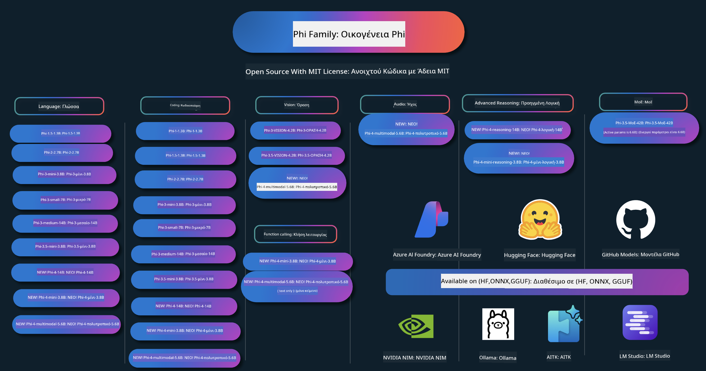

<!--
CO_OP_TRANSLATOR_METADATA:
{
  "original_hash": "1cab9282e04f2e1c388a38dca7763c16",
  "translation_date": "2025-05-09T03:55:27+00:00",
  "source_file": "README.md",
  "language_code": "el"
}
-->
# Phi Cookbook: Παραδείγματα με Πρακτική Εφαρμογή των Μοντέλων Phi της Microsoft

Το Phi είναι μια σειρά ανοιχτού κώδικα μοντέλων τεχνητής νοημοσύνης που ανέπτυξε η Microsoft.

Το Phi είναι αυτή τη στιγμή το πιο ισχυρό και οικονομικά αποδοτικό μικρό γλωσσικό μοντέλο (SLM), με εξαιρετικές επιδόσεις σε πολλαπλές γλώσσες, λογική, παραγωγή κειμένου/συνομιλίας, κωδικοποίηση, εικόνες, ήχο και άλλα σενάρια.

Μπορείτε να αναπτύξετε το Phi στο cloud ή σε συσκευές edge, και να δημιουργήσετε εύκολα εφαρμογές γεννητικής τεχνητής νοημοσύνης με περιορισμένη υπολογιστική ισχύ.

Ακολουθήστε αυτά τα βήματα για να ξεκινήσετε να χρησιμοποιείτε αυτούς τους πόρους:
1. **Κάντε Fork το Αποθετήριο**: Κάντε κλικ 
2. **Κλωνοποιήστε το Αποθετήριο**: `git clone https://github.com/microsoft/PhiCookBook.git`
3. [**Εγγραφείτε στην Κοινότητα Microsoft AI Discord και γνωρίστε ειδικούς και άλλους προγραμματιστές**](https://discord.com/invite/ByRwuEEgH4?WT.mc_id=aiml-137032-kinfeylo)

## 🌐 Υποστήριξη Πολλών Γλωσσών

### Υποστηρίζεται μέσω GitHub Action (Αυτοματοποιημένο & Πάντα Ενημερωμένο)

[French](../fr/README.md) | [Spanish](../es/README.md) | [German](../de/README.md) | [Russian](../ru/README.md) | [Arabic](../ar/README.md) | [Persian (Farsi)](../fa/README.md) | [Urdu](../ur/README.md) | [Chinese (Simplified)](../zh/README.md) | [Chinese (Traditional, Macau)](../mo/README.md) | [Chinese (Traditional, Hong Kong)](../hk/README.md) | [Chinese (Traditional, Taiwan)](../tw/README.md) | [Japanese](../ja/README.md) | [Korean](../ko/README.md) | [Hindi](../hi/README.md)

### Υποστηρίζεται μέσω CLI
## Πίνακας Περιεχομένων

- Εισαγωγή
- [Καλωσορίσατε στην οικογένεια Phi](./md/01.Introduction/01/01.PhiFamily.md)
  - [Ρύθμιση του περιβάλλοντός σας](./md/01.Introduction/01/01.EnvironmentSetup.md)
  - [Κατανόηση βασικών τεχνολογιών](./md/01.Introduction/01/01.Understandingtech.md)
  - [Ασφάλεια AI για τα μοντέλα Phi](./md/01.Introduction/01/01.AISafety.md)
  - [Υποστήριξη υλικού Phi](./md/01.Introduction/01/01.Hardwaresupport.md)
  - [Μοντέλα Phi & Διαθεσιμότητα σε πλατφόρμες](./md/01.Introduction/01/01.Edgeandcloud.md)
  - [Χρήση Guidance-ai και Phi](./md/01.Introduction/01/01.Guidance.md)
  - [GitHub Marketplace Models](https://github.com/marketplace/models)
  - [Azure AI Model Catalog](https://ai.azure.com)

- Εκτέλεση inference Phi σε διαφορετικά περιβάλλοντα
    -  [Hugging face](./md/01.Introduction/02/01.HF.md)
    -  [GitHub Models](./md/01.Introduction/02/02.GitHubModel.md)
    -  [Azure AI Foundry Model Catalog](./md/01.Introduction/02/03.AzureAIFoundry.md)
    -  [Ollama](./md/01.Introduction/02/04.Ollama.md)
    -  [AI Toolkit VSCode (AITK)](./md/01.Introduction/02/05.AITK.md)
    -  [NVIDIA NIM](./md/01.Introduction/02/06.NVIDIA.md)

- Εκτέλεση inference στην οικογένεια Phi
    - [Inference Phi σε iOS](./md/01.Introduction/03/iOS_Inference.md)
    - [Inference Phi σε Android](./md/01.Introduction/03/Android_Inference.md)
    - [Inference Phi σε Jetson](./md/01.Introduction/03/Jetson_Inference.md)
    - [Inference Phi σε AI PC](./md/01.Introduction/03/AIPC_Inference.md)
    - [Inference Phi με το Apple MLX Framework](./md/01.Introduction/03/MLX_Inference.md)
    - [Inference Phi σε τοπικό διακομιστή](./md/01.Introduction/03/Local_Server_Inference.md)
    - [Inference Phi σε απομακρυσμένο διακομιστή χρησιμοποιώντας το AI Toolkit](./md/01.Introduction/03/Remote_Interence.md)
    - [Inference Phi με Rust](./md/01.Introduction/03/Rust_Inference.md)
    - [Inference Phi--Vision τοπικά](./md/01.Introduction/03/Vision_Inference.md)
    - [Inference Phi με Kaito AKS, Azure Containers (επίσημη υποστήριξη)](./md/01.Introduction/03/Kaito_Inference.md)
-  [Quantifying Phi Family](./md/01.Introduction/04/QuantifyingPhi.md)
    - [Quantizing Phi-3.5 / 4 με χρήση llama.cpp](./md/01.Introduction/04/UsingLlamacppQuantifyingPhi.md)
    - [Quantizing Phi-3.5 / 4 με επεκτάσεις Generative AI για onnxruntime](./md/01.Introduction/04/UsingORTGenAIQuantifyingPhi.md)
    - [Quantizing Phi-3.5 / 4 με χρήση Intel OpenVINO](./md/01.Introduction/04/UsingIntelOpenVINOQuantifyingPhi.md)
    - [Quantizing Phi-3.5 / 4 με χρήση Apple MLX Framework](./md/01.Introduction/04/UsingAppleMLXQuantifyingPhi.md)

-  Evaluation Phi
- [Response AI](./md/01.Introduction/05/ResponsibleAI.md)
    - [Azure AI Foundry για Αξιολόγηση](./md/01.Introduction/05/AIFoundry.md)
    - [Χρήση του Promptflow για Αξιολόγηση](./md/01.Introduction/05/Promptflow.md)
 
- RAG με Azure AI Search
    - [Πώς να χρησιμοποιήσετε τα Phi-4-mini και Phi-4-multimodal(RAG) με Azure AI Search](https://github.com/microsoft/PhiCookBook/blob/main/code/06.E2E/E2E_Phi-4-RAG-Azure-AI-Search.ipynb)

- Παραδείγματα ανάπτυξης εφαρμογών Phi
  - Εφαρμογές Κειμένου & Συνομιλίας
    - Παραδείγματα Phi-4 🆕
      - [📓] [Συνομιλία με το μοντέλο Phi-4-mini ONNX](./md/02.Application/01.TextAndChat/Phi4/ChatWithPhi4ONNX/README.md)
      - [Συνομιλία με το τοπικό μοντέλο Phi-4 ONNX στο .NET](../../md/04.HOL/dotnet/src/LabsPhi4-Chat-01OnnxRuntime)
      - [Εφαρμογή κονσόλας .NET για συνομιλία με Phi-4 ONNX χρησιμοποιώντας Semantic Kernel](../../md/04.HOL/dotnet/src/LabsPhi4-Chat-02SK)
    - Παραδείγματα Phi-3 / 3.5
      - [Τοπικό chatbot στον περιηγητή με χρήση Phi3, ONNX Runtime Web και WebGPU](https://github.com/microsoft/onnxruntime-inference-examples/tree/main/js/chat)
      - [OpenVino Chat](./md/02.Application/01.TextAndChat/Phi3/E2E_OpenVino_Chat.md)
      - [Πολλαπλά μοντέλα - Διαδραστικό Phi-3-mini και OpenAI Whisper](./md/02.Application/01.TextAndChat/Phi3/E2E_Phi-3-mini_with_whisper.md)
      - [MLFlow - Δημιουργία wrapper και χρήση του Phi-3 με MLFlow](./md//02.Application/01.TextAndChat/Phi3/E2E_Phi-3-MLflow.md)
      - [Βελτιστοποίηση μοντέλου - Πώς να βελτιστοποιήσετε το μοντέλο Phi-3-mini για ONNX Runtime Web με Olive](https://github.com/microsoft/Olive/tree/main/examples/phi3)
      - [Εφαρμογή WinUI3 με Phi-3 mini-4k-instruct-onnx](https://github.com/microsoft/Phi3-Chat-WinUI3-Sample/)
      - [WinUI3 Multi Model AI Powered Notes App Παράδειγμα](https://github.com/microsoft/ai-powered-notes-winui3-sample)
      - [Fine-tune και Ενσωμάτωση προσαρμοσμένων μοντέλων Phi-3 με Prompt flow](./md/02.Application/01.TextAndChat/Phi3/E2E_Phi-3-FineTuning_PromptFlow_Integration.md)
      - [Fine-tune και Ενσωμάτωση προσαρμοσμένων μοντέλων Phi-3 με Prompt flow στο Azure AI Foundry](./md/02.Application/01.TextAndChat/Phi3/E2E_Phi-3-FineTuning_PromptFlow_Integration_AIFoundry.md)
      - [Αξιολόγηση του Fine-tuned μοντέλου Phi-3 / Phi-3.5 στο Azure AI Foundry με έμφαση στις Αρχές Responsible AI της Microsoft](./md/02.Application/01.TextAndChat/Phi3/E2E_Phi-3-Evaluation_AIFoundry.md)
      - [📓] [Παράδειγμα πρόβλεψης γλώσσας Phi-3.5-mini-instruct (Κινέζικα/Αγγλικά)](../../md/02.Application/01.TextAndChat/Phi3/phi3-instruct-demo.ipynb)
      - [Phi-3.5-Instruct WebGPU RAG Chatbot](./md/02.Application/01.TextAndChat/Phi3/WebGPUWithPhi35Readme.md)
      - [Χρήση Windows GPU για δημιουργία λύσης Prompt flow με Phi-3.5-Instruct ONNX](./md/02.Application/01.TextAndChat/Phi3/UsingPromptFlowWithONNX.md)
      - [Χρήση Microsoft Phi-3.5 tflite για δημιουργία εφαρμογής Android](./md/02.Application/01.TextAndChat/Phi3/UsingPhi35TFLiteCreateAndroidApp.md)
      - [Παράδειγμα Q&A .NET με τοπικό μοντέλο ONNX Phi-3 χρησιμοποιώντας Microsoft.ML.OnnxRuntime](../../md/04.HOL/dotnet/src/LabsPhi301)
      - [Εφαρμογή κονσόλας .NET για συνομιλία με Semantic Kernel και Phi-3](../../md/04.HOL/dotnet/src/LabsPhi302)

  - Παραδείγματα βασισμένα σε κώδικα Azure AI Inference SDK
    - Παραδείγματα Phi-4 🆕
      - [📓] [Δημιουργία κώδικα έργου με χρήση Phi-4-multimodal](./md/02.Application/02.Code/Phi4/GenProjectCode/README.md)
    - Παραδείγματα Phi-3 / 3.5
      - [Δημιουργήστε το δικό σας Visual Studio Code GitHub Copilot Chat με την οικογένεια Microsoft Phi-3](./md/02.Application/02.Code/Phi3/VSCodeExt/README.md)
      - [Δημιουργήστε τον δικό σας Visual Studio Code Chat Copilot Agent με Phi-3.5 μέσω GitHub Models](/md/02.Application/02.Code/Phi3/CreateVSCodeChatAgentWithGitHubModels.md)

  - Παραδείγματα Προχωρημένης Λογικής
    - Παραδείγματα Phi-4 🆕
      - [📓] [Phi-4-mini-reasoning ή Παραδείγματα Phi-4-reasoning](./md/02.Application/03.AdvancedReasoning/Phi4/AdvancedResoningPhi4mini/README.md)
      - [📓] [Fine-tuning του Phi-4-mini-reasoning με Microsoft Olive](../../md/02.Application/03.AdvancedReasoning/Phi4/AdvancedResoningPhi4mini/olive_ft_phi_4_reasoning_with_medicaldata.ipynb)
      - [📓] [Fine-tuning του Phi-4-mini-reasoning με Apple MLX](../../md/02.Application/03.AdvancedReasoning/Phi4/AdvancedResoningPhi4mini/mlx_ft_phi_4_reasoning_with_medicaldata.ipynb)
      - [📓] [Phi-4-mini-reasoning με GitHub Models](../../md/02.Application/02.Code/Phi4r/github_models_inference.ipynb)
- [📓] [Phi-4-mini reasoning με Azure AI Foundry Models](../../md/02.Application/02.Code/Phi4r/azure_models_inference.ipynb)
  - Παραδείγματα
      - [Phi-4-mini demos φιλοξενούμενα στο Hugging Face Spaces](https://huggingface.co/spaces/microsoft/phi-4-mini?WT.mc_id=aiml-137032-kinfeylo)
      - [Phi-4-multimodal demos φιλοξενούμενα στο Hugging Face Spaces](https://huggingface.co/spaces/microsoft/phi-4-multimodal?WT.mc_id=aiml-137032-kinfeylo)
  - Παραδείγματα Όρασης
    - Phi-4 Παραδείγματα 🆕
      - [📓] [Χρήση Phi-4-multimodal για ανάγνωση εικόνων και δημιουργία κώδικα](./md/02.Application/04.Vision/Phi4/CreateFrontend/README.md) 
    - Phi-3 / 3.5 Παραδείγματα
      -  [📓][Phi-3-vision-Μετατροπή εικόνας σε κείμενο](../../md/02.Application/04.Vision/Phi3/E2E_Phi-3-vision-image-text-to-text-online-endpoint.ipynb)
      - [Phi-3-vision-ONNX](https://onnxruntime.ai/docs/genai/tutorials/phi3-v.html)
      - [📓][Phi-3-vision CLIP Embedding](../../md/02.Application/04.Vision/Phi3/E2E_Phi-3-vision-image-text-to-text-online-endpoint.ipynb)
      - [DEMO: Phi-3 Recycling](https://github.com/jennifermarsman/PhiRecycling/)
      - [Phi-3-vision - Βοηθός οπτικής γλώσσας με Phi3-Vision και OpenVINO](https://docs.openvino.ai/nightly/notebooks/phi-3-vision-with-output.html)
      - [Phi-3 Vision Nvidia NIM](./md/02.Application/04.Vision/Phi3/E2E_Nvidia_NIM_Vision.md)
      - [Phi-3 Vision OpenVino](./md/02.Application/04.Vision/Phi3/E2E_OpenVino_Phi3Vision.md)
      - [📓][Phi-3.5 Vision δείγμα με πολλαπλά πλαίσια ή εικόνες](../../md/02.Application/04.Vision/Phi3/phi3-vision-demo.ipynb)
      - [Phi-3 Vision τοπικό μοντέλο ONNX με Microsoft.ML.OnnxRuntime .NET](../../md/04.HOL/dotnet/src/LabsPhi303)
      - [Μενού για τοπικό μοντέλο Phi-3 Vision ONNX με Microsoft.ML.OnnxRuntime .NET](../../md/04.HOL/dotnet/src/LabsPhi304)

  - Παραδείγματα Ήχου
    - Phi-4 Παραδείγματα 🆕
      - [📓] [Εξαγωγή απομαγνητοφωνήσεων ήχου με Phi-4-multimodal](./md/02.Application/05.Audio/Phi4/Transciption/README.md)
      - [📓] [Παράδειγμα ήχου Phi-4-multimodal](../../md/02.Application/05.Audio/Phi4/Siri/demo.ipynb)
      - [📓] [Παράδειγμα μετάφρασης ομιλίας με Phi-4-multimodal](../../md/02.Application/05.Audio/Phi4/Translate/demo.ipynb)
      - [.NET κονσόλα εφαρμογής με χρήση Phi-4-multimodal Audio για ανάλυση αρχείου ήχου και δημιουργία απομαγνητοφώνησης](../../md/04.HOL/dotnet/src/LabsPhi4-MultiModal-02Audio)

  - Παραδείγματα MOE
    - Phi-3 / 3.5 Παραδείγματα
      - [📓] [Phi-3.5 Mixture of Experts Models (MoEs) Παράδειγμα Social Media](../../md/02.Application/06.MoE/Phi3/phi3_moe_demo.ipynb)
      - [📓] [Δημιουργία Pipeline Retrieval-Augmented Generation (RAG) με NVIDIA NIM Phi-3 MOE, Azure AI Search και LlamaIndex](../../md/02.Application/06.MoE/Phi3/azure-ai-search-nvidia-rag.ipynb)
  - Παραδείγματα Function Calling
    - Phi-4 Παραδείγματα 🆕
      -  [📓] [Χρήση Function Calling με Phi-4-mini](./md/02.Application/07.FunctionCalling/Phi4/FunctionCallingBasic/README.md)
      -  [📓] [Χρήση Function Calling για δημιουργία multi-agents με Phi-4-mini](../../md/02.Application/07.FunctionCalling/Phi4/Multiagents/Phi_4_mini_multiagent.ipynb)
      -  [📓] [Χρήση Function Calling με Ollama](../../md/02.Application/07.FunctionCalling/Phi4/Ollama/ollama_functioncalling.ipynb)
  - Παραδείγματα Multimodal Mixing
    - Phi-4 Παραδείγματα 🆕
      -  [📓] [Χρήση Phi-4-multimodal ως τεχνολογικός δημοσιογράφος](../../md/02.Application/08.Multimodel/Phi4/TechJournalist/phi_4_mm_audio_text_publish_news.ipynb)
      - [.NET κονσόλα εφαρμογής που χρησιμοποιεί Phi-4-multimodal για ανάλυση εικόνων](../../md/04.HOL/dotnet/src/LabsPhi4-MultiModal-01Images)

- Fine-tuning Phi Παραδείγματα
  - [Σενάρια Fine-tuning](./md/03.FineTuning/FineTuning_Scenarios.md)
  - [Fine-tuning vs RAG](./md/03.FineTuning/FineTuning_vs_RAG.md)
  - [Fine-tuning: Αφήστε το Phi-3 να γίνει ειδικός της βιομηχανίας](./md/03.FineTuning/LetPhi3gotoIndustriy.md)
  - [Fine-tuning Phi-3 με το AI Toolkit για VS Code](./md/03.FineTuning/Finetuning_VSCodeaitoolkit.md)
  - [Fine-tuning Phi-3 με το Azure Machine Learning Service](./md/03.FineTuning/Introduce_AzureML.md)
- [Fine-tuning Phi-3 με Lora](./md/03.FineTuning/FineTuning_Lora.md)
  - [Fine-tuning Phi-3 με QLora](./md/03.FineTuning/FineTuning_Qlora.md)
  - [Fine-tuning Phi-3 με Azure AI Foundry](./md/03.FineTuning/FineTuning_AIFoundry.md)
  - [Fine-tuning Phi-3 με Azure ML CLI/SDK](./md/03.FineTuning/FineTuning_MLSDK.md)
  - [Fine-tuning με Microsoft Olive](./md/03.FineTuning/FineTuning_MicrosoftOlive.md)
  - [Hands-On Lab Fine-tuning με Microsoft Olive](./md/03.FineTuning/olive-lab/readme.md)
  - [Fine-tuning Phi-3-vision με Weights and Bias](./md/03.FineTuning/FineTuning_Phi-3-visionWandB.md)
  - [Fine-tuning Phi-3 με Apple MLX Framework](./md/03.FineTuning/FineTuning_MLX.md)
  - [Fine-tuning Phi-3-vision (επίσημη υποστήριξη)](./md/03.FineTuning/FineTuning_Vision.md)
  - [Fine-Tuning Phi-3 με Kaito AKS, Azure Containers (επίσημη υποστήριξη)](./md/03.FineTuning/FineTuning_Kaito.md)
  - [Fine-Tuning Phi-3 και 3.5 Vision](https://github.com/2U1/Phi3-Vision-Finetune)

- Hands on Lab
  - [Εξερεύνηση σύγχρονων μοντέλων: LLMs, SLMs, τοπική ανάπτυξη και άλλα](https://github.com/microsoft/aitour-exploring-cutting-edge-models)
  - [Ξεκλειδώνοντας το δυναμικό του NLP: Fine-Tuning με Microsoft Olive](https://github.com/azure/Ignite_FineTuning_workshop)

- Ακαδημαϊκές Ερευνητικές Εργασίες και Δημοσιεύσεις
  - [Textbooks Are All You Need II: phi-1.5 τεχνική αναφορά](https://arxiv.org/abs/2309.05463)
  - [Phi-3 Τεχνική Αναφορά: Ένα Ισχυρό Γλωσσικό Μοντέλο τοπικά στο κινητό σου](https://arxiv.org/abs/2404.14219)
  - [Phi-4 Τεχνική Αναφορά](https://arxiv.org/abs/2412.08905)
  - [Phi-4-Mini Τεχνική Αναφορά: Συμπαγή αλλά Ισχυρά Πολυτροπικά Γλωσσικά Μοντέλα μέσω Mixture-of-LoRAs](https://arxiv.org/abs/2503.01743)
  - [Βελτιστοποίηση Μικρών Γλωσσικών Μοντέλων για Κλήσεις Λειτουργιών Εντός Οχήματος](https://arxiv.org/abs/2501.02342)
  - [(WhyPHI) Fine-Tuning PHI-3 για Απαντήσεις σε Πολλαπλής Επιλογής Ερωτήσεις: Μεθοδολογία, Αποτελέσματα και Προκλήσεις](https://arxiv.org/abs/2501.01588)
  - [Phi-4-reasoning Τεχνική Αναφορά](https://www.microsoft.com/en-us/research/wp-content/uploads/2025/04/phi_4_reasoning.pdf)
  - [Phi-4-mini-reasoning Τεχνική Αναφορά](https://huggingface.co/microsoft/Phi-4-mini-reasoning/blob/main/Phi-4-Mini-Reasoning.pdf)

## Χρήση των Μοντέλων Phi

### Phi στο Azure AI Foundry

Μπορείτε να μάθετε πώς να χρησιμοποιείτε το Microsoft Phi και πώς να δημιουργείτε ολοκληρωμένες λύσεις σε διάφορες συσκευές υλικού. Για να δοκιμάσετε το Phi μόνοι σας, ξεκινήστε παίζοντας με τα μοντέλα και προσαρμόζοντας το Phi για τα δικά σας σενάρια χρησιμοποιώντας τον [Κατάλογο Μοντέλων Azure AI Foundry](https://aka.ms/phi3-azure-ai). Μάθετε περισσότερα στο Getting Started με το [Azure AI Foundry](/md/02.QuickStart/AzureAIFoundry_QuickStart.md)

**Playground**  
Κάθε μοντέλο διαθέτει έναν ειδικό χώρο δοκιμών για να το εξερευνήσετε [Azure AI Playground](https://aka.ms/try-phi3).

### Phi στα Μοντέλα GitHub

Μπορείτε να μάθετε πώς να χρησιμοποιείτε το Microsoft Phi και πώς να δημιουργείτε ολοκληρωμένες λύσεις σε διάφορες συσκευές υλικού. Για να δοκιμάσετε το Phi μόνοι σας, ξεκινήστε παίζοντας με το μοντέλο και προσαρμόζοντας το Phi για τα δικά σας σενάρια χρησιμοποιώντας τον [Κατάλογο Μοντέλων GitHub](https://github.com/marketplace/models?WT.mc_id=aiml-137032-kinfeylo). Μάθετε περισσότερα στο Getting Started με τον [Κατάλογο Μοντέλων GitHub](/md/02.QuickStart/GitHubModel_QuickStart.md)

**Playground**  
Κάθε μοντέλο διαθέτει έναν [χώρο δοκιμών για να το εξερευνήσετε](/md/02.QuickStart/GitHubModel_QuickStart.md).

### Phi στο Hugging Face

Μπορείτε επίσης να βρείτε το μοντέλο στο [Hugging Face](https://huggingface.co/microsoft)

**Playground**  
[Hugging Chat playground](https://huggingface.co/chat/models/microsoft/Phi-3-mini-4k-instruct)

## Υπεύθυνη Τεχνητή Νοημοσύνη

Η Microsoft δεσμεύεται να βοηθά τους πελάτες της να χρησιμοποιούν τα προϊόντα AI με υπευθυνότητα, να μοιράζεται τις εμπειρίες της και να δημιουργεί σχέσεις εμπιστοσύνης μέσω εργαλείων όπως τα Transparency Notes και Impact Assessments. Πολλοί από αυτούς τους πόρους είναι διαθέσιμοι στο [https://aka.ms/RAI](https://aka.ms/RAI).  
Η προσέγγιση της Microsoft για την υπεύθυνη τεχνητή νοημοσύνη βασίζεται στις αρχές της για δικαιοσύνη, αξιοπιστία και ασφάλεια, προστασία της ιδιωτικότητας και ασφάλεια, συμπερίληψη, διαφάνεια και λογοδοσία.
Μεγάλης κλίμακας μοντέλα φυσικής γλώσσας, εικόνας και ομιλίας - όπως αυτά που χρησιμοποιούνται σε αυτό το δείγμα - ενδέχεται να συμπεριφέρονται με τρόπους που είναι άδικοι, αναξιόπιστοι ή προσβλητικοί, προκαλώντας έτσι βλάβες. Παρακαλούμε συμβουλευτείτε το [Azure OpenAI service Transparency note](https://learn.microsoft.com/legal/cognitive-services/openai/transparency-note?tabs=text) για να ενημερωθείτε σχετικά με τους κινδύνους και τους περιορισμούς.

Η προτεινόμενη προσέγγιση για την αντιμετώπιση αυτών των κινδύνων είναι να ενσωματώσετε ένα σύστημα ασφάλειας στην αρχιτεκτονική σας που να μπορεί να ανιχνεύει και να αποτρέπει επιβλαβείς συμπεριφορές. Το [Azure AI Content Safety](https://learn.microsoft.com/azure/ai-services/content-safety/overview) παρέχει ένα ανεξάρτητο επίπεδο προστασίας, ικανό να ανιχνεύει επιβλαβές περιεχόμενο που δημιουργείται από χρήστες και AI σε εφαρμογές και υπηρεσίες. Το Azure AI Content Safety περιλαμβάνει API για κείμενο και εικόνα που σας επιτρέπουν να εντοπίζετε υλικό που είναι επιβλαβές. Μέσα στο Azure AI Foundry, η υπηρεσία Content Safety σας επιτρέπει να δείτε, να εξερευνήσετε και να δοκιμάσετε δείγματα κώδικα για την ανίχνευση επιβλαβούς περιεχομένου σε διαφορετικές μορφές. Η ακόλουθη [τεκμηρίωση γρήγορης εκκίνησης](https://learn.microsoft.com/azure/ai-services/content-safety/quickstart-text?tabs=visual-studio%2Clinux&pivots=programming-language-rest) σας καθοδηγεί στο πώς να κάνετε αιτήματα προς την υπηρεσία.

Ένα ακόμη στοιχείο που πρέπει να λάβετε υπόψη είναι η συνολική απόδοση της εφαρμογής. Σε εφαρμογές με πολυμορφικά και πολυμοντέλα, η απόδοση σημαίνει ότι το σύστημα λειτουργεί όπως εσείς και οι χρήστες σας αναμένετε, συμπεριλαμβανομένου του να μην παράγει επιβλαβή αποτελέσματα. Είναι σημαντικό να αξιολογήσετε την απόδοση της συνολικής εφαρμογής σας χρησιμοποιώντας τους [Performance and Quality and Risk and Safety evaluators](https://learn.microsoft.com/azure/ai-studio/concepts/evaluation-metrics-built-in). Επιπλέον, έχετε τη δυνατότητα να δημιουργήσετε και να αξιολογήσετε με [custom evaluators](https://learn.microsoft.com/azure/ai-studio/how-to/develop/evaluate-sdk#custom-evaluators).

Μπορείτε να αξιολογήσετε την AI εφαρμογή σας στο περιβάλλον ανάπτυξης χρησιμοποιώντας το [Azure AI Evaluation SDK](https://microsoft.github.io/promptflow/index.html). Δίνοντας είτε ένα σύνολο δοκιμαστικών δεδομένων είτε έναν στόχο, οι γεννήσεις της γενετικής AI εφαρμογής σας μετρώνται ποσοτικά με ενσωματωμένους ή custom evaluators της επιλογής σας. Για να ξεκινήσετε με το azure ai evaluation sdk και να αξιολογήσετε το σύστημά σας, μπορείτε να ακολουθήσετε τον [οδηγό γρήγορης εκκίνησης](https://learn.microsoft.com/azure/ai-studio/how-to/develop/flow-evaluate-sdk). Μόλις εκτελέσετε μια αξιολόγηση, μπορείτε να [οπτικοποιήσετε τα αποτελέσματα στο Azure AI Foundry](https://learn.microsoft.com/azure/ai-studio/how-to/evaluate-flow-results).

## Trademarks

Αυτό το έργο μπορεί να περιέχει εμπορικά σήματα ή λογότυπα για έργα, προϊόντα ή υπηρεσίες. Η εξουσιοδοτημένη χρήση των Microsoft trademarks ή λογοτύπων υπόκειται και πρέπει να ακολουθεί τις [Microsoft's Trademark & Brand Guidelines](https://www.microsoft.com/legal/intellectualproperty/trademarks/usage/general).
Η χρήση των Microsoft trademarks ή λογοτύπων σε τροποποιημένες εκδόσεις αυτού του έργου δεν πρέπει να προκαλεί σύγχυση ή να υπονοεί χορηγία από τη Microsoft. Οποιαδήποτε χρήση εμπορικών σημάτων ή λογοτύπων τρίτων υπόκειται στις πολιτικές των τρίτων αυτών.

**Αποποίηση ευθυνών**:  
Αυτό το έγγραφο έχει μεταφραστεί χρησιμοποιώντας την υπηρεσία αυτόματης μετάφρασης AI [Co-op Translator](https://github.com/Azure/co-op-translator). Παρόλο που προσπαθούμε για ακρίβεια, παρακαλούμε να γνωρίζετε ότι οι αυτόματες μεταφράσεις ενδέχεται να περιέχουν σφάλματα ή ανακρίβειες. Το πρωτότυπο έγγραφο στη μητρική του γλώσσα πρέπει να θεωρείται η επίσημη πηγή. Για κρίσιμες πληροφορίες, συνιστάται επαγγελματική μετάφραση από ανθρώπους. Δεν φέρουμε ευθύνη για τυχόν παρεξηγήσεις ή λανθασμένες ερμηνείες που προκύπτουν από τη χρήση αυτής της μετάφρασης.