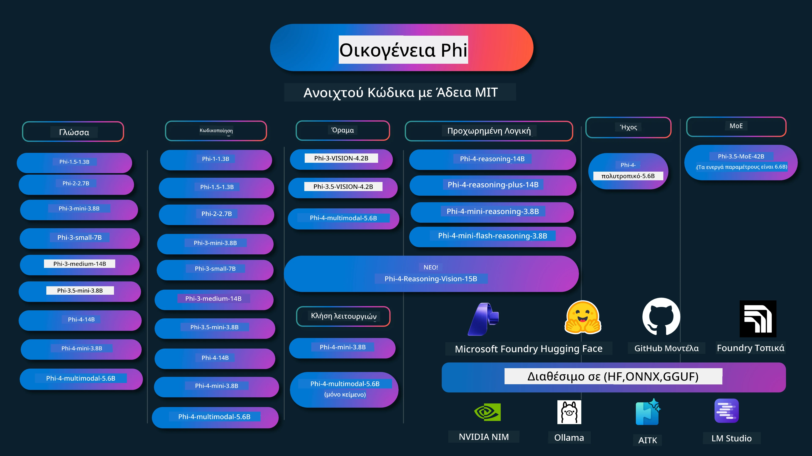

# Phi Cookbook: Παραδείγματα Hands-On με τα Μοντέλα Phi της Microsoft

[](https://codespaces.new/microsoft/phicookbook)
[](https://vscode.dev/redirect?url=vscode://ms-vscode-remote.remote-containers/cloneInVolume?url=https://github.com/microsoft/phicookbook)

[](https://GitHub.com/microsoft/phicookbook/graphs/contributors/?WT.mc_id=aiml-137032-kinfeylo)
[](https://GitHub.com/microsoft/phicookbook/issues/?WT.mc_id=aiml-137032-kinfeylo)
[](https://GitHub.com/microsoft/phicookbook/pulls/?WT.mc_id=aiml-137032-kinfeylo)
[](http://makeapullrequest.com?WT.mc_id=aiml-137032-kinfeylo)

[](https://GitHub.com/microsoft/phicookbook/watchers/?WT.mc_id=aiml-137032-kinfeylo)
[](https://GitHub.com/microsoft/phicookbook/network/?WT.mc_id=aiml-137032-kinfeylo)
[](https://GitHub.com/microsoft/phicookbook/stargazers/?WT.mc_id=aiml-137032-kinfeylo)

[](https://discord.com/invite/ByRwuEEgH4)

Το Phi είναι μια σειρά μοντέλων AI ανοιχτού κώδικα που αναπτύχθηκαν από τη Microsoft.

Το Phi είναι σήμερα το ισχυρότερο και πιο αποδοτικό μοντέλο μικρής γλώσσας (SLM), με πολύ καλά χαρακτηριστικά σε πολύγλωσση υποστήριξη, λογική, δημιουργία κειμένου/συνομιλίας, κωδικοποίηση, εικόνες, ήχο και άλλα σενάρια.

Μπορείτε να αναπτύξετε το Phi στο cloud ή σε συσκευές άκρου, και μπορείτε εύκολα να δημιουργήσετε εφαρμογές γεννητικής AI με περιορισμένη υπολογιστική ισχύ.

Ακολουθήστε αυτά τα βήματα για να ξεκινήσετε με αυτούς τους πόρους:
1. **Fork το Αποθετήριο**: Κάντε κλικ [](https://GitHub.com/microsoft/phicookbook/network/?WT.mc_id=aiml-137032-kinfeylo)
2. **Κλωνοποίηση του Αποθετηρίου**: `git clone https://github.com/microsoft/PhiCookBook.git`
3. [**Εγγραφείτε στην Κοινότητα Discord της Microsoft AI και συναντήστε ειδικούς και άλλους προγραμματιστές**](https://discord.com/invite/ByRwuEEgH4?WT.mc_id=aiml-137032-kinfeylo)



### 🌐 Υποστήριξη Πολυγλωσσικού Περιβάλλοντος

#### Υποστηρίζεται μέσω GitHub Action (Αυτοματοποιημένο & Πάντα Ενημερωμένο)

<!-- CO-OP TRANSLATOR LANGUAGES TABLE START -->
[Αραβικά](../ar/README.md) | [Βεγγαλικά](../bn/README.md) | [Βουλγαρικά](../bg/README.md) | [Βιρμανικά (Μιανμάρ)](../my/README.md) | [Κινέζικα (Απλοποιημένα)](../zh-CN/README.md) | [Κινέζικα (Παραδοσιακά, Χονγκ Κονγκ)](../zh-HK/README.md) | [Κινέζικα (Παραδοσιακά, Μακάο)](../zh-MO/README.md) | [Κινέζικα (Παραδοσιακά, Ταϊβάν)](../zh-TW/README.md) | [Κροατικά](../hr/README.md) | [Τσέχικα](../cs/README.md) | [Δανέζικα](../da/README.md) | [Ολλανδικά](../nl/README.md) | [Εσθονικά](../et/README.md) | [Φινλανδικά](../fi/README.md) | [Γαλλικά](../fr/README.md) | [Γερμανικά](../de/README.md) | [Ελληνικά](./README.md) | [Εβραϊκά](../he/README.md) | [Χίντι](../hi/README.md) | [Ουγγρικά](../hu/README.md) | [Ινδονησιακά](../id/README.md) | [Ιταλικά](../it/README.md) | [Ιαπωνικά](../ja/README.md) | [Κανάντα](../kn/README.md) | [Χμερ](../km/README.md) | [Κορεατικά](../ko/README.md) | [Λιθουανικά](../lt/README.md) | [Μαλαϊκά](../ms/README.md) | [Μαλαγιαλάμ](../ml/README.md) | [Μαράθι](../mr/README.md) | [Νεπαλικά](../ne/README.md) | [Νιγηριανή Πιντζίν](../pcm/README.md) | [Νορβηγικά](../no/README.md) | [Περσικά (Φαρσί)](../fa/README.md) | [Πολωνικά](../pl/README.md) | [Πορτογαλικά (Βραζιλία)](../pt-BR/README.md) | [Πορτογαλικά (Πορτογαλία)](../pt-PT/README.md) | [Πουντζάμπι (Γκουρμούκι)](../pa/README.md) | [Ρουμανικά](../ro/README.md) | [Ρωσικά](../ru/README.md) | [Σερβικά (Κυριλλικά)](../sr/README.md) | [Σλοβακικά](../sk/README.md) | [Σλοβενικά](../sl/README.md) | [Ισπανικά](../es/README.md) | [Σουαχίλι](../sw/README.md) | [Σουηδικά](../sv/README.md) | [Ταγκάλογκ (Φιλιππίνες)](../tl/README.md) | [Ταμίλ](../ta/README.md) | [Τελγού](../te/README.md) | [Ταϊλανδικά](../th/README.md) | [Τουρκικά](../tr/README.md) | [Ουκρανικά](../uk/README.md) | [Ουρντού](../ur/README.md) | [Βιετναμέζικα](../vi/README.md)

> **Προτιμάτε να Κλωνοποιήσετε Τοπικά;**
>
> Αυτό το αποθετήριο περιλαμβάνει περισσότερες από 50 γλωσσικές μεταφράσεις που αυξάνουν σημαντικά το μέγεθος του download. Για να κλωνοποιήσετε χωρίς τις μεταφράσεις, χρησιμοποιήστε το sparse checkout:
>
> **Bash / macOS / Linux:**
> ```bash
> git clone --filter=blob:none --sparse https://github.com/microsoft/PhiCookBook.git
> cd PhiCookBook
> git sparse-checkout set --no-cone '/*' '!translations' '!translated_images'
> ```
>
> **CMD (Windows):**
> ```cmd
> git clone --filter=blob:none --sparse https://github.com/microsoft/PhiCookBook.git
> cd PhiCookBook
> git sparse-checkout set --no-cone "/*" "!translations" "!translated_images"
> ```
>
> Αυτό σας δίνει ό,τι χρειάζεστε για να ολοκληρώσετε το μάθημα με πολύ ταχύτερο download.
<!-- CO-OP TRANSLATOR LANGUAGES TABLE END -->

## Πίνακας Περιεχομένων

- Εισαγωγή
  - [Καλώς ήρθατε στην Οικογένεια Phi](./md/01.Introduction/01/01.PhiFamily.md)
  - [Ρύθμιση του περιβάλλοντος σας](./md/01.Introduction/01/01.EnvironmentSetup.md)
  - [Κατανόηση βασικών τεχνολογιών](./md/01.Introduction/01/01.Understandingtech.md)
  - [Ασφάλεια AI για τα Μοντέλα Phi](./md/01.Introduction/01/01.AISafety.md)
  - [Υποστήριξη Υλικού Phi](./md/01.Introduction/01/01.Hardwaresupport.md)
  - [Μοντέλα Phi & Διαθεσιμότητα σε Πλατφόρμες](./md/01.Introduction/01/01.Edgeandcloud.md)
  - [Χρήση του Guidance-ai και Phi](./md/01.Introduction/01/01.Guidance.md)
  - [Μοντέλα GitHub Marketplace](https://github.com/marketplace/models)
  - [Κατάλογος Μοντέλων Azure AI](https://ai.azure.com)

- Εκτέλεση Phi σε διαφορετικό περιβάλλον
    -  [Hugging face](./md/01.Introduction/02/01.HF.md)
    -  [Μοντέλα GitHub](./md/01.Introduction/02/02.GitHubModel.md)
    -  [Κατάλογος Μοντέλων Microsoft Foundry](./md/01.Introduction/02/03.AzureAIFoundry.md)
    -  [Ollama](./md/01.Introduction/02/04.Ollama.md)
    -  [Εργαλειοθήκη AI VSCode (AITK)](./md/01.Introduction/02/05.AITK.md)
    -  [NVIDIA NIM](./md/01.Introduction/02/06.NVIDIA.md)
    -  [Τοπικό Foundry](./md/01.Introduction/02/07.FoundryLocal.md)

- Εκτέλεση Phi Family
    - [Εκτέλεση Phi σε iOS](./md/01.Introduction/03/iOS_Inference.md)
    - [Εκτέλεση Phi σε Android](./md/01.Introduction/03/Android_Inference.md)
    - [Εκτέλεση Phi σε Jetson](./md/01.Introduction/03/Jetson_Inference.md)
    - [Εκτέλεση Phi σε AI PC](./md/01.Introduction/03/AIPC_Inference.md)
    - [Εκτέλεση Phi με το Apple MLX Framework](./md/01.Introduction/03/MLX_Inference.md)
    - [Εκτέλεση Phi σε Τοπικό Διακομιστή](./md/01.Introduction/03/Local_Server_Inference.md)
    - [Εκτέλεση Phi σε Απομακρυσμένο Διακομιστή χρησιμοποιώντας την Εργαλειοθήκη AI](./md/01.Introduction/03/Remote_Interence.md)
    - [Εκτέλεση Phi με Rust](./md/01.Introduction/03/Rust_Inference.md)
    - [Εκτέλεση Phi - Όραμα τοπικά](./md/01.Introduction/03/Vision_Inference.md)
    - [Εκτέλεση Phi με Kaito AKS, Azure Containers (επίσημη υποστήριξη)](./md/01.Introduction/03/Kaito_Inference.md)
-  [Ποσοτικοποίηση Phi Family](./md/01.Introduction/04/QuantifyingPhi.md)
    - [Ποσοτικοποίηση Phi-3.5 / 4 με χρήση llama.cpp](./md/01.Introduction/04/UsingLlamacppQuantifyingPhi.md)
    - [Ποσοτικοποίηση Phi-3.5 / 4 με χρήση επεκτάσεων Generative AI για onnxruntime](./md/01.Introduction/04/UsingORTGenAIQuantifyingPhi.md)
    - [Ποσοτικοποίηση Phi-3.5 / 4 με χρήση Intel OpenVINO](./md/01.Introduction/04/UsingIntelOpenVINOQuantifyingPhi.md)
    - [Ποσοτικοποίηση Phi-3.5 / 4 με χρήση Apple MLX Framework](./md/01.Introduction/04/UsingAppleMLXQuantifyingPhi.md)

-  Αξιολόγηση Phi
    - [Υπεύθυνη AI](./md/01.Introduction/05/ResponsibleAI.md)
    - [Microsoft Foundry για Αξιολόγηση](./md/01.Introduction/05/AIFoundry.md)
    - [Χρήση Promptflow για Αξιολόγηση](./md/01.Introduction/05/Promptflow.md)
 
- RAG με Azure AI Search
    - [Πώς να χρησιμοποιήσετε το Phi-4-mini και Phi-4-multimodal(RAG) με Azure AI Search](https://github.com/microsoft/PhiCookBook/blob/main/code/06.E2E/E2E_Phi-4-RAG-Azure-AI-Search.ipynb)
    - [Τοπικό Υβριδικό RAG χωρίς Cloud με SQLite FTS5 και phi-4-mini](https://github.com/microsoft/PhiCookBook/blob/main/code/06.E2E/E2E_Phi-4-mini_Local_Hybrid_RAG_SQLite_FTS5.ipynb)

- Παραδείγματα ανάπτυξης εφαρμογών Phi
  - Εφαρμογές Κειμένου & Συνομιλίας
    - Παραδείγματα Phi-4
      - [📓] [Συνομιλία με το μοντέλο Phi-4-mini ONNX](./md/02.Application/01.TextAndChat/Phi4/ChatWithPhi4ONNX/README.md)
      - [Συνομιλία με το τοπικό μοντέλο Phi-4 ONNX .NET](../../md/04.HOL/dotnet/src/LabsPhi4-Chat-01OnnxRuntime)
      - [Συνομιλία εφαρμογής κονσόλας .NET με Phi-4 ONNX χρησιμοποιώντας Sementic Kernel](../../md/04.HOL/dotnet/src/LabsPhi4-Chat-02SK)

    - Delta-3 / 3.5 Δείγματα
      - [Τοπικό Chatbot στο πρόγραμμα περιήγησης χρησιμοποιώντας Phi3, ONNX Runtime Web και WebGPU](https://github.com/microsoft/onnxruntime-inference-examples/tree/main/js/chat)
      - [OpenVino Chat](./md/02.Application/01.TextAndChat/Phi3/E2E_OpenVino_Chat.md)
      - [Πολλαπλό Μοντέλο - Διαδραστικό Phi-3-mini και OpenAI Whisper](./md/02.Application/01.TextAndChat/Phi3/E2E_Phi-3-mini_with_whisper.md)
      - [MLFlow - Δημιουργία wrapper και χρήση Phi-3 με MLFlow](./md//02.Application/01.TextAndChat/Phi3/E2E_Phi-3-MLflow.md)
      - [Βελτιστοποίηση Μοντέλου - Πώς να βελτιστοποιήσετε το μοντέλο Phi-3-min για ONNX Runtime Web με Olive](https://github.com/microsoft/Olive/tree/main/examples/phi3)
      - [Εφαρμογή WinUI3 με Phi-3 mini-4k-instruct-onnx](https://github.com/microsoft/Phi3-Chat-WinUI3-Sample/)
      -[Δείγμα εφαρμογής WinUI3 πολλαπλού μοντέλου με AI Powered Σημειώσεις](https://github.com/microsoft/ai-powered-notes-winui3-sample)
      - [Βελτιστοποίηση και Ενσωμάτωση προσαρμοσμένων μοντέλων Phi-3 με Prompt flow](./md/02.Application/01.TextAndChat/Phi3/E2E_Phi-3-FineTuning_PromptFlow_Integration.md)
      - [Βελτιστοποίηση και Ενσωμάτωση προσαρμοσμένων μοντέλων Phi-3 με Prompt flow στο Microsoft Foundry](./md/02.Application/01.TextAndChat/Phi3/E2E_Phi-3-FineTuning_PromptFlow_Integration_AIFoundry.md)
      - [Αξιολόγηση του Βελτιστοποιημένου μοντέλου Phi-3 / Phi-3.5 στο Microsoft Foundry εστιάζοντας στις Αρχές Υπεύθυνης AI της Microsoft](./md/02.Application/01.TextAndChat/Phi3/E2E_Phi-3-Evaluation_AIFoundry.md)
      - [📓] [Delta-3.5-mini-instruct παράδειγμα πρόβλεψης γλώσσας (Κινέζικα/Αγγλικά)](./md/02.Application/01.TextAndChat/Phi3/phi3-instruct-demo.ipynb)
      - [Phi-3.5-Instruct WebGPU RAG Chatbot](./md/02.Application/01.TextAndChat/Phi3/WebGPUWithPhi35Readme.md)
      - [Χρήση Windows GPU για δημιουργία λύσης Prompt flow με Phi-3.5-Instruct ONNX](./md/02.Application/01.TextAndChat/Phi3/UsingPromptFlowWithONNX.md)
      - [Χρήση Microsoft Phi-3.5 tflite για δημιουργία εφαρμογής Android](./md/02.Application/01.TextAndChat/Phi3/UsingPhi35TFLiteCreateAndroidApp.md)
      - [Παράδειγμα Q&A .NET με τοπικό μοντέλο ONNX Phi-3 χρησιμοποιώντας το Microsoft.ML.OnnxRuntime](../../md/04.HOL/dotnet/src/LabsPhi301)
      - [Κονσόλα συνομιλίας .NET εφαρμογή με Semantic Kernel και Phi-3](../../md/04.HOL/dotnet/src/LabsPhi302)

  - Παραδείγματα Κώδικα Azure AI Inference SDK
    - Delta-4 Δείγματα
      - [📓] [Δημιουργία κώδικα έργου χρησιμοποιώντας Phi-4-multimodal](./md/02.Application/02.Code/Phi4/GenProjectCode/README.md)
    - Delta-3 / 3.5 Δείγματα
      - [Δημιουργήστε τον δικό σας Visual Studio Code GitHub Copilot Chat με την οικογένεια Microsoft Phi-3](./md/02.Application/02.Code/Phi3/VSCodeExt/README.md)
      - [Δημιουργήστε τον δικό σας Visual Studio Code Chat Copilot Agent με Phi-3.5 από Μοντέλα GitHub](/md/02.Application/02.Code/Phi3/CreateVSCodeChatAgentWithGitHubModels.md)

  - Προηγμένα Παραδείγματα Λογικής
    - Delta-4 Δείγματα
      - [📓] [Phi-4-mini-λογική ή Phi-4-λογική Παραδείγματα](./md/02.Application/03.AdvancedReasoning/Phi4/AdvancedResoningPhi4mini/README.md)
      - [📓] [Βελτιστοποίηση Phi-4-mini-λογικής με Microsoft Olive](./md/02.Application/03.AdvancedReasoning/Phi4/AdvancedResoningPhi4mini/olive_ft_phi_4_reasoning_with_medicaldata.ipynb)
      - [📓] [Βελτιστοποίηση Phi-4-mini-λογικής με Apple MLX](./md/02.Application/03.AdvancedReasoning/Phi4/AdvancedResoningPhi4mini/mlx_ft_phi_4_reasoning_with_medicaldata.ipynb)
      - [📓] [Phi-4-mini-λογική με Μοντέλα GitHub](./md/02.Application/02.Code/Phi4r/github_models_inference.ipynb)
      - [📓] [Phi-4-mini-λογική με Microsoft Foundry Μοντέλα](./md/02.Application/02.Code/Phi4r/azure_models_inference.ipynb)
  - Επιδείξεις
      - [Phi-4-mini επιδείξεις που φιλοξενούνται στο Hugging Face Spaces](https://huggingface.co/spaces/microsoft/phi-4-mini?WT.mc_id=aiml-137032-kinfeylo)
      - [Phi-4-multimodal επιδείξεις που φιλοξενούνται στο Hugging Face Spaces](https://huggingface.co/spaces/microsoft/phi-4-multimodal?WT.mc_id=aiml-137032-kinfeylo)
  - Παραδείγματα Όρασης
    - Delta-4 Δείγματα
      - [📓] [Χρήση Phi-4-multimodal για ανάγνωση εικόνων και δημιουργία κώδικα](./md/02.Application/04.Vision/Phi4/CreateFrontend/README.md)
    - Delta-3 / 3.5 Δείγματα
      -  [📓][Phi-3-vision-Μετατροπή κειμένου εικόνας σε κείμενο](./md/02.Application/04.Vision/Phi3/E2E_Phi-3-vision-image-text-to-text-online-endpoint.ipynb)
      - [Phi-3-vision-ONNX](https://onnxruntime.ai/docs/genai/tutorials/phi3-v.html)
      - [📓][Phi-3-vision CLIP Ενσωμάτωση](./md/02.Application/04.Vision/Phi3/E2E_Phi-3-vision-image-text-to-text-online-endpoint.ipynb)
      - [ΕΠΙΔΕΙΞΗ: Phi-3 Ανακύκλωση](https://github.com/jennifermarsman/PhiRecycling/)
      - [Phi-3-vision - Βοηθός Οπτικής Γλώσσας - με Phi3-Vision και OpenVINO](https://docs.openvino.ai/nightly/notebooks/phi-3-vision-with-output.html)
      - [Phi-3 Vision Nvidia NIM](./md/02.Application/04.Vision/Phi3/E2E_Nvidia_NIM_Vision.md)
      - [Phi-3 Vision OpenVino](./md/02.Application/04.Vision/Phi3/E2E_OpenVino_Phi3Vision.md)
      - [📓][Phi-3.5 Vision πολλαπλών καρέ ή πολλαπλής εικόνας παράδειγμα](./md/02.Application/04.Vision/Phi3/phi3-vision-demo.ipynb)
      - [Phi-3 Vision Τοπικό Μοντέλο ONNX χρησιμοποιώντας το Microsoft.ML.OnnxRuntime .NET](../../md/04.HOL/dotnet/src/LabsPhi303)
      - [Μενού βασισμένο στο Phi-3 Vision Τοπικό Μοντέλο ONNX χρησιμοποιώντας το Microsoft.ML.OnnxRuntime .NET](../../md/04.HOL/dotnet/src/LabsPhi304)

  - Παραδείγματα Λογικής-Όρασης
    - Phi-4-Λογική-Όρασης-15B
      - [📓] [Χρήση Phi-4-Λογικής-Όρασης-15B για ανίχνευση jaywalking](./md/02.Application/10.ReasoningVision/Phi_4_reasoning_vision_15b_Jaywalking.ipynb)
      - [📓] [Χρήση Phi-4-Λογικής-Όρασης-15B για μαθηματικά](./md/02.Application/10.ReasoningVision/Phi_4_reasoning_vision_15b_Math.ipynb)
      - [📓] [Χρήση Phi-4-Λογικής-Όρασης-15B για ανίχνευση UI](./md/02.Application/10.ReasoningVision/Phi_4_reasoning_vision_15b_ui.ipynb)

  - Μαθηματικά Παραδείγματα
    -  Delta-4-Mini-Flash-Λογική-Εντολές Παραδείγματα  [Επίδειξη Μαθηματικών με Delta-4-Mini-Flash-Λογική-Εντολές](./md/02.Application/09.Math/MathDemo.ipynb)

  - Παραδείγματα Ήχου
    - Delta-4 Δείγματα
      - [📓] [Εξαγωγή μεταγραφών ήχου χρησιμοποιώντας Phi-4-multimodal](./md/02.Application/05.Audio/Phi4/Transciption/README.md)
      - [📓] [Phi-4-multimodal Δείγμα Ήχου](./md/02.Application/05.Audio/Phi4/Siri/demo.ipynb)
      - [📓] [Phi-4-multimodal Δείγμα Μετάφρασης Ομιλίας](./md/02.Application/05.Audio/Phi4/Translate/demo.ipynb)
      - [.NET εφαρμογή κονσόλας χρησιμοποιώντας Phi-4-multimodal ήχο για ανάλυση αρχείου ήχου και δημιουργία μεταγραφής](../../md/04.HOL/dotnet/src/LabsPhi4-MultiModal-02Audio)

  - MOE Παραδείγματα
    - Delta-3 / 3.5 Δείγματα
      - [📓] [Delta-3.5 Μείγμα Ειδικών Μοντέλων (MoEs) Δείγμα Κοινωνικών Δικτύων](./md/02.Application/06.MoE/Phi3/phi3_moe_demo.ipynb)
      - [📓] [Δημιουργία Retrieval-Augmented Generation (RAG) Pipeline με NVIDIA NIM Phi-3 MOE, Azure AI Search, και LlamaIndex](./md/02.Application/06.MoE/Phi3/azure-ai-search-nvidia-rag.ipynb)
      - 
  - Παραδείγματα Κλήσης Συναρτήσεων
    - Delta-4 Δείγματα 🆕
      -  [📓] [Χρήση Κλήσης Συναρτήσεων με Delta-4-mini](./md/02.Application/07.FunctionCalling/Phi4/FunctionCallingBasic/README.md)
      -  [📓] [Χρήση Κλήσης Συναρτήσεων για δημιουργία multi-agents με Delta-4-mini](./md/02.Application/07.FunctionCalling/Phi4/Multiagents/Phi_4_mini_multiagent.ipynb)
      -  [📓] [Χρήση Κλήσης Συναρτήσεων με Ollama](./md/02.Application/07.FunctionCalling/Phi4/Ollama/ollama_functioncalling.ipynb)
      -  [📓] [Χρήση Κλήσης Συναρτήσεων με ONNX](./md/02.Application/07.FunctionCalling/Phi4/ONNX/onnx_parallel_functioncalling.ipynb)
  - Παραδείγματα Αναμείξεων Multimodal
    - Delta-4 Δείγματα 🆕
      -  [📓] [Χρήση Delta-4-multimodal ως Τεχνολογικού δημοσιογράφου](./md/02.Application/08.Multimodel/Phi4/TechJournalist/phi_4_mm_audio_text_publish_news.ipynb)
      - [.NET εφαρμογή κονσόλας χρησιμοποιώντας Delta-4-multimodal για ανάλυση εικόνων](../../md/04.HOL/dotnet/src/LabsPhi4-MultiModal-01Images)

- Βελτιστοποίηση Delta Παραδειγμάτων
  - [Σενάρια Βελτιστοποίησης](./md/03.FineTuning/FineTuning_Scenarios.md)
  - [Βελτιστοποίηση έναντι RAG](./md/03.FineTuning/FineTuning_vs_RAG.md)
  - [Άφησε το Delta-3 να γίνει ειδικός της βιομηχανίας](./md/03.FineTuning/LetPhi3gotoIndustriy.md)
  - [Βελτιστοποίηση Delta-3 με AI Toolkit για VS Code](./md/03.FineTuning/Finetuning_VSCodeaitoolkit.md)
  - [Βελτιστοποίηση Delta-3 με Azure Machine Learning Service](./md/03.FineTuning/Introduce_AzureML.md)
  - [Βελτιστοποίηση Delta-3 με Lora](./md/03.FineTuning/FineTuning_Lora.md)
  - [Βελτιστοποίηση Delta-3 με QLora](./md/03.FineTuning/FineTuning_Qlora.md)
  - [Βελτιστοποίηση Delta-3 με Microsoft Foundry](./md/03.FineTuning/FineTuning_AIFoundry.md)
  - [Βελτιστοποίηση Delta-3 με Azure ML CLI/SDK](./md/03.FineTuning/FineTuning_MLSDK.md)
  - [Βελτιστοποίηση με Microsoft Olive](./md/03.FineTuning/FineTuning_MicrosoftOlive.md)
  - [Βελτιστοποίηση με Microsoft Olive Hands-On Lab](./md/03.FineTuning/olive-lab/readme.md)
  - [Βελτιστοποίηση Delta-3-όραση με Weights and Bias](./md/03.FineTuning/FineTuning_Phi-3-visionWandB.md)

  - [Βελτιστοποίηση Phi-3 με το πλαίσιο Apple MLX](./md/03.FineTuning/FineTuning_MLX.md)
  - [Βελτιστοποίηση Phi-3-vision (επίσημη υποστήριξη)](./md/03.FineTuning/FineTuning_Vision.md)
  - [Βελτιστοποίηση Phi-3 με Kaito AKS, Azure Containers (επίσημη υποστήριξη)](./md/03.FineTuning/FineTuning_Kaito.md)
  - [Βελτιστοποίηση Phi-3 και 3.5 Vision](https://github.com/2U1/Phi3-Vision-Finetune)

- Πρακτικό Εργαστήριο
  - [Εξερεύνηση μοντέλων αιχμής: LLMs, SLMs, τοπική ανάπτυξη και πολλά άλλα](https://github.com/microsoft/aitour-exploring-cutting-edge-models)
  - [Απελευθέρωση δυνατοτήτων NLP: Βελτιστοποίηση με Microsoft Olive](https://github.com/azure/Ignite_FineTuning_workshop)

- Ακαδημαϊκά Ερευνητικά Άρθρα και Δημοσιεύσεις
  - [Textbooks Are All You Need II: phi-1.5 τεχνική αναφορά](https://arxiv.org/abs/2309.05463)
  - [Phi-3 Τεχνική Αναφορά: Πολύ ικανό γλωσσικό μοντέλο τοπικά στην συσκευή σας](https://arxiv.org/abs/2404.14219)
  - [Phi-4 Τεχνική Αναφορά](https://arxiv.org/abs/2412.08905)
  - [Phi-4-Mini Τεχνική Αναφορά: Συμπαγή αλλά ισχυρά πολυμορφικά γλωσσικά μοντέλα μέσω Μείγματος-LoRA](https://arxiv.org/abs/2503.01743)
  - [Βελτιστοποίηση μικρών γλωσσικών μοντέλων για κλήση λειτουργιών εντός οχήματος](https://arxiv.org/abs/2501.02342)
  - [(WhyPHI) Βελτιστοποίηση PHI-3 για απάντηση σε ερωτήσεις πολλαπλής επιλογής: Μεθοδολογία, Αποτελέσματα και Προκλήσεις](https://arxiv.org/abs/2501.01588)
  - [Phi-4-reasoning Τεχνική Αναφορά](https://www.microsoft.com/en-us/research/wp-content/uploads/2025/04/phi_4_reasoning.pdf)
  - [Phi-4-mini-reasoning Τεχνική Αναφορά](https://huggingface.co/microsoft/Phi-4-mini-reasoning/blob/main/Phi-4-Mini-Reasoning.pdf)

## Χρήση Μοντέλων Phi

### Phi στο Microsoft Foundry

Μπορείτε να μάθετε πώς να χρησιμοποιείτε το Microsoft Phi και πώς να δημιουργείτε ολοκληρωμένες λύσεις στις διάφορες συσκευές σας. Για να δοκιμάσετε το Phi μόνοι σας, ξεκινήστε παίζοντας με τα μοντέλα και προσαρμόζοντας το Phi για τα σενάριά σας χρησιμοποιώντας τον [Κατάλογο Μοντέλων Azure AI του Microsoft Foundry](https://aka.ms/phi3-azure-ai). Μπορείτε να μάθετε περισσότερα στην Εισαγωγή με το [Microsoft Foundry](/md/02.QuickStart/AzureAIFoundry_QuickStart.md)

**Παιδική Χαρά**
Κάθε μοντέλο έχει μία αφιερωμένη παιδική χαρά για να δοκιμάσετε το μοντέλο [Azure AI Playground](https://aka.ms/try-phi3).

### Phi στα μοντέλα GitHub

Μπορείτε να μάθετε πώς να χρησιμοποιείτε το Microsoft Phi και πώς να δημιουργείτε ολοκληρωμένες λύσεις στις διάφορες συσκευές σας. Για να δοκιμάσετε το Phi μόνοι σας, ξεκινήστε παίζοντας με το μοντέλο και προσαρμόζοντας το Phi για τα σενάριά σας χρησιμοποιώντας τον [Κατάλογο Μοντέλων GitHub](https://github.com/marketplace/models?WT.mc_id=aiml-137032-kinfeylo). Μπορείτε να μάθετε περισσότερα στην Εισαγωγή με τον [Κατάλογο Μοντέλων GitHub](/md/02.QuickStart/GitHubModel_QuickStart.md)

**Παιδική Χαρά**
Κάθε μοντέλο έχει μία αφιερωμένη [παιδική χαρά για να δοκιμάσετε το μοντέλο](/md/02.QuickStart/GitHubModel_QuickStart.md).

### Phi στο Hugging Face

Μπορείτε επίσης να βρείτε το μοντέλο στο [Hugging Face](https://huggingface.co/microsoft)

**Παιδική Χαρά**
 [Παιδική χαρά Hugging Chat](https://huggingface.co/chat/models/microsoft/Phi-3-mini-4k-instruct)

 ## 🎒 Άλλα Μαθήματα

Η ομάδα μας παράγει και άλλα μαθήματα! Ρίξτε μια ματιά:

<!-- CO-OP TRANSLATOR OTHER COURSES START -->
### LangChain
[](https://aka.ms/langchain4j-for-beginners)
[](https://aka.ms/langchainjs-for-beginners?WT.mc_id=m365-94501-dwahlin)
[](https://github.com/microsoft/langchain-for-beginners?WT.mc_id=m365-94501-dwahlin)
---

### Azure / Edge / MCP / Agents
[](https://github.com/microsoft/AZD-for-beginners?WT.mc_id=academic-105485-koreyst)
[](https://github.com/microsoft/edgeai-for-beginners?WT.mc_id=academic-105485-koreyst)
[](https://github.com/microsoft/mcp-for-beginners?WT.mc_id=academic-105485-koreyst)
[](https://github.com/microsoft/ai-agents-for-beginners?WT.mc_id=academic-105485-koreyst)

---
 
### Σειρά Γενετικής Τεχνητής Νοημοσύνης
[](https://github.com/microsoft/generative-ai-for-beginners?WT.mc_id=academic-105485-koreyst)
[-9333EA?style=for-the-badge&labelColor=E5E7EB&color=9333EA)](https://github.com/microsoft/Generative-AI-for-beginners-dotnet?WT.mc_id=academic-105485-koreyst)
[-C084FC?style=for-the-badge&labelColor=E5E7EB&color=C084FC)](https://github.com/microsoft/generative-ai-for-beginners-java?WT.mc_id=academic-105485-koreyst)
[-E879F9?style=for-the-badge&labelColor=E5E7EB&color=E879F9)](https://github.com/microsoft/generative-ai-with-javascript?WT.mc_id=academic-105485-koreyst)

---
 
### Βασική Εκμάθηση
[](https://aka.ms/ml-beginners?WT.mc_id=academic-105485-koreyst)
[](https://aka.ms/datascience-beginners?WT.mc_id=academic-105485-koreyst)
[](https://aka.ms/ai-beginners?WT.mc_id=academic-105485-koreyst)
[](https://github.com/microsoft/Security-101?WT.mc_id=academic-96948-sayoung)
[](https://aka.ms/webdev-beginners?WT.mc_id=academic-105485-koreyst)
[](https://aka.ms/iot-beginners?WT.mc_id=academic-105485-koreyst)
[](https://github.com/microsoft/xr-development-for-beginners?WT.mc_id=academic-105485-koreyst)

---
 
### Σειρά Copilot
[](https://aka.ms/GitHubCopilotAI?WT.mc_id=academic-105485-koreyst)
[](https://github.com/microsoft/mastering-github-copilot-for-dotnet-csharp-developers?WT.mc_id=academic-105485-koreyst)
[](https://github.com/microsoft/CopilotAdventures?WT.mc_id=academic-105485-koreyst)
<!-- CO-OP TRANSLATOR OTHER COURSES END -->

## Υπεύθυνη Τεχνητή Νοημοσύνη 

Η Microsoft δεσμεύεται να βοηθά τους πελάτες μας να χρησιμοποιούν τα προϊόντα τεχνητής νοημοσύνης με υπευθυνότητα, να μοιράζεται τα συμπεράσματά μας και να δημιουργεί σχέσεις εμπιστοσύνης μέσω εργαλείων όπως οι Σημειώσεις Διαφάνειας και οι Αξιολογήσεις Επιπτώσεων. Πολλοί από αυτούς τους πόρους είναι διαθέσιμοι στο [https://aka.ms/RAI](https://aka.ms/RAI).
Η προσέγγιση της Microsoft για την υπεύθυνη τεχνητή νοημοσύνη βασίζεται στις αρχές τεχνητής νοημοσύνης μας για δικαιοσύνη, αξιοπιστία και ασφάλεια, ιδιωτικότητα και ασφάλεια, συμπερίληψη, διαφάνεια και λογοδοσία.

Τα μεγάλης κλίμακας μοντέλα φυσικής γλώσσας, εικόνας και ομιλίας - όπως αυτά που χρησιμοποιούνται σε αυτό το παράδειγμα - ενδέχεται να συμπεριφέρονται με τρόπους που είναι άδικοι, αναξιόπιστοι ή προσβλητικοί, προκαλώντας έτσι ζημίες. Παρακαλούμε ανατρέξτε στη [Σημείωση Διαφάνειας της υπηρεσίας Azure OpenAI](https://learn.microsoft.com/legal/cognitive-services/openai/transparency-note?tabs=text) για να ενημερωθείτε για τους κινδύνους και τους περιορισμούς.


Η συνιστώμενη προσέγγιση για τη μείωση αυτών των κινδύνων είναι η ενσωμάτωση ενός συστήματος ασφάλειας στην αρχιτεκτονική σας που μπορεί να εντοπίζει και να αποτρέπει επιβλαβή συμπεριφορά. Το [Azure AI Content Safety](https://learn.microsoft.com/azure/ai-services/content-safety/overview) παρέχει ένα ανεξάρτητο επίπεδο προστασίας, ικανό να εντοπίζει επιβλαβές περιεχόμενο που δημιουργείται από χρήστες και AI σε εφαρμογές και υπηρεσίες. Το Azure AI Content Safety περιλαμβάνει APIs κειμένου και εικόνων που σας επιτρέπουν να εντοπίζετε υλικό που είναι επιβλαβές. Μέσα στο Microsoft Foundry, η υπηρεσία Content Safety σας επιτρέπει να προβάλετε, να εξερευνήσετε και να δοκιμάσετε δείγματα κώδικα για τον εντοπισμό επιβλαβούς περιεχομένου σε διαφορετικές μορφές. Η ακόλουθη [τεκμηρίωση γρήγορης εκκίνησης](https://learn.microsoft.com/azure/ai-services/content-safety/quickstart-text?tabs=visual-studio%2Clinux&pivots=programming-language-rest) σας καθοδηγεί μέσω της αποστολής αιτημάτων στην υπηρεσία.

Ένα άλλο σημείο που πρέπει να λάβετε υπόψη είναι η συνολική απόδοση της εφαρμογής. Σε πολυμορφικές εφαρμογές και εφαρμογές με πολλαπλά μοντέλα, η απόδοση θεωρείται ότι σημαίνει ότι το σύστημα λειτουργεί όπως εσείς και οι χρήστες σας περιμένετε, συμπεριλαμβανομένου του να μην δημιουργεί επιβλαβή αποτελέσματα. Είναι σημαντικό να αξιολογήσετε την απόδοση της συνολικής εφαρμογής σας χρησιμοποιώντας [εκτιμητές Απόδοσης και Ποιότητας και Κινδύνου και Ασφάλειας](https://learn.microsoft.com/azure/ai-studio/concepts/evaluation-metrics-built-in). Έχετε επίσης τη δυνατότητα να δημιουργήσετε και να αξιολογήσετε με [προσαρμοσμένους εκτιμητές](https://learn.microsoft.com/azure/ai-studio/how-to/develop/evaluate-sdk#custom-evaluators).

Μπορείτε να αξιολογήσετε την AI εφαρμογή σας στο περιβάλλον ανάπτυξής σας χρησιμοποιώντας το [Azure AI Evaluation SDK](https://microsoft.github.io/promptflow/index.html). Δίνοντας είτε ένα σετ δοκιμαστικών δεδομένων είτε έναν στόχο, οι γεννήσεις της γενετικής AI εφαρμογής σας μετρώνται ποσοτικά με ενσωματωμένους εκτιμητές ή προσαρμοσμένους εκτιμητές της επιλογής σας. Για να ξεκινήσετε με το azure ai evaluation sdk για την αξιολόγηση του συστήματός σας, μπορείτε να ακολουθήσετε τον [οδηγό γρήγορης εκκίνησης](https://learn.microsoft.com/azure/ai-studio/how-to/develop/flow-evaluate-sdk). Μόλις εκτελέσετε μια αξιολόγηση, μπορείτε να [οπτικοποιήσετε τα αποτελέσματα στο Microsoft Foundry](https://learn.microsoft.com/azure/ai-studio/how-to/evaluate-flow-results).

## Εμπορικά Σήματα

Αυτό το έργο μπορεί να περιέχει εμπορικά σήματα ή λογότυπα για έργα, προϊόντα ή υπηρεσίες. Η εξουσιοδοτημένη χρήση των εμπορικών σημάτων ή λογοτύπων της Microsoft υπόκειται και πρέπει να ακολουθεί τις [Οδηγίες Εμπορικών Σημάτων & Επωνυμίας της Microsoft](https://www.microsoft.com/legal/intellectualproperty/trademarks/usage/general).
Η χρήση των εμπορικών σημάτων ή λογοτύπων της Microsoft σε τροποποιημένες εκδόσεις αυτού του έργου δεν πρέπει να προκαλεί σύγχυση ή να υποδηλώνει χορηγία από τη Microsoft. Οποιαδήποτε χρήση εμπορικών σημάτων ή λογοτύπων τρίτων υπόκειται στις πολιτικές αυτών των τρίτων.

## Λήψη Βοήθειας

Εάν κολλήσετε ή έχετε ερωτήσεις σχετικά με την κατασκευή εφαρμογών AI, συμμετέχετε:

[](https://aka.ms/foundry/discord)

Εάν έχετε σχόλια προϊόντος ή λάθη κατά την κατασκευή, επισκεφθείτε:

[](https://aka.ms/foundry/forum)

---

<!-- CO-OP TRANSLATOR DISCLAIMER START -->
**Αποποίηση ευθυνών**:
Αυτό το έγγραφο έχει μεταφραστεί χρησιμοποιώντας την υπηρεσία μετάφρασης με τεχνητή νοημοσύνη [Co-op Translator](https://github.com/Azure/co-op-translator). Ενώ επιδιώκουμε την ακρίβεια, παρακαλούμε να έχετε υπόψη ότι οι αυτοματοποιημένες μεταφράσεις ενδέχεται να περιέχουν λάθη ή ανακρίβειες. Το πρωτότυπο έγγραφο στη μητρική του γλώσσα πρέπει να θεωρείται η αυθεντική πηγή. Για κρίσιμες πληροφορίες, συνιστάται επαγγελματική ανθρώπινη μετάφραση. Δεν φέρουμε ευθύνη για τυχόν παρεξηγήσεις ή λανθασμένες ερμηνείες που προκύπτουν από τη χρήση αυτής της μετάφρασης.
<!-- CO-OP TRANSLATOR DISCLAIMER END -->