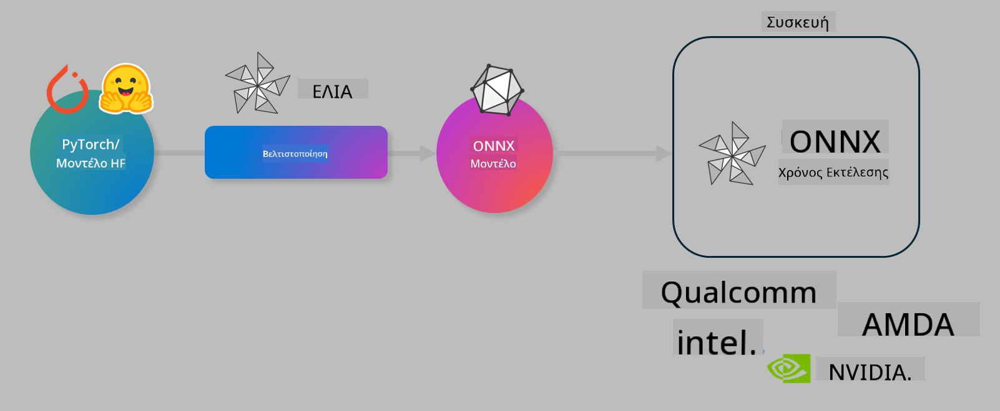

<!--
CO_OP_TRANSLATOR_METADATA:
{
  "original_hash": "6bbe47de3b974df7eea29dfeccf6032b",
  "translation_date": "2025-05-09T04:24:35+00:00",
  "source_file": "code/03.Finetuning/olive-lab/readme.md",
  "language_code": "el"
}
-->
# Εργαστήριο. Βελτιστοποίηση μοντέλων AI για εκτέλεση σε συσκευή

## Εισαγωγή

> [!IMPORTANT]
> Αυτό το εργαστήριο απαιτεί **Nvidia A10 ή A100 GPU** με τους αντίστοιχους οδηγούς και το CUDA toolkit (έκδοση 12+) εγκατεστημένα.

> [!NOTE]
> Πρόκειται για ένα εργαστήριο διάρκειας **35 λεπτών** που θα σας δώσει μια πρακτική εισαγωγή στις βασικές έννοιες της βελτιστοποίησης μοντέλων για εκτέλεση σε συσκευή χρησιμοποιώντας το OLIVE.

## Στόχοι μάθησης

Στο τέλος αυτού του εργαστηρίου, θα μπορείτε να χρησιμοποιήσετε το OLIVE για:

- Κβαντισμό ενός μοντέλου AI χρησιμοποιώντας τη μέθοδο κβαντισμού AWQ.
- Εκπαίδευση (fine-tune) ενός μοντέλου AI για συγκεκριμένη εργασία.
- Δημιουργία προσαρμογέων LoRA (εκπαιδευμένο μοντέλο) για αποδοτική εκτέλεση σε συσκευή με το ONNX Runtime.

### Τι είναι το Olive

Το Olive (*O*NNX *live*) είναι ένα εργαλείο βελτιστοποίησης μοντέλων με συνοδευτικό CLI που σας επιτρέπει να διανείμετε μοντέλα για το ONNX runtime +++https://onnxruntime.ai+++ με ποιότητα και απόδοση.



Η είσοδος στο Olive είναι συνήθως ένα μοντέλο PyTorch ή Hugging Face και η έξοδος είναι ένα βελτιστοποιημένο μοντέλο ONNX που εκτελείται σε μια συσκευή (στόχος ανάπτυξης) με το ONNX runtime. Το Olive βελτιστοποιεί το μοντέλο για τον επιταχυντή AI (NPU, GPU, CPU) του στόχου ανάπτυξης που παρέχεται από κατασκευαστές hardware όπως Qualcomm, AMD, Nvidia ή Intel.

Το Olive εκτελεί μια *ροή εργασιών* (workflow), που είναι μια διατεταγμένη ακολουθία ατομικών εργασιών βελτιστοποίησης μοντέλου που ονομάζονται *passes* – παραδείγματα passes είναι: συμπίεση μοντέλου, καταγραφή γραφήματος, κβαντισμός, βελτιστοποίηση γραφήματος. Κάθε pass έχει ένα σύνολο παραμέτρων που μπορούν να ρυθμιστούν για να επιτευχθούν τα καλύτερα μετρικά, όπως ακρίβεια και καθυστέρηση, που αξιολογούνται από τον αντίστοιχο αξιολογητή. Το Olive χρησιμοποιεί μια στρατηγική αναζήτησης που εφαρμόζει έναν αλγόριθμο για αυτόματη ρύθμιση κάθε pass ξεχωριστά ή συνδυαστικά.

#### Οφέλη του Olive

- **Μειώνει τον κόπο και τον χρόνο** της δοκιμής και λάθους σε πειραματισμούς με τεχνικές βελτιστοποίησης γραφήματος, συμπίεσης και κβαντισμού. Ορίστε τις απαιτήσεις ποιότητας και απόδοσης και αφήστε το Olive να βρει αυτόματα το καλύτερο μοντέλο για εσάς.
- **Πάνω από 40 ενσωματωμένα στοιχεία βελτιστοποίησης μοντέλων** που καλύπτουν σύγχρονες τεχνικές κβαντισμού, συμπίεσης, βελτιστοποίησης γραφήματος και εκπαίδευσης.
- **Εύχρηστο CLI** για κοινές εργασίες βελτιστοποίησης μοντέλων. Για παράδειγμα, olive quantize, olive auto-opt, olive finetune.
- Ενσωματωμένη συσκευασία και ανάπτυξη μοντέλων.
- Υποστήριξη δημιουργίας μοντέλων για **Multi LoRA εξυπηρέτηση**.
- Δημιουργία ροών εργασιών μέσω YAML/JSON για οργάνωση εργασιών βελτιστοποίησης και ανάπτυξης μοντέλων.
- Ενσωμάτωση με **Hugging Face** και **Azure AI**.
- Ενσωματωμένος μηχανισμός **cache** για **εξοικονόμηση κόστους**.

## Οδηγίες εργαστηρίου
> [!NOTE]
> Βεβαιωθείτε ότι έχετε δημιουργήσει το Azure AI Hub και το Project σας και έχετε ρυθμίσει τον υπολογιστικό κόμβο A100 σύμφωνα με το Εργαστήριο 1.

### Βήμα 0: Σύνδεση με το Azure AI Compute

Θα συνδεθείτε με το Azure AI compute χρησιμοποιώντας τη λειτουργία απομακρυσμένης σύνδεσης στο **VS Code.**

1. Ανοίξτε την εφαρμογή **VS Code** στον υπολογιστή σας:
1. Ανοίξτε την **παλέτα εντολών** με **Shift+Ctrl+P**
1. Στην παλέτα εντολών αναζητήστε **AzureML - remote: Connect to compute instance in New Window**.
1. Ακολουθήστε τις οδηγίες στην οθόνη για να συνδεθείτε με το Compute. Θα χρειαστεί να επιλέξετε τη Συνδρομή Azure, την Ομάδα Πόρων, το Project και το όνομα του Compute που δημιουργήσατε στο Εργαστήριο 1.
1. Μόλις συνδεθείτε με τον κόμβο Azure ML Compute, αυτό θα εμφανιστεί στην **κάτω αριστερή γωνία του Visual Code** `><Azure ML: Compute Name`

### Βήμα 1: Κλωνοποίηση αυτού του αποθετηρίου

Στο VS Code, ανοίξτε ένα νέο τερματικό με **Ctrl+J** και κλωνοποιήστε αυτό το αποθετήριο:

Στο τερματικό θα δείτε το prompt

```
azureuser@computername:~/cloudfiles/code$ 
```
Κλωνοποιήστε τη λύση

```bash
cd ~/localfiles
git clone https://github.com/microsoft/phi-3cookbook.git
```

### Βήμα 2: Άνοιγμα φακέλου στο VS Code

Για να ανοίξετε το VS Code στον αντίστοιχο φάκελο εκτελέστε την παρακάτω εντολή στο τερματικό, που θα ανοίξει νέο παράθυρο:

```bash
code phi-3cookbook/code/04.Finetuning/Olive-lab
```

Εναλλακτικά, μπορείτε να ανοίξετε το φάκελο επιλέγοντας **File** > **Open Folder**.

### Βήμα 3: Εξαρτήσεις

Ανοίξτε ένα τερματικό στο VS Code στον Azure AI Compute Instance σας (συντόμευση: **Ctrl+J**) και εκτελέστε τις παρακάτω εντολές για να εγκαταστήσετε τις εξαρτήσεις:

```bash
conda create -n olive-ai python=3.11 -y
conda activate olive-ai
pip install -r requirements.txt
az extension remove -n azure-cli-ml
az extension add -n ml
```

> [!NOTE]
> Η εγκατάσταση όλων των εξαρτήσεων θα διαρκέσει περίπου 5 λεπτά.

Σε αυτό το εργαστήριο θα κατεβάσετε και θα ανεβάσετε μοντέλα στον κατάλογο μοντέλων Azure AI. Για να έχετε πρόσβαση στον κατάλογο, πρέπει να κάνετε σύνδεση στο Azure με:

```bash
az login
```

> [!NOTE]
> Κατά τη σύνδεση θα σας ζητηθεί να επιλέξετε τη συνδρομή σας. Βεβαιωθείτε ότι έχετε ορίσει τη συνδρομή που παρέχεται για αυτό το εργαστήριο.

### Βήμα 4: Εκτέλεση εντολών Olive

Ανοίξτε ένα τερματικό στο VS Code στον Azure AI Compute Instance σας (συντόμευση: **Ctrl+J**) και βεβαιωθείτε ότι είναι ενεργοποιημένο το περιβάλλον conda `olive-ai`:

```bash
conda activate olive-ai
```

Στη συνέχεια, εκτελέστε τις παρακάτω εντολές Olive στη γραμμή εντολών.

1. **Επισκόπηση των δεδομένων:** Σε αυτό το παράδειγμα, θα κάνετε fine-tune το μοντέλο Phi-3.5-Mini ώστε να εξειδικευτεί σε ερωτήσεις σχετικές με ταξίδια. Ο κώδικας παρακάτω εμφανίζει τις πρώτες εγγραφές του dataset, που είναι σε μορφή JSON lines:
   
    ```bash
    head data/data_sample_travel.jsonl
    ```
1. **Κβαντισμός του μοντέλου:** Πριν την εκπαίδευση, πρώτα κάνετε κβαντισμό με την εντολή που χρησιμοποιεί την τεχνική Active Aware Quantization (AWQ) +++https://arxiv.org/abs/2306.00978+++. Το AWQ κβαντίζει τα βάρη του μοντέλου λαμβάνοντας υπόψη τις ενεργοποιήσεις που παράγονται κατά την εκτέλεση. Αυτό σημαίνει ότι η διαδικασία κβαντισμού λαμβάνει υπόψη την πραγματική κατανομή των δεδομένων στις ενεργοποιήσεις, διατηρώντας καλύτερα την ακρίβεια σε σχέση με παραδοσιακές μεθόδους κβαντισμού βαρών.
    
    ```bash
    olive quantize \
       --model_name_or_path microsoft/Phi-3.5-mini-instruct \
       --trust_remote_code \
       --algorithm awq \
       --output_path models/phi/awq \
       --log_level 1
    ```
    
    Η διαδικασία κβαντισμού με AWQ διαρκεί περίπου **8 λεπτά** και **μειώνει το μέγεθος του μοντέλου από ~7.5GB σε ~2.5GB**.
   
   Σε αυτό το εργαστήριο, σας δείχνουμε πώς να εισάγετε μοντέλα από το Hugging Face (για παράδειγμα: `microsoft/Phi-3.5-mini-instruct`). However, Olive also allows you to input models from the Azure AI catalog by updating the `model_name_or_path` argument to an Azure AI asset ID (for example:  `azureml://registries/azureml/models/Phi-3.5-mini-instruct/versions/4`). 

1. **Train the model:** Next, the `olive finetune` εκτελεί fine-tune στο κβαντισμένο μοντέλο. Ο κβαντισμός *πριν* το fine-tuning αντί για μετά δίνει καλύτερη ακρίβεια, καθώς η εκπαίδευση ανακτά μέρος της απώλειας από τον κβαντισμό.
    
    ```bash
    olive finetune \
        --method lora \
        --model_name_or_path models/phi/awq \
        --data_files "data/data_sample_travel.jsonl" \
        --data_name "json" \
        --text_template "<|user|>\n{prompt}<|end|>\n<|assistant|>\n{response}<|end|>" \
        --max_steps 100 \
        --output_path ./models/phi/ft \
        --log_level 1
    ```
    
    Το fine-tuning (με 100 βήματα) διαρκεί περίπου **6 λεπτά**.

1. **Βελτιστοποίηση:** Μετά την εκπαίδευση, βελτιστοποιείτε το μοντέλο χρησιμοποιώντας την εντολή `auto-opt` command, which will capture the ONNX graph and automatically perform a number of optimizations to improve the model performance for CPU by compressing the model and doing fusions. It should be noted, that you can also optimize for other devices such as NPU or GPU by just updating the `--device` and `--provider` του Olive – για τους σκοπούς αυτού του εργαστηρίου θα χρησιμοποιήσουμε CPU.

    ```bash
    olive auto-opt \
       --model_name_or_path models/phi/ft/model \
       --adapter_path models/phi/ft/adapter \
       --device cpu \
       --provider CPUExecutionProvider \
       --use_ort_genai \
       --output_path models/phi/onnx-ao \
       --log_level 1
    ```
    
    Η βελτιστοποίηση διαρκεί περίπου **5 λεπτά**.

### Βήμα 5: Γρήγορος έλεγχος inferencing μοντέλου

Για να δοκιμάσετε την εκτέλεση του μοντέλου, δημιουργήστε ένα αρχείο Python στον φάκελό σας με όνομα **app.py** και αντιγράψτε τον παρακάτω κώδικα:

```python
import onnxruntime_genai as og
import numpy as np

print("loading model and adapters...", end="", flush=True)
model = og.Model("models/phi/onnx-ao/model")
adapters = og.Adapters(model)
adapters.load("models/phi/onnx-ao/model/adapter_weights.onnx_adapter", "travel")
print("DONE!")

tokenizer = og.Tokenizer(model)
tokenizer_stream = tokenizer.create_stream()

params = og.GeneratorParams(model)
params.set_search_options(max_length=100, past_present_share_buffer=False)
user_input = "what is the best thing to see in chicago"
params.input_ids = tokenizer.encode(f"<|user|>\n{user_input}<|end|>\n<|assistant|>\n")

generator = og.Generator(model, params)

generator.set_active_adapter(adapters, "travel")

print(f"{user_input}")

while not generator.is_done():
    generator.compute_logits()
    generator.generate_next_token()

    new_token = generator.get_next_tokens()[0]
    print(tokenizer_stream.decode(new_token), end='', flush=True)

print("\n")
```

Εκτελέστε τον κώδικα με:

```bash
python app.py
```

### Βήμα 6: Ανέβασμα μοντέλου στο Azure AI

Το ανέβασμα του μοντέλου σε αποθετήριο μοντέλων Azure AI το καθιστά διαθέσιμο σε άλλα μέλη της ομάδας σας και διαχειρίζεται τον έλεγχο εκδόσεων του μοντέλου. Για να ανεβάσετε το μοντέλο εκτελέστε την παρακάτω εντολή:

> [!NOTE]
> Ενημερώστε τα πεδία `{}` placeholders with the name of your resource group and Azure AI Project Name. 

To find your resource group `"resourceGroup"` και το όνομα του Azure AI Project, εκτελέστε την εντολή:

```
az ml workspace show
```

Εναλλακτικά, μεταβείτε στο +++ai.azure.com+++ και επιλέξτε **management center** > **project** > **overview**

Ενημερώστε τα `{}` με το όνομα της ομάδας πόρων και του Azure AI Project σας.

```bash
az ml model create \
    --name ft-for-travel \
    --version 1 \
    --path ./models/phi/onnx-ao \
    --resource-group {RESOURCE_GROUP_NAME} \
    --workspace-name {PROJECT_NAME}
```
Μπορείτε να δείτε το ανεβασμένο μοντέλο και να το αναπτύξετε στη διεύθυνση https://ml.azure.com/model/list

**Αποποίηση ευθυνών**:  
Αυτό το έγγραφο έχει μεταφραστεί χρησιμοποιώντας την υπηρεσία μετάφρασης με τεχνητή νοημοσύνη [Co-op Translator](https://github.com/Azure/co-op-translator). Παρόλο που επιδιώκουμε την ακρίβεια, παρακαλούμε να λάβετε υπόψη ότι οι αυτοματοποιημένες μεταφράσεις ενδέχεται να περιέχουν λάθη ή ανακρίβειες. Το πρωτότυπο έγγραφο στη γλώσσα του θεωρείται η επίσημη πηγή. Για κρίσιμες πληροφορίες, συνιστάται η επαγγελματική μετάφραση από ανθρώπους. Δεν φέρουμε ευθύνη για τυχόν παρεξηγήσεις ή λανθασμένες ερμηνείες που προκύπτουν από τη χρήση αυτής της μετάφρασης.