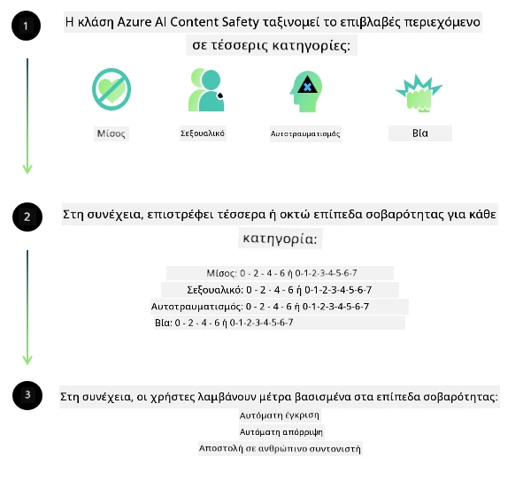
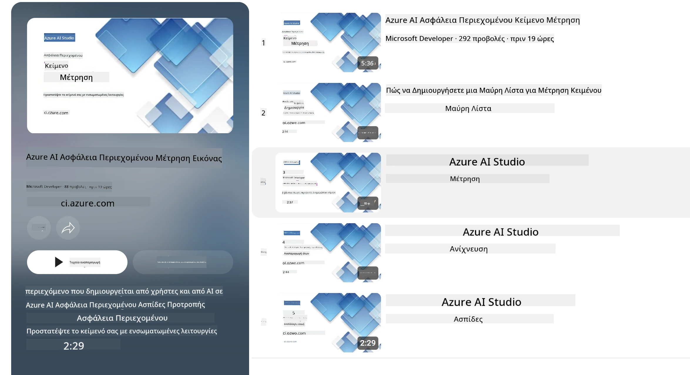

<!--
CO_OP_TRANSLATOR_METADATA:
{
  "original_hash": "839ccc4b3886ef10cfd4e64977f5792d",
  "translation_date": "2026-01-05T12:11:13+00:00",
  "source_file": "md/01.Introduction/01/01.AISafety.md",
  "language_code": "el"
}
-->
# Ασφάλεια AI για μοντέλα Phi
Η οικογένεια μοντέλων Phi αναπτύχθηκε σύμφωνα με το [Microsoft Responsible AI Standard](https://www.microsoft.com/ai/principles-and-approach#responsible-ai-standard), το οποίο είναι ένα εταιρικό σύνολο απαιτήσεων βασισμένων στις ακόλουθες έξι αρχές: λογοδοσία, διαφάνεια, δικαιοσύνη, αξιοπιστία και ασφάλεια, ιδιωτικότητα και ασφάλεια, και ένταξη που αποτελούν τις [Αρχές Υπεύθυνου AI της Microsoft](https://www.microsoft.com/ai/responsible-ai).

Όπως και τα προηγούμενα μοντέλα Phi, υιοθετήθηκε μια πολυδιάστατη αξιολόγηση ασφάλειας και προσέγγιση ασφάλειας μετά την εκπαίδευση, με επιπλέον μέτρα να λαμβάνονται υπόψη για τις πολύγλωσσες ικανότητες αυτής της έκδοσης. Η προσέγγισή μας στην εκπαίδευση ασφάλειας και τις αξιολογήσεις, συμπεριλαμβανομένων των δοκιμών σε πολλές γλώσσες και κατηγορίες κινδύνου, περιγράφεται στο [Phi Safety Post-Training Paper](https://arxiv.org/abs/2407.13833). Ενώ τα μοντέλα Phi επωφελούνται από αυτήν την προσέγγιση, οι προγραμματιστές πρέπει να εφαρμόζουν τις καλύτερες πρακτικές υπεύθυνου AI, συμπεριλαμβανομένου του χαρτογραφήματος, της μέτρησης και μετριασμού των κινδύνων που σχετίζονται με τη συγκεκριμένη περίπτωση χρήσης τους και το πολιτισμικό και γλωσσικό πλαίσιο.

## Καλύτερες Πρακτικές

Όπως και άλλα μοντέλα, η οικογένεια μοντέλων Phi μπορεί ενδεχομένως να συμπεριφέρεται με τρόπους που είναι άδικοι, αναξιόπιστοι ή προσβλητικοί.

Μερικές από τις περιοριστικές συμπεριφορές των SLM και LLM που πρέπει να γνωρίζετε περιλαμβάνουν:

- **Ποιότητα Υπηρεσίας:** Τα μοντέλα Phi εκπαιδεύονται κυρίως σε αγγλικό κείμενο. Γλώσσες εκτός των αγγλικών θα εμφανίσουν χειρότερη απόδοση. Παραλλαγές της αγγλικής γλώσσας με λιγότερη εκπροσώπηση στα δεδομένα εκπαίδευσης μπορεί να εμφανίσουν χειρότερη απόδοση από την τυπική αμερικανική αγγλική.
- **Αντιπροσώπευση Βλαβών & Διατήρηση Στερεοτύπων:** Αυτά τα μοντέλα μπορεί να υπερεκπροσωπούν ή να υποεκπροσωπούν ομάδες ανθρώπων, να διαγράφουν την εκπροσώπηση ορισμένων ομάδων, ή να ενισχύουν ταπεινωτικά ή αρνητικά στερεότυπα. Παρά την ασφάλεια μετά την εκπαίδευση, αυτοί οι περιορισμοί μπορεί να παραμένουν λόγω διαφορετικών επιπέδων εκπροσώπησης διαφόρων ομάδων ή συχνότητας παραδειγμάτων αρνητικών στερεοτύπων στα δεδομένα εκπαίδευσης που αντανακλούν πρότυπα και κοινωνικές προκαταλήψεις του πραγματικού κόσμου.
- **Ακατάλληλο ή Προσβλητικό Περιεχόμενο:** Αυτά τα μοντέλα μπορεί να παράγουν άλλους τύπους ακατάλληλου ή προσβλητικού περιεχομένου, που μπορεί να τα καθιστούν ακατάλληλα για χρήση σε ευαίσθητα περιβάλλοντα χωρίς επιπλέον μετριασμούς ειδικούς για την περίπτωση χρήσης.
- **Αξιοπιστία Πληροφορίας:** Τα γλωσσικά μοντέλα μπορούν να δημιουργήσουν ανοησίες ή να επινοήσουν περιεχόμενο που μπορεί να φανεί λογικό, αλλά είναι ανακριβές ή παρωχημένο.
- **Περιορισμένο Πεδίο για Κώδικα:** Η πλειονότητα των δεδομένων εκπαίδευσης του Phi-3 βασίζεται σε Python και χρησιμοποιεί κοινά πακέτα όπως "typing, math, random, collections, datetime, itertools". Εάν το μοντέλο παράγει scripts Python που χρησιμοποιούν άλλα πακέτα ή scripts σε άλλες γλώσσες, συνιστούμε θερμά στους χρήστες να επαληθεύουν χειροκίνητα όλες τις χρήσεις API.

Οι προγραμματιστές πρέπει να εφαρμόζουν τις καλύτερες πρακτικές υπεύθυνου AI και είναι υπεύθυνοι να διασφαλίζουν ότι μια συγκεκριμένη περίπτωση χρήσης συμμορφώνεται με τους σχετικούς νόμους και κανονισμούς (π.χ. ιδιωτικότητα, εμπόριο, κ.ά.).

## Εξετάσεις Υπεύθυνου AI

Όπως και άλλα γλωσσικά μοντέλα, τα μοντέλα της σειράς Phi μπορεί να συμπεριφέρονται με τρόπους που είναι άδικοι, αναξιόπιστοι ή προσβλητικοί. Μερικές από τις περιοριστικές συμπεριφορές που πρέπει να γνωρίζετε περιλαμβάνουν:

**Ποιότητα Υπηρεσίας:** Τα μοντέλα Phi εκπαιδεύονται κυρίως σε αγγλικό κείμενο. Γλώσσες εκτός των αγγλικών θα εμφανίσουν χειρότερη απόδοση. Παραλλαγές της αγγλικής με λιγότερη εκπροσώπηση στα δεδομένα εκπαίδευσης μπορεί να αποδώσουν χειρότερα από την τυπική αμερικανική αγγλική.

**Αντιπροσώπευση Βλαβών & Διατήρηση Στερεοτύπων:** Αυτά τα μοντέλα μπορεί να υπερ- ή υπο-εκπροσωπούν ομάδες ανθρώπων, να διαγράφουν την εκπροσώπηση ορισμένων ομάδων ή να ενισχύουν ταπεινωτικά ή αρνητικά στερεότυπα. Παρά την ασφάλεια μετά την εκπαίδευση, αυτοί οι περιορισμοί μπορεί ακόμα να υφίστανται λόγω διαφορετικών επιπέδων εκπροσώπησης διαφορετικών ομάδων ή συχνότητας παραδειγμάτων αρνητικών στερεοτύπων στα εκπαιδευτικά δεδομένα που αντανακλούν πρότυπα και κοινωνικές προκαταλήψεις της πραγματικής ζωής.

**Ακατάλληλο ή Προσβλητικό Περιεχόμενο:** Αυτά τα μοντέλα μπορεί να παράγουν άλλους τύπους ακατάλληλου ή προσβλητικού περιεχομένου, που μπορεί να καθιστούν ακατάλληλη τη χρήση τους σε ευαίσθητα περιβάλλοντα χωρίς επιπλέον μετριασμούς ειδικούς για την περίπτωση χρήσης.
**Αξιοπιστία Πληροφορίας:** Τα γλωσσικά μοντέλα μπορούν να δημιουργήσουν ανοησίες ή να επινοήσουν περιεχόμενο που μπορεί να φαίνεται λογικό, αλλά είναι ανακριβές ή παρωχημένο.

**Περιορισμένο Πεδίο για Κώδικα:** Η πλειονότητα των δεδομένων εκπαίδευσης του Phi-3 βασίζεται σε Python και χρησιμοποιεί κοινά πακέτα όπως "typing, math, random, collections, datetime, itertools". Εάν το μοντέλο παράγει κώδικα Python που χρησιμοποιεί άλλα πακέτα ή scripts σε άλλες γλώσσες, συνιστούμε έντονα στους χρήστες να επαληθεύσουν χειροκίνητα όλες τις χρήσεις API.

Οι προγραμματιστές πρέπει να εφαρμόζουν τις καλύτερες πρακτικές υπεύθυνου AI και είναι υπεύθυνοι να διασφαλίζουν τη συμμόρφωση της συγκεκριμένης περίπτωσης χρήσης με τους σχετικούς νόμους και κανονισμούς (π.χ. ιδιωτικότητα, εμπόριο, κ.ά.). Σημαντικοί τομείς προς εξέταση περιλαμβάνουν:

**Κατανομή:** Τα μοντέλα ενδέχεται να μην είναι κατάλληλα για σενάρια που θα μπορούσαν να έχουν σημαντική επίπτωση σε νομική κατάσταση ή στην κατανομή πόρων ή ευκαιριών ζωής (π.χ. κατοικία, απασχόληση, πίστωση κ.ά.) χωρίς περαιτέρω αξιολογήσεις και επιπλέον τεχνικές απο-προκατάληψης.

**Σενάρια Υψηλού Κινδύνου:** Οι προγραμματιστές θα πρέπει να αξιολογήσουν την καταλληλότητα χρήσης των μοντέλων σε σενάρια υψηλού κινδύνου όπου άδικες, αναξιόπιστες ή προσβλητικές απαντήσεις μπορεί να είναι εξαιρετικά δαπανηρές ή να οδηγήσουν σε βλάβη. Αυτό περιλαμβάνει την παροχή συμβουλών σε ευαίσθητες ή ειδικές περιοχές όπου η ακρίβεια και αξιοπιστία είναι κρίσιμες (π.χ. νομικές συμβουλές ή υγειονομική περίθαλψη). Περαιτέρω μέτρα προστασίας πρέπει να εφαρμόζονται στο επίπεδο της εφαρμογής ανάλογα με το πλαίσιο ανάπτυξης.

**Παραπληροφόρηση:** Τα μοντέλα μπορεί να παράγουν ανακριβείς πληροφορίες. Οι προγραμματιστές πρέπει να ακολουθούν βέλτιστες πρακτικές διαφάνειας και να ενημερώνουν τους τελικούς χρήστες ότι αλληλεπιδρούν με ένα σύστημα AI. Στο επίπεδο της εφαρμογής, οι προγραμματιστές μπορούν να δημιουργήσουν μηχανισμούς ανατροφοδότησης και αγωγούς για να στηρίζουν τις απαντήσεις σε συγκεκριμένες, συγκείμενες πληροφορίες χρήσης, μια τεχνική γνωστή ως Retrieval Augmented Generation (RAG).

**Παραγωγή Βλαβερών Περιεχομένων:** Οι προγραμματιστές πρέπει να αξιολογούν τις απαντήσεις ως προς το πλαίσιο χρήσης τους και να χρησιμοποιούν διαθέσιμους ταξινομητές ασφάλειας ή προσαρμοσμένες λύσεις κατάλληλες για την περίπτωση χρήσης τους.

**Κακή Χρήση:** Άλλες μορφές κακής χρήσης όπως απάτη, ανεπιθύμητη αλληλογραφία (spam) ή παραγωγή κακόβουλου λογισμικού μπορεί να είναι δυνατές και οι προγραμματιστές πρέπει να διασφαλίζουν ότι οι εφαρμογές τους δεν παραβιάζουν τους ισχύοντες νόμους και κανονισμούς.

### Fine-tuning και Ασφάλεια Περιεχομένου AI

Μετά την τελική ρύθμιση ενός μοντέλου, συνιστούμε ανεπιφύλακτα την αξιοποίηση των μέτρων του [Azure AI Content Safety](https://learn.microsoft.com/azure/ai-services/content-safety/overview) για την παρακολούθηση του περιεχομένου που παράγουν τα μοντέλα, την αναγνώριση και τον αποκλεισμό πιθανών κινδύνων, απειλών και ζητημάτων ποιότητας.

Το [Azure AI Content Safety](https://learn.microsoft.com/azure/ai-services/content-safety/overview) υποστηρίζει περιεχόμενο τόσο κειμένου όσο και εικόνας. Μπορεί να εγκατασταθεί στο cloud, σε αποσυνδεδεμένα containers και σε περιφερειακές/ενσωματωμένες συσκευές.

## Επισκόπηση του Azure AI Content Safety

Το Azure AI Content Safety δεν είναι μια λύση "ένα μέγεθος για όλους"· μπορεί να προσαρμοστεί ώστε να ευθυγραμμίζεται με τις συγκεκριμένες πολιτικές των επιχειρήσεων. Επιπλέον, τα πολύγλωσσα μοντέλα του επιτρέπουν την κατανόηση πολλών γλωσσών ταυτόχρονα.

- **Azure AI Content Safety**
- **Microsoft Developer**
- **5 βίντεο**

Η υπηρεσία Azure AI Content Safety ανιχνεύει επιβλαβές περιεχόμενο που δημιουργείται από χρήστες και AI σε εφαρμογές και υπηρεσίες. Περιλαμβάνει API για κείμενο και εικόνες που σας επιτρέπουν να ανιχνεύετε επιβλαβές ή ακατάλληλο υλικό.

[AI Content Safety Playlist](https://www.youtube.com/playlist?list=PLlrxD0HtieHjaQ9bJjyp1T7FeCbmVcPkQ)

---

<!-- CO-OP TRANSLATOR DISCLAIMER START -->
**Αποποίηση ευθυνών**:  
Αυτό το έγγραφο έχει μεταφραστεί χρησιμοποιώντας την υπηρεσία μετάφρασης με τεχνητή νοημοσύνη [Co-op Translator](https://github.com/Azure/co-op-translator). Παρόλο που προσπαθούμε για ακρίβεια, παρακαλούμε λάβετε υπόψη ότι οι αυτοματοποιημένες μεταφράσεις ενδέχεται να περιέχουν λάθη ή ανακρίβειες. Το αρχικό έγγραφο στη μητρική του γλώσσα πρέπει να θεωρείται η αξιόπιστη πηγή. Για κρίσιμες πληροφορίες, συνιστάται επαγγελματική μετάφραση από ανθρώπους. Δεν φέρουμε ευθύνη για τυχόν παρεξηγήσεις ή λανθασμένες ερμηνείες που προκύπτουν από τη χρήση αυτής της μετάφρασης.
<!-- CO-OP TRANSLATOR DISCLAIMER END -->