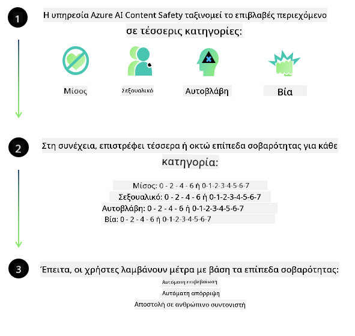
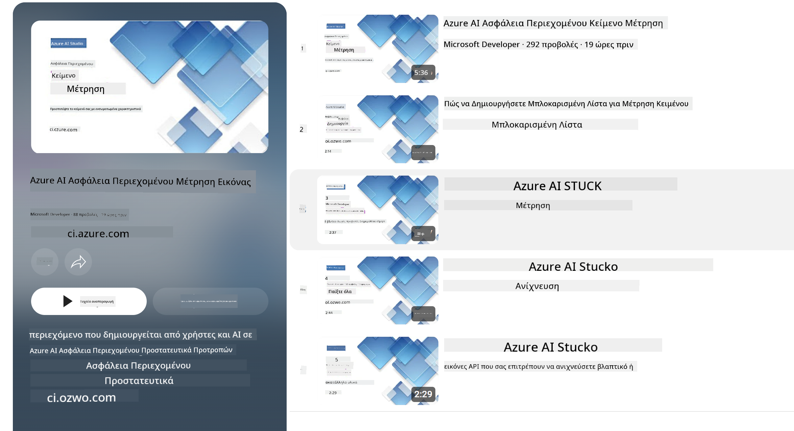

<!--
CO_OP_TRANSLATOR_METADATA:
{
  "original_hash": "c8273672cc57df2be675407a1383aaf0",
  "translation_date": "2025-05-09T06:00:14+00:00",
  "source_file": "md/01.Introduction/01/01.AISafety.md",
  "language_code": "el"
}
-->
# Ασφάλεια AI για τα μοντέλα Phi  
Η οικογένεια μοντέλων Phi αναπτύχθηκε σύμφωνα με το [Microsoft Responsible AI Standard](https://query.prod.cms.rt.microsoft.com/cms/api/am/binary/RE5cmFl), που αποτελεί ένα εταιρικό σύνολο απαιτήσεων βασισμένο σε έξι αρχές: υπευθυνότητα, διαφάνεια, δικαιοσύνη, αξιοπιστία και ασφάλεια, ιδιωτικότητα και ασφάλεια, και συμπερίληψη, που σχηματίζουν τις [Αρχές Υπεύθυνης Τεχνητής Νοημοσύνης της Microsoft](https://www.microsoft.com/ai/responsible-ai).

Όπως και στα προηγούμενα μοντέλα Phi, υιοθετήθηκε μια πολυδιάστατη προσέγγιση αξιολόγησης ασφάλειας και μετά-εκπαίδευσης για την ασφάλεια, με πρόσθετα μέτρα που λαμβάνουν υπόψη τις πολυγλωσσικές δυνατότητες αυτής της έκδοσης. Η προσέγγισή μας στην εκπαίδευση και αξιολόγηση ασφάλειας, συμπεριλαμβανομένων των δοκιμών σε πολλές γλώσσες και κατηγορίες κινδύνου, περιγράφεται στο [Phi Safety Post-Training Paper](https://arxiv.org/abs/2407.13833). Παρόλο που τα μοντέλα Phi ωφελούνται από αυτήν την προσέγγιση, οι προγραμματιστές θα πρέπει να εφαρμόζουν τις βέλτιστες πρακτικές υπεύθυνης AI, συμπεριλαμβανομένου του εντοπισμού, της μέτρησης και της μείωσης των κινδύνων που σχετίζονται με την ειδική περίπτωση χρήσης τους και το πολιτισμικό και γλωσσικό πλαίσιο.

## Καλύτερες Πρακτικές  

Όπως και άλλα μοντέλα, η οικογένεια μοντέλων Phi μπορεί ενδεχομένως να συμπεριφερθεί με τρόπους που είναι άδικοι, αναξιόπιστοι ή προσβλητικοί.

Κάποιες από τις περιοριστικές συμπεριφορές των SLM και LLM που πρέπει να γνωρίζετε περιλαμβάνουν:

- **Ποιότητα Υπηρεσίας:** Τα μοντέλα Phi εκπαιδεύονται κυρίως σε αγγλικό κείμενο. Οι γλώσσες εκτός των αγγλικών θα παρουσιάζουν χειρότερη απόδοση. Οι ποικιλίες της αγγλικής γλώσσας με λιγότερη εκπροσώπηση στα δεδομένα εκπαίδευσης μπορεί να έχουν χειρότερη απόδοση σε σχέση με την τυπική αμερικανική αγγλική.
- **Αντιπροσώπευση Βλαβών & Εδραίωση Στερεοτύπων:** Αυτά τα μοντέλα μπορεί να υπερεκπροσωπούν ή να υποεκπροσωπούν ομάδες ανθρώπων, να διαγράφουν την εκπροσώπηση ορισμένων ομάδων ή να ενισχύουν υποτιμητικά ή αρνητικά στερεότυπα. Παρά την μετά-εκπαίδευση ασφάλειας, αυτοί οι περιορισμοί μπορεί να παραμένουν λόγω διαφορετικών επιπέδων εκπροσώπησης των ομάδων ή της παρουσίας παραδειγμάτων αρνητικών στερεοτύπων στα δεδομένα εκπαίδευσης που αντικατοπτρίζουν πραγματικά πρότυπα και κοινωνικές προκαταλήψεις.
- **Ακατάλληλο ή Προσβλητικό Περιεχόμενο:** Αυτά τα μοντέλα μπορεί να παράγουν και άλλους τύπους ακατάλληλου ή προσβλητικού περιεχομένου, που μπορεί να καθιστούν την χρήση τους ακατάλληλη σε ευαίσθητα περιβάλλοντα χωρίς επιπλέον μέτρα που να είναι ειδικά για την περίπτωση χρήσης.
- **Αξιοπιστία Πληροφοριών:** Τα γλωσσικά μοντέλα μπορεί να δημιουργήσουν ανοησίες ή να επινοήσουν περιεχόμενο που ακούγεται λογικό αλλά είναι ανακριβές ή παρωχημένο.
- **Περιορισμένο Πεδίο για Κώδικα:** Το μεγαλύτερο μέρος των δεδομένων εκπαίδευσης του Phi-3 βασίζεται σε Python και χρησιμοποιεί κοινά πακέτα όπως "typing, math, random, collections, datetime, itertools". Αν το μοντέλο παράγει Python scripts που χρησιμοποιούν άλλα πακέτα ή σενάρια σε άλλες γλώσσες, συνιστούμε έντονα στους χρήστες να επαληθεύουν χειροκίνητα όλες τις χρήσεις API.

Οι προγραμματιστές θα πρέπει να εφαρμόζουν τις βέλτιστες πρακτικές υπεύθυνης AI και είναι υπεύθυνοι να διασφαλίζουν ότι μια συγκεκριμένη περίπτωση χρήσης συμμορφώνεται με τους σχετικούς νόμους και κανονισμούς (π.χ. ιδιωτικότητα, εμπόριο κ.ά.).

## Σκέψεις για την Υπεύθυνη AI  

Όπως και άλλα γλωσσικά μοντέλα, τα μοντέλα της σειράς Phi μπορεί να συμπεριφερθούν με τρόπους που είναι άδικοι, αναξιόπιστοι ή προσβλητικοί. Κάποιες από τις περιοριστικές συμπεριφορές που πρέπει να γνωρίζετε περιλαμβάνουν:

**Ποιότητα Υπηρεσίας:** Τα μοντέλα Phi εκπαιδεύονται κυρίως σε αγγλικό κείμενο. Οι γλώσσες εκτός των αγγλικών θα παρουσιάζουν χειρότερη απόδοση. Οι ποικιλίες της αγγλικής γλώσσας με λιγότερη εκπροσώπηση στα δεδομένα εκπαίδευσης μπορεί να έχουν χειρότερη απόδοση σε σχέση με την τυπική αμερικανική αγγλική.

**Αντιπροσώπευση Βλαβών & Εδραίωση Στερεοτύπων:** Αυτά τα μοντέλα μπορεί να υπερεκπροσωπούν ή να υποεκπροσωπούν ομάδες ανθρώπων, να διαγράφουν την εκπροσώπηση ορισμένων ομάδων ή να ενισχύουν υποτιμητικά ή αρνητικά στερεότυπα. Παρά την μετά-εκπαίδευση ασφάλειας, αυτοί οι περιορισμοί μπορεί να παραμένουν λόγω διαφορετικών επιπέδων εκπροσώπησης των ομάδων ή της παρουσίας παραδειγμάτων αρνητικών στερεοτύπων στα δεδομένα εκπαίδευσης που αντικατοπτρίζουν πραγματικά πρότυπα και κοινωνικές προκαταλήψεις.

**Ακατάλληλο ή Προσβλητικό Περιεχόμενο:** Αυτά τα μοντέλα μπορεί να παράγουν και άλλους τύπους ακατάλληλου ή προσβλητικού περιεχομένου, που μπορεί να καθιστούν την χρήση τους ακατάλληλη σε ευαίσθητα περιβάλλοντα χωρίς επιπλέον μέτρα που να είναι ειδικά για την περίπτωση χρήσης.  
Αξιοπιστία Πληροφοριών: Τα γλωσσικά μοντέλα μπορεί να δημιουργήσουν ανοησίες ή να επινοήσουν περιεχόμενο που ακούγεται λογικό αλλά είναι ανακριβές ή παρωχημένο.

**Περιορισμένο Πεδίο για Κώδικα:** Το μεγαλύτερο μέρος των δεδομένων εκπαίδευσης του Phi-3 βασίζεται σε Python και χρησιμοποιεί κοινά πακέτα όπως "typing, math, random, collections, datetime, itertools". Αν το μοντέλο παράγει Python scripts που χρησιμοποιούν άλλα πακέτα ή σενάρια σε άλλες γλώσσες, συνιστούμε έντονα στους χρήστες να επαληθεύουν χειροκίνητα όλες τις χρήσεις API.

Οι προγραμματιστές θα πρέπει να εφαρμόζουν τις βέλτιστες πρακτικές υπεύθυνης AI και είναι υπεύθυνοι να διασφαλίζουν ότι μια συγκεκριμένη περίπτωση χρήσης συμμορφώνεται με τους σχετικούς νόμους και κανονισμούς (π.χ. ιδιωτικότητα, εμπόριο κ.ά.). Σημαντικοί τομείς προς εξέταση περιλαμβάνουν:

**Κατανομή:** Τα μοντέλα μπορεί να μην είναι κατάλληλα για σενάρια που θα μπορούσαν να έχουν σημαντική επίπτωση σε νομική κατάσταση ή στην κατανομή πόρων ή ευκαιριών ζωής (π.χ. στέγαση, απασχόληση, πίστωση κ.ά.) χωρίς περαιτέρω αξιολογήσεις και επιπλέον τεχνικές απο-προκατάληψης.

**Σενάρια Υψηλού Κινδύνου:** Οι προγραμματιστές θα πρέπει να αξιολογούν την καταλληλότητα της χρήσης μοντέλων σε σενάρια υψηλού κινδύνου όπου τα άδικα, αναξιόπιστα ή προσβλητικά αποτελέσματα μπορεί να είναι ιδιαίτερα κοστοβόρα ή να προκαλέσουν βλάβη. Αυτό περιλαμβάνει την παροχή συμβουλών σε ευαίσθητους ή εξειδικευμένους τομείς όπου η ακρίβεια και αξιοπιστία είναι κρίσιμες (π.χ. νομικές ή ιατρικές συμβουλές). Θα πρέπει να εφαρμοστούν επιπλέον μέτρα ασφαλείας σε επίπεδο εφαρμογής ανάλογα με το πλαίσιο ανάπτυξης.

**Παραπληροφόρηση:** Τα μοντέλα μπορεί να παράγουν ανακριβείς πληροφορίες. Οι προγραμματιστές θα πρέπει να ακολουθούν τις βέλτιστες πρακτικές διαφάνειας και να ενημερώνουν τους τελικούς χρήστες ότι αλληλεπιδρούν με ένα σύστημα AI. Σε επίπεδο εφαρμογής, οι προγραμματιστές μπορούν να δημιουργήσουν μηχανισμούς ανατροφοδότησης και ροές εργασίας που στηρίζουν τις απαντήσεις σε συγκεκριμένες, σχετικές με την περίπτωση χρήσης πληροφορίες, μια τεχνική γνωστή ως Retrieval Augmented Generation (RAG).

**Παραγωγή Επιβλαβούς Περιεχομένου:** Οι προγραμματιστές θα πρέπει να αξιολογούν τα αποτελέσματα στο πλαίσιο χρήσης τους και να χρησιμοποιούν διαθέσιμους ταξινομητές ασφάλειας ή προσαρμοσμένες λύσεις κατάλληλες για την περίπτωση χρήσης.

**Κακή Χρήση:** Άλλες μορφές κακής χρήσης, όπως απάτη, ανεπιθύμητη αλληλογραφία ή παραγωγή κακόβουλου λογισμικού, μπορεί να είναι δυνατές, και οι προγραμματιστές θα πρέπει να διασφαλίζουν ότι οι εφαρμογές τους δεν παραβιάζουν τους ισχύοντες νόμους και κανονισμούς.

### Εξατομίκευση και Ασφάλεια Περιεχομένου AI  

Μετά την εξατομίκευση ενός μοντέλου, συνιστούμε ανεπιφύλακτα τη χρήση των μέτρων [Azure AI Content Safety](https://learn.microsoft.com/azure/ai-services/content-safety/overview) για την παρακολούθηση του περιεχομένου που παράγουν τα μοντέλα, την αναγνώριση και τον αποκλεισμό πιθανών κινδύνων, απειλών και θεμάτων ποιότητας.

Το [Azure AI Content Safety](https://learn.microsoft.com/azure/ai-services/content-safety/overview) υποστηρίζει τόσο κείμενο όσο και εικόνες. Μπορεί να αναπτυχθεί στο cloud, σε αποσυνδεδεμένα containers και σε edge/ενσωματωμένες συσκευές.

## Επισκόπηση του Azure AI Content Safety  

Το Azure AI Content Safety δεν είναι λύση τύπου «ένα μέγεθος για όλους»· μπορεί να προσαρμοστεί ώστε να ευθυγραμμίζεται με τις συγκεκριμένες πολιτικές των επιχειρήσεων. Επιπλέον, τα πολυγλωσσικά μοντέλα του επιτρέπουν την κατανόηση πολλών γλωσσών ταυτόχρονα.

- **Azure AI Content Safety**  
- **Microsoft Developer**  
- **5 βίντεο**

Η υπηρεσία Azure AI Content Safety ανιχνεύει επιβλαβές περιεχόμενο που δημιουργείται από χρήστες και AI σε εφαρμογές και υπηρεσίες. Περιλαμβάνει API για κείμενο και εικόνα που επιτρέπουν την ανίχνευση επιβλαβούς ή ακατάλληλου υλικού.

[AI Content Safety Playlist](https://www.youtube.com/playlist?list=PLlrxD0HtieHjaQ9bJjyp1T7FeCbmVcPkQ)

**Αποποίηση ευθυνών**:  
Αυτό το έγγραφο έχει μεταφραστεί χρησιμοποιώντας την υπηρεσία αυτόματης μετάφρασης AI [Co-op Translator](https://github.com/Azure/co-op-translator). Παρόλο που προσπαθούμε για ακρίβεια, παρακαλούμε να έχετε υπόψη ότι οι αυτόματες μεταφράσεις ενδέχεται να περιέχουν λάθη ή ανακρίβειες. Το πρωτότυπο έγγραφο στη γλώσσα του πρέπει να θεωρείται η επίσημη πηγή. Για κρίσιμες πληροφορίες, συνιστάται επαγγελματική μετάφραση από άνθρωπο. Δεν φέρουμε ευθύνη για τυχόν παρεξηγήσεις ή λανθασμένες ερμηνείες που προκύπτουν από τη χρήση αυτής της μετάφρασης.