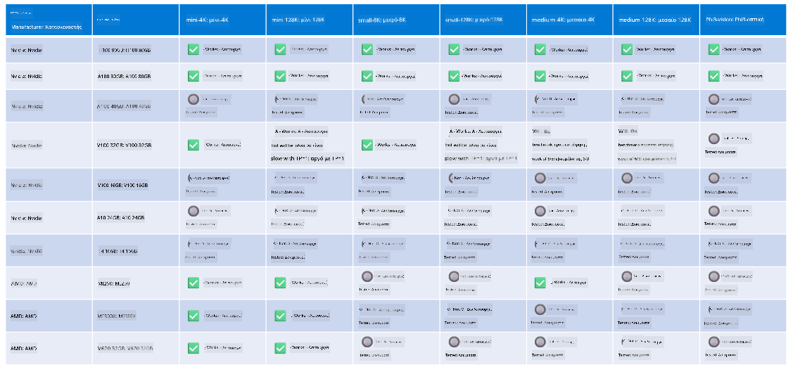

<!--
CO_OP_TRANSLATOR_METADATA:
{
  "original_hash": "8cdc17ce0f10535da30b53d23fe1a795",
  "translation_date": "2025-05-09T07:49:31+00:00",
  "source_file": "md/01.Introduction/01/01.Hardwaresupport.md",
  "language_code": "el"
}
-->
# Υποστήριξη Υλικού Phi

Το Microsoft Phi έχει βελτιστοποιηθεί για το ONNX Runtime και υποστηρίζει το Windows DirectML. Λειτουργεί καλά σε διάφορους τύπους υλικού, συμπεριλαμβανομένων GPU, CPU και ακόμη και κινητών συσκευών.

## Υλικό Συσκευής  
Συγκεκριμένα, το υποστηριζόμενο υλικό περιλαμβάνει:

- GPU SKU: RTX 4090 (DirectML)
- GPU SKU: 1 A100 80GB (CUDA)
- CPU SKU: Standard F64s v2 (64 vCPUs, 128 GiB μνήμη)

## Mobile SKU

- Android - Samsung Galaxy S21  
- Apple iPhone 14 ή νεότερο με επεξεργαστή A16/A17

## Προδιαγραφές Υλικού Phi

- Ελάχιστη Απαιτούμενη Διαμόρφωση.  
- Windows: GPU με υποστήριξη DirectX 12 και τουλάχιστον 4GB συνολικής RAM  

CUDA: NVIDIA GPU με Compute Capability >= 7.02



## Εκτέλεση onnxruntime σε πολλαπλές GPUs

Τα διαθέσιμα μοντέλα Phi ONNX προς το παρόν υποστηρίζουν μόνο 1 GPU. Υπάρχει η δυνατότητα υποστήριξης multi-gpu για μοντέλα Phi, αλλά το ORT με 2 GPU δεν εγγυάται μεγαλύτερο throughput σε σχέση με 2 ξεχωριστές instances του ort. Παρακαλούμε δείτε το [ONNX Runtime](https://onnxruntime.ai/) για τις τελευταίες ενημερώσεις.

Στο [Build 2024 the GenAI ONNX Team](https://youtu.be/WLW4SE8M9i8?si=EtG04UwDvcjunyfC) ανακοίνωσαν ότι ενεργοποίησαν multi-instance αντί για multi-gpu για τα μοντέλα Phi.

Προς το παρόν, αυτό σας επιτρέπει να τρέχετε μία instance του onnxruntime ή onnxruntime-genai με τη μεταβλητή περιβάλλοντος CUDA_VISIBLE_DEVICES ως εξής.

```Python
CUDA_VISIBLE_DEVICES=0 python infer.py
CUDA_VISIBLE_DEVICES=1 python infer.py
```

Μη διστάσετε να εξερευνήσετε περαιτέρω το Phi στο [Azure AI Foundry](https://ai.azure.com)

**Αποποίηση ευθυνών**:  
Αυτό το έγγραφο έχει μεταφραστεί χρησιμοποιώντας την υπηρεσία αυτόματης μετάφρασης AI [Co-op Translator](https://github.com/Azure/co-op-translator). Παρόλο που προσπαθούμε για ακρίβεια, παρακαλούμε να έχετε υπόψη ότι οι αυτοματοποιημένες μεταφράσεις ενδέχεται να περιέχουν σφάλματα ή ανακρίβειες. Το πρωτότυπο έγγραφο στη μητρική του γλώσσα πρέπει να θεωρείται η επίσημη πηγή. Για κρίσιμες πληροφορίες, συνιστάται επαγγελματική ανθρώπινη μετάφραση. Δεν φέρουμε ευθύνη για τυχόν παρεξηγήσεις ή λανθασμένες ερμηνείες που προκύπτουν από τη χρήση αυτής της μετάφρασης.