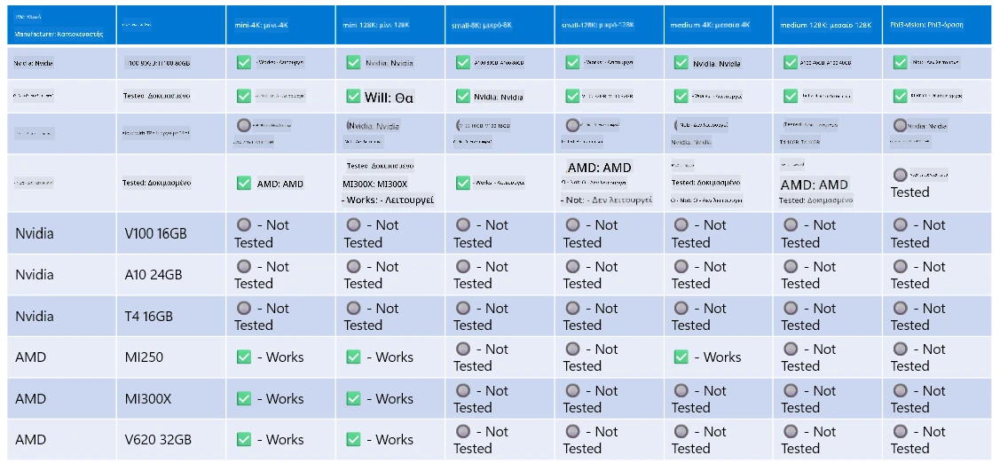

# Υποστήριξη Υλικού Phi

Το Microsoft Phi έχει βελτιστοποιηθεί για το ONNX Runtime και υποστηρίζει το Windows DirectML. Λειτουργεί άψογα σε διάφορους τύπους υλικού, συμπεριλαμβανομένων GPUs, CPUs και ακόμη και κινητών συσκευών.

## Υλικό Συσκευής  
Συγκεκριμένα, το υποστηριζόμενο υλικό περιλαμβάνει:

- GPU SKU: RTX 4090 (DirectML)
- GPU SKU: 1 A100 80GB (CUDA)
- CPU SKU: Standard F64s v2 (64 vCPUs, 128 GiB μνήμη)

## Mobile SKU

- Android - Samsung Galaxy S21  
- Apple iPhone 14 ή νεότερο με επεξεργαστή A16/A17

## Προδιαγραφές Υλικού Phi

- Ελάχιστη απαιτούμενη διαμόρφωση.  
- Windows: GPU με υποστήριξη DirectX 12 και τουλάχιστον 4GB συνδυασμένης RAM

CUDA: NVIDIA GPU με Compute Capability >= 7.02



## Εκτέλεση onnxruntime σε πολλαπλές GPUs

Τα διαθέσιμα μοντέλα Phi ONNX προς το παρόν υποστηρίζουν μόνο 1 GPU. Υπάρχει δυνατότητα υποστήριξης multi-gpu για μοντέλα Phi, αλλά το ORT με 2 GPUs δεν εγγυάται μεγαλύτερη απόδοση σε σχέση με 2 ξεχωριστές περιπτώσεις του ort. Παρακαλούμε δείτε το [ONNX Runtime](https://onnxruntime.ai/) για τις πιο πρόσφατες ενημερώσεις.

Στο [Build 2024 η ομάδα GenAI ONNX](https://youtu.be/WLW4SE8M9i8?si=EtG04UwDvcjunyfC) ανακοίνωσε ότι ενεργοποίησαν multi-instance αντί για multi-gpu για τα μοντέλα Phi.

Προς το παρόν, αυτό σας επιτρέπει να τρέξετε μία περίπτωση onnxruntime ή onnxruntime-genai με τη μεταβλητή περιβάλλοντος CUDA_VISIBLE_DEVICES ως εξής.

```Python
CUDA_VISIBLE_DEVICES=0 python infer.py
CUDA_VISIBLE_DEVICES=1 python infer.py
```

Μη διστάσετε να εξερευνήσετε περαιτέρω το Phi στο [Azure AI Foundry](https://ai.azure.com)

**Αποποίηση ευθυνών**:  
Αυτό το έγγραφο έχει μεταφραστεί χρησιμοποιώντας την υπηρεσία αυτόματης μετάφρασης AI [Co-op Translator](https://github.com/Azure/co-op-translator). Παρόλο που επιδιώκουμε την ακρίβεια, παρακαλούμε να γνωρίζετε ότι οι αυτόματες μεταφράσεις ενδέχεται να περιέχουν λάθη ή ανακρίβειες. Το πρωτότυπο έγγραφο στη γλώσσα του θεωρείται η αυθεντική πηγή. Για κρίσιμες πληροφορίες, συνιστάται επαγγελματική ανθρώπινη μετάφραση. Δεν φέρουμε ευθύνη για τυχόν παρεξηγήσεις ή λανθασμένες ερμηνείες που προκύπτουν από τη χρήση αυτής της μετάφρασης.