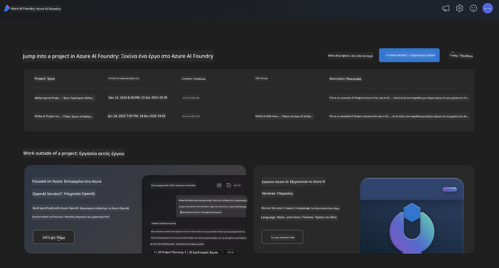
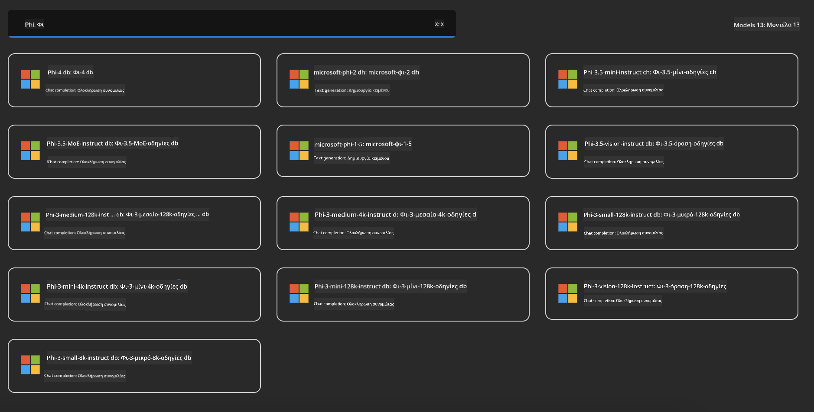
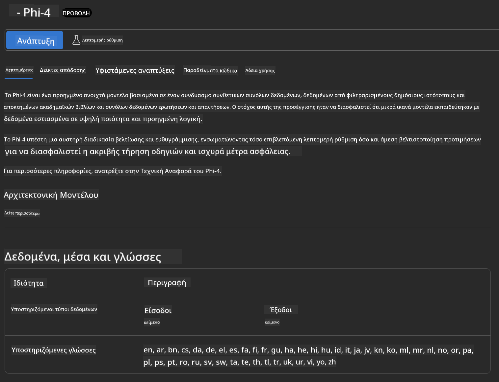
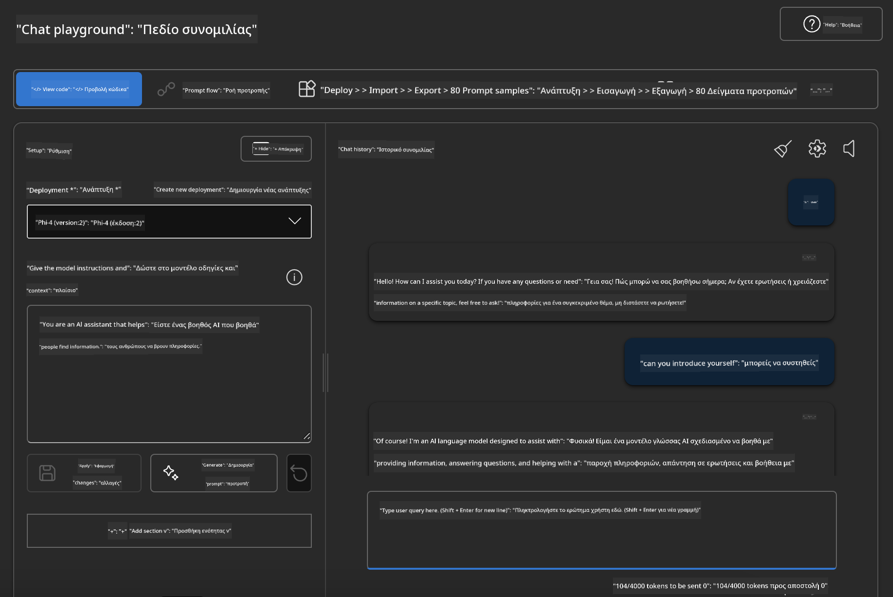

<!--
CO_OP_TRANSLATOR_METADATA:
{
  "original_hash": "3ae21dc5554e888defbe57946ee995ee",
  "translation_date": "2025-07-16T19:09:17+00:00",
  "source_file": "md/01.Introduction/02/03.AzureAIFoundry.md",
  "language_code": "el"
}
-->
## Οικογένεια Phi στο Azure AI Foundry

[Azure AI Foundry](https://ai.azure.com) είναι μια αξιόπιστη πλατφόρμα που δίνει τη δυνατότητα στους προγραμματιστές να προωθήσουν την καινοτομία και να διαμορφώσουν το μέλλον με την τεχνητή νοημοσύνη με ασφαλή, αξιόπιστο και υπεύθυνο τρόπο.

[Azure AI Foundry](https://ai.azure.com) έχει σχεδιαστεί για προγραμματιστές ώστε να:

- Δημιουργούν εφαρμογές γεννητικής τεχνητής νοημοσύνης σε μια πλατφόρμα επιχειρησιακού επιπέδου.
- Εξερευνούν, δημιουργούν, δοκιμάζουν και αναπτύσσουν χρησιμοποιώντας προηγμένα εργαλεία AI και μοντέλα ML, βασισμένα σε υπεύθυνες πρακτικές AI.
- Συνεργάζονται με μια ομάδα για ολόκληρο τον κύκλο ζωής ανάπτυξης εφαρμογών.

Με το Azure AI Foundry, μπορείτε να εξερευνήσετε μια μεγάλη ποικιλία μοντέλων, υπηρεσιών και δυνατοτήτων, και να ξεκινήσετε να δημιουργείτε εφαρμογές AI που εξυπηρετούν καλύτερα τους στόχους σας. Η πλατφόρμα Azure AI Foundry διευκολύνει την κλιμάκωση για τη μετατροπή αποδείξεων έννοιας σε πλήρως ανεπτυγμένες παραγωγικές εφαρμογές με ευκολία. Η συνεχής παρακολούθηση και βελτίωση υποστηρίζουν τη μακροπρόθεσμη επιτυχία.



Εκτός από τη χρήση της υπηρεσίας Azure AOAI στο Azure AI Foundry, μπορείτε επίσης να χρησιμοποιήσετε μοντέλα τρίτων στο Κατάλογο Μοντέλων του Azure AI Foundry. Αυτή είναι μια καλή επιλογή αν θέλετε να χρησιμοποιήσετε το Azure AI Foundry ως την πλατφόρμα λύσεων AI σας.

Μπορούμε να αναπτύξουμε γρήγορα τα Μοντέλα της Οικογένειας Phi μέσω του Καταλόγου Μοντέλων στο Azure AI Foundry

[Microsoft Phi Models in Azure AI Foundry Models](https://ai.azure.com/explore/models/?selectedCollection=phi)



### **Ανάπτυξη Phi-4 στο Azure AI Foundry**



### **Δοκιμή Phi-4 στο Azure AI Foundry Playground**



### **Εκτέλεση Python κώδικα για κλήση του Azure AI Foundry Phi-4**

```python

import os  
import base64
from openai import AzureOpenAI  
from azure.identity import DefaultAzureCredential, get_bearer_token_provider  
        
endpoint = os.getenv("ENDPOINT_URL", "Your Azure AOAI Service Endpoint")  
deployment = os.getenv("DEPLOYMENT_NAME", "Phi-4")  
      
token_provider = get_bearer_token_provider(  
    DefaultAzureCredential(),  
    "https://cognitiveservices.azure.com/.default"  
)  
  
client = AzureOpenAI(  
    azure_endpoint=endpoint,  
    azure_ad_token_provider=token_provider,  
    api_version="2024-05-01-preview",  
)  
  

chat_prompt = [
    {
        "role": "system",
        "content": "You are an AI assistant that helps people find information."
    },
    {
        "role": "user",
        "content": "can you introduce yourself"
    }
] 
    
# Include speech result if speech is enabled  
messages = chat_prompt 

completion = client.chat.completions.create(  
    model=deployment,  
    messages=messages,
    max_tokens=800,  
    temperature=0.7,  
    top_p=0.95,  
    frequency_penalty=0,  
    presence_penalty=0,
    stop=None,  
    stream=False  
)  
  
print(completion.to_json())  

```

**Αποποίηση ευθυνών**:  
Αυτό το έγγραφο έχει μεταφραστεί χρησιμοποιώντας την υπηρεσία αυτόματης μετάφρασης AI [Co-op Translator](https://github.com/Azure/co-op-translator). Παρόλο που επιδιώκουμε την ακρίβεια, παρακαλούμε να γνωρίζετε ότι οι αυτόματες μεταφράσεις ενδέχεται να περιέχουν λάθη ή ανακρίβειες. Το πρωτότυπο έγγραφο στη γλώσσα του θεωρείται η αυθεντική πηγή. Για κρίσιμες πληροφορίες, συνιστάται επαγγελματική ανθρώπινη μετάφραση. Δεν φέρουμε ευθύνη για τυχόν παρεξηγήσεις ή λανθασμένες ερμηνείες που προκύπτουν από τη χρήση αυτής της μετάφρασης.