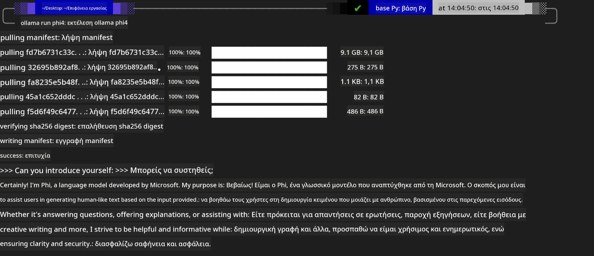
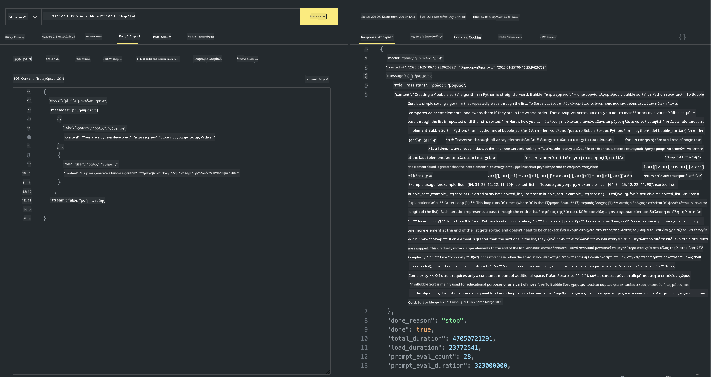

<!--
CO_OP_TRANSLATOR_METADATA:
{
  "original_hash": "0b38834693bb497f96bf53f0d941f9a1",
  "translation_date": "2025-07-16T19:16:06+00:00",
  "source_file": "md/01.Introduction/02/04.Ollama.md",
  "language_code": "el"
}
-->
## Οικογένεια Phi στο Ollama


Το [Ollama](https://ollama.com) επιτρέπει σε περισσότερους ανθρώπους να αναπτύξουν απευθείας ανοιχτού κώδικα LLM ή SLM μέσω απλών σεναρίων, και μπορεί επίσης να δημιουργήσει APIs για να βοηθήσει σε τοπικά σενάρια εφαρμογών Copilot.

## **1. Εγκατάσταση**

Το Ollama υποστηρίζει λειτουργία σε Windows, macOS και Linux. Μπορείτε να εγκαταστήσετε το Ollama μέσω αυτού του συνδέσμου ([https://ollama.com/download](https://ollama.com/download)). Μετά την επιτυχή εγκατάσταση, μπορείτε να χρησιμοποιήσετε απευθείας το σενάριο Ollama για να καλέσετε το Phi-3 μέσω ενός τερματικού. Μπορείτε να δείτε όλες τις [διαθέσιμες βιβλιοθήκες στο Ollama](https://ollama.com/library). Αν ανοίξετε αυτό το αποθετήριο σε Codespace, το Ollama θα είναι ήδη εγκατεστημένο.

```bash

ollama run phi4

```

> [!NOTE]
> Το μοντέλο θα κατέβει την πρώτη φορά που το τρέχετε. Φυσικά, μπορείτε επίσης να καθορίσετε απευθείας το κατεβασμένο μοντέλο Phi-4. Παίρνουμε το WSL ως παράδειγμα για να τρέξουμε την εντολή. Αφού το μοντέλο κατέβει επιτυχώς, μπορείτε να αλληλεπιδράσετε απευθείας από το τερματικό.



## **2. Κλήση του phi-4 API από το Ollama**

Αν θέλετε να καλέσετε το Phi-4 API που δημιουργείται από το ollama, μπορείτε να χρησιμοποιήσετε αυτή την εντολή στο τερματικό για να ξεκινήσετε τον server του Ollama.

```bash

ollama serve

```

> [!NOTE]
> Αν τρέχετε σε MacOS ή Linux, σημειώστε ότι μπορεί να συναντήσετε το παρακάτω σφάλμα **"Error: listen tcp 127.0.0.1:11434: bind: address already in use"**. Μπορεί να εμφανιστεί αυτό το σφάλμα όταν τρέχετε την εντολή. Μπορείτε είτε να το αγνοήσετε, καθώς συνήθως σημαίνει ότι ο server τρέχει ήδη, είτε να σταματήσετε και να επανεκκινήσετε το Ollama:

**macOS**

```bash

brew services restart ollama

```

**Linux**

```bash

sudo systemctl stop ollama

```

Το Ollama υποστηρίζει δύο API: generate και chat. Μπορείτε να καλέσετε το API του μοντέλου που παρέχει το Ollama ανάλογα με τις ανάγκες σας, στέλνοντας αιτήματα στην τοπική υπηρεσία που τρέχει στην πόρτα 11434.

**Chat**

```bash

curl http://127.0.0.1:11434/api/chat -d '{
  "model": "phi3",
  "messages": [
    {
      "role": "system",
      "content": "Your are a python developer."
    },
    {
      "role": "user",
      "content": "Help me generate a bubble algorithm"
    }
  ],
  "stream": false
  
}'

This is the result in Postman



## Additional Resources

Check the list of available models in Ollama in [their library](https://ollama.com/library).

Pull your model from the Ollama server using this command

```bash
ollama pull phi4
```

Run the model using this command

```bash
ollama run phi4
```

***Note:*** Visit this link [https://github.com/ollama/ollama/blob/main/docs/api.md](https://github.com/ollama/ollama/blob/main/docs/api.md) to learn more

## Calling Ollama from Python

You can use `requests` or `urllib3` to make requests to the local server endpoints used above. However, a popular way to use Ollama in Python is via the [openai](https://pypi.org/project/openai/) SDK, since Ollama provides OpenAI-compatible server endpoints as well.

Here is an example for phi3-mini:

```python
import openai

client = openai.OpenAI(
    base_url="http://localhost:11434/v1",
    api_key="nokeyneeded",
)

response = client.chat.completions.create(
    model="phi4",
    temperature=0.7,
    n=1,
    messages=[
        {"role": "system", "content": "Είσαι ένας βοηθητικός βοηθός."},
        {"role": "user", "content": "Γράψε ένα χαϊκού για μια πεινασμένη γάτα"},
    ],
)

print("Απάντηση:")
print(response.choices[0].message.content)
```

## Calling Ollama from JavaScript 

```javascript
// Παράδειγμα σύνοψης αρχείου με Phi-4
script({
    model: "ollama:phi4",
    title: "Σύνοψη με Phi-4",
    system: ["system"],
})

// Παράδειγμα σύνοψης
const file = def("FILE", env.files)
$`Σύνοψη του ${file} σε μία παράγραφο.`
```

## Calling Ollama from C#

Create a new C# Console application and add the following NuGet package:

```bash
dotnet add package Microsoft.SemanticKernel --version 1.34.0
```

Then replace this code in the `Program.cs` file

```csharp
using Microsoft.SemanticKernel;
using Microsoft.SemanticKernel.ChatCompletion;

// προσθήκη υπηρεσίας chat completion χρησιμοποιώντας το τοπικό endpoint του ollama server
#pragma warning disable SKEXP0001, SKEXP0003, SKEXP0010, SKEXP0011, SKEXP0050, SKEXP0052
builder.AddOpenAIChatCompletion(
    modelId: "phi4",
    endpoint: new Uri("http://localhost:11434/"),
    apiKey: "non required");

// εκτέλεση απλού prompt στην υπηρεσία chat
string prompt = "Γράψε ένα αστείο για γατάκια";
var response = await kernel.InvokePromptAsync(prompt);
Console.WriteLine(response.GetValue<string>());
```

Run the app with the command:

```bash
dotnet run

**Αποποίηση ευθυνών**:  
Αυτό το έγγραφο έχει μεταφραστεί χρησιμοποιώντας την υπηρεσία αυτόματης μετάφρασης AI [Co-op Translator](https://github.com/Azure/co-op-translator). Παρόλο που επιδιώκουμε την ακρίβεια, παρακαλούμε να έχετε υπόψη ότι οι αυτόματες μεταφράσεις ενδέχεται να περιέχουν λάθη ή ανακρίβειες. Το πρωτότυπο έγγραφο στη γλώσσα του θεωρείται η αυθεντική πηγή. Για κρίσιμες πληροφορίες, συνιστάται επαγγελματική ανθρώπινη μετάφραση. Δεν φέρουμε ευθύνη για τυχόν παρεξηγήσεις ή λανθασμένες ερμηνείες που προκύπτουν από τη χρήση αυτής της μετάφρασης.