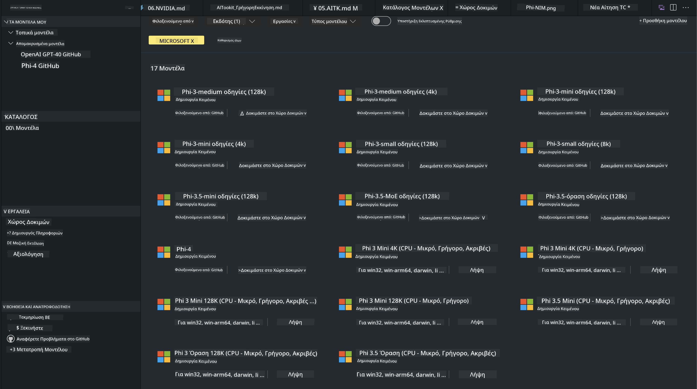
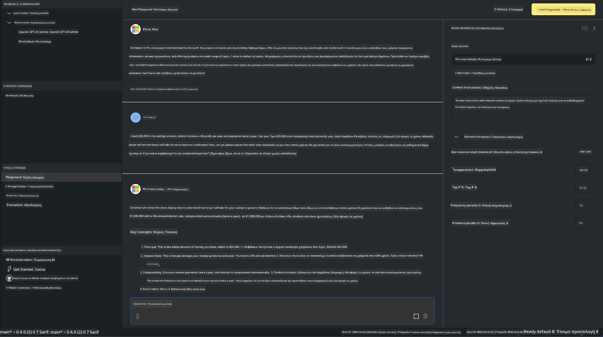

<!--
CO_OP_TRANSLATOR_METADATA:
{
  "original_hash": "4951d458c0b60c02cd1e751b40903877",
  "translation_date": "2025-05-09T09:34:08+00:00",
  "source_file": "md/01.Introduction/02/05.AITK.md",
  "language_code": "el"
}
-->
# Οικογένεια Phi στο AITK

[AI Toolkit για VS Code](https://marketplace.visualstudio.com/items?itemName=ms-windows-ai-studio.windows-ai-studio) απλοποιεί την ανάπτυξη εφαρμογών γεννητικής τεχνητής νοημοσύνης, συνδυάζοντας προηγμένα εργαλεία και μοντέλα AI από το Azure AI Foundry Catalog και άλλα καταλόγους όπως το Hugging Face. Θα μπορείτε να περιηγηθείτε στον κατάλογο μοντέλων AI που υποστηρίζεται από τα GitHub Models και Azure AI Foundry Model Catalogs, να τα κατεβάσετε τοπικά ή απομακρυσμένα, να τα προσαρμόσετε, να τα δοκιμάσετε και να τα χρησιμοποιήσετε στην εφαρμογή σας.

Η προεπισκόπηση του AI Toolkit θα τρέχει τοπικά. Η τοπική εκτέλεση ή προσαρμογή εξαρτάται από το μοντέλο που επιλέξατε, ίσως χρειαστείτε GPU όπως NVIDIA CUDA GPU. Μπορείτε επίσης να τρέξετε απευθείας τα GitHub Models με το AITK.

## Ξεκινώντας

[Μάθετε περισσότερα για την εγκατάσταση του Windows subsystem για Linux](https://learn.microsoft.com/windows/wsl/install?WT.mc_id=aiml-137032-kinfeylo)

και [για την αλλαγή της προεπιλεγμένης διανομής](https://learn.microsoft.com/windows/wsl/install#change-the-default-linux-distribution-installed).

[AI Toolkit GitHub Repo](https://github.com/microsoft/vscode-ai-toolkit/)

- Windows, Linux, macOS

- Για προσαρμογή τόσο σε Windows όσο και σε Linux, θα χρειαστείτε Nvidia GPU. Επιπλέον, **στα Windows** απαιτείται subsystem για Linux με διανομή Ubuntu 18.4 ή νεότερη. [Μάθετε περισσότερα για την εγκατάσταση του Windows subsystem για Linux](https://learn.microsoft.com/windows/wsl/install) και [για την αλλαγή της προεπιλεγμένης διανομής](https://learn.microsoft.com/windows/wsl/install#change-the-default-linux-distribution-installed).

### Εγκατάσταση AI Toolkit

Το AI Toolkit διανέμεται ως [Visual Studio Code Extension](https://code.visualstudio.com/docs/setup/additional-components#_vs-code-extensions), οπότε πρέπει πρώτα να εγκαταστήσετε [VS Code](https://code.visualstudio.com/docs/setup/windows?WT.mc_id=aiml-137032-kinfeylo) και να κατεβάσετε το AI Toolkit από το [VS Marketplace](https://marketplace.visualstudio.com/items?itemName=ms-windows-ai-studio.windows-ai-studio).
Το [AI Toolkit είναι διαθέσιμο στο Visual Studio Marketplace](https://marketplace.visualstudio.com/items?itemName=ms-windows-ai-studio.windows-ai-studio) και μπορεί να εγκατασταθεί όπως κάθε άλλη επέκταση VS Code.

Αν δεν έχετε εμπειρία με την εγκατάσταση επεκτάσεων VS Code, ακολουθήστε τα παρακάτω βήματα:

### Σύνδεση

1. Στη γραμμή δραστηριότητας του VS Code επιλέξτε **Extensions**
1. Στη γραμμή αναζήτησης πληκτρολογήστε "AI Toolkit"
1. Επιλέξτε το "AI Toolkit for Visual Studio code"
1. Επιλέξτε **Install**

Τώρα είστε έτοιμοι να χρησιμοποιήσετε την επέκταση!

Θα σας ζητηθεί να συνδεθείτε στο GitHub, οπότε πατήστε "Allow" για να συνεχίσετε. Θα ανακατευθυνθείτε στη σελίδα σύνδεσης του GitHub.

Παρακαλούμε συνδεθείτε και ακολουθήστε τα βήματα της διαδικασίας. Μετά την επιτυχή ολοκλήρωση, θα επιστρέψετε στο VS Code.

Μόλις εγκατασταθεί η επέκταση, θα δείτε το εικονίδιο του AI Toolkit στη γραμμή δραστηριότητας.

Ας εξερευνήσουμε τις διαθέσιμες λειτουργίες!

### Διαθέσιμες λειτουργίες

Η κύρια πλαϊνή μπάρα του AI Toolkit οργανώνεται σε

- **Models**
- **Resources**
- **Playground**  
- **Fine-tuning**
- **Evaluation**

είναι διαθέσιμες στην ενότητα Resources. Για να ξεκινήσετε επιλέξτε **Model Catalog**.

### Κατεβάστε ένα μοντέλο από τον κατάλογο

Με το άνοιγμα του AI Toolkit από τη πλαϊνή μπάρα του VS Code, μπορείτε να επιλέξετε από τις παρακάτω επιλογές:



- Βρείτε ένα υποστηριζόμενο μοντέλο από το **Model Catalog** και κατεβάστε το τοπικά
- Δοκιμάστε την εκτέλεση μοντέλου στο **Model Playground**
- Προσαρμόστε το μοντέλο τοπικά ή απομακρυσμένα στο **Model Fine-tuning**
- Αναπτύξτε τα προσαρμοσμένα μοντέλα στο cloud μέσω του command palette του AI Toolkit
- Αξιολόγηση μοντέλων

> [!NOTE]
>
> **GPU Vs CPU**
>
> Θα παρατηρήσετε ότι οι κάρτες μοντέλων δείχνουν το μέγεθος μοντέλου, την πλατφόρμα και τον τύπο επιταχυντή (CPU, GPU). Για βέλτιστη απόδοση σε **Windows συσκευές που διαθέτουν τουλάχιστον μία GPU**, επιλέξτε εκδόσεις μοντέλων που απευθύνονται αποκλειστικά σε Windows.
>
> Αυτό εξασφαλίζει ότι έχετε μοντέλο βελτιστοποιημένο για τον επιταχυντή DirectML.
>
> Τα ονόματα των μοντέλων έχουν τη μορφή
>
> - `{model_name}-{accelerator}-{quantization}-{format}`.
>
>Για να ελέγξετε αν έχετε GPU στη συσκευή Windows, ανοίξτε το **Task Manager** και επιλέξτε την καρτέλα **Performance**. Αν έχετε GPU, θα εμφανίζονται με ονόματα όπως "GPU 0" ή "GPU 1".

### Εκτέλεση μοντέλου στο playground

Αφού ορίσετε όλες τις παραμέτρους, πατήστε **Generate Project**.

Μόλις κατέβει το μοντέλο σας, επιλέξτε **Load in Playground** στην κάρτα μοντέλου στον κατάλογο:

- Ξεκινήστε το κατέβασμα του μοντέλου
- Εγκαταστήστε όλες τις προαπαιτούμενες εξαρτήσεις
- Δημιουργήστε το χώρο εργασίας στο VS Code



### Χρήση του REST API στην εφαρμογή σας

Το AI Toolkit διαθέτει τοπικό REST API web server **στη θύρα 5272** που χρησιμοποιεί το [μορφότυπο OpenAI chat completions](https://platform.openai.com/docs/api-reference/chat/create).

Αυτό σας επιτρέπει να δοκιμάσετε την εφαρμογή σας τοπικά χωρίς να εξαρτάστε από υπηρεσία cloud AI μοντέλου. Για παράδειγμα, το παρακάτω αρχείο JSON δείχνει πώς να διαμορφώσετε το σώμα του αιτήματος:

```json
{
    "model": "Phi-4",
    "messages": [
        {
            "role": "user",
            "content": "what is the golden ratio?"
        }
    ],
    "temperature": 0.7,
    "top_p": 1,
    "top_k": 10,
    "max_tokens": 100,
    "stream": true
}
```

Μπορείτε να δοκιμάσετε το REST API με (για παράδειγμα) το [Postman](https://www.postman.com/) ή το εργαλείο CURL (Client URL):

```bash
curl -vX POST http://127.0.0.1:5272/v1/chat/completions -H 'Content-Type: application/json' -d @body.json
```

### Χρήση της βιβλιοθήκης πελάτη OpenAI για Python

```python
from openai import OpenAI

client = OpenAI(
    base_url="http://127.0.0.1:5272/v1/", 
    api_key="x" # required for the API but not used
)

chat_completion = client.chat.completions.create(
    messages=[
        {
            "role": "user",
            "content": "what is the golden ratio?",
        }
    ],
    model="Phi-4",
)

print(chat_completion.choices[0].message.content)
```

### Χρήση της βιβλιοθήκης πελάτη Azure OpenAI για .NET

Προσθέστε τη [βιβλιοθήκη πελάτη Azure OpenAI για .NET](https://www.nuget.org/packages/Azure.AI.OpenAI/) στο project σας μέσω NuGet:

```bash
dotnet add {project_name} package Azure.AI.OpenAI --version 1.0.0-beta.17
```

Προσθέστε ένα αρχείο C# με όνομα **OverridePolicy.cs** στο project σας και επικολλήστε τον παρακάτω κώδικα:

```csharp
// OverridePolicy.cs
using Azure.Core.Pipeline;
using Azure.Core;

internal partial class OverrideRequestUriPolicy(Uri overrideUri)
    : HttpPipelineSynchronousPolicy
{
    private readonly Uri _overrideUri = overrideUri;

    public override void OnSendingRequest(HttpMessage message)
    {
        message.Request.Uri.Reset(_overrideUri);
    }
}
```

Στη συνέχεια, επικολλήστε τον παρακάτω κώδικα στο αρχείο **Program.cs**:

```csharp
// Program.cs
using Azure.AI.OpenAI;

Uri localhostUri = new("http://localhost:5272/v1/chat/completions");

OpenAIClientOptions clientOptions = new();
clientOptions.AddPolicy(
    new OverrideRequestUriPolicy(localhostUri),
    Azure.Core.HttpPipelinePosition.BeforeTransport);
OpenAIClient client = new(openAIApiKey: "unused", clientOptions);

ChatCompletionsOptions options = new()
{
    DeploymentName = "Phi-4",
    Messages =
    {
        new ChatRequestSystemMessage("You are a helpful assistant. Be brief and succinct."),
        new ChatRequestUserMessage("What is the golden ratio?"),
    }
};

StreamingResponse<StreamingChatCompletionsUpdate> streamingChatResponse
    = await client.GetChatCompletionsStreamingAsync(options);

await foreach (StreamingChatCompletionsUpdate chatChunk in streamingChatResponse)
{
    Console.Write(chatChunk.ContentUpdate);
}
```


## Προσαρμογή με AI Toolkit

- Ξεκινήστε με την ανακάλυψη μοντέλων και το playground.
- Προσαρμογή μοντέλων και εκτέλεση με τοπικούς υπολογιστικούς πόρους.
- Απομακρυσμένη προσαρμογή και εκτέλεση με πόρους Azure.

[Προσαρμογή με AI Toolkit](../../03.FineTuning/Finetuning_VSCodeaitoolkit.md)

## Πόροι Q&A για AI Toolkit

Παρακαλούμε ανατρέξτε στη [σελίδα Q&A](https://github.com/microsoft/vscode-ai-toolkit/blob/main/archive/QA.md) για τις πιο συχνές ερωτήσεις και λύσεις προβλημάτων

**Αποποίηση Ευθυνών**:  
Αυτό το έγγραφο έχει μεταφραστεί χρησιμοποιώντας την υπηρεσία αυτόματης μετάφρασης AI [Co-op Translator](https://github.com/Azure/co-op-translator). Παρόλο που προσπαθούμε για ακρίβεια, παρακαλούμε να λάβετε υπόψη ότι οι αυτοματοποιημένες μεταφράσεις μπορεί να περιέχουν λάθη ή ανακρίβειες. Το πρωτότυπο έγγραφο στη γλώσσα του θεωρείται η επίσημη πηγή. Για κρίσιμες πληροφορίες, συνιστάται επαγγελματική μετάφραση από άνθρωπο. Δεν φέρουμε ευθύνη για οποιεσδήποτε παρεξηγήσεις ή λανθασμένες ερμηνείες προκύψουν από τη χρήση αυτής της μετάφρασης.