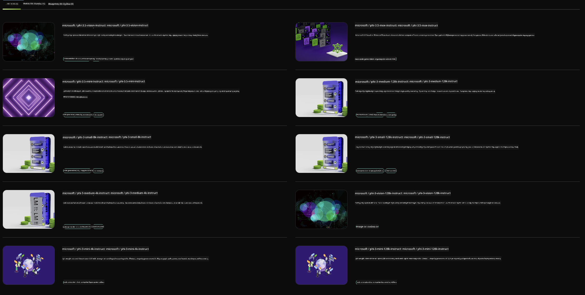

<!--
CO_OP_TRANSLATOR_METADATA:
{
  "original_hash": "7b08e277df2a9307f861ae54bc30c772",
  "translation_date": "2025-05-09T09:53:49+00:00",
  "source_file": "md/01.Introduction/02/06.NVIDIA.md",
  "language_code": "el"
}
-->
## Οικογένεια Phi στο NVIDIA NIM

Το NVIDIA NIM είναι ένα σύνολο εύχρηστων μικροϋπηρεσιών σχεδιασμένων να επιταχύνουν την ανάπτυξη μοντέλων γεννητικής AI στο cloud, στα data centers και στους σταθμούς εργασίας. Τα NIM κατηγοριοποιούνται ανά οικογένεια μοντέλων και ανά μοντέλο. Για παράδειγμα, το NVIDIA NIM για μεγάλα γλωσσικά μοντέλα (LLMs) φέρνει τη δύναμη των πιο σύγχρονων LLMs σε επιχειρησιακές εφαρμογές, παρέχοντας ασύγκριτες δυνατότητες επεξεργασίας και κατανόησης φυσικής γλώσσας.

Το NIM διευκολύνει τις ομάδες IT και DevOps να φιλοξενήσουν μόνες τους μεγάλα γλωσσικά μοντέλα (LLMs) σε δικά τους διαχειριζόμενα περιβάλλοντα, ενώ ταυτόχρονα παρέχει στους προγραμματιστές βιομηχανικά πρότυπα APIs που τους επιτρέπουν να δημιουργούν ισχυρούς βοηθούς, chatbots και AI assistants που μπορούν να μεταμορφώσουν την επιχείρησή τους. Αξιοποιώντας την προηγμένη επιτάχυνση GPU της NVIDIA και την κλιμακούμενη ανάπτυξη, το NIM προσφέρει την ταχύτερη διαδρομή προς την εκτέλεση με ασύγκριτη απόδοση.

Μπορείτε να χρησιμοποιήσετε το NVIDIA NIM για την εκτέλεση inference στα μοντέλα της οικογένειας Phi



### **Παραδείγματα - Phi-3-Vision στο NVIDIA NIM**

Φανταστείτε ότι έχετε μια εικόνα (`demo.png`) και θέλετε να δημιουργήσετε Python κώδικα που επεξεργάζεται αυτή την εικόνα και αποθηκεύει μια νέα έκδοσή της (`phi-3-vision.jpg`).

Ο παραπάνω κώδικας αυτοματοποιεί αυτή τη διαδικασία κάνοντας:

1. Τη ρύθμιση του περιβάλλοντος και των απαραίτητων ρυθμίσεων.
2. Τη δημιουργία ενός prompt που δίνει οδηγίες στο μοντέλο να παράγει τον απαιτούμενο Python κώδικα.
3. Την αποστολή του prompt στο μοντέλο και τη συλλογή του παραγόμενου κώδικα.
4. Την εξαγωγή και εκτέλεση του παραγόμενου κώδικα.
5. Την εμφάνιση της αρχικής και της επεξεργασμένης εικόνας.

Αυτή η προσέγγιση αξιοποιεί τη δύναμη της AI για να αυτοματοποιήσει εργασίες επεξεργασίας εικόνας, καθιστώντας πιο εύκολη και γρήγορη την επίτευξη των στόχων σας.

[Sample Code Solution](../../../../../code/06.E2E/E2E_Nvidia_NIM_Phi3_Vision.ipynb)

Ας αναλύσουμε τι κάνει ο κώδικας βήμα προς βήμα:

1. **Εγκατάσταση Απαιτούμενου Πακέτου**:
    ```python
    !pip install langchain_nvidia_ai_endpoints -U
    ```
    Αυτή η εντολή εγκαθιστά το πακέτο `langchain_nvidia_ai_endpoints`, διασφαλίζοντας ότι είναι η πιο πρόσφατη έκδοση.

2. **Εισαγωγή Απαραίτητων Μονάδων**:
    ```python
    from langchain_nvidia_ai_endpoints import ChatNVIDIA
    import getpass
    import os
    import base64
    ```
    Αυτές οι εισαγωγές φέρνουν τις απαραίτητες μονάδες για την αλληλεπίδραση με τα NVIDIA AI endpoints, τη διαχείριση κωδικών πρόσβασης με ασφάλεια, την αλληλεπίδραση με το λειτουργικό σύστημα και την κωδικοποίηση/αποκωδικοποίηση δεδομένων σε μορφή base64.

3. **Ρύθμιση Κλειδιού API**:
    ```python
    if not os.getenv("NVIDIA_API_KEY"):
        os.environ["NVIDIA_API_KEY"] = getpass.getpass("Enter your NVIDIA API key: ")
    ```
    Αυτός ο κώδικας ελέγχει αν η μεταβλητή περιβάλλοντος `NVIDIA_API_KEY` έχει οριστεί. Αν όχι, ζητά από τον χρήστη να εισάγει με ασφάλεια το κλειδί API.

4. **Ορισμός Μοντέλου και Διαδρομής Εικόνας**:
    ```python
    model = 'microsoft/phi-3-vision-128k-instruct'
    chat = ChatNVIDIA(model=model)
    img_path = './imgs/demo.png'
    ```
    Εδώ ορίζεται το μοντέλο που θα χρησιμοποιηθεί, δημιουργείται ένα αντικείμενο `ChatNVIDIA` με το συγκεκριμένο μοντέλο και ορίζεται η διαδρομή προς το αρχείο εικόνας.

5. **Δημιουργία Κειμενικού Prompt**:
    ```python
    text = "Please create Python code for image, and use plt to save the new picture under imgs/ and name it phi-3-vision.jpg."
    ```
    Ορίζεται ένα κείμενο prompt που δίνει οδηγίες στο μοντέλο να δημιουργήσει Python κώδικα για την επεξεργασία μιας εικόνας.

6. **Κωδικοποίηση Εικόνας σε Base64**:
    ```python
    with open(img_path, "rb") as f:
        image_b64 = base64.b64encode(f.read()).decode()
    image = f''
    ```
    Αυτός ο κώδικας διαβάζει το αρχείο εικόνας, το κωδικοποιεί σε base64 και δημιουργεί μια ετικέτα HTML εικόνας με τα κωδικοποιημένα δεδομένα.

7. **Συνδυασμός Κειμένου και Εικόνας σε Prompt**:
    ```python
    prompt = f"{text} {image}"
    ```
    Εδώ συνδυάζεται το κειμενικό prompt με την ετικέτα HTML της εικόνας σε ένα ενιαίο string.

8. **Δημιουργία Κώδικα με ChatNVIDIA**:
    ```python
    code = ""
    for chunk in chat.stream(prompt):
        print(chunk.content, end="")
        code += chunk.content
    ```
    Αυτός ο κώδικας στέλνει το prompt στο `ChatNVIDIA` model and collects the generated code in chunks, printing and appending each chunk to the `code` string.

9. **Εξαγωγή Python Κώδικα από το Παραγόμενο Περιεχόμενο**:
    ```python
    begin = code.index('```python') + 9
    code = code[begin:]
    end = code.index('```')
    code = code[:end]
    ```
    Εξάγεται ο πραγματικός Python κώδικας από το παραγόμενο περιεχόμενο αφαιρώντας τη μορφοποίηση markdown.

10. **Εκτέλεση του Παραγόμενου Κώδικα**:
    ```python
    import subprocess
    result = subprocess.run(["python", "-c", code], capture_output=True)
    ```
    Εκτελείται ο εξαγόμενος Python κώδικας ως subprocess και καταγράφεται η έξοδός του.

11. **Εμφάνιση Εικόνων**:
    ```python
    from IPython.display import Image, display
    display(Image(filename='./imgs/phi-3-vision.jpg'))
    display(Image(filename='./imgs/demo.png'))
    ```
    Αυτές οι γραμμές εμφανίζουν τις εικόνες χρησιμοποιώντας το module `IPython.display`.

**Αποποίηση Ευθύνης**:  
Αυτό το έγγραφο έχει μεταφραστεί χρησιμοποιώντας την υπηρεσία αυτόματης μετάφρασης AI [Co-op Translator](https://github.com/Azure/co-op-translator). Παρόλο που επιδιώκουμε ακρίβεια, παρακαλούμε να γνωρίζετε ότι οι αυτόματες μεταφράσεις μπορεί να περιέχουν σφάλματα ή ανακρίβειες. Το πρωτότυπο έγγραφο στη γλώσσα του θεωρείται η επίσημη πηγή. Για κρίσιμες πληροφορίες, συνιστάται επαγγελματική ανθρώπινη μετάφραση. Δεν φέρουμε ευθύνη για τυχόν παρεξηγήσεις ή λανθασμένες ερμηνείες που προκύπτουν από τη χρήση αυτής της μετάφρασης.