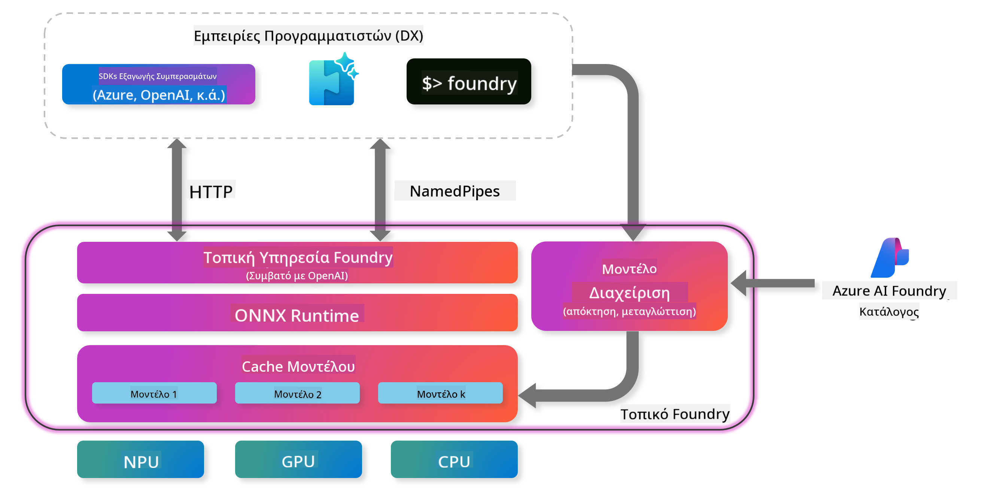
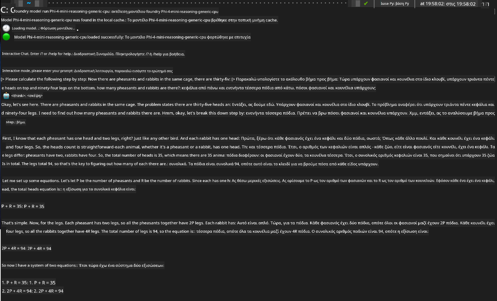

<!--
CO_OP_TRANSLATOR_METADATA:
{
  "original_hash": "52973a5680a65a810aa80b7036afd31f",
  "translation_date": "2025-07-16T19:46:50+00:00",
  "source_file": "md/01.Introduction/02/07.FoundryLocal.md",
  "language_code": "el"
}
-->
## Ξεκινώντας με τα Μοντέλα Phi-Family στο Foundry Local

### Εισαγωγή στο Foundry Local

Το Foundry Local είναι μια ισχυρή λύση AI inference που εκτελείται στη συσκευή, φέρνοντας δυνατότητες AI επιπέδου επιχείρησης απευθείας στο τοπικό σας υλικό. Αυτό το σεμινάριο θα σας καθοδηγήσει στη ρύθμιση και χρήση των μοντέλων Phi-Family με το Foundry Local, προσφέροντάς σας πλήρη έλεγχο των AI εργασιών σας, διατηρώντας παράλληλα την ιδιωτικότητα και μειώνοντας τα κόστη.

Το Foundry Local προσφέρει πλεονεκτήματα σε απόδοση, ιδιωτικότητα, προσαρμογή και κόστος, εκτελώντας τα μοντέλα AI τοπικά στη συσκευή σας. Ενσωματώνεται άψογα στις υπάρχουσες ροές εργασίας και εφαρμογές σας μέσω ενός εύχρηστου CLI, SDK και REST API.




### Γιατί να επιλέξετε το Foundry Local;

Η κατανόηση των πλεονεκτημάτων του Foundry Local θα σας βοηθήσει να πάρετε τεκμηριωμένες αποφάσεις για τη στρατηγική ανάπτυξης AI σας:

- **Inference στη συσκευή:** Εκτελέστε μοντέλα τοπικά στο δικό σας υλικό, μειώνοντας τα κόστη και κρατώντας όλα τα δεδομένα στη συσκευή σας.

- **Προσαρμογή μοντέλων:** Επιλέξτε από προκαθορισμένα μοντέλα ή χρησιμοποιήστε τα δικά σας για να καλύψετε συγκεκριμένες ανάγκες και περιπτώσεις χρήσης.

- **Οικονομία κόστους:** Αποφύγετε τα επαναλαμβανόμενα κόστη υπηρεσιών cloud χρησιμοποιώντας το υπάρχον υλικό σας, καθιστώντας το AI πιο προσιτό.

- **Απρόσκοπτη ενσωμάτωση:** Συνδεθείτε με τις εφαρμογές σας μέσω SDK, API endpoints ή CLI, με εύκολη κλιμάκωση στο Azure AI Foundry καθώς αυξάνονται οι ανάγκες σας.

> **Getting Started Note:** Αυτό το σεμινάριο εστιάζει στη χρήση του Foundry Local μέσω CLI και SDK. Θα μάθετε και τις δύο μεθόδους για να επιλέξετε την καλύτερη για την περίπτωσή σας.

## Μέρος 1: Ρύθμιση του Foundry Local CLI

### Βήμα 1: Εγκατάσταση

Το Foundry Local CLI είναι η πύλη σας για τη διαχείριση και εκτέλεση μοντέλων AI τοπικά. Ας ξεκινήσουμε με την εγκατάστασή του στο σύστημά σας.

**Υποστηριζόμενες πλατφόρμες:** Windows και macOS

Για λεπτομερείς οδηγίες εγκατάστασης, παρακαλούμε ανατρέξτε στην [επίσημη τεκμηρίωση Foundry Local](https://github.com/microsoft/Foundry-Local/blob/main/README.md).

### Βήμα 2: Εξερεύνηση διαθέσιμων μοντέλων

Αφού εγκαταστήσετε το Foundry Local CLI, μπορείτε να δείτε ποια μοντέλα είναι διαθέσιμα για την περίπτωσή σας. Αυτή η εντολή θα σας δείξει όλα τα υποστηριζόμενα μοντέλα:


```bash
foundry model list
```

### Βήμα 3: Κατανόηση των μοντέλων Phi Family

Η οικογένεια Phi προσφέρει μια σειρά μοντέλων βελτιστοποιημένων για διαφορετικές χρήσεις και διαμορφώσεις υλικού. Εδώ είναι τα διαθέσιμα μοντέλα Phi στο Foundry Local:

**Διαθέσιμα μοντέλα Phi:** 

- **phi-3.5-mini** - Συμπαγές μοντέλο για βασικές εργασίες
- **phi-3-mini-128k** - Έκδοση με εκτεταμένο πλαίσιο για μεγαλύτερες συνομιλίες
- **phi-3-mini-4k** - Πρότυπο μοντέλο με πλαίσιο για γενική χρήση
- **phi-4** - Προηγμένο μοντέλο με βελτιωμένες δυνατότητες
- **phi-4-mini** - Ελαφριά έκδοση του Phi-4
- **phi-4-mini-reasoning** - Εξειδικευμένο για σύνθετες εργασίες λογικής

> **Συμβατότητα υλικού:** Κάθε μοντέλο μπορεί να ρυθμιστεί για διαφορετική επιτάχυνση υλικού (CPU, GPU) ανάλογα με τις δυνατότητες του συστήματός σας.

### Βήμα 4: Εκτέλεση του πρώτου σας μοντέλου Phi

Ας ξεκινήσουμε με ένα πρακτικό παράδειγμα. Θα εκτελέσουμε το μοντέλο `phi-4-mini-reasoning`, το οποίο διαπρέπει στην επίλυση σύνθετων προβλημάτων βήμα προς βήμα.


**Εντολή για εκτέλεση του μοντέλου:**

```bash
foundry model run Phi-4-mini-reasoning-generic-cpu
```

> **Πρώτη ρύθμιση:** Όταν εκτελείτε ένα μοντέλο για πρώτη φορά, το Foundry Local θα το κατεβάσει αυτόματα στη συσκευή σας. Ο χρόνος λήψης εξαρτάται από την ταχύτητα του δικτύου σας, οπότε παρακαλούμε να έχετε υπομονή κατά την αρχική ρύθμιση.

### Βήμα 5: Δοκιμή του μοντέλου με ένα πραγματικό πρόβλημα

Τώρα ας δοκιμάσουμε το μοντέλο μας με ένα κλασικό πρόβλημα λογικής για να δούμε πώς εκτελεί τη λογική ανάλυση βήμα προς βήμα:

**Παράδειγμα προβλήματος:**

```txt
Please calculate the following step by step: Now there are pheasants and rabbits in the same cage, there are thirty-five heads on top and ninety-four legs on the bottom, how many pheasants and rabbits are there?
```

**Αναμενόμενη συμπεριφορά:** Το μοντέλο θα πρέπει να αναλύσει το πρόβλημα σε λογικά βήματα, χρησιμοποιώντας το γεγονός ότι οι φασιανοί έχουν 2 πόδια και τα κουνέλια 4 πόδια για να λύσει το σύστημα εξισώσεων.

**Αποτελέσματα:**



## Μέρος 2: Δημιουργία εφαρμογών με το Foundry Local SDK

### Γιατί να χρησιμοποιήσετε το SDK;

Ενώ το CLI είναι ιδανικό για δοκιμές και γρήγορες αλληλεπιδράσεις, το SDK σας επιτρέπει να ενσωματώσετε το Foundry Local στις εφαρμογές σας προγραμματιστικά. Αυτό ανοίγει δυνατότητες για:

- Δημιουργία προσαρμοσμένων εφαρμογών με AI
- Δημιουργία αυτοματοποιημένων ροών εργασίας
- Ενσωμάτωση δυνατοτήτων AI σε υπάρχοντα συστήματα
- Ανάπτυξη chatbots και διαδραστικών εργαλείων

### Υποστηριζόμενες γλώσσες προγραμματισμού

Το Foundry Local παρέχει υποστήριξη SDK για πολλές γλώσσες προγραμματισμού ώστε να ταιριάζει στις προτιμήσεις σας:

**📦 Διαθέσιμα SDK:**

- **C# (.NET):** [SDK Documentation & Examples](https://github.com/microsoft/Foundry-Local/tree/main/sdk/cs)
- **Python:** [SDK Documentation & Examples](https://github.com/microsoft/Foundry-Local/tree/main/sdk/python)
- **JavaScript:** [SDK Documentation & Examples](https://github.com/microsoft/Foundry-Local/tree/main/sdk/js)
- **Rust:** [SDK Documentation & Examples](https://github.com/microsoft/Foundry-Local/tree/main/sdk/rust)

### Επόμενα βήματα

1. **Επιλέξτε το SDK που προτιμάτε** ανάλογα με το περιβάλλον ανάπτυξής σας
2. **Ακολουθήστε την τεκμηρίωση του SDK** για λεπτομερείς οδηγίες υλοποίησης
3. **Ξεκινήστε με απλά παραδείγματα** πριν προχωρήσετε σε πιο σύνθετες εφαρμογές
4. **Εξερευνήστε τον δείγμα κώδικα** που παρέχεται σε κάθε αποθετήριο SDK

## Συμπέρασμα

Τώρα έχετε μάθει πώς να:
- ✅ Εγκαθιστάτε και ρυθμίζετε το Foundry Local CLI
- ✅ Ανακαλύπτετε και εκτελείτε μοντέλα Phi Family
- ✅ Δοκιμάζετε μοντέλα με πραγματικά προβλήματα
- ✅ Κατανοείτε τις επιλογές SDK για ανάπτυξη εφαρμογών

Το Foundry Local προσφέρει μια ισχυρή βάση για να φέρετε τις δυνατότητες AI απευθείας στο τοπικό σας περιβάλλον, δίνοντάς σας έλεγχο στην απόδοση, την ιδιωτικότητα και το κόστος, ενώ διατηρεί την ευελιξία να κλιμακωθείτε σε λύσεις cloud όταν χρειαστεί.

**Αποποίηση ευθυνών**:  
Αυτό το έγγραφο έχει μεταφραστεί χρησιμοποιώντας την υπηρεσία αυτόματης μετάφρασης AI [Co-op Translator](https://github.com/Azure/co-op-translator). Παρόλο που επιδιώκουμε την ακρίβεια, παρακαλούμε να λάβετε υπόψη ότι οι αυτόματες μεταφράσεις ενδέχεται να περιέχουν λάθη ή ανακρίβειες. Το πρωτότυπο έγγραφο στη γλώσσα του θεωρείται η αυθεντική πηγή. Για κρίσιμες πληροφορίες, συνιστάται επαγγελματική ανθρώπινη μετάφραση. Δεν φέρουμε ευθύνη για τυχόν παρεξηγήσεις ή λανθασμένες ερμηνείες που προκύπτουν από τη χρήση αυτής της μετάφρασης.